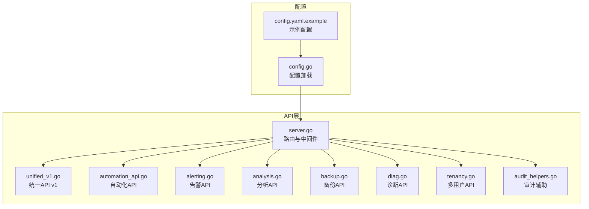
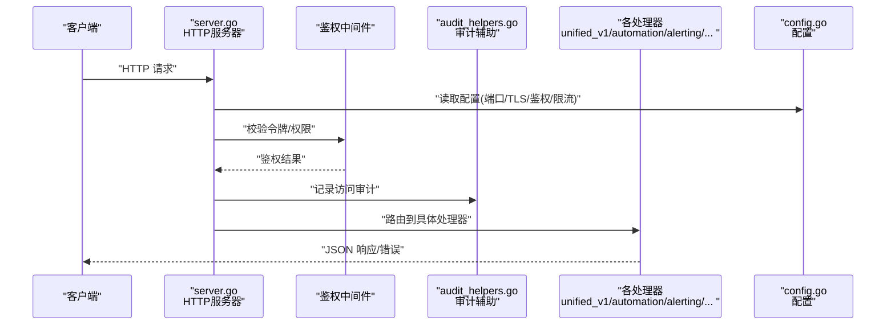
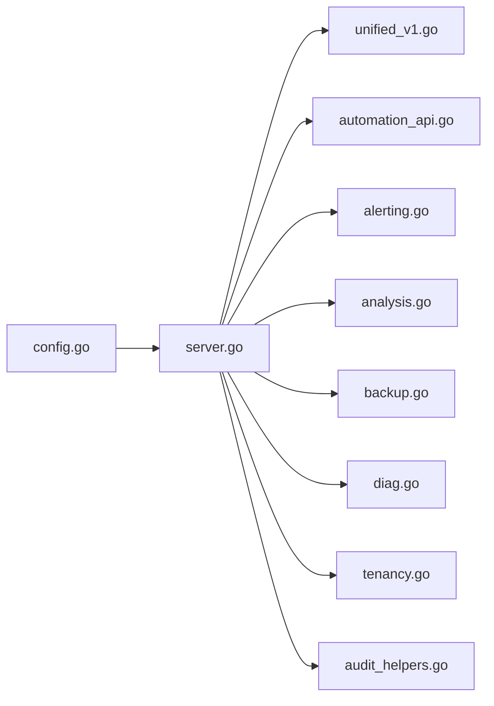

# API参考

<cite>
**本文引用的文件**   
- [internal/api/server.go](file://internal/api/server.go)
- [internal/api/unified_v1.go](file://internal/api/unified_v1.go)
- [internal/api/automation_api.go](file://internal/api/automation_api.go)
- [internal/api/alerting.go](file://internal/api/alerting.go)
- [internal/api/analysis.go](file://internal/api/analysis.go)
- [internal/api/backup.go](file://internal/api/backup.go)
- [internal/api/diag.go](file://internal/api/diag.go)
- [internal/api/tenancy.go](file://internal/api/tenancy.go)
- [internal/api/audit_helpers.go](file://internal/api/audit_helpers.go)
- [internal/config/config.go](file://internal/config/config.go)
- [configs/config.yaml.example](file://configs/config.yaml.example)
- [go.mod](file://go.mod)
</cite>

## 目录
1. [简介](#简介)
2. [项目结构](#项目结构)
3. [核心组件](#核心组件)
4. [架构总览](#架构总览)
5. [详细组件分析](#详细组件分析)
6. [依赖分析](#依赖分析)
7. [性能考虑](#性能考虑)
8. [故障排查指南](#故障排查指南)
9. [结论](#结论)
10. [附录](#附录)

## 简介
本参考文档面向 Klaw 平台的 RESTful API，提供统一的接口规范、认证与安全策略、错误处理约定、版本与兼容性说明、速率限制建议以及客户端实现与性能优化指南。文档基于代码库中的 HTTP 路由与服务定义进行梳理，帮助开发者快速集成与扩展。

## 项目结构
Klaw 的 API 层位于 internal/api 目录，采用按功能域划分的处理器文件组织方式；统一入口由 server.go 负责注册路由与中间件。配置通过 internal/config 与 configs 目录管理。

图表来源
- [internal/api/server.go](file://internal/api/server.go)
- [internal/api/unified_v1.go](file://internal/api/unified_v1.go)
- [internal/api/automation_api.go](file://internal/api/automation_api.go)
- [internal/api/alerting.go](file://internal/api/alerting.go)
- [internal/api/analysis.go](file://internal/api/analysis.go)
- [internal/api/backup.go](file://internal/api/backup.go)
- [internal/api/diag.go](file://internal/api/diag.go)
- [internal/api/tenancy.go](file://internal/api/tenancy.go)
- [internal/api/audit_helpers.go](file://internal/api/audit_helpers.go)
- [internal/config/config.go](file://internal/config/config.go)
- [configs/config.yaml.example](file://configs/config.yaml.example)

章节来源
- [internal/api/server.go](file://internal/api/server.go)
- [internal/config/config.go](file://internal/config/config.go)
- [configs/config.yaml.example](file://configs/config.yaml.example)

## 核心组件
- 路由与中间件：负责HTTP请求分发、鉴权、审计、限流等横切关注点。
- 领域处理器：按功能域划分（统一API、自动化、告警、分析、备份、诊断、多租户），每个处理器暴露一组REST端点。
- 配置系统：集中管理服务端口、TLS、鉴权、日志、审计、限流等运行时参数。

章节来源
- [internal/api/server.go](file://internal/api/server.go)
- [internal/api/unified_v1.go](file://internal/api/unified_v1.go)
- [internal/api/automation_api.go](file://internal/api/automation_api.go)
- [internal/api/alerting.go](file://internal/api/alerting.go)
- [internal/api/analysis.go](file://internal/api/analysis.go)
- [internal/api/backup.go](file://internal/api/backup.go)
- [internal/api/diag.go](file://internal/api/diag.go)
- [internal/api/tenancy.go](file://internal/api/tenancy.go)
- [internal/config/config.go](file://internal/config/config.go)

## 架构总览
下图展示从客户端到各业务处理器的调用路径，以及配置注入与审计辅助的使用关系。

图表来源
- [internal/api/server.go](file://internal/api/server.go)
- [internal/api/audit_helpers.go](file://internal/api/audit_helpers.go)
- [internal/config/config.go](file://internal/config/config.go)

## 详细组件分析

### 统一API v1（/api/v1）
- 目标：提供跨领域的统一数据查询与操作入口，便于前端与第三方系统集成。
- 典型方法：GET/POST/PUT/DELETE，资源路径以 /api/v1/{resource} 形式组织。
- 请求体：标准 JSON 结构，包含分页、过滤、排序字段（如 page、size、filter、sort）。
- 响应体：统一包装 {code, message, data}，data 为具体资源对象或列表。
- 认证：默认启用 Token/Bearer 鉴权，支持可选的会话模式。
- 错误码：遵循 HTTP 状态码 + code 字段双重提示。

章节来源
- [internal/api/unified_v1.go](file://internal/api/unified_v1.go)

### 自动化API（/api/automation）
- 目标：编排与执行自动化任务（如批量变更、回滚、巡检）。
- 典型方法：
  - POST /api/automation/jobs：创建并触发任务
  - GET /api/automation/jobs/{id}：查询任务状态
  - DELETE /api/automation/jobs/{id}：取消任务
- 请求体：包含任务类型、参数、优先级、超时等。
- 响应体：返回任务ID与初始状态，后续轮询获取进度。
- 安全：需具备自动化执行权限；敏感参数加密传输。

章节来源
- [internal/api/automation_api.go](file://internal/api/automation_api.go)

### 告警API（/api/alerting）
- 目标：订阅与消费告警事件，支持规则管理与通知渠道。
- 典型方法：
  - GET /api/alerting/rules：列出告警规则
  - POST /api/alerting/rules：新增/更新规则
  - GET /api/alerting/events：拉取告警事件
  - POST /api/alerting/events/ack：确认告警
- 请求体：规则表达式、阈值、通知渠道配置。
- 响应体：规则ID、事件ID、状态与时间戳。
- 安全：读写分离，写操作需管理员权限。

章节来源
- [internal/api/alerting.go](file://internal/api/alerting.go)

### 分析API（/api/analysis）
- 目标：提供集群/节点/工作负载等多维度的分析与报告能力。
- 典型方法：
  - POST /api/analysis/run：启动分析任务
  - GET /api/analysis/results/{id}：获取分析报告
  - GET /api/analysis/history：历史分析记录
- 请求体：分析范围、指标集合、输出格式。
- 响应体：报告摘要、关键问题与建议。
- 性能：大体积报告异步生成，支持分页与增量拉取。

章节来源
- [internal/api/analysis.go](file://internal/api/analysis.go)

### 备份API（/api/backup）
- 目标：管理集群与配置的备份与恢复。
- 典型方法：
  - POST /api/backup/create：创建备份
  - GET /api/backup/list：列出备份清单
  - POST /api/backup/restore：执行恢复
  - DELETE /api/backup/{id}：删除备份
- 请求体：备份范围、存储位置、加密选项。
- 响应体：任务ID、进度、结果摘要。
- 安全：恢复操作需高权限；备份数据落盘加密。

章节来源
- [internal/api/backup.go](file://internal/api/backup.go)

### 诊断API（/api/diag）
- 目标：在线采集与诊断集群健康、网络、存储、GPU等资源问题。
- 典型方法：
  - POST /api/diag/collect：发起采集
  - GET /api/diag/reports/{id}：获取诊断报告
  - GET /api/diag/suggestions：智能修复建议
- 请求体：采集范围、深度、是否自动修复。
- 响应体：报告链接、问题清单、修复步骤。
- 安全：采集可能涉及敏感信息，需最小权限原则。

章节来源
- [internal/api/diag.go](file://internal/api/diag.go)

### 多租户API（/api/tenancy）
- 目标：管理租户、命名空间隔离与资源配额。
- 典型方法：
  - GET /api/tenancy/tenants：列出租户
  - POST /api/tenancy/tenants：创建租户
  - PUT /api/tenancy/tenants/{id}：更新租户
  - DELETE /api/tenancy/tenants/{id}：删除租户
- 请求体：租户名称、配额、RBAC绑定。
- 响应体：租户ID、状态、配额详情。
- 安全：严格隔离，跨租户访问需显式授权。

章节来源
- [internal/api/tenancy.go](file://internal/api/tenancy.go)

### 审计辅助（audit_helpers）
- 目标：统一记录API访问审计日志，包括用户、动作、资源、结果。
- 使用方式：在处理器中调用审计辅助函数记录关键操作。
- 输出：结构化日志，便于合规与溯源。

章节来源
- [internal/api/audit_helpers.go](file://internal/api/audit_helpers.go)

## 依赖分析
- 路由层依赖配置模块以动态启用鉴权、限流、TLS等特性。
- 各处理器之间保持低耦合，通过统一响应结构与错误码约定协作。
- 审计辅助被多个处理器复用，确保一致的审计策略。

图表来源
- [internal/api/server.go](file://internal/api/server.go)
- [internal/api/unified_v1.go](file://internal/api/unified_v1.go)
- [internal/api/automation_api.go](file://internal/api/automation_api.go)
- [internal/api/alerting.go](file://internal/api/alerting.go)
- [internal/api/analysis.go](file://internal/api/analysis.go)
- [internal/api/backup.go](file://internal/api/backup.go)
- [internal/api/diag.go](file://internal/api/diag.go)
- [internal/api/tenancy.go](file://internal/api/tenancy.go)
- [internal/api/audit_helpers.go](file://internal/api/audit_helpers.go)
- [internal/config/config.go](file://internal/config/config.go)

章节来源
- [internal/api/server.go](file://internal/api/server.go)
- [internal/config/config.go](file://internal/config/config.go)

## 性能考虑
- 分页与过滤：所有列表接口应支持分页与过滤，避免一次性返回大量数据。
- 异步任务：耗时操作（分析、备份、诊断）采用异步任务+轮询机制。
- 缓存策略：对读多写少的静态配置与元数据进行缓存。
- 连接池：对外部依赖（如Kubernetes、消息队列）使用连接池与重试退避。
- 压缩传输：对大响应体启用Gzip压缩。
- 监控与指标：暴露Prometheus指标，跟踪QPS、延迟与错误率。

[本节为通用指导，不直接分析具体文件]

## 故障排查指南
- 常见错误码：
  - 400：请求参数无效或缺失
  - 401：未认证或Token过期
  - 403：权限不足
  - 404：资源不存在
  - 429：触发限流
  - 500：服务端内部错误
- 调试建议：
  - 开启详细日志与审计日志
  - 检查鉴权配置与令牌有效期
  - 验证请求体结构与必填字段
  - 查看后端错误堆栈与依赖服务状态
- 限流与熔断：
  - 根据IP/用户维度设置限流阈值
  - 对下游依赖启用熔断与降级

章节来源
- [internal/api/audit_helpers.go](file://internal/api/audit_helpers.go)
- [internal/config/config.go](file://internal/config/config.go)

## 结论
Klaw 的 RESTful API 采用模块化与领域驱动的组织方式，配合统一的鉴权、审计与配置体系，提供了稳定、可扩展且安全的接口能力。建议客户端遵循分页、异步与错误处理的最佳实践，并结合监控与限流策略保障系统稳定性。

[本节为总结性内容，不直接分析具体文件]

## 附录

### 协议与版本
- 协议：HTTPS（推荐），HTTP（仅内网）
- 版本：/api/v1 作为当前主版本，向后兼容策略见下节
- 内容类型：application/json

章节来源
- [go.mod](file://go.mod)

### 认证与安全
- 认证方式：Bearer Token（JWT/OAuth2），可选会话模式
- 安全头：CORS、HSTS、CSP 建议启用
- 最小权限：按角色分配RBAC，避免共享高权限令牌

章节来源
- [internal/config/config.go](file://internal/config/config.go)
- [configs/config.yaml.example](file://configs/config.yaml.example)

### 错误处理策略
- 统一响应体：{code, message, data}
- 错误分类：客户端错误（4xx）、服务端错误（5xx）
- 幂等性：GET/HEAD/PUT/DELETE 设计遵循幂等原则

章节来源
- [internal/api/unified_v1.go](file://internal/api/unified_v1.go)

### 速率限制
- 限制维度：IP、用户、租户
- 默认策略：滑动窗口计数，突发允许一定倍数
- 响应头：X-RateLimit-Limit、X-RateLimit-Remaining、X-RateLimit-Reset

章节来源
- [internal/config/config.go](file://internal/config/config.go)

### 向后兼容与迁移
- 版本策略：主版本升级可引入破坏性变更，次版本仅增加非破坏性能力
- 迁移指南：
  - 保留旧版路由至少两个主版本周期
  - 提供迁移脚本与字段映射表
  - 在响应头中提示弃用字段与替代方案

章节来源
- [internal/api/unified_v1.go](file://internal/api/unified_v1.go)

### 客户端实现指南
- 重试与退避：对429与5xx实施指数退避
- 超时控制：合理设置连接与读取超时
- 并发控制：限制并发请求数，避免雪崩
- 本地缓存：对只读数据实施短TTL缓存

[本节为通用指导，不直接分析具体文件]

### 常见用例
- 查询资源列表：GET /api/v1/resources?page=1&size=20&filter=status:active
- 创建自动化任务：POST /api/automation/jobs {type:"rollback", params:{...}}
- 启动分析任务：POST /api/analysis/run {scope:"cluster", metrics:["cpu","mem"]}
- 创建备份：POST /api/backup/create {scope:"etcd", storage:"s3"}
- 诊断采集：POST /api/diag/collect {depth:"full", auto_fix:false}
- 管理租户：POST /api/tenancy/tenants {name:"team-a", quota:{cpu:4, mem:8Gi}}

章节来源
- [internal/api/unified_v1.go](file://internal/api/unified_v1.go)
- [internal/api/automation_api.go](file://internal/api/automation_api.go)
- [internal/api/analysis.go](file://internal/api/analysis.go)
- [internal/api/backup.go](file://internal/api/backup.go)
- [internal/api/diag.go](file://internal/api/diag.go)
- [internal/api/tenancy.go](file://internal/api/tenancy.go)