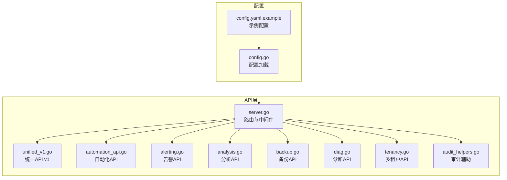
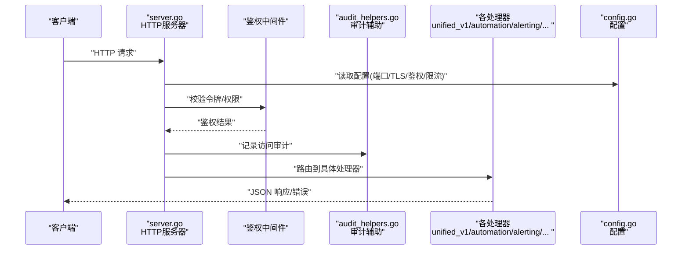
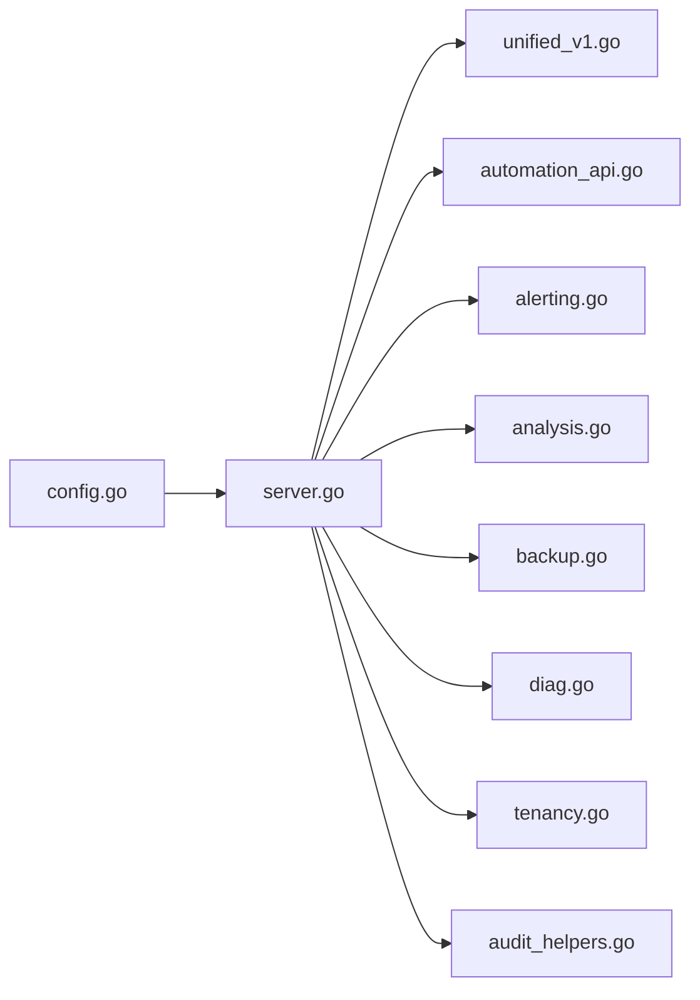

# API参考

<cite>
**本文引用的文件**
- [internal/api/server.go](file://internal/api/server.go)
- [internal/api/unified_v1.go](file://internal/api/unified_v1.go)
- [internal/api/automation_api.go](file://internal/api/automation_api.go)
- [internal/api/alerting.go](file://internal/api/alerting.go)
- [internal/api/analysis.go](file://internal/api/analysis.go)
- [internal/api/backup.go](file://internal/api/backup.go)
- [internal/api/diag.go](file://internal/api/diag.go)
- [internal/api/tenancy.go](file://internal/api/tenancy.go)
- [internal/api/audit_helpers.go](file://internal/api/audit_helpers.go)
- [internal/config/config.go](file://internal/config/config.go)
- [configs/config.yaml.example](file://configs/config.yaml.example)
</cite>

## 更新摘要
**变更内容**
- 新增完整的HTTP API端点规范，涵盖clusters、pods、deployments、services、nodes、events、monitoring、alerts、backups、analysis、automation、multi-tenancy、audit logs和diagnostics等模块
- 更新了路由注册和中间件处理机制
- 增强了统一API v1的通用资源访问能力
- 完善了错误处理和审计日志功能

## 目录
1. [简介](#简介)
2. [项目结构](#项目结构)
3. [核心组件](#核心组件)
4. [架构总览](#架构总览)
5. [详细组件分析](#详细组件分析)
6. [依赖分析](#依赖分析)
7. [性能考虑](#性能考虑)
8. [故障排查指南](#故障排查指南)
9. [结论](#结论)
10. [附录](#附录)

## 简介
本参考文档面向 Klaw 平台的 RESTful API，提供统一的接口规范、认证与安全策略、错误处理约定、版本与兼容性说明、速率限制建议以及客户端实现与性能优化指南。文档基于代码库中的 HTTP 路由与服务定义进行梳理，帮助开发者快速集成与扩展。

## 项目结构
Klaw 的 API 层位于 internal/api 目录，采用按功能域划分的处理器文件组织方式；统一入口由 server.go 负责注册路由与中间件。配置通过 internal/config 与 configs 目录管理。

**图表来源**
- [internal/api/server.go:80-163](file://internal/api/server.go#L80-L163)
- [internal/api/unified_v1.go:36-106](file://internal/api/unified_v1.go#L36-L106)
- [internal/api/automation_api.go:16-28](file://internal/api/automation_api.go#L16-L28)
- [internal/api/alerting.go:12-110](file://internal/api/alerting.go#L12-L110)
- [internal/api/analysis.go:19-71](file://internal/api/analysis.go#L19-L71)
- [internal/api/backup.go:11-63](file://internal/api/backup.go#L11-L63)
- [internal/api/diag.go:10-37](file://internal/api/diag.go#L10-L37)
- [internal/api/tenancy.go:12-125](file://internal/api/tenancy.go#L12-L125)
- [internal/api/audit_helpers.go:9-38](file://internal/api/audit_helpers.go#L9-L38)
- [internal/config/config.go:10-147](file://internal/config/config.go#L10-L147)
- [configs/config.yaml.example:1-36](file://configs/config.yaml.example#L1-L36)

**章节来源**
- [internal/api/server.go:80-163](file://internal/api/server.go#L80-L163)
- [internal/config/config.go:10-147](file://internal/config/config.go#L10-L147)
- [configs/config.yaml.example:1-36](file://configs/config.yaml.example#L1-L36)

## 核心组件
- 路由与中间件：负责HTTP请求分发、鉴权、审计、限流等横切关注点。
- 领域处理器：按功能域划分（统一API、自动化、告警、分析、备份、诊断、多租户），每个处理器暴露一组REST端点。
- 配置系统：集中管理服务端口、TLS、鉴权、日志、审计、限流等运行时参数。

**章节来源**
- [internal/api/server.go:29-78](file://internal/api/server.go#L29-L78)
- [internal/api/unified_v1.go:17-35](file://internal/api/unified_v1.go#L17-L35)
- [internal/api/automation_api.go:16-28](file://internal/api/automation_api.go#L16-L28)
- [internal/api/alerting.go:12-110](file://internal/api/alerting.go#L12-L110)
- [internal/api/analysis.go:19-71](file://internal/api/analysis.go#L19-L71)
- [internal/api/backup.go:11-63](file://internal/api/backup.go#L11-L63)
- [internal/api/diag.go:10-37](file://internal/api/diag.go#L10-L37)
- [internal/api/tenancy.go:12-125](file://internal/api/tenancy.go#L12-L125)
- [internal/config/config.go:60-76](file://internal/config/config.go#L60-L76)

## 架构总览
下图展示从客户端到各业务处理器的调用路径，以及配置注入与审计辅助的使用关系。

**图表来源**
- [internal/api/server.go:189-227](file://internal/api/server.go#L189-L227)
- [internal/api/audit_helpers.go:9-27](file://internal/api/audit_helpers.go#L9-L27)
- [internal/config/config.go:94-147](file://internal/config/config.go#L94-L147)

## 详细组件分析

### 集群管理API（/api/clusters）
- **GET /api/clusters**：获取所有集群列表
- **GET /api/clusters/{name}**：获取指定集群详情
- **GET /api/clusters/{name}/status**：获取集群状态信息
- **GET /api/clusters/{name}/metrics**：获取集群指标数据
- **GET /api/clusters/{name}/namespaces**：获取集群命名空间列表

**章节来源**
- [internal/api/server.go:86-90](file://internal/api/server.go#L86-L90)
- [internal/api/server.go:239-341](file://internal/api/server.go#L239-L341)

### Pod管理API（/api/clusters/{cluster}/pods）
- **GET /api/clusters/{cluster}/pods**：列出所有命名空间的Pods
- **GET /api/clusters/{cluster}/namespaces/{namespace}/pods**：列出特定命名空间的Pods
- **GET /api/clusters/{cluster}/namespaces/{namespace}/pods/{name}**：获取Pod详情
- **GET /api/clusters/{cluster}/namespaces/{namespace}/pods/{name}/logs**：获取Pod日志
- **DELETE /api/clusters/{cluster}/namespaces/{namespace}/pods/{name}**：删除Pod

**章节来源**
- [internal/api/server.go:92-97](file://internal/api/server.go#L92-L97)
- [internal/api/server.go:343-422](file://internal/api/server.go#L343-L422)

### Node管理API（/api/clusters/{cluster}/nodes）
- **GET /api/clusters/{cluster}/nodes**：列出所有节点
- **GET /api/clusters/{cluster}/nodes/{name}**：获取节点详情
- **GET /api/clusters/{cluster}/nodes/metrics**：获取节点指标

**章节来源**
- [internal/api/server.go:99-101](file://internal/api/server.go#L99-L101)
- [internal/api/server.go:424-462](file://internal/api/server.go#L424-L462)

### Event管理API（/api/clusters/{cluster}/events）
- **GET /api/clusters/{cluster}/events**：获取集群事件
- **GET /api/clusters/{cluster}/namespaces/{namespace}/events**：获取命名空间事件

**章节来源**
- [internal/api/server.go:103-104](file://internal/api/server.go#L103-L104)
- [internal/api/server.go:464-476](file://internal/api/server.go#L464-L476)

### Deployment管理API（/api/clusters/{cluster}/deployments）
- **GET /api/clusters/{cluster}/deployments**：列出所有部署
- **GET /api/clusters/{cluster}/namespaces/{namespace}/deployments**：列出命名空间部署
- **GET /api/clusters/{cluster}/namespaces/{namespace}/deployments/{name}**：获取部署详情
- **POST /api/clusters/{cluster}/namespaces/{namespace}/deployments/{name}/scale**：扩缩容部署
- **POST /api/clusters/{cluster}/namespaces/{namespace}/deployments/{name}/restart**：重启部署
- **GET /api/clusters/{cluster}/namespaces/{namespace}/deployments/{name}/pods**：获取部署相关Pods
- **GET /api/clusters/{cluster}/namespaces/{namespace}/deployments/{name}/status**：获取部署状态

**章节来源**
- [internal/api/server.go:106-113](file://internal/api/server.go#L106-L113)
- [internal/api/server.go:478-595](file://internal/api/server.go#L478-L595)

### Service管理API（/api/clusters/{cluster}/services）
- **GET /api/clusters/{cluster}/services**：列出所有服务
- **GET /api/clusters/{cluster}/namespaces/{namespace}/services**：列出命名空间服务
- **GET /api/clusters/{cluster}/namespaces/{namespace}/services/{name}**：获取服务详情
- **GET /api/clusters/{cluster}/namespaces/{namespace}/services/{name}/endpoints**：获取服务端点
- **DELETE /api/clusters/{cluster}/namespaces/{namespace}/services/{name}**：删除服务

**章节来源**
- [internal/api/server.go:115-120](file://internal/api/server.go#L115-L120)
- [internal/api/server.go:636-693](file://internal/api/server.go#L636-L693)

### 监控API（/api/monitoring）
- **GET /api/monitoring/{cluster}/status**：获取监控状态
- **GET /api/monitoring/{cluster}/alerts**：获取监控告警
- **GET /api/monitoring/{cluster}/history**：获取指标历史

**章节来源**
- [internal/api/server.go:126-128](file://internal/api/server.go#L126-L128)
- [internal/api/server.go:597-634](file://internal/api/server.go#L597-L634)

### 告警规则API（/api/clusters/{cluster}/alerts）
- **GET /api/clusters/{cluster}/alerts/rules**：获取告警规则列表
- **POST /api/clusters/{cluster}/alerts/rules**：创建告警规则
- **PUT /api/clusters/{cluster}/alerts/rules/{id}**：更新告警规则
- **DELETE /api/clusters/{cluster}/alerts/rules/{id}**：删除告警规则
- **POST /api/clusters/{cluster}/alerts/evaluate**：评估告警
- **GET /api/clusters/{cluster}/alerts/history**：获取告警历史
- **GET /api/clusters/{cluster}/alerts/stats**：获取告警统计
- **POST /api/clusters/{cluster}/alerts/{id}/acknowledge**：确认告警
- **POST /api/clusters/{cluster}/alerts/{id}/resolve**：解决告警

**章节来源**
- [internal/api/server.go:129-137](file://internal/api/server.go#L129-L137)
- [internal/api/alerting.go:12-110](file://internal/api/alerting.go#L12-L110)

### 备份API（/api/clusters/{cluster}/backups）
- **GET /api/clusters/{cluster}/backups**：获取备份列表
- **POST /api/clusters/{cluster}/backups**：创建备份
- **GET /api/clusters/{cluster}/backups/summary**：获取备份摘要
- **GET /api/clusters/{cluster}/backups/{name}**：获取备份详情
- **DELETE /api/clusters/{cluster}/backups/{name}**：删除备份

**章节来源**
- [internal/api/server.go:138-142](file://internal/api/server.go#L138-L142)
- [internal/api/backup.go:11-63](file://internal/api/backup.go#L11-L63)

### 多租户API（/api/tenants）
- **GET /api/tenants**：获取租户列表
- **POST /api/tenants**：创建租户
- **GET /api/tenants/stats**：获取租户统计
- **GET /api/tenants/{id}**：获取租户详情
- **PUT /api/tenants/{id}**：更新租户
- **DELETE /api/tenants/{id}**：删除租户
- **GET /api/tenant-users**：获取租户用户列表
- **POST /api/tenant-users**：创建租户用户
- **DELETE /api/tenant-users/{id}**：删除租户用户

**章节来源**
- [internal/api/server.go:143-151](file://internal/api/server.go#L143-L151)
- [internal/api/tenancy.go:12-125](file://internal/api/tenancy.go#L12-L125)

### 审计日志API（/api/audit）
- **GET /api/audit/logs**：获取审计日志
- **GET /api/audit/stats**：获取审计统计

**章节来源**
- [internal/api/server.go:152-153](file://internal/api/server.go#L152-L153)
- [internal/api/tenancy.go:112-125](file://internal/api/tenancy.go#L112-L125)

### 分析API（/api/analysis）
- **GET /api/clusters/{cluster}/namespaces/{namespace}/pods/{name}/logs/analysis**：分析Pod日志
- **POST /api/analysis/logs**：分析原始日志
- **GET /api/clusters/{cluster}/rbac/analysis**：分析RBAC权限

**章节来源**
- [internal/api/server.go:122-124](file://internal/api/server.go#L122-L124)
- [internal/api/analysis.go:19-71](file://internal/api/analysis.go#L19-L71)

### 自动化API（/api/v1/automation）
- **GET /api/v1/automation/scripts**：获取脚本列表
- **POST /api/v1/automation/scripts**：创建脚本
- **GET /api/v1/automation/scripts/{id}**：获取脚本详情
- **PUT /api/v1/automation/scripts/{id}**：更新脚本
- **DELETE /api/v1/automation/scripts/{id}**：删除脚本
- **POST /api/v1/automation/scripts/{id}/execute**：执行脚本
- **GET /api/v1/automation/history**：获取执行历史
- **GET /api/v1/automation/statistics**：获取执行统计

**章节来源**
- [internal/api/automation_api.go:16-28](file://internal/api/automation_api.go#L16-L28)
- [internal/api/automation_api.go:30-131](file://internal/api/automation_api.go#L30-L131)

### 诊断API（/api/v1/diag）
- **GET /api/v1/diag/run**：运行诊断
- **GET /api/v1/diag/analyzers**：获取分析器列表

**章节来源**
- [internal/api/server.go:157-158](file://internal/api/server.go#L157-L158)
- [internal/api/diag.go:10-37](file://internal/api/diag.go#L10-L37)

### 统一API v1（/api/v1）
- **目标**：提供跨领域的统一数据查询与操作入口，便于前端与第三方系统集成。
- **典型方法**：GET/POST/PUT/DELETE，资源路径以 /api/v1/{resource} 形式组织。
- **请求体**：标准 JSON 结构，包含分页、过滤、排序字段（如 page、size、filter、sort）。
- **响应体**：统一包装 {code, message, data}，data 为具体资源对象或列表。
- **认证**：默认启用 Token/Bearer 鉴权，支持可选的会话模式。
- **错误码**：遵循 HTTP 状态码 + code 字段双重提示。

**章节来源**
- [internal/api/unified_v1.go:17-35](file://internal/api/unified_v1.go#L17-L35)
- [internal/api/unified_v1.go:36-106](file://internal/api/unified_v1.go#L36-L106)

### 审计辅助（audit_helpers）
- **目标**：统一记录API访问审计日志，包括用户、动作、资源、结果。
- **使用方式**：在处理器中调用审计辅助函数记录关键操作。
- **输出**：结构化日志，便于合规与溯源。

**章节来源**
- [internal/api/audit_helpers.go:9-38](file://internal/api/audit_helpers.go#L9-L38)

## 依赖分析
- 路由层依赖配置模块以动态启用鉴权、限流、TLS等特性。
- 各处理器之间保持低耦合，通过统一响应结构与错误码约定协作。
- 审计辅助被多个处理器复用，确保一致的审计策略。

**图表来源**
- [internal/api/server.go:80-163](file://internal/api/server.go#L80-L163)
- [internal/api/unified_v1.go:36-106](file://internal/api/unified_v1.go#L36-L106)
- [internal/api/automation_api.go:16-28](file://internal/api/automation_api.go#L16-L28)
- [internal/api/alerting.go:12-110](file://internal/api/alerting.go#L12-L110)
- [internal/api/analysis.go:19-71](file://internal/api/analysis.go#L19-L71)
- [internal/api/backup.go:11-63](file://internal/api/backup.go#L11-L63)
- [internal/api/diag.go:10-37](file://internal/api/diag.go#L10-L37)
- [internal/api/tenancy.go:12-125](file://internal/api/tenancy.go#L12-L125)
- [internal/api/audit_helpers.go:9-38](file://internal/api/audit_helpers.go#L9-L38)
- [internal/config/config.go:94-147](file://internal/config/config.go#L94-L147)

**章节来源**
- [internal/api/server.go:80-163](file://internal/api/server.go#L80-L163)
- [internal/config/config.go:94-147](file://internal/config/config.go#L94-L147)

## 性能考虑
- 分页与过滤：所有列表接口应支持分页与过滤，避免一次性返回大量数据。
- 异步任务：耗时操作（分析、备份、诊断）采用异步任务+轮询机制。
- 缓存策略：对读多写少的静态配置与元数据进行缓存。
- 连接池：对外部依赖（如Kubernetes、消息队列）使用连接池与重试退避。
- 压缩传输：对大响应体启用Gzip压缩。
- 监控与指标：暴露Prometheus指标，跟踪QPS、延迟与错误率。

## 故障排查指南
- 常见错误码：
  - 400：请求参数无效或缺失
  - 401：未认证或Token过期
  - 403：权限不足
  - 404：资源不存在
  - 429：触发限流
  - 500：服务端内部错误
- 调试建议：
  - 开启详细日志与审计日志
  - 检查鉴权配置与令牌有效期
  - 验证请求体结构与必填字段
  - 查看后端错误堆栈与依赖服务状态
- 限流与熔断：
  - 根据IP/用户维度设置限流阈值
  - 对下游依赖启用熔断与降级

**章节来源**
- [internal/api/audit_helpers.go:9-38](file://internal/api/audit_helpers.go#L9-L38)
- [internal/config/config.go:94-147](file://internal/config/config.go#L94-L147)

## 结论
Klaw 的 RESTful API 采用模块化与领域驱动的组织方式，配合统一的鉴权、审计与配置体系，提供了稳定、可扩展且安全的接口能力。建议客户端遵循分页、异步与错误处理的最佳实践，并结合监控与限流策略保障系统稳定性。

## 附录

### 协议与版本
- 协议：HTTPS（推荐），HTTP（仅内网）
- 版本：/api/v1 作为当前主版本，向后兼容策略见下节
- 内容类型：application/json

**章节来源**
- [internal/api/server.go:218-227](file://internal/api/server.go#L218-L227)

### 认证与安全
- 认证方式：Bearer Token（JWT/OAuth2），可选会话模式
- 安全头：CORS、HSTS、CSP 建议启用
- 最小权限：按角色分配RBAC，避免共享高权限令牌

**章节来源**
- [internal/config/config.go:67-76](file://internal/config/config.go#L67-L76)
- [configs/config.yaml.example:25-36](file://configs/config.yaml.example#L25-L36)

### 错误处理策略
- 统一响应体：{code, message, data}
- 错误分类：客户端错误（4xx）、服务端错误（5xx）
- 幂等性：GET/HEAD/PUT/DELETE 设计遵循幂等原则

**章节来源**
- [internal/api/server.go:229-237](file://internal/api/server.go#L229-L237)

### 速率限制
- 限制维度：IP、用户、租户
- 默认策略：滑动窗口计数，突发允许一定倍数
- 响应头：X-RateLimit-Limit、X-RateLimit-Remaining、X-RateLimit-Reset

**章节来源**
- [internal/config/config.go:78-91](file://internal/config/config.go#L78-L91)

### 向后兼容与迁移
- 版本策略：主版本升级可引入破坏性变更，次版本仅增加非破坏性能力
- 迁移指南：
  - 保留旧版路由至少两个主版本周期
  - 提供迁移脚本与字段映射表
  - 在响应头中提示弃用字段与替代方案

**章节来源**
- [internal/api/server.go:218-227](file://internal/api/server.go#L218-L227)

### 客户端实现指南
- 重试与退避：对429与5xx实施指数退避
- 超时控制：合理设置连接与读取超时
- 并发控制：限制并发请求数，避免雪崩
- 本地缓存：对只读数据实施短TTL缓存

### 常见用例
- 查询集群列表：GET /api/clusters
- 获取Pod日志：GET /api/clusters/{cluster}/namespaces/{namespace}/pods/{name}/logs
- 扩缩容部署：POST /api/clusters/{cluster}/namespaces/{namespace}/deployments/{name}/scale
- 创建告警规则：POST /api/clusters/{cluster}/alerts/rules
- 创建备份：POST /api/clusters/{cluster}/backups
- 运行诊断：GET /api/v1/diag/run
- 管理租户：POST /api/tenants

**章节来源**
- [internal/api/server.go:86-153](file://internal/api/server.go#L86-L153)
- [internal/api/unified_v1.go:36-106](file://internal/api/unified_v1.go#L36-L106)
- [internal/api/automation_api.go:16-28](file://internal/api/automation_api.go#L16-L28)
- [internal/api/alerting.go:12-110](file://internal/api/alerting.go#L12-L110)
- [internal/api/analysis.go:19-71](file://internal/api/analysis.go#L19-L71)
- [internal/api/backup.go:11-63](file://internal/api/backup.go#L11-L63)
- [internal/api/diag.go:10-37](file://internal/api/diag.go#L10-L37)
- [internal/api/tenancy.go:12-125](file://internal/api/tenancy.go#L12-L125)