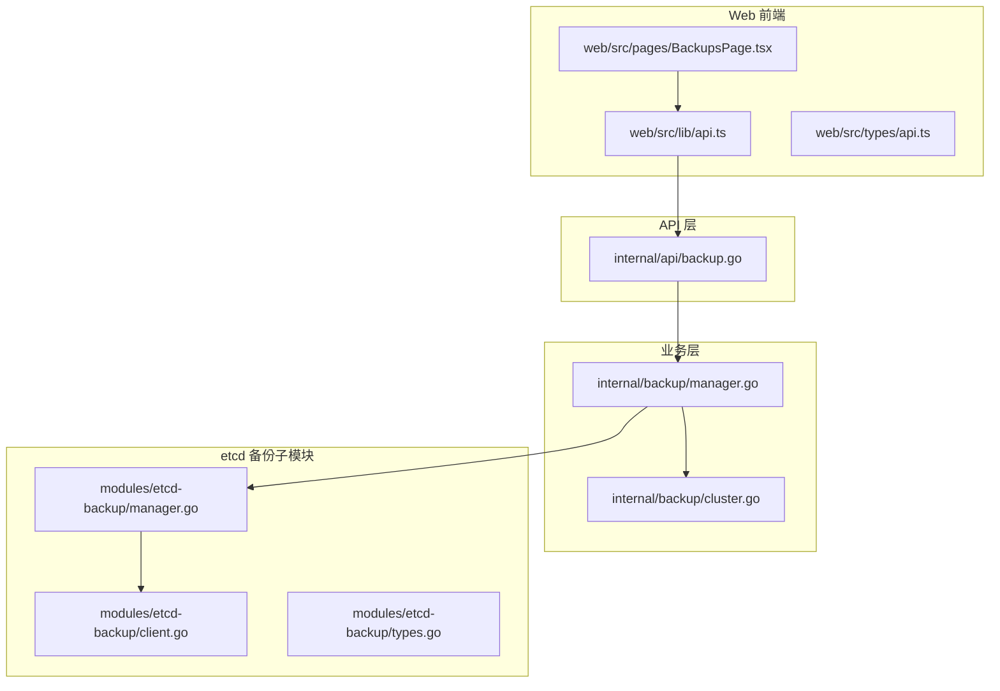
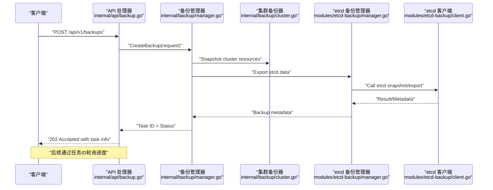
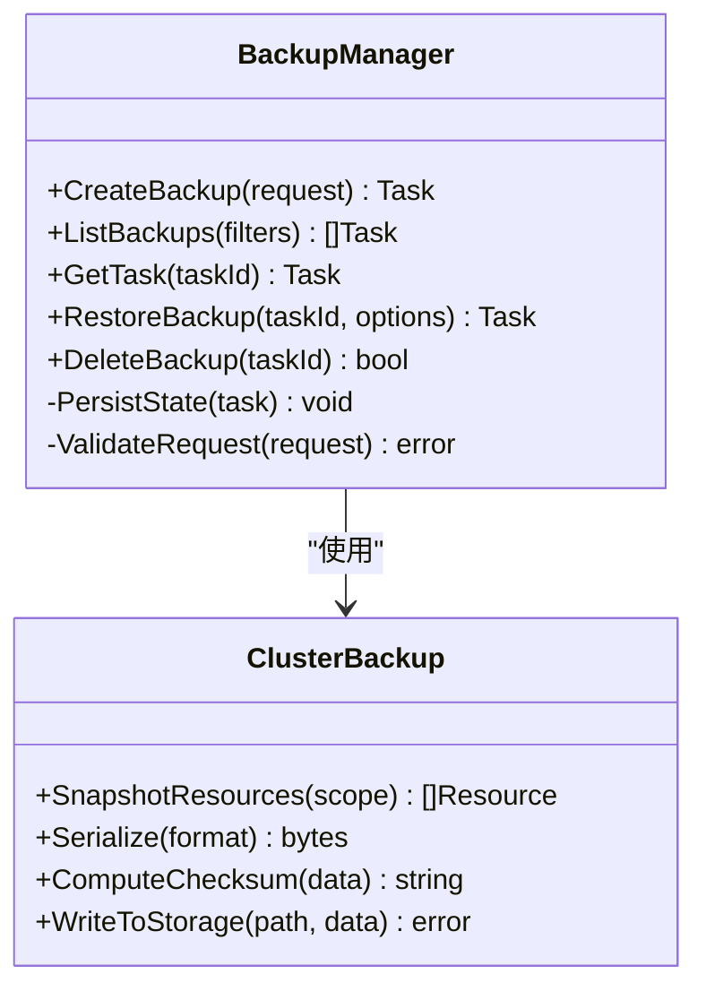
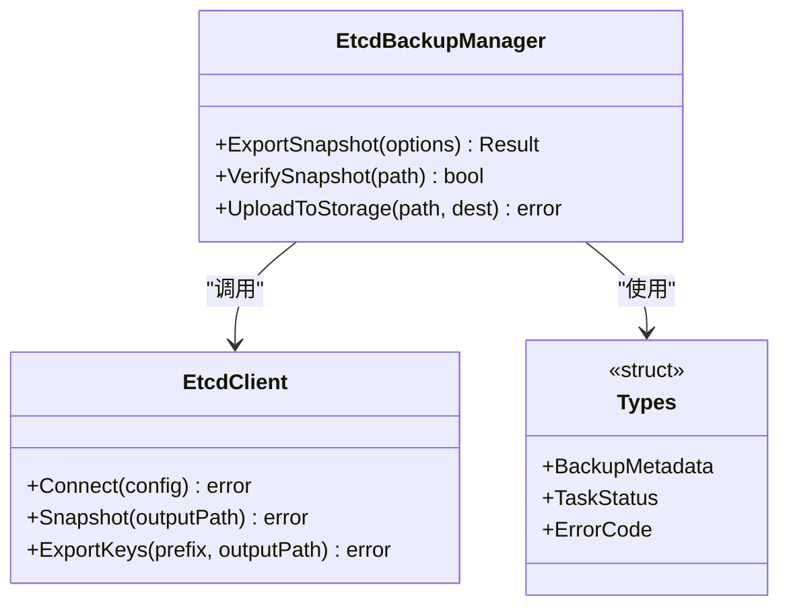
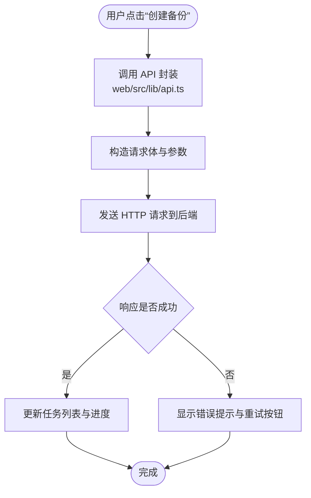
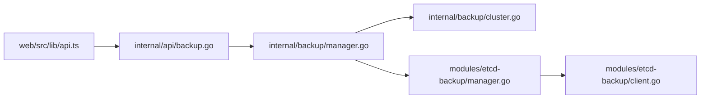

# 备份API

<cite>
**本文引用的文件**   
- [internal/api/backup.go](file://internal/api/backup.go)
- [internal/backup/manager.go](file://internal/backup/manager.go)
- [internal/backup/cluster.go](file://internal/backup/cluster.go)
- [modules/etcd-backup/manager.go](file://modules/etcd-backup/manager.go)
- [modules/etcd-backup/client.go](file://modules/etcd-backup/client.go)
- [modules/etcd-backup/types.go](file://modules/etcd-backup/types.go)
- [web/src/pages/BackupsPage.tsx](file://web/src/pages/BackupsPage.tsx)
- [web/src/lib/api.ts](file://web/src/lib/api.ts)
- [web/src/types/api.ts](file://web/src/types/api.ts)
</cite>

## 目录
1. [简介](#简介)
2. [项目结构](#项目结构)
3. [核心组件](#核心组件)
4. [架构总览](#架构总览)
5. [详细组件分析](#详细组件分析)
6. [依赖分析](#依赖分析)
7. [性能考虑](#性能考虑)
8. [故障排查指南](#故障排查指南)
9. [结论](#结论)
10. [附录](#附录)

## 简介
本文件为 Klaw 平台的备份功能提供完整的 API 文档，覆盖备份创建、查询、恢复、删除等 RESTful 端点，以及备份策略配置、数据导出格式、恢复验证等接口说明。同时给出备份任务管理、进度查询与错误处理的示例路径，并总结数据安全考虑与性能优化建议，帮助开发者快速集成与运维。

## 项目结构
与备份相关的代码主要分布在以下模块：
- API 层：HTTP 路由与请求处理
- 业务层：备份管理器与集群备份逻辑
- etcd 备份子模块：etcd 客户端与类型定义
- Web 前端：备份页面与 API 调用封装

图表来源
- [internal/api/backup.go](file://internal/api/backup.go)
- [internal/backup/manager.go](file://internal/backup/manager.go)
- [internal/backup/cluster.go](file://internal/backup/cluster.go)
- [modules/etcd-backup/manager.go](file://modules/etcd-backup/manager.go)
- [modules/etcd-backup/client.go](file://modules/etcd-backup/client.go)
- [modules/etcd-backup/types.go](file://modules/etcd-backup/types.go)
- [web/src/pages/BackupsPage.tsx](file://web/src/pages/BackupsPage.tsx)
- [web/src/lib/api.ts](file://web/src/lib/api.ts)

章节来源
- [internal/api/backup.go](file://internal/api/backup.go)
- [internal/backup/manager.go](file://internal/backup/manager.go)
- [internal/backup/cluster.go](file://internal/backup/cluster.go)
- [modules/etcd-backup/manager.go](file://modules/etcd-backup/manager.go)
- [modules/etcd-backup/client.go](file://modules/etcd-backup/client.go)
- [modules/etcd-backup/types.go](file://modules/etcd-backup/types.go)
- [web/src/pages/BackupsPage.tsx](file://web/src/pages/BackupsPage.tsx)
- [web/src/lib/api.ts](file://web/src/lib/api.ts)

## 核心组件
- 备份 API 处理器：负责解析请求、参数校验、调用业务层方法并返回统一响应。
- 备份管理器：编排备份生命周期（创建、查询、恢复、删除）、调度与状态跟踪。
- 集群备份器：针对 Kubernetes 集群资源进行快照与导出。
- etcd 备份子模块：封装 etcd 客户端操作、备份元数据与结果类型。
- Web 前端：提供备份页面与 API 调用封装，支持任务列表、进度展示与操作触发。

章节来源
- [internal/api/backup.go](file://internal/api/backup.go)
- [internal/backup/manager.go](file://internal/backup/manager.go)
- [internal/backup/cluster.go](file://internal/backup/cluster.go)
- [modules/etcd-backup/manager.go](file://modules/etcd-backup/manager.go)
- [modules/etcd-backup/client.go](file://modules/etcd-backup/client.go)
- [modules/etcd-backup/types.go](file://modules/etcd-backup/types.go)
- [web/src/pages/BackupsPage.tsx](file://web/src/pages/BackupsPage.tsx)
- [web/src/lib/api.ts](file://web/src/lib/api.ts)

## 架构总览
Klaw 备份功能的整体调用链从 API 层进入，经业务层协调各子系统完成备份或恢复操作，最终通过 etcd 子模块与存储后端交互。

图表来源
- [internal/api/backup.go](file://internal/api/backup.go)
- [internal/backup/manager.go](file://internal/backup/manager.go)
- [internal/backup/cluster.go](file://internal/backup/cluster.go)
- [modules/etcd-backup/manager.go](file://modules/etcd-backup/manager.go)
- [modules/etcd-backup/client.go](file://modules/etcd-backup/client.go)

## 详细组件分析

### API 层：备份相关端点
- 创建备份
  - 方法：POST
  - 路径：/api/v1/backups
  - 请求体：包含备份策略（范围、目标存储、压缩、加密等）
  - 响应：任务ID、状态、预计时间
- 查询备份列表
  - 方法：GET
  - 路径：/api/v1/backups
  - 查询参数：状态、时间范围、分页
  - 响应：备份任务列表及摘要信息
- 查询备份详情与进度
  - 方法：GET
  - 路径：/api/v1/backups/{task_id}
  - 响应：任务状态、阶段、进度百分比、错误信息
- 恢复备份
  - 方法：POST
  - 路径：/api/v1/backups/{task_id}/restore
  - 请求体：恢复选项（目标环境、覆盖策略、验证开关）
  - 响应：新恢复任务ID与状态
- 删除备份
  - 方法：DELETE
  - 路径：/api/v1/backups/{task_id}
  - 响应：确认删除成功或失败原因

章节来源
- [internal/api/backup.go](file://internal/api/backup.go)

### 业务层：备份管理器与集群备份器
- 备份管理器职责
  - 接收 API 请求，校验参数与权限
  - 编排集群资源快照与 etcd 数据导出
  - 生成任务元数据，持久化状态与进度
  - 协调并发与重试，处理异常与回滚
- 集群备份器职责
  - 收集指定命名空间或全量资源清单
  - 序列化导出为指定格式（JSON/YAML）
  - 计算校验和并写入目标存储

图表来源
- [internal/backup/manager.go](file://internal/backup/manager.go)
- [internal/backup/cluster.go](file://internal/backup/cluster.go)

章节来源
- [internal/backup/manager.go](file://internal/backup/manager.go)
- [internal/backup/cluster.go](file://internal/backup/cluster.go)

### etcd 备份子模块
- 管理器：封装 etcd 备份流程，包括连接、导出、校验与结果上报
- 客户端：提供低层 etcd 操作（如快照、键值导出）
- 类型：定义备份元数据、任务状态、错误码等数据结构

图表来源
- [modules/etcd-backup/manager.go](file://modules/etcd-backup/manager.go)
- [modules/etcd-backup/client.go](file://modules/etcd-backup/client.go)
- [modules/etcd-backup/types.go](file://modules/etcd-backup/types.go)

章节来源
- [modules/etcd-backup/manager.go](file://modules/etcd-backup/manager.go)
- [modules/etcd-backup/client.go](file://modules/etcd-backup/client.go)
- [modules/etcd-backup/types.go](file://modules/etcd-backup/types.go)

### Web 前端：备份页面与 API 封装
- 备份页面：展示任务列表、状态、进度条，支持创建、恢复、删除等操作
- API 封装：统一请求构造、错误处理与重试机制
- 类型定义：前后端共享的备份任务与状态类型

图表来源
- [web/src/pages/BackupsPage.tsx](file://web/src/pages/BackupsPage.tsx)
- [web/src/lib/api.ts](file://web/src/lib/api.ts)
- [web/src/types/api.ts](file://web/src/types/api.ts)

章节来源
- [web/src/pages/BackupsPage.tsx](file://web/src/pages/BackupsPage.tsx)
- [web/src/lib/api.ts](file://web/src/lib/api.ts)
- [web/src/types/api.ts](file://web/src/types/api.ts)

## 依赖分析
- API 层依赖业务层的备份管理器与集群备份器
- 业务层依赖 etcd 备份子模块进行 etcd 数据导出与校验
- 前端依赖 API 封装与类型定义，确保前后端一致性

图表来源
- [internal/api/backup.go](file://internal/api/backup.go)
- [internal/backup/manager.go](file://internal/backup/manager.go)
- [internal/backup/cluster.go](file://internal/backup/cluster.go)
- [modules/etcd-backup/manager.go](file://modules/etcd-backup/manager.go)
- [modules/etcd-backup/client.go](file://modules/etcd-backup/client.go)
- [web/src/lib/api.ts](file://web/src/lib/api.ts)

章节来源
- [internal/api/backup.go](file://internal/api/backup.go)
- [internal/backup/manager.go](file://internal/backup/manager.go)
- [internal/backup/cluster.go](file://internal/backup/cluster.go)
- [modules/etcd-backup/manager.go](file://modules/etcd-backup/manager.go)
- [modules/etcd-backup/client.go](file://modules/etcd-backup/client.go)
- [web/src/lib/api.ts](file://web/src/lib/api.ts)

## 性能考虑
- 增量备份：优先实现差异备份以减少数据量与传输时间
- 并行导出：对多命名空间或大对象集采用分片并行导出
- 流式写入：避免内存峰值，使用流式写入目标存储
- 压缩与去重：在传输前启用压缩，必要时引入去重策略
- 缓存元数据：频繁查询的元数据可短期缓存以提升响应速度
- 限流与背压：控制并发度，防止下游存储或 etcd 过载

[本节为通用指导，不直接分析具体文件]

## 故障排查指南
- 常见错误码与含义
  - 参数校验失败：检查请求体字段与必填项
  - 权限不足：确认当前用户具备备份/恢复权限
  - 存储不可用：检查目标存储连通性与配额
  - etcd 连接失败：核对 etcd 地址、证书与网络策略
- 日志定位
  - API 层：记录请求ID、参数与响应码
  - 业务层：记录任务状态变更、阶段耗时与异常堆栈
  - etcd 子模块：记录连接、导出、校验与上传步骤的错误
- 恢复验证
  - 校验和比对：对比导出文件的哈希值
  - 沙箱恢复：在非生产环境先行验证恢复完整性
  - 应用健康检查：恢复后执行关键服务探针

章节来源
- [internal/api/backup.go](file://internal/api/backup.go)
- [internal/backup/manager.go](file://internal/backup/manager.go)
- [modules/etcd-backup/manager.go](file://modules/etcd-backup/manager.go)

## 结论
Klaw 备份功能通过清晰的 API 层与模块化设计，实现了可扩展、可观测且安全的备份与恢复能力。结合合理的策略配置、数据导出格式与恢复验证流程，可有效保障集群数据的可用性与一致性。建议在大规模环境中引入增量备份、并行导出与流式写入等优化手段，进一步提升性能与稳定性。

[本节为总结性内容，不直接分析具体文件]

## 附录
- 备份策略配置要点
  - 范围选择：全量/命名空间/自定义标签
  - 目标存储：S3/OSS/NAS 等后端适配
  - 压缩与加密：开启以节省带宽与保护敏感数据
  - 保留策略：按时间或数量自动清理历史备份
- 数据导出格式
  - JSON/YAML：结构化资源清单，便于二次处理
  - 校验文件：附带哈希与签名，确保完整性
- 示例代码路径
  - API 调用示例：参考 web/src/lib/api.ts
  - 任务进度轮询：参考 web/src/pages/BackupsPage.tsx
  - 错误处理与重试：参考 web/src/lib/api.ts 中的封装逻辑

章节来源
- [web/src/lib/api.ts](file://web/src/lib/api.ts)
- [web/src/pages/BackupsPage.tsx](file://web/src/pages/BackupsPage.tsx)