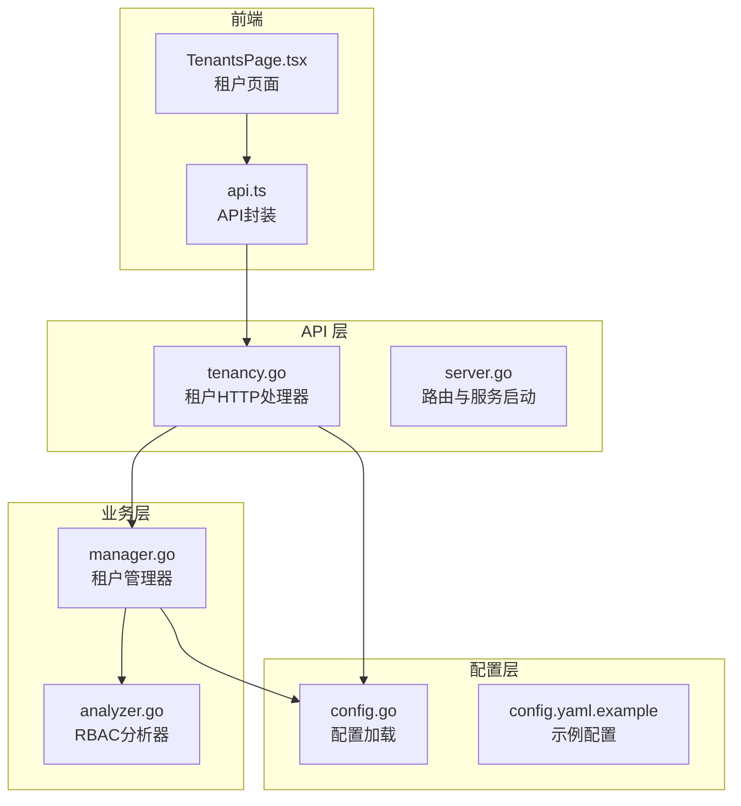
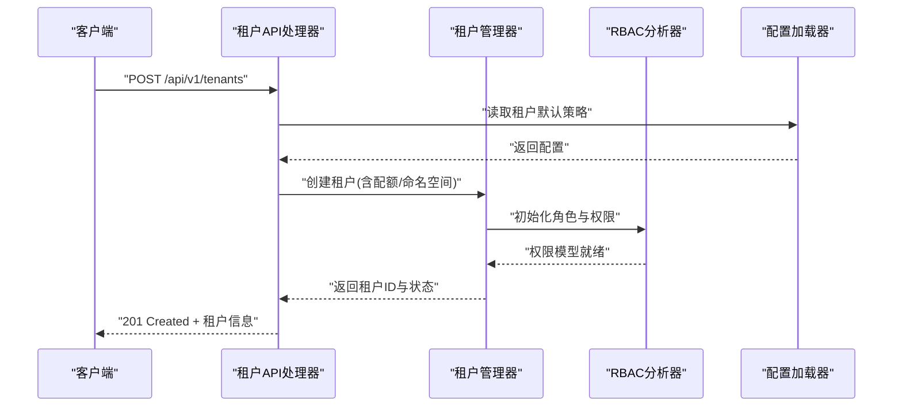
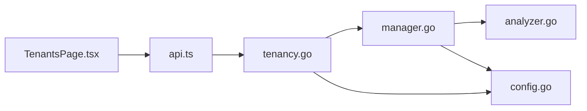

# 租户管理API

<cite>
**本文引用的文件**   
- [internal/api/tenancy.go](file://internal/api/tenancy.go)
- [internal/api/server.go](file://internal/api/server.go)
- [internal/tenancy/manager.go](file://internal/tenancy/manager.go)
- [internal/rbacanalysis/analyzer.go](file://internal/rbacanalysis/analyzer.go)
- [internal/config/config.go](file://internal/config/config.go)
- [web/src/pages/TenantsPage.tsx](file://web/src/pages/TenantsPage.tsx)
- [web/src/lib/api.ts](file://web/src/lib/api.ts)
- [configs/config.yaml.example](file://configs/config.yaml.example)
</cite>

## 目录
1. [简介](#简介)
2. [项目结构](#项目结构)
3. [核心组件](#核心组件)
4. [架构总览](#架构总览)
5. [详细组件分析](#详细组件分析)
6. [依赖分析](#依赖分析)
7. [性能考虑](#性能考虑)
8. [故障排查指南](#故障排查指南)
9. [结论](#结论)
10. [附录](#附录)

## 简介
本文件为 Klaw 平台的多租户管理功能提供完整的 API 文档，覆盖租户创建、配置、权限管理、资源隔离等 RESTful 端点。内容包含：
- 租户生命周期管理（创建、查询、更新、删除）
- RBAC 权限控制与角色绑定
- 命名空间隔离与配额管理
- 多租户环境下的资源访问与安全边界设计
- 典型调用示例与最佳实践

## 项目结构
Klaw 的多租户能力由 API 层、业务管理层与前端页面共同构成：
- API 层：定义并暴露租户相关的 HTTP 接口
- 管理层：实现租户的增删改查、RBAC 与配额策略等核心逻辑
- 配置层：加载多租户相关配置项
- 前端：提供租户管理的可视化界面与调用封装

**图表来源** 
- [internal/api/tenancy.go](file://internal/api/tenancy.go)
- [internal/api/server.go](file://internal/api/server.go)
- [internal/tenancy/manager.go](file://internal/tenancy/manager.go)
- [internal/rbacanalysis/analyzer.go](file://internal/rbacanalysis/analyzer.go)
- [internal/config/config.go](file://internal/config/config.go)
- [configs/config.yaml.example](file://configs/config.yaml.example)
- [web/src/pages/TenantsPage.tsx](file://web/src/pages/TenantsPage.tsx)
- [web/src/lib/api.ts](file://web/src/lib/api.ts)

**章节来源**
- [internal/api/server.go](file://internal/api/server.go)
- [internal/api/tenancy.go](file://internal/api/tenancy.go)
- [internal/tenancy/manager.go](file://internal/tenancy/manager.go)
- [internal/config/config.go](file://internal/config/config.go)
- [configs/config.yaml.example](file://configs/config.yaml.example)
- [web/src/pages/TenantsPage.tsx](file://web/src/pages/TenantsPage.tsx)
- [web/src/lib/api.ts](file://web/src/lib/api.ts)

## 核心组件
- 租户管理器（Manager）：负责租户实体的全生命周期操作、配额策略应用、命名空间隔离策略执行以及与 RBAC 模块的交互。
- 租户 API 处理器：将 HTTP 请求映射到租户管理器的方法，完成参数校验、鉴权、审计日志记录与响应封装。
- RBAC 分析器：提供基于角色的访问控制分析与校验能力，用于租户级权限与资源访问边界控制。
- 配置加载器：读取多租户相关配置（如默认命名空间策略、配额上限、隔离模式等）。

**章节来源**
- [internal/tenancy/manager.go](file://internal/tenancy/manager.go)
- [internal/api/tenancy.go](file://internal/api/tenancy.go)
- [internal/rbacanalysis/analyzer.go](file://internal/rbacanalysis/analyzer.go)
- [internal/config/config.go](file://internal/config/config.go)

## 架构总览
下图展示了租户管理 API 的整体架构与数据流：客户端通过 HTTP 调用 API 处理器，处理器调用租户管理器进行业务处理，必要时与 RBAC 分析器协作完成权限校验，最终返回结构化响应。

**图表来源** 
- [internal/api/tenancy.go](file://internal/api/tenancy.go)
- [internal/tenancy/manager.go](file://internal/tenancy/manager.go)
- [internal/rbacanalysis/analyzer.go](file://internal/rbacanalysis/analyzer.go)
- [internal/config/config.go](file://internal/config/config.go)

## 详细组件分析

### 租户管理 API 端点
以下端点用于租户的创建、查询、更新与删除，以及配额与命名空间策略的配置。所有端点均受鉴权与审计保护。

- 创建租户
  - 方法：POST
  - 路径：/api/v1/tenants
  - 请求体字段：名称、描述、默认命名空间、配额（CPU/内存/存储）、RBAC 初始角色、隔离策略
  - 响应：租户 ID、状态、创建时间、配额详情、命名空间策略

- 查询租户列表
  - 方法：GET
  - 路径：/api/v1/tenants
  - 查询参数：分页、过滤（名称、状态）、排序
  - 响应：租户列表、总数、分页信息

- 获取租户详情
  - 方法：GET
  - 路径：/api/v1/tenants/{tenantId}
  - 响应：租户详细信息、配额使用率、命名空间策略、RBAC 角色绑定

- 更新租户配置
  - 方法：PUT
  - 路径：/api/v1/tenants/{tenantId}
  - 请求体字段：可更新的配置项（名称、描述、配额、命名空间策略、RBAC 角色）
  - 响应：更新后的租户信息

- 删除租户
  - 方法：DELETE
  - 路径：/api/v1/tenants/{tenantId}
  - 响应：删除结果与审计事件

- 配置配额
  - 方法：PATCH
  - 路径：/api/v1/tenants/{tenantId}/quota
  - 请求体字段：CPU、内存、存储配额
  - 响应：新配额与使用率

- 配置命名空间隔离
  - 方法：PATCH
  - 路径：/api/v1/tenants/{tenantId}/namespace-policy
  - 请求体字段：隔离模式（严格/宽松）、允许跨命名空间访问的资源类型
  - 响应：生效的策略与限制说明

- 管理 RBAC 角色
  - 方法：POST/PUT/DELETE
  - 路径：/api/v1/tenants/{tenantId}/roles
  - 功能：新增、更新、删除租户内角色；绑定用户至角色；撤销角色

- 查看 RBAC 权限矩阵
  - 方法：GET
  - 路径：/api/v1/tenants/{tenantId}/rbac-matrix
  - 响应：角色-资源-动作的权限矩阵

- 审计与事件
  - 方法：GET
  - 路径：/api/v1/tenants/{tenantId}/audit
  - 响应：租户相关操作的审计事件列表

注意：
- 所有写操作需具备管理员或租户管理员角色
- 请求体需遵循 JSON Schema 校验
- 错误码遵循统一规范（4xx 客户端错误，5xx 服务端错误）

**章节来源**
- [internal/api/tenancy.go](file://internal/api/tenancy.go)
- [internal/tenancy/manager.go](file://internal/tenancy/manager.go)
- [internal/rbacanalysis/analyzer.go](file://internal/rbacanalysis/analyzer.go)

### 租户管理器（Manager）
职责：
- 租户实体 CRUD
- 配额策略计算与应用
- 命名空间隔离策略执行
- 与 RBAC 分析器协作完成权限初始化与校验

关键流程：
- 创建租户：校验输入 -> 生成唯一 ID -> 分配命名空间 -> 设置默认配额 -> 初始化 RBAC -> 持久化
- 更新租户：增量校验 -> 应用变更 -> 重新计算配额 -> 同步 RBAC
- 删除租户：检查依赖 -> 清理资源 -> 归档审计事件

复杂度与优化：
- 配额计算采用 O(n) 遍历资源使用量，建议引入缓存与增量更新
- 命名空间隔离策略应用需避免频繁重算，支持懒加载与策略版本化

**章节来源**
- [internal/tenancy/manager.go](file://internal/tenancy/manager.go)

### RBAC 分析器
职责：
- 角色定义与继承关系维护
- 资源访问规则解析与校验
- 权限矩阵生成与冲突检测

关键点：
- 支持细粒度资源（命名空间、工作负载、存储卷等）
- 支持条件权限（时间窗口、IP 白名单等）
- 提供权限模拟与影响分析工具

**章节来源**
- [internal/rbacanalysis/analyzer.go](file://internal/rbacanalysis/analyzer.go)

### 配置加载器
职责：
- 读取 YAML/环境变量中的多租户配置
- 提供默认策略与全局限制
- 支持热重载与配置校验

关键配置项：
- 默认命名空间策略（严格/宽松）
- 配额上限（CPU/内存/存储）
- RBAC 默认角色模板
- 审计日志级别与保留策略

**章节来源**
- [internal/config/config.go](file://internal/config/config.go)
- [configs/config.yaml.example](file://configs/config.yaml.example)

### 前端集成
- TenantsPage.tsx：提供租户列表、创建表单、配额编辑、RBAC 管理界面
- api.ts：封装 HTTP 调用，处理错误与重试逻辑

最佳实践：
- 使用乐观更新提升用户体验
- 对敏感操作增加二次确认
- 实时显示配额使用率与警告阈值

**章节来源**
- [web/src/pages/TenantsPage.tsx](file://web/src/pages/TenantsPage.tsx)
- [web/src/lib/api.ts](file://web/src/lib/api.ts)

## 依赖分析
组件间依赖关系如下：
- API 处理器依赖租户管理器与配置加载器
- 租户管理器依赖 RBAC 分析器与配置加载器
- 前端依赖 API 封装与后端端点

**图表来源** 
- [internal/api/tenancy.go](file://internal/api/tenancy.go)
- [internal/tenancy/manager.go](file://internal/tenancy/manager.go)
- [internal/rbacanalysis/analyzer.go](file://internal/rbacanalysis/analyzer.go)
- [internal/config/config.go](file://internal/config/config.go)
- [web/src/pages/TenantsPage.tsx](file://web/src/pages/TenantsPage.tsx)
- [web/src/lib/api.ts](file://web/src/lib/api.ts)

**章节来源**
- [internal/api/tenancy.go](file://internal/api/tenancy.go)
- [internal/tenancy/manager.go](file://internal/tenancy/manager.go)
- [internal/rbacanalysis/analyzer.go](file://internal/rbacanalysis/analyzer.go)
- [internal/config/config.go](file://internal/config/config.go)
- [web/src/pages/TenantsPage.tsx](file://web/src/pages/TenantsPage.tsx)
- [web/src/lib/api.ts](file://web/src/lib/api.ts)

## 性能考虑
- 配额计算：引入缓存与增量更新，避免每次请求都重新计算
- 命名空间隔离：策略应用采用懒加载与版本化，减少重算开销
- RBAC 权限校验：预编译权限规则，支持快速匹配与短路判断
- API 响应：支持分页、过滤与字段选择，减少数据传输量
- 并发控制：对写操作加锁，避免竞态条件

[本节为通用指导，无需特定文件来源]

## 故障排查指南
常见问题与解决方案：
- 租户创建失败：检查输入校验、配额是否超限、命名空间是否冲突
- RBAC 权限不足：确认角色绑定是否正确，权限矩阵是否包含所需资源
- 配额不生效：验证配置加载顺序与热重载机制是否正常
- 命名空间隔离异常：检查隔离策略模式与资源类型白名单

调试步骤：
- 启用详细审计日志，定位问题操作
- 使用权限模拟工具验证 RBAC 规则
- 检查配置文件的语法与默认值
- 查看前端网络请求与错误响应

**章节来源**
- [internal/api/tenancy.go](file://internal/api/tenancy.go)
- [internal/tenancy/manager.go](file://internal/tenancy/manager.go)
- [internal/rbacanalysis/analyzer.go](file://internal/rbacanalysis/analyzer.go)
- [internal/config/config.go](file://internal/config/config.go)

## 结论
Klaw 的多租户管理功能提供了完整的 RESTful API，涵盖租户生命周期、RBAC 权限控制与资源隔离。通过清晰的架构设计与模块化实现，确保了系统的安全性、可扩展性与易用性。建议在生产环境中结合监控与审计，持续优化性能与稳定性。

[本节为总结性内容，无需特定文件来源]

## 附录
- 术语表：
  - 租户：独立的使用者或组织单元
  - 命名空间：资源隔离的逻辑边界
  - RBAC：基于角色的访问控制
  - 配额：资源使用限制（CPU/内存/存储）
- 参考链接：
  - 配置示例：[configs/config.yaml.example](file://configs/config.yaml.example)
  - 前端页面：[web/src/pages/TenantsPage.tsx](file://web/src/pages/TenantsPage.tsx)
  - API 封装：[web/src/lib/api.ts](file://web/src/lib/api.ts)

[本节为补充信息，无需特定文件来源]