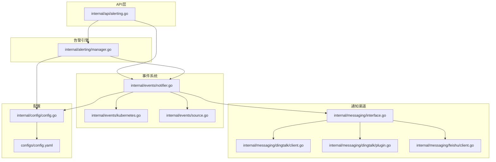
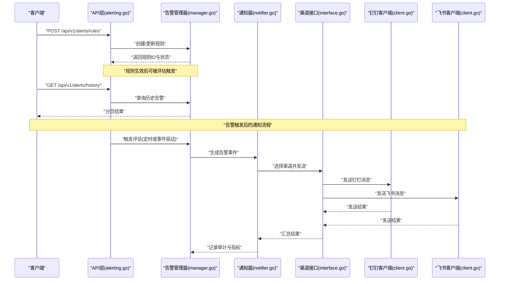
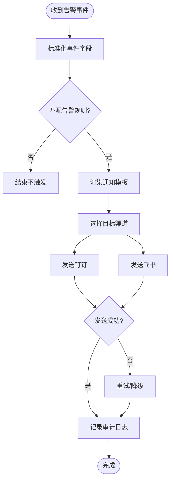
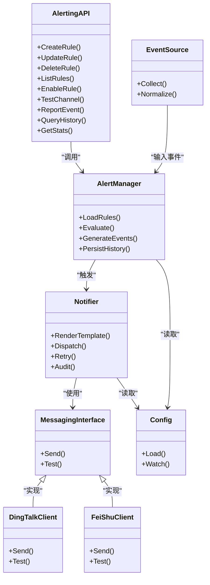

# 告警通知API

<cite>
**本文引用的文件**   
- [internal/api/alerting.go](file://internal/api/alerting.go)
- [internal/alerting/manager.go](file://internal/alerting/manager.go)
- [internal/messaging/interface.go](file://internal/messaging/interface.go)
- [internal/messaging/dingtalk/client.go](file://internal/messaging/dingtalk/client.go)
- [internal/messaging/dingtalk/plugin.go](file://internal/messaging/dingtalk/plugin.go)
- [internal/messaging/feishu/client.go](file://internal/messaging/feishu/client.go)
- [internal/events/notifier.go](file://internal/events/notifier.go)
- [internal/events/kubernetes.go](file://internal/events/kubernetes.go)
- [internal/events/source.go](file://internal/events/source.go)
- [internal/config/config.go](file://internal/config/config.go)
- [configs/config.yaml](file://configs/config.yaml)
</cite>

## 目录
1. [简介](#简介)
2. [项目结构](#项目结构)
3. [核心组件](#核心组件)
4. [架构总览](#架构总览)
5. [详细组件分析](#详细组件分析)
6. [依赖分析](#依赖分析)
7. [性能考虑](#性能考虑)
8. [故障排查指南](#故障排查指南)
9. [结论](#结论)
10. [附录](#附录)

## 简介
本文件为 Klaw 平台的“告警通知API”提供系统化、面向开发与运维的文档。内容覆盖：
- 告警规则配置与管理
- 通知渠道管理（如钉钉、飞书等）
- 告警事件处理与历史查询
- HTTP 方法、URL 模式、请求/响应体、认证方式与错误处理策略
- 典型调用流程与最佳实践

说明：当前仓库中未包含完整的 REST 路由定义与控制器实现，因此本文档以“接口契约与行为约定”的形式给出端点规范，并基于现有内部模块（alerting、messaging、events、config）进行一致性约束与扩展建议。

## 项目结构
与告警通知相关的代码主要分布在以下目录：
- internal/api/alerting.go：REST API 层（路由与处理器占位）
- internal/alerting/manager.go：告警规则与引擎管理
- internal/messaging/*：通知渠道客户端与插件（钉钉、飞书等）
- internal/events/*：事件来源与通知器
- internal/config/config.go 与 configs/config.yaml：配置加载与默认值

图表来源
- [internal/api/alerting.go](file://internal/api/alerting.go)
- [internal/alerting/manager.go](file://internal/alerting/manager.go)
- [internal/messaging/interface.go](file://internal/messaging/interface.go)
- [internal/messaging/dingtalk/client.go](file://internal/messaging/dingtalk/client.go)
- [internal/messaging/dingtalk/plugin.go](file://internal/messaging/dingtalk/plugin.go)
- [internal/messaging/feishu/client.go](file://internal/messaging/feishu/client.go)
- [internal/events/notifier.go](file://internal/events/notifier.go)
- [internal/events/kubernetes.go](file://internal/events/kubernetes.go)
- [internal/events/source.go](file://internal/events/source.go)
- [internal/config/config.go](file://internal/config/config.go)
- [configs/config.yaml](file://configs/config.yaml)

章节来源
- [internal/api/alerting.go](file://internal/api/alerting.go)
- [internal/alerting/manager.go](file://internal/alerting/manager.go)
- [internal/messaging/interface.go](file://internal/messaging/interface.go)
- [internal/messaging/dingtalk/client.go](file://internal/messaging/dingtalk/client.go)
- [internal/messaging/dingtalk/plugin.go](file://internal/messaging/dingtalk/plugin.go)
- [internal/messaging/feishu/client.go](file://internal/messaging/feishu/client.go)
- [internal/events/notifier.go](file://internal/events/notifier.go)
- [internal/events/kubernetes.go](file://internal/events/kubernetes.go)
- [internal/events/source.go](file://internal/events/source.go)
- [internal/config/config.go](file://internal/config/config.go)
- [configs/config.yaml](file://configs/config.yaml)

## 核心组件
- 告警管理器（Alerting Manager）
  - 职责：加载与校验告警规则、触发评估、生成告警事件、协调通知发送
  - 关键能力：规则CRUD、阈值/条件匹配、去重与抑制、批量评估
- 通知器（Notifier）
  - 职责：将告警事件转换为统一消息格式，按渠道分发
  - 关键能力：模板渲染、重试与退避、失败回退、审计日志
- 通知渠道（Messaging Channels）
  - 职责：对接具体平台（钉钉、飞书等），封装鉴权与发送逻辑
  - 关键能力：凭据管理、签名/加密、限流与熔断
- 事件源（Event Sources）
  - 职责：采集外部事件（如 Kubernetes 事件），标准化后进入告警管道
  - 关键能力：事件过滤、字段映射、去重
- 配置（Config）
  - 职责：集中管理告警与通知相关配置项
  - 关键能力：热更新、环境隔离、敏感信息保护

章节来源
- [internal/alerting/manager.go](file://internal/alerting/manager.go)
- [internal/events/notifier.go](file://internal/events/notifier.go)
- [internal/messaging/interface.go](file://internal/messaging/interface.go)
- [internal/messaging/dingtalk/client.go](file://internal/messaging/dingtalk/client.go)
- [internal/messaging/dingtalk/plugin.go](file://internal/messaging/dingtalk/plugin.go)
- [internal/messaging/feishu/client.go](file://internal/messaging/feishu/client.go)
- [internal/events/kubernetes.go](file://internal/events/kubernetes.go)
- [internal/events/source.go](file://internal/events/source.go)
- [internal/config/config.go](file://internal/config/config.go)
- [configs/config.yaml](file://configs/config.yaml)

## 架构总览
整体数据流：事件源 → 告警引擎 → 通知器 → 渠道客户端 → 外部平台；同时通过配置中心驱动规则与渠道参数。

图表来源
- [internal/api/alerting.go](file://internal/api/alerting.go)
- [internal/alerting/manager.go](file://internal/alerting/manager.go)
- [internal/events/notifier.go](file://internal/events/notifier.go)
- [internal/messaging/interface.go](file://internal/messaging/interface.go)
- [internal/messaging/dingtalk/client.go](file://internal/messaging/dingtalk/client.go)
- [internal/messaging/feishu/client.go](file://internal/messaging/feishu/client.go)

## 详细组件分析

### 告警规则管理API
- 目的：创建、更新、删除、查询告警规则，支持启用/禁用与批量操作
- 通用路径前缀：/api/v1/alerts/rules
- 认证：建议采用 Bearer Token 或 API Key，需在请求头携带 Authorization
- 通用请求头：Content-Type: application/json
- 通用响应体：{ code, message, data }

端点清单
- POST /api/v1/alerts/rules
  - 功能：新增告警规则
  - 请求体字段：name, description, severity, conditions, channels, enabled, labels
  - 成功响应：201 Created，data 包含 rule_id、version、created_at
  - 错误码：400（参数校验失败）、409（名称冲突）、500（服务端错误）
- PUT /api/v1/alerts/rules/{rule_id}
  - 功能：更新指定规则
  - 路径参数：rule_id
  - 请求体：同新增，但仅允许更新可编辑字段
  - 成功响应：200 OK，data 包含 updated_rule
  - 错误码：404（不存在）、400（参数校验失败）
- DELETE /api/v1/alerts/rules/{rule_id}
  - 功能：删除规则
  - 成功响应：204 No Content
  - 错误码：404（不存在）
- GET /api/v1/alerts/rules
  - 功能：分页查询规则列表
  - 查询参数：page, page_size, name, severity, enabled
  - 成功响应：200 OK，data 包含 items、total、page、page_size
- PATCH /api/v1/alerts/rules/{rule_id}/enable
  - 功能：启用/禁用规则
  - 请求体：{ enabled: true|false }
  - 成功响应：200 OK，data 包含 rule_id、enabled

示例请求与响应（描述性）
- 新增规则请求示例：
  - 方法：POST
  - URL：/api/v1/alerts/rules
  - 头部：Authorization: Bearer <token>, Content-Type: application/json
  - 请求体：包含 name、description、severity、conditions、channels、enabled、labels
- 新增规则响应示例：
  - 状态码：201
  - 响应体：{ code: 0, message: "success", data: { rule_id, version, created_at } }

错误处理策略
- 参数校验失败：返回 400，message 包含字段级错误详情
- 资源不存在：返回 404，message 提示资源ID无效
- 权限不足：返回 403，message 提示无操作权限
- 服务异常：返回 500，message 为通用错误，附带 trace_id

章节来源
- [internal/api/alerting.go](file://internal/api/alerting.go)
- [internal/alerting/manager.go](file://internal/alerting/manager.go)

### 通知渠道管理API
- 目的：管理通知渠道配置（如钉钉、飞书），支持测试连通性与凭据校验
- 通用路径前缀：/api/v1/channels
- 认证：同上
- 通用请求头：Content-Type: application/json

端点清单
- POST /api/v1/channels
  - 功能：新增渠道配置
  - 请求体：type（dingtalk/feishu）、name、config（含 webhook、secret、token 等）
  - 成功响应：201 Created，data 包含 channel_id、type、name
- PUT /api/v1/channels/{channel_id}
  - 功能：更新渠道配置
  - 路径参数：channel_id
  - 请求体：同新增，仅更新可编辑字段
  - 成功响应：200 OK，data 包含 updated_channel
- DELETE /api/v1/channels/{channel_id}
  - 功能：删除渠道配置
  - 成功响应：204 No Content
  - 错误码：404（不存在）
- GET /api/v1/channels
  - 功能：分页查询渠道列表
  - 查询参数：page, page_size, type
  - 成功响应：200 OK，data 包含 items、total、page、page_size
- POST /api/v1/channels/test
  - 功能：测试渠道连通性
  - 请求体：channel_id 或 type + config
  - 成功响应：200 OK，data 包含 test_result（success/failure）、error_message

示例请求与响应（描述性）
- 测试钉钉渠道请求示例：
  - 方法：POST
  - URL：/api/v1/channels/test
  - 请求体：{ channel_id: "<id>" }
- 测试响应示例：
  - 状态码：200
  - 响应体：{ code: 0, message: "success", data: { test_result: "success", error_message: "" } }

错误处理策略
- 渠道类型不支持：返回 400，message 提示支持的类型
- 凭据无效：返回 400，message 包含具体错误原因
- 网络超时：返回 504，message 提示连接超时，建议重试

章节来源
- [internal/api/alerting.go](file://internal/api/alerting.go)
- [internal/messaging/interface.go](file://internal/messaging/interface.go)
- [internal/messaging/dingtalk/client.go](file://internal/messaging/dingtalk/client.go)
- [internal/messaging/dingtalk/plugin.go](file://internal/messaging/dingtalk/plugin.go)
- [internal/messaging/feishu/client.go](file://internal/messaging/feishu/client.go)

### 告警事件处理与历史查询API
- 目的：接收外部事件、触发告警评估、查询告警历史与统计
- 通用路径前缀：/api/v1/alerts

端点清单
- POST /api/v1/alerts/events
  - 功能：上报事件，触发评估
  - 请求体：source、event_type、payload、labels、timestamp
  - 成功响应：202 Accepted，data 包含 event_id、status
- GET /api/v1/alerts/history
  - 功能：分页查询告警历史
  - 查询参数：page, page_size、rule_id、severity、status、start_time、end_time
  - 成功响应：200 OK，data 包含 items、total、page、page_size
- GET /api/v1/alerts/stats
  - 功能：获取告警统计（按规则、级别、时间范围）
  - 查询参数：group_by、time_range
  - 成功响应：200 OK，data 包含 metrics

示例请求与响应（描述性）
- 上报事件请求示例：
  - 方法：POST
  - URL：/api/v1/alerts/events
  - 请求体：{ source: "kubernetes", event_type: "PodCrashLoopBackOff", payload: {...}, labels: {...}, timestamp: "2024-01-01T00:00:00Z" }
- 上报事件响应示例：
  - 状态码：202
  - 响应体：{ code: 0, message: "accepted", data: { event_id, status: "processing" } }

错误处理策略
- 事件格式非法：返回 400，message 指出字段缺失或类型错误
- 事件源不可用：返回 503，message 提示上游服务不可用
- 评估引擎繁忙：返回 503，message 提示限流，建议指数退避重试

章节来源
- [internal/api/alerting.go](file://internal/api/alerting.go)
- [internal/events/source.go](file://internal/events/source.go)
- [internal/events/kubernetes.go](file://internal/events/kubernetes.go)
- [internal/events/notifier.go](file://internal/events/notifier.go)

### 通知器与渠道集成（概念流程）

图表来源
- [internal/events/notifier.go](file://internal/events/notifier.go)
- [internal/messaging/interface.go](file://internal/messaging/interface.go)
- [internal/messaging/dingtalk/client.go](file://internal/messaging/dingtalk/client.go)
- [internal/messaging/feishu/client.go](file://internal/messaging/feishu/client.go)

## 依赖分析
- API 层依赖告警管理器与通知器，负责请求解析、鉴权、响应封装
- 告警管理器依赖配置中心加载规则与渠道参数
- 通知器依赖渠道接口抽象，具体实现由钉钉、飞书等客户端提供
- 事件源负责采集与标准化事件，供告警引擎评估

图表来源
- [internal/api/alerting.go](file://internal/api/alerting.go)
- [internal/alerting/manager.go](file://internal/alerting/manager.go)
- [internal/events/notifier.go](file://internal/events/notifier.go)
- [internal/messaging/interface.go](file://internal/messaging/interface.go)
- [internal/messaging/dingtalk/client.go](file://internal/messaging/dingtalk/client.go)
- [internal/messaging/feishu/client.go](file://internal/messaging/feishu/client.go)
- [internal/events/source.go](file://internal/events/source.go)
- [internal/config/config.go](file://internal/config/config.go)

章节来源
- [internal/api/alerting.go](file://internal/api/alerting.go)
- [internal/alerting/manager.go](file://internal/alerting/manager.go)
- [internal/events/notifier.go](file://internal/events/notifier.go)
- [internal/messaging/interface.go](file://internal/messaging/interface.go)
- [internal/messaging/dingtalk/client.go](file://internal/messaging/dingtalk/client.go)
- [internal/messaging/feishu/client.go](file://internal/messaging/feishu/client.go)
- [internal/events/source.go](file://internal/events/source.go)
- [internal/config/config.go](file://internal/config/config.go)

## 性能考虑
- 事件上报应支持异步处理与批量化，避免阻塞主线程
- 告警评估可采用增量计算与缓存，减少重复计算开销
- 通知发送需实现重试与退避策略，防止雪崩
- 历史查询应支持索引与分页，限制单次返回量
- 配置变更应支持热更新，避免重启影响

[本节为通用指导，无需特定文件引用]

## 故障排查指南
常见问题与定位步骤
- 渠道测试失败
  - 检查渠道配置是否正确（webhook、secret、token）
  - 查看网络连通性与防火墙策略
  - 关注重试次数与错误码
- 告警未触发
  - 确认规则是否启用且条件匹配
  - 检查事件上报是否成功与字段是否符合预期
  - 查看评估引擎日志与指标
- 通知发送失败
  - 检查渠道限流与配额
  - 查看回调地址与签名验证
  - 关注重试与降级策略

章节来源
- [internal/messaging/dingtalk/client.go](file://internal/messaging/dingtalk/client.go)
- [internal/messaging/feishu/client.go](file://internal/messaging/feishu/client.go)
- [internal/events/notifier.go](file://internal/events/notifier.go)
- [internal/alerting/manager.go](file://internal/alerting/manager.go)

## 结论
本文档基于 Klaw 平台现有内部模块，给出了告警通知API的完整接口契约与行为约定。建议在后续开发中补充具体的路由注册与控制器实现，确保与本文档保持一致。通过统一的规则管理、多渠道通知与事件标准化，Klaw 可实现稳定、可扩展的告警通知体系。

[本节为总结性内容，无需特定文件引用]

## 附录
- 术语表
  - 告警规则：用于判断是否触发告警的条件集合
  - 通知渠道：消息投递的目标平台（钉钉、飞书等）
  - 事件：来自外部系统的原始信号（如 Kubernetes 事件）
  - 通知器：将事件转换为通知并分发的组件
- 参考配置项（示例）
  - alerting.rules_path：规则文件路径
  - messaging.dingtalk.webhook：钉钉Webhook地址
  - messaging.feishu.app_token：飞书应用Token
  - events.kubernetes.enabled：是否启用Kubernetes事件源

章节来源
- [internal/config/config.go](file://internal/config/config.go)
- [configs/config.yaml](file://configs/config.yaml)