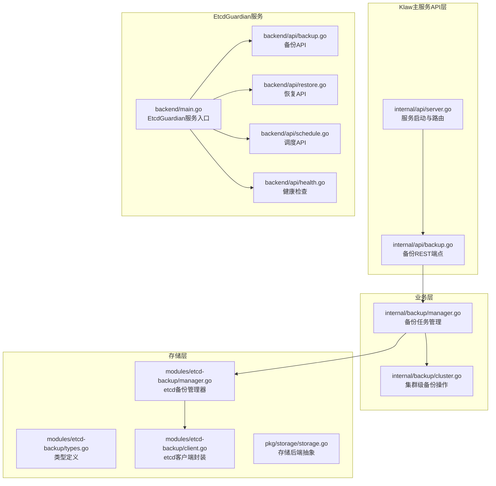
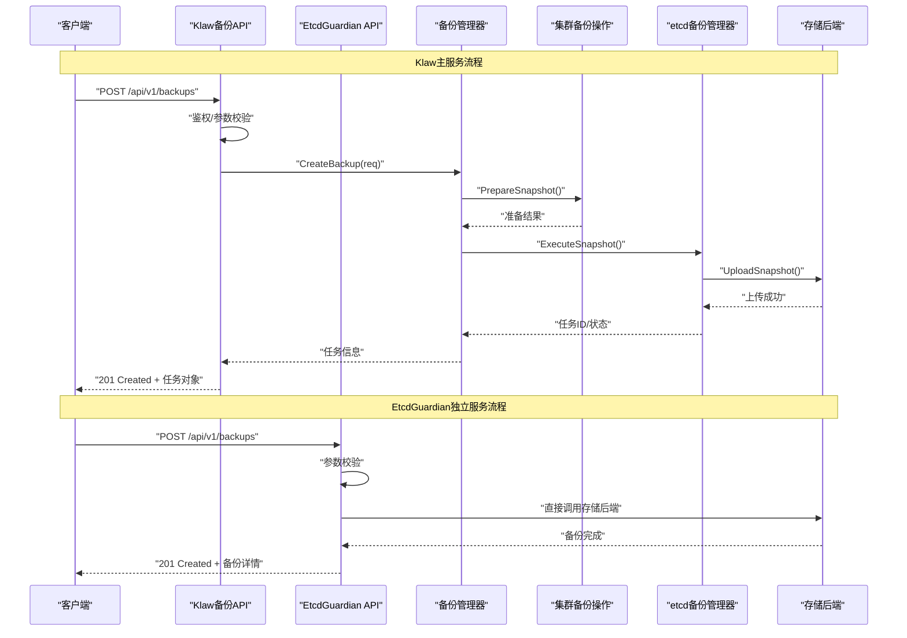
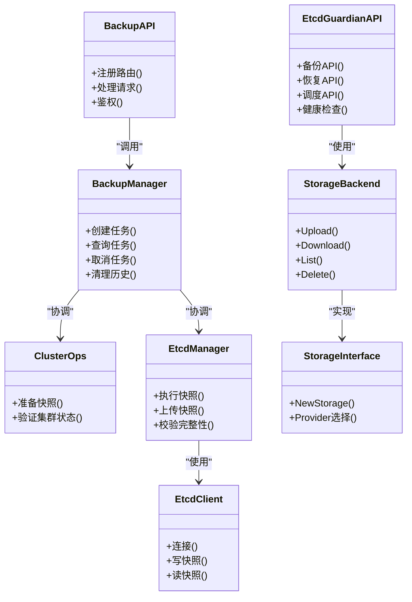

# 备份恢复API

<cite>
**本文引用的文件**
- [internal/api/backup.go](file://internal/api/backup.go)
- [internal/backup/manager.go](file://internal/backup/manager.go)
- [internal/backup/cluster.go](file://internal/backup/cluster.go)
- [modules/etcd-backup/manager.go](file://modules/etcd-backup/manager.go)
- [modules/etcd-backup/types.go](file://modules/etcd-backup/types.go)
- [modules/etcd-backup/client.go](file://modules/etcd-backup/client.go)
- [internal/api/server.go](file://internal/api/server.go)
- [modules/etcd-guardian/backend/main.go](file://modules/etcd-guardian/backend/main.go)
- [modules/etcd-guardian/backend/api/backup.go](file://modules/etcd-guardian/backend/api/backup.go)
- [modules/etcd-guardian/backend/api/restore.go](file://modules/etcd-guardian/backend/api/restore.go)
- [modules/etcd-guardian/backend/api/schedule.go](file://modules/etcd-guardian/backend/api/schedule.go)
- [modules/etcd-guardian/backend/api/health.go](file://modules/etcd-guardian/backend/api/health.go)
- [modules/etcd-guardian/api/v1alpha1/etcdbackup_types.go](file://modules/etcd-guardian/api/v1alpha1/etcdbackup_types.go)
- [modules/etcd-guardian/api/v1alpha1/etcdbackupschedule_types.go](file://modules/etcd-guardian/api/v1alpha1/etcdbackupschedule_types.go)
- [modules/etcd-guardian/api/v1alpha1/etcdrestore_types.go](file://modules/etcd-guardian/api/v1alpha1/etcdrestore_types.go)
- [modules/etcd-guardian/controllers/etcdbackup_controller.go](file://modules/etcd-guardian/controllers/etcdbackup_controller.go)
- [modules/etcd-guardian/pkg/storage/storage.go](file://modules/etcd-guardian/pkg/storage/storage.go)
</cite>

## 更新摘要
**所做更改**
- 新增 EtcdGuardian 模块的 RESTful API 端点，提供独立的 etcd 备份恢复服务
- 扩展存储后端支持，新增 S3、OSS、GCS、Azure 等多种云存储提供商
- 增加调度功能，支持 cron 表达式定时备份和 AI 优化调度
- 增强备份策略配置，支持加密、验证、钩子等高级特性
- 完善恢复功能，支持全量、增量和按时间点恢复模式

## 目录
1. [简介](#简介)
2. [项目结构](#项目结构)
3. [核心组件](#核心组件)
4. [架构总览](#架构总览)
5. [详细组件分析](#详细组件分析)
6. [依赖关系分析](#依赖关系分析)
7. [性能考虑](#性能考虑)
8. [故障排查指南](#故障排查指南)
9. [结论](#结论)
10. [附录：API参考](#附录api参考)

## 简介
本文件为 Klaw 平台的"备份与恢复"相关 RESTful API 提供完整文档。内容覆盖备份策略配置、备份任务执行与查询、数据恢复等核心能力，包括 HTTP 方法、URL 模式、请求/响应体结构、认证方式、状态码与错误处理策略，并给出典型调用示例与最佳实践建议。

**更新** 新增了 EtcdGuardian 模块提供的独立 etcd 备份恢复 API，扩展了原有的备份恢复能力，增加了新的存储后端支持和调度功能。

## 项目结构
与备份恢复相关的后端实现主要分布在以下模块：
- API 层：路由注册与处理器（HTTP 接口）
- 业务层：备份管理器与集群操作封装
- 存储层：etcd 备份客户端与类型定义
- **新增** EtcdGuardian 模块：独立的 etcd 备份恢复服务

**图表来源**
- [internal/api/backup.go](file://internal/api/backup.go)
- [internal/api/server.go](file://internal/api/server.go)
- [internal/backup/manager.go](file://internal/backup/manager.go)
- [internal/backup/cluster.go](file://internal/backup/cluster.go)
- [modules/etcd-backup/manager.go](file://modules/etcd-backup/manager.go)
- [modules/etcd-backup/types.go](file://modules/etcd-backup/types.go)
- [modules/etcd-backup/client.go](file://modules/etcd-backup/client.go)
- [modules/etcd-guardian/backend/main.go](file://modules/etcd-guardian/backend/main.go)
- [modules/etcd-guardian/backend/api/backup.go](file://modules/etcd-guardian/backend/api/backup.go)
- [modules/etcd-guardian/backend/api/restore.go](file://modules/etcd-guardian/backend/api/restore.go)
- [modules/etcd-guardian/backend/api/schedule.go](file://modules/etcd-guardian/backend/api/schedule.go)
- [modules/etcd-guardian/backend/api/health.go](file://modules/etcd-guardian/backend/api/health.go)
- [modules/etcd-guardian/pkg/storage/storage.go](file://modules/etcd-guardian/pkg/storage/storage.go)

**章节来源**
- [internal/api/backup.go](file://internal/api/backup.go)
- [internal/api/server.go](file://internal/api/server.go)
- [internal/backup/manager.go](file://internal/backup/manager.go)
- [internal/backup/cluster.go](file://internal/backup/cluster.go)
- [modules/etcd-backup/manager.go](file://modules/etcd-backup/manager.go)
- [modules/etcd-backup/types.go](file://modules/etcd-backup/types.go)
- [modules/etcd-backup/client.go](file://modules/etcd-backup/client.go)
- [modules/etcd-guardian/backend/main.go](file://modules/etcd-guardian/backend/main.go)
- [modules/etcd-guardian/backend/api/backup.go](file://modules/etcd-guardian/backend/api/backup.go)
- [modules/etcd-guardian/backend/api/restore.go](file://modules/etcd-guardian/backend/api/restore.go)
- [modules/etcd-guardian/backend/api/schedule.go](file://modules/etcd-guardian/backend/api/schedule.go)
- [modules/etcd-guardian/backend/api/health.go](file://modules/etcd-guardian/backend/api/health.go)
- [modules/etcd-guardian/pkg/storage/storage.go](file://modules/etcd-guardian/pkg/storage/storage.go)

## 核心组件
- 备份API处理器：负责解析请求、参数校验、鉴权、调用业务层并返回统一响应。
- 备份管理器：编排备份生命周期（创建、调度、执行、查询、删除），协调集群操作与存储后端。
- 集群备份操作：封装针对 Kubernetes/etcd 的备份动作（如快照、导出）。
- etcd 备份客户端：与 etcd 交互，完成快照写入与读取。
- **新增** EtcdGuardian 服务：独立的 etcd 备份恢复微服务，提供完整的备份恢复 API。
- **新增** 存储后端抽象：支持多种云存储提供商的统一接口。

**章节来源**
- [internal/api/backup.go](file://internal/api/backup.go)
- [internal/backup/manager.go](file://internal/backup/manager.go)
- [internal/backup/cluster.go](file://internal/backup/cluster.go)
- [modules/etcd-backup/manager.go](file://modules/etcd-backup/manager.go)
- [modules/etcd-backup/types.go](file://modules/etcd-backup/types.go)
- [modules/etcd-backup/client.go](file://modules/etcd-backup/client.go)
- [modules/etcd-guardian/backend/main.go](file://modules/etcd-guardian/backend/main.go)
- [modules/etcd-guardian/pkg/storage/storage.go](file://modules/etcd-guardian/pkg/storage/storage.go)

## 架构总览
下图展示了从 HTTP 请求到 etcd 备份/恢复的关键调用链，包括新增的 EtcdGuardian 服务。

**图表来源**
- [internal/api/backup.go](file://internal/api/backup.go)
- [internal/backup/manager.go](file://internal/backup/manager.go)
- [internal/backup/cluster.go](file://internal/backup/cluster.go)
- [modules/etcd-backup/manager.go](file://modules/etcd-backup/manager.go)
- [modules/etcd-backup/client.go](file://modules/etcd-backup/client.go)
- [modules/etcd-guardian/backend/main.go](file://modules/etcd-guardian/backend/main.go)
- [modules/etcd-guardian/backend/api/backup.go](file://modules/etcd-guardian/backend/api/backup.go)
- [modules/etcd-guardian/pkg/storage/storage.go](file://modules/etcd-guardian/pkg/storage/storage.go)

## 详细组件分析

### 备份API处理器（REST端点）
职责
- 暴露备份与恢复相关的 RESTful 接口
- 统一鉴权、审计、参数校验
- 将请求委派给备份管理器，并返回标准响应

关键端点（概念性说明）
- 备份策略配置：GET/PUT 策略列表与详情
- 备份任务：POST 创建、GET 列表、GET 详情、DELETE 取消/删除
- 数据恢复：POST 触发恢复、GET 恢复任务状态

请求/响应要点
- 请求体包含目标集群、保留策略、存储位置、加密选项等
- 响应体包含任务ID、状态、进度、错误信息等
- 支持分页、过滤、排序（按时间、状态）

错误处理
- 400 参数错误
- 401/403 鉴权失败
- 404 资源不存在
- 409 冲突（重复策略或任务）
- 500/503 服务端或下游依赖异常

**章节来源**
- [internal/api/backup.go](file://internal/api/backup.go)

### 备份管理器（任务编排）
职责
- 维护备份任务的生命周期
- 协调集群操作与存储后端
- 提供查询、取消、清理等管理能力

数据结构与复杂度
- 任务表/索引：O(1) 查找、O(log n) 排序
- 并发控制：互斥锁保证同一策略不重复执行

优化点
- 批量查询使用分页
- 长耗时操作异步化，避免阻塞HTTP线程

**章节来源**
- [internal/backup/manager.go](file://internal/backup/manager.go)

### 集群备份操作（Kubernetes/etcd）
职责
- 封装对集群资源的备份动作（如 etcd snapshot）
- 处理权限、网络、超时与重试

**章节来源**
- [internal/backup/cluster.go](file://internal/backup/cluster.go)

### etcd 备份管理器与客户端
职责
- 管理器：协调快照的生成、上传、校验
- 客户端：与 etcd 建立连接、读写快照数据

**章节来源**
- [modules/etcd-backup/manager.go](file://modules/etcd-backup/manager.go)
- [modules/etcd-backup/types.go](file://modules/etcd-backup/types.go)
- [modules/etcd-backup/client.go](file://modules/etcd-backup/client.go)

### **新增** EtcdGuardian 服务
职责
- 提供独立的 etcd 备份恢复微服务
- 支持多种存储后端（S3、OSS、GCS、Azure）
- 实现完整的备份、恢复、调度功能
- 提供健康检查和监控接口

核心功能
- 备份管理：创建、查询、删除备份任务
- 恢复管理：支持全量、增量、按时间点恢复
- 调度管理：基于 cron 表达式的定时备份
- 存储后端：统一的存储接口抽象

**章节来源**
- [modules/etcd-guardian/backend/main.go](file://modules/etcd-guardian/backend/main.go)
- [modules/etcd-guardian/backend/api/backup.go](file://modules/etcd-guardian/backend/api/backup.go)
- [modules/etcd-guardian/backend/api/restore.go](file://modules/etcd-guardian/backend/api/restore.go)
- [modules/etcd-guardian/backend/api/schedule.go](file://modules/etcd-guardian/backend/api/schedule.go)
- [modules/etcd-guardian/backend/api/health.go](file://modules/etcd-guardian/backend/api/health.go)

### **新增** 存储后端抽象
职责
- 定义统一的存储接口
- 支持多种云存储提供商
- 提供快照上传、下载、列表、删除等操作

支持的存储提供商
- S3（Amazon Simple Storage Service）
- OSS（阿里云对象存储服务）
- GCS（Google Cloud Storage）- 待实现
- Azure Blob Storage - 待实现

**章节来源**
- [modules/etcd-guardian/pkg/storage/storage.go](file://modules/etcd-guardian/pkg/storage/storage.go)

### **新增** CRD 类型定义
EtcdGuardian 提供了完整的 Kubernetes 自定义资源定义：

#### EtcdBackup
- 支持 Full 和 Incremental 两种备份模式
- 支持多种存储提供商配置
- 支持加密、验证、钩子等高级特性
- 支持 Velero 集成

#### EtcdBackupSchedule  
- 基于 cron 表达式的定时备份
- 支持 AI 优化调度
- 支持备份模板复用

#### EtcdRestore
- 支持 Full、Incremental、PointInTime 三种恢复模式
- 支持版本兼容性检查
- 支持命名空间过滤

**章节来源**
- [modules/etcd-guardian/api/v1alpha1/etcdbackup_types.go](file://modules/etcd-guardian/api/v1alpha1/etcdbackup_types.go)
- [modules/etcd-guardian/api/v1alpha1/etcdbackupschedule_types.go](file://modules/etcd-guardian/api/v1alpha1/etcdbackupschedule_types.go)
- [modules/etcd-guardian/api/v1alpha1/etcdrestore_types.go](file://modules/etcd-guardian/api/v1alpha1/etcdrestore_types.go)

### **新增** 控制器实现
EtcdBackupReconciler 实现了完整的备份生命周期管理：
- 配置验证：检查存储桶、凭据等配置
- 环境准备：执行预备份钩子
- 快照创建：支持全量和增量快照
- 上传管理：将快照上传到存储后端
- 验证处理：验证快照完整性
- 状态管理：更新备份状态和条件

**章节来源**
- [modules/etcd-guardian/controllers/etcdbackup_controller.go](file://modules/etcd-guardian/controllers/etcdbackup_controller.go)

## 依赖关系分析

**图表来源**
- [internal/api/backup.go](file://internal/api/backup.go)
- [internal/backup/manager.go](file://internal/backup/manager.go)
- [internal/backup/cluster.go](file://internal/backup/cluster.go)
- [modules/etcd-backup/manager.go](file://modules/etcd-backup/manager.go)
- [modules/etcd-backup/client.go](file://modules/etcd-backup/client.go)
- [modules/etcd-guardian/backend/main.go](file://modules/etcd-guardian/backend/main.go)
- [modules/etcd-guardian/pkg/storage/storage.go](file://modules/etcd-guardian/pkg/storage/storage.go)

**章节来源**
- [internal/api/backup.go](file://internal/api/backup.go)
- [internal/backup/manager.go](file://internal/backup/manager.go)
- [internal/backup/cluster.go](file://internal/backup/cluster.go)
- [modules/etcd-backup/manager.go](file://modules/etcd-backup/manager.go)
- [modules/etcd-backup/client.go](file://modules/etcd-backup/client.go)
- [modules/etcd-guardian/backend/main.go](file://modules/etcd-guardian/backend/main.go)
- [modules/etcd-guardian/pkg/storage/storage.go](file://modules/etcd-guardian/pkg/storage/storage.go)

## 性能考虑
- 异步任务：备份/恢复采用后台任务队列，避免阻塞HTTP请求。
- 分页与过滤：列表接口默认分页，减少大对象传输。
- 并发控制：同一策略限制并发度，防止资源争用。
- 缓存热点：频繁查询的状态可短期缓存，降低数据库压力。
- I/O优化：快照分块上传、断点续传、校验和校验。
- **新增** 存储后端优化：支持并行上传、压缩传输、智能重试机制。
- **新增** 调度优化：AI驱动的备份时间优化，减少性能影响。

## 故障排查指南
常见问题与定位步骤
- 鉴权失败（401/403）
  - 检查令牌是否有效、角色是否具备备份/恢复权限
  - 查看审计日志中的鉴权记录
- 参数错误（400）
  - 核对请求体字段类型、必填项、取值范围
- 资源不存在（404）
  - 确认策略ID、任务ID、集群名称是否正确
- 冲突（409）
  - 避免重复创建同名策略或并行执行相同任务
- 服务端错误（5xx）
  - 查看备份管理器日志、etcd客户端连接状态、存储后端可用性
- **新增** 存储后端错误
  - 检查存储提供商配置、网络连接、权限设置
  - 验证凭据Secret是否正确配置
- **新增** 调度器问题
  - 检查cron表达式语法
  - 验证调度器状态和最近执行记录

定位工具
- 启用调试日志级别
- 通过任务ID追踪全链路日志
- 检查 etcd 健康与磁盘空间
- **新增** 使用 EtcdGuardian 健康检查端点 `/api/v1/health`

**章节来源**
- [internal/api/backup.go](file://internal/api/backup.go)
- [internal/backup/manager.go](file://internal/backup/manager.go)
- [modules/etcd-backup/client.go](file://modules/etcd-backup/client.go)
- [modules/etcd-guardian/backend/api/health.go](file://modules/etcd-guardian/backend/api/health.go)

## 结论
本API围绕"备份策略—任务编排—集群操作—存储后端"形成闭环，提供稳定可靠的备份与恢复能力。**新增的 EtcdGuardian 模块**进一步增强了系统的可扩展性和灵活性，提供了独立的 etcd 备份恢复服务，支持多种存储后端和高级调度功能。建议在生产环境结合RBAC、审计与监控，确保数据安全与可观测性。

## 附录：API参考

### 通用约定
- 基础路径：/api/v1
- 认证：基于令牌（Bearer Token），需在请求头中携带
- 内容类型：application/json
- 统一响应格式：{ code, message, data }

### Klaw 主服务 API

#### 备份策略
- GET /api/v1/backup-strategies
  - 描述：获取所有备份策略
  - 请求参数：page, size, filter_by_name, sort_by
  - 响应：策略列表（含ID、名称、cron表达式、保留数量、存储位置）
- GET /api/v1/backup-strategies/{id}
  - 描述：获取指定策略详情
- PUT /api/v1/backup-strategies/{id}
  - 描述：更新策略（名称、调度、保留策略、存储配置）
  - 请求体：策略字段
  - 响应：更新后的策略

#### 备份任务
- POST /api/v1/backups
  - 描述：创建一次备份任务
  - 请求体：strategy_id（可选）、cluster、storage、encryption、labels
  - 响应：201 Created，返回任务对象（task_id、status、progress）
- GET /api/v1/backups
  - 描述：列出备份任务（支持分页、过滤、排序）
- GET /api/v1/backups/{task_id}
  - 描述：获取任务详情（状态、进度、错误信息、产物地址）
- DELETE /api/v1/backups/{task_id}
  - 描述：取消或删除任务（根据状态决定）

#### 数据恢复
- POST /api/v1/restores
  - 描述：触发数据恢复
  - 请求体：backup_id、target_cluster、dry_run、force_overwrite
  - 响应：201 Created，返回恢复任务对象
- GET /api/v1/restores
  - 描述：列出恢复任务
- GET /api/v1/restores/{restore_id}
  - 描述：获取恢复任务详情（阶段、进度、错误）

### **新增** EtcdGuardian 服务 API

#### 备份管理
- GET /api/v1/backups
  - 描述：获取备份列表
  - 响应：备份数组（name, mode, status, size, time, etcdRevision, storageLocation, validation）
- POST /api/v1/backups
  - 描述：创建备份
  - 请求体：name, mode, storageLocation, encryption, validation
  - 响应：201 Created，返回创建的备份对象
- GET /api/v1/backups/:name
  - 描述：获取单个备份详情
- DELETE /api/v1/backups/:name
  - 描述：删除备份

#### 恢复管理
- GET /api/v1/restores
  - 描述：获取恢复列表
  - 响应：恢复数组（name, backupName, status, time, etcdCluster）
- POST /api/v1/restores
  - 描述：创建恢复任务
  - 请求体：name, backupName, restoreMode, etcdCluster
  - 响应：201 Created，返回恢复对象
- GET /api/v1/restores/:name
  - 描述：获取单个恢复详情
- DELETE /api/v1/restores/:name
  - 描述：删除恢复任务

#### 调度管理
- GET /api/v1/schedules
  - 描述：获取调度列表
  - 响应：调度数组（name, schedule, mode, lastRun, nextRun, status, storageProvider, bucket, region, credentialsSecret, etcdEndpoints, validation, consistencyCheck）
- POST /api/v1/schedules
  - 描述：创建调度
  - 请求体：name, schedule, mode, storageProvider, bucket, region, credentialsSecret, etcdEndpoints, validation, consistencyCheck
  - 响应：201 Created，返回调度对象
- GET /api/v1/schedules/:name
  - 描述：获取单个调度详情
- PUT /api/v1/schedules/:name
  - 描述：更新调度
- DELETE /api/v1/schedules/:name
  - 描述：删除调度
- POST /api/v1/schedules/:name/run
  - 描述：立即运行调度

#### 健康检查
- GET /api/v1/health
  - 描述：服务健康检查
  - 响应：{ status: "ok", message: "Etcd Guardian API is healthy" }

### 状态码与错误处理
- 200 成功
- 201 已创建
- 400 参数错误
- 401 未认证
- 403 无权限
- 404 资源不存在
- 409 冲突
- 500 内部错误
- 503 服务不可用（下游依赖异常）

### 请求/响应示例（概念性）
- 创建备份任务
  - 请求：POST /api/v1/backups
  - 响应：{ code: 201, message: "success", data: { task_id: "...", status: "pending", progress: 0 } }
- 查询任务详情
  - 请求：GET /api/v1/backups/{task_id}
  - 响应：{ code: 200, message: "success", data: { task_id: "...", status: "running", progress: 60, error: null } }
- 触发恢复
  - 请求：POST /api/v1/restores
  - 响应：{ code: 201, message: "success", data: { restore_id: "...", status: "preparing", progress: 0 } }
- **新增** EtcdGuardian 备份创建
  - 请求：POST /api/v1/backups (EtcdGuardian)
  - 响应：{ name: "daily-backup-20260210", mode: "Full", status: "Completed", size: "1.2 GB", time: "2026-02-10 14:30:00", etcdRevision: 123456, storageLocation: "s3://my-backups/daily-backup-20260210.db", validation: "Passed" }

**章节来源**
- [modules/etcd-guardian/backend/main.go](file://modules/etcd-guardian/backend/main.go)
- [modules/etcd-guardian/backend/api/backup.go](file://modules/etcd-guardian/backend/api/backup.go)
- [modules/etcd-guardian/backend/api/restore.go](file://modules/etcd-guardian/backend/api/restore.go)
- [modules/etcd-guardian/backend/api/schedule.go](file://modules/etcd-guardian/backend/api/schedule.go)
- [modules/etcd-guardian/backend/api/health.go](file://modules/etcd-guardian/backend/api/health.go)