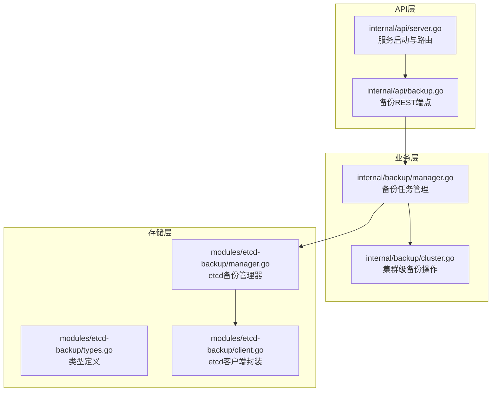
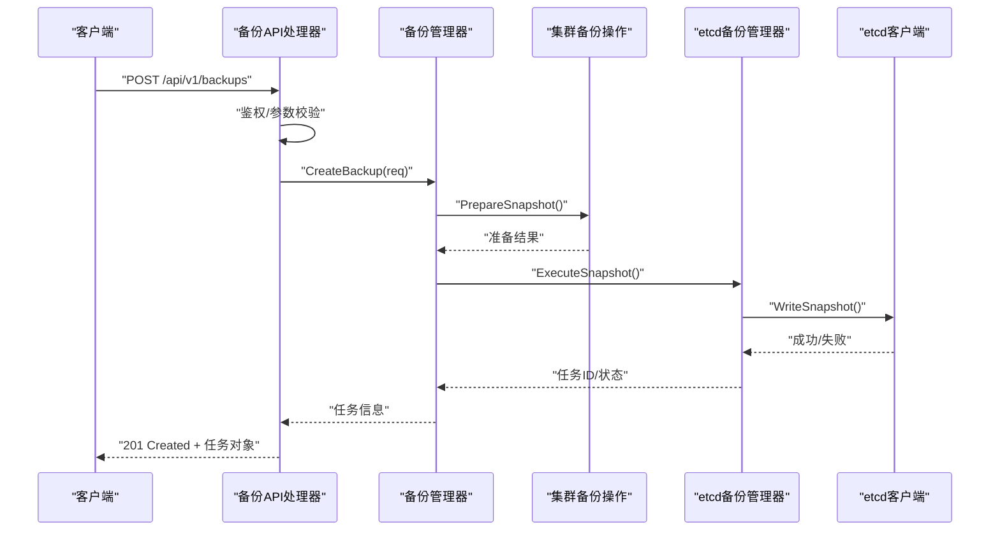
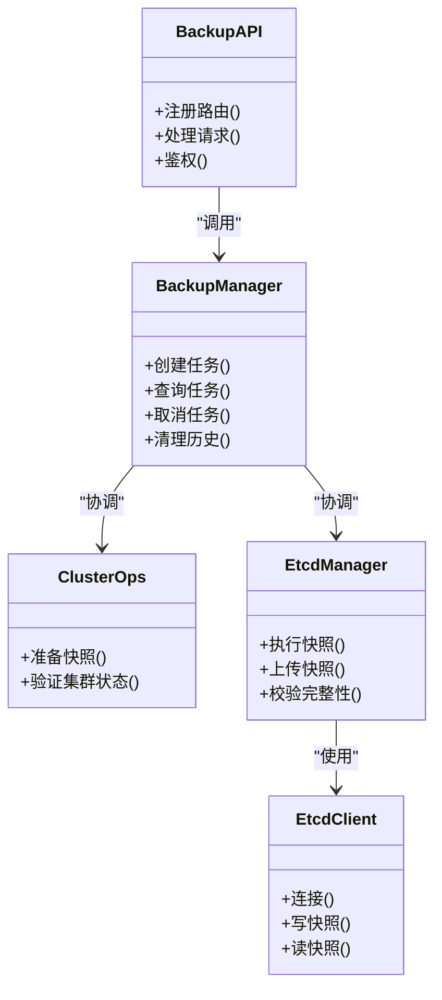

# 备份恢复API

<cite>
**本文引用的文件**   
- [internal/api/backup.go](file://internal/api/backup.go)
- [internal/backup/manager.go](file://internal/backup/manager.go)
- [internal/backup/cluster.go](file://internal/backup/cluster.go)
- [modules/etcd-backup/manager.go](file://modules/etcd-backup/manager.go)
- [modules/etcd-backup/types.go](file://modules/etcd-backup/types.go)
- [modules/etcd-backup/client.go](file://modules/etcd-backup/client.go)
- [internal/api/server.go](file://internal/api/server.go)
</cite>

## 目录
1. [简介](#简介)
2. [项目结构](#项目结构)
3. [核心组件](#核心组件)
4. [架构总览](#架构总览)
5. [详细组件分析](#详细组件分析)
6. [依赖关系分析](#依赖关系分析)
7. [性能考虑](#性能考虑)
8. [故障排查指南](#故障排查指南)
9. [结论](#结论)
10. [附录：API参考](#附录api参考)

## 简介
本文件为 Klaw 平台的“备份与恢复”相关 RESTful API 提供完整文档。内容覆盖备份策略配置、备份任务执行与查询、数据恢复等核心能力，包括 HTTP 方法、URL 模式、请求/响应体结构、认证方式、状态码与错误处理策略，并给出典型调用示例与最佳实践建议。

## 项目结构
与备份恢复相关的后端实现主要分布在以下模块：
- API 层：路由注册与处理器（HTTP 接口）
- 业务层：备份管理器与集群操作封装
- 存储层：etcd 备份客户端与类型定义

图表来源
- [internal/api/backup.go](file://internal/api/backup.go)
- [internal/api/server.go](file://internal/api/server.go)
- [internal/backup/manager.go](file://internal/backup/manager.go)
- [internal/backup/cluster.go](file://internal/backup/cluster.go)
- [modules/etcd-backup/manager.go](file://modules/etcd-backup/manager.go)
- [modules/etcd-backup/types.go](file://modules/etcd-backup/types.go)
- [modules/etcd-backup/client.go](file://modules/etcd-backup/client.go)

章节来源
- [internal/api/backup.go](file://internal/api/backup.go)
- [internal/api/server.go](file://internal/api/server.go)
- [internal/backup/manager.go](file://internal/backup/manager.go)
- [internal/backup/cluster.go](file://internal/backup/cluster.go)
- [modules/etcd-backup/manager.go](file://modules/etcd-backup/manager.go)
- [modules/etcd-backup/types.go](file://modules/etcd-backup/types.go)
- [modules/etcd-backup/client.go](file://modules/etcd-backup/client.go)

## 核心组件
- 备份API处理器：负责解析请求、参数校验、鉴权、调用业务层并返回统一响应。
- 备份管理器：编排备份生命周期（创建、调度、执行、查询、删除），协调集群操作与存储后端。
- 集群备份操作：封装针对 Kubernetes/etcd 的备份动作（如快照、导出）。
- etcd 备份客户端：与 etcd 交互，完成快照写入与读取。

章节来源
- [internal/api/backup.go](file://internal/api/backup.go)
- [internal/backup/manager.go](file://internal/backup/manager.go)
- [internal/backup/cluster.go](file://internal/backup/cluster.go)
- [modules/etcd-backup/manager.go](file://modules/etcd-backup/manager.go)
- [modules/etcd-backup/types.go](file://modules/etcd-backup/types.go)
- [modules/etcd-backup/client.go](file://modules/etcd-backup/client.go)

## 架构总览
下图展示了从 HTTP 请求到 etcd 备份/恢复的关键调用链。

图表来源
- [internal/api/backup.go](file://internal/api/backup.go)
- [internal/backup/manager.go](file://internal/backup/manager.go)
- [internal/backup/cluster.go](file://internal/backup/cluster.go)
- [modules/etcd-backup/manager.go](file://modules/etcd-backup/manager.go)
- [modules/etcd-backup/client.go](file://modules/etcd-backup/client.go)

## 详细组件分析

### 备份API处理器（REST端点）
职责
- 暴露备份与恢复相关的 RESTful 接口
- 统一鉴权、审计、参数校验
- 将请求委派给备份管理器，并返回标准响应

关键端点（概念性说明）
- 备份策略配置：GET/PUT 策略列表与详情
- 备份任务：POST 创建、GET 列表、GET 详情、DELETE 取消/删除
- 数据恢复：POST 触发恢复、GET 恢复任务状态

请求/响应要点
- 请求体包含目标集群、保留策略、存储位置、加密选项等
- 响应体包含任务ID、状态、进度、错误信息等
- 支持分页、过滤、排序（按时间、状态）

错误处理
- 400 参数错误
- 401/403 鉴权失败
- 404 资源不存在
- 409 冲突（重复策略或任务）
- 500/503 服务端或下游依赖异常

章节来源
- [internal/api/backup.go](file://internal/api/backup.go)

### 备份管理器（任务编排）
职责
- 维护备份任务的生命周期
- 协调集群操作与存储后端
- 提供查询、取消、清理等管理能力

数据结构与复杂度
- 任务表/索引：O(1) 查找、O(log n) 排序
- 并发控制：互斥锁保证同一策略不重复执行

优化点
- 批量查询使用分页
- 长耗时操作异步化，避免阻塞HTTP线程

章节来源
- [internal/backup/manager.go](file://internal/backup/manager.go)

### 集群备份操作（Kubernetes/etcd）
职责
- 封装对集群资源的备份动作（如 etcd snapshot）
- 处理权限、网络、超时与重试

章节来源
- [internal/backup/cluster.go](file://internal/backup/cluster.go)

### etcd 备份管理器与客户端
职责
- 管理器：协调快照的生成、上传、校验
- 客户端：与 etcd 建立连接、读写快照数据

章节来源
- [modules/etcd-backup/manager.go](file://modules/etcd-backup/manager.go)
- [modules/etcd-backup/types.go](file://modules/etcd-backup/types.go)
- [modules/etcd-backup/client.go](file://modules/etcd-backup/client.go)

## 依赖关系分析

图表来源
- [internal/api/backup.go](file://internal/api/backup.go)
- [internal/backup/manager.go](file://internal/backup/manager.go)
- [internal/backup/cluster.go](file://internal/backup/cluster.go)
- [modules/etcd-backup/manager.go](file://modules/etcd-backup/manager.go)
- [modules/etcd-backup/client.go](file://modules/etcd-backup/client.go)

章节来源
- [internal/api/backup.go](file://internal/api/backup.go)
- [internal/backup/manager.go](file://internal/backup/manager.go)
- [internal/backup/cluster.go](file://internal/backup/cluster.go)
- [modules/etcd-backup/manager.go](file://modules/etcd-backup/manager.go)
- [modules/etcd-backup/client.go](file://modules/etcd-backup/client.go)

## 性能考虑
- 异步任务：备份/恢复采用后台任务队列，避免阻塞HTTP请求。
- 分页与过滤：列表接口默认分页，减少大对象传输。
- 并发控制：同一策略限制并发度，防止资源争用。
- 缓存热点：频繁查询的状态可短期缓存，降低数据库压力。
- I/O优化：快照分块上传、断点续传、校验和校验。

[本节为通用指导，无需引用具体文件]

## 故障排查指南
常见问题与定位步骤
- 鉴权失败（401/403）
  - 检查令牌是否有效、角色是否具备备份/恢复权限
  - 查看审计日志中的鉴权记录
- 参数错误（400）
  - 核对请求体字段类型、必填项、取值范围
- 资源不存在（404）
  - 确认策略ID、任务ID、集群名称是否正确
- 冲突（409）
  - 避免重复创建同名策略或并行执行相同任务
- 服务端错误（5xx）
  - 查看备份管理器日志、etcd客户端连接状态、存储后端可用性

定位工具
- 启用调试日志级别
- 通过任务ID追踪全链路日志
- 检查 etcd 健康与磁盘空间

章节来源
- [internal/api/backup.go](file://internal/api/backup.go)
- [internal/backup/manager.go](file://internal/backup/manager.go)
- [modules/etcd-backup/client.go](file://modules/etcd-backup/client.go)

## 结论
本API围绕“备份策略—任务编排—集群操作—存储后端”形成闭环，提供稳定可靠的备份与恢复能力。建议在生产环境结合RBAC、审计与监控，确保数据安全与可观测性。

[本节为总结，无需引用具体文件]

## 附录：API参考

### 通用约定
- 基础路径：/api/v1
- 认证：基于令牌（Bearer Token），需在请求头中携带
- 内容类型：application/json
- 统一响应格式：{ code, message, data }

### 备份策略
- GET /api/v1/backup-strategies
  - 描述：获取所有备份策略
  - 请求参数：page, size, filter_by_name, sort_by
  - 响应：策略列表（含ID、名称、cron表达式、保留数量、存储位置）
- GET /api/v1/backup-strategies/{id}
  - 描述：获取指定策略详情
- PUT /api/v1/backup-strategies/{id}
  - 描述：更新策略（名称、调度、保留策略、存储配置）
  - 请求体：策略字段
  - 响应：更新后的策略

### 备份任务
- POST /api/v1/backups
  - 描述：创建一次备份任务
  - 请求体：strategy_id（可选）、cluster、storage、encryption、labels
  - 响应：201 Created，返回任务对象（task_id、status、progress）
- GET /api/v1/backups
  - 描述：列出备份任务（支持分页、过滤、排序）
- GET /api/v1/backups/{task_id}
  - 描述：获取任务详情（状态、进度、错误信息、产物地址）
- DELETE /api/v1/backups/{task_id}
  - 描述：取消或删除任务（根据状态决定）

### 数据恢复
- POST /api/v1/restores
  - 描述：触发数据恢复
  - 请求体：backup_id、target_cluster、dry_run、force_overwrite
  - 响应：201 Created，返回恢复任务对象
- GET /api/v1/restores
  - 描述：列出恢复任务
- GET /api/v1/restores/{restore_id}
  - 描述：获取恢复任务详情（阶段、进度、错误）

### 状态码与错误处理
- 200 成功
- 201 已创建
- 400 参数错误
- 401 未认证
- 403 无权限
- 404 资源不存在
- 409 冲突
- 500 内部错误
- 503 服务不可用（下游依赖异常）

### 请求/响应示例（概念性）
- 创建备份任务
  - 请求：POST /api/v1/backups
  - 响应：{ code: 201, message: "success", data: { task_id: "...", status: "pending", progress: 0 } }
- 查询任务详情
  - 请求：GET /api/v1/backups/{task_id}
  - 响应：{ code: 200, message: "success", data: { task_id: "...", status: "running", progress: 60, error: null } }
- 触发恢复
  - 请求：POST /api/v1/restores
  - 响应：{ code: 201, message: "success", data: { restore_id: "...", status: "preparing", progress: 0 } }

[本节为API参考，未直接分析具体文件，故不附加章节来源]