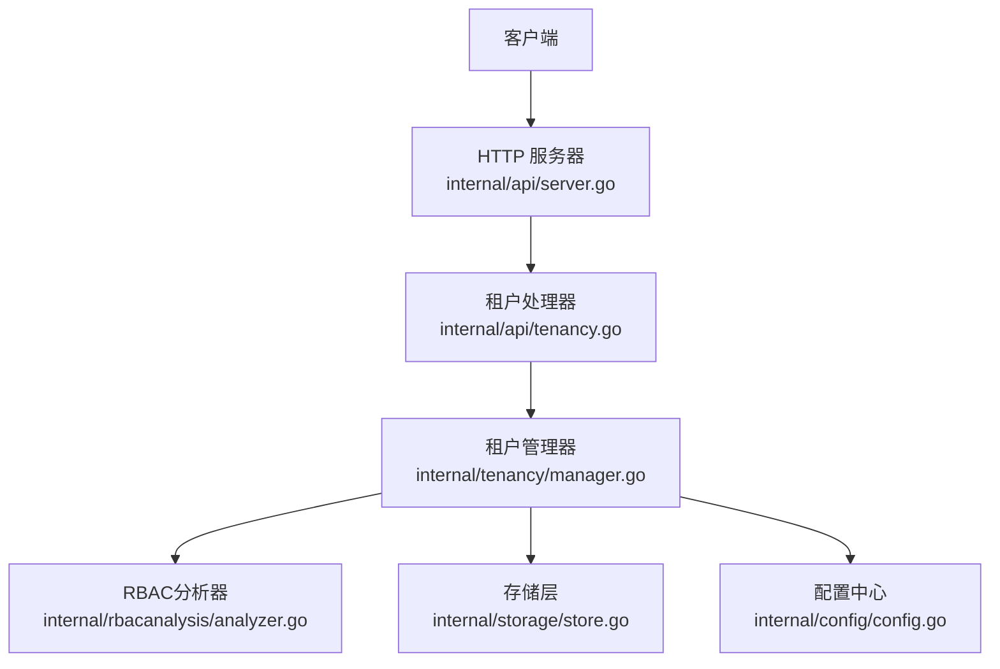
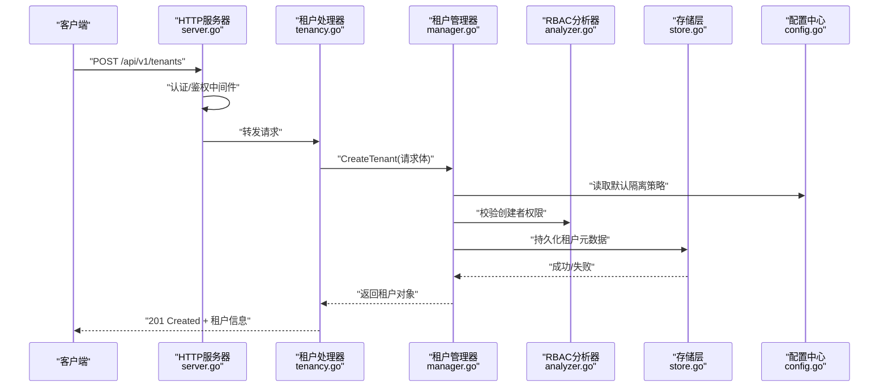
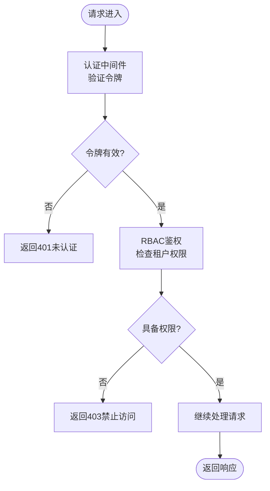
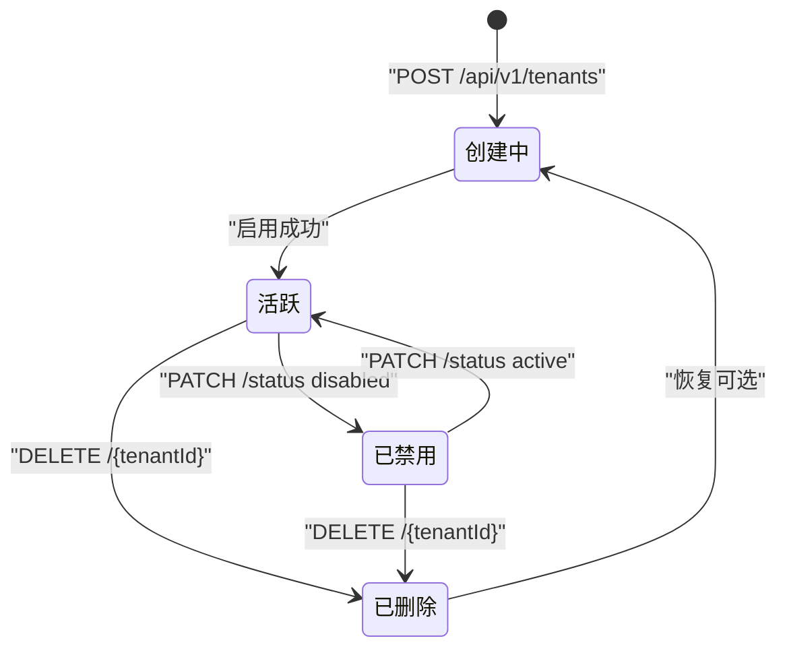
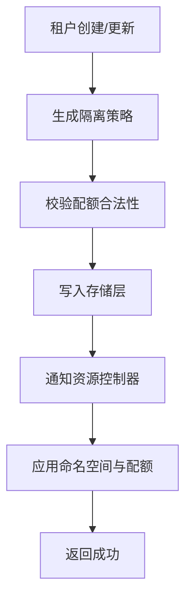
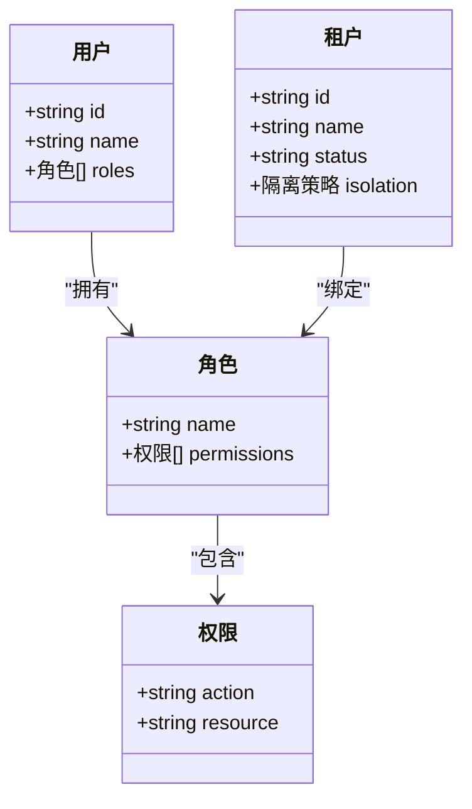
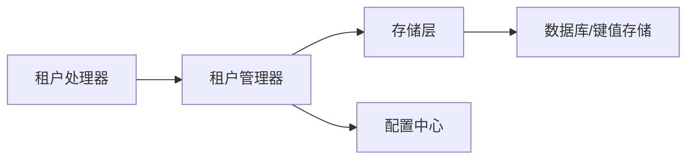
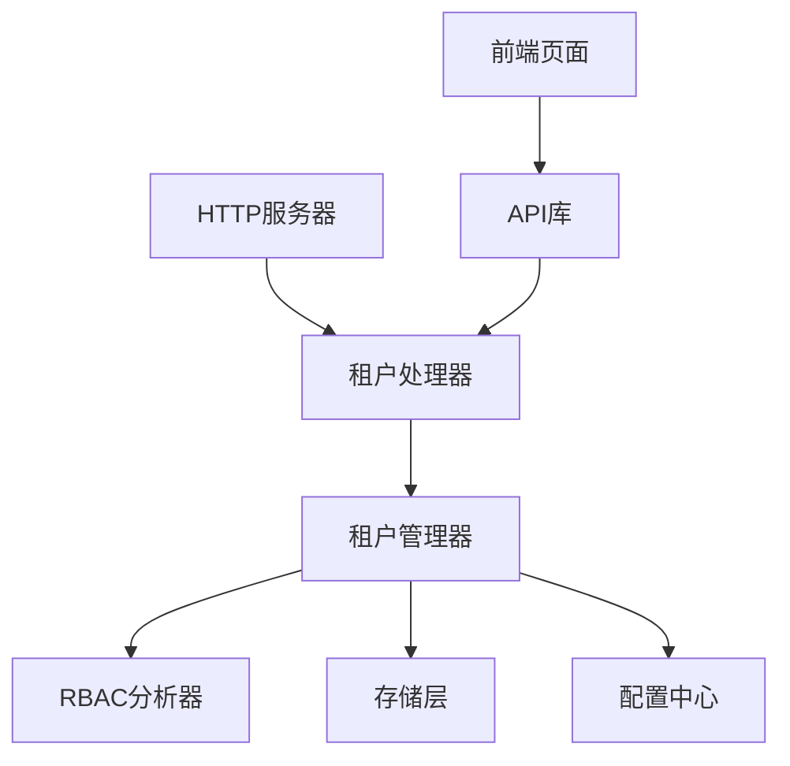

# 租户管理API

<cite>
**本文引用的文件**   
- [internal/api/tenancy.go](file://internal/api/tenancy.go)
- [internal/api/server.go](file://internal/api/server.go)
- [internal/tenancy/manager.go](file://internal/tenancy/manager.go)
- [internal/rbacanalysis/analyzer.go](file://internal/rbacanalysis/analyzer.go)
- [internal/storage/store.go](file://internal/storage/store.go)
- [internal/config/config.go](file://internal/config/config.go)
- [web/src/pages/TenantsPage.tsx](file://web/src/pages/TenantsPage.tsx)
- [web/src/lib/api.ts](file://web/src/lib/api.ts)
</cite>

## 目录
1. [简介](#简介)
2. [项目结构](#项目结构)
3. [核心组件](#核心组件)
4. [架构总览](#架构总览)
5. [详细组件分析](#详细组件分析)
6. [依赖分析](#依赖分析)
7. [性能考虑](#性能考虑)
8. [故障排查指南](#故障排查指南)
9. [结论](#结论)
10. [附录](#附录)

## 简介
本文件为 Klaw 平台的“租户管理API”提供系统化、可操作的文档。内容覆盖多租户相关的RESTful端点、请求/响应模式、认证与鉴权、错误处理策略，以及租户生命周期管理、RBAC权限控制、命名空间隔离等关键能力。读者可据此完成租户的创建、配置、权限分配、资源隔离与运维操作。

## 项目结构
与租户管理API直接相关的后端代码主要位于 internal/api 与 internal/tenancy 两个模块：
- internal/api/tenancy.go：定义并注册租户相关HTTP路由与处理器
- internal/api/server.go：HTTP服务器初始化与中间件装配（含认证/鉴权）
- internal/tenancy/manager.go：租户领域逻辑（CRUD、状态机、隔离策略）
- internal/rbacanalysis/analyzer.go：RBAC分析与权限校验辅助
- internal/storage/store.go：持久化存储抽象（用于租户元数据）
- internal/config/config.go：配置项加载（如租户默认隔离策略）
- web/src/pages/TenantsPage.tsx 与 web/src/lib/api.ts：前端页面与API调用封装（便于理解接口使用方式）

**图表来源** 
- [internal/api/server.go](file://internal/api/server.go)
- [internal/api/tenancy.go](file://internal/api/tenancy.go)
- [internal/tenancy/manager.go](file://internal/tenancy/manager.go)
- [internal/rbacanalysis/analyzer.go](file://internal/rbacanalysis/analyzer.go)
- [internal/storage/store.go](file://internal/storage/store.go)
- [internal/config/config.go](file://internal/config/config.go)

**章节来源**
- [internal/api/tenancy.go](file://internal/api/tenancy.go)
- [internal/api/server.go](file://internal/api/server.go)
- [internal/tenancy/manager.go](file://internal/tenancy/manager.go)

## 核心组件
- HTTP路由与处理器（internal/api/tenancy.go）
  - 负责解析请求、参数校验、调用业务层、返回统一响应格式
  - 典型端点包括：创建租户、更新租户、删除租户、查询租户列表/详情、切换活跃租户、获取当前租户上下文
- 租户管理器（internal/tenancy/manager.go）
  - 实现租户生命周期：创建、启用/禁用、软删除、恢复
  - 维护租户元数据与隔离策略（命名空间、RBAC角色绑定）
  - 与存储层交互进行持久化
- RBAC分析器（internal/rbacanalysis/analyzer.go）
  - 基于角色与资源的访问控制检查
  - 支持按租户维度进行权限判定
- 存储层（internal/storage/store.go）
  - 抽象键值或结构化存储，提供CRUD能力
- 配置中心（internal/config/config.go）
  - 提供租户默认隔离策略、配额、审计开关等

**章节来源**
- [internal/api/tenancy.go](file://internal/api/tenancy.go)
- [internal/tenancy/manager.go](file://internal/tenancy/manager.go)
- [internal/rbacanalysis/analyzer.go](file://internal/rbacanalysis/analyzer.go)
- [internal/storage/store.go](file://internal/storage/store.go)
- [internal/config/config.go](file://internal/config/config.go)

## 架构总览
下图展示了从客户端到租户管理的完整调用链，包括认证、鉴权、业务处理与持久化。

**图表来源** 
- [internal/api/server.go](file://internal/api/server.go)
- [internal/api/tenancy.go](file://internal/api/tenancy.go)
- [internal/tenancy/manager.go](file://internal/tenancy/manager.go)
- [internal/rbacanalysis/analyzer.go](file://internal/rbacanalysis/analyzer.go)
- [internal/storage/store.go](file://internal/storage/store.go)
- [internal/config/config.go](file://internal/config/config.go)

## 详细组件分析

### 租户管理API端点
以下端点均受认证与RBAC鉴权保护。所有路径前缀建议为 /api/v1/tenants。

- 创建租户
  - 方法: POST
  - URL: /api/v1/tenants
  - 请求体: 包含租户标识、名称、描述、隔离策略（命名空间/资源配额）、管理员用户ID列表等
  - 响应: 201 Created，返回租户对象（含id、name、status、isolation、createdAt等）
  - 错误: 400 参数校验失败；401 未认证；403 无权限；409 租户标识冲突；500 服务异常
  - 示例请求:
    - Content-Type: application/json
    - Body: { "id": "tenant-a", "name": "租户A", "description": "测试租户", "isolation": { "namespace": "ns-a", "quota": { "cpu": "2", "memory": "4Gi" } }, "admin_users": ["user-1","user-2"] }
  - 示例响应:
    - 201 Created
    - Body: { "id": "tenant-a", "name": "租户A", "description": "测试租户", "status": "active", "isolation": { "namespace": "ns-a", "quota": { "cpu": "2", "memory": "4Gi" } }, "admin_users": ["user-1","user-2"], "created_at": "2025-01-01T00:00:00Z" }

- 更新租户
  - 方法: PUT
  - URL: /api/v1/tenants/{tenantId}
  - 请求体: 可更新的字段（名称、描述、隔离策略、管理员列表等）
  - 响应: 200 OK，返回更新后的租户对象
  - 错误: 400 参数校验失败；401 未认证；403 无权限；404 租户不存在；500 服务异常

- 删除租户
  - 方法: DELETE
  - URL: /api/v1/tenants/{tenantId}
  - 响应: 204 No Content
  - 错误: 401 未认证；403 无权限；404 租户不存在；500 服务异常

- 查询租户列表
  - 方法: GET
  - URL: /api/v1/tenants
  - 查询参数: page, pageSize, status, name
  - 响应: 200 OK，返回分页结果（items数组、total、page、pageSize）
  - 错误: 401 未认证；403 无权限；500 服务异常

- 查询租户详情
  - 方法: GET
  - URL: /api/v1/tenants/{tenantId}
  - 响应: 200 OK，返回租户对象
  - 错误: 401 未认证；403 无权限；404 租户不存在；500 服务异常

- 切换活跃租户（会话级）
  - 方法: POST
  - URL: /api/v1/tenants/current
  - 请求体: { "tenantId": "tenant-a" }
  - 响应: 200 OK，返回当前租户上下文
  - 错误: 400 参数校验失败；401 未认证；403 无权限；404 租户不存在；500 服务异常

- 获取当前租户上下文
  - 方法: GET
  - URL: /api/v1/tenants/current
  - 响应: 200 OK，返回当前租户上下文（含租户ID、名称、隔离策略、角色等）
  - 错误: 401 未认证；403 无权限；500 服务异常

- 分配/移除管理员
  - 方法: PATCH
  - URL: /api/v1/tenants/{tenantId}/admins
  - 请求体: { "add": ["user-1"], "remove": ["user-2"] }
  - 响应: 200 OK，返回更新后的管理员列表
  - 错误: 400 参数校验失败；401 未认证；403 无权限；404 租户不存在；500 服务异常

- 设置/更新隔离策略
  - 方法: PATCH
  - URL: /api/v1/tenants/{tenantId}/isolation
  - 请求体: { "namespace": "ns-b", "quota": { "cpu": "4", "memory": "8Gi" } }
  - 响应: 200 OK，返回更新后的隔离策略
  - 错误: 400 参数校验失败；401 未认证；403 无权限；404 租户不存在；500 服务异常

- 启用/禁用租户
  - 方法: PATCH
  - URL: /api/v1/tenants/{tenantId}/status
  - 请求体: { "status": "disabled" }
  - 响应: 200 OK，返回更新后的租户状态
  - 错误: 400 参数校验失败；401 未认证；403 无权限；404 租户不存在；500 服务异常

说明
- 所有写操作需具备租户管理员或平台管理员角色
- 读操作需具备租户只读或更高权限
- 隔离策略变更将影响后续资源创建与访问范围

**章节来源**
- [internal/api/tenancy.go](file://internal/api/tenancy.go)
- [internal/tenancy/manager.go](file://internal/tenancy/manager.go)

### 认证与鉴权流程
- 认证：通过HTTP头部携带令牌（例如 Authorization: Bearer <token>），由服务器中间件验证令牌有效性
- 鉴权：基于RBAC模型，校验当前用户是否对目标租户具备所需角色（管理员/编辑/只读）
- 上下文：成功鉴权后，在请求上下文中注入当前用户与租户信息，供后续处理器使用

**图表来源** 
- [internal/api/server.go](file://internal/api/server.go)
- [internal/rbacanalysis/analyzer.go](file://internal/rbacanalysis/analyzer.go)

**章节来源**
- [internal/api/server.go](file://internal/api/server.go)
- [internal/rbacanalysis/analyzer.go](file://internal/rbacanalysis/analyzer.go)

### 租户生命周期状态机
租户状态包括：创建中、活跃、已禁用、已删除（软删除）。状态转换如下：

**图表来源** 
- [internal/tenancy/manager.go](file://internal/tenancy/manager.go)

**章节来源**
- [internal/tenancy/manager.go](file://internal/tenancy/manager.go)

### 命名空间与资源隔离
- 命名空间隔离：每个租户映射到一个Kubernetes命名空间（或其他隔离域），确保资源互不可见
- 配额限制：CPU/内存等资源配额在租户级别生效，防止资源争用
- 策略下发：隔离策略变更后，系统自动同步至底层资源控制器

**图表来源** 
- [internal/tenancy/manager.go](file://internal/tenancy/manager.go)
- [internal/storage/store.go](file://internal/storage/store.go)
- [internal/config/config.go](file://internal/config/config.go)

**章节来源**
- [internal/tenancy/manager.go](file://internal/tenancy/manager.go)
- [internal/storage/store.go](file://internal/storage/store.go)
- [internal/config/config.go](file://internal/config/config.go)

### RBAC权限控制
- 角色模型：平台管理员、租户管理员、租户编辑、租户只读
- 资源粒度：租户、租户下的命名空间、租户下的工作负载
- 权限判定：结合用户角色与租户上下文进行细粒度授权

**图表来源** 
- [internal/rbacanalysis/analyzer.go](file://internal/rbacanalysis/analyzer.go)
- [internal/tenancy/manager.go](file://internal/tenancy/manager.go)

**章节来源**
- [internal/rbacanalysis/analyzer.go](file://internal/rbacanalysis/analyzer.go)
- [internal/tenancy/manager.go](file://internal/tenancy/manager.go)

### 存储与配置
- 存储层：提供租户元数据的CRUD能力，支持事务与一致性保障
- 配置中心：提供租户默认隔离策略、配额上限、审计开关等全局配置

**图表来源** 
- [internal/api/tenancy.go](file://internal/api/tenancy.go)
- [internal/tenancy/manager.go](file://internal/tenancy/manager.go)
- [internal/storage/store.go](file://internal/storage/store.go)
- [internal/config/config.go](file://internal/config/config.go)

**章节来源**
- [internal/api/tenancy.go](file://internal/api/tenancy.go)
- [internal/tenancy/manager.go](file://internal/tenancy/manager.go)
- [internal/storage/store.go](file://internal/storage/store.go)
- [internal/config/config.go](file://internal/config/config.go)

## 依赖分析
- HTTP服务器依赖租户处理器，处理器依赖租户管理器
- 租户管理器依赖RBAC分析器进行权限校验，依赖存储层进行持久化，依赖配置中心读取默认策略
- 前端页面通过API库调用后端端点，展示与管理租户

**图表来源** 
- [internal/api/server.go](file://internal/api/server.go)
- [internal/api/tenancy.go](file://internal/api/tenancy.go)
- [internal/tenancy/manager.go](file://internal/tenancy/manager.go)
- [internal/rbacanalysis/analyzer.go](file://internal/rbacanalysis/analyzer.go)
- [internal/storage/store.go](file://internal/storage/store.go)
- [internal/config/config.go](file://internal/config/config.go)
- [web/src/pages/TenantsPage.tsx](file://web/src/pages/TenantsPage.tsx)
- [web/src/lib/api.ts](file://web/src/lib/api.ts)

**章节来源**
- [internal/api/server.go](file://internal/api/server.go)
- [internal/api/tenancy.go](file://internal/api/tenancy.go)
- [internal/tenancy/manager.go](file://internal/tenancy/manager.go)
- [internal/rbacanalysis/analyzer.go](file://internal/rbacanalysis/analyzer.go)
- [internal/storage/store.go](file://internal/storage/store.go)
- [internal/config/config.go](file://internal/config/config.go)
- [web/src/pages/TenantsPage.tsx](file://web/src/pages/TenantsPage.tsx)
- [web/src/lib/api.ts](file://web/src/lib/api.ts)

## 性能考虑
- 缓存热点数据：租户元数据与RBAC角色绑定可短期缓存，减少存储压力
- 批量操作：提供批量创建/更新接口以降低网络往返
- 异步任务：隔离策略下发与配额应用采用异步队列，避免阻塞主流程
- 分页与过滤：列表接口支持分页与条件过滤，降低响应体积

[本节为通用指导，不直接分析具体文件]

## 故障排查指南
- 401 未认证：检查Authorization头是否正确携带有效令牌
- 403 禁止访问：确认当前用户具备目标租户的相应角色
- 400 参数校验失败：检查请求体字段类型与必填项
- 404 租户不存在：确认租户ID正确且未被删除
- 409 冲突：租户标识重复或状态不允许当前操作
- 500 服务异常：查看服务端日志，定位存储或RBAC分析器异常

**章节来源**
- [internal/api/tenancy.go](file://internal/api/tenancy.go)
- [internal/rbacanalysis/analyzer.go](file://internal/rbacanalysis/analyzer.go)

## 结论
本租户管理API围绕多租户场景提供了完整的生命周期管理与RBAC权限控制，并通过命名空间与配额实现资源隔离。建议在集成时严格遵循认证与鉴权流程，合理设计租户隔离策略，并结合缓存与异步机制提升性能。

[本节为总结性内容，不直接分析具体文件]

## 附录
- 前端参考：TenantsPage.tsx 与 api.ts 展示了如何调用租户相关端点，可作为集成参考
- 配置项：内部配置中心提供租户默认隔离策略与配额上限，可在部署时调整

**章节来源**
- [web/src/pages/TenantsPage.tsx](file://web/src/pages/TenantsPage.tsx)
- [web/src/lib/api.ts](file://web/src/lib/api.ts)
- [internal/config/config.go](file://internal/config/config.go)