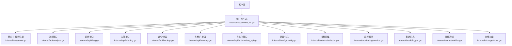
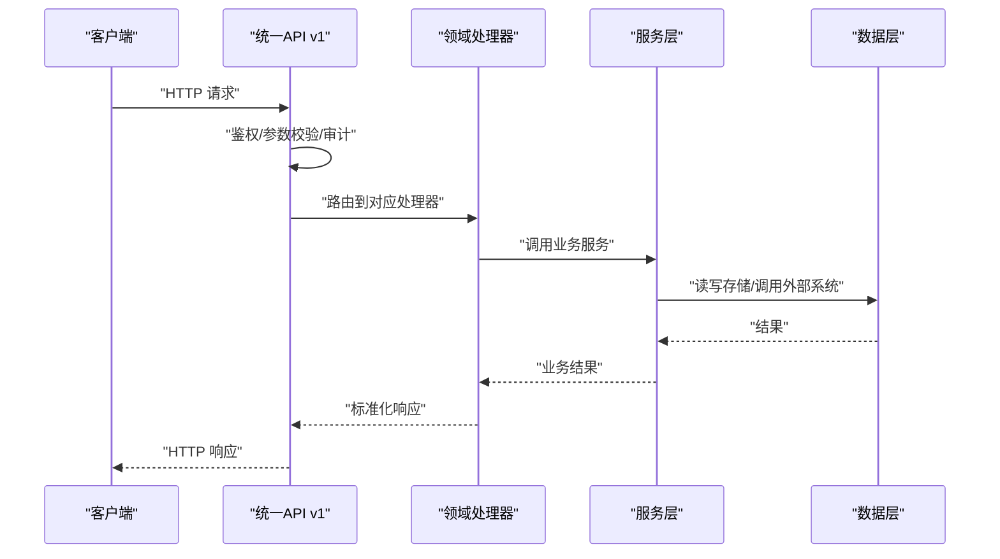
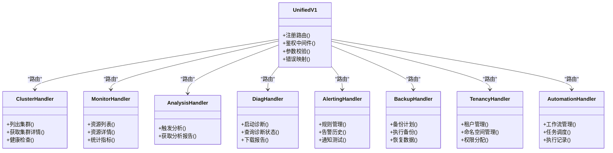
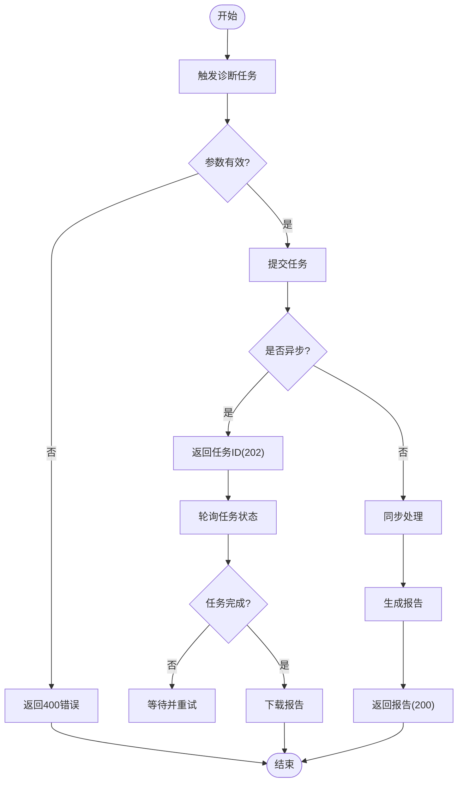
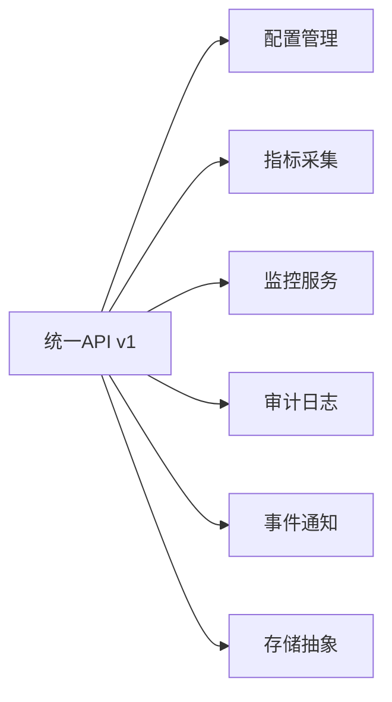

# 统一API (v1)

<cite>
**本文引用的文件**   
- [internal/api/unified_v1.go](file://internal/api/unified_v1.go)
- [internal/api/server.go](file://internal/api/server.go)
- [internal/api/analysis.go](file://internal/api/analysis.go)
- [internal/api/diag.go](file://internal/api/diag.go)
- [internal/api/alerting.go](file://internal/api/alerting.go)
- [internal/api/backup.go](file://internal/api/backup.go)
- [internal/api/tenancy.go](file://internal/api/tenancy.go)
- [internal/api/automation_api.go](file://internal/api/automation_api.go)
- [internal/api/handlers_test.go](file://internal/api/handlers_test.go)
- [internal/api/unified_v1_test.go](file://internal/api/unified_v1_test.go)
- [internal/config/config.go](file://internal/config/config.go)
- [internal/metrics/collector.go](file://internal/metrics/collector.go)
- [internal/monitoring/service.go](file://internal/monitoring/service.go)
- [internal/audit/logger.go](file://internal/audit/logger.go)
- [internal/events/notifier.go](file://internal/events/notifier.go)
- [internal/storage/store.go](file://internal/storage/store.go)
</cite>

## 目录
1. [简介](#简介)
2. [项目结构](#项目结构)
3. [核心组件](#核心组件)
4. [架构总览](#架构总览)
5. [详细组件分析](#详细组件分析)
6. [依赖关系分析](#依赖关系分析)
7. [性能考量](#性能考量)
8. [故障排查指南](#故障排查指南)
9. [结论](#结论)
10. [附录](#附录)

## 简介
本文件为 Klaw 平台的统一API v1 的权威文档，覆盖所有RESTful端点、HTTP方法、URL模式、请求与响应模式、认证方式与错误处理策略。重点涵盖集群管理、资源监控、诊断分析等核心能力，并提供客户端集成指南与最佳实践，帮助开发者快速、稳定地对接Klaw平台。

## 项目结构
统一API v1位于后端API层，采用模块化路由组织：
- 统一入口与路由注册：server.go
- 统一版本化接口定义：unified_v1.go
- 功能域处理器：analysis.go（分析）、diag.go（诊断）、alerting.go（告警）、backup.go（备份）、tenancy.go（多租户）、automation_api.go（自动化）
- 配置与指标：config.go、metrics/collector.go
- 监控服务：monitoring/service.go
- 审计日志：audit/logger.go
- 事件通知：events/notifier.go
- 存储抽象：storage/store.go

**图示来源** 
- [internal/api/server.go](file://internal/api/server.go)
- [internal/api/unified_v1.go](file://internal/api/unified_v1.go)
- [internal/api/analysis.go](file://internal/api/analysis.go)
- [internal/api/diag.go](file://internal/api/diag.go)
- [internal/api/alerting.go](file://internal/api/alerting.go)
- [internal/api/backup.go](file://internal/api/backup.go)
- [internal/api/tenancy.go](file://internal/api/tenancy.go)
- [internal/api/automation_api.go](file://internal/api/automation_api.go)
- [internal/config/config.go](file://internal/config/config.go)
- [internal/metrics/collector.go](file://internal/metrics/collector.go)
- [internal/monitoring/service.go](file://internal/monitoring/service.go)
- [internal/audit/logger.go](file://internal/audit/logger.go)
- [internal/events/notifier.go](file://internal/events/notifier.go)
- [internal/storage/store.go](file://internal/storage/store.go)

**章节来源**
- [internal/api/server.go](file://internal/api/server.go)
- [internal/api/unified_v1.go](file://internal/api/unified_v1.go)

## 核心组件
- 统一API控制器：负责版本化路由分发、参数校验、鉴权上下文注入、响应封装与错误码映射。
- 领域处理器：按功能域拆分，如分析、诊断、告警、备份、多租户、自动化等，保持高内聚低耦合。
- 基础设施：配置、指标、监控、审计、事件、存储等通用能力通过依赖注入或全局单例提供。

关键职责与交互：
- 路由注册与中间件链：在server.go中集中注册，确保认证、限流、审计等横切关注点一致生效。
- 请求生命周期：解析请求 -> 鉴权 -> 参数校验 -> 调用领域处理器 -> 业务逻辑 -> 持久化/外部系统 -> 返回响应。
- 错误处理：统一错误码、结构化错误体、可观测性埋点（指标+审计）。

**章节来源**
- [internal/api/unified_v1.go](file://internal/api/unified_v1.go)
- [internal/api/server.go](file://internal/api/server.go)

## 架构总览
统一API v1采用分层架构：
- 接入层：HTTP路由与中间件（认证、审计、限流、重试）
- 控制层：统一API控制器与领域处理器
- 服务层：监控、分析、诊断、告警、备份、多租户、自动化等业务服务
- 数据层：存储抽象、外部系统（Kubernetes、消息队列、对象存储等）

**图示来源** 
- [internal/api/unified_v1.go](file://internal/api/unified_v1.go)
- [internal/api/server.go](file://internal/api/server.go)

## 详细组件分析

### 统一API v1 路由与控制器
- 路由前缀：/api/v1
- 主要能力：
  - 集群管理：集群列表、详情、健康检查、节点信息
  - 资源监控：Pod/Deployment/Service等资源的查询与统计
  - 诊断分析：触发诊断任务、获取诊断报告、规则引擎执行
  - 告警：告警规则、告警历史、通知渠道
  - 备份：备份计划、执行、恢复
  - 多租户：租户、命名空间、权限
  - 自动化：工作流编排、任务调度
- 认证：支持Token/Bearer认证，鉴权中间件注入用户上下文
- 错误处理：统一错误码、错误体结构、重试建议

**图示来源** 
- [internal/api/unified_v1.go](file://internal/api/unified_v1.go)
- [internal/api/analysis.go](file://internal/api/analysis.go)
- [internal/api/diag.go](file://internal/api/diag.go)
- [internal/api/alerting.go](file://internal/api/alerting.go)
- [internal/api/backup.go](file://internal/api/backup.go)
- [internal/api/tenancy.go](file://internal/api/tenancy.go)
- [internal/api/automation_api.go](file://internal/api/automation_api.go)

**章节来源**
- [internal/api/unified_v1.go](file://internal/api/unified_v1.go)
- [internal/api/analysis.go](file://internal/api/analysis.go)
- [internal/api/diag.go](file://internal/api/diag.go)
- [internal/api/alerting.go](file://internal/api/alerting.go)
- [internal/api/backup.go](file://internal/api/backup.go)
- [internal/api/tenancy.go](file://internal/api/tenancy.go)
- [internal/api/automation_api.go](file://internal/api/automation_api.go)

### 集群管理API
- 端点示例：
  - GET /api/v1/clusters - 列出集群
  - GET /api/v1/clusters/{id} - 获取集群详情
  - POST /api/v1/clusters - 添加集群
  - DELETE /api/v1/clusters/{id} - 删除集群
  - GET /api/v1/clusters/{id}/health - 健康检查
- 认证：Bearer Token
- 请求示例：
  - 添加集群：JSON格式包含名称、连接信息、标签等
- 响应示例：
  - 成功：200/201，返回集群对象
  - 失败：400/401/403/404/500，返回错误体
- 错误处理：
  - 参数校验失败：400
  - 未认证：401
  - 无权限：403
  - 资源不存在：404
  - 服务器错误：500

**章节来源**
- [internal/api/unified_v1.go](file://internal/api/unified_v1.go)

### 资源监控API
- 端点示例：
  - GET /api/v1/resources/namespaces - 命名空间列表
  - GET /api/v1/resources/pods - Pod列表
  - GET /api/v1/resources/deployments - Deployment列表
  - GET /api/v1/resources/services - Service列表
  - GET /api/v1/resources/stats - 资源统计
- 认证：Bearer Token
- 请求示例：
  - 查询Pod：支持过滤条件如namespace、label、status
- 响应示例：
  - 成功：200，返回列表与分页信息
  - 失败：标准错误体
- 错误处理：同集群管理

**章节来源**
- [internal/api/unified_v1.go](file://internal/api/unified_v1.go)
- [internal/monitoring/service.go](file://internal/monitoring/service.go)

### 诊断分析API
- 端点示例：
  - POST /api/v1/diagnostics - 触发诊断
  - GET /api/v1/diagnostics/{id} - 查询诊断状态
  - GET /api/v1/diagnostics/{id}/report - 下载报告
  - GET /api/v1/diagnostics/rules - 规则列表
- 认证：Bearer Token
- 请求示例：
  - 触发诊断：JSON包含诊断类型、目标集群、规则集
- 响应示例：
  - 异步任务：202，返回任务ID
  - 同步报告：200，返回报告内容
- 错误处理：
  - 任务失败：422/500
  - 报告生成失败：500

**图示来源** 
- [internal/api/diag.go](file://internal/api/diag.go)

**章节来源**
- [internal/api/diag.go](file://internal/api/diag.go)

### 告警API
- 端点示例：
  - GET /api/v1/alerts/rules - 告警规则列表
  - POST /api/v1/alerts/rules - 创建规则
  - PUT /api/v1/alerts/rules/{id} - 更新规则
  - DELETE /api/v1/alerts/rules/{id} - 删除规则
  - GET /api/v1/alerts/history - 告警历史
  - POST /api/v1/alerts/test - 通知测试
- 认证：Bearer Token
- 请求示例：
  - 创建规则：JSON包含表达式、阈值、通知渠道
- 响应示例：
  - 成功：201/200
  - 失败：标准错误体
- 错误处理：
  - 规则无效：400
  - 通知失败：500

**章节来源**
- [internal/api/alerting.go](file://internal/api/alerting.go)

### 备份API
- 端点示例：
  - GET /api/v1/backups/schedules - 备份计划列表
  - POST /api/v1/backups/schedules - 创建计划
  - POST /api/v1/backups/{id}/execute - 执行备份
  - GET /api/v1/backups/{id}/status - 查询状态
  - POST /api/v1/backups/{id}/restore - 恢复数据
- 认证：Bearer Token
- 请求示例：
  - 创建计划：JSON包含频率、保留策略、存储位置
- 响应示例：
  - 成功：201/200
  - 失败：标准错误体
- 错误处理：
  - 存储不可用：500
  - 恢复失败：500

**章节来源**
- [internal/api/backup.go](file://internal/api/backup.go)

### 多租户API
- 端点示例：
  - GET /api/v1/tenants - 租户列表
  - POST /api/v1/tenants - 创建租户
  - PUT /api/v1/tenants/{id} - 更新租户
  - DELETE /api/v1/tenants/{id} - 删除租户
  - GET /api/v1/tenants/{id}/namespaces - 命名空间列表
  - POST /api/v1/tenants/{id}/roles - 角色分配
- 认证：Bearer Token，需管理员权限
- 请求示例：
  - 创建租户：JSON包含名称、描述、配额
- 响应示例：
  - 成功：201/200
  - 失败：标准错误体
- 错误处理：
  - 权限不足：403
  - 租户冲突：409

**章节来源**
- [internal/api/tenancy.go](file://internal/api/tenancy.go)

### 自动化API
- 端点示例：
  - GET /api/v1/automations/workflows - 工作流列表
  - POST /api/v1/automations/workflows - 创建工作流
  - POST /api/v1/automations/tasks - 触发任务
  - GET /api/v1/automations/tasks/{id} - 查询任务状态
  - GET /api/v1/automations/tasks/{id}/logs - 获取日志
- 认证：Bearer Token
- 请求示例：
  - 创建工作流：JSON包含步骤、条件、回调
- 响应示例：
  - 成功：201/200
  - 失败：标准错误体
- 错误处理：
  - 工作流无效：400
  - 任务执行失败：500

**章节来源**
- [internal/api/automation_api.go](file://internal/api/automation_api.go)

## 依赖关系分析
统一API v1依赖以下核心模块：
- 配置管理：读取运行时配置
- 指标采集：暴露Prometheus指标
- 监控服务：聚合资源状态
- 审计日志：记录操作审计
- 事件通知：发送告警与通知
- 存储抽象：持久化数据

**图示来源** 
- [internal/config/config.go](file://internal/config/config.go)
- [internal/metrics/collector.go](file://internal/metrics/collector.go)
- [internal/monitoring/service.go](file://internal/monitoring/service.go)
- [internal/audit/logger.go](file://internal/audit/logger.go)
- [internal/events/notifier.go](file://internal/events/notifier.go)
- [internal/storage/store.go](file://internal/storage/store.go)

**章节来源**
- [internal/config/config.go](file://internal/config/config.go)
- [internal/metrics/collector.go](file://internal/metrics/collector.go)
- [internal/monitoring/service.go](file://internal/monitoring/service.go)
- [internal/audit/logger.go](file://internal/audit/logger.go)
- [internal/events/notifier.go](file://internal/events/notifier.go)
- [internal/storage/store.go](file://internal/storage/store.go)

## 性能考量
- 缓存策略：对频繁查询的资源使用内存缓存，减少数据库压力
- 异步处理：长耗时操作（如诊断、备份）采用异步任务，避免阻塞
- 分页与过滤：支持分页和过滤，减少数据传输量
- 连接池：外部系统调用使用连接池，提高并发性能
- 限流与熔断：防止雪崩效应，保护后端服务

[本节为通用指导，无需特定文件引用]

## 故障排查指南
- 常见问题：
  - 认证失败：检查Token是否有效，权限是否正确
  - 参数错误：验证请求体格式与必填字段
  - 资源不存在：确认ID是否正确，资源是否已删除
  - 服务不可用：检查后端服务状态与网络连接
- 调试工具：
  - 启用调试日志：查看请求与响应详情
  - 指标监控：观察QPS、延迟、错误率
  - 审计日志：追踪用户操作轨迹
- 错误码说明：
  - 4xx：客户端错误，检查请求参数与认证
  - 5xx：服务器错误，检查后端服务与依赖

**章节来源**
- [internal/audit/logger.go](file://internal/audit/logger.go)
- [internal/metrics/collector.go](file://internal/metrics/collector.go)

## 结论
统一API v1为Klaw平台提供了标准化的RESTful接口，覆盖集群管理、资源监控、诊断分析等核心功能。通过模块化设计、统一错误处理与完善的认证机制，确保了系统的可扩展性与稳定性。建议客户端遵循最佳实践，合理使用缓存、分页与异步处理，以获得最佳用户体验。

[本节为总结，无需特定文件引用]

## 附录
- 客户端集成指南：
  - 使用SDK或HTTP客户端发起请求
  - 实现重试与超时机制
  - 处理错误与异常
  - 监控与日志记录
- 最佳实践：
  - 使用HTTPS传输
  - 定期轮换Token
  - 最小权限原则
  - 批量操作优化

[本节为补充信息，无需特定文件引用]