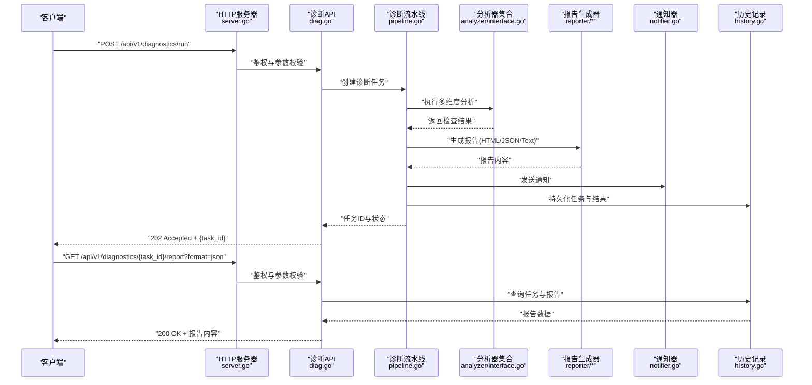
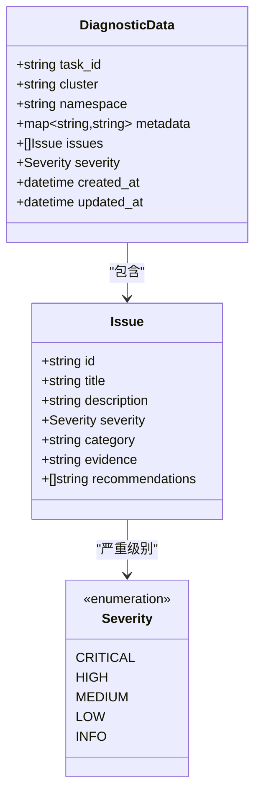
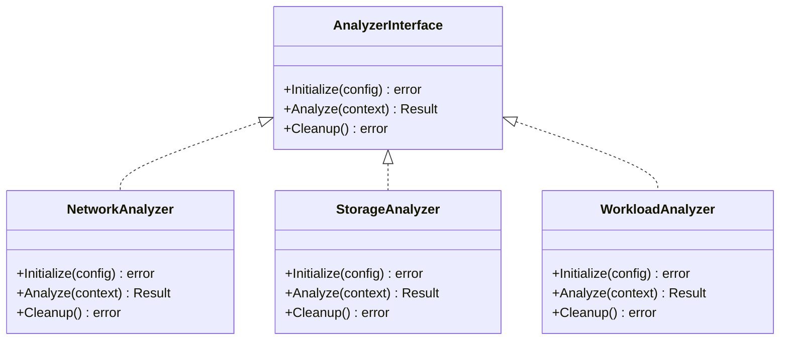
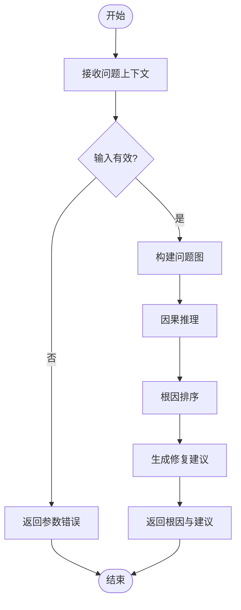
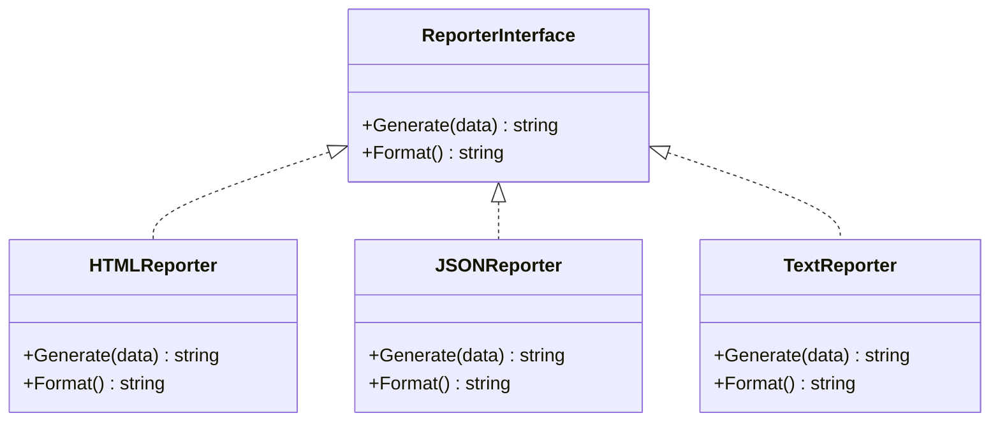
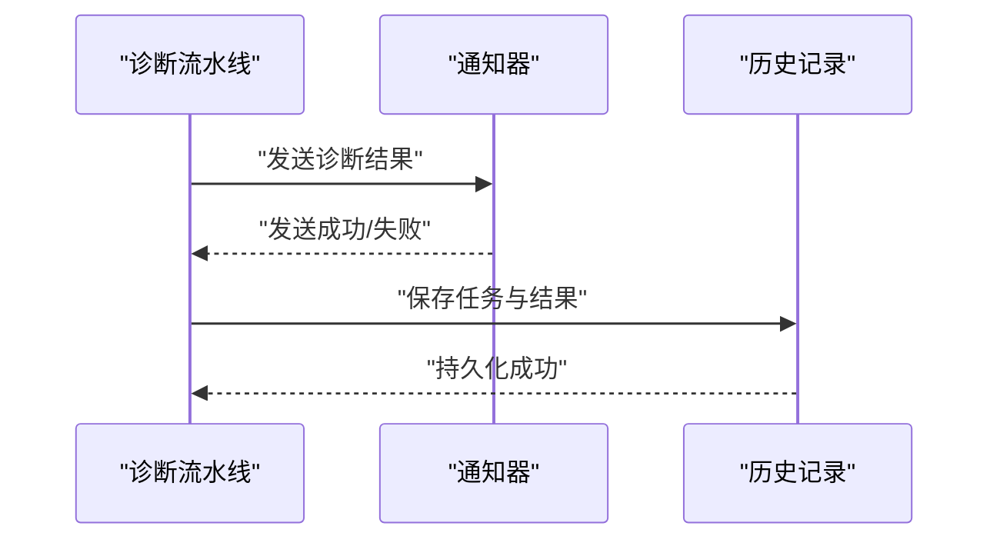
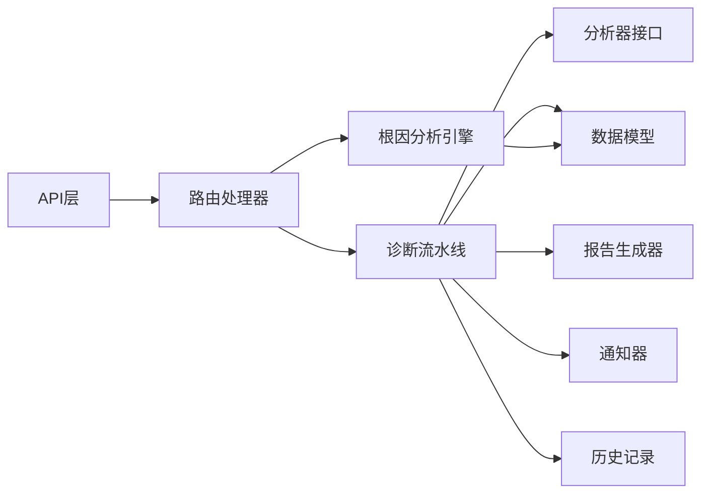

# 诊断分析API

<cite>
**本文引用的文件**   
- [internal/api/diag.go](file://internal/api/diag.go)
- [internal/api/analysis.go](file://internal/api/analysis.go)
- [internal/api/server.go](file://internal/api/server.go)
- [internal/diag/pipeline.go](file://internal/diag/pipeline.go)
- [internal/diag/types/diagnostic_data.go](file://internal/diag/types/diagnostic_data.go)
- [internal/diag/types/issue.go](file://internal/diag/types/issue.go)
- [internal/diag/types/severity.go](file://internal/diag/types/severity.go)
- [internal/diag/analyzer/interface.go](file://internal/diag/analyzer/interface.go)
- [internal/diag/rca/engine.go](file://internal/diag/rca/engine.go)
- [internal/diag/reporter/html.go](file://internal/diag/reporter/html.go)
- [internal/diag/reporter/json.go](file://internal/diag/reporter/json.go)
- [internal/diag/reporter/text.go](file://internal/diag/reporter/text.go)
- [internal/diag/notifier/notifier.go](file://internal/diag/notifier/notifier.go)
- [internal/diag/history/history.go](file://internal/diag/history/history.go)
- [internal/diag/cost/analyzer.go](file://internal/diag/cost/analyzer.go)
- [internal/diag/scanner/image.go](file://internal/diag/scanner/image.go)
- [internal/diag/tui/model.go](file://internal/diag/tui/model.go)
</cite>

## 目录
1. [简介](#简介)
2. [项目结构](#项目结构)
3. [核心组件](#核心组件)
4. [架构总览](#架构总览)
5. [详细组件分析](#详细组件分析)
6. [依赖分析](#依赖分析)
7. [性能考虑](#性能考虑)
8. [故障排查指南](#故障排查指南)
9. [结论](#结论)
10. [附录](#附录)

## 简介
本文件为 Klaw 平台的“诊断分析API”提供完整、可操作的接口文档。内容覆盖与集群诊断和问题分析相关的所有RESTful端点，包括自动诊断触发、分析报告获取、问题检测与根因分析等核心能力。文档包含HTTP方法、URL模式、请求/响应模式、认证方式、错误处理策略，以及完整的请求示例、响应格式、状态码说明和最佳实践建议，帮助开发者快速集成并稳定使用诊断能力。

## 项目结构
Klaw 的诊断分析能力由 API 层、诊断流水线、分析器、报告生成器、通知器、历史存储与成本/镜像扫描等模块组成。API 层负责路由与鉴权；诊断流水线编排采集与分析；分析器按维度（网络、存储、工作负载、安全等）执行检查；报告生成器输出多种格式；通知器将结果推送至外部系统；历史模块持久化任务与结果；成本与镜像扫描提供额外诊断维度。

```mermaid
graph TB
subgraph "API层"
API["HTTP 服务器<br/>internal/api/server.go"]
DiagAPI["诊断API路由<br/>internal/api/diag.go"]
AnalysisAPI["分析API路由<br/>internal/api/analysis.go"]
end
subgraph "诊断核心"
Pipeline["诊断流水线<br/>internal/diag/pipeline.go"]
AnalyzerIF["分析器接口<br/>internal/diag/analyzer/interface.go"]
RCA["根因分析引擎<br/>internal/diag/rca/engine.go"]
end
subgraph "数据模型"
Types["诊断数据模型<br/>internal/diag/types/*"]
end
subgraph "报告与通知"
ReporterHTML["HTML报告<br/>internal/diag/reporter/html.go"]
ReporterJSON["JSON报告<br/>internal/diag/reporter/json.go")
ReporterText["文本报告<br/>internal/diag/reporter/text.go"]
Notifier["通知器<br/>internal/diag/notifier/notifier.go"]
end
subgraph "扩展能力"
History["历史记录<br/>internal/diag/history/history.go"]
Cost["成本分析<br/>internal/diag/cost/analyzer.go"]
Scanner["镜像扫描<br/>internal/diag/scanner/image.go"]
TUI["TUI模型<br/>internal/diag/tui/model.go"]
end
API --> DiagAPI
API --> AnalysisAPI
DiagAPI --> Pipeline
AnalysisAPI --> RCA
Pipeline --> AnalyzerIF
Pipeline --> Types
Pipeline --> ReporterHTML
Pipeline --> ReporterJSON
Pipeline --> ReporterText
Pipeline --> Notifier
Pipeline --> History
Pipeline --> Cost
Pipeline --> Scanner
RCA --> Types
```

图表来源
- [internal/api/server.go](file://internal/api/server.go)
- [internal/api/diag.go](file://internal/api/diag.go)
- [internal/api/analysis.go](file://internal/api/analysis.go)
- [internal/diag/pipeline.go](file://internal/diag/pipeline.go)
- [internal/diag/analyzer/interface.go](file://internal/diag/analyzer/interface.go)
- [internal/diag/rca/engine.go](file://internal/diag/rca/engine.go)
- [internal/diag/reporter/html.go](file://internal/diag/reporter/html.go)
- [internal/diag/reporter/json.go](file://internal/diag/reporter/json.go)
- [internal/diag/reporter/text.go](file://internal/diag/reporter/text.go)
- [internal/diag/notifier/notifier.go](file://internal/diag/notifier/notifier.go)
- [internal/diag/history/history.go](file://internal/diag/history/history.go)
- [internal/diag/cost/analyzer.go](file://internal/diag/cost/analyzer.go)
- [internal/diag/scanner/image.go](file://internal/diag/scanner/image.go)
- [internal/diag/tui/model.go](file://internal/diag/tui/model.go)

章节来源
- [internal/api/server.go](file://internal/api/server.go)
- [internal/api/diag.go](file://internal/api/diag.go)
- [internal/api/analysis.go](file://internal/api/analysis.go)
- [internal/diag/pipeline.go](file://internal/diag/pipeline.go)

## 核心组件
- HTTP服务器与路由：统一入口，承载所有诊断与分析API的路由注册与中间件（如鉴权、审计）。
- 诊断API：提供触发诊断、查询任务状态、获取报告、管理规则与配置等端点。
- 分析API：提供问题检测、根因分析、成本分析、镜像扫描等分析能力。
- 诊断流水线：编排数据采集、规则匹配、分析器调用、报告生成与通知发送。
- 分析器接口：定义各维度分析器的统一契约（网络、存储、工作负载、安全、运行时等）。
- 根因分析引擎：基于问题集合进行因果推理，输出根因与建议。
- 报告生成器：支持HTML、JSON、SARIF、文本等多种格式输出。
- 通知器：将诊断结果推送到钉钉、飞书等渠道。
- 历史存储：持久化诊断任务、结果与变更轨迹。
- 成本分析与镜像扫描：扩展诊断维度，辅助优化与安全合规。

章节来源
- [internal/api/server.go](file://internal/api/server.go)
- [internal/api/diag.go](file://internal/api/diag.go)
- [internal/api/analysis.go](file://internal/api/analysis.go)
- [internal/diag/pipeline.go](file://internal/diag/pipeline.go)
- [internal/diag/analyzer/interface.go](file://internal/diag/analyzer/interface.go)
- [internal/diag/rca/engine.go](file://internal/diag/rca/engine.go)
- [internal/diag/reporter/html.go](file://internal/diag/reporter/html.go)
- [internal/diag/reporter/json.go](file://internal/diag/reporter/json.go)
- [internal/diag/reporter/text.go](file://internal/diag/reporter/text.go)
- [internal/diag/notifier/notifier.go](file://internal/diag/notifier/notifier.go)
- [internal/diag/history/history.go](file://internal/diag/history/history.go)
- [internal/diag/cost/analyzer.go](file://internal/diag/cost/analyzer.go)
- [internal/diag/scanner/image.go](file://internal/diag/scanner/image.go)

## 架构总览
下图展示从客户端发起诊断请求到报告输出的端到端流程，涵盖鉴权、任务调度、分析执行、报告生成与通知推送。



图表来源
- [internal/api/server.go](file://internal/api/server.go)
- [internal/api/diag.go](file://internal/api/diag.go)
- [internal/diag/pipeline.go](file://internal/diag/pipeline.go)
- [internal/diag/analyzer/interface.go](file://internal/diag/analyzer/interface.go)
- [internal/diag/reporter/html.go](file://internal/diag/reporter/html.go)
- [internal/diag/reporter/json.go](file://internal/diag/reporter/json.go)
- [internal/diag/reporter/text.go](file://internal/diag/reporter/text.go)
- [internal/diag/notifier/notifier.go](file://internal/diag/notifier/notifier.go)
- [internal/diag/history/history.go](file://internal/diag/history/history.go)

## 详细组件分析

### 诊断API端点
- 触发自动诊断
  - 方法：POST
  - URL：/api/v1/diagnostics/run
  - 请求体：包含目标集群、命名空间、分析范围、是否启用成本与镜像扫描等选项
  - 响应：202 Accepted，返回任务ID与预计完成时间
  - 错误：400 参数错误、401 未授权、403 权限不足、500 内部错误
- 查询任务状态
  - 方法：GET
  - URL：/api/v1/diagnostics/{task_id}
  - 响应：200 OK，返回任务状态、进度、摘要信息
  - 错误：404 任务不存在、500 内部错误
- 获取分析报告
  - 方法：GET
  - URL：/api/v1/diagnostics/{task_id}/report?format={html|json|text|sarif}
  - 响应：200 OK，返回对应格式的报告内容
  - 错误：400 不支持的格式、404 任务或报告不存在、500 内部错误
- 列出历史诊断任务
  - 方法：GET
  - URL：/api/v1/diagnostics/history?page=1&size=20
  - 响应：200 OK，分页的任务列表
  - 错误：400 参数错误、500 内部错误
- 删除历史任务
  - 方法：DELETE
  - URL：/api/v1/diagnostics/history/{task_id}
  - 响应：204 No Content
  - 错误：404 任务不存在、500 内部错误

章节来源
- [internal/api/diag.go](file://internal/api/diag.go)
- [internal/diag/history/history.go](file://internal/diag/history/history.go)

### 分析API端点
- 问题检测
  - 方法：POST
  - URL：/api/v1/analysis/issues
  - 请求体：输入指标、日志片段、事件流等
  - 响应：200 OK，返回问题列表与严重级别
  - 错误：400 参数错误、500 内部错误
- 根因分析
  - 方法：POST
  - URL：/api/v1/analysis/rca
  - 请求体：问题集合上下文
  - 响应：200 OK，返回根因推断与建议
  - 错误：400 参数错误、500 内部错误
- 成本分析
  - 方法：POST
  - URL：/api/v1/analysis/cost
  - 请求体：资源使用与计费数据
  - 响应：200 OK，返回成本优化建议
  - 错误：400 参数错误、500 内部错误
- 镜像扫描
  - 方法：POST
  - URL：/api/v1/analysis/image-scan
  - 请求体：镜像名称与标签
  - 响应：200 OK，返回漏洞与合规检测结果
  - 错误：400 参数错误、500 内部错误

章节来源
- [internal/api/analysis.go](file://internal/api/analysis.go)
- [internal/diag/rca/engine.go](file://internal/diag/rca/engine.go)
- [internal/diag/cost/analyzer.go](file://internal/diag/cost/analyzer.go)
- [internal/diag/scanner/image.go](file://internal/diag/scanner/image.go)

### 诊断流水线与数据模型
- 流水线职责：协调采集、分析、报告与通知，维护任务生命周期与状态机。
- 数据模型：诊断数据、问题定义、严重级别枚举等。



图表来源
- [internal/diag/types/diagnostic_data.go](file://internal/diag/types/diagnostic_data.go)
- [internal/diag/types/issue.go](file://internal/diag/types/issue.go)
- [internal/diag/types/severity.go](file://internal/diag/types/severity.go)

章节来源
- [internal/diag/pipeline.go](file://internal/diag/pipeline.go)
- [internal/diag/types/diagnostic_data.go](file://internal/diag/types/diagnostic_data.go)
- [internal/diag/types/issue.go](file://internal/diag/types/issue.go)
- [internal/diag/types/severity.go](file://internal/diag/types/severity.go)

### 分析器接口与实现
- 接口契约：定义统一的分析器方法，包括初始化、执行分析、清理资源等。
- 实现类别：网络、存储、工作负载、安全、运行时、服务网格等。



图表来源
- [internal/diag/analyzer/interface.go](file://internal/diag/analyzer/interface.go)

章节来源
- [internal/diag/analyzer/interface.go](file://internal/diag/analyzer/interface.go)

### 根因分析引擎
- 功能：基于问题集合进行因果推理，输出根因与建议。
- 输入：问题上下文、证据、严重级别分布。
- 输出：根因节点、影响路径、修复建议。



图表来源
- [internal/diag/rca/engine.go](file://internal/diag/rca/engine.go)

章节来源
- [internal/diag/rca/engine.go](file://internal/diag/rca/engine.go)

### 报告生成器
- 支持格式：HTML、JSON、SARIF、文本。
- 输入：诊断数据与问题集合。
- 输出：格式化报告内容。



图表来源
- [internal/diag/reporter/html.go](file://internal/diag/reporter/html.go)
- [internal/diag/reporter/json.go](file://internal/diag/reporter/json.go)
- [internal/diag/reporter/text.go](file://internal/diag/reporter/text.go)

章节来源
- [internal/diag/reporter/html.go](file://internal/diag/reporter/html.go)
- [internal/diag/reporter/json.go](file://internal/diag/reporter/json.go)
- [internal/diag/reporter/text.go](file://internal/diag/reporter/text.go)

### 通知器与历史记录
- 通知器：将诊断结果推送至钉钉、飞书等渠道，支持模板与重试。
- 历史记录：持久化任务与结果，支持分页查询与删除。



图表来源
- [internal/diag/notifier/notifier.go](file://internal/diag/notifier/notifier.go)
- [internal/diag/history/history.go](file://internal/diag/history/history.go)

章节来源
- [internal/diag/notifier/notifier.go](file://internal/diag/notifier/notifier.go)
- [internal/diag/history/history.go](file://internal/diag/history/history.go)

### 成本分析与镜像扫描
- 成本分析：基于资源使用与计费数据，输出优化建议。
- 镜像扫描：对镜像进行漏洞与合规检测，输出检测报告。

章节来源
- [internal/diag/cost/analyzer.go](file://internal/diag/cost/analyzer.go)
- [internal/diag/scanner/image.go](file://internal/diag/scanner/image.go)

### TUI模型
- 提供终端交互的数据模型与展示逻辑，便于本地调试与演示。

章节来源
- [internal/diag/tui/model.go](file://internal/diag/tui/model.go)

## 依赖分析
- API层依赖诊断与分析路由处理器，处理器依赖流水线与根因分析引擎。
- 流水线依赖分析器接口与数据模型，同时依赖报告生成器、通知器与历史存储。
- 根因分析引擎依赖问题与严重级别模型。
- 报告生成器依赖数据模型，输出多格式内容。
- 通知器与历史存储为横向支撑能力。



图表来源
- [internal/api/server.go](file://internal/api/server.go)
- [internal/api/diag.go](file://internal/api/diag.go)
- [internal/api/analysis.go](file://internal/api/analysis.go)
- [internal/diag/pipeline.go](file://internal/diag/pipeline.go)
- [internal/diag/analyzer/interface.go](file://internal/diag/analyzer/interface.go)
- [internal/diag/rca/engine.go](file://internal/diag/rca/engine.go)
- [internal/diag/reporter/html.go](file://internal/diag/reporter/html.go)
- [internal/diag/reporter/json.go](file://internal/diag/reporter/json.go)
- [internal/diag/reporter/text.go](file://internal/diag/reporter/text.go)
- [internal/diag/notifier/notifier.go](file://internal/diag/notifier/notifier.go)
- [internal/diag/history/history.go](file://internal/diag/history/history.go)

章节来源
- [internal/api/server.go](file://internal/api/server.go)
- [internal/api/diag.go](file://internal/api/diag.go)
- [internal/api/analysis.go](file://internal/api/analysis.go)
- [internal/diag/pipeline.go](file://internal/diag/pipeline.go)

## 性能考虑
- 异步任务：诊断触发采用异步模式，避免阻塞请求，提升吞吐。
- 并行分析：分析器可并行执行，缩短整体耗时。
- 报告缓存：对常用格式进行缓存，减少重复计算。
- 分页查询：历史任务与结果支持分页，降低内存占用。
- 限流与熔断：对高负载场景进行限流与熔断保护。

[本节为通用指导，不直接分析具体文件]

## 故障排查指南
- 常见错误码
  - 400：参数校验失败，检查请求体字段与类型。
  - 401：未授权，检查认证令牌与权限。
  - 403：权限不足，确认用户角色与资源访问控制。
  - 404：资源不存在，检查任务ID或报告是否存在。
  - 500：内部错误，查看服务端日志与堆栈。
- 排查步骤
  - 确认API路由与鉴权中间件配置正确。
  - 检查诊断任务状态与流水线日志。
  - 验证分析器配置与依赖服务可用性。
  - 核对报告生成器与通知器配置。
  - 查看历史存储与数据库连接状态。

章节来源
- [internal/api/server.go](file://internal/api/server.go)
- [internal/api/diag.go](file://internal/api/diag.go)
- [internal/api/analysis.go](file://internal/api/analysis.go)
- [internal/diag/pipeline.go](file://internal/diag/pipeline.go)
- [internal/diag/notifier/notifier.go](file://internal/diag/notifier/notifier.go)
- [internal/diag/history/history.go](file://internal/diag/history/history.go)

## 结论
本API文档全面覆盖了Klaw平台诊断分析的核心能力与接口规范，帮助开发者快速集成与稳定使用。通过清晰的架构设计与模块化组织，平台具备良好的扩展性与可维护性。建议在集成时遵循认证与错误处理最佳实践，并结合性能优化策略确保在高负载场景下的稳定性。

[本节为总结，不直接分析具体文件]

## 附录
- 认证方法：建议使用JWT或OAuth2，结合RBAC进行细粒度权限控制。
- 请求示例：参考各端点的请求体结构与字段说明。
- 响应格式：遵循JSON Schema，确保字段一致性与可扩展性。
- 错误处理：统一错误响应结构，包含错误码、消息与详情。

[本节为补充信息，不直接分析具体文件]