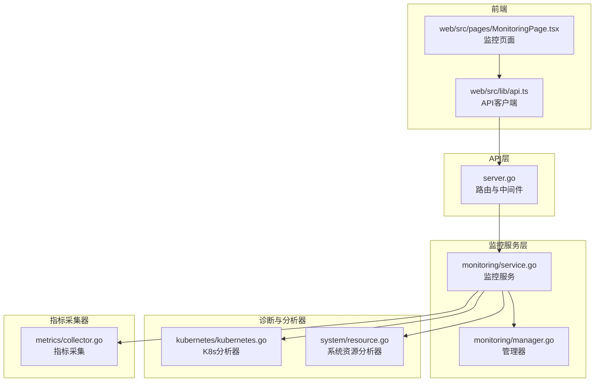
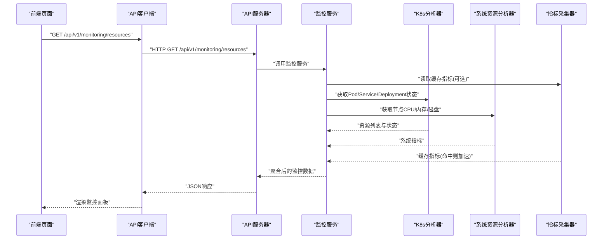
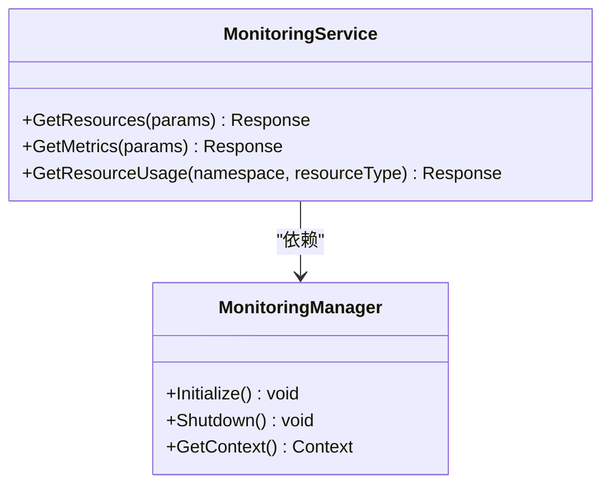
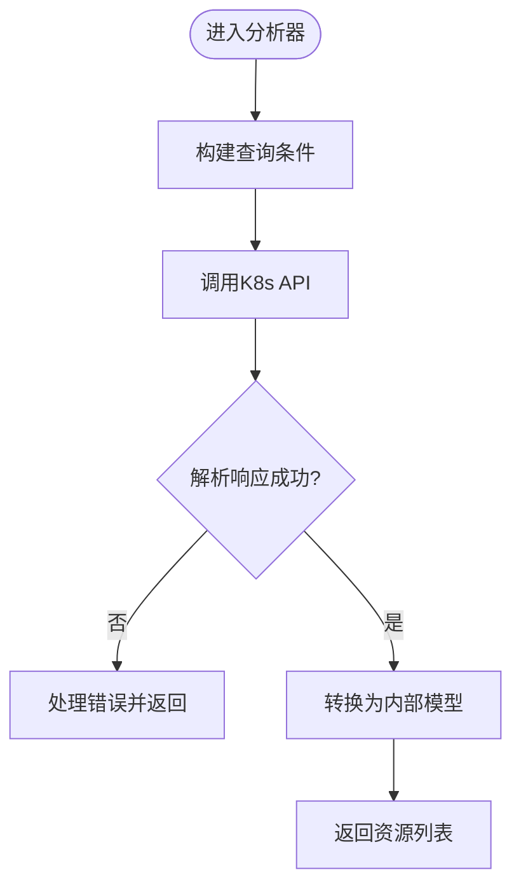
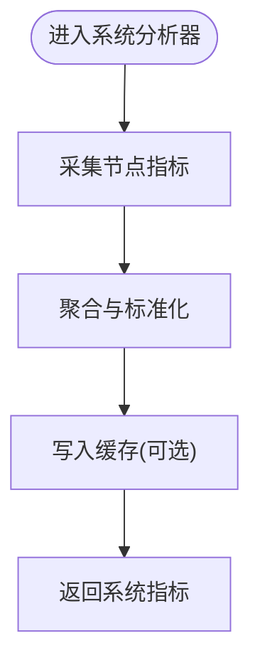
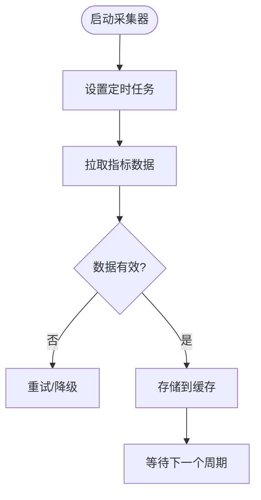
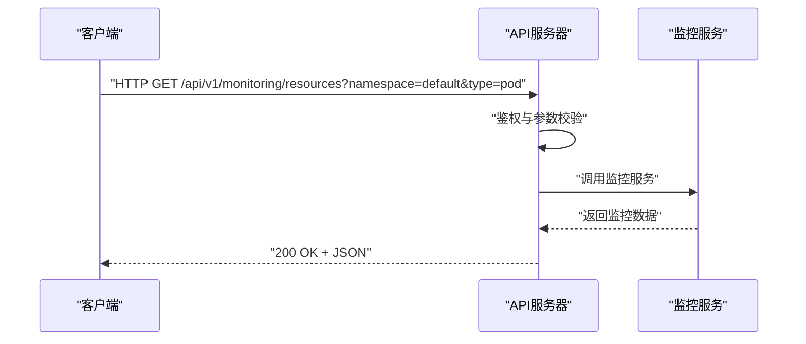
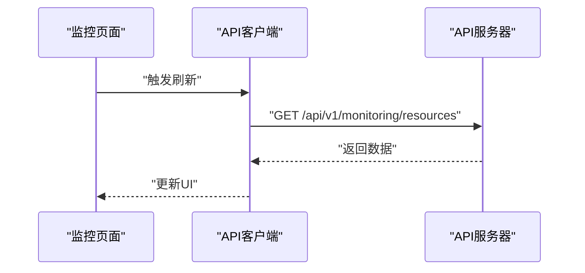
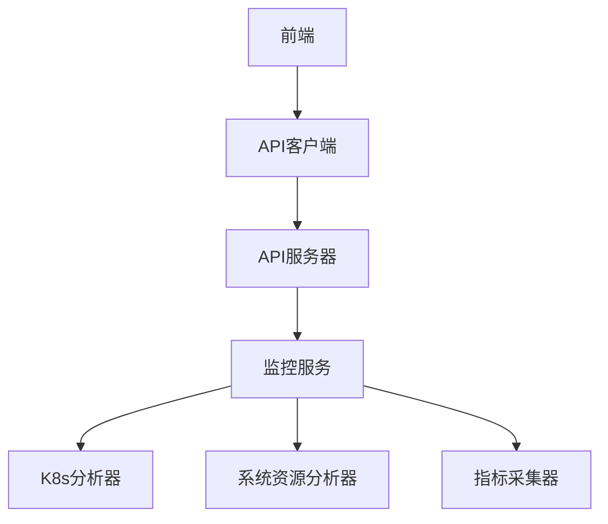

# 资源监控API

<cite>
**本文引用的文件**   
- [internal/api/server.go](file://internal/api/server.go)
- [internal/monitoring/service.go](file://internal/monitoring/service.go)
- [internal/monitoring/manager.go](file://internal/monitoring/manager.go)
- [internal/diag/analyzer/kubernetes/kubernetes.go](file://internal/diag/analyzer/kubernetes/kubernetes.go)
- [internal/diag/analyzer/system/resource.go](file://internal/diag/analyzer/system/resource.go)
- [internal/metrics/collector.go](file://internal/metrics/collector.go)
- [web/src/lib/api.ts](file://web/src/lib/api.ts)
- [web/src/pages/MonitoringPage.tsx](file://web/src/pages/MonitoringPage.tsx)
</cite>

## 目录
1. [简介](#简介)
2. [项目结构](#项目结构)
3. [核心组件](#核心组件)
4. [架构总览](#架构总览)
5. [详细组件分析](#详细组件分析)
6. [依赖关系分析](#依赖关系分析)
7. [性能考量](#性能考量)
8. [故障排查指南](#故障排查指南)
9. [结论](#结论)
10. [附录](#附录)

## 简介
本文件为 Klaw 平台的“资源监控API”提供完整、可操作的文档，覆盖与 Kubernetes 资源（Pod、Service、Deployment 等）相关的实时监控数据获取能力。内容包括：
- RESTful 端点定义：HTTP 方法、URL 模式、请求/响应模式、认证方式、错误处理
- 资源使用统计、性能指标收集、监控数据查询的核心接口说明
- 典型请求示例、响应格式、状态码说明与错误策略
- 前端调用路径与后端服务交互流程

该文档旨在帮助开发者快速集成与扩展监控能力，同时为运维人员提供清晰的排障指引。

## 项目结构
Klaw 平台将监控相关能力分布在多个模块中：
- API 层：负责路由注册、请求解析、鉴权与响应封装
- 监控服务层：聚合 Kubernetes 资源与系统指标，提供统一查询接口
- 诊断与分析器：采集集群与节点级资源使用情况
- 指标采集器：周期性收集并缓存关键指标
- 前端页面：通过统一的 API 客户端访问监控数据

**图表来源** 
- [internal/api/server.go](file://internal/api/server.go)
- [internal/monitoring/service.go](file://internal/monitoring/service.go)
- [internal/monitoring/manager.go](file://internal/monitoring/manager.go)
- [internal/diag/analyzer/kubernetes/kubernetes.go](file://internal/diag/analyzer/kubernetes/kubernetes.go)
- [internal/diag/analyzer/system/resource.go](file://internal/diag/analyzer/system/resource.go)
- [internal/metrics/collector.go](file://internal/metrics/collector.go)
- [web/src/lib/api.ts](file://web/src/lib/api.ts)
- [web/src/pages/MonitoringPage.tsx](file://web/src/pages/MonitoringPage.tsx)

**章节来源**
- [internal/api/server.go](file://internal/api/server.go)
- [internal/monitoring/service.go](file://internal/monitoring/service.go)
- [internal/monitoring/manager.go](file://internal/monitoring/manager.go)
- [internal/diag/analyzer/kubernetes/kubernetes.go](file://internal/diag/analyzer/kubernetes/kubernetes.go)
- [internal/diag/analyzer/system/resource.go](file://internal/diag/analyzer/system/resource.go)
- [internal/metrics/collector.go](file://internal/metrics/collector.go)
- [web/src/lib/api.ts](file://web/src/lib/api.ts)
- [web/src/pages/MonitoringPage.tsx](file://web/src/pages/MonitoringPage.tsx)

## 核心组件
- API 服务器与路由：集中注册监控相关端点，统一鉴权与日志记录
- 监控服务：对外暴露监控查询接口，内部协调 K8s 资源与系统指标
- 管理器：维护监控上下文、配置与生命周期管理
- K8s 分析器：从 Kubernetes API Server 拉取 Pod/Service/Deployment 等资源状态与指标
- 系统资源分析器：采集节点 CPU、内存、磁盘、网络等系统级指标
- 指标采集器：定时采集并缓存关键指标，降低对上游的频繁调用压力
- 前端 API 客户端：封装 HTTP 调用、错误处理与重试逻辑

**章节来源**
- [internal/api/server.go](file://internal/api/server.go)
- [internal/monitoring/service.go](file://internal/monitoring/service.go)
- [internal/monitoring/manager.go](file://internal/monitoring/manager.go)
- [internal/diag/analyzer/kubernetes/kubernetes.go](file://internal/diag/analyzer/kubernetes/kubernetes.go)
- [internal/diag/analyzer/system/resource.go](file://internal/diag/analyzer/system/resource.go)
- [internal/metrics/collector.go](file://internal/metrics/collector.go)
- [web/src/lib/api.ts](file://web/src/lib/api.ts)

## 架构总览
下图展示了从前端到后端的监控数据流：前端通过 API 客户端发起请求，API 层路由至监控服务，监控服务再调用 K8s 分析器与系统资源分析器，必要时结合指标采集器的缓存结果返回给前端。

**图表来源** 
- [internal/api/server.go](file://internal/api/server.go)
- [internal/monitoring/service.go](file://internal/monitoring/service.go)
- [internal/diag/analyzer/kubernetes/kubernetes.go](file://internal/diag/analyzer/kubernetes/kubernetes.go)
- [internal/diag/analyzer/system/resource.go](file://internal/diag/analyzer/system/resource.go)
- [internal/metrics/collector.go](file://internal/metrics/collector.go)
- [web/src/lib/api.ts](file://web/src/lib/api.ts)
- [web/src/pages/MonitoringPage.tsx](file://web/src/pages/MonitoringPage.tsx)

## 详细组件分析

### 监控服务与管理器
- 监控服务负责对外暴露统一的监控查询接口，内部协调各分析器与采集器
- 管理器维护监控上下文、配置项与生命周期，确保资源正确初始化与释放

**图表来源** 
- [internal/monitoring/service.go](file://internal/monitoring/service.go)
- [internal/monitoring/manager.go](file://internal/monitoring/manager.go)

**章节来源**
- [internal/monitoring/service.go](file://internal/monitoring/service.go)
- [internal/monitoring/manager.go](file://internal/monitoring/manager.go)

### Kubernetes 分析器
- 负责从 Kubernetes API Server 拉取 Pod、Service、Deployment 等资源的状态与指标
- 支持按命名空间、标签选择器过滤，返回结构化资源列表

**图表来源** 
- [internal/diag/analyzer/kubernetes/kubernetes.go](file://internal/diag/analyzer/kubernetes/kubernetes.go)

**章节来源**
- [internal/diag/analyzer/kubernetes/kubernetes.go](file://internal/diag/analyzer/kubernetes/kubernetes.go)

### 系统资源分析器
- 采集节点级别的 CPU、内存、磁盘、网络等系统指标
- 通常通过本地代理或 cAdvisor/Node Exporter 等数据源获取

**图表来源** 
- [internal/diag/analyzer/system/resource.go](file://internal/diag/analyzer/system/resource.go)

**章节来源**
- [internal/diag/analyzer/system/resource.go](file://internal/diag/analyzer/system/resource.go)

### 指标采集器
- 定时采集关键指标并缓存，减少重复查询开销
- 支持过期策略与回退机制

**图表来源** 
- [internal/metrics/collector.go](file://internal/metrics/collector.go)

**章节来源**
- [internal/metrics/collector.go](file://internal/metrics/collector.go)

### API 服务器与路由
- 统一注册监控相关端点，处理鉴权、日志与错误包装
- 建议遵循 RESTful 规范，使用标准状态码与错误体

**图表来源** 
- [internal/api/server.go](file://internal/api/server.go)
- [internal/monitoring/service.go](file://internal/monitoring/service.go)

**章节来源**
- [internal/api/server.go](file://internal/api/server.go)
- [internal/monitoring/service.go](file://internal/monitoring/service.go)

### 前端 API 客户端与监控页面
- 前端通过统一的 API 客户端发起监控查询，处理错误与重试
- 监控页面展示资源状态、指标趋势与告警信息

**图表来源** 
- [web/src/lib/api.ts](file://web/src/lib/api.ts)
- [web/src/pages/MonitoringPage.tsx](file://web/src/pages/MonitoringPage.tsx)

**章节来源**
- [web/src/lib/api.ts](file://web/src/lib/api.ts)
- [web/src/pages/MonitoringPage.tsx](file://web/src/pages/MonitoringPage.tsx)

## 依赖关系分析
监控 API 的依赖关系如下：
- API 层依赖监控服务
- 监控服务依赖 K8s 分析器、系统资源分析器与指标采集器
- 前端依赖 API 客户端与服务端点

**图表来源** 
- [internal/api/server.go](file://internal/api/server.go)
- [internal/monitoring/service.go](file://internal/monitoring/service.go)
- [internal/diag/analyzer/kubernetes/kubernetes.go](file://internal/diag/analyzer/kubernetes/kubernetes.go)
- [internal/diag/analyzer/system/resource.go](file://internal/diag/analyzer/system/resource.go)
- [internal/metrics/collector.go](file://internal/metrics/collector.go)
- [web/src/lib/api.ts](file://web/src/lib/api.ts)

**章节来源**
- [internal/api/server.go](file://internal/api/server.go)
- [internal/monitoring/service.go](file://internal/monitoring/service.go)
- [internal/diag/analyzer/kubernetes/kubernetes.go](file://internal/diag/analyzer/kubernetes/kubernetes.go)
- [internal/diag/analyzer/system/resource.go](file://internal/diag/analyzer/system/resource.go)
- [internal/metrics/collector.go](file://internal/metrics/collector.go)
- [web/src/lib/api.ts](file://web/src/lib/api.ts)

## 性能考量
- 缓存策略：指标采集器应合理设置 TTL，避免频繁拉取上游数据
- 分页与限流：对大规模资源列表建议使用分页与速率限制
- 异步处理：耗时操作（如全量扫描）建议采用异步任务与进度回调
- 连接复用：与 K8s API Server 的连接应复用，减少握手开销
- 降级与熔断：当上游不可用时，返回缓存或友好错误提示

[本节为通用指导，不直接分析具体文件]

## 故障排查指南
常见问题与排查步骤：
- 鉴权失败：检查 Token/证书是否有效，权限是否足够
- 超时错误：增加超时阈值或启用重试；检查 K8s API Server 负载
- 数据缺失：确认命名空间与标签选择器是否正确；检查采集器是否运行
- 缓存不一致：清理缓存或强制刷新；检查 TTL 配置
- 前端报错：查看浏览器控制台与网络面板，确认请求与响应格式

**章节来源**
- [internal/api/server.go](file://internal/api/server.go)
- [internal/monitoring/service.go](file://internal/monitoring/service.go)
- [internal/metrics/collector.go](file://internal/metrics/collector.go)
- [web/src/lib/api.ts](file://web/src/lib/api.ts)

## 结论
本文档系统化梳理了 Klaw 平台资源监控 API 的架构、组件与接口设计，提供了端到端的调用流程与排障建议。开发者可基于此文档快速集成监控能力，并根据业务需求扩展新的资源类型与指标维度。

[本节为总结性内容，不直接分析具体文件]

## 附录
- 建议的 RESTful 端点命名规范：/api/v1/monitoring/{resource-type}
- 推荐使用的状态码：200（成功）、400（参数错误）、401（未授权）、403（禁止访问）、404（资源不存在）、429（限流）、500（服务端错误）、503（服务不可用）
- 错误体建议包含：code、message、details、requestId

[本节为补充信息，不直接分析具体文件]