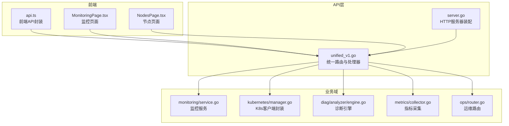
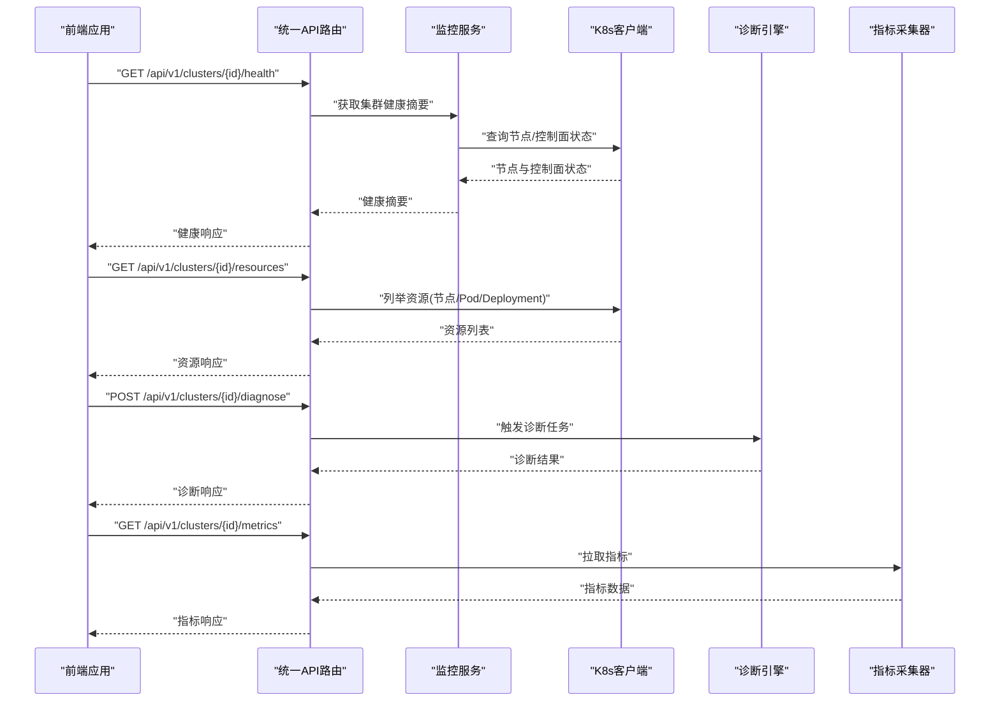
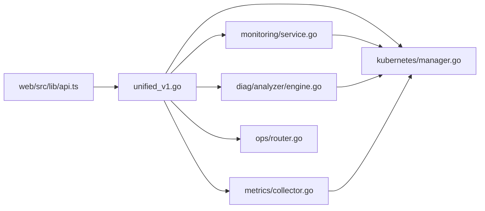

# 集群管理API

<cite>
**本文档引用的文件**   
- [internal/api/server.go](file://internal/api/server.go)
- [internal/api/unified_v1.go](file://internal/api/unified_v1.go)
- [internal/monitoring/service.go](file://internal/monitoring/service.go)
- [internal/kubernetes/manager.go](file://internal/kubernetes/manager.go)
- [internal/diag/analyzer/engine.go](file://internal/diag/analyzer/engine.go)
- [internal/diag/types/diagnostic_data.go](file://internal/diag/types/diagnostic_data.go)
- [internal/metrics/collector.go](file://internal/metrics/collector.go)
- [internal/ops/router.go](file://internal/ops/router.go)
- [internal/ops/handler.go](file://internal/ops/handler.go)
- [web/src/lib/api.ts](file://web/src/lib/api.ts)
- [web/src/pages/MonitoringPage.tsx](file://web/src/pages/MonitoringPage.tsx)
- [web/src/pages/NodesPage.tsx](file://web/src/pages/NodesPage.tsx)
</cite>

## 目录
1. [简介](#简介)
2. [项目结构](#项目结构)
3. [核心组件](#核心组件)
4. [架构总览](#架构总览)
5. [详细组件分析](#详细组件分析)
6. [依赖关系分析](#依赖关系分析)
7. [性能考虑](#性能考虑)
8. [故障排查指南](#故障排查指南)
9. [结论](#结论)
10. [附录](#附录)

## 简介
本文件为 Klaw 平台的“集群管理API”提供系统化、可操作的文档，覆盖与 Kubernetes 集群管理相关的 RESTful 端点，包括集群健康检查、资源状态查询、节点管理、监控与统计等。文档面向开发者与运维人员，既给出高层概览，也深入到接口契约、错误处理与最佳实践。

## 项目结构
Klaw 的 API 层位于 internal/api，统一版本化路由在 unified_v1.go 中定义；监控服务在 internal/monitoring；Kubernetes 客户端封装在 internal/kubernetes；诊断与分析能力集中在 internal/diag；指标采集在 internal/metrics；运维相关路由在 internal/ops。前端通过 web/src/lib/api.ts 调用后端 API，并在 MonitoringPage 与 NodesPage 中展示数据。

图表来源
- [internal/api/unified_v1.go](file://internal/api/unified_v1.go)
- [internal/api/server.go](file://internal/api/server.go)
- [internal/monitoring/service.go](file://internal/monitoring/service.go)
- [internal/kubernetes/manager.go](file://internal/kubernetes/manager.go)
- [internal/diag/analyzer/engine.go](file://internal/diag/analyzer/engine.go)
- [internal/metrics/collector.go](file://internal/metrics/collector.go)
- [internal/ops/router.go](file://internal/ops/router.go)
- [web/src/lib/api.ts](file://web/src/lib/api.ts)
- [web/src/pages/MonitoringPage.tsx](file://web/src/pages/MonitoringPage.tsx)
- [web/src/pages/NodesPage.tsx](file://web/src/pages/NodesPage.tsx)

章节来源
- [internal/api/server.go](file://internal/api/server.go)
- [internal/api/unified_v1.go](file://internal/api/unified_v1.go)
- [internal/monitoring/service.go](file://internal/monitoring/service.go)
- [internal/kubernetes/manager.go](file://internal/kubernetes/manager.go)
- [internal/diag/analyzer/engine.go](file://internal/diag/analyzer/engine.go)
- [internal/metrics/collector.go](file://internal/metrics/collector.go)
- [internal/ops/router.go](file://internal/ops/router.go)
- [web/src/lib/api.ts](file://web/src/lib/api.ts)
- [web/src/pages/MonitoringPage.tsx](file://web/src/pages/MonitoringPage.tsx)
- [web/src/pages/NodesPage.tsx](file://web/src/pages/NodesPage.tsx)

## 核心组件
- 统一API路由与处理器：负责REST路由注册、请求解析、鉴权与响应序列化。
- 监控服务：聚合集群健康、资源使用、事件与告警信息。
- Kubernetes客户端：封装对K8s API Server的访问（节点、Pod、Deployment、Metrics等）。
- 诊断引擎：执行规则分析与问题定位，输出结构化诊断结果。
- 指标采集器：收集系统与应用指标，供监控与报表使用。
- 运维路由：提供平台内部运维能力（如配置刷新、日志拉取等）。

章节来源
- [internal/api/unified_v1.go](file://internal/api/unified_v1.go)
- [internal/monitoring/service.go](file://internal/monitoring/service.go)
- [internal/kubernetes/manager.go](file://internal/kubernetes/manager.go)
- [internal/diag/analyzer/engine.go](file://internal/diag/analyzer/engine.go)
- [internal/metrics/collector.go](file://internal/metrics/collector.go)
- [internal/ops/router.go](file://internal/ops/router.go)

## 架构总览
下图展示了从前端到后端API再到Kubernetes与诊断/监控子系统的整体交互流程。

图表来源
- [internal/api/unified_v1.go](file://internal/api/unified_v1.go)
- [internal/monitoring/service.go](file://internal/monitoring/service.go)
- [internal/kubernetes/manager.go](file://internal/kubernetes/manager.go)
- [internal/diag/analyzer/engine.go](file://internal/diag/analyzer/engine.go)
- [internal/metrics/collector.go](file://internal/metrics/collector.go)

## 详细组件分析

### 统一API路由与处理器（unified_v1）
- 职责：定义 /api/v1 下的所有集群管理端点，统一参数校验、鉴权、错误码与响应格式。
- 典型端点：
  - 集群健康检查：GET /api/v1/clusters/{cluster_id}/health
  - 资源状态查询：GET /api/v1/clusters/{cluster_id}/resources
  - 节点管理：GET /api/v1/clusters/{cluster_id}/nodes，POST /api/v1/clusters/{cluster_id}/nodes/{node_name}/cordon|uncordon
  - 诊断：POST /api/v1/clusters/{cluster_id}/diagnose
  - 指标：GET /api/v1/clusters/{cluster_id}/metrics
- 认证方法：基于令牌或会话的鉴权中间件（由 server.go 装配），失败返回 401/403。
- 错误处理：统一错误体包含 code、message、details；常见状态码 200/400/401/403/404/429/500。

章节来源
- [internal/api/unified_v1.go](file://internal/api/unified_v1.go)
- [internal/api/server.go](file://internal/api/server.go)

### 监控服务（monitoring）
- 职责：聚合集群健康、资源使用、事件与告警信息，提供统一的监控视图。
- 关键能力：
  - 健康检查：结合 K8s 控制面与节点状态生成健康评分与摘要。
  - 资源使用：汇总 CPU/内存/存储等资源使用情况。
  - 事件与告警：订阅并聚合 K8s 事件与自定义告警。
- 数据流：监控服务调用 K8s 客户端获取原始数据，进行聚合与缓存后返回给API层。

章节来源
- [internal/monitoring/service.go](file://internal/monitoring/service.go)

### Kubernetes客户端（kubernetes）
- 职责：封装对 K8s API Server 的访问，包括节点、Pod、Deployment、Service、Metrics 等资源的CRUD与查询。
- 关键能力：
  - 节点管理：列出、过滤、污点/容忍、Cordon/Drain 操作。
  - 资源查询：按命名空间、标签选择器查询工作负载与网络资源。
  - 指标拉取：对接 metrics-server 或 Prometheus 暴露的指标端点。
- 错误处理：将 K8s 错误映射为 HTTP 状态码与统一错误体。

章节来源
- [internal/kubernetes/manager.go](file://internal/kubernetes/manager.go)

### 诊断引擎（diag/analyzer）
- 职责：执行规则驱动的诊断，识别集群问题并提供修复建议。
- 关键能力：
  - 规则加载与执行：支持内置与自定义规则。
  - 结果输出：结构化诊断报告，包含严重级别、影响范围与建议。
- 集成点：API层触发诊断任务，引擎异步执行并返回结果。

章节来源
- [internal/diag/analyzer/engine.go](file://internal/diag/analyzer/engine.go)
- [internal/diag/types/diagnostic_data.go](file://internal/diag/types/diagnostic_data.go)

### 指标采集器（metrics）
- 职责：采集系统与应用的运行指标，提供时序数据用于监控与报表。
- 关键能力：
  - 指标拉取：从 K8s Metrics、Prometheus 或其他数据源拉取。
  - 数据聚合：按集群、命名空间、工作负载维度聚合。
  - 缓存策略：短期缓存以减少重复查询压力。

章节来源
- [internal/metrics/collector.go](file://internal/metrics/collector.go)

### 运维路由（ops）
- 职责：提供平台内部运维能力，如配置刷新、日志拉取、调试信息等。
- 典型端点：
  - 配置刷新：POST /api/v1/ops/config/reload
  - 日志拉取：GET /api/v1/ops/logs?level=info&limit=100
  - 调试信息：GET /api/v1/ops/debug/pprof
- 安全限制：仅限内部网络或具备特定角色的用户访问。

章节来源
- [internal/ops/router.go](file://internal/ops/router.go)
- [internal/ops/handler.go](file://internal/ops/handler.go)

### 前端集成（web）
- 职责：封装后端API调用，渲染监控与节点管理界面。
- 关键文件：
  - api.ts：统一请求封装、错误处理与重试逻辑。
  - MonitoringPage.tsx：展示集群健康与资源使用。
  - NodesPage.tsx：展示节点列表与管理操作。

章节来源
- [web/src/lib/api.ts](file://web/src/lib/api.ts)
- [web/src/pages/MonitoringPage.tsx](file://web/src/pages/MonitoringPage.tsx)
- [web/src/pages/NodesPage.tsx](file://web/src/pages/NodesPage.tsx)

## 依赖关系分析
下图展示了各模块之间的依赖关系与数据流向。

图表来源
- [internal/api/unified_v1.go](file://internal/api/unified_v1.go)
- [internal/monitoring/service.go](file://internal/monitoring/service.go)
- [internal/kubernetes/manager.go](file://internal/kubernetes/manager.go)
- [internal/diag/analyzer/engine.go](file://internal/diag/analyzer/engine.go)
- [internal/metrics/collector.go](file://internal/metrics/collector.go)
- [internal/ops/router.go](file://internal/ops/router.go)
- [web/src/lib/api.ts](file://web/src/lib/api.ts)

章节来源
- [internal/api/unified_v1.go](file://internal/api/unified_v1.go)
- [internal/monitoring/service.go](file://internal/monitoring/service.go)
- [internal/kubernetes/manager.go](file://internal/kubernetes/manager.go)
- [internal/diag/analyzer/engine.go](file://internal/diag/analyzer/engine.go)
- [internal/metrics/collector.go](file://internal/metrics/collector.go)
- [internal/ops/router.go](file://internal/ops/router.go)
- [web/src/lib/api.ts](file://web/src/lib/api.ts)

## 性能考虑
- 缓存策略：对频繁查询的资源（如节点列表、指标）采用短期缓存，减少K8s API压力。
- 分页与过滤：资源查询支持分页与标签过滤，避免一次性返回大量数据。
- 异步任务：诊断任务采用异步执行，避免阻塞HTTP请求。
- 限流与熔断：对高频率端点实施限流，对下游依赖（如K8s API）实现熔断保护。
- 连接池：复用K8s客户端连接，降低握手开销。

[本节为通用指导，不直接分析具体文件]

## 故障排查指南
- 常见问题：
  - 401/403：认证或授权失败，检查令牌有效性及角色权限。
  - 404：资源不存在或路径错误，确认 cluster_id 与资源名称。
  - 429：请求过于频繁，检查前端重试间隔与后端限流策略。
  - 500：服务端异常，查看日志与堆栈，关注K8s API错误映射。
- 排查步骤：
  - 启用调试日志，定位请求链路。
  - 检查K8s客户端连通性与权限。
  - 验证诊断规则与指标数据源可用性。
  - 使用运维端点拉取日志与调试信息。

章节来源
- [internal/api/server.go](file://internal/api/server.go)
- [internal/ops/handler.go](file://internal/ops/handler.go)

## 结论
Klaw 的集群管理API提供了完整的Kubernetes集群管理能力，涵盖健康检查、资源查询、节点管理、诊断与监控等核心功能。通过统一的API层、清晰的模块划分与健壮的错误处理，平台能够稳定支撑大规模集群运维场景。建议在生产环境中启用缓存、限流与熔断机制，并结合前端监控与告警提升可观测性。

[本节为总结性内容，不直接分析具体文件]

## 附录
- 术语表：
  - 集群ID：唯一标识一个Kubernetes集群。
  - 节点：K8s中的工作节点，承载Pod调度。
  - 资源：K8s中的API对象，如Pod、Deployment、Service等。
  - 指标：运行时性能数据，如CPU、内存、I/O等。
- 参考链接：
  - K8s官方文档：https://kubernetes.io/docs
  - Prometheus指标模型：https://prometheus.io/docs/concepts/metric_types/

[本节为概念性内容，不直接分析具体文件]