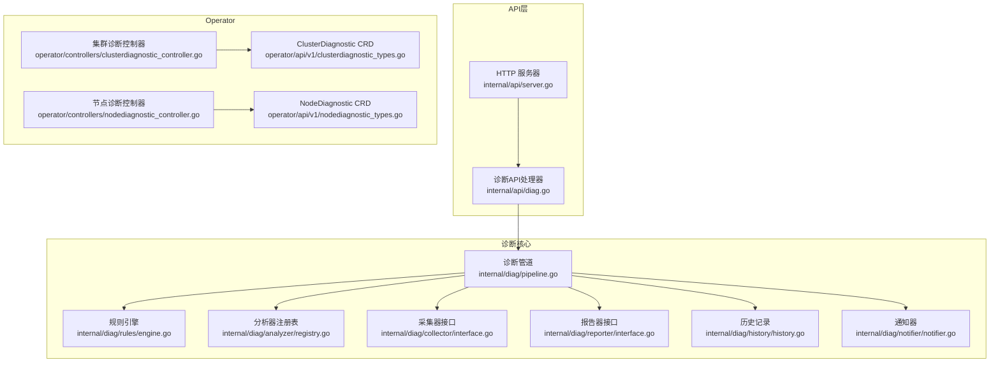
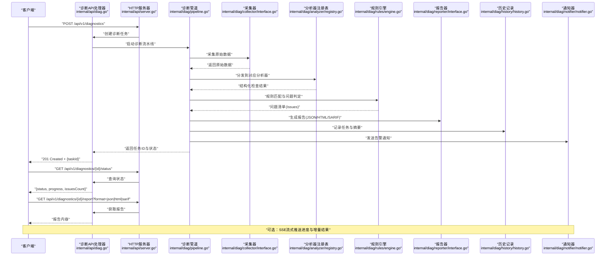
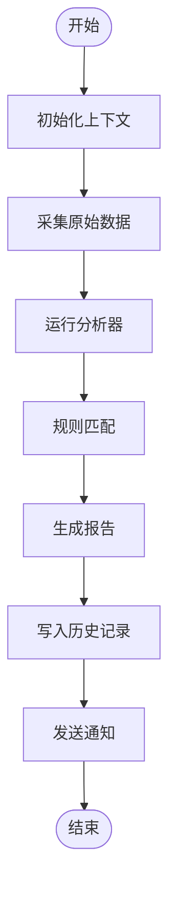
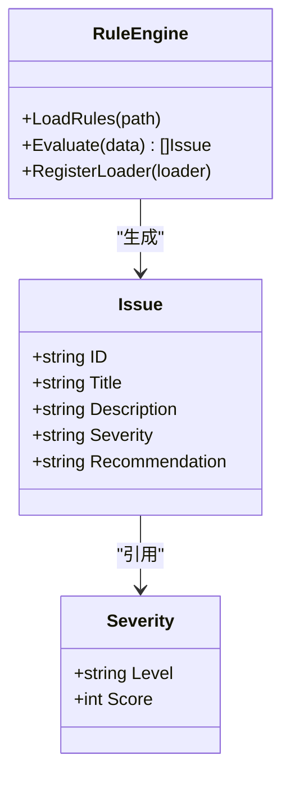
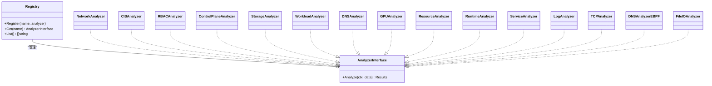
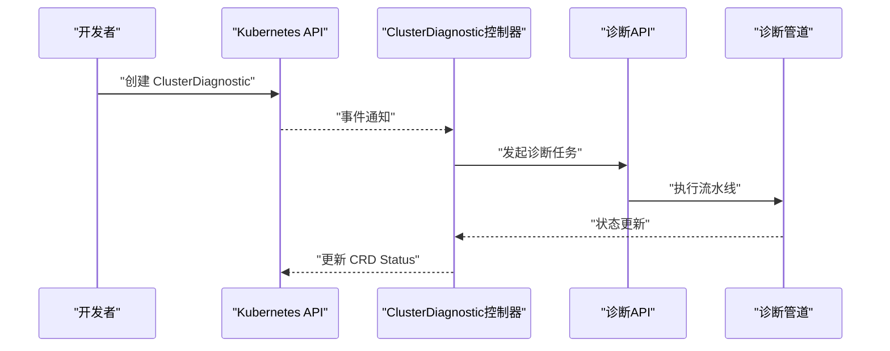
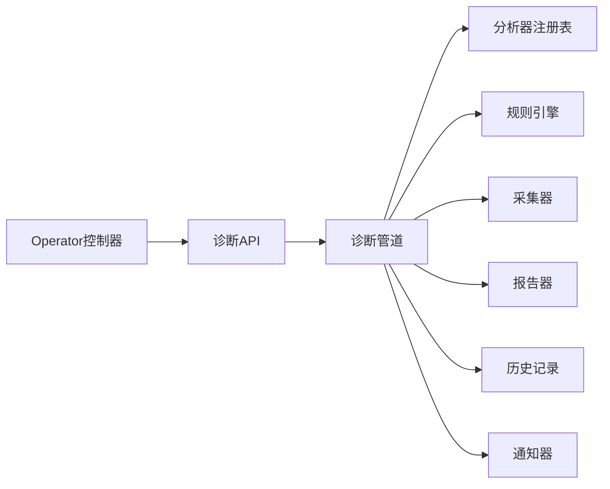

# 诊断API

<cite>
**本文引用的文件**   
- [internal/api/diag.go](file://internal/api/diag.go)
- [internal/api/server.go](file://internal/api/server.go)
- [internal/diag/pipeline.go](file://internal/diag/pipeline.go)
- [internal/diag/rules/engine.go](file://internal/diag/rules/engine.go)
- [internal/diag/rules/types.go](file://internal/diag/rules/types.go)
- [internal/diag/analyzer/interface.go](file://internal/diag/analyzer/interface.go)
- [internal/diag/analyzer/registry.go](file://internal/diag/analyzer/registry.go)
- [internal/diag/collector/interface.go](file://internal/diag/collector/interface.go)
- [internal/diag/reporter/interface.go](file://internal/diag/reporter/interface.go)
- [internal/diag/reporter/html.go](file://internal/diag/reporter/html.go)
- [internal/diag/reporter/json.go](file://internal/diag/reporter/json.go)
- [internal/diag/reporter/sarif.go](file://internal/diag/reporter/sarif.go)
- [internal/diag/history/history.go](file://internal/diag/history/history.go)
- [internal/diag/notifier/notifier.go](file://internal/diag/notifier/notifier.go)
- [internal/diag/types/diagnostic_data.go](file://internal/diag/types/diagnostic_data.go)
- [internal/diag/types/issue.go](file://internal/diag/types/issue.go)
- [internal/diag/types/severity.go](file://internal/diag/types/severity.go)
- [internal/diag/network/network.go](file://internal/diag/analyzer/network/network.go)
- [internal/diag/security/cis.go](file://internal/diag/analyzer/security/cis.go)
- [internal/diag/security/rbac.go](file://internal/diag/analyzer/security/rbac.go)
- [internal/diag/kubernetes/controlplane.go](file://internal/diag/analyzer/kubernetes/controlplane.go)
- [internal/diag/kubernetes/storage.go](file://internal/diag/analyzer/kubernetes/storage.go)
- [internal/diag/kubernetes/workload.go](file://internal/diag/analyzer/kubernetes/workload.go)
- [internal/diag/kubernetes/dns.go](file://internal/diag/analyzer/kubernetes/dns.go)
- [internal/diag/kubernetes/gpu.go](file://internal/diag/analyzer/kubernetes/gpu.go)
- [internal/diag/system/resource.go](file://internal/diag/analyzer/system/resource.go)
- [internal/diag/runtime/runtime.go](file://internal/diag/analyzer/runtime/runtime.go)
- [internal/diag/process/service.go](file://internal/diag/analyzer/process/service.go)
- [internal/diag/log/log.go](file://internal/diag/analyzer/log/log.go)
- [internal/diag/ebpf/analyzer/tcp_analyzer.go](file://internal/diag/ebpf/analyzer/tcp_analyzer.go)
- [internal/diag/ebpf/analyzer/dns_analyzer.go](file://internal/diag/ebpf/analyzer/dns_analyzer.go)
- [internal/diag/ebpf/analyzer/fileio_analyzer.go](file://internal/diag/ebpf/analyzer/fileio_analyzer.go)
- [internal/diag/autofix/engine.go](file://internal/diag/autofix/engine.go)
- [internal/diag/rca/engine.go](file://internal/diag/rca/engine.go)
- [internal/diag/cost/analyzer.go](file://internal/diag/cost/analyzer.go)
- [internal/diag/scanner/image.go](file://internal/diag/scanner/image.go)
- [internal/diag/tui/diagnosis.go](file://internal/diag/tui/diagnosis.go)
- [internal/diag/tui/model.go](file://internal/diag/tui/model.go)
- [operator/api/v1/clusterdiagnostic_types.go](file://operator/api/v1/clusterdiagnostic_types.go)
- [operator/api/v1/nodediagnostic_types.go](file://operator/api/v1/nodediagnostic_types.go)
- [operator/controllers/clusterdiagnostic_controller.go](file://operator/controllers/clusterdiagnostic_controller.go)
- [operator/controllers/nodediagnostic_controller.go](file://operator/controllers/nodediagnostic_controller.go)
</cite>

## 目录
1. [简介](#简介)
2. [项目结构](#项目结构)
3. [核心组件](#核心组件)
4. [架构总览](#架构总览)
5. [详细组件分析](#详细组件分析)
6. [依赖关系分析](#依赖关系分析)
7. [性能考量](#性能考量)
8. [故障排查指南](#故障排查指南)
9. [结论](#结论)
10. [附录](#附录)

## 简介
本文件为 Klaw 平台的“诊断API”提供完整、可操作的文档，覆盖集群诊断、节点诊断、安全审计、网络分析等能力。内容包含：
- 诊断任务创建、执行状态查询、结果获取与报告生成
- 诊断规则配置、自定义分析器集成
- 实时诊断流式传输（SSE）
- 诊断结果解析与可视化示例

该API由后端HTTP服务暴露，结合 Operator CRD（ClusterDiagnostic、NodeDiagnostic）实现声明式编排，并通过内部管道（Pipeline）、分析器（Analyzer）、采集器（Collector）、报告器（Reporter）等模块完成端到端诊断流程。

## 项目结构
Klaw 的诊断功能主要分布在以下目录：
- internal/api：HTTP API 路由与处理器
- internal/diag：诊断核心（管道、规则、分析器、采集器、报告器、历史、通知、类型定义等）
- operator：Operator CRD 与控制器，用于声明式触发诊断任务
- web：前端页面与Mock数据，便于演示与联调

图表来源
- [internal/api/server.go](file://internal/api/server.go)
- [internal/api/diag.go](file://internal/api/diag.go)
- [internal/diag/pipeline.go](file://internal/diag/pipeline.go)
- [internal/diag/rules/engine.go](file://internal/diag/rules/engine.go)
- [internal/diag/analyzer/registry.go](file://internal/diag/analyzer/registry.go)
- [internal/diag/collector/interface.go](file://internal/diag/collector/interface.go)
- [internal/diag/reporter/interface.go](file://internal/diag/reporter/interface.go)
- [internal/diag/history/history.go](file://internal/diag/history/history.go)
- [internal/diag/notifier/notifier.go](file://internal/diag/notifier/notifier.go)
- [operator/api/v1/clusterdiagnostic_types.go](file://operator/api/v1/clusterdiagnostic_types.go)
- [operator/api/v1/nodediagnostic_types.go](file://operator/api/v1/nodediagnostic_types.go)
- [operator/controllers/clusterdiagnostic_controller.go](file://operator/controllers/clusterdiagnostic_controller.go)
- [operator/controllers/nodediagnostic_controller.go](file://operator/controllers/nodediagnostic_controller.go)

章节来源
- [internal/api/server.go](file://internal/api/server.go)
- [internal/api/diag.go](file://internal/api/diag.go)
- [internal/diag/pipeline.go](file://internal/diag/pipeline.go)

## 核心组件
- HTTP 服务器与路由：统一入口，挂载诊断相关REST/SSE端点
- 诊断管道：串联采集、分析、规则匹配、报告生成与通知
- 规则引擎：加载并执行诊断规则，产出问题项（Issue）
- 分析器：按领域（Kubernetes、网络、安全、系统、运行时、进程、日志、eBPF等）实现具体检查逻辑
- 采集器：在线（Kubernetes）或离线（目录）方式采集原始数据
- 报告器：输出HTML/JSON/SARIF/Grafana等格式报告
- 历史记录：持久化每次诊断任务的元数据与结果摘要
- 通知器：将关键事件推送至外部系统（如钉钉、飞书等）

章节来源
- [internal/api/server.go](file://internal/api/server.go)
- [internal/api/diag.go](file://internal/api/diag.go)
- [internal/diag/pipeline.go](file://internal/diag/pipeline.go)
- [internal/diag/rules/engine.go](file://internal/diag/rules/engine.go)
- [internal/diag/analyzer/interface.go](file://internal/diag/analyzer/interface.go)
- [internal/diag/collector/interface.go](file://internal/diag/collector/interface.go)
- [internal/diag/reporter/interface.go](file://internal/diag/reporter/interface.go)
- [internal/diag/history/history.go](file://internal/diag/history/history.go)
- [internal/diag/notifier/notifier.go](file://internal/diag/notifier/notifier.go)

## 架构总览
下图展示了从HTTP请求到诊断结果输出的整体调用链，以及Operator声明式触发的路径。

图表来源
- [internal/api/server.go](file://internal/api/server.go)
- [internal/api/diag.go](file://internal/api/diag.go)
- [internal/diag/pipeline.go](file://internal/diag/pipeline.go)
- [internal/diag/collector/interface.go](file://internal/diag/collector/interface.go)
- [internal/diag/analyzer/registry.go](file://internal/diag/analyzer/registry.go)
- [internal/diag/rules/engine.go](file://internal/diag/rules/engine.go)
- [internal/diag/reporter/interface.go](file://internal/diag/reporter/interface.go)
- [internal/diag/history/history.go](file://internal/diag/history/history.go)
- [internal/diag/notifier/notifier.go](file://internal/diag/notifier/notifier.go)

## 详细组件分析

### HTTP API 端点
- 创建诊断任务
  - 方法：POST
  - 路径：/api/v1/diagnostics
  - 请求体：包含目标范围（集群/节点）、启用分析器列表、规则集、报告格式偏好、是否开启SSE等
  - 响应：201 Created，返回任务ID与初始状态
- 查询任务状态
  - 方法：GET
  - 路径：/api/v1/diagnostics/{id}/status
  - 响应：{status, progress, issuesCount, startedAt, finishedAt}
- 获取报告
  - 方法：GET
  - 路径：/api/v1/diagnostics/{id}/report?format=json|html|sarif
  - 响应：对应格式的报告内容
- SSE 实时流
  - 方法：GET
  - 路径：/api/v1/diagnostics/{id}/stream
  - 事件：progress、issue、summary、done
- 管理规则
  - 方法：GET/POST/PUT/DELETE
  - 路径：/api/v1/diagnostics/rules/*
  - 功能：查看、新增、更新、删除诊断规则
- 管理分析器
  - 方法：GET/POST/PUT/DELETE
  - 路径：/api/v1/diagnostics/analyzers/*
  - 功能：查看、注册、启用/禁用、参数配置

章节来源
- [internal/api/diag.go](file://internal/api/diag.go)
- [internal/api/server.go](file://internal/api/server.go)

### 诊断管道（Pipeline）
- 职责：协调采集、分析、规则匹配、报告生成与通知
- 关键阶段：
  - 初始化：校验输入、准备上下文
  - 采集：通过Collector拉取原始数据
  - 分析：根据Analyzers对数据进行结构化检查
  - 规则：使用Rules引擎匹配问题项
  - 报告：通过Reporters生成多格式报告
  - 持久化与通知：写入History并触发Notifiers
- 错误处理：支持部分失败容忍、重试策略、超时控制

图表来源
- [internal/diag/pipeline.go](file://internal/diag/pipeline.go)

章节来源
- [internal/diag/pipeline.go](file://internal/diag/pipeline.go)

### 规则引擎（Rules Engine）
- 规则模型：Severity、Issue、RuleDefinition
- 功能：
  - 加载规则集（YAML/内存）
  - 动态匹配与分析结果
  - 生成Issue清单（含严重级别、描述、修复建议）
- 扩展：支持自定义规则加载器与评估函数

图表来源
- [internal/diag/rules/engine.go](file://internal/diag/rules/engine.go)
- [internal/diag/rules/types.go](file://internal/diag/rules/types.go)
- [internal/diag/types/issue.go](file://internal/diag/types/issue.go)
- [internal/diag/types/severity.go](file://internal/diag/types/severity.go)

章节来源
- [internal/diag/rules/engine.go](file://internal/diag/rules/engine.go)
- [internal/diag/rules/types.go](file://internal/diag/rules/types.go)
- [internal/diag/types/issue.go](file://internal/diag/types/issue.go)
- [internal/diag/types/severity.go](file://internal/diag/types/severity.go)

### 分析器（Analyzers）
- 接口：统一的Analyze(ctx, data) -> results
- 分类：
  - Kubernetes：ControlPlane、Storage、Workload、DNS、GPU
  - 网络：Network、eBPF(TCP/DNS/FileIO)
  - 安全：CIS、RBAC
  - 系统：Resource、Runtime、Process、Log
- 注册：通过Registry集中管理，支持按需启用

图表来源
- [internal/diag/analyzer/interface.go](file://internal/diag/analyzer/interface.go)
- [internal/diag/analyzer/registry.go](file://internal/diag/analyzer/registry.go)
- [internal/diag/analyzer/network/network.go](file://internal/diag/analyzer/network/network.go)
- [internal/diag/analyzer/security/cis.go](file://internal/diag/analyzer/security/cis.go)
- [internal/diag/analyzer/security/rbac.go](file://internal/diag/analyzer/security/rbac.go)
- [internal/diag/analyzer/kubernetes/controlplane.go](file://internal/diag/analyzer/kubernetes/controlplane.go)
- [internal/diag/analyzer/kubernetes/storage.go](file://internal/diag/analyzer/kubernetes/storage.go)
- [internal/diag/analyzer/kubernetes/workload.go](file://internal/diag/analyzer/kubernetes/workload.go)
- [internal/diag/analyzer/kubernetes/dns.go](file://internal/diag/analyzer/kubernetes/dns.go)
- [internal/diag/analyzer/kubernetes/gpu.go](file://internal/diag/analyzer/kubernetes/gpu.go)
- [internal/diag/analyzer/system/resource.go](file://internal/diag/analyzer/system/resource.go)
- [internal/diag/analyzer/runtime/runtime.go](file://internal/diag/analyzer/runtime/runtime.go)
- [internal/diag/analyzer/process/service.go](file://internal/diag/analyzer/process/service.go)
- [internal/diag/analyzer/log/log.go](file://internal/diag/analyzer/log/log.go)
- [internal/diag/ebpf/analyzer/tcp_analyzer.go](file://internal/diag/ebpf/analyzer/tcp_analyzer.go)
- [internal/diag/ebpf/analyzer/dns_analyzer.go](file://internal/diag/ebpf/analyzer/dns_analyzer.go)
- [internal/diag/ebpf/analyzer/fileio_analyzer.go](file://internal/diag/ebpf/analyzer/fileio_analyzer.go)

章节来源
- [internal/diag/analyzer/interface.go](file://internal/diag/analyzer/interface.go)
- [internal/diag/analyzer/registry.go](file://internal/diag/analyzer/registry.go)
- [internal/diag/analyzer/network/network.go](file://internal/diag/analyzer/network/network.go)
- [internal/diag/analyzer/security/cis.go](file://internal/diag/analyzer/security/cis.go)
- [internal/diag/analyzer/security/rbac.go](file://internal/diag/analyzer/security/rbac.go)
- [internal/diag/analyzer/kubernetes/controlplane.go](file://internal/diag/analyzer/kubernetes/controlplane.go)
- [internal/diag/analyzer/kubernetes/storage.go](file://internal/diag/analyzer/kubernetes/storage.go)
- [internal/diag/analyzer/kubernetes/workload.go](file://internal/diag/analyzer/kubernetes/workload.go)
- [internal/diag/analyzer/kubernetes/dns.go](file://internal/diag/analyzer/kubernetes/dns.go)
- [internal/diag/analyzer/kubernetes/gpu.go](file://internal/diag/analyzer/kubernetes/gpu.go)
- [internal/diag/analyzer/system/resource.go](file://internal/diag/analyzer/system/resource.go)
- [internal/diag/analyzer/runtime/runtime.go](file://internal/diag/analyzer/runtime/runtime.go)
- [internal/diag/analyzer/process/service.go](file://internal/diag/analyzer/process/service.go)
- [internal/diag/analyzer/log/log.go](file://internal/diag/analyzer/log/log.go)
- [internal/diag/ebpf/analyzer/tcp_analyzer.go](file://internal/diag/ebpf/analyzer/tcp_analyzer.go)
- [internal/diag/ebpf/analyzer/dns_analyzer.go](file://internal/diag/ebpf/analyzer/dns_analyzer.go)
- [internal/diag/ebpf/analyzer/fileio_analyzer.go](file://internal/diag/ebpf/analyzer/fileio_analyzer.go)

### 采集器（Collectors）
- 在线采集：Kubernetes API Server、节点信息、资源清单
- 离线采集：本地目录扫描（日志、配置文件、镜像清单）
- 数据模型：标准化DiagnosticData，供分析器消费

章节来源
- [internal/diag/collector/interface.go](file://internal/diag/collector/interface.go)
- [internal/diag/types/diagnostic_data.go](file://internal/diag/types/diagnostic_data.go)

### 报告器（Reporters）
- 支持格式：JSON、HTML、SARIF、Grafana
- 用途：
  - JSON：机器可读，便于自动化处理
  - HTML：人类可读，适合汇报与归档
  - SARIF：IDE/CI集成，便于问题追踪
  - Grafana：指标与可视化对接

章节来源
- [internal/diag/reporter/interface.go](file://internal/diag/reporter/interface.go)
- [internal/diag/reporter/json.go](file://internal/diag/reporter/json.go)
- [internal/diag/reporter/html.go](file://internal/diag/reporter/html.go)
- [internal/diag/reporter/sarif.go](file://internal/diag/reporter/sarif.go)

### 历史记录（History）
- 存储：任务元数据、状态、摘要、报告URL
- 查询：按时间、标签、严重级别筛选
- 清理：保留策略与归档

章节来源
- [internal/diag/history/history.go](file://internal/diag/history/history.go)

### 通知器（Notifier）
- 渠道：钉钉、飞书等
- 事件：任务开始、问题发现、任务完成、严重级别阈值触发
- 模板：支持自定义消息模板

章节来源
- [internal/diag/notifier/notifier.go](file://internal/diag/notifier/notifier.go)

### Operator 声明式诊断
- ClusterDiagnostic：定义集群级诊断任务（范围、分析器、规则、调度）
- NodeDiagnostic：定义节点级诊断任务（节点选择、采集范围）
- 控制器：监听CRD变更，驱动API侧诊断任务生命周期

图表来源
- [operator/api/v1/clusterdiagnostic_types.go](file://operator/api/v1/clusterdiagnostic_types.go)
- [operator/api/v1/nodediagnostic_types.go](file://operator/api/v1/nodediagnostic_types.go)
- [operator/controllers/clusterdiagnostic_controller.go](file://operator/controllers/clusterdiagnostic_controller.go)
- [operator/controllers/nodediagnostic_controller.go](file://operator/controllers/nodediagnostic_controller.go)

章节来源
- [operator/api/v1/clusterdiagnostic_types.go](file://operator/api/v1/clusterdiagnostic_types.go)
- [operator/api/v1/nodediagnostic_types.go](file://operator/api/v1/nodediagnostic_types.go)
- [operator/controllers/clusterdiagnostic_controller.go](file://operator/controllers/clusterdiagnostic_controller.go)
- [operator/controllers/nodediagnostic_controller.go](file://operator/controllers/nodediagnostic_controller.go)

### 高级功能
- 自定义分析器集成：实现AnalyzerInterface并注册到Registry
- 实时诊断流式传输：SSE推送progress/issue/summary/done事件
- 自动修复（AutoFix）：基于规则与建议的自愈动作
- 根因分析（RCA）：聚合多源问题，定位根因
- 成本分析（Cost）：资源利用率与成本优化建议
- 镜像扫描（Scanner）：镜像漏洞与安全基线检查
- TUI：终端交互式诊断界面

章节来源
- [internal/diag/analyzer/interface.go](file://internal/diag/analyzer/interface.go)
- [internal/diag/autofix/engine.go](file://internal/diag/autofix/engine.go)
- [internal/diag/rca/engine.go](file://internal/diag/rca/engine.go)
- [internal/diag/cost/analyzer.go](file://internal/diag/cost/analyzer.go)
- [internal/diag/scanner/image.go](file://internal/diag/scanner/image.go)
- [internal/diag/tui/diagnosis.go](file://internal/diag/tui/diagnosis.go)
- [internal/diag/tui/model.go](file://internal/diag/tui/model.go)

## 依赖关系分析
- API层依赖诊断管道，管道依赖分析器注册表、规则引擎、采集器、报告器、历史记录与通知器
- Operator控制器通过CRD驱动API层任务
- 分析器之间相对解耦，通过统一接口与数据模型协作

图表来源
- [internal/api/diag.go](file://internal/api/diag.go)
- [internal/diag/pipeline.go](file://internal/diag/pipeline.go)
- [internal/diag/analyzer/registry.go](file://internal/diag/analyzer/registry.go)
- [internal/diag/rules/engine.go](file://internal/diag/rules/engine.go)
- [internal/diag/collector/interface.go](file://internal/diag/collector/interface.go)
- [internal/diag/reporter/interface.go](file://internal/diag/reporter/interface.go)
- [internal/diag/history/history.go](file://internal/diag/history/history.go)
- [internal/diag/notifier/notifier.go](file://internal/diag/notifier/notifier.go)
- [operator/controllers/clusterdiagnostic_controller.go](file://operator/controllers/clusterdiagnostic_controller.go)

章节来源
- [internal/api/diag.go](file://internal/api/diag.go)
- [internal/diag/pipeline.go](file://internal/diag/pipeline.go)

## 性能考量
- 并发采集与分析：按分析器并行执行，避免阻塞
- 增量采集：仅拉取变更资源，减少API压力
- 规则预编译：提升匹配效率
- 报告异步生成：避免长尾影响主流程
- 缓存热点数据：如集群拓扑、命名空间白名单
- 限流与熔断：保护上游API与外部服务

[本节为通用指导，不直接分析具体文件]

## 故障排查指南
- 常见问题
  - 任务卡住：检查采集器连通性、权限、超时设置
  - 无问题项：确认规则集是否正确加载、分析器是否启用
  - 报告为空：验证报告器配置与输出路径
  - SSE中断：检查网络代理与浏览器兼容性
- 调试建议
  - 启用详细日志与Trace
  - 使用TUI进行交互式诊断
  - 导出中间数据（采集快照、分析结果）
  - 隔离单分析器验证

章节来源
- [internal/diag/tui/diagnosis.go](file://internal/diag/tui/diagnosis.go)
- [internal/diag/tui/model.go](file://internal/diag/tui/model.go)

## 结论
Klaw 的诊断API以模块化、可扩展为核心设计，通过统一的管道与接口，将采集、分析、规则、报告、通知等环节有机整合。借助Operator声明式能力与SSE实时流，既满足自动化运维需求，也便于人工干预与可视化展示。建议在生产环境中合理配置规则与分析器，结合历史与通知机制形成闭环治理。

[本节为总结，不直接分析具体文件]

## 附录

### API 端点速查表
- POST /api/v1/diagnostics：创建诊断任务
- GET /api/v1/diagnostics/{id}/status：查询任务状态
- GET /api/v1/diagnostics/{id}/report?format=json|html|sarif：获取报告
- GET /api/v1/diagnostics/{id}/stream：SSE实时流
- GET/POST/PUT/DELETE /api/v1/diagnostics/rules/*：规则管理
- GET/POST/PUT/DELETE /api/v1/diagnostics/analyzers/*：分析器管理

[本节为概览，不直接分析具体文件]

### 诊断结果解析与可视化示例
- JSON报告：用于自动化处理与CI集成
- HTML报告：用于人工审阅与归档
- SARIF：用于IDE/代码库问题追踪
- Grafana：用于指标可视化与看板展示

[本节为概念说明，不直接分析具体文件]