# 通用数据模型

<cite>
**本文档引用的文件**   
- [internal/api/unified_v1.go](file://internal/api/unified_v1.go)
- [internal/api/server.go](file://internal/api/server.go)
- [internal/config/config.go](file://internal/config/config.go)
- [internal/storage/schema.go](file://internal/storage/schema.go)
- [internal/audit/logger.go](file://internal/audit/logger.go)
- [internal/alerting/manager.go](file://internal/alerting/manager.go)
- [internal/automation/types.go](file://internal/automation/types.go)
- [internal/diag/types/diagnostic_data.go](file://internal/diag/types/diagnostic_data.go)
- [internal/diag/types/issue.go](file://internal/diag/types/issue.go)
- [internal/diag/types/severity.go](file://internal/diag/types/severity.go)
- [operator/api/v1/clusterdiagnostic_types.go](file://operator/api/v1/clusterdiagnostic_types.go)
- [operator/api/v1/nodediagnostic_types.go](file://operator/api/v1/nodediagnostic_types.go)
- [operator/api/v1/schedule_types.go](file://operator/api/v1/schedule_types.go)
</cite>

## 目录
1. [简介](#简介)
2. [项目结构](#项目结构)
3. [核心组件](#核心组件)
4. [架构总览](#架构总览)
5. [详细组件分析](#详细组件分析)
6. [依赖关系分析](#依赖关系分析)
7. [性能考虑](#性能考虑)
8. [故障排查指南](#故障排查指南)
9. [结论](#结论)
10. [附录](#附录)

## 简介
本文件为 Klaw 平台 API 使用的“通用数据模型”参考文档，聚焦于跨模块共享的数据结构、枚举类型、错误码定义、分页参数等公共组件。内容涵盖：
- 字段约束与验证规则
- JSON 序列化格式约定
- 版本管理与向后兼容性策略
- 迁移策略与最佳实践
- 使用示例与常见问题排查

目标读者包括后端开发者、API 集成方与运维人员，力求在技术细节与可读性之间取得平衡。

## 项目结构
Klaw 的通用数据模型分布在以下关键位置：
- internal/api：API 层统一请求/响应模型与路由注册
- internal/config：配置模型（含校验与默认值）
- internal/storage：存储层 Schema 与持久化数据结构
- internal/audit：审计日志事件模型
- internal/alerting：告警事件模型
- internal/automation：自动化任务与状态模型
- internal/diag/types：诊断相关通用类型（问题、严重级别、诊断数据）
- operator/api/v1：Operator CRD 类型定义（与 API 模型对齐）

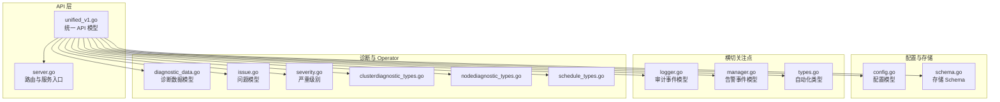

**图表来源** 
- [internal/api/unified_v1.go](file://internal/api/unified_v1.go)
- [internal/api/server.go](file://internal/api/server.go)
- [internal/config/config.go](file://internal/config/config.go)
- [internal/storage/schema.go](file://internal/storage/schema.go)
- [internal/audit/logger.go](file://internal/audit/logger.go)
- [internal/alerting/manager.go](file://internal/alerting/manager.go)
- [internal/automation/types.go](file://internal/automation/types.go)
- [internal/diag/types/diagnostic_data.go](file://internal/diag/types/diagnostic_data.go)
- [internal/diag/types/issue.go](file://internal/diag/types/issue.go)
- [internal/diag/types/severity.go](file://internal/diag/types/severity.go)
- [operator/api/v1/clusterdiagnostic_types.go](file://operator/api/v1/clusterdiagnostic_types.go)
- [operator/api/v1/nodediagnostic_types.go](file://operator/api/v1/nodediagnostic_types.go)
- [operator/api/v1/schedule_types.go](file://operator/api/v1/schedule_types.go)

**章节来源**
- [internal/api/unified_v1.go](file://internal/api/unified_v1.go)
- [internal/api/server.go](file://internal/api/server.go)
- [internal/config/config.go](file://internal/config/config.go)
- [internal/storage/schema.go](file://internal/storage/schema.go)

## 核心组件
本节概述 API 通用数据模型的关键类别与职责：
- 统一请求/响应包装：用于标准化 HTTP 响应结构与错误信息
- 分页参数：统一的页码、每页大小、排序字段与方向
- 配置模型：系统运行所需的核心配置项及校验规则
- 存储 Schema：持久化实体与索引约束
- 审计与告警事件：结构化事件载荷，便于追踪与联动
- 自动化类型：任务、步骤、状态机与结果封装
- 诊断类型：问题、严重级别、诊断数据聚合
- Operator CRD 类型：与 API 模型对齐的 Kubernetes 资源定义

**章节来源**
- [internal/api/unified_v1.go](file://internal/api/unified_v1.go)
- [internal/config/config.go](file://internal/config/config.go)
- [internal/storage/schema.go](file://internal/storage/schema.go)
- [internal/audit/logger.go](file://internal/audit/logger.go)
- [internal/alerting/manager.go](file://internal/alerting/manager.go)
- [internal/automation/types.go](file://internal/automation/types.go)
- [internal/diag/types/diagnostic_data.go](file://internal/diag/types/diagnostic_data.go)
- [internal/diag/types/issue.go](file://internal/diag/types/issue.go)
- [internal/diag/types/severity.go](file://internal/diag/types/severity.go)
- [operator/api/v1/clusterdiagnostic_types.go](file://operator/api/v1/clusterdiagnostic_types.go)
- [operator/api/v1/nodediagnostic_types.go](file://operator/api/v1/nodediagnostic_types.go)
- [operator/api/v1/schedule_types.go](file://operator/api/v1/schedule_types.go)

## 架构总览
下图展示了通用数据模型在各层之间的流转与依赖关系。API 层通过统一模型对请求进行解析与校验，随后调用配置、存储、审计、告警、自动化与诊断等子系统；Operator CRD 类型与 API 模型保持一致，确保声明式接口的一致性。

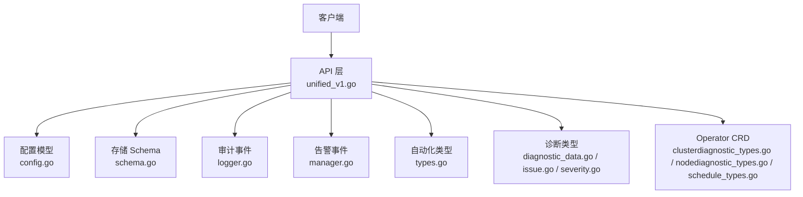

**图表来源** 
- [internal/api/unified_v1.go](file://internal/api/unified_v1.go)
- [internal/config/config.go](file://internal/config/config.go)
- [internal/storage/schema.go](file://internal/storage/schema.go)
- [internal/audit/logger.go](file://internal/audit/logger.go)
- [internal/alerting/manager.go](file://internal/alerting/manager.go)
- [internal/automation/types.go](file://internal/automation/types.go)
- [internal/diag/types/diagnostic_data.go](file://internal/diag/types/diagnostic_data.go)
- [internal/diag/types/issue.go](file://internal/diag/types/issue.go)
- [internal/diag/types/severity.go](file://internal/diag/types/severity.go)
- [operator/api/v1/clusterdiagnostic_types.go](file://operator/api/v1/clusterdiagnostic_types.go)
- [operator/api/v1/nodediagnostic_types.go](file://operator/api/v1/nodediagnostic_types.go)
- [operator/api/v1/schedule_types.go](file://operator/api/v1/schedule_types.go)

## 详细组件分析

### 统一请求/响应模型
- 目的：为所有 API 端点提供一致的响应包装与错误信息结构
- 典型字段：
  - 状态码：HTTP 标准或业务扩展
  - 消息：人类可读的错误或成功提示
  - 数据：泛型负载，按端点返回具体结构
  - 时间戳：请求处理时间
- 序列化约定：JSON 键名采用小驼峰或下划线（以实际实现为准），空值字段可省略或保留 null（遵循服务端设置）
- 错误分类：
  - 客户端错误：参数校验失败、权限不足
  - 服务端错误：内部异常、下游依赖失败
  - 业务错误：流程不合法、资源冲突

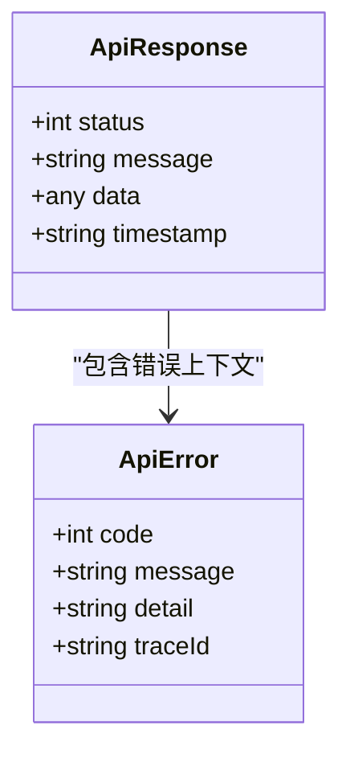

**图表来源** 
- [internal/api/unified_v1.go](file://internal/api/unified_v1.go)

**章节来源**
- [internal/api/unified_v1.go](file://internal/api/unified_v1.go)

### 分页参数与列表响应
- 分页输入：
  - page：页码（从 1 开始）
  - pageSize：每页条数（上限由服务端限制）
  - sortBy：排序字段
  - sortOrder：升序/降序
- 分页输出：
  - total：总记录数
  - page：当前页
  - pageSize：每页大小
  - items：数据数组
- 校验规则：
  - page ≥ 1
  - 1 ≤ pageSize ≤ 最大允许值
  - sortBy 必须在白名单内
  - sortOrder ∈ {asc, desc}

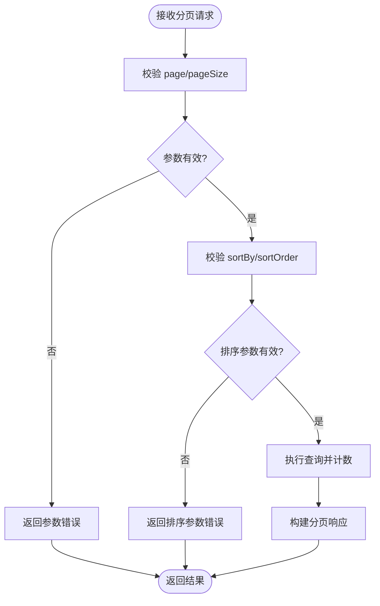

**图表来源** 
- [internal/api/unified_v1.go](file://internal/api/unified_v1.go)

**章节来源**
- [internal/api/unified_v1.go](file://internal/api/unified_v1.go)

### 配置模型
- 用途：描述服务运行所需的配置项（如端口、超时、特性开关、外部集成参数）
- 校验与默认值：
  - 必填字段缺失时返回明确错误
  - 可选字段提供合理默认值
  - 数值范围与格式校验（如 URL、邮箱、正则）
- 安全建议：
  - 敏感字段（密钥、令牌）不应出现在日志中
  - 配置文件加载失败应快速失败并给出定位信息

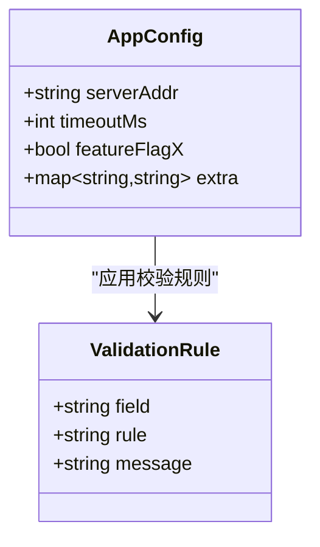

**图表来源** 
- [internal/config/config.go](file://internal/config/config.go)

**章节来源**
- [internal/config/config.go](file://internal/config/config.go)

### 存储 Schema
- 目的：定义持久化实体的字段、索引与约束
- 常见约束：
  - 唯一性：主键、业务键
  - 非空：关键字段不可为空
  - 长度：字符串长度限制
  - 外键：关联关系完整性
- 迁移策略：
  - 新增字段默认可为空并提供默认值
  - 删除字段需先标记废弃，再在后续版本移除
  - 变更索引时需评估写入放大与锁竞争

```mermaid
erDiagram
ENTITY {
uuid id PK
string name UK
int version
timestamp created_at
timestamp updated_at
}
INDEXES {
idx_name "name"
idx_version "version"
}
```

**图表来源** 
- [internal/storage/schema.go](file://internal/storage/schema.go)

**章节来源**
- [internal/storage/schema.go](file://internal/storage/schema.go)

### 审计事件模型
- 用途：记录关键操作与系统事件的标准化结构
- 典型字段：
  - 事件类型：登录、授权、配置变更、资源创建/更新/删除
  - 主体：用户或服务账号
  - 对象：被操作的资源标识
  - 结果：成功/失败及原因
  - 元数据：请求 ID、IP、UA、时间戳
- 序列化：JSON，避免敏感信息泄露

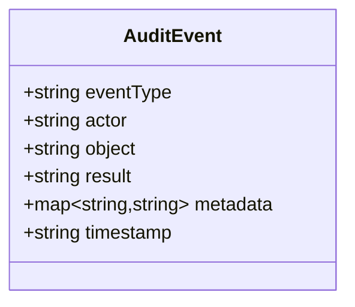

**图表来源** 
- [internal/audit/logger.go](file://internal/audit/logger.go)

**章节来源**
- [internal/audit/logger.go](file://internal/audit/logger.go)

### 告警事件模型
- 用途：对外暴露告警事件，供通知渠道消费
- 典型字段：
  - 告警级别：信息、警告、严重、致命
  - 触发条件：指标阈值、规则匹配
  - 资源上下文：集群、命名空间、工作负载
  - 持续时间与恢复时间
  - 附加数据：指标快照、链接

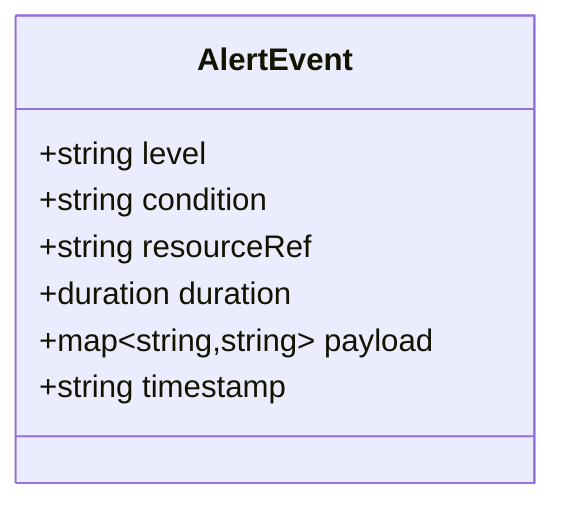

**图表来源** 
- [internal/alerting/manager.go](file://internal/alerting/manager.go)

**章节来源**
- [internal/alerting/manager.go](file://internal/alerting/manager.go)

### 自动化类型
- 用途：描述自动化任务、步骤、状态与结果
- 典型字段：
  - 任务 ID、名称、描述
  - 触发器：定时、事件、手动
  - 步骤序列：顺序/并行
  - 状态机：待执行、执行中、成功、失败、取消
  - 结果：输出、日志、重试次数

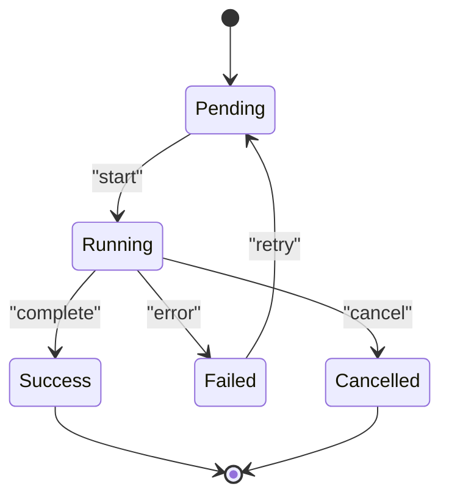

**图表来源** 
- [internal/automation/types.go](file://internal/automation/types.go)

**章节来源**
- [internal/automation/types.go](file://internal/automation/types.go)

### 诊断类型（问题、严重级别、诊断数据）
- 问题模型：
  - 问题 ID、标题、描述、发现时间、修复建议
  - 关联资源、影响范围
- 严重级别：
  - 枚举值：信息、低、中、高、致命
- 诊断数据：
  - 采集源、时间窗口、指标集合、结论与建议

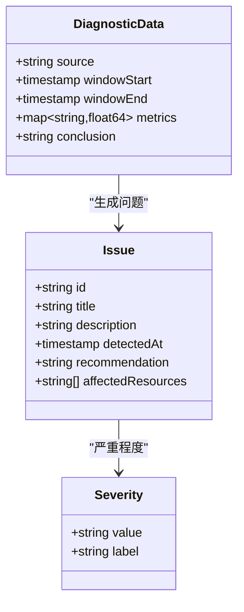

**图表来源** 
- [internal/diag/types/issue.go](file://internal/diag/types/issue.go)
- [internal/diag/types/severity.go](file://internal/diag/types/severity.go)
- [internal/diag/types/diagnostic_data.go](file://internal/diag/types/diagnostic_data.go)

**章节来源**
- [internal/diag/types/issue.go](file://internal/diag/types/issue.go)
- [internal/diag/types/severity.go](file://internal/diag/types/severity.go)
- [internal/diag/types/diagnostic_data.go](file://internal/diag/types/diagnostic_data.go)

### Operator CRD 类型（与 API 模型对齐）
- ClusterDiagnostic：集群级诊断任务与结果
- NodeDiagnostic：节点级诊断任务与结果
- Schedule：调度任务定义（Cron/间隔）
- 字段与 API 模型保持语义一致，便于声明式管理

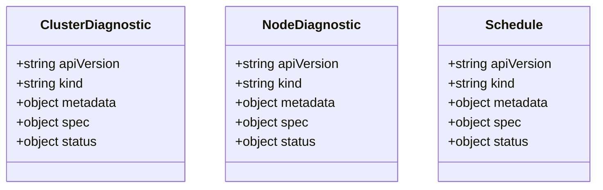

**图表来源** 
- [operator/api/v1/clusterdiagnostic_types.go](file://operator/api/v1/clusterdiagnostic_types.go)
- [operator/api/v1/nodediagnostic_types.go](file://operator/api/v1/nodediagnostic_types.go)
- [operator/api/v1/schedule_types.go](file://operator/api/v1/schedule_types.go)

**章节来源**
- [operator/api/v1/clusterdiagnostic_types.go](file://operator/api/v1/clusterdiagnostic_types.go)
- [operator/api/v1/nodediagnostic_types.go](file://operator/api/v1/nodediagnostic_types.go)
- [operator/api/v1/schedule_types.go](file://operator/api/v1/schedule_types.go)

## 依赖关系分析
- API 层依赖配置、存储、审计、告警、自动化与诊断模块
- Operator CRD 类型与 API 模型对齐，减少转换成本
- 各模块间通过明确的接口契约交互，降低耦合度

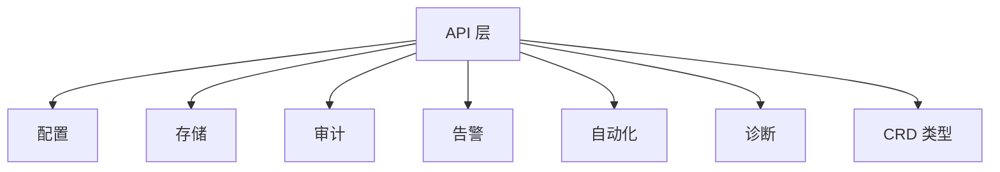

**图表来源** 
- [internal/api/unified_v1.go](file://internal/api/unified_v1.go)
- [internal/config/config.go](file://internal/config/config.go)
- [internal/storage/schema.go](file://internal/storage/schema.go)
- [internal/audit/logger.go](file://internal/audit/logger.go)
- [internal/alerting/manager.go](file://internal/alerting/manager.go)
- [internal/automation/types.go](file://internal/automation/types.go)
- [internal/diag/types/diagnostic_data.go](file://internal/diag/types/diagnostic_data.go)
- [operator/api/v1/clusterdiagnostic_types.go](file://operator/api/v1/clusterdiagnostic_types.go)

**章节来源**
- [internal/api/unified_v1.go](file://internal/api/unified_v1.go)
- [internal/config/config.go](file://internal/config/config.go)
- [internal/storage/schema.go](file://internal/storage/schema.go)
- [internal/audit/logger.go](file://internal/audit/logger.go)
- [internal/alerting/manager.go](file://internal/alerting/manager.go)
- [internal/automation/types.go](file://internal/automation/types.go)
- [internal/diag/types/diagnostic_data.go](file://internal/diag/types/diagnostic_data.go)
- [operator/api/v1/clusterdiagnostic_types.go](file://operator/api/v1/clusterdiagnostic_types.go)

## 性能考虑
- 分页查询：
  - 使用游标或基于索引的偏移优化大表分页
  - 避免 N+1 查询，批量加载关联数据
- 序列化：
  - 按需返回字段，减少冗余传输
  - 启用压缩与缓存（如 ETag/Last-Modified）
- 校验：
  - 前置校验尽早失败，减少无效计算
  - 使用结构化错误码，便于客户端快速定位
- 存储：
  - 合理设计索引，避免全表扫描
  - 读写分离与连接池调优

[本节为通用指导，无需特定文件引用]

## 故障排查指南
- 参数校验失败：
  - 检查分页参数范围与排序字段白名单
  - 确认必填字段与格式（URL、邮箱、正则）
- 序列化错误：
  - 核对 JSON 键名与大小写
  - 检查嵌套结构的空值处理
- 存储错误：
  - 查看唯一约束冲突与外键完整性
  - 检查索引是否覆盖查询路径
- 审计与告警：
  - 通过审计事件回溯操作链路
  - 根据告警级别与上下文快速定位根因

**章节来源**
- [internal/api/unified_v1.go](file://internal/api/unified_v1.go)
- [internal/audit/logger.go](file://internal/audit/logger.go)
- [internal/alerting/manager.go](file://internal/alerting/manager.go)
- [internal/storage/schema.go](file://internal/storage/schema.go)

## 结论
本文档系统化梳理了 Klaw 平台 API 的通用数据模型，涵盖统一响应、分页、配置、存储、审计、告警、自动化与诊断等核心组件。通过明确的字段约束、序列化约定与版本管理策略，确保 API 的稳定演进与向后兼容。建议在实际使用中严格遵循校验规则与最佳实践，结合审计与告警机制提升可观测性与可维护性。

[本节为总结，无需特定文件引用]

## 附录
- 版本管理原则：
  - 新增字段默认可为空并提供默认值
  - 废弃字段标记 deprecated，下一主版本移除
  - 破坏性变更需升级 API 版本前缀
- 迁移策略：
  - 数据库迁移脚本需幂等且可回滚
  - 灰度发布与特性开关配合逐步切换
- 最佳实践：
  - 使用强类型模型与结构化错误码
  - 最小化响应体，按需返回字段
  - 对敏感数据进行脱敏与加密

[本节为补充说明，无需特定文件引用]