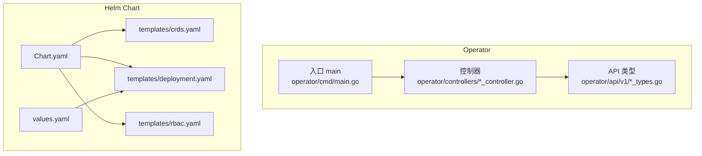
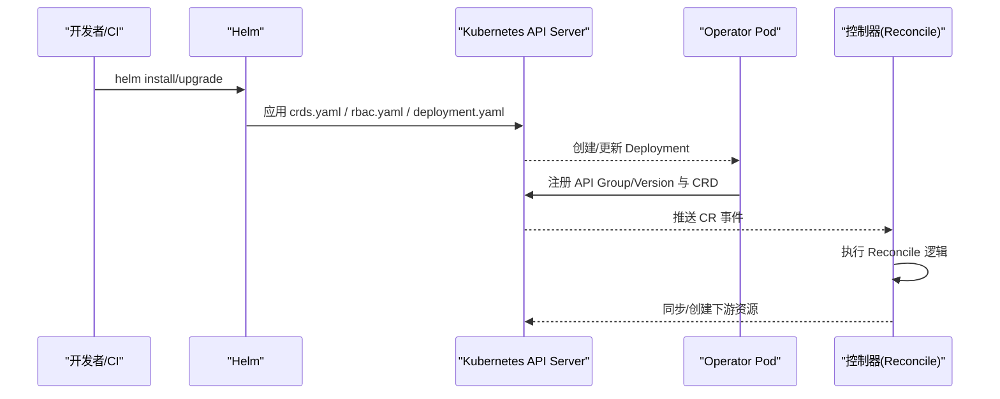
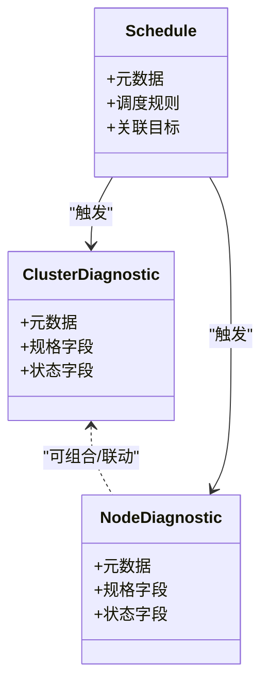
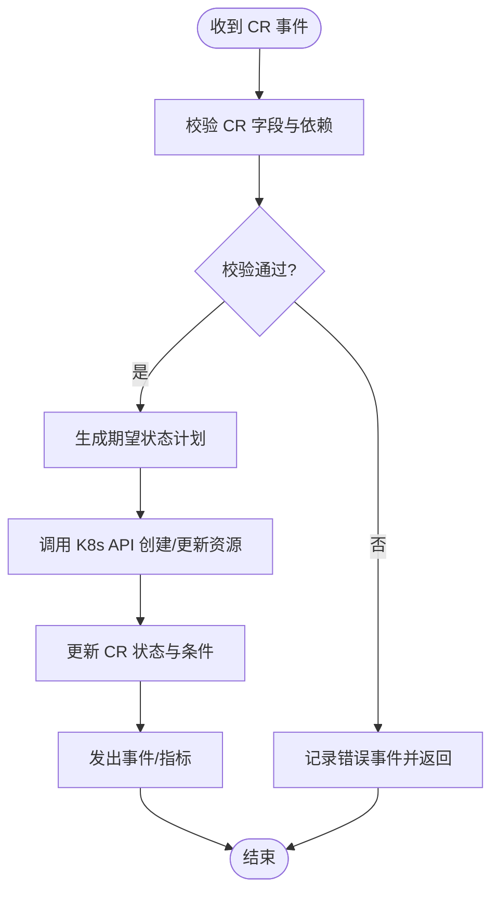
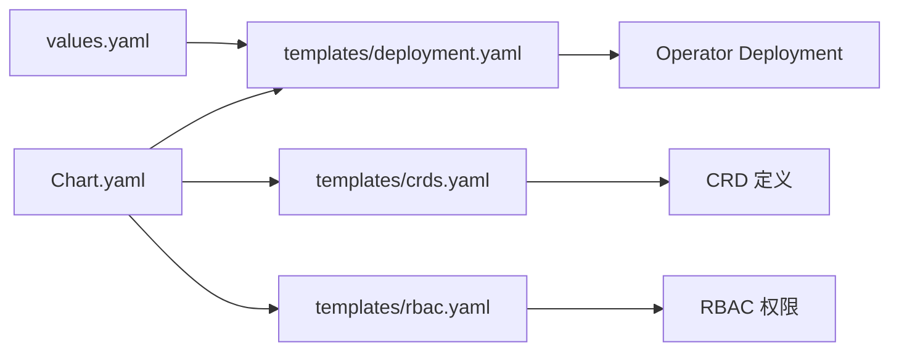
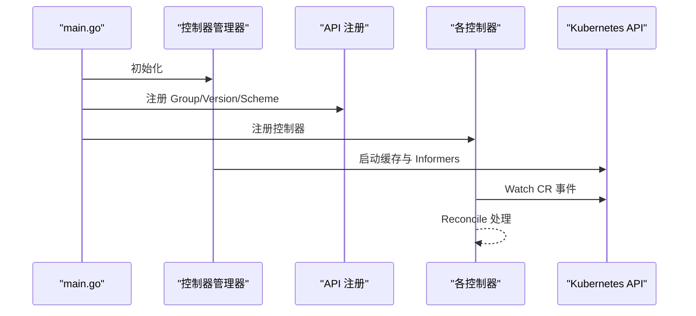
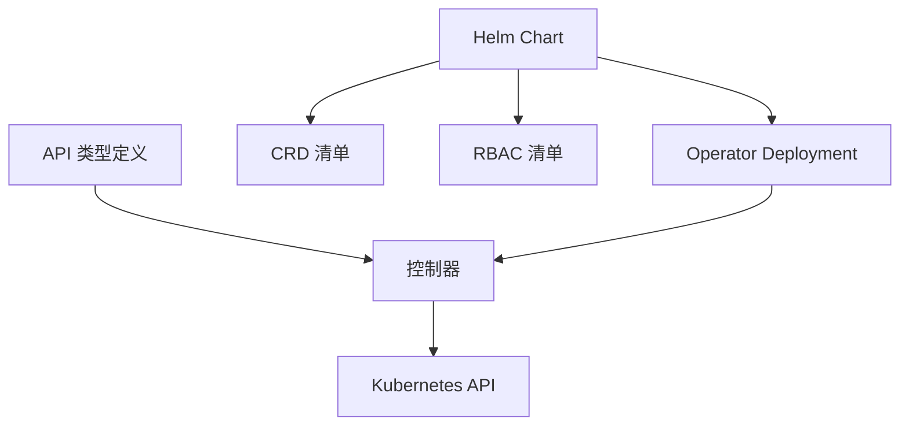

# CRD管理与部署

<cite>
**本文引用的文件**   
- [operator/api/v1/clusterdiagnostic_types.go](file://operator/api/v1/clusterdiagnostic_types.go)
- [operator/api/v1/nodediagnostic_types.go](file://operator/api/v1/nodediagnostic_types.go)
- [operator/api/v1/schedule_types.go](file://operator/api/v1/schedule_types.go)
- [operator/api/v1/groupversion_info.go](file://operator/api/v1/groupversion_info.go)
- [operator/controllers/clusterdiagnostic_controller.go](file://operator/controllers/clusterdiagnostic_controller.go)
- [operator/controllers/nodediagnostic_controller.go](file://operator/controllers/nodediagnostic_controller.go)
- [operator/controllers/schedule_controller.go](file://operator/controllers/schedule_controller.go)
- [operator/helm/kudig-operator/templates/crds.yaml](file://operator/helm/kudig-operator/templates/crds.yaml)
- [operator/helm/kudig-operator/templates/deployment.yaml](file://operator/helm/kudig-operator/templates/deployment.yaml)
- [operator/helm/kudig-operator/templates/rbac.yaml](file://operator/helm/kudig-operator/templates/rbac.yaml)
- [operator/helm/kudig-operator/Chart.yaml](file://operator/helm/kudig-operator/Chart.yaml)
- [operator/helm/kudig-operator/values.yaml](file://operator/helm/kudig-operator/values.yaml)
- [operator/cmd/main.go](file://operator/cmd/main.go)
- [deployment/README.md](file://deployment/README.md)
</cite>

## 目录
1. [简介](#简介)
2. [项目结构](#项目结构)
3. [核心组件](#核心组件)
4. [架构总览](#架构总览)
5. [详细组件分析](#详细组件分析)
6. [依赖关系分析](#依赖关系分析)
7. [性能考量](#性能考量)
8. [故障排查指南](#故障排查指南)
9. [结论](#结论)
10. [附录](#附录)

## 简介
本文件面向 Klaw Operator 的自定义资源定义（CRD）管理与生产级部署，覆盖以下内容：
- CRD 的安装、更新与版本管理流程
- Helm Chart 部署方式与参数说明
- 使用 kubectl 直接应用 CRD 的方法
- GitOps 集成方案（ArgoCD/Flux）
- CRD 版本兼容性、迁移策略与回滚机制
- CRD 监控、日志收集与问题排查
- 生产环境最佳实践与安全配置建议

## 项目结构
Operator 相关代码集中在 operator 目录下，包含 API 类型定义、控制器实现、Helm Chart 以及示例 YAML。关键路径如下：
- API 类型定义：operator/api/v1/*_types.go
- 控制器：operator/controllers/*_controller.go
- Helm Chart：operator/helm/kudig-operator/*
- 入口程序：operator/cmd/main.go
- 部署说明：deployment/README.md

**图表来源**
- [operator/api/v1/clusterdiagnostic_types.go](file://operator/api/v1/clusterdiagnostic_types.go)
- [operator/api/v1/nodediagnostic_types.go](file://operator/api/v1/nodediagnostic_types.go)
- [operator/api/v1/schedule_types.go](file://operator/api/v1/schedule_types.go)
- [operator/controllers/clusterdiagnostic_controller.go](file://operator/controllers/clusterdiagnostic_controller.go)
- [operator/controllers/nodediagnostic_controller.go](file://operator/controllers/nodediagnostic_controller.go)
- [operator/controllers/schedule_controller.go](file://operator/controllers/schedule_controller.go)
- [operator/helm/kudig-operator/Chart.yaml](file://operator/helm/kudig-operator/Chart.yaml)
- [operator/helm/kudig-operator/values.yaml](file://operator/helm/kudig-operator/values.yaml)
- [operator/helm/kudig-operator/templates/crds.yaml](file://operator/helm/kudig-operator/templates/crds.yaml)
- [operator/helm/kudig-operator/templates/deployment.yaml](file://operator/helm/kudig-operator/templates/deployment.yaml)
- [operator/helm/kudig-operator/templates/rbac.yaml](file://operator/helm/kudig-operator/templates/rbac.yaml)
- [operator/cmd/main.go](file://operator/cmd/main.go)

**章节来源**
- [operator/api/v1/clusterdiagnostic_types.go](file://operator/api/v1/clusterdiagnostic_types.go)
- [operator/api/v1/nodediagnostic_types.go](file://operator/api/v1/nodediagnostic_types.go)
- [operator/api/v1/schedule_types.go](file://operator/api/v1/schedule_types.go)
- [operator/controllers/clusterdiagnostic_controller.go](file://operator/controllers/clusterdiagnostic_controller.go)
- [operator/controllers/nodediagnostic_controller.go](file://operator/controllers/nodediagnostic_controller.go)
- [operator/controllers/schedule_controller.go](file://operator/controllers/schedule_controller.go)
- [operator/helm/kudig-operator/Chart.yaml](file://operator/helm/kudig-operator/Chart.yaml)
- [operator/helm/kudig-operator/values.yaml](file://operator/helm/kudig-operator/values.yaml)
- [operator/helm/kudig-operator/templates/crds.yaml](file://operator/helm/kudig-operator/templates/crds.yaml)
- [operator/helm/kudig-operator/templates/deployment.yaml](file://operator/helm/kudig-operator/templates/deployment.yaml)
- [operator/helm/kudig-operator/templates/rbac.yaml](file://operator/helm/kudig-operator/templates/rbac.yaml)
- [operator/cmd/main.go](file://operator/cmd/main.go)

## 核心组件
- CRD 类型定义：ClusterDiagnostic、NodeDiagnostic、Schedule 等，位于 operator/api/v1/*_types.go
- 控制器：分别监听并处理对应 CRD 的变更，位于 operator/controllers/*_controller.go
- Helm Chart：提供一键安装、升级与卸载能力，位于 operator/helm/kudig-operator
- 入口程序：初始化控制器管理器、注册 API 组与版本、启动 Reconcile 循环，位于 operator/cmd/main.go

**章节来源**
- [operator/api/v1/clusterdiagnostic_types.go](file://operator/api/v1/clusterdiagnostic_types.go)
- [operator/api/v1/nodediagnostic_types.go](file://operator/api/v1/nodediagnostic_types.go)
- [operator/api/v1/schedule_types.go](file://operator/api/v1/schedule_types.go)
- [operator/controllers/clusterdiagnostic_controller.go](file://operator/controllers/clusterdiagnostic_controller.go)
- [operator/controllers/nodediagnostic_controller.go](file://operator/controllers/nodediagnostic_controller.go)
- [operator/controllers/schedule_controller.go](file://operator/controllers/schedule_controller.go)
- [operator/cmd/main.go](file://operator/cmd/main.go)

## 架构总览
Klaw Operator 通过 Kubernetes API Server 监听 CRD 事件，控制器执行 Reconcile 逻辑以驱动集群状态达到期望态。Helm Chart 负责将 CRD、RBAC 与 Operator Deployment 统一交付到集群。

**图表来源**
- [operator/helm/kudig-operator/templates/crds.yaml](file://operator/helm/kudig-operator/templates/crds.yaml)
- [operator/helm/kudig-operator/templates/rbac.yaml](file://operator/helm/kudig-operator/templates/rbac.yaml)
- [operator/helm/kudig-operator/templates/deployment.yaml](file://operator/helm/kudig-operator/templates/deployment.yaml)
- [operator/cmd/main.go](file://operator/cmd/main.go)

## 详细组件分析

### CRD 类型与版本管理
- ClusterDiagnostic：用于集群级诊断任务编排与结果聚合
- NodeDiagnostic：用于节点级诊断任务编排与结果采集
- Schedule：用于周期性或定时触发诊断任务
- groupversion_info.go：声明 API Group、Version 与 Scheme 注册信息

**图表来源**
- [operator/api/v1/clusterdiagnostic_types.go](file://operator/api/v1/clusterdiagnostic_types.go)
- [operator/api/v1/nodediagnostic_types.go](file://operator/api/v1/nodediagnostic_types.go)
- [operator/api/v1/schedule_types.go](file://operator/api/v1/schedule_types.go)

**章节来源**
- [operator/api/v1/clusterdiagnostic_types.go](file://operator/api/v1/clusterdiagnostic_types.go)
- [operator/api/v1/nodediagnostic_types.go](file://operator/api/v1/nodediagnostic_types.go)
- [operator/api/v1/schedule_types.go](file://operator/api/v1/schedule_types.go)
- [operator/api/v1/groupversion_info.go](file://operator/api/v1/groupversion_info.go)

### 控制器与 Reconcile 流程
每个控制器监听对应 CRD，当 CR 对象发生变更时进入 Reconcile 循环，校验输入、调用内部逻辑、更新状态与事件通知。

**图表来源**
- [operator/controllers/clusterdiagnostic_controller.go](file://operator/controllers/clusterdiagnostic_controller.go)
- [operator/controllers/nodediagnostic_controller.go](file://operator/controllers/nodediagnostic_controller.go)
- [operator/controllers/schedule_controller.go](file://operator/controllers/schedule_controller.go)

**章节来源**
- [operator/controllers/clusterdiagnostic_controller.go](file://operator/controllers/clusterdiagnostic_controller.go)
- [operator/controllers/nodediagnostic_controller.go](file://operator/controllers/nodediagnostic_controller.go)
- [operator/controllers/schedule_controller.go](file://operator/controllers/schedule_controller.go)

### Helm Chart 结构与参数
- Chart.yaml：Chart 名称、版本、依赖与描述
- values.yaml：可覆盖的默认值（镜像、副本数、资源限制、日志级别等）
- templates/crds.yaml：CRD 清单，随 Chart 一起安装
- templates/deployment.yaml：Operator 部署模板，含环境变量、探针、卷挂载等
- templates/rbac.yaml：RBAC 权限定义，确保 Operator 具备所需权限

**图表来源**
- [operator/helm/kudig-operator/Chart.yaml](file://operator/helm/kudig-operator/Chart.yaml)
- [operator/helm/kudig-operator/values.yaml](file://operator/helm/kudig-operator/values.yaml)
- [operator/helm/kudig-operator/templates/crds.yaml](file://operator/helm/kudig-operator/templates/crds.yaml)
- [operator/helm/kudig-operator/templates/deployment.yaml](file://operator/helm/kudig-operator/templates/deployment.yaml)
- [operator/helm/kudig-operator/templates/rbac.yaml](file://operator/helm/kudig-operator/templates/rbac.yaml)

**章节来源**
- [operator/helm/kudig-operator/Chart.yaml](file://operator/helm/kudig-operator/Chart.yaml)
- [operator/helm/kudig-operator/values.yaml](file://operator/helm/kudig-operator/values.yaml)
- [operator/helm/kudig-operator/templates/crds.yaml](file://operator/helm/kudig-operator/templates/crds.yaml)
- [operator/helm/kudig-operator/templates/deployment.yaml](file://operator/helm/kudig-operator/templates/deployment.yaml)
- [operator/helm/kudig-operator/templates/rbac.yaml](file://operator/helm/kudig-operator/templates/rbac.yaml)

### 入口程序与控制器注册
入口程序负责：
- 初始化控制器管理器与缓存
- 注册 API Group/Version
- 注册各控制器并启动 Reconcile 循环
- 暴露健康检查与指标端点（如启用）

**图表来源**
- [operator/cmd/main.go](file://operator/cmd/main.go)

**章节来源**
- [operator/cmd/main.go](file://operator/cmd/main.go)

## 依赖关系分析
- 控制器依赖 API 类型定义，通过 Scheme 进行编解码
- Helm Chart 依赖 Kubernetes 集群版本特性（如 CRD 支持）
- RBAC 权限需满足控制器对 CRD 及下游资源的读写需求

**图表来源**
- [operator/api/v1/clusterdiagnostic_types.go](file://operator/api/v1/clusterdiagnostic_types.go)
- [operator/api/v1/nodediagnostic_types.go](file://operator/api/v1/nodediagnostic_types.go)
- [operator/api/v1/schedule_types.go](file://operator/api/v1/schedule_types.go)
- [operator/controllers/clusterdiagnostic_controller.go](file://operator/controllers/clusterdiagnostic_controller.go)
- [operator/controllers/nodediagnostic_controller.go](file://operator/controllers/nodediagnostic_controller.go)
- [operator/controllers/schedule_controller.go](file://operator/controllers/schedule_controller.go)
- [operator/helm/kudig-operator/templates/crds.yaml](file://operator/helm/kudig-operator/templates/crds.yaml)
- [operator/helm/kudig-operator/templates/rbac.yaml](file://operator/helm/kudig-operator/templates/rbac.yaml)
- [operator/helm/kudig-operator/templates/deployment.yaml](file://operator/helm/kudig-operator/templates/deployment.yaml)

**章节来源**
- [operator/api/v1/clusterdiagnostic_types.go](file://operator/api/v1/clusterdiagnostic_types.go)
- [operator/api/v1/nodediagnostic_types.go](file://operator/api/v1/nodediagnostic_types.go)
- [operator/api/v1/schedule_types.go](file://operator/api/v1/schedule_types.go)
- [operator/controllers/clusterdiagnostic_controller.go](file://operator/controllers/clusterdiagnostic_controller.go)
- [operator/controllers/nodediagnostic_controller.go](file://operator/controllers/nodediagnostic_controller.go)
- [operator/controllers/schedule_controller.go](file://operator/controllers/schedule_controller.go)
- [operator/helm/kudig-operator/templates/crds.yaml](file://operator/helm/kudig-operator/templates/crds.yaml)
- [operator/helm/kudig-operator/templates/rbac.yaml](file://operator/helm/kudig-operator/templates/rbac.yaml)
- [operator/helm/kudig-operator/templates/deployment.yaml](file://operator/helm/kudig-operator/templates/deployment.yaml)

## 性能考量
- 控制器并发度：根据集群规模调整工作线程数，避免过多导致 API Server 压力过大
- 缓存与索引：合理使用 Informer 缓存与索引，减少重复查询
- 资源限制：为 Operator Pod 设置合理的 CPU/内存请求与限制，保障稳定性
- 日志级别：生产环境降低日志级别，避免 I/O 瓶颈
- 指标暴露：开启 Prometheus 指标端点，便于监控与告警

[本节为通用指导，不直接分析具体文件]

## 故障排查指南
- 查看 Operator Pod 状态与事件：确认 Deployment 是否就绪，是否存在 CrashLoopBackOff
- 检查控制器日志：定位 Reconcile 错误、权限不足、字段校验失败等问题
- 验证 RBAC：确认 ServiceAccount 具备所需权限，必要时审计 RBAC 清单
- 检查 CRD 版本：确认集群已安装正确版本的 CRD，避免兼容性问题
- 事件与指标：结合 Kubernetes Events 与指标端点，快速定位异常

**章节来源**
- [operator/helm/kudig-operator/templates/deployment.yaml](file://operator/helm/kudig-operator/templates/deployment.yaml)
- [operator/helm/kudig-operator/templates/rbac.yaml](file://operator/helm/kudig-operator/templates/rbac.yaml)
- [operator/helm/kudig-operator/templates/crds.yaml](file://operator/helm/kudig-operator/templates/crds.yaml)

## 结论
通过 Helm Chart 统一管理 CRD、RBAC 与 Operator 部署，配合 GitOps 实现持续交付；遵循版本兼容性与迁移策略，确保平滑升级与回滚；在生产环境中强化安全与监控，提升稳定性与可观测性。

[本节为总结性内容，不直接分析具体文件]

## 附录

### 安装与更新流程（Helm）
- 安装：使用 Helm 安装 Chart，自动应用 CRD、RBAC 与 Operator Deployment
- 更新：升级 Chart 版本，优先更新 CRD，再更新 Deployment，确保向后兼容
- 回滚：若升级失败，回滚至上一稳定版本，保留 CRD 历史以避免破坏现有 CR

**章节来源**
- [operator/helm/kudig-operator/Chart.yaml](file://operator/helm/kudig-operator/Chart.yaml)
- [operator/helm/kudig-operator/templates/crds.yaml](file://operator/helm/kudig-operator/templates/crds.yaml)
- [operator/helm/kudig-operator/templates/deployment.yaml](file://operator/helm/kudig-operator/templates/deployment.yaml)

### kubectl 直接应用方法
- 仅安装 CRD：适用于先期准备阶段，提前在集群中注册 CRD
- 应用 RBAC：确保 Operator 具备必要权限
- 部署 Operator：通过 Deployment 清单启动 Operator 进程

**章节来源**
- [operator/helm/kudig-operator/templates/crds.yaml](file://operator/helm/kudig-operator/templates/crds.yaml)
- [operator/helm/kudig-operator/templates/rbac.yaml](file://operator/helm/kudig-operator/templates/rbac.yaml)
- [operator/helm/kudig-operator/templates/deployment.yaml](file://operator/helm/kudig-operator/templates/deployment.yaml)

### GitOps 集成方案（ArgoCD/Flux）
- 将 Helm Chart 与 values 文件纳入版本控制
- 使用 ArgoCD/Flux 同步仓库到集群，实现自动化部署与漂移修复
- 通过 Application/Release 对象管理生命周期，支持审批与回滚

**章节来源**
- [operator/helm/kudig-operator/Chart.yaml](file://operator/helm/kudig-operator/Chart.yaml)
- [operator/helm/kudig-operator/values.yaml](file://operator/helm/kudig-operator/values.yaml)

### CRD 版本兼容性与迁移策略
- 向后兼容：新增字段应可选，避免破坏现有 CR
- 向前兼容：控制器需忽略未知字段，保证旧版 CR 仍可运行
- 迁移：通过控制器或 Job 逐步迁移 CR 状态，避免一次性变更风险
- 回滚：保留 CRD 多版本，必要时回退到旧版本 CRD

**章节来源**
- [operator/api/v1/clusterdiagnostic_types.go](file://operator/api/v1/clusterdiagnostic_types.go)
- [operator/api/v1/nodediagnostic_types.go](file://operator/api/v1/nodediagnostic_types.go)
- [operator/api/v1/schedule_types.go](file://operator/api/v1/schedule_types.go)

### 监控与日志收集
- 指标：暴露 Prometheus 指标，监控控制器 reconcile 次数、错误率、队列长度
- 日志：结构化输出，集中收集到日志平台，便于检索与分析
- 告警：基于指标与日志设置告警规则，及时发现问题

**章节来源**
- [operator/helm/kudig-operator/templates/deployment.yaml](file://operator/helm/kudig-operator/templates/deployment.yaml)

### 生产环境最佳实践与安全配置
- 最小权限：RBAC 仅授予必要权限，定期审计
- 网络隔离：限制 Operator 访问外部服务，使用网络策略
- 密钥管理：敏感信息通过 Secret 管理，避免明文
- 资源配额：设置 Namespace 资源配额，防止资源滥用
- 备份恢复：对 CR 与关键数据进行定期备份与演练

**章节来源**
- [operator/helm/kudig-operator/templates/rbac.yaml](file://operator/helm/kudig-operator/templates/rbac.yaml)
- [operator/helm/kudig-operator/templates/deployment.yaml](file://operator/helm/kudig-operator/templates/deployment.yaml)

### 参考文档
- 部署说明：deployment/README.md

**章节来源**
- [deployment/README.md](file://deployment/README.md)