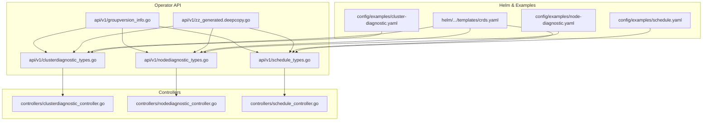
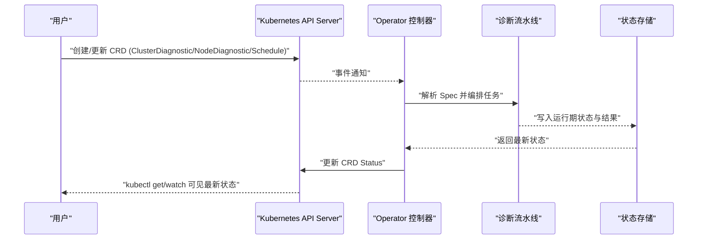
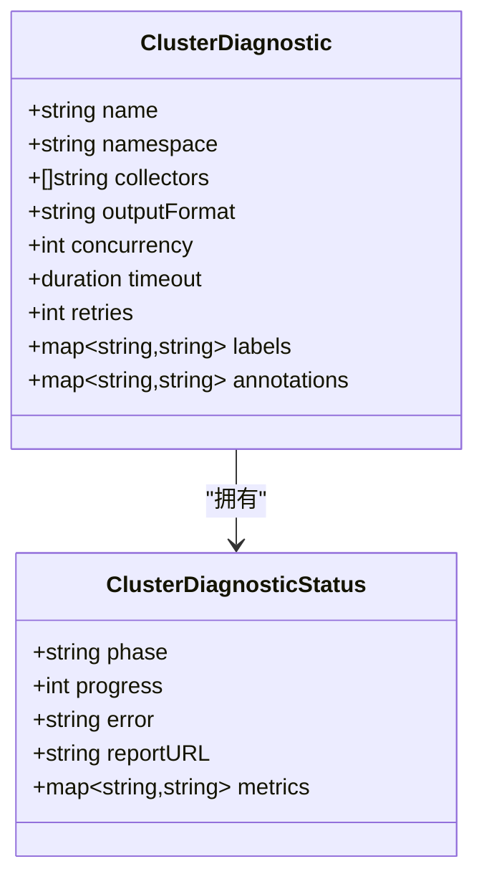
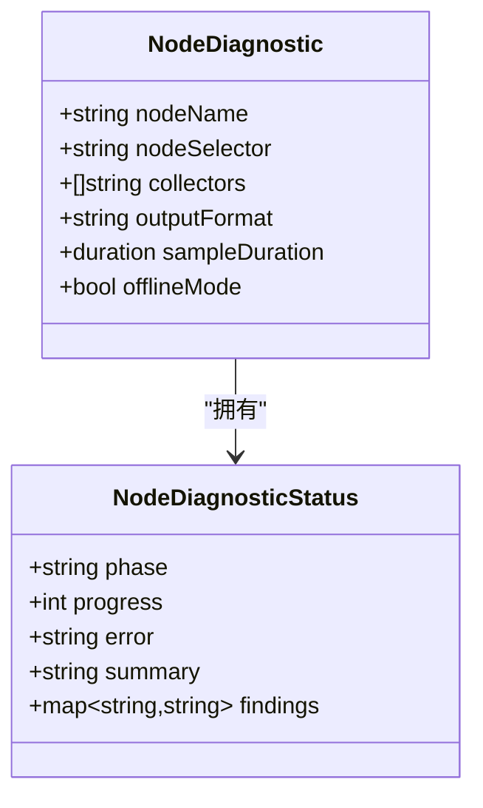
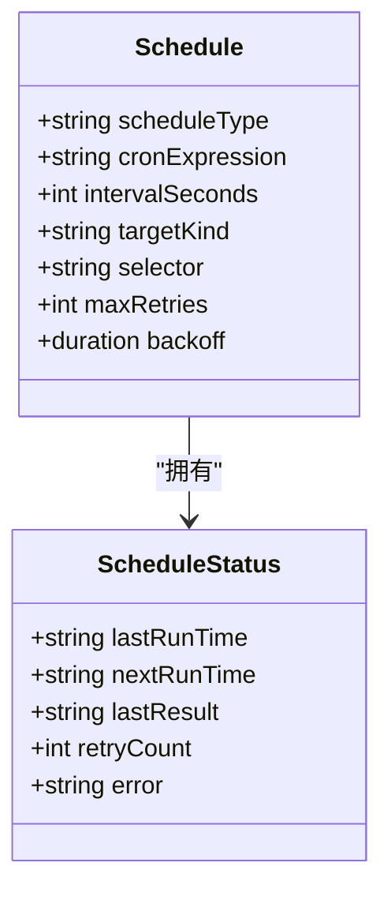
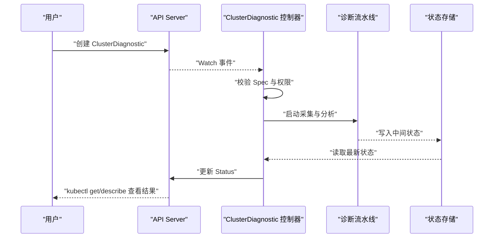
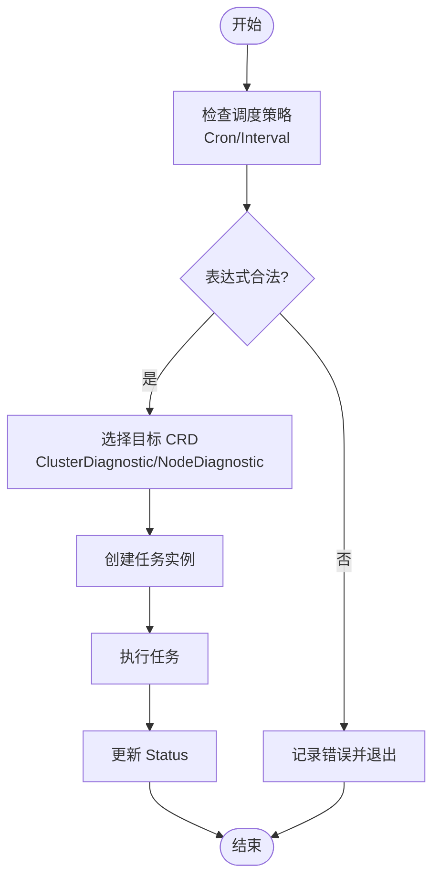
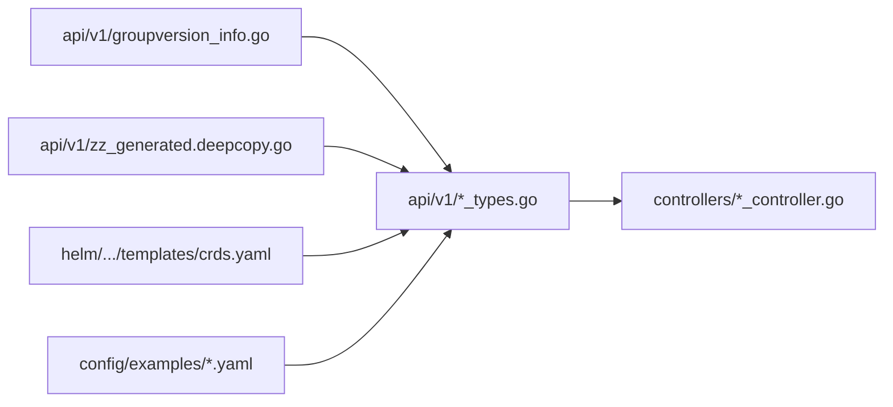

# CRD设计与使用

<cite>
**本文引用的文件**   
- [clusterdiagnostic_types.go](file://operator/api/v1/clusterdiagnostic_types.go)
- [nodediagnostic_types.go](file://operator/api/v1/nodediagnostic_types.go)
- [schedule_types.go](file://operator/api/v1/schedule_types.go)
- [groupversion_info.go](file://operator/api/v1/groupversion_info.go)
- [zz_generated.deepcopy.go](file://operator/api/v1/zz_generated.deepcopy.go)
- [clusterdiagnostic_controller.go](file://operator/controllers/clusterdiagnostic_controller.go)
- [nodediagnostic_controller.go](file://operator/controllers/nodediagnostic_controller.go)
- [schedule_controller.go](file://operator/controllers/schedule_controller.go)
- [crds.yaml](file://operator/helm/kudig-operator/templates/crds.yaml)
- [cluster-diagnostic.yaml](file://operator/config/examples/cluster-diagnostic.yaml)
- [node-diagnostic.yaml](file://operator/config/examples/node-diagnostic.yaml)
- [schedule.yaml](file://operator/config/examples/schedule.yaml)
</cite>

## 目录
1. [简介](#简介)
2. [项目结构](#项目结构)
3. [核心组件](#核心组件)
4. [架构总览](#架构总览)
5. [详细组件分析](#详细组件分析)
6. [依赖关系分析](#依赖关系分析)
7. [性能考量](#性能考量)
8. [故障排查指南](#故障排查指南)
9. [结论](#结论)
10. [附录](#附录)

## 简介
本文件面向 Klaw Operator 的自定义资源定义（CRD）使用者与运维人员，系统性说明 ClusterDiagnostic、NodeDiagnostic 与 Schedule 三类 CRD 的字段设计、验证规则、默认值策略、版本兼容性以及使用方法。文档包含：
- 字段级说明与约束（Spec/Status）
- YAML 配置示例与最佳实践
- 控制器工作流与状态机
- 部署、更新与管理指南（kubectl 操作）
- 常见问题定位与排错建议

## 项目结构
Klaw Operator 的 CRD 定义位于 operator/api/v1 目录，控制器实现位于 operator/controllers，Helm Chart 中的 CRD 模板位于 operator/helm/kudig-operator/templates/crds.yaml，示例 YAML 位于 operator/config/examples。

图表来源
- [clusterdiagnostic_types.go](file://operator/api/v1/clusterdiagnostic_types.go)
- [nodediagnostic_types.go](file://operator/api/v1/nodediagnostic_types.go)
- [schedule_types.go](file://operator/api/v1/schedule_types.go)
- [groupversion_info.go](file://operator/api/v1/groupversion_info.go)
- [zz_generated.deepcopy.go](file://operator/api/v1/zz_generated.deepcopy.go)
- [clusterdiagnostic_controller.go](file://operator/controllers/clusterdiagnostic_controller.go)
- [nodediagnostic_controller.go](file://operator/controllers/nodediagnostic_controller.go)
- [schedule_controller.go](file://operator/controllers/schedule_controller.go)
- [crds.yaml](file://operator/helm/kudig-operator/templates/crds.yaml)
- [cluster-diagnostic.yaml](file://operator/config/examples/cluster-diagnostic.yaml)
- [node-diagnostic.yaml](file://operator/config/examples/node-diagnostic.yaml)
- [schedule.yaml](file://operator/config/examples/schedule.yaml)

章节来源
- [clusterdiagnostic_types.go](file://operator/api/v1/clusterdiagnostic_types.go)
- [nodediagnostic_types.go](file://operator/api/v1/nodediagnostic_types.go)
- [schedule_types.go](file://operator/api/v1/schedule_types.go)
- [groupversion_info.go](file://operator/api/v1/groupversion_info.go)
- [zz_generated.deepcopy.go](file://operator/api/v1/zz_generated.deepcopy.go)
- [crds.yaml](file://operator/helm/kudig-operator/templates/crds.yaml)
- [cluster-diagnostic.yaml](file://operator/config/examples/cluster-diagnostic.yaml)
- [node-diagnostic.yaml](file://operator/config/examples/node-diagnostic.yaml)
- [schedule.yaml](file://operator/config/examples/schedule.yaml)

## 核心组件
本节概述三类 CRD 的职责边界与典型用法：
- ClusterDiagnostic：用于触发并管理集群级别的诊断任务，收集系统、网络、存储、安全等多维度数据，生成诊断报告。
- NodeDiagnostic：用于针对单节点进行诊断，采集节点内核、进程、运行时、磁盘等指标与日志。
- Schedule：用于声明式调度诊断任务，支持 Cron 表达式或间隔触发，驱动 ClusterDiagnostic/NodeDiagnostic 的周期性执行。

章节来源
- [clusterdiagnostic_types.go](file://operator/api/v1/clusterdiagnostic_types.go)
- [nodediagnostic_types.go](file://operator/api/v1/nodediagnostic_types.go)
- [schedule_types.go](file://operator/api/v1/schedule_types.go)

## 架构总览
下图展示了 CRD 对象在 Kubernetes 中的生命周期与控制器交互流程：用户通过 YAML 创建 CRD，API Server 持久化后由对应控制器监听并处理，控制器协调采集与分析管线，最终将结果写回 Status。

图表来源
- [clusterdiagnostic_controller.go](file://operator/controllers/clusterdiagnostic_controller.go)
- [nodediagnostic_controller.go](file://operator/controllers/nodediagnostic_controller.go)
- [schedule_controller.go](file://operator/controllers/schedule_controller.go)

## 详细组件分析

### ClusterDiagnostic CRD
- 用途：声明一次集群级诊断任务，包括采集范围、目标组件、输出格式、超时与重试策略等。
- Spec 关键字段（概念性说明）：
  - 任务标识与命名空间隔离
  - 采集器选择（系统、网络、存储、安全、服务网格等）
  - 输出与报告格式（文本、JSON、HTML、SARIF、Grafana 集成等）
  - 执行参数（并发度、超时、重试次数、采样窗口）
  - 资源限制（CPU/Memory 配额、I/O 限速）
- Status 关键字段（概念性说明）：
  - 当前阶段（Pending/Running/Completed/Failed）
  - 进度与统计（已采集项、失败项、耗时）
  - 错误信息与会话 ID
  - 产物位置（Report URL/路径）
- 验证与默认值：
  - 必填字段校验（如名称、采集器列表非空）
  - 默认并发度、超时时间、重试策略
  - 输出格式默认值与兼容检查
- 使用示例（YAML）：参见示例文件路径。
- 最佳实践：
  - 合理设置并发与超时，避免对集群造成压力
  - 按需启用采集器，减少不必要的数据量
  - 使用命名空间隔离不同环境或租户的诊断任务

章节来源
- [clusterdiagnostic_types.go](file://operator/api/v1/clusterdiagnostic_types.go)
- [cluster-diagnostic.yaml](file://operator/config/examples/cluster-diagnostic.yaml)

#### 类图（ClusterDiagnostic）

图表来源
- [clusterdiagnostic_types.go](file://operator/api/v1/clusterdiagnostic_types.go)

### NodeDiagnostic CRD
- 用途：针对单个节点进行诊断，聚焦内核、进程、运行时、磁盘、网络栈等。
- Spec 关键字段（概念性说明）：
  - 目标节点名称或标签选择器
  - 采集器选择（内核、进程、运行时、存储、网络、安全基线等）
  - 输出与报告格式
  - 执行参数（采样时长、阈值、是否离线采集）
- Status 关键字段（概念性说明）：
  - 阶段、进度、错误信息
  - 节点健康摘要与建议修复
- 验证与默认值：
  - 节点存在性校验
  - 采集器能力与权限校验
  - 默认采样时长与输出格式
- 使用示例（YAML）：参见示例文件路径。
- 最佳实践：
  - 优先使用标签选择器批量指定节点
  - 控制采样时长与并发，避免影响业务负载
  - 结合告警通道推送关键问题

章节来源
- [nodediagnostic_types.go](file://operator/api/v1/nodediagnostic_types.go)
- [node-diagnostic.yaml](file://operator/config/examples/node-diagnostic.yaml)

#### 类图（NodeDiagnostic）

图表来源
- [nodediagnostic_types.go](file://operator/api/v1/nodediagnostic_types.go)

### Schedule CRD
- 用途：声明式调度诊断任务，支持 Cron 表达式或固定间隔，自动触发 ClusterDiagnostic/NodeDiagnostic。
- Spec 关键字段（概念性说明）：
  - 调度策略（Cron 表达式或间隔秒数）
  - 关联的目标 CRD 类型与选择器（ClusterDiagnostic/NodeDiagnostic）
  - 执行上下文（命名空间、标签过滤）
  - 失败重试与退避策略
- Status 关键字段（概念性说明）：
  - 最近执行时间与下次计划时间
  - 上次执行结果（成功/失败）
  - 错误信息与重试计数
- 验证与默认值：
  - Cron 表达式合法性校验
  - 最小间隔限制
  - 默认重试策略与最大重试次数
- 使用示例（YAML）：参见示例文件路径。
- 最佳实践：
  - 使用合理的 Cron 表达式避开业务高峰
  - 为不同环境配置独立 Schedule 实例
  - 监控 Schedule 的执行历史与失败率

章节来源
- [schedule_types.go](file://operator/api/v1/schedule_types.go)
- [schedule.yaml](file://operator/config/examples/schedule.yaml)

#### 类图（Schedule）

图表来源
- [schedule_types.go](file://operator/api/v1/schedule_types.go)

### 控制器工作流（Sequence）
以 ClusterDiagnostic 为例，展示从创建到完成的状态流转与控制器动作。

图表来源
- [clusterdiagnostic_controller.go](file://operator/controllers/clusterdiagnostic_controller.go)

### 复杂逻辑流程图（调度与触发）
Schedule 根据策略触发目标诊断任务，流程图如下：

图表来源
- [schedule_controller.go](file://operator/controllers/schedule_controller.go)

## 依赖关系分析
- API 层：types 文件定义 CRD 结构与 deepcopy 生成代码；groupversion_info 声明 API Group/Version。
- 控制器层：每个 CRD 对应一个控制器，负责 reconcile 循环、状态更新与错误处理。
- Helm 层：crds.yaml 提供 CRD 安装模板，确保集群可用。
- 示例层：examples 提供可复用的 YAML 模板，便于快速上手。

图表来源
- [clusterdiagnostic_types.go](file://operator/api/v1/clusterdiagnostic_types.go)
- [nodediagnostic_types.go](file://operator/api/v1/nodediagnostic_types.go)
- [schedule_types.go](file://operator/api/v1/schedule_types.go)
- [groupversion_info.go](file://operator/api/v1/groupversion_info.go)
- [zz_generated.deepcopy.go](file://operator/api/v1/zz_generated.deepcopy.go)
- [crds.yaml](file://operator/helm/kudig-operator/templates/crds.yaml)
- [cluster-diagnostic.yaml](file://operator/config/examples/cluster-diagnostic.yaml)
- [node-diagnostic.yaml](file://operator/config/examples/node-diagnostic.yaml)
- [schedule.yaml](file://operator/config/examples/schedule.yaml)

章节来源
- [groupversion_info.go](file://operator/api/v1/groupversion_info.go)
- [zz_generated.deepcopy.go](file://operator/api/v1/zz_generated.deepcopy.go)
- [crds.yaml](file://operator/helm/kudig-operator/templates/crds.yaml)

## 性能考量
- 并发与采样：合理设置并发度与采样时长，避免 CPU/内存尖峰。
- 采集器选择：仅启用必要采集器，降低 I/O 与网络开销。
- 输出格式：大报告建议使用 JSON/SARIF，便于后续处理；HTML/Grafana 适合可视化。
- 调度频率：避免高频触发导致资源竞争，结合业务周期调整 Cron。
- 资源限制：为控制器与采集任务设置合理的 CPU/Memory 请求与限制。

[本节为通用指导，不直接分析具体文件]

## 故障排查指南
- 常见错误：
  - 字段校验失败：检查必填字段、取值范围与格式（如 Cron 表达式）。
  - 权限不足：确认 RBAC 允许读写 CRD 与相关资源。
  - 采集失败：检查节点可达性、权限与采集器依赖。
  - 任务卡住：查看 Status.phase 与错误信息，必要时删除重建。
- 排查步骤：
  - kubectl describe <CRD> 查看事件与状态
  - 查看控制器日志，定位 reconcile 错误
  - 检查示例 YAML 与期望差异
  - 逐步缩小采集器范围，定位问题模块
- 恢复建议：
  - 修正 Spec 后重新应用
  - 清理失败任务并重启
  - 调整资源限制与并发

章节来源
- [clusterdiagnostic_controller.go](file://operator/controllers/clusterdiagnostic_controller.go)
- [nodediagnostic_controller.go](file://operator/controllers/nodediagnostic_controller.go)
- [schedule_controller.go](file://operator/controllers/schedule_controller.go)

## 结论
ClusterDiagnostic、NodeDiagnostic 与 Schedule 三类 CRD 构成了 Klaw Operator 的诊断与调度核心。通过清晰的 Spec/Status 设计、严格的验证与默认值策略，配合控制器工作流与 Helm 部署模板，用户可以高效地声明式管理集群与节点的诊断任务。遵循最佳实践与排错指南，可在保证稳定性的同时提升诊断效率与可观测性。

[本节为总结，不直接分析具体文件]

## 附录
- 部署与更新（kubectl 示例）：
  - 安装 CRD：使用 Helm 或 kubectl apply crds.yaml
  - 创建示例：kubectl apply -f cluster-diagnostic.yaml / node-diagnostic.yaml / schedule.yaml
  - 查看状态：kubectl get <CRD> -A 与 kubectl describe <CRD> <name>
  - 更新配置：编辑 YAML 后重新 apply，观察 Status 变化
  - 删除任务：kubectl delete <CRD> <name>
- 版本兼容性：
  - 关注 groupversion_info 中定义的 API Group/Version
  - 升级前备份 CRD 与示例配置
  - 逐步迁移至新版本，验证 Status 字段兼容性

章节来源
- [crds.yaml](file://operator/helm/kudig-operator/templates/crds.yaml)
- [cluster-diagnostic.yaml](file://operator/config/examples/cluster-diagnostic.yaml)
- [node-diagnostic.yaml](file://operator/config/examples/node-diagnostic.yaml)
- [schedule.yaml](file://operator/config/examples/schedule.yaml)
- [groupversion_info.go](file://operator/api/v1/groupversion_info.go)