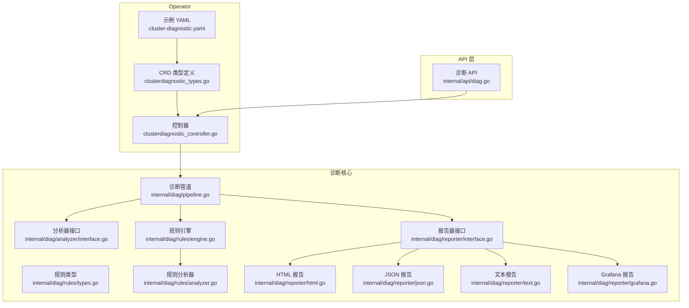
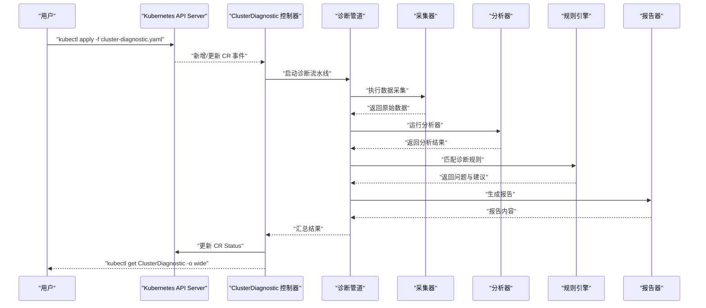
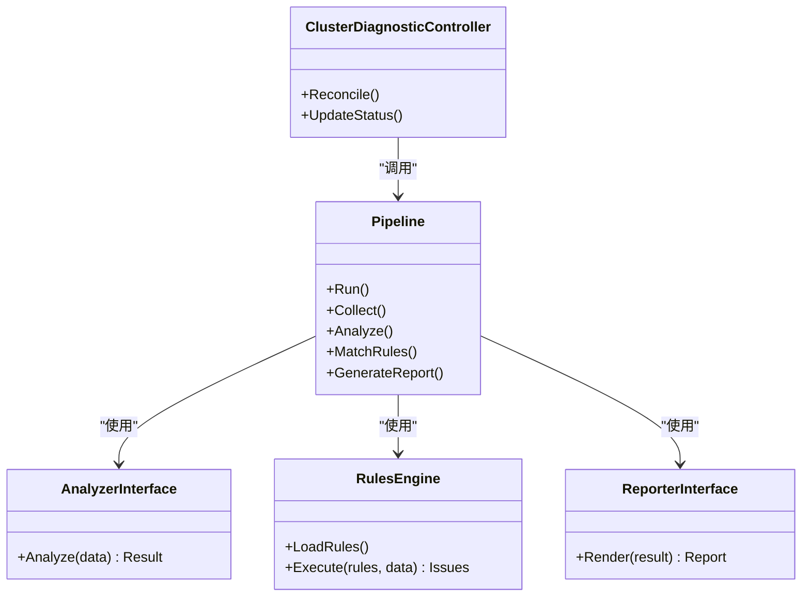

# ClusterDiagnostic CRD 文档

<cite>
**本文档中引用的文件**
- [clusterdiagnostic_types.go](file://operator/api/v1/clusterdiagnostic_types.go)
- [clusterdiagnostic_controller.go](file://operator/controllers/clusterdiagnostic_controller.go)
- [cluster-diagnostic.yaml](file://operator/config/examples/cluster-diagnostic.yaml)
- [diag.go](file://internal/api/diag.go)
- [pipeline.go](file://internal/diag/pipeline.go)
- [interface.go](file://internal/diag/analyzer/interface.go)
- [types.go](file://internal/diag/rules/types.go)
- [analyzer.go](file://internal/diag/rules/analyzer.go)
- [engine.go](file://internal/diag/rules/engine.go)
- [reporter/interface.go](file://internal/diag/reporter/interface.go)
- [html.go](file://internal/diag/reporter/html.go)
- [json.go](file://internal/diag/reporter/json.go)
- [text.go](file://internal/diag/reporter/text.go)
- [grafana.go](file://internal/diag/reporter/grafana.go)
</cite>

## 目录
1. [简介](#简介)
2. [项目结构](#项目结构)
3. [核心组件](#核心组件)
4. [架构总览](#架构总览)
5. [详细组件分析](#详细组件分析)
6. [依赖关系分析](#依赖关系分析)
7. [性能考虑](#性能考虑)
8. [故障排查指南](#故障排查指南)
9. [结论](#结论)
10. [附录](#附录)

## 简介
ClusterDiagnostic 是一个 Kubernetes 自定义资源（CRD），用于声明式地发起集群级诊断任务。用户通过 YAML 定义诊断目标、分析规则与配置选项，Operator 控制器负责调度执行，内部管道协调采集器、分析器与报告生成器，最终将结果写入 Status 字段并支持多种报告格式输出。

该 CRD 的核心价值：
- 统一入口：以单一资源对象驱动全链路诊断流程
- 可观测性：Status 字段集中记录状态、事件与结果摘要
- 可扩展：分析器与报告器均基于接口扩展，便于接入新能力
- 多格式输出：HTML、JSON、文本、SARIF、Grafana 等

## 项目结构
与 ClusterDiagnostic 相关的代码主要分布在以下模块：
- operator/api/v1：CRD 类型定义
- operator/controllers：控制器实现，监听并处理 CR 生命周期
- internal/api：API 层，提供 REST 接口触发或查询诊断
- internal/diag：诊断核心实现，包括采集、分析、规则引擎、报告生成等
- operator/config/examples：示例 YAML

图表来源
- [clusterdiagnostic_types.go:1-200](file://operator/api/v1/clusterdiagnostic_types.go#L1-L200)
- [clusterdiagnostic_controller.go:1-300](file://operator/controllers/clusterdiagnostic_controller.go#L1-L300)
- [cluster-diagnostic.yaml:1-100](file://operator/config/examples/cluster-diagnostic.yaml#L1-L100)
- [diag.go:1-200](file://internal/api/diag.go#L1-L200)
- [pipeline.go:1-200](file://internal/diag/pipeline.go#L1-L200)
- [interface.go:1-100](file://internal/diag/analyzer/interface.go#L1-L100)
- [types.go:1-150](file://internal/diag/rules/types.go#L1-L150)
- [analyzer.go:1-150](file://internal/diag/rules/analyzer.go#L1-L150)
- [engine.go:1-200](file://internal/diag/rules/engine.go#L1-L200)
- [reporter/interface.go:1-100](file://internal/diag/reporter/interface.go#L1-L100)
- [html.go:1-150](file://internal/diag/reporter/html.go#L1-L150)
- [json.go:1-150](file://internal/diag/reporter/json.go#L1-L150)
- [text.go:1-150](file://internal/diag/reporter/text.go#L1-L150)
- [grafana.go:1-150](file://internal/diag/reporter/grafana.go#L1-L150)

章节来源
- [clusterdiagnostic_types.go:1-200](file://operator/api/v1/clusterdiagnostic_types.go#L1-L200)
- [clusterdiagnostic_controller.go:1-300](file://operator/controllers/clusterdiagnostic_controller.go#L1-L300)
- [cluster-diagnostic.yaml:1-100](file://operator/config/examples/cluster-diagnostic.yaml#L1-L100)
- [diag.go:1-200](file://internal/api/diag.go#L1-L200)
- [pipeline.go:1-200](file://internal/diag/pipeline.go#L1-L200)

## 核心组件
- CRD 类型定义：包含 Spec 与 Status 的完整字段说明、默认值与验证约束
- 控制器：监听 CR 变更，驱动诊断流水线，更新 Status
- 诊断管道：编排采集、分析、规则匹配、报告生成等阶段
- 分析器接口与实现：按维度（Kubernetes、网络、存储、安全等）采集与分析数据
- 规则引擎：加载并执行诊断规则，产出问题与建议
- 报告器：将结果导出为 HTML/JSON/文本/SARIF/Grafana 等格式

章节来源
- [clusterdiagnostic_types.go:1-200](file://operator/api/v1/clusterdiagnostic_types.go#L1-L200)
- [clusterdiagnostic_controller.go:1-300](file://operator/controllers/clusterdiagnostic_controller.go#L1-L300)
- [pipeline.go:1-200](file://internal/diag/pipeline.go#L1-L200)
- [interface.go:1-100](file://internal/diag/analyzer/interface.go#L1-L100)
- [types.go:1-150](file://internal/diag/rules/types.go#L1-L150)
- [analyzer.go:1-150](file://internal/diag/rules/analyzer.go#L1-L150)
- [engine.go:1-200](file://internal/diag/rules/engine.go#L1-L200)
- [reporter/interface.go:1-100](file://internal/diag/reporter/interface.go#L1-L100)

## 架构总览
下图展示了从创建 CR 到报告生成的端到端流程，以及各组件之间的交互关系。

图表来源
- [clusterdiagnostic_controller.go:1-300](file://operator/controllers/clusterdiagnostic_controller.go#L1-L300)
- [pipeline.go:1-200](file://internal/diag/pipeline.go#L1-L200)
- [interface.go:1-100](file://internal/diag/analyzer/interface.go#L1-L100)
- [engine.go:1-200](file://internal/diag/rules/engine.go#L1-L200)
- [reporter/interface.go:1-100](file://internal/diag/reporter/interface.go#L1-L100)

## 详细组件分析

### CRD 字段定义与验证规则
- 命名空间与名称：遵循 Kubernetes 资源规范
- Spec 字段：
  - 诊断目标：指定要诊断的集群范围、命名空间、节点或特定资源
  - 分析规则：选择启用的分析器与规则集，支持优先级与过滤条件
  - 配置选项：超时、并发度、采样策略、报告格式、输出路径等
- Status 字段：
  - 状态管理：Pending、Running、Completed、Failed 等
  - 结果收集：每个阶段的开始/结束时间、错误信息、统计摘要
  - 报告生成：报告 ID、格式、访问地址或存储位置

验证规则建议：
- 必填字段校验（如至少一个诊断目标或规则）
- 枚举值校验（如报告格式、严重级别）
- 数值范围校验（如超时、并发度上限）
- 互斥字段校验（如同时指定在线与离线采集模式）

章节来源
- [clusterdiagnostic_types.go:1-200](file://operator/api/v1/clusterdiagnostic_types.go#L1-L200)
- [types.go:1-150](file://internal/diag/rules/types.go#L1-L150)

### 使用方法与 YAML 配置示例
- 创建诊断任务：使用 kubectl apply 提交示例 YAML
- 查看任务状态：kubectl get ClusterDiagnostic -n <namespace> -o wide
- 查看详细结果：kubectl describe ClusterDiagnostic <name>
- 删除任务：kubectl delete ClusterDiagnostic <name> -n <namespace>

最佳实践：
- 明确限定诊断范围，避免全量扫描影响性能
- 合理设置超时与并发，平衡速度与稳定性
- 选择合适的报告格式，便于集成与归档
- 定期清理已完成的任务，控制资源占用

章节来源
- [cluster-diagnostic.yaml:1-100](file://operator/config/examples/cluster-diagnostic.yaml#L1-L100)

### Status 字段的状态管理与结果收集
- 状态流转：Pending → Running → Completed/Failed
- 事件记录：每个阶段的开始/结束时间、错误堆栈、统计指标
- 结果聚合：问题列表、严重级别分布、建议项
- 报告链接：报告 ID、格式、存储位置或 URL

章节来源
- [clusterdiagnostic_types.go:1-200](file://operator/api/v1/clusterdiagnostic_types.go#L1-L200)
- [clusterdiagnostic_controller.go:1-300](file://operator/controllers/clusterdiagnostic_controller.go#L1-L300)

### 报告生成机制
- 报告器接口：统一抽象，支持多种格式实现
- 内置报告器：HTML、JSON、文本、SARIF、Grafana
- 生成流程：管道汇总结果 → 选择报告器 → 渲染模板 → 输出到指定位置

章节来源
- [reporter/interface.go:1-100](file://internal/diag/reporter/interface.go#L1-L100)
- [html.go:1-150](file://internal/diag/reporter/html.go#L1-L150)
- [json.go:1-150](file://internal/diag/reporter/json.go#L1-L150)
- [text.go:1-150](file://internal/diag/reporter/text.go#L1-L150)
- [grafana.go:1-150](file://internal/diag/reporter/grafana.go#L1-L150)

### kubectl 操作示例
- 创建任务：kubectl apply -f operator/config/examples/cluster-diagnostic.yaml
- 查看任务：kubectl get ClusterDiagnostic -A
- 查看详情：kubectl describe ClusterDiagnostic <name> -n <namespace>
- 删除任务：kubectl delete ClusterDiagnostic <name> -n <namespace>

章节来源
- [cluster-diagnostic.yaml:1-100](file://operator/config/examples/cluster-diagnostic.yaml#L1-L100)

## 依赖关系分析
ClusterDiagnostic 的依赖关系如下：
- 控制器依赖诊断管道
- 管道依赖采集器、分析器、规则引擎与报告器
- 规则引擎依赖规则类型与加载器
- 报告器依赖统一的报告接口

图表来源
- [clusterdiagnostic_controller.go:1-300](file://operator/controllers/clusterdiagnostic_controller.go#L1-L300)
- [pipeline.go:1-200](file://internal/diag/pipeline.go#L1-L200)
- [interface.go:1-100](file://internal/diag/analyzer/interface.go#L1-L100)
- [engine.go:1-200](file://internal/diag/rules/engine.go#L1-L200)
- [reporter/interface.go:1-100](file://internal/diag/reporter/interface.go#L1-L100)

章节来源
- [clusterdiagnostic_controller.go:1-300](file://operator/controllers/clusterdiagnostic_controller.go#L1-L300)
- [pipeline.go:1-200](file://internal/diag/pipeline.go#L1-L200)

## 性能考虑
- 并发控制：合理设置采集与分析的并发度，避免资源争用
- 超时与重试：为长耗时操作设置超时与重试策略
- 增量采集：优先使用增量采集减少负载
- 结果缓存：对重复诊断结果进行缓存，提升响应速度
- 资源限制：为诊断任务设置 CPU 与内存限制，防止影响集群稳定性

[本节为通用指导，不直接分析具体文件]

## 故障排查指南
常见问题与解决思路：
- 任务一直处于 Pending：检查控制器日志与 RBAC 权限
- 采集失败：确认目标可达性与权限，检查采集器配置
- 分析超时：调整超时参数或降低并发度
- 报告生成失败：检查报告器配置与输出路径权限
- 结果不完整：增加采样深度或扩大诊断范围

调试技巧：
- 使用 kubectl describe 查看详细事件
- 启用控制器调试日志
- 分阶段验证：先测试采集，再测试分析与报告

章节来源
- [clusterdiagnostic_controller.go:1-300](file://operator/controllers/clusterdiagnostic_controller.go#L1-L300)
- [pipeline.go:1-200](file://internal/diag/pipeline.go#L1-L200)

## 结论
ClusterDiagnostic 提供了声明式的集群诊断能力，通过统一的 CRD 接口简化了复杂的多阶段诊断流程。其模块化设计便于扩展新的分析器与报告器，Status 字段提供了完整的状态与结果可见性。结合最佳实践与故障排查指南，可有效提升集群健康管理的效率与可靠性。

[本节为总结性内容，不直接分析具体文件]

## 附录
- 相关文档：Operator 安装与配置、API 参考、示例 YAML
- 扩展开发：自定义分析器与报告器的实现指南
- 社区支持：问题反馈与贡献指南

[本节为补充信息，不直接分析具体文件]