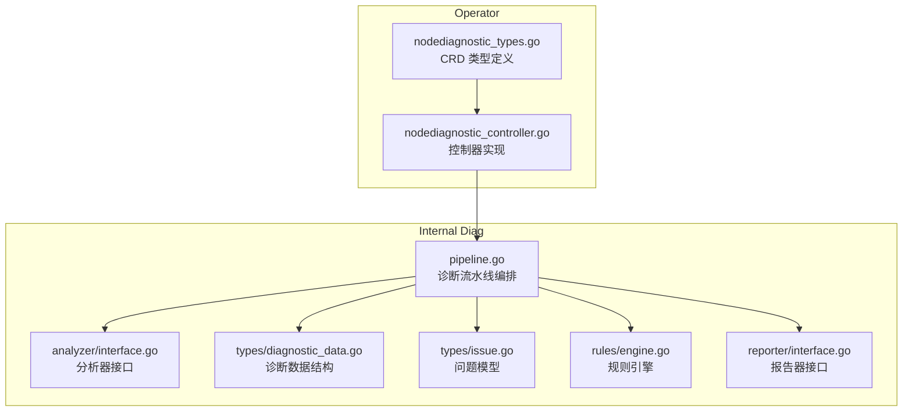
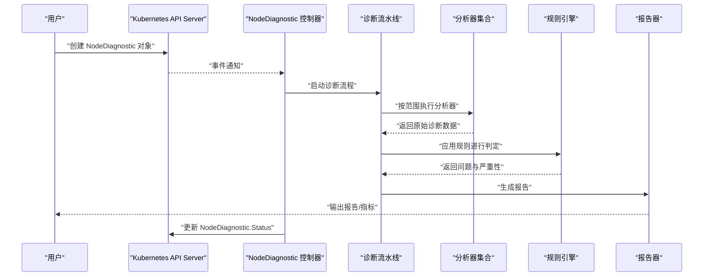
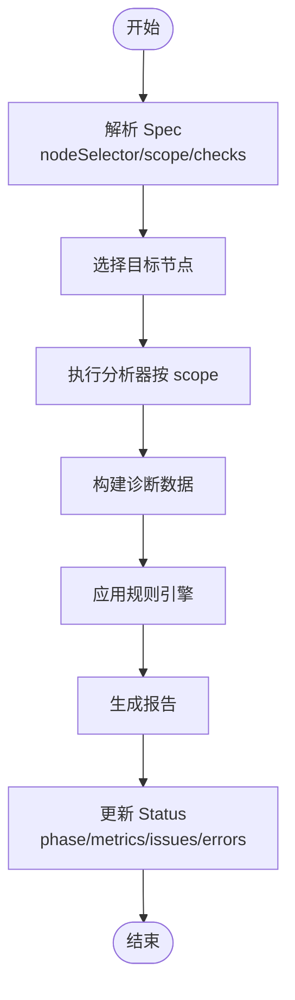
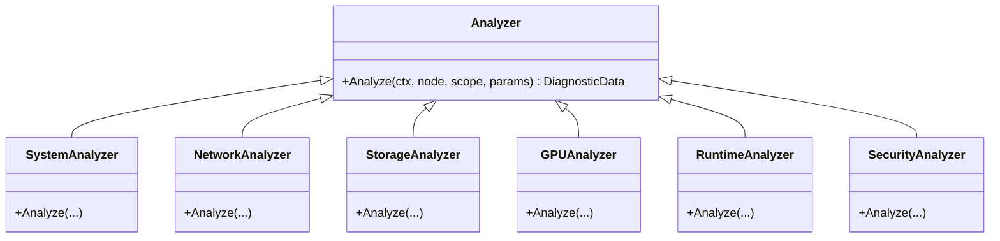
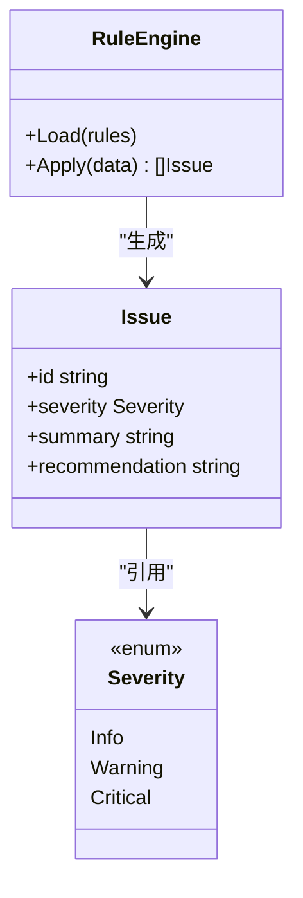
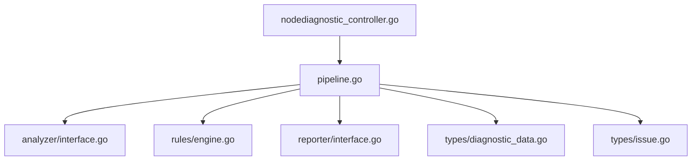

# NodeDiagnostic CRD

<cite>
**本文引用的文件**   
- [operator/api/v1/nodediagnostic_types.go](file://operator/api/v1/nodediagnostic_types.go)
- [operator/controllers/nodediagnostic_controller.go](file://operator/controllers/nodediagnostic_controller.go)
- [operator/config/examples/node-diagnostic.yaml](file://operator/config/examples/node-diagnostic.yaml)
- [internal/diag/pipeline.go](file://internal/diag/pipeline.go)
- [internal/diag/analyzer/interface.go](file://internal/diag/analyzer/interface.go)
- [internal/diag/types/diagnostic_data.go](file://internal/diag/types/diagnostic_data.go)
- [internal/diag/types/issue.go](file://internal/diag/types/issue.go)
- [internal/diag/reporter/interface.go](file://internal/diag/reporter/interface.go)
- [internal/diag/rules/engine.go](file://internal/diag/rules/engine.go)
- [internal/diag/rules/types.go](file://internal/diag/rules/types.go)
</cite>

## 目录
1. [简介](#简介)
2. [项目结构](#项目结构)
3. [核心组件](#核心组件)
4. [架构总览](#架构总览)
5. [详细组件分析](#详细组件分析)
6. [依赖关系分析](#依赖关系分析)
7. [性能考量](#性能考量)
8. [故障排除指南](#故障排除指南)
9. [结论](#结论)
10. [附录](#附录)

## 简介
本文件为 NodeDiagnostic 自定义资源（CRD）的权威文档，面向 Kubernetes 集群管理员与平台工程师。NodeDiagnostic 用于在节点级别发起、编排与追踪诊断任务，涵盖节点选择、诊断范围、检查项配置、执行状态与健康检查结果输出。本文档将详细说明 Spec 与 Status 字段定义、验证规则、使用场景，并提供 YAML 示例、kubectl 操作与最佳实践。

## 项目结构
NodeDiagnostic CRD 的定义位于 operator API 层，控制器负责监听并驱动内部诊断流水线；诊断能力由 analyzer、rules、reporter 等模块组成，数据模型集中在 types 包中。

图表来源
- [operator/api/v1/nodediagnostic_types.go](file://operator/api/v1/nodediagnostic_types.go)
- [operator/controllers/nodediagnostic_controller.go](file://operator/controllers/nodediagnostic_controller.go)
- [internal/diag/pipeline.go](file://internal/diag/pipeline.go)
- [internal/diag/analyzer/interface.go](file://internal/diag/analyzer/interface.go)
- [internal/diag/types/diagnostic_data.go](file://internal/diag/types/diagnostic_data.go)
- [internal/diag/types/issue.go](file://internal/diag/types/issue.go)
- [internal/diag/rules/engine.go](file://internal/diag/rules/engine.go)
- [internal/diag/reporter/interface.go](file://internal/diag/reporter/interface.go)

章节来源
- [operator/api/v1/nodediagnostic_types.go](file://operator/api/v1/nodediagnostic_types.go)
- [operator/controllers/nodediagnostic_controller.go](file://operator/controllers/nodediagnostic_controller.go)
- [internal/diag/pipeline.go](file://internal/diag/pipeline.go)

## 核心组件
- CRD 类型定义：描述 NodeDiagnostic 的 Spec 与 Status 字段、默认值与校验约束。
- 控制器：监听 NodeDiagnostic 对象，调度诊断流水线，更新状态与事件。
- 诊断流水线：协调采集、分析、规则匹配与报告生成。
- 分析器接口：定义各维度分析器的统一契约（系统、网络、存储、GPU、运行时等）。
- 规则引擎：基于规则对分析结果进行判定与严重性分级。
- 报告器：将诊断结果导出为多种格式（文本、JSON、HTML、SARIF、Grafana 等）。
- 数据模型：诊断数据、问题对象、严重性等通用结构。

章节来源
- [operator/api/v1/nodediagnostic_types.go](file://operator/api/v1/nodediagnostic_types.go)
- [operator/controllers/nodediagnostic_controller.go](file://operator/controllers/nodediagnostic_controller.go)
- [internal/diag/pipeline.go](file://internal/diag/pipeline.go)
- [internal/diag/analyzer/interface.go](file://internal/diag/analyzer/interface.go)
- [internal/diag/rules/engine.go](file://internal/diag/rules/engine.go)
- [internal/diag/reporter/interface.go](file://internal/diag/reporter/interface.go)
- [internal/diag/types/diagnostic_data.go](file://internal/diag/types/diagnostic_data.go)
- [internal/diag/types/issue.go](file://internal/diag/types/issue.go)

## 架构总览
NodeDiagnostic 的生命周期由控制器驱动，通过内部诊断流水线完成数据采集与分析，最终产出健康检查结果与问题清单，并通过报告器输出到不同目标。

图表来源
- [operator/controllers/nodediagnostic_controller.go](file://operator/controllers/nodediagnostic_controller.go)
- [internal/diag/pipeline.go](file://internal/diag/pipeline.go)
- [internal/diag/analyzer/interface.go](file://internal/diag/analyzer/interface.go)
- [internal/diag/rules/engine.go](file://internal/diag/rules/engine.go)
- [internal/diag/reporter/interface.go](file://internal/diag/reporter/interface.go)

## 详细组件分析

### NodeDiagnostic CRD 字段定义与验证规则
- 元数据与版本
  - apiVersion、kind、metadata：标准 Kubernetes 元信息。
- Spec（期望状态）
  - nodeSelector：节点选择器，支持 label selector 或名称匹配，用于限定目标节点。
  - scope：诊断范围，如系统、网络、存储、GPU、运行时、安全等维度的开关组合。
  - checks：检查项目列表，可细化到具体检查项与参数。
  - schedule：可选调度策略（如 Cron），用于周期性触发。
  - report：报告输出配置（目标、格式、过滤条件等）。
- Status（实际状态）
  - phase：运行阶段（Pending、Running、Completed、Failed 等）。
  - conditions：条件列表（如 Ready、Progressing、Error）。
  - metrics：节点性能指标快照（CPU、内存、磁盘、网络等）。
  - issues：问题清单（包含严重性、摘要、建议修复等）。
  - lastRun：最近一次运行时间戳。
  - errors：错误信息与堆栈摘要。
- 验证规则
  - 必填字段校验（如 nodeSelector 或 name 至少提供其一）。
  - 范围与检查项合法性校验（scope/checks 枚举与依赖关系）。
  - 调度表达式语法校验（schedule cron 格式）。
  - 报告器目标可达性与权限校验（可选）。

章节来源
- [operator/api/v1/nodediagnostic_types.go](file://operator/api/v1/nodediagnostic_types.go)

### 控制器与生命周期
- 事件监听：控制器订阅 NodeDiagnostic 对象的 Create/Update/Delete。
- 工作队列：将待处理对象入队，避免重复与风暴。
- 状态机：根据执行结果推进 phase 与 conditions。
- 重试与退避：失败时指数退避重试，记录错误。
- 资源清理：完成后清理临时数据与中间产物。

章节来源
- [operator/controllers/nodediagnostic_controller.go](file://operator/controllers/nodediagnostic_controller.go)

### 诊断流水线与数据流
- 输入：Spec 中的 nodeSelector、scope、checks、report。
- 采集：按 scope 调用对应分析器，收集原始数据。
- 分析：将原始数据转换为结构化诊断数据。
- 规则：应用规则引擎进行问题判定与严重性分级。
- 输出：通过报告器生成多格式报告，并写入 Status。

图表来源
- [internal/diag/pipeline.go](file://internal/diag/pipeline.go)
- [internal/diag/analyzer/interface.go](file://internal/diag/analyzer/interface.go)
- [internal/diag/types/diagnostic_data.go](file://internal/diag/types/diagnostic_data.go)
- [internal/diag/rules/engine.go](file://internal/diag/rules/engine.go)
- [internal/diag/reporter/interface.go](file://internal/diag/reporter/interface.go)

章节来源
- [internal/diag/pipeline.go](file://internal/diag/pipeline.go)

### 分析器接口与扩展点
- 接口契约：定义统一的 Analyze(ctx, node, scope, params) 方法。
- 内置分析器：系统资源、网络、存储、GPU、运行时、安全等。
- 扩展方式：实现接口并注册到分析器注册表。

图表来源
- [internal/diag/analyzer/interface.go](file://internal/diag/analyzer/interface.go)

章节来源
- [internal/diag/analyzer/interface.go](file://internal/diag/analyzer/interface.go)

### 规则引擎与问题模型
- 规则加载：从配置或代码加载规则集。
- 匹配逻辑：基于诊断数据进行模式匹配与阈值判断。
- 严重性：定义严重等级（Info、Warning、Critical 等）。
- 问题对象：包含 ID、摘要、严重性、影响范围、修复建议等。

图表来源
- [internal/diag/rules/engine.go](file://internal/diag/rules/engine.go)
- [internal/diag/rules/types.go](file://internal/diag/rules/types.go)
- [internal/diag/types/issue.go](file://internal/diag/types/issue.go)

章节来源
- [internal/diag/rules/engine.go](file://internal/diag/rules/engine.go)
- [internal/diag/rules/types.go](file://internal/diag/rules/types.go)
- [internal/diag/types/issue.go](file://internal/diag/types/issue.go)

### 报告器与输出
- 支持格式：文本、JSON、HTML、SARIF、Grafana 等。
- 输出目标：控制台、文件、远程服务、监控后端。
- 过滤与聚合：按严重性、范围、时间窗口过滤与聚合。

章节来源
- [internal/diag/reporter/interface.go](file://internal/diag/reporter/interface.go)

### YAML 配置示例与字段说明
- 示例位置：[operator/config/examples/node-diagnostic.yaml](file://operator/config/examples/node-diagnostic.yaml)
- 关键字段说明
  - spec.nodeSelector：指定目标节点（label 或名称）。
  - spec.scope：选择诊断范围（系统、网络、存储、GPU、运行时、安全等）。
  - spec.checks：细化检查项与参数。
  - spec.schedule：可选 Cron 表达式，周期性执行。
  - spec.report：报告格式与输出目标。
  - status.phase：运行阶段（Pending/Running/Completed/Failed）。
  - status.conditions：条件列表（Ready/Progressing/Error）。
  - status.metrics：性能指标快照。
  - status.issues：问题清单与严重性。
  - status.lastRun：最近执行时间。
  - status.errors：错误信息。

章节来源
- [operator/config/examples/node-diagnostic.yaml](file://operator/config/examples/node-diagnostic.yaml)

### kubectl 操作示例
- 查看 CRD
  - kubectl get crd nodediagnostics.kudig.io
- 创建诊断任务
  - kubectl apply -f operator/config/examples/node-diagnostic.yaml
- 查看任务状态
  - kubectl describe nodediagnostics <name> -n <namespace>
- 删除任务
  - kubectl delete nodediagnostics <name> -n <namespace>
- 查看日志（控制器）
  - kubectl logs -l app=klaw-operator -n <namespace> --tail=200

章节来源
- [operator/config/examples/node-diagnostic.yaml](file://operator/config/examples/node-diagnostic.yaml)

### 使用场景
- 节点级健康巡检：定期扫描节点系统、网络、存储、GPU、运行时等。
- 故障定位：快速定位高负载、磁盘异常、网络丢包、GPU 显存泄漏等问题。
- 合规与安全：检查 CIS 基线、RBAC 权限、容器运行时安全配置。
- 容量规划：基于性能指标评估节点资源使用趋势。

章节来源
- [internal/diag/analyzer/interface.go](file://internal/diag/analyzer/interface.go)
- [internal/diag/rules/engine.go](file://internal/diag/rules/engine.go)

## 依赖关系分析
NodeDiagnostic 控制器依赖内部诊断流水线，流水线依赖分析器、规则引擎与报告器。数据模型贯穿整个链路。

图表来源
- [operator/controllers/nodediagnostic_controller.go](file://operator/controllers/nodediagnostic_controller.go)
- [internal/diag/pipeline.go](file://internal/diag/pipeline.go)
- [internal/diag/analyzer/interface.go](file://internal/diag/analyzer/interface.go)
- [internal/diag/rules/engine.go](file://internal/diag/rules/engine.go)
- [internal/diag/reporter/interface.go](file://internal/diag/reporter/interface.go)
- [internal/diag/types/diagnostic_data.go](file://internal/diag/types/diagnostic_data.go)
- [internal/diag/types/issue.go](file://internal/diag/types/issue.go)

章节来源
- [operator/controllers/nodediagnostic_controller.go](file://operator/controllers/nodediagnostic_controller.go)
- [internal/diag/pipeline.go](file://internal/diag/pipeline.go)

## 性能考量
- 并发控制：限制同时运行的诊断任务数量，避免节点过载。
- 采样与限流：对高频指标进行采样与限流，减少 I/O 压力。
- 增量分析：仅对变更部分进行分析，降低计算开销。
- 缓存与复用：缓存节点元数据与公共检测结果。
- 超时与熔断：设置合理的超时与熔断策略，防止长时间阻塞。

## 故障排除指南
- 常见问题
  - 节点选择器不匹配：确认 nodeSelector 是否正确，节点标签是否一致。
  - 权限不足：确保控制器具备读取节点、Pod、事件等资源的 RBAC 权限。
  - 分析器失败：检查分析器依赖（如内核模块、eBPF、GPU 工具链）。
  - 规则未命中：核对规则配置与阈值，确认诊断数据是否符合预期。
  - 报告输出失败：检查报告器目标可达性与认证配置。
- 调试步骤
  - 查看 NodeDiagnostic 状态与条件，定位阶段与错误信息。
  - 查看控制器日志，获取详细堆栈与上下文。
  - 启用更详细的日志级别，观察流水线执行路径。
  - 单独运行特定分析器，隔离问题范围。

章节来源
- [operator/controllers/nodediagnostic_controller.go](file://operator/controllers/nodediagnostic_controller.go)
- [internal/diag/pipeline.go](file://internal/diag/pipeline.go)

## 结论
NodeDiagnostic CRD 提供了灵活的节点级诊断能力，通过清晰的 Spec/Status 设计、可扩展的分析器与规则引擎，以及多格式报告输出，满足日常巡检、故障定位与合规审计等场景。建议结合自动化调度与告警机制，形成闭环的节点健康管理。

## 附录
- 最佳实践
  - 合理划分 scope 与 checks，避免过度采集。
  - 使用 label selector 精确选择目标节点，减少无关节点干扰。
  - 定期审查规则阈值，避免误报与漏报。
  - 将报告输出集成到监控与告警平台，实现可视化与联动。
  - 对敏感操作（如 eBPF、内核参数）进行权限最小化与审计。