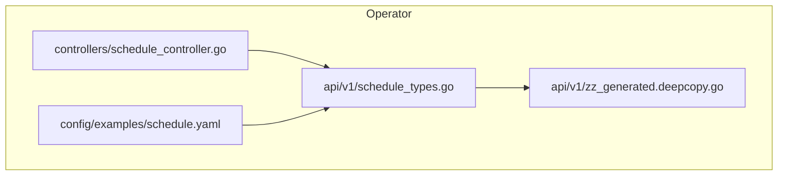
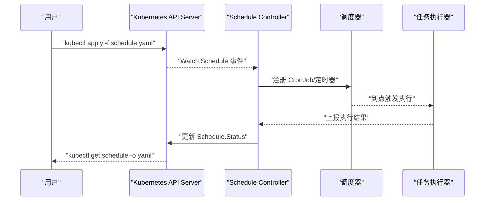
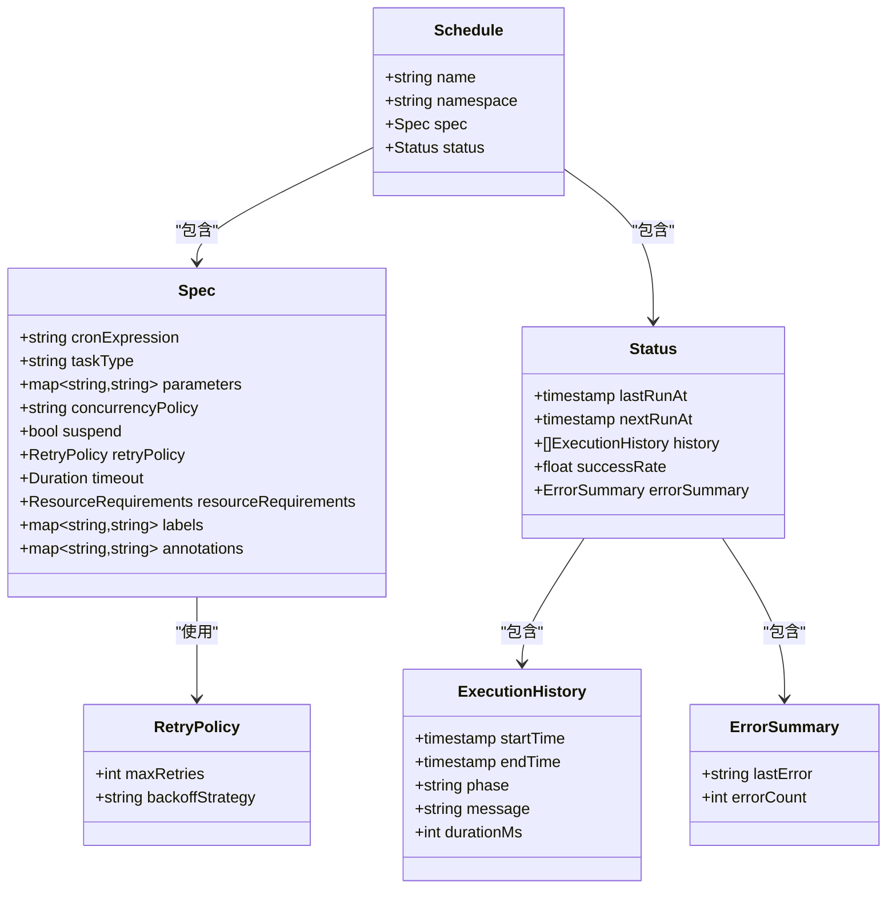
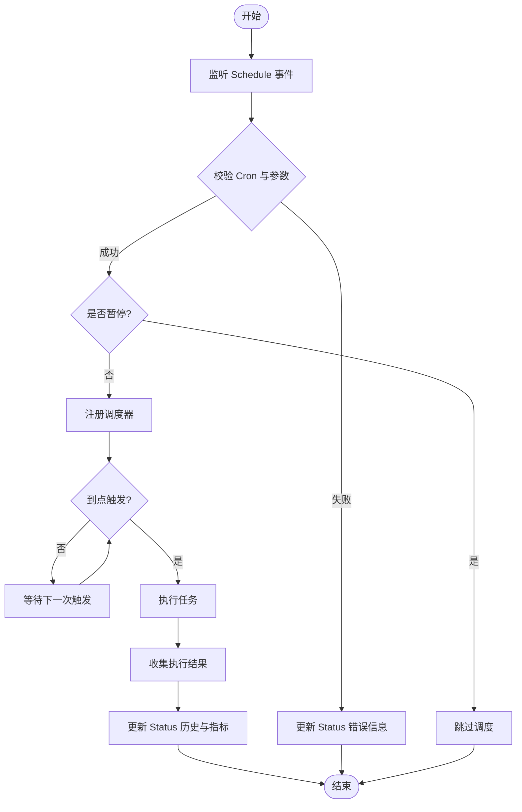
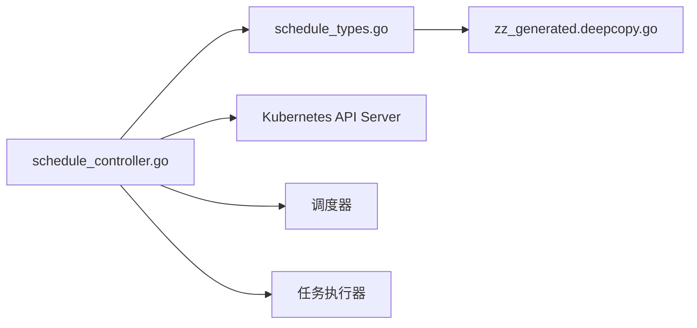

# Schedule CRD 自定义资源文档

<cite>
**本文档引用的文件**
- [schedule_types.go](file://operator/api/v1/schedule_types.go)
- [schedule_controller.go](file://operator/controllers/schedule_controller.go)
- [schedule.yaml](file://operator/config/examples/schedule.yaml)
- [zz_generated.deepcopy.go](file://operator/api/v1/zz_generated.deepcopy.go)
</cite>

## 目录
1. [简介](#简介)
2. [项目结构](#项目结构)
3. [核心组件](#核心组件)
4. [架构总览](#架构总览)
5. [详细组件分析](#详细组件分析)
6. [依赖关系分析](#依赖关系分析)
7. [性能考虑](#性能考虑)
8. [故障排查指南](#故障排查指南)
9. [结论](#结论)
10. [附录](#附录)

## 简介
本文件面向 Kubernetes Operator 中的 Schedule 自定义资源（CRD），用于定义和管理定时任务。内容涵盖：
- Spec 字段定义：Cron 表达式、任务类型、执行参数与调度策略
- Status 字段定义：执行历史、成功率与错误记录
- YAML 配置示例与字段说明
- kubectl 操作示例：创建、查看状态、管理生命周期
- 调度策略最佳实践与性能优化建议

## 项目结构
Schedule CRD 相关代码位于 operator 子模块中，关键位置如下：
- CRD 类型定义：operator/api/v1/schedule_types.go
- Controller 控制器：operator/controllers/schedule_controller.go
- 示例 YAML：operator/config/examples/schedule.yaml
- 自动生成的 DeepCopy：operator/api/v1/zz_generated.deepcopy.go

图表来源
- [schedule_types.go](file://operator/api/v1/schedule_types.go)
- [schedule_controller.go](file://operator/controllers/schedule_controller.go)
- [schedule.yaml](file://operator/config/examples/schedule.yaml)
- [zz_generated.deepcopy.go](file://operator/api/v1/zz_generated.deepcopy.go)

章节来源
- [schedule_types.go](file://operator/api/v1/schedule_types.go)
- [schedule_controller.go](file://operator/controllers/schedule_controller.go)
- [schedule.yaml](file://operator/config/examples/schedule.yaml)
- [zz_generated.deepcopy.go](file://operator/api/v1/zz_generated.deepcopy.go)

## 核心组件
- Schedule CRD 类型：定义 Spec 与 Status 的字段结构、枚举与校验约束
- Schedule Controller：监听并处理 Schedule 对象，解析 Cron 表达式，触发任务执行，更新 Status 历史与指标
- 示例 YAML：提供最小可用配置与常见场景的配置模板

章节来源
- [schedule_types.go](file://operator/api/v1/schedule_types.go)
- [schedule_controller.go](file://operator/controllers/schedule_controller.go)
- [schedule.yaml](file://operator/config/examples/schedule.yaml)

## 架构总览
Schedule CRD 的工作流由 API Server、Controller、调度器与任务执行器组成。

图表来源
- [schedule_controller.go](file://operator/controllers/schedule_controller.go)
- [schedule_types.go](file://operator/api/v1/schedule_types.go)

## 详细组件分析

### Schedule 类型定义（Spec 与 Status）
- Spec 关键字段
  - cronExpression：Cron 表达式，控制调度周期
  - taskType：任务类型，如备份、诊断、清理等
  - parameters：执行参数，按任务类型传递键值对或结构化数据
  - concurrencyPolicy：并发策略（允许/禁止/替换）
  - suspend：是否暂停调度
  - retryPolicy：重试策略（最大重试次数、退避策略）
  - timeout：执行超时时间
  - resourceRequirements：资源限制（CPU/内存）
  - labels/annotations：元数据标签与注解
- Status 关键字段
  - lastRunAt：上次运行时间
  - nextRunAt：下次计划运行时间
  - history：最近执行历史记录（时间戳、状态、耗时、错误信息）
  - successRate：成功率统计
  - errorSummary：错误摘要（最近错误、错误计数）

图表来源
- [schedule_types.go](file://operator/api/v1/schedule_types.go)
- [zz_generated.deepcopy.go](file://operator/api/v1/zz_generated.deepcopy.go)

章节来源
- [schedule_types.go](file://operator/api/v1/schedule_types.go)
- [zz_generated.deepcopy.go](file://operator/api/v1/zz_generated.deepcopy.go)

### 控制器工作流（调度与执行）
- 监听 Schedule 对象的增删改事件
- 解析并校验 Cron 表达式与参数
- 根据并发策略与暂停标记决定是否注册调度器
- 触发任务执行并收集执行结果
- 更新 Status 中的执行历史、成功率与错误摘要

图表来源
- [schedule_controller.go](file://operator/controllers/schedule_controller.go)

章节来源
- [schedule_controller.go](file://operator/controllers/schedule_controller.go)

### YAML 配置示例与字段说明
- 最小可用配置：指定名称、命名空间、cronExpression、taskType
- 完整配置：包含 parameters、concurrencyPolicy、retryPolicy、timeout、resourceRequirements、labels/annotations
- 示例文件路径：operator/config/examples/schedule.yaml

章节来源
- [schedule.yaml](file://operator/config/examples/schedule.yaml)

## 依赖关系分析
- Schedule CRD 类型与 DeepCopy 生成：类型定义与自动生成代码的耦合
- Controller 与类型定义：控制器依赖 Spec/Status 的结构进行解析与更新
- 外部依赖：Kubernetes API Server、调度器、任务执行器（具体实现取决于任务类型）

图表来源
- [schedule_types.go](file://operator/api/v1/schedule_types.go)
- [zz_generated.deepcopy.go](file://operator/api/v1/zz_generated.deepcopy.go)
- [schedule_controller.go](file://operator/controllers/schedule_controller.go)

章节来源
- [schedule_types.go](file://operator/api/v1/schedule_types.go)
- [zz_generated.deepcopy.go](file://operator/api/v1/zz_generated.deepcopy.go)
- [schedule_controller.go](file://operator/controllers/schedule_controller.go)

## 性能考虑
- Cron 表达式优化
  - 避免过于密集的调度周期，合理设置分钟级间隔
  - 使用精确的时区与日期范围，减少不必要的计算
- 并发策略
  - 高负载任务建议使用“替换”策略，避免堆积
  - 低优先级任务可使用“允许”策略，配合资源限制
- 重试与超时
  - 设置合理的最大重试次数与指数退避，避免雪崩
  - 为长时间任务设置超时，防止资源占用
- 资源限制
  - 为每个任务分配 CPU/内存上限，避免争用
  - 使用节点亲和与污点容忍，隔离重负载任务
- 监控与告警
  - 基于 Status.successRate 与 errorSummary 设置阈值告警
  - 采集执行耗时分布，识别慢任务

[本节为通用指导，不直接分析具体文件]

## 故障排查指南
- 常见问题
  - Cron 表达式无效：检查语法与时区设置
  - 任务未执行：确认 suspend 标志与并发策略
  - 执行失败：查看 Status.history 中的错误信息与返回码
  - 资源不足：检查 resourceRequirements 与集群容量
- 排查步骤
  - 使用 kubectl describe 查看事件与状态
  - 查看日志输出，定位执行阶段错误
  - 调整重试与超时参数，观察效果
- 恢复措施
  - 修正 Cron 表达式与参数后重新应用
  - 降低并发或增加资源配额
  - 清理失败的历史记录，避免状态膨胀

章节来源
- [schedule_controller.go](file://operator/controllers/schedule_controller.go)
- [schedule_types.go](file://operator/api/v1/schedule_types.go)

## 结论
Schedule CRD 提供了声明式的定时任务管理能力，通过清晰的 Spec/Status 结构与灵活的调度策略，满足多样化任务需求。结合最佳实践与性能优化建议，可在生产环境中稳定运行。

[本节为总结性内容，不直接分析具体文件]

## 附录

### kubectl 操作示例
- 创建定时任务
  - 命令：kubectl apply -f operator/config/examples/schedule.yaml
- 查看执行状态
  - 命令：kubectl get schedule <name> -o yaml
  - 命令：kubectl describe schedule <name>
- 管理生命周期
  - 暂停：在 Spec.suspend 设置为 true 后重新应用
  - 删除：kubectl delete schedule <name>
  - 更新：修改 YAML 后再次 apply

[本节为操作指导，不直接分析具体文件]

### 调度策略最佳实践
- 选择合适的时间粒度：分钟级适合常规维护，小时级适合批量任务
- 合理设置并发策略：高负载优先“替换”，低负载可“允许”
- 配置重试与超时：避免无限重试与长时间阻塞
- 资源隔离：使用节点选择与资源限制确保稳定性

[本节为通用指导，不直接分析具体文件]