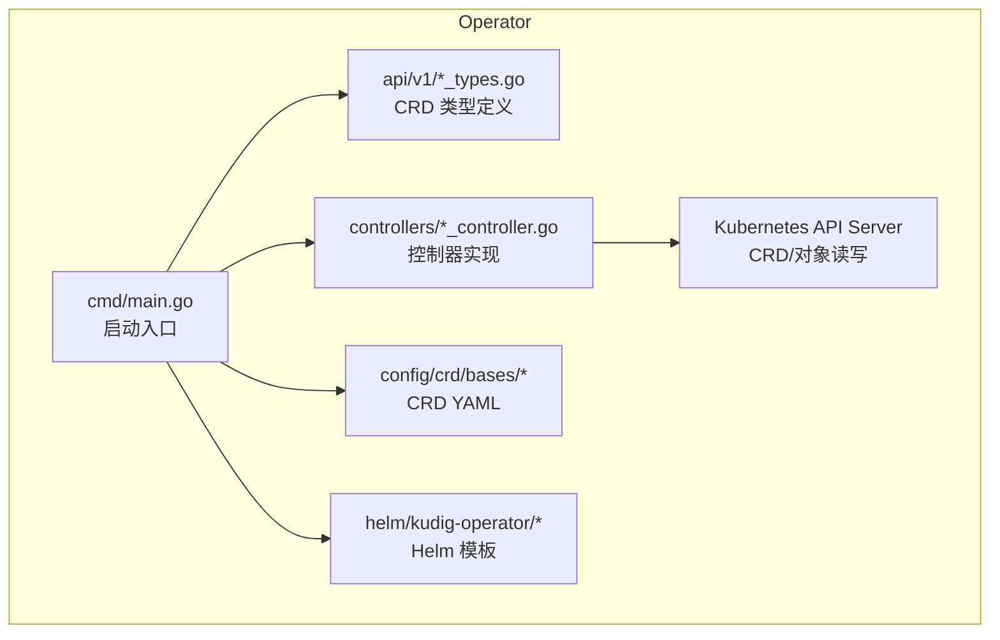
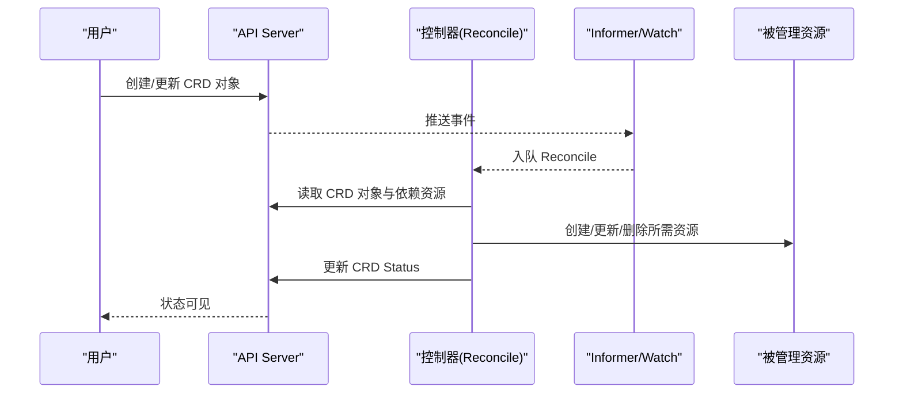
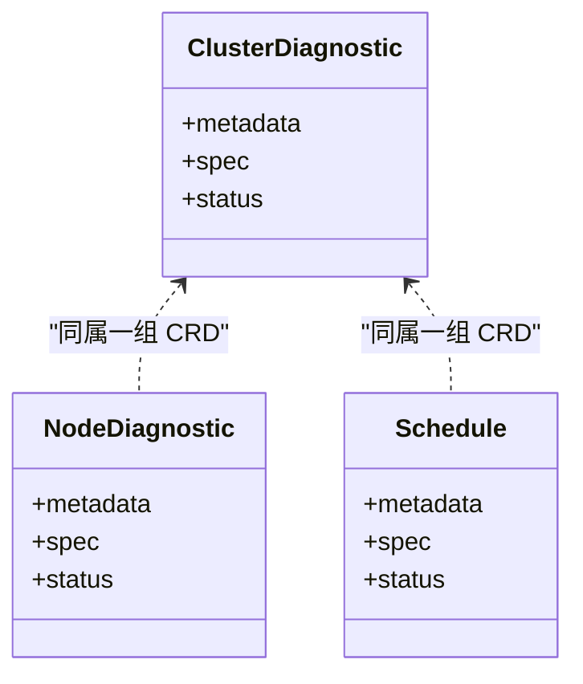
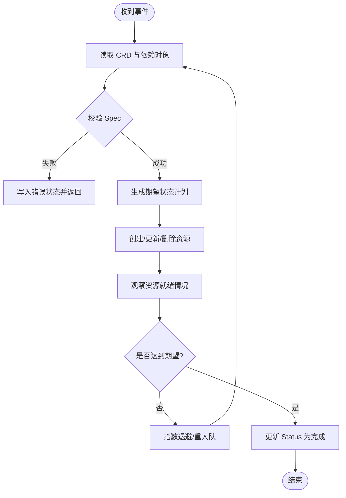
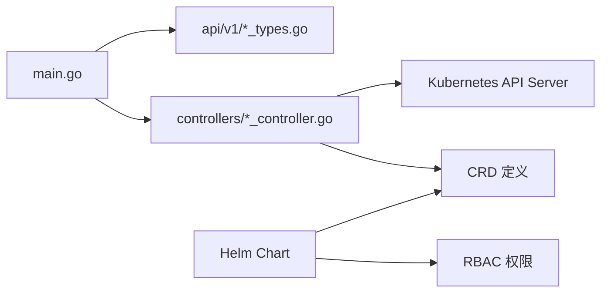

# Kubernetes Operator

<cite>
**本文引用的文件**   
- [operator/cmd/main.go](file://operator/cmd/main.go)
- [operator/api/v1/clusterdiagnostic_types.go](file://operator/api/v1/clusterdiagnostic_types.go)
- [operator/api/v1/nodediagnostic_types.go](file://operator/api/v1/nodediagnostic_types.go)
- [operator/api/v1/schedule_types.go](file://operator/api/v1/schedule_types.go)
- [operator/api/v1/groupversion_info.go](file://operator/api/v1/groupversion_info.go)
- [operator/controllers/clusterdiagnostic_controller.go](file://operator/controllers/clusterdiagnostic_controller.go)
- [operator/controllers/nodediagnostic_controller.go](file://operator/controllers/nodediagnostic_controller.go)
- [operator/controllers/schedule_controller.go](file://operator/controllers/schedule_controller.go)
- [operator/config/crd/bases/](file://operator/config/crd/bases/)
- [operator/config/examples/cluster-diagnostic.yaml](file://operator/config/examples/cluster-diagnostic.yaml)
- [operator/config/examples/node-diagnostic.yaml](file://operator/config/examples/node-diagnostic.yaml)
- [operator/config/examples/schedule.yaml](file://operator/config/examples/schedule.yaml)
- [operator/helm/kudig-operator/templates/crds.yaml](file://operator/helm/kudig-operator/templates/crds.yaml)
- [operator/helm/kudig-operator/templates/deployment.yaml](file://operator/helm/kudig-operator/templates/deployment.yaml)
- [operator/helm/kudig-operator/templates/rbac.yaml](file://operator/helm/kudig-operator/templates/rbac.yaml)
</cite>

## 目录
1. [简介](#简介)
2. [项目结构](#项目结构)
3. [核心组件](#核心组件)
4. [架构总览](#架构总览)
5. [详细组件分析](#详细组件分析)
6. [依赖关系分析](#依赖关系分析)
7. [性能考虑](#性能考虑)
8. [故障排查指南](#故障排查指南)
9. [结论](#结论)
10. [附录](#附录)

## 简介
本文件为 Klaw 的 Kubernetes Operator 提供系统化、可操作的文档，覆盖 Operator 的架构设计、自定义资源定义（CRD）与使用方式、控制器实现与事件处理机制、状态管理与最终一致性保证，以及扩展开发指南。同时提供实际的 CRD 配置示例与常见问题的排查方法，帮助读者快速上手并安全地扩展该 Operator。

## 项目结构
Operator 子工程位于 operator 目录下，采用标准的 controller-runtime 工程布局：
- api/v1：自定义资源类型定义与分组版本信息
- controllers：各资源的控制器实现
- config：CRD、RBAC、示例等部署相关配置
- helm：Helm Chart 打包与安装模板
- cmd：Operator 入口程序

图表来源
- [operator/cmd/main.go](file://operator/cmd/main.go)
- [operator/api/v1/clusterdiagnostic_types.go](file://operator/api/v1/clusterdiagnostic_types.go)
- [operator/api/v1/nodediagnostic_types.go](file://operator/api/v1/nodediagnostic_types.go)
- [operator/api/v1/schedule_types.go](file://operator/api/v1/schedule_types.go)
- [operator/controllers/clusterdiagnostic_controller.go](file://operator/controllers/clusterdiagnostic_controller.go)
- [operator/controllers/nodediagnostic_controller.go](file://operator/controllers/nodediagnostic_controller.go)
- [operator/controllers/schedule_controller.go](file://operator/controllers/schedule_controller.go)
- [operator/config/crd/bases/](file://operator/config/crd/bases/)
- [operator/helm/kudig-operator/templates/crds.yaml](file://operator/helm/kudig-operator/templates/crds.yaml)
- [operator/helm/kudig-operator/templates/deployment.yaml](file://operator/helm/kudig-operator/templates/deployment.yaml)

章节来源
- [operator/cmd/main.go](file://operator/cmd/main.go)
- [operator/api/v1/groupversion_info.go](file://operator/api/v1/groupversion_info.go)

## 核心组件
- 自定义资源（CRD）
  - ClusterDiagnostic：集群级诊断任务
  - NodeDiagnostic：节点级诊断任务
  - Schedule：调度任务（用于周期性触发或编排）
- 控制器（Controller）
  - ClusterDiagnosticController：监听并协调 ClusterDiagnostic 生命周期
  - NodeDiagnosticController：监听并协调 NodeDiagnostic 生命周期
  - ScheduleController：监听并协调 Schedule 生命周期
- 启动与注册
  - main.go：初始化 manager、scheme、webhook（如有）、控制器与指标暴露

章节来源
- [operator/api/v1/clusterdiagnostic_types.go](file://operator/api/v1/clusterdiagnostic_types.go)
- [operator/api/v1/nodediagnostic_types.go](file://operator/api/v1/nodediagnostic_types.go)
- [operator/api/v1/schedule_types.go](file://operator/api/v1/schedule_types.go)
- [operator/controllers/clusterdiagnostic_controller.go](file://operator/controllers/clusterdiagnostic_controller.go)
- [operator/controllers/nodediagnostic_controller.go](file://operator/controllers/nodediagnostic_controller.go)
- [operator/controllers/schedule_controller.go](file://operator/controllers/schedule_controller.go)
- [operator/cmd/main.go](file://operator/cmd/main.go)

## 架构总览
Operator 基于 controller-runtime 构建，遵循“声明式期望状态 + 控制器 reconcile”模式。控制器通过 Informer 监听 API Server 中对应 CRD 的事件，在 Reconcile 循环中将当前状态收敛到期望状态，并通过 Status 字段对外暴露运行结果。

图表来源
- [operator/cmd/main.go](file://operator/cmd/main.go)
- [operator/controllers/clusterdiagnostic_controller.go](file://operator/controllers/clusterdiagnostic_controller.go)
- [operator/controllers/nodediagnostic_controller.go](file://operator/controllers/nodediagnostic_controller.go)
- [operator/controllers/schedule_controller.go](file://operator/controllers/schedule_controller.go)

## 详细组件分析

### 自定义资源类型（CRD）
- ClusterDiagnostic
  - 用途：描述一次集群范围的诊断任务
  - 关键字段：元数据、Spec（任务参数）、Status（执行阶段、结果、事件摘要）
  - 典型流程：创建 -> 控制器生成 Job/CronJob/ConfigMap 等 -> 执行 -> 汇总结果 -> 标记完成
- NodeDiagnostic
  - 用途：针对特定节点的诊断任务
  - 关键字段：元数据、Spec（目标节点、采集项）、Status（进度、错误、输出引用）
  - 典型流程：创建 -> 控制器生成 DaemonSet/Job -> 节点侧采集 -> 聚合上报 -> 完成
- Schedule
  - 用途：声明周期性或条件性触发的调度规则
  - 关键字目：元数据、Spec（调度表达式、关联动作）、Status（最近执行时间、下次计划、历史）
  - 典型流程：创建 -> 控制器维护定时器/队列 -> 到期触发 -> 调用下游动作

图表来源
- [operator/api/v1/clusterdiagnostic_types.go](file://operator/api/v1/clusterdiagnostic_types.go)
- [operator/api/v1/nodediagnostic_types.go](file://operator/api/v1/nodediagnostic_types.go)
- [operator/api/v1/schedule_types.go](file://operator/api/v1/schedule_types.go)

章节来源
- [operator/api/v1/clusterdiagnostic_types.go](file://operator/api/v1/clusterdiagnostic_types.go)
- [operator/api/v1/nodediagnostic_types.go](file://operator/api/v1/nodediagnostic_types.go)
- [operator/api/v1/schedule_types.go](file://operator/api/v1/schedule_types.go)

### 控制器与事件处理
- ClusterDiagnosticController
  - 职责：监听 ClusterDiagnostic 变更，驱动诊断任务生命周期；管理中间资源（如 Job、ConfigMap、Secret）；更新 Status
  - 事件流：Create/Update/Delete -> Enqueue -> Reconcile -> 同步期望状态 -> 写回 Status
- NodeDiagnosticController
  - 职责：根据节点选择策略生成采集任务；收集结果并聚合；失败重试与退避
- ScheduleController
  - 职责：解析调度表达式；维护定时任务；触发下游动作并记录执行历史

图表来源
- [operator/controllers/clusterdiagnostic_controller.go](file://operator/controllers/clusterdiagnostic_controller.go)
- [operator/controllers/nodediagnostic_controller.go](file://operator/controllers/nodediagnostic_controller.go)
- [operator/controllers/schedule_controller.go](file://operator/controllers/schedule_controller.go)

章节来源
- [operator/controllers/clusterdiagnostic_controller.go](file://operator/controllers/clusterdiagnostic_controller.go)
- [operator/controllers/nodediagnostic_controller.go](file://operator/controllers/nodediagnostic_controller.go)
- [operator/controllers/schedule_controller.go](file://operator/controllers/schedule_controller.go)

### 启动与注册（main）
- 初始化 Manager、Scheme、Webhook（可选）
- 注册 CRD 类型与控制器
- 启动健康检查与指标端点
- 优雅退出与信号处理

章节来源
- [operator/cmd/main.go](file://operator/cmd/main.go)

### 部署与 Helm
- CRD 安装：通过 Helm Chart 的 crds.yaml 或 kubectl apply 安装
- RBAC：为 Operator Pod 授予必要的权限以读写 CRD 与受管资源
- Deployment：包含镜像、副本数、资源限制、环境变量等

章节来源
- [operator/helm/kudig-operator/templates/crds.yaml](file://operator/helm/kudig-operator/templates/crds.yaml)
- [operator/helm/kudig-operator/templates/rbac.yaml](file://operator/helm/kudig-operator/templates/rbac.yaml)
- [operator/helm/kudig-operator/templates/deployment.yaml](file://operator/helm/kudig-operator/templates/deployment.yaml)

## 依赖关系分析
- 运行时依赖
  - controller-runtime：Informer、Reconciler、Manager、Metrics
  - Kubernetes Client-go：CRD 与标准资源操作
- 外部依赖
  - 若涉及 CronJob/Job/DaemonSet/ConfigMap/Secret 等，需具备相应 RBAC 权限
- 耦合与内聚
  - 每个控制器高内聚于其 CRD，低耦合于其他控制器
  - 通过共享 Scheme 与 Client 减少重复初始化

图表来源
- [operator/cmd/main.go](file://operator/cmd/main.go)
- [operator/api/v1/groupversion_info.go](file://operator/api/v1/groupversion_info.go)
- [operator/helm/kudig-operator/templates/crds.yaml](file://operator/helm/kudig-operator/templates/crds.yaml)
- [operator/helm/kudig-operator/templates/rbac.yaml](file://operator/helm/kudig-operator/templates/rbac.yaml)

章节来源
- [operator/cmd/main.go](file://operator/cmd/main.go)
- [operator/api/v1/groupversion_info.go](file://operator/api/v1/groupversion_info.go)

## 性能考虑
- 控制器并发
  - 合理设置 Reconcile 并发度，避免对 API Server 造成压力
- 事件去抖与重入队
  - 使用指数退避与最大重试次数，避免风暴
- 资源选择器与过滤
  - 在 Watch 中使用 label selector 缩小范围，降低内存与网络开销
- 状态更新合并
  - 批量更新 Status，减少频繁 PATCH
- 存储与日志
  - 控制日志级别与采样率，避免磁盘与 I/O 瓶颈

[本节为通用指导，不直接分析具体文件]

## 故障排查指南
- 常见问题定位
  - CRD 未安装或版本不一致：确认 Helm 已安装 CRD，且与代码中的 GroupVersion 一致
  - RBAC 权限不足：检查 Role/ClusterRole 与 ServiceAccount 绑定
  - 控制器未运行：查看 Deployment 状态与 Pod 日志
  - Reconcile 循环卡住：检查依赖资源是否就绪、是否存在死锁或无限等待
- 常用命令
  - 查看 CRD：kubectl get crd | grep klaw
  - 查看对象状态：kubectl describe <crd-kind> <name> -n <namespace>
  - 查看控制器日志：kubectl logs -l app.kubernetes.io/name=klaw-operator -n <namespace>
  - 查看事件：kubectl get events --field-selector involvedObject.kind=<CRD_KIND>
- 调试建议
  - 开启更详细的日志级别
  - 临时增加副本进行对比测试
  - 使用 kubectl diff 比对期望与实际状态

章节来源
- [operator/helm/kudig-operator/templates/rbac.yaml](file://operator/helm/kudig-operator/templates/rbac.yaml)
- [operator/helm/kudig-operator/templates/deployment.yaml](file://operator/helm/kudig-operator/templates/deployment.yaml)

## 结论
本 Operator 以清晰的 CRD 与控制器分层实现了声明式管理，借助 controller-runtime 的标准模式保障最终一致性。通过合理的并发、退避与状态更新策略，可在大规模集群中稳定运行。扩展新 CRD 时，遵循现有结构与约定即可快速集成。

[本节为总结，不直接分析具体文件]

## 附录

### CRD 使用示例
- ClusterDiagnostic 示例
  - 参考路径：[operator/config/examples/cluster-diagnostic.yaml](file://operator/config/examples/cluster-diagnostic.yaml)
- NodeDiagnostic 示例
  - 参考路径：[operator/config/examples/node-diagnostic.yaml](file://operator/config/examples/node-diagnostic.yaml)
- Schedule 示例
  - 参考路径：[operator/config/examples/schedule.yaml](file://operator/config/examples/schedule.yaml)

章节来源
- [operator/config/examples/cluster-diagnostic.yaml](file://operator/config/examples/cluster-diagnostic.yaml)
- [operator/config/examples/node-diagnostic.yaml](file://operator/config/examples/node-diagnostic.yaml)
- [operator/config/examples/schedule.yaml](file://operator/config/examples/schedule.yaml)

### 状态管理与最终一致性
- 状态模型
  - 使用 Status 字段表达运行阶段、结果与事件摘要
  - 控制器确保 Status 与真实世界状态逐步收敛
- 一致性保证
  - 通过 Reconcile 循环与幂等更新，保证最终一致性
  - 失败重试与退避策略提升鲁棒性

章节来源
- [operator/controllers/clusterdiagnostic_controller.go](file://operator/controllers/clusterdiagnostic_controller.go)
- [operator/controllers/nodediagnostic_controller.go](file://operator/controllers/nodediagnostic_controller.go)
- [operator/controllers/schedule_controller.go](file://operator/controllers/schedule_controller.go)

### 扩展开发指南
- 新增 CRD
  - 在 api/v1 下新增 *_types.go，定义 Spec/Status
  - 在 groupversion_info.go 中确认 Group/Version
  - 生成 deepcopy 与 CRD YAML（按工程脚本）
- 新增控制器
  - 在 controllers 下新增 *_controller.go，实现 Reconcile
  - 在 main.go 中注册控制器与 Scheme
- 权限与部署
  - 更新 RBAC 模板以授予必要权限
  - 更新 Helm Chart 的 values 与模板
- 测试与验证
  - 编写单元测试与集成测试
  - 使用本地 Kind/Minikube 环境验证端到端流程

章节来源
- [operator/api/v1/groupversion_info.go](file://operator/api/v1/groupversion_info.go)
- [operator/cmd/main.go](file://operator/cmd/main.go)
- [operator/helm/kudig-operator/templates/rbac.yaml](file://operator/helm/kudig-operator/templates/rbac.yaml)