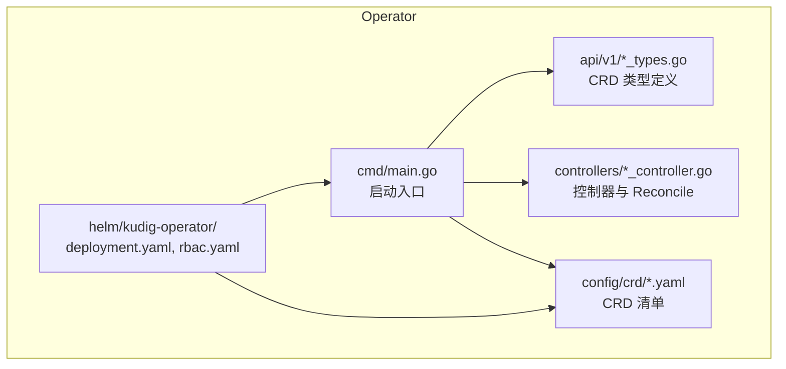
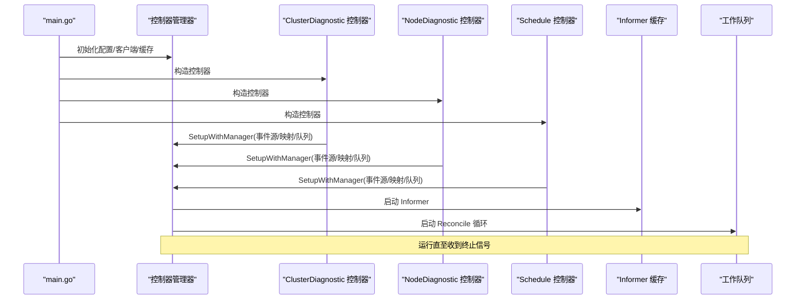
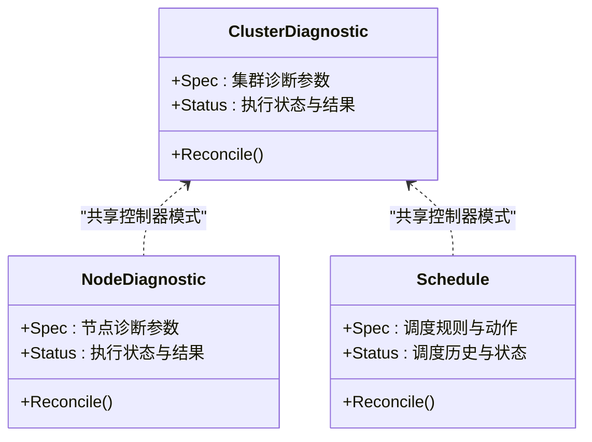
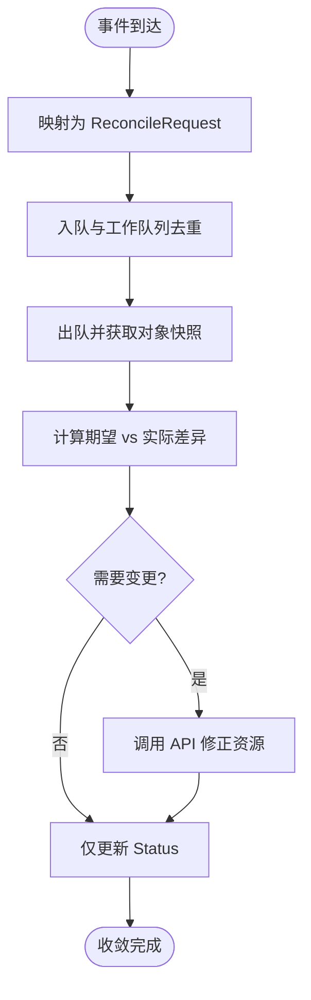
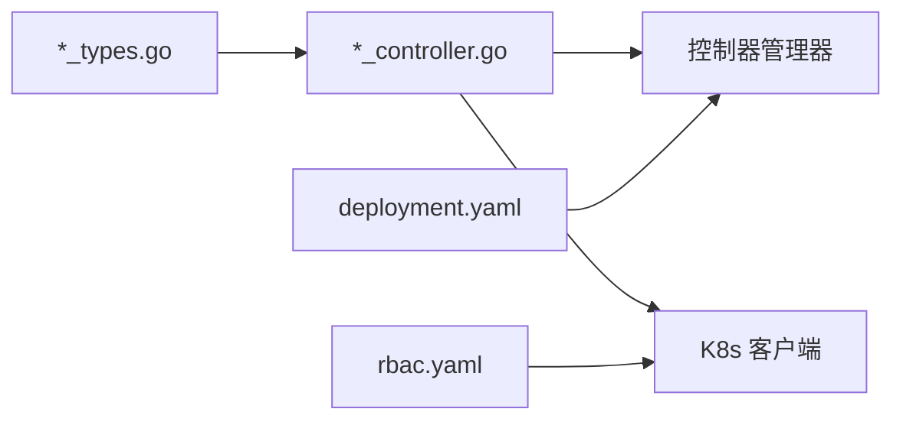

# Operator架构设计

<cite>
**本文引用的文件**   
- [operator/cmd/main.go](file://operator/cmd/main.go)
- [operator/controllers/clusterdiagnostic_controller.go](file://operator/controllers/clusterdiagnostic_controller.go)
- [operator/controllers/nodediagnostic_controller.go](file://operator/controllers/nodediagnostic_controller.go)
- [operator/controllers/schedule_controller.go](file://operator/controllers/schedule_controller.go)
- [operator/api/v1/clusterdiagnostic_types.go](file://operator/api/v1/clusterdiagnostic_types.go)
- [operator/api/v1/nodediagnostic_types.go](file://operator/api/v1/nodediagnostic_types.go)
- [operator/api/v1/schedule_types.go](file://operator/api/v1/schedule_types.go)
- [operator/api/v1/groupversion_info.go](file://operator/api/v1/groupversion_info.go)
- [operator/config/crd/...](file://operator/config/crd)
- [operator/helm/kudig-operator/templates/deployment.yaml](file://operator/helm/kudig-operator/templates/deployment.yaml)
- [operator/helm/kudig-operator/templates/rbac.yaml](file://operator/helm/kudig-operator/templates/rbac.yaml)
</cite>

## 目录
1. [简介](#简介)
2. [项目结构](#项目结构)
3. [核心组件](#核心组件)
4. [架构总览](#架构总览)
5. [详细组件分析](#详细组件分析)
6. [依赖关系分析](#依赖关系分析)
7. [性能考量](#性能考量)
8. [故障排查指南](#故障排查指南)
9. [结论](#结论)
10. [附录](#附录)

## 简介
本文件面向 Klaw Kubernetes Operator 的架构设计与实现，聚焦控制器管理器模式、Reconcile 循环机制与事件处理流程。文档覆盖主程序启动流程、控制器注册机制、资源监听器与缓存管理，并解释最终一致性保证、状态同步策略与错误处理机制。同时提供架构图与数据流图，帮助读者理解各组件间的交互关系。

## 项目结构
Operator 代码位于 operator 目录下，采用典型的 Kubebuilder 风格组织：
- api/v1：自定义资源类型定义（CRD 的 Go 类型）
- controllers：控制器实现，包含 Reconcile 逻辑
- config/crd：CRD YAML 清单
- helm/kudig-operator：Helm Chart，用于部署 Operator 及 RBAC、CRD
- cmd/main.go：Operator 入口，负责初始化控制器管理器、注册控制器、启动事件处理器



图表来源
- [operator/cmd/main.go](file://operator/cmd/main.go)
- [operator/api/v1/clusterdiagnostic_types.go](file://operator/api/v1/clusterdiagnostic_types.go)
- [operator/api/v1/nodediagnostic_types.go](file://operator/api/v1/nodediagnostic_types.go)
- [operator/api/v1/schedule_types.go](file://operator/api/v1/schedule_types.go)
- [operator/controllers/clusterdiagnostic_controller.go](file://operator/controllers/clusterdiagnostic_controller.go)
- [operator/controllers/nodediagnostic_controller.go](file://operator/controllers/nodediagnostic_controller.go)
- [operator/controllers/schedule_controller.go](file://operator/controllers/schedule_controller.go)
- [operator/helm/kudig-operator/templates/deployment.yaml](file://operator/helm/kudig-operator/templates/deployment.yaml)
- [operator/helm/kudig-operator/templates/rbac.yaml](file://operator/helm/kudig-operator/templates/rbac.yaml)

章节来源
- [operator/cmd/main.go](file://operator/cmd/main.go)
- [operator/api/v1/groupversion_info.go](file://operator/api/v1/groupversion_info.go)
- [operator/helm/kudig-operator/templates/deployment.yaml](file://operator/helm/kudig-operator/templates/deployment.yaml)
- [operator/helm/kudig-operator/templates/rbac.yaml](file://operator/helm/kudig-operator/templates/rbac.yaml)

## 核心组件
- 控制器管理器（Manager）：负责生命周期管理、配置注入、缓存与事件分发。
- 控制器（Controller）：每个 CRD 对应一个控制器，实现 Reconcile 方法，将期望状态驱动到集群实际状态。
- 资源类型（Types）：定义 CRD 的 Spec/Status 字段与行为契约。
- 事件源与缓存（Source & Cache）：通过 Informer 监听 API Server 变更，维护本地缓存，触发 Reconcile。
- 工作队列（WorkQueue）：对 Reconcile 请求进行去重与限流，保障最终一致性。

章节来源
- [operator/cmd/main.go](file://operator/cmd/main.go)
- [operator/controllers/clusterdiagnostic_controller.go](file://operator/controllers/clusterdiagnostic_controller.go)
- [operator/controllers/nodediagnostic_controller.go](file://operator/controllers/nodediagnostic_controller.go)
- [operator/controllers/schedule_controller.go](file://operator/controllers/schedule_controller.go)
- [operator/api/v1/clusterdiagnostic_types.go](file://operator/api/v1/clusterdiagnostic_types.go)
- [operator/api/v1/nodediagnostic_types.go](file://operator/api/v1/nodediagnostic_types.go)
- [operator/api/v1/schedule_types.go](file://operator/api/v1/schedule_types.go)

## 架构总览
下图展示了 Operator 的整体架构与控制面交互：

```mermaid
graph TB
APIServer["Kubernetes API Server"]
ETCD["etcd"]
subgraph "Operator Pod"
Manager["控制器管理器<br/>Manager"]
CtlCluster["ClusterDiagnostic 控制器"]
CtlNode["NodeDiagnostic 控制器"]
CtlSchedule["Schedule 控制器"]
Cache["Informer 缓存"]
Queue["工作队列 WorkQueue"]
end
subgraph "集群资源"
CRDs["CRD: ClusterDiagnostic / NodeDiagnostic / Schedule"]
Wkloads["工作负载/服务/存储等"]
end
APIServer <- --> ETCD
APIServer <--|Watch/GET/PUT| Manager
Manager --> Cache
Manager --> CtlCluster
Manager --> CtlNode
Manager --> CtlSchedule
CtlCluster --> Queue
CtlNode --> Queue
CtlSchedule --> Queue
CtlCluster --> Wkloads
CtlNode --> Wkloads
CtlSchedule --> Wkloads
```

图表来源
- [operator/cmd/main.go](file://operator/cmd/main.go)
- [operator/controllers/clusterdiagnostic_controller.go](file://operator/controllers/clusterdiagnostic_controller.go)
- [operator/controllers/nodediagnostic_controller.go](file://operator/controllers/nodediagnostic_controller.go)
- [operator/controllers/schedule_controller.go](file://operator/controllers/schedule_controller.go)

章节来源
- [operator/cmd/main.go](file://operator/cmd/main.go)
- [operator/helm/kudig-operator/templates/deployment.yaml](file://operator/helm/kudig-operator/templates/deployment.yaml)
- [operator/helm/kudig-operator/templates/rbac.yaml](file://operator/helm/kudig-operator/templates/rbac.yaml)

## 详细组件分析

### 启动流程与控制器注册
- 入口 main 初始化配置、日志、指标与信号处理。
- 创建控制器管理器 Manager，注入客户端、缓存、健康探针与 LeaderElection（可选）。
- 为每个 CRD 类型构建控制器实例，并调用 SetupWithManager 完成：
  - 注册事件源（OnAdd/OnUpdate/OnDelete）
  - 绑定映射函数（MapFunc），将事件转换为 ReconcileRequest
  - 注册到 Manager 的事件分发管线
- 启动 Manager，进入 Run 循环，等待事件并调度 Reconcile。



图表来源
- [operator/cmd/main.go](file://operator/cmd/main.go)
- [operator/controllers/clusterdiagnostic_controller.go](file://operator/controllers/clusterdiagnostic_controller.go)
- [operator/controllers/nodediagnostic_controller.go](file://operator/controllers/nodediagnostic_controller.go)
- [operator/controllers/schedule_controller.go](file://operator/controllers/schedule_controller.go)

章节来源
- [operator/cmd/main.go](file://operator/cmd/main.go)
- [operator/controllers/clusterdiagnostic_controller.go](file://operator/controllers/clusterdiagnostic_controller.go)
- [operator/controllers/nodediagnostic_controller.go](file://operator/controllers/nodediagnostic_controller.go)
- [operator/controllers/schedule_controller.go](file://operator/controllers/schedule_controller.go)

### 资源类型与 CRD 契约
- ClusterDiagnostic：描述集群级诊断任务或配置，包含 Spec（如目标、策略）与 Status（执行状态、结果摘要）。
- NodeDiagnostic：节点级诊断任务，Spec/Status 表达节点选择与诊断进度。
- Schedule：定时调度任务，Spec 包含调度表达式与动作，Status 记录最近执行时间与状态。



图表来源
- [operator/api/v1/clusterdiagnostic_types.go](file://operator/api/v1/clusterdiagnostic_types.go)
- [operator/api/v1/nodediagnostic_types.go](file://operator/api/v1/nodediagnostic_types.go)
- [operator/api/v1/schedule_types.go](file://operator/api/v1/schedule_types.go)

章节来源
- [operator/api/v1/clusterdiagnostic_types.go](file://operator/api/v1/clusterdiagnostic_types.go)
- [operator/api/v1/nodediagnostic_types.go](file://operator/api/v1/nodediagnostic_types.go)
- [operator/api/v1/schedule_types.go](file://operator/api/v1/schedule_types.go)

### Reconcile 循环与事件处理
- 事件来源：API Server 的 Watch 事件（新增、更新、删除）经 Informer 转为本地缓存对象。
- 映射阶段：根据对象元数据生成 ReconcileRequest（通常为名称+命名空间）。
- 入队与去重：工作队列对相同请求去重，避免风暴；支持速率限制与重试。
- 执行阶段：控制器从队列取出请求，读取缓存中的最新对象，计算差异，调用 K8s 客户端修正资源，更新 Status。
- 最终一致性：只要事件持续到达且无持久化错误，系统会收敛到期望状态。



图表来源
- [operator/controllers/clusterdiagnostic_controller.go](file://operator/controllers/clusterdiagnostic_controller.go)
- [operator/controllers/nodediagnostic_controller.go](file://operator/controllers/nodediagnostic_controller.go)
- [operator/controllers/schedule_controller.go](file://operator/controllers/schedule_controller.go)

章节来源
- [operator/controllers/clusterdiagnostic_controller.go](file://operator/controllers/clusterdiagnostic_controller.go)
- [operator/controllers/nodediagnostic_controller.go](file://operator/controllers/nodediagnostic_controller.go)
- [operator/controllers/schedule_controller.go](file://operator/controllers/schedule_controller.go)

### 控制器管理器与缓存管理
- 控制器管理器负责：
  - 初始化 REST 客户端与 Scheme
  - 创建 SharedInformerFactory，按资源类型建立缓存
  - 注册控制器与事件源，绑定映射函数
  - 启动健康检查与 Leader Election（多副本场景）
- 缓存管理：
  - Informer 维护对象的本地缓存，减少 API 压力
  - 通过索引与列表器加速查询
  - 事件回调中只传递增量变化，提升效率

章节来源
- [operator/cmd/main.go](file://operator/cmd/main.go)
- [operator/controllers/clusterdiagnostic_controller.go](file://operator/controllers/clusterdiagnostic_controller.go)
- [operator/controllers/nodediagnostic_controller.go](file://operator/controllers/nodediagnostic_controller.go)
- [operator/controllers/schedule_controller.go](file://operator/controllers/schedule_controller.go)

### 事件监听与映射策略
- 监听范围：可按命名空间或全局监听，依据控制器需求配置。
- 映射策略：
  - 直接映射：以对象自身作为键入队
  - 关联映射：根据 OwnerReference、标签或注解，将子资源事件映射到父资源控制器
- 过滤与批处理：可结合谓词函数过滤无关事件，降低无效 Reconcile。

章节来源
- [operator/controllers/clusterdiagnostic_controller.go](file://operator/controllers/clusterdiagnostic_controller.go)
- [operator/controllers/nodediagnostic_controller.go](file://operator/controllers/nodediagnostic_controller.go)
- [operator/controllers/schedule_controller.go](file://operator/controllers/schedule_controller.go)

### 最终一致性与状态同步策略
- 幂等性：Reconcile 必须幂等，确保多次执行不产生副作用。
- 乐观锁：使用 ResourceVersion 进行并发控制，避免覆盖他人修改。
- 状态回写：每次变更后更新 Status，便于外部观测与调试。
- 重试与退避：对瞬时错误采用指数退避重试，避免雪崩。
- 背压与限流：工作队列支持最大队列长度与速率限制，保护控制器稳定性。

章节来源
- [operator/controllers/clusterdiagnostic_controller.go](file://operator/controllers/clusterdiagnostic_controller.go)
- [operator/controllers/nodediagnostic_controller.go](file://operator/controllers/nodediagnostic_controller.go)
- [operator/controllers/schedule_controller.go](file://operator/controllers/schedule_controller.go)

### 错误处理与可观测性
- 错误分类：
  - 可恢复错误（网络抖动、限流）：返回错误，交由队列重试
  - 不可恢复错误（参数非法、权限不足）：记录事件与指标，不再重试
- 指标与日志：
  - 暴露 Reconcile 次数、耗时、错误率等指标
  - 结构化日志记录关键路径与异常堆栈
- 健康探针：
  - 就绪探针：确认 Informer 已同步
  - 存活探针：监控进程健康

章节来源
- [operator/cmd/main.go](file://operator/cmd/main.go)
- [operator/controllers/clusterdiagnostic_controller.go](file://operator/controllers/clusterdiagnostic_controller.go)
- [operator/controllers/nodediagnostic_controller.go](file://operator/controllers/nodediagnostic_controller.go)
- [operator/controllers/schedule_controller.go](file://operator/controllers/schedule_controller.go)

## 依赖关系分析
- 控制器与类型：
  - 每个控制器依赖对应的 *_types.go 定义，解析 Spec/Status
- 控制器与 Manager：
  - 通过 SetupWithManager 注册事件源与队列
- 控制器与 K8s 客户端：
  - 读写集群资源，应用期望状态
- Helm 部署：
  - deployment.yaml 定义 Pod、资源配置与探针
  - rbac.yaml 授予必要的权限（CRD、资源读/写）



图表来源
- [operator/api/v1/clusterdiagnostic_types.go](file://operator/api/v1/clusterdiagnostic_types.go)
- [operator/api/v1/nodediagnostic_types.go](file://operator/api/v1/nodediagnostic_types.go)
- [operator/api/v1/schedule_types.go](file://operator/api/v1/schedule_types.go)
- [operator/controllers/clusterdiagnostic_controller.go](file://operator/controllers/clusterdiagnostic_controller.go)
- [operator/controllers/nodediagnostic_controller.go](file://operator/controllers/nodediagnostic_controller.go)
- [operator/controllers/schedule_controller.go](file://operator/controllers/schedule_controller.go)
- [operator/helm/kudig-operator/templates/deployment.yaml](file://operator/helm/kudig-operator/templates/deployment.yaml)
- [operator/helm/kudig-operator/templates/rbac.yaml](file://operator/helm/kudig-operator/templates/rbac.yaml)

章节来源
- [operator/helm/kudig-operator/templates/deployment.yaml](file://operator/helm/kudig-operator/templates/deployment.yaml)
- [operator/helm/kudig-operator/templates/rbac.yaml](file://operator/helm/kudig-operator/templates/rbac.yaml)

## 性能考量
- 缓存优先：尽量使用 Informer 缓存而非直接 API 查询，降低延迟与压力。
- 精准映射：通过谓词与映射函数减少无效 Reconcile。
- 批量操作：合并多个小变更，减少 API 调用次数。
- 限流与退避：合理设置队列大小与重试间隔，避免过载。
- 水平扩展：启用 Leader Election 与多副本时注意幂等与分布式锁。

[本节为通用指导，不直接分析具体文件]

## 故障排查指南
- 常见问题
  - 控制器未生效：检查 RBAC 权限、CRD 是否安装、Informer 是否同步
  - Reconcile 频繁触发：检查映射函数是否过于宽泛，是否存在循环更新
  - 状态不一致：查看 Status 字段与事件日志，确认幂等性与乐观锁
  - 性能问题：观察指标（Reconcile 次数、耗时、错误率），调整队列与限流
- 定位手段
  - 查看控制器日志与事件
  - 检查 CRD 与资源对象状态
  - 使用 kubectl describe 与 get 命令验证资源
  - 通过 Prometheus/Grafana 观察指标

章节来源
- [operator/controllers/clusterdiagnostic_controller.go](file://operator/controllers/clusterdiagnostic_controller.go)
- [operator/controllers/nodediagnostic_controller.go](file://operator/controllers/nodediagnostic_controller.go)
- [operator/controllers/schedule_controller.go](file://operator/controllers/schedule_controller.go)

## 结论
Klaw Operator 遵循标准的控制器管理器模式，通过 Informer 缓存与事件驱动实现最终一致性。每个 CRD 对应独立控制器，职责清晰、耦合度低。通过工作队列、幂等 Reconcile 与乐观锁，系统在大规模事件下保持稳定与收敛。配合 Helm 部署与 RBAC 配置，易于在集群中规模化运行。

[本节为总结，不直接分析具体文件]

## 附录
- CRD 示例与清单：参见 operator/config/crd
- Helm Chart：参见 operator/helm/kudig-operator
- 类型定义：参见 operator/api/v1

[本节为补充信息，不直接分析具体文件]