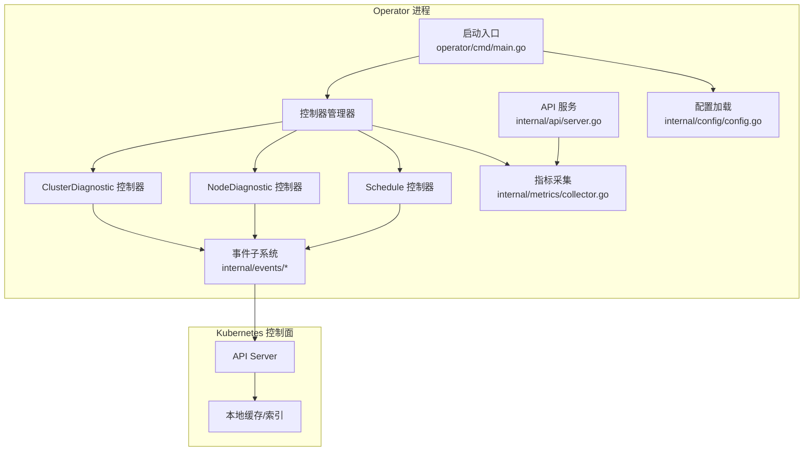
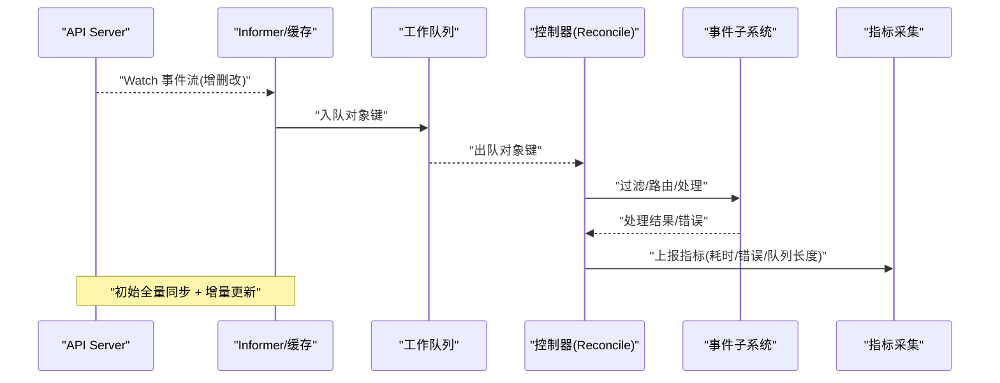
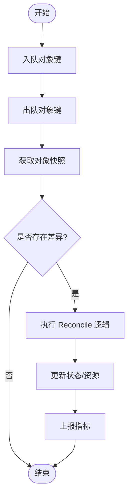
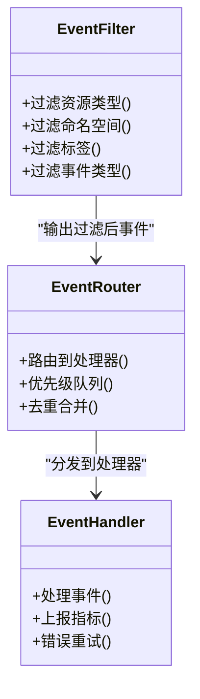
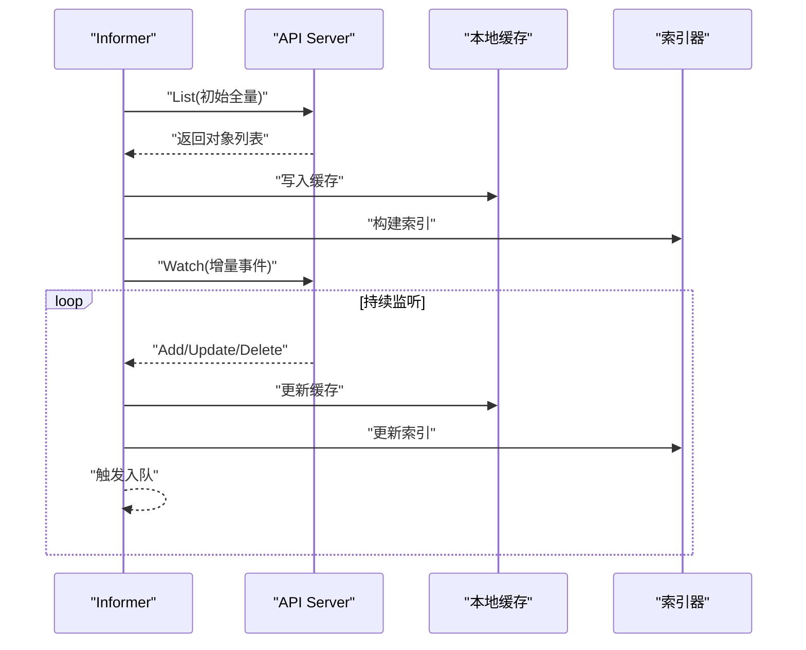
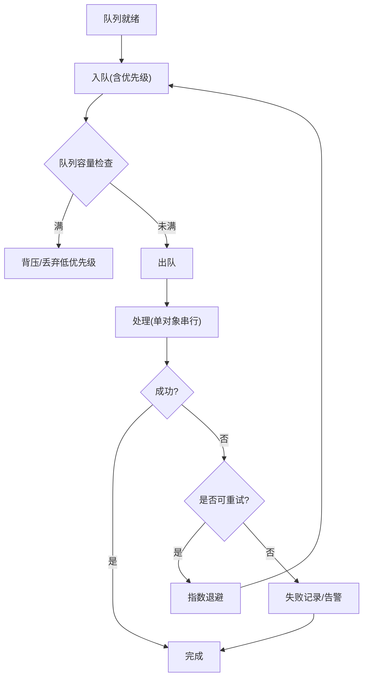
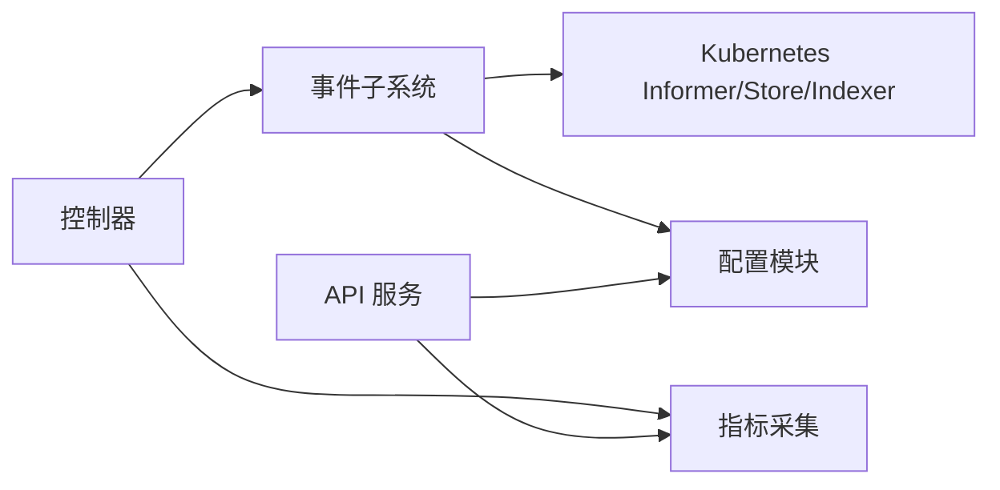

# 事件处理机制

<cite>
**本文引用的文件**   
- [operator/controllers/clusterdiagnostic_controller.go](file://operator/controllers/clusterdiagnostic_controller.go)
- [operator/controllers/nodediagnostic_controller.go](file://operator/controllers/nodediagnostic_controller.go)
- [operator/controllers/schedule_controller.go](file://operator/controllers/schedule_controller.go)
- [operator/cmd/main.go](file://operator/cmd/main.go)
- [internal/events/kubernetes.go](file://internal/events/kubernetes.go)
- [internal/events/notifier.go](file://internal/events/notifier.go)
- [internal/events/source.go](file://internal/events/source.go)
- [internal/metrics/collector.go](file://internal/metrics/collector.go)
- [internal/api/server.go](file://internal/api/server.go)
- [internal/config/config.go](file://internal/config/config.go)
</cite>

## 目录
1. [简介](#简介)
2. [项目结构](#项目结构)
3. [核心组件](#核心组件)
4. [架构总览](#架构总览)
5. [详细组件分析](#详细组件分析)
6. [依赖关系分析](#依赖关系分析)
7. [性能考量](#性能考量)
8. [故障排查指南](#故障排查指南)
9. [结论](#结论)
10. [附录](#附录)

## 简介
本文件面向 Klaw Operator 的事件处理机制，系统性说明控制器如何监听 Kubernetes 资源事件、进行过滤与路由、管理事件队列与并发处理、实现 Watch 机制与缓存同步、以及增量更新策略。同时提供事件调试工具、监控指标与故障排查方法，并给出实际事件流示例与性能调优建议，帮助读者快速理解与优化 Klaw Operator 的事件驱动能力。

## 项目结构
Klaw Operator 的事件处理相关代码主要分布在以下位置：
- operator/controllers：定义各自定义资源的控制器（如 ClusterDiagnostic、NodeDiagnostic、Schedule），负责声明式事件循环与 Reconcile 逻辑。
- operator/cmd/main.go：Operator 启动入口，初始化控制器管理器、注册控制器、配置 RBAC 与指标导出等。
- internal/events：封装 Kubernetes 事件源、通知器与通用事件处理流程。
- internal/metrics：采集与暴露 Prometheus 指标，用于观测事件处理吞吐、延迟与错误率。
- internal/api：对外暴露诊断与运维接口，可用于事件调试与状态查询。
- internal/config：加载与解析运行期配置，影响事件处理行为（如并发度、重试策略）。

图表来源
- [operator/cmd/main.go](file://operator/cmd/main.go)
- [operator/controllers/clusterdiagnostic_controller.go](file://operator/controllers/clusterdiagnostic_controller.go)
- [operator/controllers/nodediagnostic_controller.go](file://operator/controllers/nodediagnostic_controller.go)
- [operator/controllers/schedule_controller.go](file://operator/controllers/schedule_controller.go)
- [internal/events/kubernetes.go](file://internal/events/kubernetes.go)
- [internal/metrics/collector.go](file://internal/metrics/collector.go)
- [internal/api/server.go](file://internal/api/server.go)
- [internal/config/config.go](file://internal/config/config.go)

章节来源
- [operator/cmd/main.go](file://operator/cmd/main.go)
- [operator/controllers/clusterdiagnostic_controller.go](file://operator/controllers/clusterdiagnostic_controller.go)
- [operator/controllers/nodediagnostic_controller.go](file://operator/controllers/nodediagnostic_controller.go)
- [operator/controllers/schedule_controller.go](file://operator/controllers/schedule_controller.go)
- [internal/events/kubernetes.go](file://internal/events/kubernetes.go)
- [internal/events/notifier.go](file://internal/events/notifier.go)
- [internal/events/source.go](file://internal/events/source.go)
- [internal/metrics/collector.go](file://internal/metrics/collector.go)
- [internal/api/server.go](file://internal/api/server.go)
- [internal/config/config.go](file://internal/config/config.go)

## 核心组件
- 控制器管理器与控制器
  - 控制器管理器负责生命周期管理与工作队列调度；每个控制器通过 Informer 监听特定 CRD 或内置资源变更，触发 Reconcile。
  - 典型控制器包括 ClusterDiagnostic、NodeDiagnostic、Schedule，分别对应集群级、节点级与调度任务类资源。
- 事件子系统
  - 封装 Kubernetes 事件源、过滤器与分发器，支持按命名空间、标签、资源类型进行过滤，将事件路由到对应的处理器。
  - 提供通知器抽象，便于对接外部告警通道。
- 指标与可观测性
  - 采集事件入队速率、Reconcile 耗时、错误计数、队列长度等关键指标，暴露给 Prometheus。
- API 与配置
  - 提供诊断与调试接口，辅助定位事件处理问题；配置项控制并发度、重试策略、限流参数等。

章节来源
- [operator/controllers/clusterdiagnostic_controller.go](file://operator/controllers/clusterdiagnostic_controller.go)
- [operator/controllers/nodediagnostic_controller.go](file://operator/controllers/nodediagnostic_controller.go)
- [operator/controllers/schedule_controller.go](file://operator/controllers/schedule_controller.go)
- [internal/events/kubernetes.go](file://internal/events/kubernetes.go)
- [internal/events/notifier.go](file://internal/events/notifier.go)
- [internal/events/source.go](file://internal/events/source.go)
- [internal/metrics/collector.go](file://internal/metrics/collector.go)
- [internal/api/server.go](file://internal/api/server.go)
- [internal/config/config.go](file://internal/config/config.go)

## 架构总览
下图展示从 Kubernetes API Server 到控制器 Reconcile 的端到端事件流，包括 Watch、缓存同步、事件过滤、路由与处理。

图表来源
- [operator/cmd/main.go](file://operator/cmd/main.go)
- [operator/controllers/clusterdiagnostic_controller.go](file://operator/controllers/clusterdiagnostic_controller.go)
- [internal/events/kubernetes.go](file://internal/events/kubernetes.go)
- [internal/metrics/collector.go](file://internal/metrics/collector.go)

## 详细组件分析

### 控制器与 Reconcile 循环
- 控制器职责
  - 监听目标资源事件，维护期望状态与实际状态的差异，执行必要的业务动作。
  - 使用工作队列保证幂等与重试，避免重复处理与丢失。
- Reconcile 流程要点
  - 从队列取出对象键，获取最新对象快照，计算差异，调用业务逻辑更新状态。
  - 对失败场景采用指数退避或固定间隔重试，结合条件判断避免风暴。
- 并发与限流
  - 控制器通常以单 goroutine 串行处理同一对象的多次变更，确保顺序性。
  - 不同对象间可并行处理，受全局 worker 数量限制。

图表来源
- [operator/controllers/clusterdiagnostic_controller.go](file://operator/controllers/clusterdiagnostic_controller.go)
- [operator/controllers/nodediagnostic_controller.go](file://operator/controllers/nodediagnostic_controller.go)
- [operator/controllers/schedule_controller.go](file://operator/controllers/schedule_controller.go)

章节来源
- [operator/controllers/clusterdiagnostic_controller.go](file://operator/controllers/clusterdiagnostic_controller.go)
- [operator/controllers/nodediagnostic_controller.go](file://operator/controllers/nodediagnostic_controller.go)
- [operator/controllers/schedule_controller.go](file://operator/controllers/schedule_controller.go)

### 事件过滤与路由机制
- 过滤维度
  - 按资源类型、命名空间、标签选择器、注解、事件类型（Add/Update/Delete）进行筛选。
- 路由策略
  - 根据资源元数据与业务规则，将事件分发到对应处理器或子流程。
  - 支持多路复用与优先级队列，保障关键事件优先处理。
- 去重与合并
  - 对短时间内同一对象的多次变更进行合并，降低抖动与无效处理。

图表来源
- [internal/events/kubernetes.go](file://internal/events/kubernetes.go)
- [internal/events/source.go](file://internal/events/source.go)
- [internal/events/notifier.go](file://internal/events/notifier.go)

章节来源
- [internal/events/kubernetes.go](file://internal/events/kubernetes.go)
- [internal/events/source.go](file://internal/events/source.go)
- [internal/events/notifier.go](file://internal/events/notifier.go)

### Watch 机制、缓存同步与增量更新
- Watch 工作原理
  - Informer 建立长连接至 API Server，接收资源变更事件流。
  - 首次全量同步构建本地缓存，后续仅接收增量事件。
- 缓存与索引
  - 使用 Store 维护对象快照，Indexer 提供基于字段的高效查询。
- 增量更新
  - 针对 Update 事件，比较旧值与新值，仅处理必要字段变化。
  - 支持选择性字段监听，减少不必要 Reconcile。

图表来源
- [internal/events/kubernetes.go](file://internal/events/kubernetes.go)
- [internal/events/source.go](file://internal/events/source.go)

章节来源
- [internal/events/kubernetes.go](file://internal/events/kubernetes.go)
- [internal/events/source.go](file://internal/events/source.go)

### 事件队列管理、并发处理与错误重试
- 队列模型
  - 使用带优先级的队列，支持紧急事件优先处理。
  - 队列长度与背压策略保护系统稳定性。
- 并发模型
  - 每个对象独立 goroutine 串行处理，避免竞态。
  - 全局 worker 池限制并发度，防止过载。
- 重试策略
  - 指数退避 + 最大重试次数，避免雪崩。
  - 区分可恢复与不可恢复错误，及时失败与告警。

图表来源
- [internal/events/kubernetes.go](file://internal/events/kubernetes.go)
- [internal/config/config.go](file://internal/config/config.go)

章节来源
- [internal/events/kubernetes.go](file://internal/events/kubernetes.go)
- [internal/config/config.go](file://internal/config/config.go)

### 指标采集与监控
- 关键指标
  - 事件入队速率、Reconcile 耗时分布、错误计数、队列长度、重试次数。
- 采集方式
  - 在关键路径埋点，统一上报至 Prometheus 暴露端点。
- 可视化与告警
  - 基于指标创建仪表盘与阈值告警，及时发现异常。

章节来源
- [internal/metrics/collector.go](file://internal/metrics/collector.go)
- [internal/api/server.go](file://internal/api/server.go)

### 事件调试工具与 API
- 调试接口
  - 提供查询当前队列状态、最近事件、错误日志的接口。
- 动态调整
  - 支持运行时调整并发度、重试策略等参数，便于压测与调优。
- 日志与追踪
  - 结构化日志与请求追踪，便于定位问题根因。

章节来源
- [internal/api/server.go](file://internal/api/server.go)
- [internal/config/config.go](file://internal/config/config.go)

## 依赖关系分析
- 控制器依赖事件子系统与指标采集模块。
- 事件子系统依赖 Kubernetes Informer/Store/Indexer 与配置模块。
- API 服务依赖指标与配置模块，提供可观测性与动态调参能力。

图表来源
- [operator/controllers/clusterdiagnostic_controller.go](file://operator/controllers/clusterdiagnostic_controller.go)
- [internal/events/kubernetes.go](file://internal/events/kubernetes.go)
- [internal/metrics/collector.go](file://internal/metrics/collector.go)
- [internal/api/server.go](file://internal/api/server.go)
- [internal/config/config.go](file://internal/config/config.go)

章节来源
- [operator/controllers/clusterdiagnostic_controller.go](file://operator/controllers/clusterdiagnostic_controller.go)
- [internal/events/kubernetes.go](file://internal/events/kubernetes.go)
- [internal/metrics/collector.go](file://internal/metrics/collector.go)
- [internal/api/server.go](file://internal/api/server.go)
- [internal/config/config.go](file://internal/config/config.go)

## 性能考量
- 合理设置控制器并发度与队列大小，避免内存与 CPU 峰值过高。
- 使用选择性字段监听与合并策略，减少不必要的 Reconcile。
- 对慢操作引入超时与熔断，防止级联失败。
- 利用指标与日志进行容量规划与瓶颈定位。

[本节为通用指导，不直接分析具体文件]

## 故障排查指南
- 常见问题
  - 事件未入队：检查 Informer 连接与 RBAC 权限。
  - Reconcile 频繁重试：确认错误类型与重试策略，避免死循环。
  - 队列积压：评估并发度与处理能力，必要时扩容。
- 排查步骤
  - 查看指标：入队速率、队列长度、错误计数。
  - 检查日志：定位错误堆栈与上下文。
  - 使用调试接口：获取队列状态与最近事件详情。
  - 复现场景：构造最小化用例验证修复效果。

章节来源
- [internal/metrics/collector.go](file://internal/metrics/collector.go)
- [internal/api/server.go](file://internal/api/server.go)
- [internal/config/config.go](file://internal/config/config.go)

## 结论
Klaw Operator 的事件处理机制以控制器为核心，结合 Informer 的 Watch 与缓存同步、事件过滤与路由、队列与并发控制、重试与指标采集，形成稳定高效的事件驱动架构。通过合理的配置与监控，可实现高吞吐、低延迟与强鲁棒性的事件处理能力。

[本节为总结性内容，不直接分析具体文件]

## 附录
- 术语表
  - Informer：Kubernetes 客户端库提供的资源监听与缓存组件。
  - Reconcile：控制器中用于收敛期望状态与实际状态的函数。
  - 背压：当消费者处理不及生产者时，限制入队速率的策略。
- 参考链接
  - Kubernetes Informer 文档
  - Prometheus 指标最佳实践

[本节为补充信息，不直接分析具体文件]