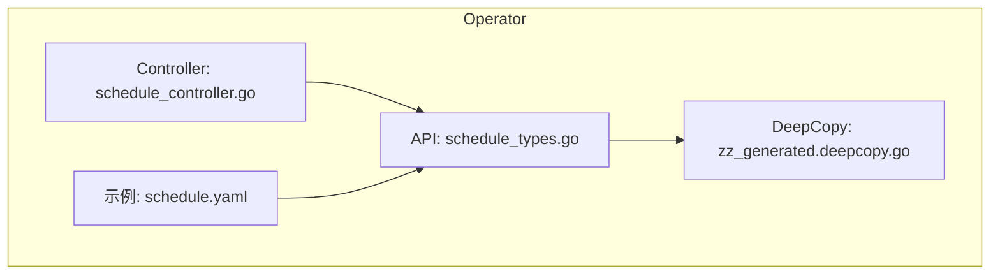
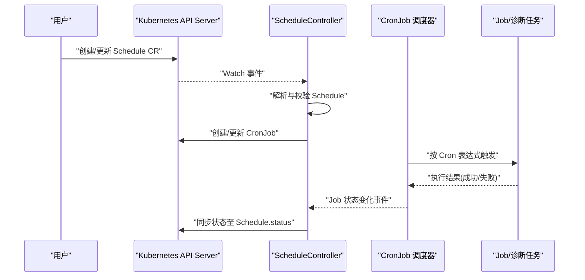
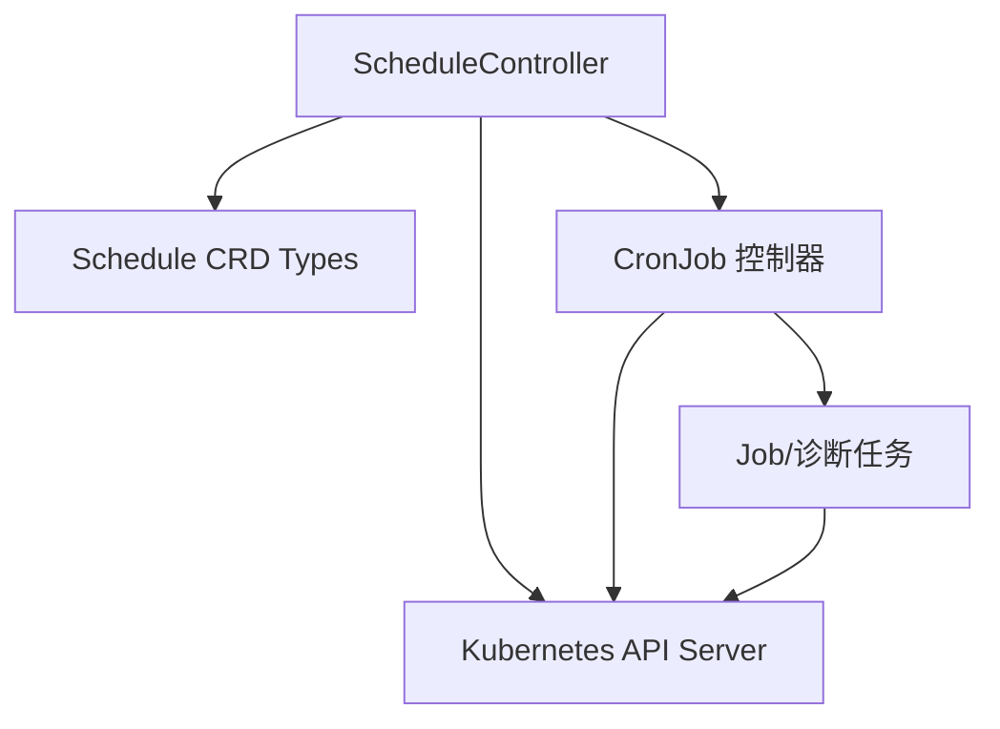

# 定时任务控制器

<cite>
**本文引用的文件**   
- [schedule_controller.go](file://operator/controllers/schedule_controller.go)
- [schedule_types.go](file://operator/api/v1/schedule_types.go)
- [zz_generated.deepcopy.go](file://operator/api/v1/zz_generated.deepcopy.go)
- [schedule.yaml](file://operator/config/examples/schedule.yaml)
</cite>

## 目录
1. [简介](#简介)
2. [项目结构](#项目结构)
3. [核心组件](#核心组件)
4. [架构总览](#架构总览)
5. [详细组件分析](#详细组件分析)
6. [依赖关系分析](#依赖关系分析)
7. [性能考虑](#性能考虑)
8. [故障排查指南](#故障排查指南)
9. [结论](#结论)
10. [附录](#附录)

## 简介
本文件为 ScheduleController（定时任务控制器）的权威技术文档。内容覆盖 CronJob 调度器工作原理、任务队列与并发控制、Schedule CRD 配置解析与校验、诊断任务执行流程、任务依赖处理、失败重试机制、执行日志记录与状态同步，以及配置示例、调度策略调优与监控告警设置方法。读者可据此理解并扩展 Klaw Operator 中的定时任务能力。

## 项目结构
与 ScheduleController 相关的代码主要位于 operator 子模块中：
- API 类型定义：operator/api/v1/schedule_types.go
- 控制器实现：operator/controllers/schedule_controller.go
- 自动生成深拷贝：operator/api/v1/zz_generated.deepcopy.go
- 示例 CR 配置：operator/config/examples/schedule.yaml

图表来源
- [schedule_types.go](file://operator/api/v1/schedule_types.go)
- [schedule_controller.go](file://operator/controllers/schedule_controller.go)
- [zz_generated.deepcopy.go](file://operator/api/v1/zz_generated.deepcopy.go)
- [schedule.yaml](file://operator/config/examples/schedule.yaml)

章节来源
- [schedule_controller.go](file://operator/controllers/schedule_controller.go)
- [schedule_types.go](file://operator/api/v1/schedule_types.go)
- [zz_generated.deepcopy.go](file://operator/api/v1/zz_generated.deepcopy.go)
- [schedule.yaml](file://operator/config/examples/schedule.yaml)

## 核心组件
- Schedule CRD 类型：描述定时任务的声明式配置，包括调度表达式、任务类型、依赖关系、重试策略、并发限制等。
- ScheduleController：Kubernetes 控制器，监听 Schedule 资源变更，协调创建/更新 CronJob，维护运行状态与事件。
- CronJob 调度器：由 Kubernetes 内置调度器驱动，按 Cron 表达式触发 Job，进而执行具体诊断任务。
- 任务队列与并发控制：通过 CronJob 的 concurrencyPolicy、successfulJobsHistoryLimit、failedJobsHistoryLimit 等字段控制并发与历史清理。
- 状态同步：控制器将 CronJob/Job 的运行状态同步回 Schedule 资源的 status 字段，便于观测与告警。

章节来源
- [schedule_types.go](file://operator/api/v1/schedule_types.go)
- [schedule_controller.go](file://operator/controllers/schedule_controller.go)

## 架构总览
下图展示了从用户提交 Schedule CR 到任务执行的端到端流程，以及控制器如何协调各组件。

图表来源
- [schedule_controller.go](file://operator/controllers/schedule_controller.go)
- [schedule_types.go](file://operator/api/v1/schedule_types.go)

## 详细组件分析

### Schedule CRD 类型与数据模型
- 关键字段说明（概念性描述）
  - 调度表达式：用于定义 CronJob 的调度时间规则。
  - 任务类型：指定要执行的诊断任务类别或插件。
  - 依赖关系：支持任务间的顺序或条件依赖，确保执行顺序正确。
  - 重试策略：定义失败时的重试次数、退避策略与超时。
  - 并发控制：允许/禁止并发执行，限制最大并发数。
  - 资源限制：CPU/内存配额，避免影响集群稳定性。
  - 通知与报告：输出格式、上报目标（如 Grafana、HTML、JSON）。
- 数据结构与复杂度
  - 对象序列化/反序列化使用 Kubernetes 客户端库，时间复杂度与字段数量线性相关。
  - 深拷贝由 zz_generated.deepcopy.go 生成，保证控制器在 Reconcile 过程中的安全操作。

章节来源
- [schedule_types.go](file://operator/api/v1/schedule_types.go)
- [zz_generated.deepcopy.go](file://operator/api/v1/zz_generated.deepcopy.go)

### ScheduleController 控制器实现要点
- 事件监听与 Reconcile
  - 监听 Schedule 资源增删改事件，进入 Reconcile 流程。
  - 解析并校验 Schedule 配置，必要时返回错误并等待下次事件。
- CronJob 协调
  - 根据 Schedule 配置生成或更新 CronJob 对象。
  - 管理 CronJob 的调度策略、并发策略与历史记录限制。
- 状态同步
  - 读取 CronJob/Job 的运行状态，计算整体进度与结果。
  - 将状态写回 Schedule.status，供上层 UI/告警消费。
- 错误处理与重试
  - 对不可恢复错误立即返回；对可重试错误采用指数退避或固定间隔重试。
  - 记录关键事件与日志，便于问题定位。

章节来源
- [schedule_controller.go](file://operator/controllers/schedule_controller.go)

### CronJob 调度器工作原理
- 调度周期
  - CronJob 控制器周期性扫描所有 CronJob，计算下一次触发时间。
  - 到达触发时间后创建 Job，由 kube-scheduler 调度到节点执行。
- 并发与历史
  - concurrencyPolicy 控制是否允许并发执行。
  - successfulJobsHistoryLimit/failedJobsHistoryLimit 控制保留的历史 Job 数量。
- 执行生命周期
  - Job 启动 Pod，Pod 执行诊断任务，完成后返回退出码与日志。
  - CronJob 控制器汇总状态并更新 CronJob 状态。

章节来源
- [schedule_controller.go](file://operator/controllers/schedule_controller.go)
- [schedule_types.go](file://operator/api/v1/schedule_types.go)

### 任务队列管理与并发控制策略
- 队列设计
  - 每个 Schedule 对应一个逻辑队列，避免跨任务竞争。
  - 同一 Schedule 内可通过并发策略限制并行度。
- 并发控制
  - 通过 CronJob 的 concurrencyPolicy 与 maxConcurrentJobs 控制。
  - 对于高负载场景，建议降低并发并增加资源限制。
- 背压与限流
  - 当系统过载时，控制器应延迟入队或拒绝新任务，保护集群稳定。

章节来源
- [schedule_controller.go](file://operator/controllers/schedule_controller.go)
- [schedule_types.go](file://operator/api/v1/schedule_types.go)

### 依赖关系处理
- 依赖建模
  - 支持基于任务 ID 或名称的依赖声明。
  - 依赖图构建后进行拓扑排序，确保执行顺序。
- 执行策略
  - 前置任务成功后才触发后续任务。
  - 支持条件依赖（如仅在前置任务成功且满足特定条件时继续）。
- 失败传播
  - 前置任务失败可阻断后续任务，或按策略降级执行。

章节来源
- [schedule_types.go](file://operator/api/v1/schedule_types.go)
- [schedule_controller.go](file://operator/controllers/schedule_controller.go)

### 失败重试机制
- 重试策略
  - 可配置最大重试次数、初始间隔、最大间隔与退避系数。
  - 支持按错误类型差异化重试（网络错误 vs 业务错误）。
- 幂等性与去重
  - 任务需具备幂等性，避免重复执行导致副作用。
  - 使用唯一键或分布式锁防止重复执行。
- 补偿与回滚
  - 对部分失败的步骤提供补偿逻辑，确保最终一致性。

章节来源
- [schedule_types.go](file://operator/api/v1/schedule_types.go)
- [schedule_controller.go](file://operator/controllers/schedule_controller.go)

### 执行日志记录与状态同步
- 日志记录
  - 统一采集任务标准输出与错误输出。
  - 结构化日志包含任务 ID、阶段、耗时、错误码等。
- 状态同步
  - 控制器定期拉取 CronJob/Job 状态，计算整体进度。
  - 将状态写入 Schedule.status，包括最近执行时间、结果、错误信息等。
- 审计与追踪
  - 关键操作写入审计日志，支持链路追踪与回溯。

章节来源
- [schedule_controller.go](file://operator/controllers/schedule_controller.go)
- [schedule_types.go](file://operator/api/v1/schedule_types.go)

### 配置示例与最佳实践
- 示例位置
  - 参考 operator/config/examples/schedule.yaml 中的示例配置。
- 最佳实践
  - 合理设置 Cron 表达式，避免高峰时段集中触发。
  - 为长耗时任务设置合理的超时与重试策略。
  - 使用命名空间隔离不同环境的任务。
  - 开启必要的指标与日志采集，便于监控与告警。

章节来源
- [schedule.yaml](file://operator/config/examples/schedule.yaml)

## 依赖关系分析
ScheduleController 与 Kubernetes 核心组件及内部模块的依赖关系如下：

图表来源
- [schedule_controller.go](file://operator/controllers/schedule_controller.go)
- [schedule_types.go](file://operator/api/v1/schedule_types.go)

章节来源
- [schedule_controller.go](file://operator/controllers/schedule_controller.go)
- [schedule_types.go](file://operator/api/v1/schedule_types.go)

## 性能考虑
- 调度频率
  - 调整控制器 Reconcile 周期，避免频繁轮询。
- 并发与资源
  - 合理设置 CronJob 并发与资源限制，防止资源争用。
- 缓存与索引
  - 使用 informer 缓存减少 API 调用压力。
- 批处理与合并
  - 批量处理状态更新，减少写放大。
- 监控与告警
  - 暴露关键指标（调度延迟、失败率、队列长度），设置阈值告警。

[本节为通用指导，不直接分析具体文件]

## 故障排查指南
- 常见问题
  - Cron 表达式无效：检查语法与时区设置。
  - 任务未触发：确认 CronJob 已创建且处于 Active 状态。
  - 执行失败：查看 Job Pod 日志与事件，定位错误原因。
  - 状态不同步：检查控制器权限与 API Server 连通性。
- 排查步骤
  - 查看 Schedule 资源状态与事件。
  - 检查 CronJob/Job 状态与 Pod 日志。
  - 验证控制器日志与指标。
  - 逐步缩小范围，复现问题并修复。

章节来源
- [schedule_controller.go](file://operator/controllers/schedule_controller.go)
- [schedule_types.go](file://operator/api/v1/schedule_types.go)

## 结论
ScheduleController 通过声明式的 Schedule CRD 与 Kubernetes CronJob 能力，实现了可靠的定时任务编排。其核心在于清晰的配置模型、健壮的并发与重试策略、完善的日志与状态同步机制。结合合理的调度策略与监控告警，可在大规模集群中稳定运行各类诊断任务。

[本节为总结性内容，不直接分析具体文件]

## 附录
- 术语表
  - Schedule：定时任务的声明式配置。
  - CronJob：Kubernetes 中按 Cron 表达式触发的作业。
  - Job：一次具体的任务执行实例。
  - Reconcile：控制器循环 reconcile 期望状态与实际状态的流程。
- 参考链接
  - 示例配置：operator/config/examples/schedule.yaml
  - API 类型：operator/api/v1/schedule_types.go
  - 控制器实现：operator/controllers/schedule_controller.go

[本节为补充信息，不直接分析具体文件]