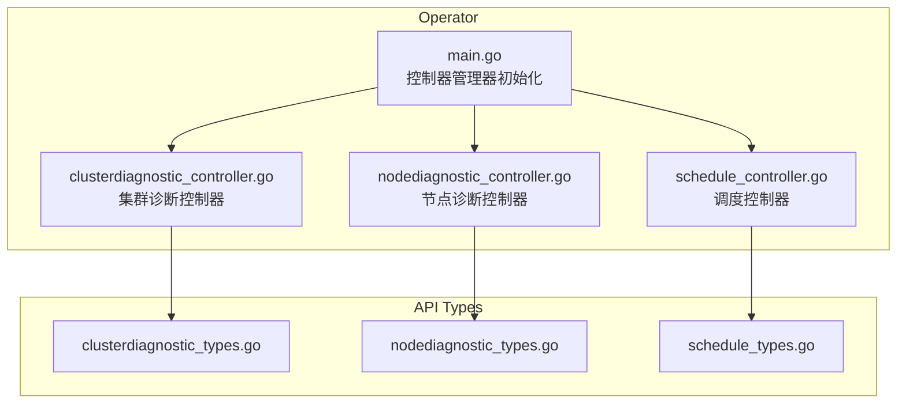
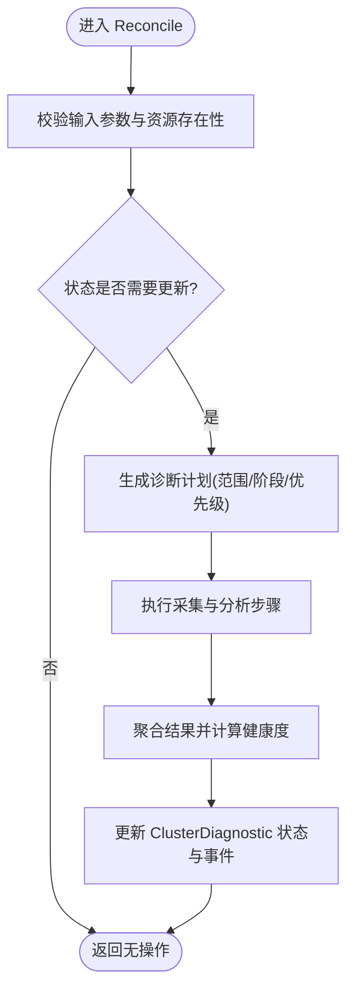
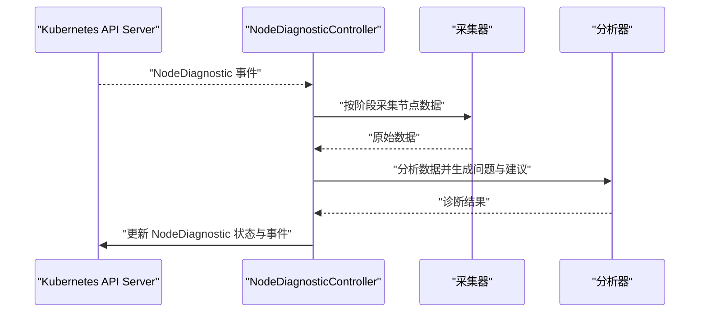
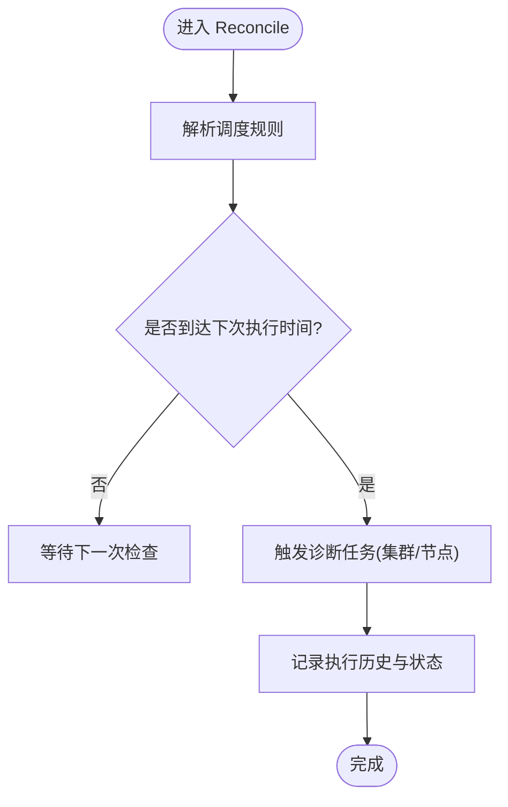
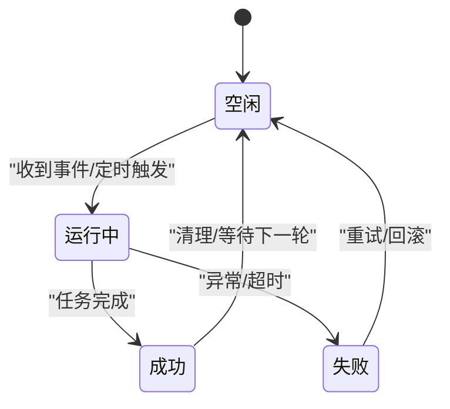
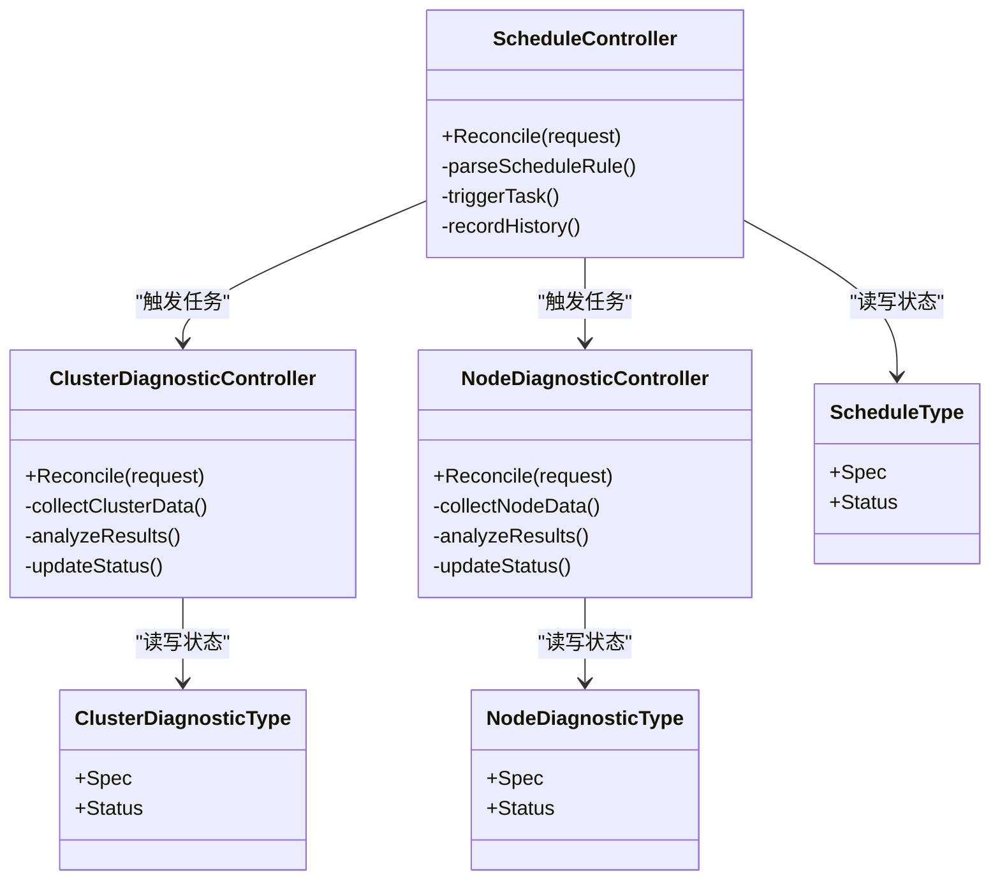

# 控制器实现

<cite>
**本文引用的文件**   
- [operator/controllers/clusterdiagnostic_controller.go](file://operator/controllers/clusterdiagnostic_controller.go)
- [operator/controllers/nodediagnostic_controller.go](file://operator/controllers/nodediagnostic_controller.go)
- [operator/controllers/schedule_controller.go](file://operator/controllers/schedule_controller.go)
- [operator/api/v1/clusterdiagnostic_types.go](file://operator/api/v1/clusterdiagnostic_types.go)
- [operator/api/v1/nodediagnostic_types.go](file://operator/api/v1/nodediagnostic_types.go)
- [operator/api/v1/schedule_types.go](file://operator/api/v1/schedule_types.go)
- [operator/cmd/main.go](file://operator/cmd/main.go)
</cite>

## 目录
1. [简介](#简介)
2. [项目结构](#项目结构)
3. [核心组件](#核心组件)
4. [架构总览](#架构总览)
5. [详细组件分析](#详细组件分析)
6. [依赖关系分析](#依赖关系分析)
7. [性能考量](#性能考量)
8. [故障排查指南](#故障排查指南)
9. [结论](#结论)
10. [附录](#附录)

## 简介
本文件面向 Klaw Operator 的控制器实现，聚焦以下三个控制器的 Reconcile 逻辑、事件处理机制与资源同步策略：
- ClusterDiagnosticController：集群级诊断任务编排与状态同步
- NodeDiagnosticController：节点级诊断任务编排与状态同步
- ScheduleController：基于调度规则的周期性或条件性任务触发

文档将解释控制器如何监听 Kubernetes API 变更、执行业务逻辑并更新资源状态，同时提供调试方法、日志分析与性能优化建议。

## 项目结构
Klaw Operator 的控制器位于 operator/controllers 目录，对应的自定义资源类型定义在 operator/api/v1 目录，控制器启动入口在 operator/cmd/main.go。



图表来源
- [operator/cmd/main.go](file://operator/cmd/main.go)
- [operator/controllers/clusterdiagnostic_controller.go](file://operator/controllers/clusterdiagnostic_controller.go)
- [operator/controllers/nodediagnostic_controller.go](file://operator/controllers/nodediagnostic_controller.go)
- [operator/controllers/schedule_controller.go](file://operator/controllers/schedule_controller.go)
- [operator/api/v1/clusterdiagnostic_types.go](file://operator/api/v1/clusterdiagnostic_types.go)
- [operator/api/v1/nodediagnostic_types.go](file://operator/api/v1/nodediagnostic_types.go)
- [operator/api/v1/schedule_types.go](file://operator/api/v1/schedule_types.go)

章节来源
- [operator/cmd/main.go](file://operator/cmd/main.go)
- [operator/controllers/clusterdiagnostic_controller.go](file://operator/controllers/clusterdiagnostic_controller.go)
- [operator/controllers/nodediagnostic_controller.go](file://operator/controllers/nodediagnostic_controller.go)
- [operator/controllers/schedule_controller.go](file://operator/controllers/schedule_controller.go)
- [operator/api/v1/clusterdiagnostic_types.go](file://operator/api/v1/clusterdiagnostic_types.go)
- [operator/api/v1/nodediagnostic_types.go](file://operator/api/v1/nodediagnostic_types.go)
- [operator/api/v1/schedule_types.go](file://operator/api/v1/schedule_types.go)

## 核心组件
- ClusterDiagnosticController：负责集群级诊断资源的 Reconcile，包括创建/管理诊断任务、收集与分析结果、更新状态与事件通知。
- NodeDiagnosticController：负责节点级诊断资源的 Reconcile，针对单个节点执行诊断流程，聚合结果并维护状态。
- ScheduleController：根据调度规则（如 Cron 表达式或事件驱动）触发诊断任务，协调多个控制器的工作节奏。

这些控制器通过 Kubernetes Informers 监听 CRD 对象变化，调用各自的 Reconcile 函数执行业务逻辑，并通过 Client 更新资源状态。

章节来源
- [operator/controllers/clusterdiagnostic_controller.go](file://operator/controllers/clusterdiagnostic_controller.go)
- [operator/controllers/nodediagnostic_controller.go](file://operator/controllers/nodediagnostic_controller.go)
- [operator/controllers/schedule_controller.go](file://operator/controllers/schedule_controller.go)

## 架构总览
下图展示了控制器与 API Server、自定义资源以及内部业务模块之间的交互关系。

```mermaid
sequenceDiagram
participant APIServer as "Kubernetes API Server"
participant Manager as "控制器管理器"
participant ClusterCtl as "ClusterDiagnosticController"
participant NodeCtl as "NodeDiagnosticController"
participant ScheduleCtl as "ScheduleController"
APIServer-->>Manager : "CRD 事件(增删改)"
Manager->>ClusterCtl : "Reconcile(ClusterDiagnostic)"
Manager->>NodeCtl : "Reconcile(NodeDiagnostic)"
Manager->>ScheduleCtl : "Reconcile(Schedule)"
ClusterCtl->>APIServer : "读取/更新 ClusterDiagnostic 状态"
NodeCtl->>APIServer : "读取/更新 NodeDiagnostic 状态"
ScheduleCtl->>APIServer : "读取/更新 Schedule 状态"
Note over ClusterCtl,NodeCtl,ScheduleCtl : "根据业务逻辑触发后续动作(采集/分析/报告)"
```

图表来源
- [operator/cmd/main.go](file://operator/cmd/main.go)
- [operator/controllers/clusterdiagnostic_controller.go](file://operator/controllers/clusterdiagnostic_controller.go)
- [operator/controllers/nodediagnostic_controller.go](file://operator/controllers/nodediagnostic_controller.go)
- [operator/controllers/schedule_controller.go](file://operator/controllers/schedule_controller.go)

## 详细组件分析

### ClusterDiagnosticController 分析
职责与流程
- 监听 ClusterDiagnostic CRD 的变更事件
- 解析期望状态与实际状态差异
- 触发集群级诊断任务（采集系统信息、网络、存储、工作负载等）
- 汇总分析结果，更新 ClusterDiagnostic 的状态字段与事件

关键实现要点
- Reconcile 主循环包含输入校验、去重与幂等保护
- 使用控制器上下文进行超时与取消控制
- 通过 Client 访问 API Server 获取相关资源（Nodes、Pods、Services 等）
- 错误重试与退避策略避免频繁请求



图表来源
- [operator/controllers/clusterdiagnostic_controller.go](file://operator/controllers/clusterdiagnostic_controller.go)
- [operator/api/v1/clusterdiagnostic_types.go](file://operator/api/v1/clusterdiagnostic_types.go)

章节来源
- [operator/controllers/clusterdiagnostic_controller.go](file://operator/controllers/clusterdiagnostic_controller.go)
- [operator/api/v1/clusterdiagnostic_types.go](file://operator/api/v1/clusterdiagnostic_types.go)

### NodeDiagnosticController 分析
职责与流程
- 监听 NodeDiagnostic CRD 的变更事件
- 针对目标节点执行诊断流程（进程、运行时、内核、网络、存储等）
- 将结果写入 NodeDiagnostic 状态，并记录事件

关键实现要点
- 节点级隔离与权限控制，确保仅访问目标节点资源
- 并行化采集与分阶段分析，提升效率
- 失败重试与部分成功策略，保证健壮性



图表来源
- [operator/controllers/nodediagnostic_controller.go](file://operator/controllers/nodediagnostic_controller.go)
- [operator/api/v1/nodediagnostic_types.go](file://operator/api/v1/nodediagnostic_types.go)

章节来源
- [operator/controllers/nodediagnostic_controller.go](file://operator/controllers/nodediagnostic_controller.go)
- [operator/api/v1/nodediagnostic_types.go](file://operator/api/v1/nodediagnostic_types.go)

### ScheduleController 分析
职责与流程
- 监听 Schedule CRD 的变更事件
- 解析调度规则（Cron/间隔/事件触发）
- 触发相应的诊断任务（可联动 ClusterDiagnostic 与 NodeDiagnostic）
- 维护调度历史与执行状态

关键实现要点
- 时间轮或定时器实现高效调度
- 防抖与限流，避免重复触发
- 与外部系统（告警/消息）集成，发送执行通知



图表来源
- [operator/controllers/schedule_controller.go](file://operator/controllers/schedule_controller.go)
- [operator/api/v1/schedule_types.go](file://operator/api/v1/schedule_types.go)

章节来源
- [operator/controllers/schedule_controller.go](file://operator/controllers/schedule_controller.go)
- [operator/api/v1/schedule_types.go](file://operator/api/v1/schedule_types.go)

### 概念总览
以下为不绑定具体代码的概念流程图，展示控制器通用生命周期：



[此图为概念性说明，不直接映射到具体源码文件]

## 依赖关系分析
控制器之间以及与 API 类型的依赖关系如下：



图表来源
- [operator/controllers/clusterdiagnostic_controller.go](file://operator/controllers/clusterdiagnostic_controller.go)
- [operator/controllers/nodediagnostic_controller.go](file://operator/controllers/nodediagnostic_controller.go)
- [operator/controllers/schedule_controller.go](file://operator/controllers/schedule_controller.go)
- [operator/api/v1/clusterdiagnostic_types.go](file://operator/api/v1/clusterdiagnostic_types.go)
- [operator/api/v1/nodediagnostic_types.go](file://operator/api/v1/nodediagnostic_types.go)
- [operator/api/v1/schedule_types.go](file://operator/api/v1/schedule_types.go)

章节来源
- [operator/controllers/clusterdiagnostic_controller.go](file://operator/controllers/clusterdiagnostic_controller.go)
- [operator/controllers/nodediagnostic_controller.go](file://operator/controllers/nodediagnostic_controller.go)
- [operator/controllers/schedule_controller.go](file://operator/controllers/schedule_controller.go)
- [operator/api/v1/clusterdiagnostic_types.go](file://operator/api/v1/clusterdiagnostic_types.go)
- [operator/api/v1/nodediagnostic_types.go](file://operator/api/v1/nodediagnostic_types.go)
- [operator/api/v1/schedule_types.go](file://operator/api/v1/schedule_types.go)

## 性能考量
- 事件批处理与合并：对高频事件进行合并，减少不必要的 Reconcile 调用
- 并发控制：限制并发任务数，避免资源争用与 API Server 压力过大
- 缓存与索引：合理使用 Informer 缓存，避免重复查询
- 退避与重试：指数退避策略降低瞬时抖动影响
- 选择性采集：按范围与优先级裁剪采集内容，减少数据传输与处理开销

[本节为通用指导，不直接分析具体文件]

## 故障排查指南
- 查看控制器日志：定位 Reconcile 入口、错误堆栈与重试次数
- 检查事件队列：确认 Informer 是否正常接收与分发事件
- 验证资源状态：对比 Spec 与 Status 的差异，定位未收敛原因
- 审计 API 调用：监控 Client 请求频率与响应码，识别瓶颈
- 调试技巧：启用详细日志级别，添加断点与指标埋点

章节来源
- [operator/controllers/clusterdiagnostic_controller.go](file://operator/controllers/clusterdiagnostic_controller.go)
- [operator/controllers/nodediagnostic_controller.go](file://operator/controllers/nodediagnostic_controller.go)
- [operator/controllers/schedule_controller.go](file://operator/controllers/schedule_controller.go)

## 结论
Klaw Operator 的控制器通过清晰的 Reconcile 循环与事件驱动模型，实现了集群与节点级诊断任务的自动化编排与状态同步。合理的调度策略与健壮的错误处理确保了系统的稳定性与可扩展性。建议在部署与运维过程中关注性能指标与日志分析，持续优化采集与分析流程。

[本节为总结性内容，不直接分析具体文件]

## 附录
- 控制器启动与管理器配置参考：[operator/cmd/main.go](file://operator/cmd/main.go)
- 自定义资源类型定义参考：
  - [operator/api/v1/clusterdiagnostic_types.go](file://operator/api/v1/clusterdiagnostic_types.go)
  - [operator/api/v1/nodediagnostic_types.go](file://operator/api/v1/nodediagnostic_types.go)
  - [operator/api/v1/schedule_types.go](file://operator/api/v1/schedule_types.go)