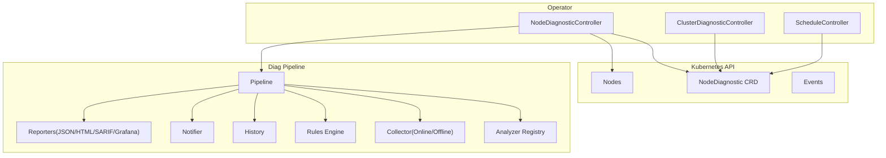
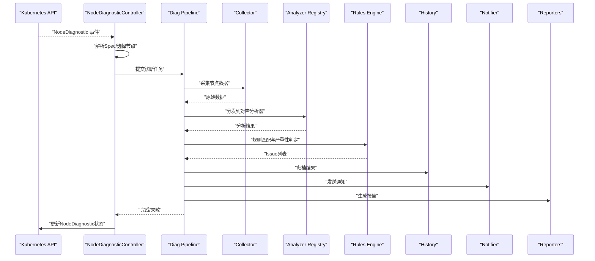
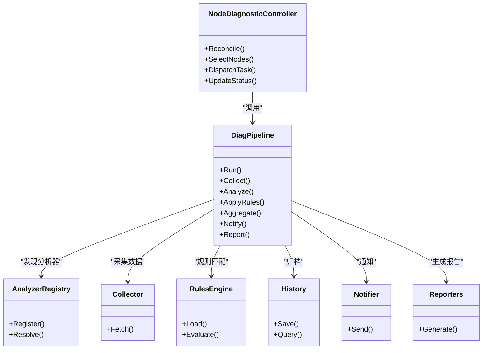
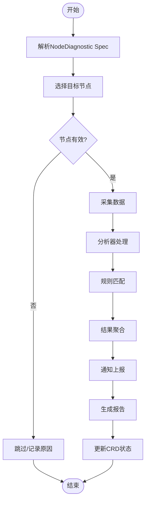

# 节点诊断控制器

<cite>
**本文引用的文件**   
- [nodediagnostic_controller.go](file://operator/controllers/nodediagnostic_controller.go)
- [nodediagnostic_types.go](file://operator/api/v1/nodediagnostic_types.go)
- [clusterdiagnostic_controller.go](file://operator/controllers/clusterdiagnostic_controller.go)
- [schedule_controller.go](file://operator/controllers/schedule_controller.go)
- [pipeline.go](file://internal/diag/pipeline.go)
- [interface.go](file://internal/diag/analyzer/interface.go)
- [registry.go](file://internal/diag/analyzer/registry.go)
- [diagnostic_data.go](file://internal/diag/types/diagnostic_data.go)
- [issue.go](file://internal/diag/types/issue.go)
- [severity.go](file://internal/diag/types/severity.go)
- [kubernetes.go](file://internal/diag/collector/online/kubernetes.go)
- [resource.go](file://internal/diag/analyzer/system/resource.go)
- [controlplane.go](file://internal/diag/analyzer/kubernetes/controlplane.go)
- [dns.go](file://internal/diag/analyzer/kubernetes/dns.go)
- [gpu.go](file://internal/diag/analyzer/kubernetes/gpu.go)
- [storage.go](file://internal/diag/analyzer/kubernetes/storage.go)
- [workload.go](file://internal/diag/analyzer/kubernetes/workload.go)
- [network.go](file://internal/diag/analyzer/network/network.go)
- [runtime.go](file://internal/diag/analyzer/runtime/runtime.go)
- [service.go](file://internal/diag/analyzer/process/service.go)
- [kernel.go](file://internal/diag/analyzer/kernel/kernel.go)
- [cis.go](file://internal/diag/analyzer/security/cis.go)
- [rbac.go](file://internal/diag/analyzer/security/rbac.go)
- [istio.go](file://internal/diag/analyzer/servicemesh/istio.go)
- [linkerd.go](file://internal/diag/analyzer/servicemesh/linkerd.go)
- [engine.go](file://internal/diag/rules/engine.go)
- [analyzer.go](file://internal/diag/rules/analyzer.go)
- [loader.go](file://internal/diag/rules/loader.go)
- [types.go](file://internal/diag/rules/types.go)
- [notifier.go](file://internal/diag/notifier/notifier.go)
- [history.go](file://internal/diag/history/history.go)
- [reporter_interface.go](file://internal/diag/reporter/interface.go)
- [config.go](file://configs/config.yaml.example)
</cite>

## 目录
1. [简介](#简介)
2. [项目结构](#项目结构)
3. [核心组件](#核心组件)
4. [架构总览](#架构总览)
5. [详细组件分析](#详细组件分析)
6. [依赖关系分析](#依赖关系分析)
7. [性能考虑](#性能考虑)
8. [故障排查指南](#故障排查指南)
9. [结论](#结论)
10. [附录](#附录)

## 简介
本文件为 NodeDiagnosticController（节点诊断控制器）的完整技术文档。该控制器基于 Kubernetes Operator 模式，监听并协调 NodeDiagnostic CRD 的变更，按策略选择目标节点，分发并执行节点级诊断任务，聚合结果并通过多种渠道上报与通知。其能力覆盖：
- 节点健康检查（内核、运行时、进程、网络等）
- 资源监控（CPU、内存、磁盘、GPU、存储等）
- 性能分析与规则引擎（基于规则的诊断与告警）
- 服务网格与安全合规（Istio/Linkerd、CIS、RBAC）
- 结果聚合、历史归档与多格式报告输出

## 项目结构
NodeDiagnosticController 位于 operator 模块中，CRD 定义在 api/v1，控制器逻辑在 controllers，诊断执行管线与各类分析器在 internal/diag。整体采用“控制器 + 管线 + 分析器注册表”的分层设计，便于扩展新的诊断项。

图表来源
- [nodediagnostic_controller.go](file://operator/controllers/nodediagnostic_controller.go)
- [nodediagnostic_types.go](file://operator/api/v1/nodediagnostic_types.go)
- [pipeline.go](file://internal/diag/pipeline.go)
- [registry.go](file://internal/diag/analyzer/registry.go)
- [kubernetes.go](file://internal/diag/collector/online/kubernetes.go)

章节来源
- [nodediagnostic_controller.go](file://operator/controllers/nodediagnostic_controller.go)
- [nodediagnostic_types.go](file://operator/api/v1/nodediagnostic_types.go)
- [pipeline.go](file://internal/diag/pipeline.go)

## 核心组件
- NodeDiagnostic CRD：描述一次节点诊断任务的声明式配置，包括目标节点选择、诊断范围、并发度、超时、重试、结果上报等。
- NodeDiagnosticController：Reconcile 循环监听 CRD 事件，解析 Spec，选择节点，调度诊断任务，管理状态与最终状态。
- Diag Pipeline：统一编排采集、分析、规则匹配、结果聚合、通知与报告生成。
- Analyzer Registry：集中注册与发现各诊断分析器（系统、Kubernetes、网络、安全、服务网格等）。
- Collector：在线/离线数据采集器，对接 Kubernetes API、宿主机或 Pod 环境。
- Rules Engine：基于规则的诊断判定与告警生成。
- History/Notifier/Reporter：结果持久化、消息通知与多格式报告输出。

章节来源
- [nodediagnostic_types.go](file://operator/api/v1/nodediagnostic_types.go)
- [nodediagnostic_controller.go](file://operator/controllers/nodediagnostic_controller.go)
- [pipeline.go](file://internal/diag/pipeline.go)
- [registry.go](file://internal/diag/analyzer/registry.go)
- [kubernetes.go](file://internal/diag/collector/online/kubernetes.go)

## 架构总览
NodeDiagnosticController 通过 Reconcile 循环处理 NodeDiagnostic 对象的创建、更新与删除。控制器根据 Spec 中的节点选择策略筛选目标节点，调用诊断管线执行具体诊断项，收集数据与分析结果，应用规则引擎进行问题识别与严重性分级，最后将结果写入对象状态、归档历史、触发通知与生成报告。

图表来源
- [nodediagnostic_controller.go](file://operator/controllers/nodediagnostic_controller.go)
- [pipeline.go](file://internal/diag/pipeline.go)
- [registry.go](file://internal/diag/analyzer/registry.go)
- [kubernetes.go](file://internal/diag/collector/online/kubernetes.go)
- [engine.go](file://internal/diag/rules/engine.go)
- [history.go](file://internal/diag/history/history.go)
- [notifier.go](file://internal/diag/notifier/notifier.go)
- [reporter_interface.go](file://internal/diag/reporter/interface.go)

## 详细组件分析

### NodeDiagnostic CRD 与控制器职责
- CRD 字段涵盖：目标节点选择（名称/标签/表达式）、诊断范围（健康/资源/性能/安全/网格）、并发度、超时、重试、结果保留策略、上报通道等。
- 控制器职责：
  - 监听 NodeDiagnostic 生命周期事件
  - 校验与规范化 Spec
  - 节点选择与过滤
  - 任务派发与状态跟踪
  - 结果聚合与最终状态收敛
  - 错误处理与重试策略

章节来源
- [nodediagnostic_types.go](file://operator/api/v1/nodediagnostic_types.go)
- [nodediagnostic_controller.go](file://operator/controllers/nodediagnostic_controller.go)

### 节点选择策略
- 支持按名称精确匹配、标签选择器、表达式过滤。
- 控制器会结合集群节点状态（Ready/NotReady、条件、污点容忍）进行二次筛选，避免对不可用节点执行诊断。
- 当未指定目标时，可默认选择全部节点或按调度策略分批执行。

章节来源
- [nodediagnostic_controller.go](file://operator/controllers/nodediagnostic_controller.go)

### 诊断任务分发机制
- 控制器将 NodeDiagnostic 转换为内部任务，交由诊断管线执行。
- 管线按阶段组织：采集 -> 分析 -> 规则 -> 聚合 -> 上报。
- 分析器通过注册表动态发现与加载，支持并行执行与超时控制。
- 采集器支持在线（Kubernetes API、Pod 内执行）与离线（本地目录/文件）两种模式。

章节来源
- [pipeline.go](file://internal/diag/pipeline.go)
- [registry.go](file://internal/diag/analyzer/registry.go)
- [kubernetes.go](file://internal/diag/collector/online/kubernetes.go)

### 结果聚合与状态管理
- 管线汇总各分析器的结果，合并为统一的诊断数据集。
- 规则引擎对数据进行匹配，生成 Issue 列表并标注严重性。
- 控制器将聚合结果写回 NodeDiagnostic.Status，包含总体健康、Issue 摘要、统计指标与时间戳。
- 历史记录持久化，便于回溯与趋势分析。

章节来源
- [pipeline.go](file://internal/diag/pipeline.go)
- [engine.go](file://internal/diag/rules/engine.go)
- [history.go](file://internal/diag/history/history.go)

### 健康检查、资源监控与性能分析集成
- 健康检查：内核参数、运行时状态、关键进程存活、网络连通性等。
- 资源监控：CPU/内存/磁盘使用率、GPU 利用率、存储 I/O 与容量。
- 性能分析：系统调用热点、网络延迟/丢包、容器运行态异常、工作负载调度问题。
- 安全与合规：CIS 基线检查、RBAC 权限审计。
- 服务网格：Istio/Linkerd 配置与链路健康。

章节来源
- [resource.go](file://internal/diag/analyzer/system/resource.go)
- [controlplane.go](file://internal/diag/analyzer/kubernetes/controlplane.go)
- [dns.go](file://internal/diag/analyzer/kubernetes/dns.go)
- [gpu.go](file://internal/diag/analyzer/kubernetes/gpu.go)
- [storage.go](file://internal/diag/analyzer/kubernetes/storage.go)
- [workload.go](file://internal/diag/analyzer/kubernetes/workload.go)
- [network.go](file://internal/diag/analyzer/network/network.go)
- [runtime.go](file://internal/diag/analyzer/runtime/runtime.go)
- [service.go](file://internal/diag/analyzer/process/service.go)
- [kernel.go](file://internal/diag/analyzer/kernel/kernel.go)
- [cis.go](file://internal/diag/analyzer/security/cis.go)
- [rbac.go](file://internal/diag/analyzer/security/rbac.go)
- [istio.go](file://internal/diag/analyzer/servicemesh/istio.go)
- [linkerd.go](file://internal/diag/analyzer/servicemesh/linkerd.go)

### 规则引擎与严重性模型
- 规则以声明式方式定义，支持阈值、模式匹配、组合条件。
- 严重性等级用于区分影响面与响应优先级。
- 规则引擎输出结构化 Issue，供下游通知与报告使用。

章节来源
- [engine.go](file://internal/diag/rules/engine.go)
- [analyzer.go](file://internal/diag/rules/analyzer.go)
- [loader.go](file://internal/diag/rules/loader.go)
- [types.go](file://internal/diag/rules/types.go)
- [issue.go](file://internal/diag/types/issue.go)
- [severity.go](file://internal/diag/types/severity.go)

### 通知与报告
- 通知器支持多种通道（如企业微信、钉钉、飞书等），可按严重性与分组策略发送。
- 报告器支持 JSON、HTML、SARIF、Grafana 等多种格式，便于不同场景消费。

章节来源
- [notifier.go](file://internal/diag/notifier/notifier.go)
- [reporter_interface.go](file://internal/diag/reporter/interface.go)

### 与 ClusterDiagnostic 和 Schedule 的关系
- ClusterDiagnostic 负责集群级诊断，NodeDiagnostic 聚焦单节点。两者共享同一管线与规则体系。
- ScheduleController 可定时触发 NodeDiagnostic 对象，实现周期性巡检。

章节来源
- [clusterdiagnostic_controller.go](file://operator/controllers/clusterdiagnostic_controller.go)
- [schedule_controller.go](file://operator/controllers/schedule_controller.go)

## 依赖关系分析
NodeDiagnosticController 依赖以下子系统：
- Kubernetes API Server：读写 CRD、节点信息与事件
- 诊断管线：采集、分析、规则、聚合、上报
- 外部通道：通知与报告输出
- 存储：历史与结果持久化

图表来源
- [nodediagnostic_controller.go](file://operator/controllers/nodediagnostic_controller.go)
- [pipeline.go](file://internal/diag/pipeline.go)
- [registry.go](file://internal/diag/analyzer/registry.go)
- [kubernetes.go](file://internal/diag/collector/online/kubernetes.go)
- [engine.go](file://internal/diag/rules/engine.go)
- [history.go](file://internal/diag/history/history.go)
- [notifier.go](file://internal/diag/notifier/notifier.go)
- [reporter_interface.go](file://internal/diag/reporter/interface.go)

章节来源
- [nodediagnostic_controller.go](file://operator/controllers/nodediagnostic_controller.go)
- [pipeline.go](file://internal/diag/pipeline.go)
- [registry.go](file://internal/diag/analyzer/registry.go)

## 性能考虑
- 并发与限流：合理设置诊断任务并发度与采集请求速率，避免压垮 API Server 或节点。
- 超时与重试：为每个阶段设置超时与退避重试，防止长尾阻塞。
- 增量与缓存：对静态或低频变化数据启用缓存，减少重复采集。
- 选择性分析：按 Spec 仅启用必要分析器，降低开销。
- 结果压缩与分页：大结果集按需分页与压缩传输。
- 资源隔离：在 Pod 或容器中限制 CPU/内存配额，避免影响业务负载。

[本节为通用指导，不直接分析具体文件]

## 故障排查指南
- 控制器未触发：
  - 检查 RBAC 权限与 CRD 是否已安装
  - 查看控制器日志与事件记录
- 节点选择失败：
  - 校验标签选择器与表达式语法
  - 确认节点状态与污点容忍
- 采集失败：
  - 检查在线采集器对 API 的访问权限与网络连通性
  - 确认目标节点具备所需工具或权限
- 分析器报错：
  - 核对分析器依赖与版本兼容性
  - 查看规则配置是否正确加载
- 结果未上报：
  - 检查通知器与报告器配置
  - 验证外部通道鉴权与网络可达

章节来源
- [nodediagnostic_controller.go](file://operator/controllers/nodediagnostic_controller.go)
- [kubernetes.go](file://internal/diag/collector/online/kubernetes.go)
- [engine.go](file://internal/diag/rules/engine.go)
- [notifier.go](file://internal/diag/notifier/notifier.go)
- [reporter_interface.go](file://internal/diag/reporter/interface.go)

## 结论
NodeDiagnosticController 通过声明式 CRD 与可扩展的诊断管线，实现了节点级健康、资源与性能的全面诊断。其清晰的职责划分与模块化设计，使得新增诊断项与接入新通道变得简单可靠。配合规则引擎与多格式报告，能够满足运维自动化与合规审计的多重需求。

[本节为总结性内容，不直接分析具体文件]

## 附录

### 控制器配置参数建议
- 并发度：根据集群规模与节点能力调整，避免过载
- 超时：采集与分析阶段分别设置合理超时
- 重试：指数退避与最大重试次数
- 选择策略：优先使用标签选择器，减少全量扫描
- 上报通道：按严重性与团队维度配置通知路由
- 报告格式：JSON 用于自动化，HTML/SARIF 用于审计与可视化

章节来源
- [config.go](file://configs/config.yaml.example)

### 典型工作流程图（算法流程）

图表来源
- [nodediagnostic_controller.go](file://operator/controllers/nodediagnostic_controller.go)
- [pipeline.go](file://internal/diag/pipeline.go)
- [engine.go](file://internal/diag/rules/engine.go)