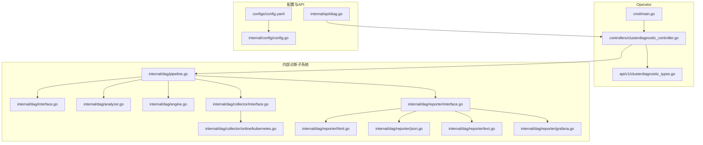
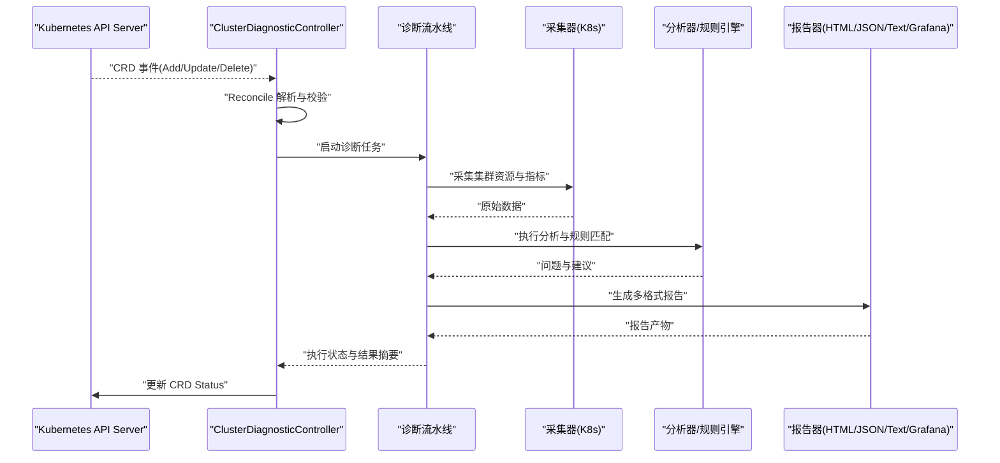
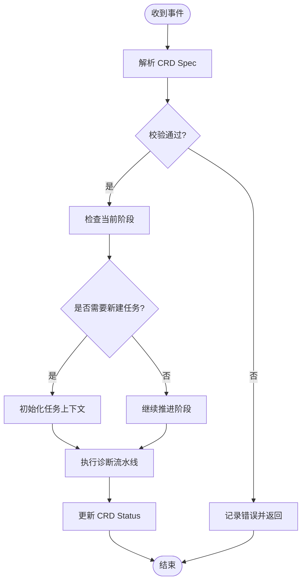
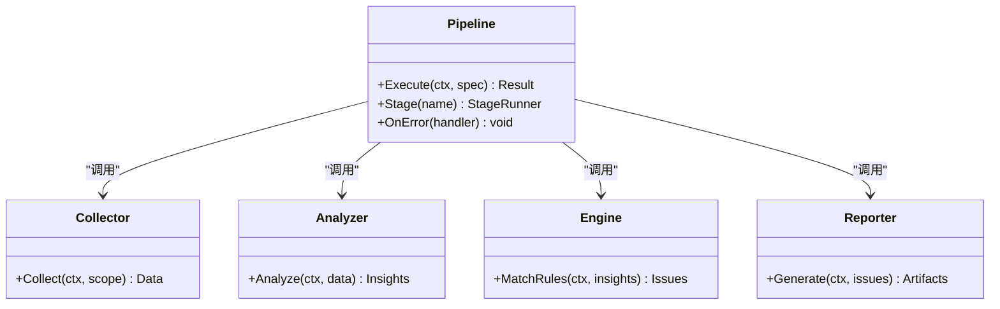
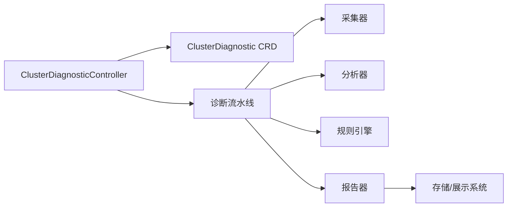

# 集群诊断控制器

<cite>
**本文引用的文件**   
- [clusterdiagnostic_controller.go](file://operator/controllers/clusterdiagnostic_controller.go)
- [clusterdiagnostic_types.go](file://operator/api/v1/clusterdiagnostic_types.go)
- [nodediagnostic_controller.go](file://operator/controllers/nodediagnostic_controller.go)
- [schedule_controller.go](file://operator/controllers/schedule_controller.go)
- [main.go](file://operator/cmd/main.go)
- [pipeline.go](file://internal/dag/pipeline.go)
- [interface.go](file://internal/dag/interface.go)
- [analyzer.go](file://internal/dag/analyzer.go)
- [engine.go](file://internal/dag/engine.go)
- [collector_interface.go](file://internal/dag/collector/interface.go)
- [kubernetes_collector.go](file://internal/dag/collector/online/kubernetes.go)
- [reporter_interface.go](file://internal/dag/reporter/interface.go)
- [html_reporter.go](file://internal/dag/reporter/html.go)
- [json_reporter.go](file://internal/dag/reporter/json.go)
- [text_reporter.go](file://internal/dag/reporter/text.go)
- [grafana_reporter.go](file://internal/dag/reporter/grafana.go)
- [config.yaml](file://configs/config.yaml)
- [config.go](file://internal/config/config.go)
- [diag_api.go](file://internal/api/diag.go)
</cite>

## 目录
1. [简介](#简介)
2. [项目结构](#项目结构)
3. [核心组件](#核心组件)
4. [架构总览](#架构总览)
5. [详细组件分析](#详细组件分析)
6. [依赖关系分析](#依赖关系分析)
7. [性能考量](#性能考量)
8. [故障排查指南](#故障排查指南)
9. [结论](#结论)
10. [附录](#附录)

## 简介
本文件为 ClusterDiagnosticController（集群诊断控制器）的权威技术文档。内容覆盖 Reconcile 循环逻辑、事件处理机制、资源同步策略，以及 CRD 生命周期监听与诊断任务调度、执行状态跟踪、结果收集与报告生成流程。同时提供控制器配置项、错误处理策略与调试方法，帮助读者快速理解并高效使用。

## 项目结构
该控制器位于 operator 模块中，围绕 Kubernetes Operator 模式实现：
- API 类型定义：ClusterDiagnostic CRD 的结构与状态字段
- Controller 实现：Reconcile 循环、事件监听、状态更新
- 诊断流水线：采集器、分析器、规则引擎、报告器
- 配置与 API：控制器运行参数与外部 API 暴露

图表来源
- [clusterdiagnostic_controller.go](file://operator/controllers/clusterdiagnostic_controller.go)
- [clusterdiagnostic_types.go](file://operator/api/v1/clusterdiagnostic_types.go)
- [pipeline.go](file://internal/dag/pipeline.go)
- [interface.go](file://internal/dag/interface.go)
- [analyzer.go](file://internal/dag/analyzer.go)
- [engine.go](file://internal/dag/engine.go)
- [collector_interface.go](file://internal/dag/collector/interface.go)
- [kubernetes_collector.go](file://internal/dag/collector/online/kubernetes.go)
- [reporter_interface.go](file://internal/dag/reporter/interface.go)
- [html_reporter.go](file://internal/dag/reporter/html.go)
- [json_reporter.go](file://internal/dag/reporter/json.go)
- [text_reporter.go](file://internal/dag/reporter/text.go)
- [grafana_reporter.go](file://internal/dag/reporter/grafana.go)
- [config.yaml](file://configs/config.yaml)
- [config.go](file://internal/config/config.go)
- [diag_api.go](file://internal/api/diag.go)

章节来源
- [clusterdiagnostic_controller.go](file://operator/controllers/clusterdiagnostic_controller.go)
- [clusterdiagnostic_types.go](file://operator/api/v1/clusterdiagnostic_types.go)
- [pipeline.go](file://internal/dag/pipeline.go)
- [config.yaml](file://configs/config.yaml)
- [config.go](file://internal/config/config.go)
- [diag_api.go](file://internal/api/diag.go)

## 核心组件
- ClusterDiagnostic CRD：描述一次集群级诊断任务的请求与状态，包含触发方式、范围、选项、执行阶段与结果引用等。
- ClusterDiagnosticController：Kubernetes 控制器，负责监听 CRD 事件、驱动诊断流水线、维护状态与最终输出。
- 诊断流水线（Pipeline）：封装采集、分析、规则匹配、报告生成的统一流程。
- 采集器（Collector）：在线/离线数据收集接口与实现（如 Kubernetes 采集）。
- 分析器（Analyzer）：针对内核、网络、存储、工作负载、安全等多维度的分析能力。
- 规则引擎（Engine）：基于规则的诊断判定与问题聚合。
- 报告器（Reporter）：HTML/JSON/Text/Grafana 等多种格式的结果输出。

章节来源
- [clusterdiagnostic_types.go](file://operator/api/v1/clusterdiagnostic_types.go)
- [clusterdiagnostic_controller.go](file://operator/controllers/clusterdiagnostic_controller.go)
- [pipeline.go](file://internal/dag/pipeline.go)
- [interface.go](file://internal/dag/interface.go)
- [analyzer.go](file://internal/dag/analyzer.go)
- [engine.go](file://internal/dag/engine.go)
- [collector_interface.go](file://internal/dag/collector/interface.go)
- [kubernetes_collector.go](file://internal/dag/collector/online/kubernetes.go)
- [reporter_interface.go](file://internal/dag/reporter/interface.go)
- [html_reporter.go](file://internal/dag/reporter/html.go)
- [json_reporter.go](file://internal/dag/reporter/json.go)
- [text_reporter.go](file://internal/dag/reporter/text.go)
- [grafana_reporter.go](file://internal/dag/reporter/grafana.go)

## 架构总览
ClusterDiagnosticController 通过 Kubernetes Informers 监听 ClusterDiagnostic CRD 的创建、更新、删除事件，并在 Reconcile 中协调诊断流水线完成数据采集、分析与报告生成。

图表来源
- [clusterdiagnostic_controller.go](file://operator/controllers/clusterdiagnostic_controller.go)
- [pipeline.go](file://internal/dag/pipeline.go)
- [kubernetes_collector.go](file://internal/dag/collector/online/kubernetes.go)
- [analyzer.go](file://internal/dag/analyzer.go)
- [engine.go](file://internal/dag/engine.go)
- [reporter_interface.go](file://internal/dag/reporter/interface.go)
- [html_reporter.go](file://internal/dag/reporter/html.go)
- [json_reporter.go](file://internal/dag/reporter/json.go)
- [text_reporter.go](file://internal/dag/reporter/text.go)
- [grafana_reporter.go](file://internal/dag/reporter/grafana.go)

## 详细组件分析

### ClusterDiagnostic CRD 与状态模型
- 作用：声明一次诊断任务的意图、范围、选项与期望行为；承载执行状态与结果引用。
- 关键字段类别：
  - 元信息：名称、命名空间、标签、注解
  - 触发与范围：触发源（手动/定时）、目标集群范围、采样粒度
  - 执行选项：采集深度、分析维度、报告格式、超时与重试
  - 状态字段：当前阶段、进度、错误信息、结果对象引用
- 设计要点：
  - 使用条件与阶段字段表达任务生命周期
  - 结果以对象引用或索引形式保存，避免大对象直接嵌入
  - 支持幂等更新与并发控制（通过版本号/UID）

章节来源
- [clusterdiagnostic_types.go](file://operator/api/v1/clusterdiagnostic_types.go)

### ClusterDiagnosticController：Reconcile 循环与事件处理
- 事件监听：
  - 通过 Informers 订阅 ClusterDiagnostic 的 Add/Update/Delete 事件
  - Update 事件需比较 Spec/Status 变化，避免重复处理
- Reconcile 主流程：
  - 解析与校验 CRD Spec
  - 根据阶段决定下一步动作（新建任务、推进阶段、清理资源）
  - 调用诊断流水线执行采集、分析、报告
  - 更新 CRD Status（阶段、进度、错误、结果引用）
  - 处理失败与重试（退避、限流、告警）
- 并发与幂等：
  - 使用队列与锁保证同一资源串行化
  - 基于 UID/版本判断是否跳过已处理事件
- 资源同步策略：
  - 仅同步必要的状态字段，减少 etcd 压力
  - 增量更新，合并多次变更

图表来源
- [clusterdiagnostic_controller.go](file://operator/controllers/clusterdiagnostic_controller.go)

章节来源
- [clusterdiagnostic_controller.go](file://operator/controllers/clusterdiagnostic_controller.go)

### 诊断流水线：调度、执行与状态跟踪
- 调度：
  - 按阶段顺序执行：准备→采集→分析→规则匹配→报告生成→收尾
  - 支持并行子任务（如多采集器并行）与超时控制
- 执行：
  - 采集器从 Kubernetes 获取资源与指标
  - 分析器对数据进行多维分析
  - 规则引擎将分析结果映射为问题与建议
- 状态跟踪：
  - 每个阶段记录开始/结束时间、耗时、错误
  - 汇总到 CRD Status 的阶段性状态与进度条
- 结果收集：
  - 结构化问题列表、指标快照、建议清单
  - 可导出为多种报告格式

图表来源
- [pipeline.go](file://internal/dag/pipeline.go)
- [interface.go](file://internal/dag/interface.go)
- [analyzer.go](file://internal/dag/analyzer.go)
- [engine.go](file://internal/dag/engine.go)
- [collector_interface.go](file://internal/dag/collector/interface.go)
- [reporter_interface.go](file://internal/dag/reporter/interface.go)

章节来源
- [pipeline.go](file://internal/dag/pipeline.go)
- [interface.go](file://internal/dag/interface.go)
- [analyzer.go](file://internal/dag/analyzer.go)
- [engine.go](file://internal/dag/engine.go)
- [collector_interface.go](file://internal/dag/collector/interface.go)
- [reporter_interface.go](file://internal/dag/reporter/interface.go)

### 采集器：在线 Kubernetes 采集
- 职责：从 Kubernetes API 拉取节点、Pod、Service、事件等资源与指标
- 特性：
  - 支持分页与过滤，降低负载
  - 错误重试与熔断，保障稳定性
  - 可选增量采集，提升效率
- 集成点：
  - 通过统一接口注入到流水线
  - 与控制器共享认证与访问策略

章节来源
- [kubernetes_collector.go](file://internal/dag/collector/online/kubernetes.go)
- [collector_interface.go](file://internal/dag/collector/interface.go)

### 报告器：多格式结果输出
- 支持格式：HTML 可视化、JSON 结构化、Text 文本、Grafana 面板
- 输出位置：
  - 持久化到集群存储或外部系统
  - 通过 API 暴露下载链接
- 扩展性：
  - 新增报告器只需实现统一接口

章节来源
- [reporter_interface.go](file://internal/dag/reporter/interface.go)
- [html_reporter.go](file://internal/dag/reporter/html.go)
- [json_reporter.go](file://internal/dag/reporter/json.go)
- [text_reporter.go](file://internal/dag/reporter/text.go)
- [grafana_reporter.go](file://internal/dag/reporter/grafana.go)

### 控制器配置与环境变量
- 配置文件：
  - 日志级别、输出路径、上报地址
  - 采集超时、重试次数、并发限制
- 运行时配置：
  - 通过环境变量覆盖默认值
  - 动态加载与热更新（若支持）

章节来源
- [config.yaml](file://configs/config.yaml)
- [config.go](file://internal/config/config.go)

### 外部 API 与触发方式
- REST API：
  - 创建/查询/取消诊断任务
  - 下载报告与查看状态
- Webhook/事件：
  - 与 CI/CD 或运维平台集成
- 定时任务：
  - 结合 Schedule CRD 周期性触发

章节来源
- [diag_api.go](file://internal/api/diag.go)

## 依赖关系分析
- 控制器与 CRD：强耦合，必须确保 CRD 已安装且版本兼容
- 控制器与流水线：松耦合，通过接口抽象替换实现
- 采集器与分析器：解耦，便于扩展新采集源与分析维度
- 报告器与下游系统：通过适配器接入不同存储与展示平台

图表来源
- [clusterdiagnostic_controller.go](file://operator/controllers/clusterdiagnostic_controller.go)
- [pipeline.go](file://internal/dag/pipeline.go)
- [collector_interface.go](file://internal/dag/collector/interface.go)
- [analyzer.go](file://internal/dag/analyzer.go)
- [engine.go](file://internal/dag/engine.go)
- [reporter_interface.go](file://internal/dag/reporter/interface.go)

章节来源
- [clusterdiagnostic_controller.go](file://operator/controllers/clusterdiagnostic_controller.go)
- [pipeline.go](file://internal/dag/pipeline.go)

## 性能考量
- 采集优化：
  - 分页与过滤减少数据量
  - 增量采集与缓存热点数据
- 分析优化：
  - 并行分析独立维度
  - 规则预编译与短路评估
- 报告优化：
  - 按需生成格式，避免全量渲染
  - 异步写入与压缩传输
- 控制器优化：
  - 合理设置队列长度与重入锁粒度
  - 使用指数退避与熔断保护后端

[本节为通用指导，不直接分析具体文件]

## 故障排查指南
- 常见错误：
  - CRD 未安装或版本不一致
  - 权限不足导致采集失败
  - 采集超时或 API 限流
  - 报告器配置错误无法写入
- 定位步骤：
  - 查看控制器日志与事件记录
  - 检查 CRD Status 的阶段与错误信息
  - 验证采集器连通性与配额
  - 确认报告器目标可达
- 调试技巧：
  - 开启调试日志与慢查询追踪
  - 使用最小化 Spec 复现问题
  - 临时禁用非关键分析器隔离问题

章节来源
- [clusterdiagnostic_controller.go](file://operator/controllers/clusterdiagnostic_controller.go)
- [config.go](file://internal/config/config.go)

## 结论
ClusterDiagnosticController 以 Kubernetes Operator 模式实现了集群级诊断的自动化闭环：从 CRD 事件驱动，到流水线化的采集、分析与报告，再到状态同步与对外 API 暴露。通过清晰的接口与模块化设计，系统具备良好的可扩展性与可维护性。配合合理的配置与监控，可在大规模集群中稳定运行并提供高质量诊断结果。

[本节为总结，不直接分析具体文件]

## 附录
- 相关控制器：
  - NodeDiagnosticController：节点级诊断
  - ScheduleController：定时任务编排
- 示例与模板：
  - CRD 示例 YAML
  - Helm Chart 部署模板

章节来源
- [nodediagnostic_controller.go](file://operator/controllers/nodediagnostic_controller.go)
- [schedule_controller.go](file://operator/controllers/schedule_controller.go)
- [main.go](file://operator/cmd/main.go)