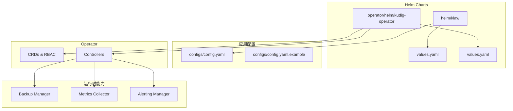
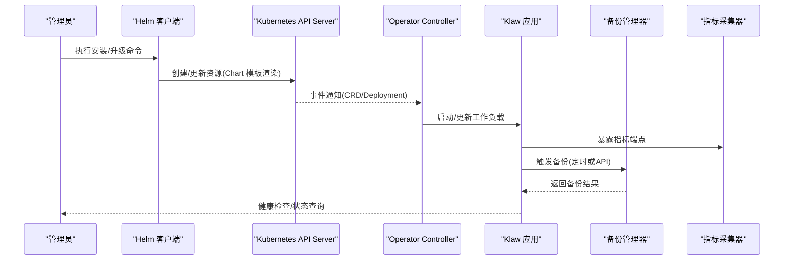
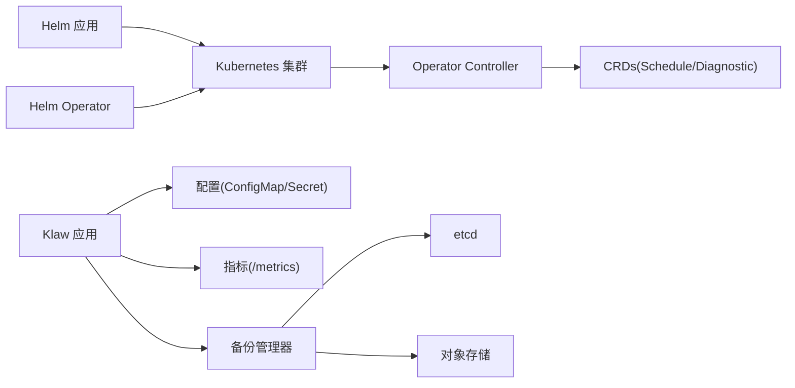

# 部署与管理

<cite>
**本文引用的文件**
- [deployment/README.md](file://deployment/README.md)
- [deployment/kind/cluster-config.yaml](file://deployment/kind/cluster-config.yaml)
- [deployment/kind/manage.sh](file://deployment/kind/manage.sh)
- [helm/klaw/Chart.yaml](file://helm/klaw/Chart.yaml)
- [helm/klaw/values.yaml](file://helm/klaw/values.yaml)
- [configs/config.yaml](file://configs/config.yaml)
- [configs/config.yaml.example](file://configs/config.yaml.example)
- [internal/config/config.go](file://internal/config/config.go)
- [operator/helm/kudig-operator/Chart.yaml](file://operator/helm/kudig-operator/Chart.yaml)
- [operator/helm/kudig-operator/values.yaml](file://operator/helm/kudig-operator/values.yaml)
- [operator/helm/kudig-operator/templates/deployment.yaml](file://operator/helm/kudig-operator/templates/deployment.yaml)
- [operator/helm/kudig-operator/templates/rbac.yaml](file://operator/helm/kudig-operator/templates/rbac.yaml)
- [operator/api/v1/schedule_types.go](file://operator/api/v1/schedule_types.go)
- [operator/controllers/schedule_controller.go](file://operator/controllers/schedule_controller.go)
- [internal/backup/manager.go](file://internal/backup/manager.go)
- [modules/etcd-backup/manager.go](file://modules/etcd-backup/manager.go)
- [internal/metrics/collector.go](file://internal/metrics/collector.go)
- [internal/alerting/manager.go](file://internal/alerting/manager.go)
- [internal/ops/handler.go](file://internal/ops/handler.go)
</cite>

## 目录
1. [简介](#简介)
2. [项目结构](#项目结构)
3. [核心组件](#核心组件)
4. [架构总览](#架构总览)
5. [详细组件分析](#详细组件分析)
6. [依赖关系分析](#依赖关系分析)
7. [性能考虑](#性能考虑)
8. [故障排查指南](#故障排查指南)
9. [结论](#结论)
10. [附录](#附录)

## 简介
本文件面向运维与平台工程团队，提供 Klaw Operator 的完整部署与管理指南。内容涵盖 Helm Chart 结构、配置文件管理、RBAC 权限设置、环境变量与参数调优、集群权限与安全网络策略、升级策略、备份恢复、监控告警配置以及故障排查与日志收集方法。文档以仓库中的 Helm Chart、Operator 模板、配置示例与内部模块为依据，确保可操作性与可追溯性。

## 项目结构
Klaw Operator 采用“应用 + Operator”双栈部署模式：
- 应用侧：通过 helm/klaw 进行容器化部署与配置注入。
- 控制面：通过 operator/helm/kudig-operator 安装 Operator CRD、控制器与 RBAC，调度诊断任务与自动化流程。
- 配置中心：configs 目录提供运行时配置样例与默认值；internal/config 负责加载与校验。
- 运维能力：内置备份（internal/backup、modules/etcd-backup）、指标采集（internal/metrics）与告警（internal/alerting）。

图表来源
- [helm/klaw/values.yaml](file://helm/klaw/values.yaml)
- [operator/helm/kudig-operator/values.yaml](file://operator/helm/kudig-operator/values.yaml)
- [configs/config.yaml](file://configs/config.yaml)
- [configs/config.yaml.example](file://configs/config.yaml.example)

章节来源
- [deployment/README.md](file://deployment/README.md)

## 核心组件
- Helm Chart（应用）: 定义 Deployment、Service、ConfigMap 等资源的渲染逻辑与默认值。
- Helm Chart（Operator）: 定义 CRD、RBAC、Controller Deployment 及必要的 ServiceAccount。
- 配置加载器: 从文件系统与环境变量合并加载配置，提供强类型访问接口。
- 备份管理器: 封装 etcd 与业务数据备份流程，支持定时与手动触发。
- 指标采集器: 暴露 Prometheus 兼容指标端点，供外部监控系统抓取。
- 告警管理器: 对接消息通道（如钉钉），实现告警事件分发。

章节来源
- [helm/klaw/values.yaml](file://helm/klaw/values.yaml)
- [operator/helm/kudig-operator/values.yaml](file://operator/helm/kudig-operator/values.yaml)
- [internal/config/config.go](file://internal/config/config.go)
- [internal/backup/manager.go](file://internal/backup/manager.go)
- [internal/metrics/collector.go](file://internal/metrics/collector.go)
- [internal/alerting/manager.go](file://internal/alerting/manager.go)

## 架构总览
Klaw Operator 在 Kubernetes 中以控制器模式运行，监听自定义资源（如 Schedule、ClusterDiagnostic、NodeDiagnostic），并驱动工作负载完成诊断、备份、分析等任务。应用侧通过 HTTP API 暴露管理能力，同时暴露指标与审计日志。

图表来源
- [operator/helm/kudig-operator/templates/deployment.yaml](file://operator/helm/kudig-operator/templates/deployment.yaml)
- [operator/helm/kudig-operator/templates/rbac.yaml](file://operator/helm/kudig-operator/templates/rbac.yaml)
- [internal/backup/manager.go](file://internal/backup/manager.go)
- [internal/metrics/collector.go](file://internal/metrics/collector.go)

## 详细组件分析

### Helm Chart（应用）结构与参数
- Chart.yaml: 定义 Chart 名称、版本与应用版本信息。
- values.yaml: 集中管理镜像、副本数、资源限制、环境变量、存储卷挂载、服务端口、Ingress 等。
- templates: 包含 Deployment、Service、ConfigMap、Secret、Ingress 等模板，使用 values 动态生成。

建议实践
- 将敏感信息放入 Secret，并通过 values 引用。
- 使用命名空间隔离不同环境（dev/staging/prod）。
- 为每个环境维护独立的 values 文件，便于 GitOps 管理。

章节来源
- [helm/klaw/Chart.yaml](file://helm/klaw/Chart.yaml)
- [helm/klaw/values.yaml](file://helm/klaw/values.yaml)

### Helm Chart（Operator）结构与 RBAC
- Chart.yaml: 定义 Operator Chart 元数据。
- values.yaml: 配置 Controller 镜像、副本、日志级别、Leader Election、Webhook 开关等。
- templates/deployment.yaml: 渲染 Controller 的 Deployment，注入环境变量与 RBAC 绑定。
- templates/rbac.yaml: 定义 ServiceAccount、Role/ClusterRole、RoleBinding/ClusterRoleBinding，确保最小权限原则。

关键权限
- 读取/写入 CRD 实例（Schedule、ClusterDiagnostic、NodeDiagnostic）。
- 管理 Pod、Deployment、Job、CronJob、ConfigMap、Secret、PVC 等资源（按需要授予）。
- 访问节点与系统组件信息用于诊断（需 ClusterRole 授权）。

章节来源
- [operator/helm/kudig-operator/Chart.yaml](file://operator/helm/kudig-operator/Chart.yaml)
- [operator/helm/kudig-operator/values.yaml](file://operator/helm/kudig-operator/values.yaml)
- [operator/helm/kudig-operator/templates/deployment.yaml](file://operator/helm/kudig-operator/templates/deployment.yaml)
- [operator/helm/kudig-operator/templates/rbac.yaml](file://operator/helm/kudig-operator/templates/rbac.yaml)

### 配置管理与环境变量
- 配置文件位置: configs/config.yaml 与 configs/config.yaml.example。
- 加载顺序: 默认配置 -> 覆盖配置 -> 环境变量（优先级递增）。
- 关键配置项: 数据库连接、对象存储、消息通道、日志级别、指标端口、安全证书路径等。
- 环境变量: 推荐通过 values 注入到 Pod 的环境，避免硬编码。

最佳实践
- 使用 ConfigMap 存放非敏感配置，Secret 存放密钥。
- 对必填项进行启动时校验，失败则退出重启。
- 通过滚动更新平滑切换配置。

章节来源
- [configs/config.yaml](file://configs/config.yaml)
- [configs/config.yaml.example](file://configs/config.yaml.example)
- [internal/config/config.go](file://internal/config/config.go)

### 备份与恢复
- 备份管理器: internal/backup/manager.go 提供统一备份接口，支持全量/增量、定时任务与 API 触发。
- etcd 备份: modules/etcd-backup/manager.go 封装 etcdctl 操作，支持快照保存与清理策略。
- 恢复流程: 停止写入 -> 恢复数据 -> 验证一致性 -> 恢复写入。

注意事项
- 备份目标建议使用高可用对象存储（S3/OSS/COS）。
- 保留策略应结合合规要求与存储成本。
- 定期演练恢复流程，确保 RTO/RPO 达标。

章节来源
- [internal/backup/manager.go](file://internal/backup/manager.go)
- [modules/etcd-backup/manager.go](file://modules/etcd-backup/manager.go)

### 监控与告警
- 指标采集: internal/metrics/collector.go 暴露 /metrics 端点，输出业务与系统指标。
- 告警管理: internal/alerting/manager.go 支持多渠道通知（如钉钉），可配置阈值与去重策略。
- 集成建议: 通过 Prometheus 抓取指标，Grafana 展示面板，AlertManager 处理告警路由。

章节来源
- [internal/metrics/collector.go](file://internal/metrics/collector.go)
- [internal/alerting/manager.go](file://internal/alerting/manager.go)

### 运维与诊断
- 运维接口: internal/ops/handler.go 提供健康检查、版本信息、配置导出等运维能力。
- 诊断任务: operator/api/v1/schedule_types.go 定义调度模型，controller 根据规则触发诊断。
- 本地开发: deployment/kind/ 提供 Kind 集群快速搭建脚本与配置。

章节来源
- [internal/ops/handler.go](file://internal/ops/handler.go)
- [operator/api/v1/schedule_types.go](file://operator/api/v1/schedule_types.go)
- [operator/controllers/schedule_controller.go](file://operator/controllers/schedule_controller.go)
- [deployment/kind/cluster-config.yaml](file://deployment/kind/cluster-config.yaml)
- [deployment/kind/manage.sh](file://deployment/kind/manage.sh)

## 依赖关系分析
- Helm Chart 依赖 Kubernetes 版本与插件（如 cert-manager、ingress-controller）。
- Operator 依赖 CRD 注册成功与 RBAC 正确绑定。
- 应用依赖配置中心、对象存储、消息通道与指标后端。
- 备份模块依赖 etcd 客户端与对象存储 SDK。

图表来源
- [operator/helm/kudig-operator/templates/rbac.yaml](file://operator/helm/kudig-operator/templates/rbac.yaml)
- [internal/backup/manager.go](file://internal/backup/manager.go)
- [internal/metrics/collector.go](file://internal/metrics/collector.go)

章节来源
- [operator/helm/kudig-operator/values.yaml](file://operator/helm/kudig-operator/values.yaml)
- [helm/klaw/values.yaml](file://helm/klaw/values.yaml)

## 性能考虑
- 资源配额: 合理设置 CPU/Memory 请求与限制，避免资源争用。
- 副本与水平扩展: 根据 QPS 与延迟目标调整副本数，必要时启用 HPA。
- 存储 I/O: 使用高性能存储类，优化备份窗口与并发度。
- 指标采样: 调整采集频率，避免过度抓取影响主链路。
- 日志级别: 生产环境降低日志级别，减少磁盘与网络开销。

[本节为通用指导，不直接分析具体文件]

## 故障排查指南
常见问题与定位步骤
- 启动失败: 检查配置加载错误、环境变量缺失、Secret 未就绪。
- 权限不足: 核对 RBAC 是否授予所需权限，确认 ServiceAccount 绑定。
- 备份失败: 检查对象存储连通性、etcd 快照权限与磁盘空间。
- 指标不可用: 确认 /metrics 端点可达，Prometheus 抓取配置正确。
- 告警风暴: 检查告警去重与抑制规则，避免重复通知。

日志收集方法
- 应用日志: 通过 kubectl logs 收集 Pod 日志，配合时间戳过滤。
- 系统日志: 收集 kubelet、etcd、coredns 等关键组件日志。
- 审计日志: 开启 Kubernetes 审计策略，记录敏感操作。

章节来源
- [internal/config/config.go](file://internal/config/config.go)
- [operator/helm/kudig-operator/templates/rbac.yaml](file://operator/helm/kudig-operator/templates/rbac.yaml)
- [internal/backup/manager.go](file://internal/backup/manager.go)
- [internal/metrics/collector.go](file://internal/metrics/collector.go)
- [internal/alerting/manager.go](file://internal/alerting/manager.go)

## 结论
通过 Helm Chart 与 Operator 的组合，Klaw Operator 实现了声明式部署与自动化运维。合理的配置管理、严格的 RBAC 权限、完善的备份与监控体系是保障稳定运行的关键。建议结合 GitOps 流程与自动化测试，持续优化部署与运维效率。

[本节为总结，不直接分析具体文件]

## 附录

### 部署步骤（概览）
- 准备集群与必要插件（cert-manager、ingress-controller）。
- 安装 Operator Chart，等待 CRD 与控制器就绪。
- 安装应用 Chart，注入配置与 Secret。
- 验证健康检查与指标端点。
- 配置备份策略与告警规则。

章节来源
- [deployment/README.md](file://deployment/README.md)
- [operator/helm/kudig-operator/values.yaml](file://operator/helm/kudig-operator/values.yaml)
- [helm/klaw/values.yaml](file://helm/klaw/values.yaml)

### 环境变量与参数调优清单
- 应用镜像与标签: 指定镜像版本与拉取策略。
- 资源限制: CPU/Memory 请求与上限。
- 存储卷: PVC 大小与存储类。
- 网络: Service/Ingress 端口与域名。
- 安全: TLS 证书、mTLS、PodSecurityPolicy/PSA。
- 日志与指标: 日志级别、指标端口与抓取间隔。

章节来源
- [helm/klaw/values.yaml](file://helm/klaw/values.yaml)
- [operator/helm/kudig-operator/values.yaml](file://operator/helm/kudig-operator/values.yaml)

### 升级策略
- 灰度发布: 先升级单副本，验证后再扩缩容。
- 回滚机制: 保留历史版本，出现问题快速回滚。
- 数据迁移: 提前评估 Schema 变更，必要时执行迁移脚本。
- 停机窗口: 如需停机，提前通知并选择低峰期。

章节来源
- [helm/klaw/values.yaml](file://helm/klaw/values.yaml)
- [operator/helm/kudig-operator/values.yaml](file://operator/helm/kudig-operator/values.yaml)

### 备份恢复流程
- 全量备份: 定期执行，保留多份快照。
- 增量备份: 基于差异数据，缩短备份窗口。
- 恢复演练: 定期在隔离环境演练，验证 RTO/RPO。
- 一致性校验: 恢复后执行数据校验与功能验证。

章节来源
- [internal/backup/manager.go](file://internal/backup/manager.go)
- [modules/etcd-backup/manager.go](file://modules/etcd-backup/manager.go)

### 监控告警配置
- 指标抓取: 配置 Prometheus scrape_configs。
- 告警规则: 定义阈值、持续时间与通知渠道。
- 面板展示: 在 Grafana 中创建仪表盘，关注关键指标。
- 告警收敛: 启用抑制与分组，避免告警风暴。

章节来源
- [internal/metrics/collector.go](file://internal/metrics/collector.go)
- [internal/alerting/manager.go](file://internal/alerting/manager.go)