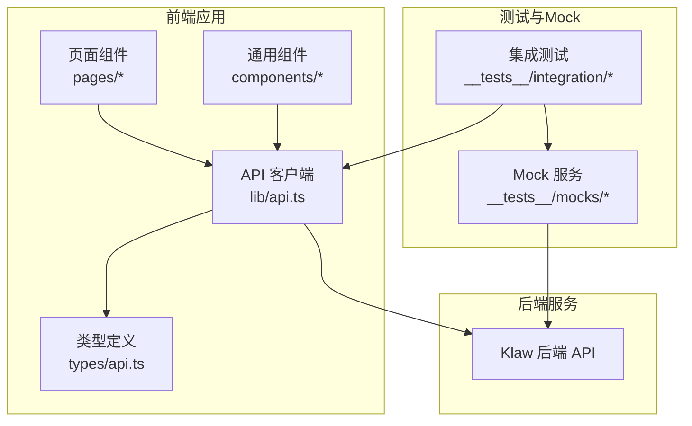
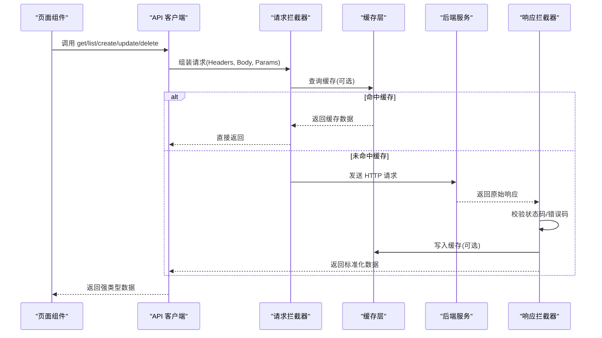
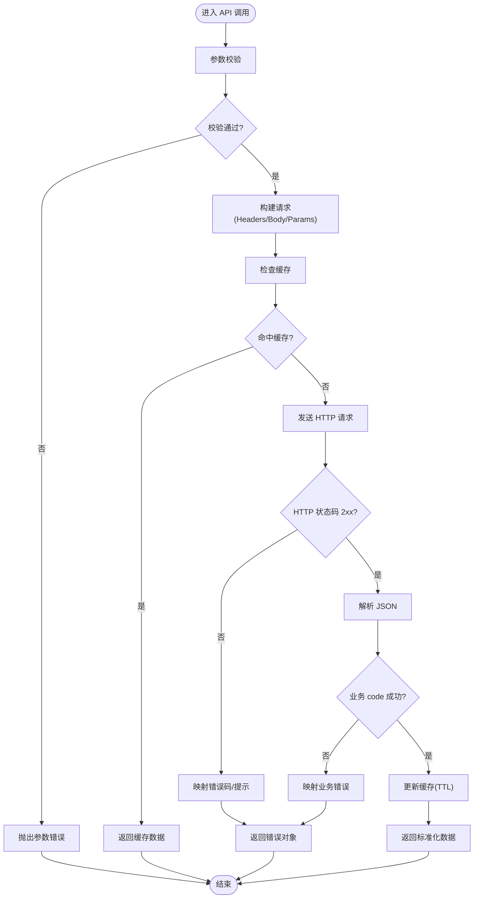
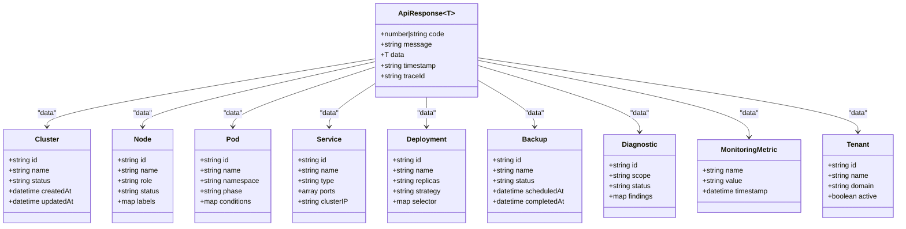
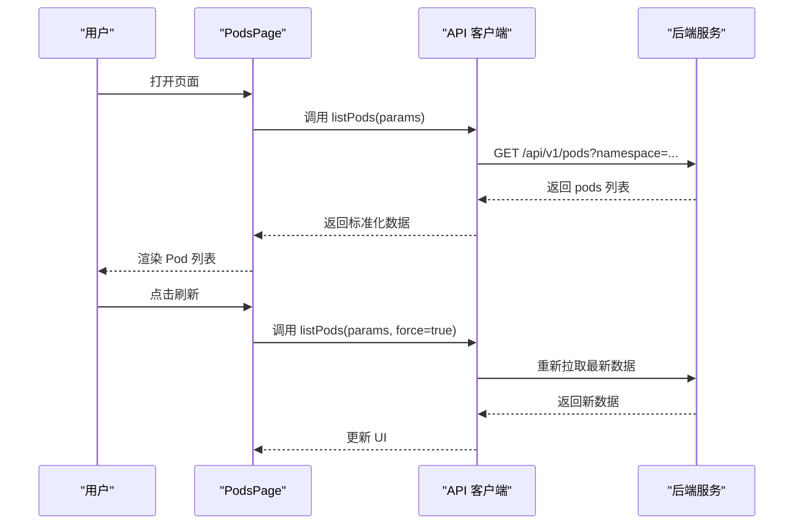
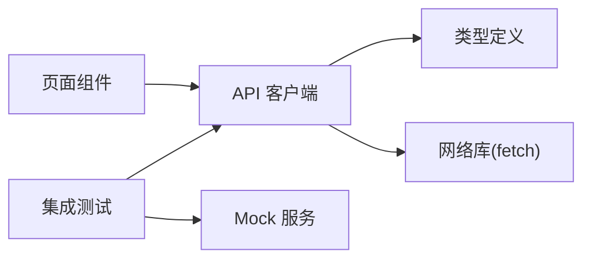

# API集成

<cite>
**本文引用的文件**   
- [web/src/lib/api.ts](file://web/src/lib/api.ts)
- [web/src/types/api.ts](file://web/src/types/api.ts)
- [web/src/pages/ClusterDashboard.tsx](file://web/src/pages/ClusterDashboard.tsx)
- [web/src/pages/PodsPage.tsx](file://web/src/pages/PodsPage.tsx)
- [web/src/pages/ServicesPage.tsx](file://web/src/pages/ServicesPage.tsx)
- [web/src/pages/NodesPage.tsx](file://web/src/pages/NodesPage.tsx)
- [web/src/pages/DeploymentsPage.tsx](file://web/src/pages/DeploymentsPage.tsx)
- [web/src/pages/BackupsPage.tsx](file://web/src/pages/BackupsPage.tsx)
- [web/src/pages/DiagnosticsPage.tsx](file://web/src/pages/DiagnosticsPage.tsx)
- [web/src/pages/MonitoringPage.tsx](file://web/src/pages/MonitoringPage.tsx)
- [web/src/pages/TenantsPage.tsx](file://web/src/pages/TenantsPage.tsx)
- [web/src/components/RefreshButton.tsx](file://web/src/components/RefreshButton.tsx)
- [web/src/__tests__/integration/api.test.ts](file://web/src/__tests__/integration/api.test.ts)
- [web/src/__tests__/integration/error-handling.test.tsx](file://web/src/__tests__/integration/error-handling.test.tsx)
- [web/src/__tests__/mocks/browser.ts](file://web/src/__tests__/mocks/browser.ts)
- [web/src/__tests__/mocks/handlers.ts](file://web/src/__tests__/mocks/handlers.ts)
- [web/src/__tests__/mocks/server.ts](file://web/src/__tests__/mocks/server.ts)
- [web/package.json](file://web/package.json)
- [web/vite.config.ts](file://web/vite.config.ts)
</cite>

## 目录
1. [简介](#简介)
2. [项目结构](#项目结构)
3. [核心组件](#核心组件)
4. [架构总览](#架构总览)
5. [详细组件分析](#详细组件分析)
6. [依赖关系分析](#依赖关系分析)
7. [性能考量](#性能考量)
8. [故障排查指南](#故障排查指南)
9. [结论](#结论)
10. [附录](#附录)

## 简介
本文件面向 Klaw 前端项目的 API 集成层，聚焦 RESTful API 客户端封装、请求拦截器实现与错误处理机制。文档将系统阐述 API 调用封装、参数校验、响应数据转换、缓存策略、TypeScript 类型定义与接口规范、错误码处理，并提供最佳实践、性能优化技巧与调试方法，以及与后端服务的认证和数据同步策略说明。

## 项目结构
Klaw 前端的 API 集成相关代码主要位于 web 子目录：
- lib/api.ts：API 客户端封装（请求/响应拦截、错误处理、基础配置）
- types/api.ts：统一的 TypeScript 类型定义与接口规范
- pages/*：页面级业务逻辑，通过 api.ts 发起 API 调用
- components/RefreshButton.tsx：通用刷新按钮，演示重试与幂等调用
- __tests__/*：集成测试与 Mock 服务，覆盖 API 调用与错误处理流程
- package.json、vite.config.ts：构建与开发环境配置

**图表来源** 
- [web/src/lib/api.ts](file://web/src/lib/api.ts)
- [web/src/types/api.ts](file://web/src/types/api.ts)
- [web/src/pages/ClusterDashboard.tsx](file://web/src/pages/ClusterDashboard.tsx)
- [web/src/__tests__/integration/api.test.ts](file://web/src/__tests__/integration/api.test.ts)
- [web/src/__tests__/mocks/server.ts](file://web/src/__tests__/mocks/server.ts)

**章节来源**
- [web/src/lib/api.ts](file://web/src/lib/api.ts)
- [web/src/types/api.ts](file://web/src/types/api.ts)
- [web/package.json](file://web/package.json)
- [web/vite.config.ts](file://web/vite.config.ts)

## 核心组件
- API 客户端封装（lib/api.ts）
  - 统一请求封装：提供 get/post/put/delete 等方法，集中管理 URL、Headers、超时、重试等
  - 请求拦截器：注入认证令牌、租户上下文、追踪 ID、请求日志
  - 响应拦截器：统一解包响应体、状态码校验、错误映射、数据标准化
  - 错误处理：网络异常、HTTP 错误、业务错误码分类与提示
  - 缓存策略：基于 URL 的内存缓存、过期时间、失效与更新策略
  - 参数验证：入参必填校验、类型检查、边界值限制
  - 重试与退避：指数退避、失败次数上限、幂等请求自动重试
- 类型定义（types/api.ts）
  - 统一响应结构：code、message、data、timestamp、traceId
  - 各模块实体类型：集群、节点、Pod、Service、Deployment、备份、诊断、监控、租户等
  - 错误码枚举：网络错误、权限错误、业务错误、服务端错误
- 页面与组件
  - 页面组件通过 API 客户端获取数据并渲染 UI
  - RefreshButton 提供重试、防抖、节流等交互能力

**章节来源**
- [web/src/lib/api.ts](file://web/src/lib/api.ts)
- [web/src/types/api.ts](file://web/src/types/api.ts)
- [web/src/components/RefreshButton.tsx](file://web/src/components/RefreshButton.tsx)

## 架构总览
API 集成层采用“客户端封装 + 拦截器 + 类型驱动”的分层设计：
- 页面/组件仅依赖类型与 API 客户端方法，不直接操作 HTTP
- 拦截器负责横切关注点（认证、日志、错误、缓存）
- 类型定义保证前后端契约一致，减少运行时错误

**图表来源** 
- [web/src/lib/api.ts](file://web/src/lib/api.ts)
- [web/src/types/api.ts](file://web/src/types/api.ts)
- [web/src/pages/ClusterDashboard.tsx](file://web/src/pages/ClusterDashboard.tsx)

## 详细组件分析

### API 客户端封装（lib/api.ts）
- 功能要点
  - 统一入口：get/post/put/delete 等方法，支持路径参数、查询参数、请求体
  - 请求拦截器：注入 Authorization、X-Tenant、X-Trace-Id、Content-Type 等头部；记录请求开始时间与耗时
  - 响应拦截器：解析 JSON、校验 HTTP 状态码、根据业务 code 判断成功/失败；对错误进行归类与提示
  - 缓存策略：按 URL+Params 生成键，设置 TTL；支持强制刷新与手动失效
  - 参数验证：对必填字段、类型、长度、范围进行校验，失败时抛出结构化错误
  - 重试机制：针对幂等请求（GET/HEAD/OPTIONS）启用指数退避，最大重试次数可配置
- 使用建议
  - 所有页面/组件只调用 API 客户端方法，避免直接使用 fetch/XMLHttpRequest
  - 对敏感参数进行脱敏与加密传输
  - 合理设置超时与重试，避免雪崩效应

**图表来源** 
- [web/src/lib/api.ts](file://web/src/lib/api.ts)

**章节来源**
- [web/src/lib/api.ts](file://web/src/lib/api.ts)

### 类型定义与接口规范（types/api.ts）
- 统一响应结构
  - code：业务状态码（数字或字符串）
  - message：人类可读的错误信息
  - data：业务数据（泛型）
  - timestamp：服务器时间戳
  - traceId：链路追踪 ID
- 错误码分类
  - 网络错误：连接超时、DNS 解析失败、SSL 握手失败
  - 权限错误：未登录、Token 过期、无访问权限
  - 业务错误：参数非法、资源不存在、操作冲突
  - 服务端错误：5xx、未知异常
- 实体类型
  - 集群、节点、Pod、Service、Deployment、备份、诊断、监控指标、租户等
- 契约保障
  - 前后端共享类型，确保数据结构一致性
  - 新增字段需向后兼容，旧客户端忽略未知字段

**图表来源** 
- [web/src/types/api.ts](file://web/src/types/api.ts)

**章节来源**
- [web/src/types/api.ts](file://web/src/types/api.ts)

### 页面与组件中的 API 调用
- 典型调用模式
  - 列表页：分页查询、过滤、排序、缓存
  - 详情页：按需加载、增量更新
  - 表单提交：乐观更新、失败回滚、错误提示
- 示例页面
  - ClusterDashboard：集群概览数据拉取与刷新
  - PodsPage/ServicesPage/NodesPage/DeploymentsPage：资源列表与详情
  - BackupsPage：备份任务管理与状态跟踪
  - DiagnosticsPage：诊断任务创建与结果查看
  - MonitoringPage：监控指标展示与实时刷新
  - TenantsPage：租户管理与权限控制
- 组件复用
  - RefreshButton：提供重试、防抖、节流、加载态

**图表来源** 
- [web/src/pages/PodsPage.tsx](file://web/src/pages/PodsPage.tsx)
- [web/src/lib/api.ts](file://web/src/lib/api.ts)

**章节来源**
- [web/src/pages/ClusterDashboard.tsx](file://web/src/pages/ClusterDashboard.tsx)
- [web/src/pages/PodsPage.tsx](file://web/src/pages/PodsPage.tsx)
- [web/src/pages/ServicesPage.tsx](file://web/src/pages/ServicesPage.tsx)
- [web/src/pages/NodesPage.tsx](file://web/src/pages/NodesPage.tsx)
- [web/src/pages/DeploymentsPage.tsx](file://web/src/pages/DeploymentsPage.tsx)
- [web/src/pages/BackupsPage.tsx](file://web/src/pages/BackupsPage.tsx)
- [web/src/pages/DiagnosticsPage.tsx](file://web/src/pages/DiagnosticsPage.tsx)
- [web/src/pages/MonitoringPage.tsx](file://web/src/pages/MonitoringPage.tsx)
- [web/src/pages/TenantsPage.tsx](file://web/src/pages/TenantsPage.tsx)
- [web/src/components/RefreshButton.tsx](file://web/src/components/RefreshButton.tsx)

### 认证机制与数据同步策略
- 认证
  - Token 注入：在请求头中携带 Authorization Bearer Token
  - Token 刷新：根据响应状态码（如 401）触发刷新流程
  - 多租户：通过 X-Tenant 头区分租户上下文
- 数据同步
  - 缓存优先：先查缓存，再请求后端，最后回填缓存
  - 增量更新：对列表页支持局部更新，减少全量刷新
  - 事件驱动：结合 WebSocket/SSE（若后端支持）实现实时同步
- 安全
  - HTTPS 强制、CSP、CSRF 防护（如适用）
  - 敏感数据脱敏与最小化传输

**章节来源**
- [web/src/lib/api.ts](file://web/src/lib/api.ts)
- [web/src/types/api.ts](file://web/src/types/api.ts)

## 依赖关系分析
- 模块耦合
  - 页面/组件仅依赖 API 客户端与类型定义，低耦合高内聚
  - API 客户端依赖类型定义与网络库（fetch），与具体页面解耦
- 外部依赖
  - 构建工具：Vite
  - 测试框架：Vitest（集成测试）
  - Mock 服务：MSW（模拟浏览器请求）
- 潜在循环依赖
  - 避免在类型文件中引入业务逻辑，防止循环引用

**图表来源** 
- [web/src/lib/api.ts](file://web/src/lib/api.ts)
- [web/src/types/api.ts](file://web/src/types/api.ts)
- [web/src/__tests__/integration/api.test.ts](file://web/src/__tests__/integration/api.test.ts)
- [web/src/__tests__/mocks/server.ts](file://web/src/__tests__/mocks/server.ts)

**章节来源**
- [web/package.json](file://web/package.json)
- [web/vite.config.ts](file://web/vite.config.ts)

## 性能考量
- 缓存策略
  - 合理设置 TTL，避免频繁请求
  - 对热点数据使用持久化缓存（localStorage/sessionStorage）
- 请求优化
  - 合并请求：批量接口减少往返
  - 懒加载：按需加载详情与大图
  - 去重：相同请求去重，避免重复网络开销
- 渲染优化
  - 虚拟列表：大数据集滚动优化
  - 骨架屏：提升首屏体验
- 错误恢复
  - 快速失败与优雅降级
  - 重试与退避避免雪崩

[本节为通用指导，无需特定文件来源]

## 故障排查指南
- 常见问题
  - 401/403：检查 Token 是否有效、权限是否正确
  - 404：确认 URL 与路径参数
  - 500：查看后端日志与 traceId
  - 网络错误：检查代理、跨域、证书
- 调试方法
  - 启用请求/响应日志
  - 使用浏览器开发者工具抓包
  - 使用 Mock 服务隔离后端问题
- 测试覆盖
  - 集成测试覆盖正常与异常路径
  - 错误处理用例覆盖各类错误码

**章节来源**
- [web/src/__tests__/integration/api.test.ts](file://web/src/__tests__/integration/api.test.ts)
- [web/src/__tests__/integration/error-handling.test.tsx](file://web/src/__tests__/integration/error-handling.test.tsx)
- [web/src/__tests__/mocks/browser.ts](file://web/src/__tests__/mocks/browser.ts)
- [web/src/__tests__/mocks/handlers.ts](file://web/src/__tests__/mocks/handlers.ts)
- [web/src/__tests__/mocks/server.ts](file://web/src/__tests__/mocks/server.ts)

## 结论
Klaw 前端的 API 集成层通过统一的客户端封装、拦截器与类型定义，实现了高内聚、低耦合的请求管理。其错误处理、缓存策略与重试机制保障了用户体验与系统稳定性。遵循本文的最佳实践与性能优化建议，可进一步提升前端应用的健壮性与可维护性。

[本节为总结，无需特定文件来源]

## 附录
- 最佳实践清单
  - 始终使用 API 客户端方法，避免直接 HTTP 调用
  - 严格使用类型定义，确保前后端契约一致
  - 合理设置缓存与超时，避免过度请求
  - 完善错误处理与用户提示
  - 编写集成测试覆盖关键路径
- 调试技巧
  - 开启详细日志与追踪 ID
  - 使用 Mock 服务进行离线开发
  - 利用浏览器网络面板分析请求

[本节为补充内容，无需特定文件来源]