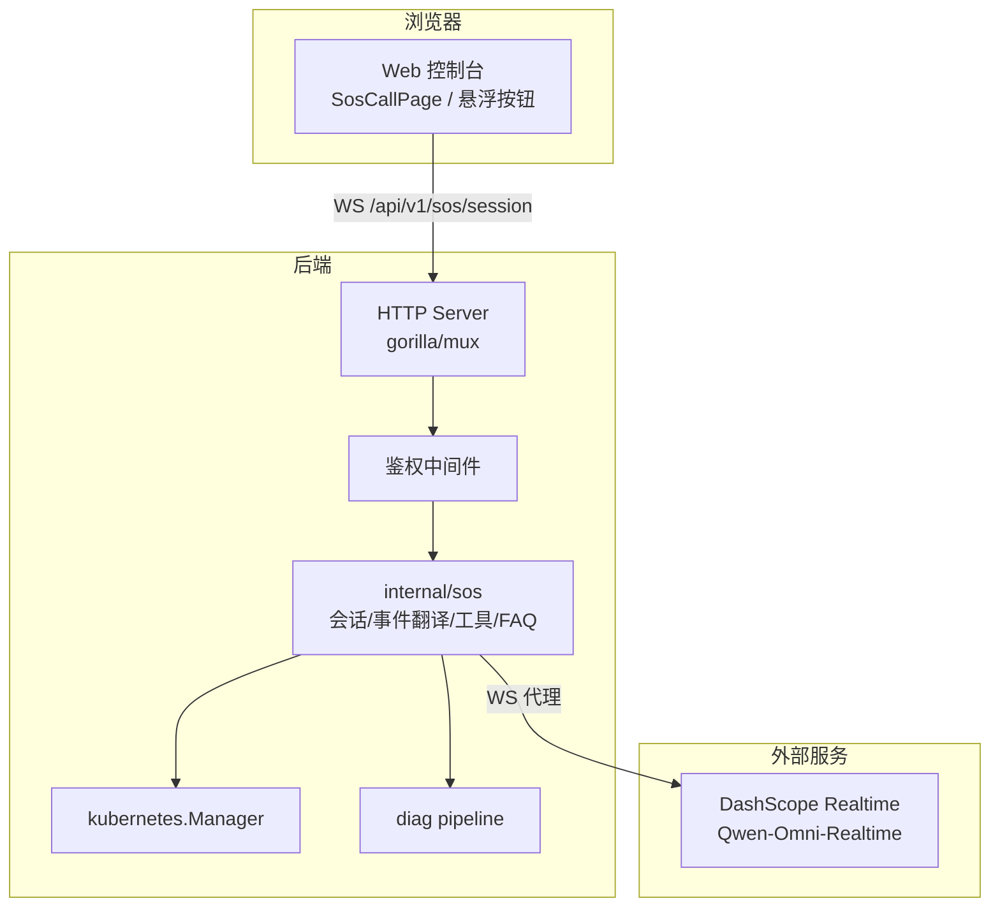
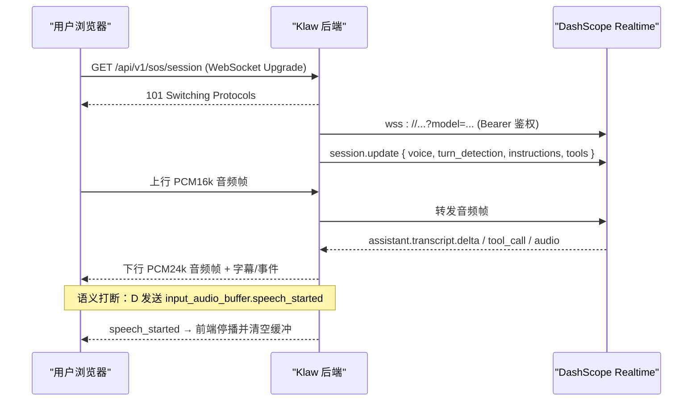
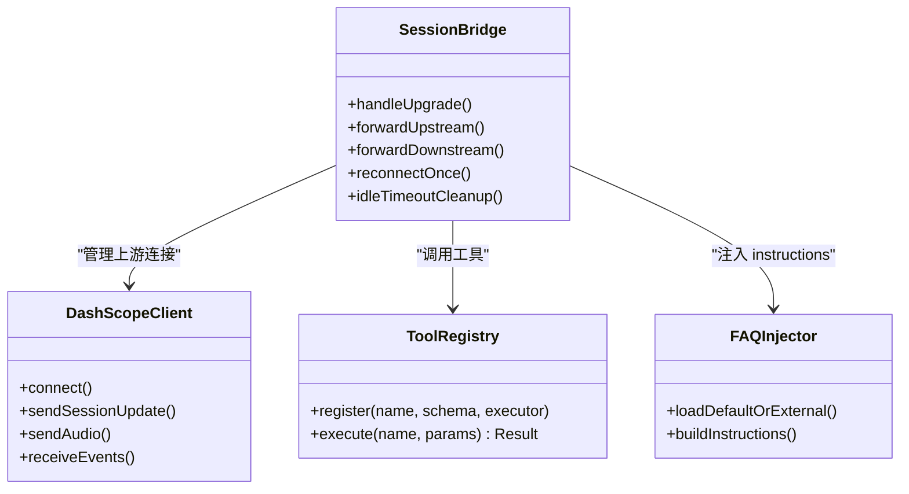
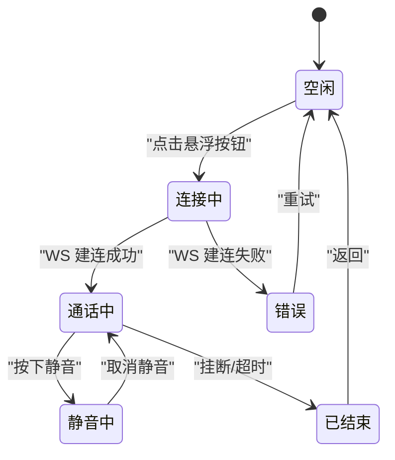
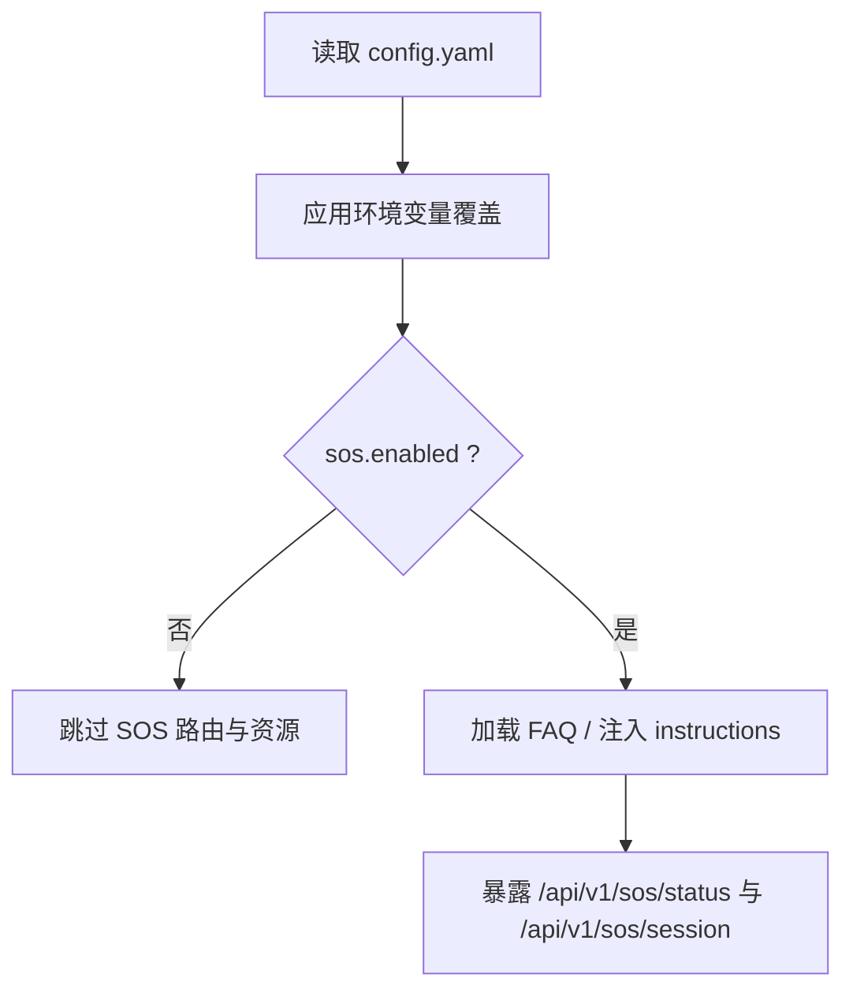
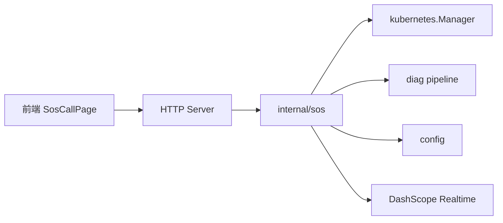

# SOS紧急语音对话模式设计

<cite>
**本文引用的文件**
- [2026-08-25-sos-mode-design.md](file://docs/superpowers/specs/2026-08-25-sos-mode-design.md)
- [README.md](file://README.md)
- [config.yaml](file://configs/config.yaml)
- [server.go](file://internal/api/server.go)
- [config.go](file://internal/config/config.go)
- [pipeline.go](file://internal/diag/pipeline.go)
- [manager.go](file://internal/kubernetes/manager.go)
- [interface.go](file://internal/diag/analyzer/interface.go)
- [App.tsx](file://web/src/App.tsx)
</cite>

## 目录
1. [简介](#简介)
2. [项目结构](#项目结构)
3. [核心组件](#核心组件)
4. [架构总览](#架构总览)
5. [详细组件分析](#详细组件分析)
6. [依赖关系分析](#依赖关系分析)
7. [性能与可用性考虑](#性能与可用性考虑)
8. [故障排查指南](#故障排查指南)
9. [结论](#结论)
10. [附录](#附录)

## 简介
本设计文档面向 Klaw 的“SOS 紧急语音对话模式”，目标是在 Web 控制台提供一键进入的全屏语音通话入口，通过后端 WebSocket 代理与阿里云百炼 DashScope 的 Qwen-Omni-Realtime 实时全双工语音模型对接，实现低延迟、可打断的双向字幕与智能应答。回答采用三层兜底：预置语料 → 集群工具（function calling）→ 模型通用知识；所有密钥与集群访问收敛在后端，浏览器不接触外部 API Key。

该能力将作为现有 Web 控制台、诊断流水线与 ChatOps 能力的补充，聚焦事故现场的“喊一嗓子就有答案”场景。

**章节来源**
- [2026-08-25-sos-mode-design.md:1-19](file://docs/superpowers/specs/2026-08-25-sos-mode-design.md#L1-L19)

## 项目结构
Klaw 为 monorepo，包含主应用、Operator、etcd-guardian 等子模块。SOS 模式主要涉及：
- 后端新增 internal/sos 模块（会话桥接、DashScope 客户端、工具注册与执行、FAQ 注入、路由挂载）
- 前端新增 SOS 页面、悬浮按钮、会话 Hook、API 封装与路由
- 配置新增 sos 段，支持启用开关、DashScope 连接参数、FAQ 文件路径与系统提示前缀
- 复用现有鉴权中间件、Kubernetes 管理器与诊断流水线

**图表来源**
- [server.go:80-163](file://internal/api/server.go#L80-L163)
- [2026-08-25-sos-mode-design.md:60-78](file://docs/superpowers/specs/2026-08-25-sos-mode-design.md#L60-L78)

**章节来源**
- [README.md:92-134](file://README.md#L92-L134)
- [2026-08-25-sos-mode-design.md:88-99](file://docs/superpowers/specs/2026-08-25-sos-mode-design.md#L88-L99)

## 核心组件
- 会话桥接器：负责浏览器 WS 与 DashScope WS 的双向帧转发、事件翻译、断线重连与空闲超时清理
- DashScope 客户端：建连、鉴权、session.update 下发（voice、turn_detection、instructions、tools）
- 工具注册表：定义只读/诊断类工具 schema 并进程内执行，返回脱敏 JSON 给模型
- FAQ 注入器：加载 embed 默认语料或外部覆盖文件，拼装 instructions 片段
- 路由挂载点：在 server.go 中注册 /api/v1/sos/status 与 /api/v1/sos/session（WebSocket Upgrade），复用 Bearer Token 鉴权
- 前端组件：全局悬浮按钮、全屏通话页、会话状态机（AudioWorklet 采集、播放队列、打断停播、字幕累积）、status 探测与会话封装

**章节来源**
- [2026-08-25-sos-mode-design.md:88-117](file://docs/superpowers/specs/2026-08-25-sos-mode-design.md#L88-L117)
- [server.go:80-163](file://internal/api/server.go#L80-L163)

## 架构总览
SOS 模式采用“浏览器 ↔ Klaw 后端 ↔ DashScope Realtime”的两跳链路，音频使用二进制帧，控制与事件使用 JSON 文本帧。会话建立时一次性注入 instructions（系统提示+FAQ）与 tools（集群查询/诊断），模型按三层优先级组织回答。智能打断由服务端 semantic_vad 触发，后端转发 speech_started 事件，前端立即停止本地播放队列。

**图表来源**
- [2026-08-25-sos-mode-design.md:60-78](file://docs/superpowers/specs/2026-08-25-sos-mode-design.md#L60-L78)
- [2026-08-25-sos-mode-design.md:112-117](file://docs/superpowers/specs/2026-08-25-sos-mode-design.md#L112-L117)

## 详细组件分析

### 三层兜底回答逻辑
- 第 1 层：预置语料（FAQ）命中主题时严格按口径作答
- 第 2 层：集群工具（function calling）查询真实数据后作答
- 第 3 层：模型通用知识，未查询实时数据时需明确声明

**图表来源**
- [2026-08-25-sos-mode-design.md:32-59](file://docs/superpowers/specs/2026-08-25-sos-mode-design.md#L32-L59)

**章节来源**
- [2026-08-25-sos-mode-design.md:32-59](file://docs/superpowers/specs/2026-08-25-sos-mode-design.md#L32-L59)

### 后端会话与事件协议
- 文本帧（JSON）：start/mute/unmute/end；session/error；user/assistant transcript delta；tool_call；speech_started 等
- 二进制帧：上行 PCM16k 单声道小端 Int16；下行 PCM24k 音频段
- 会话生命周期：建连、事件翻译、断线重连一次、空闲超时清理

**图表来源**
- [2026-08-25-sos-mode-design.md:88-117](file://docs/superpowers/specs/2026-08-25-sos-mode-design.md#L88-L117)

**章节来源**
- [2026-08-25-sos-mode-design.md:88-117](file://docs/superpowers/specs/2026-08-25-sos-mode-design.md#L88-L117)

### 集群工具清单（第 2 层）
- get_cluster_status：集群健康概览（节点/Pod 统计、异常计数、最近 Warning 事件摘要）
- list_pods：列出 Pod，默认聚焦异常状态
- get_pod_logs：取最近日志，截断防大包
- list_events：最近 Warning/Error 事件列表
- run_diagnosis：触发诊断流水线，同步等待上限 30s，返回问题摘要与修复建议

约束：仅只读或诊断类操作，本期不注册变更类工具，避免语音误操作。

**章节来源**
- [2026-08-25-sos-mode-design.md:100-110](file://docs/superpowers/specs/2026-08-25-sos-mode-design.md#L100-L110)

### 前端交互与状态机
- 悬浮按钮：全局右下角红色按钮，点击进入 /sos
- 全屏通话页：中央头像+呼吸/波形动画、连接状态、双向字幕、底部控制条（静音/挂断）
- 会话 Hook：WS 连接、AudioWorklet 采集 PCM16k、24k 播放队列调度、speech_started 停播打断、字幕累积
- 路由/导航：新增 /sos 路由与菜单项（红色标识）

**图表来源**
- [2026-08-25-sos-mode-design.md:143-153](file://docs/superpowers/specs/2026-08-25-sos-mode-design.md#L143-L153)

**章节来源**
- [2026-08-25-sos-mode-design.md:143-153](file://docs/superpowers/specs/2026-08-25-sos-mode-design.md#L143-L153)

### 配置与环境变量
- 新增 sos 段：enabled、dashscope.api_key/workspace_id/region/model/voice、faq_file、instructions_prefix
- 默认值原则：enabled=false 时全部路由不可用，零开销、零行为变化
- 环境变量优先：敏感项通过环境变量注入（如 KLAW_SOS_DASHSCOPE_API_KEY），与现有 KLAW_API_TOKEN 注入模式一致

**图表来源**
- [2026-08-25-sos-mode-design.md:126-141](file://docs/superpowers/specs/2026-08-25-sos-mode-design.md#L126-L141)
- [config.go:93-147](file://internal/config/config.go#L93-L147)

**章节来源**
- [2026-08-25-sos-mode-design.md:126-141](file://docs/superpowers/specs/2026-08-25-sos-mode-design.md#L126-L141)
- [config.go:93-147](file://internal/config/config.go#L93-L147)

### 与现有系统的集成点
- 鉴权：复用 Bearer Token 中间件，确保会话安全
- 集群访问：通过 kubernetes.Manager 获取 Clientset，工具执行只读/诊断
- 诊断流水线：run_diagnosis 工具调用内部 diag pipeline，返回问题摘要与建议
- 审计：仅记录会话开始/结束/工具调用元数据，不持久化音频与转写内容

**章节来源**
- [server.go:80-163](file://internal/api/server.go#L80-L163)
- [manager.go:25-42](file://internal/kubernetes/manager.go#L25-L42)
- [pipeline.go:33-80](file://internal/diag/pipeline.go#L33-L80)

## 依赖关系分析
SOS 模块对现有子系统形成单向依赖，避免反向引用：
- api → sos → kubernetes.Manager / diag pipeline / config
- 前端 → 后端 WS（同源）→ DashScope Realtime（后端代理）

**图表来源**
- [server.go:80-163](file://internal/api/server.go#L80-L163)
- [2026-08-25-sos-mode-design.md:88-99](file://docs/superpowers/specs/2026-08-25-sos-mode-design.md#L88-L99)

**章节来源**
- [2026-08-25-sos-mode-design.md:88-99](file://docs/superpowers/specs/2026-08-25-sos-mode-design.md#L88-L99)

## 性能与可用性考虑
- 低延迟：全双工 Realtime 语义打断，避免 ASR+LLM+TTS 串联开销
- 高可用：后端自动重连一次，失败则结束会话并提示；空闲超时释放上游连接
- 可扩展：FAQ 可外部覆盖，工具可增量注册，不影响已有关联功能
- 资源占用：音频流仅在会话期间存在，无持久化存储；工具输出截断防止大包

[本节为通用指导，无需特定文件引用]

## 故障排查指南
- 未配置/无效 DashScope Key：/sos/status 返回 ready=false，前端展示配置引导
- DashScope 建连失败/断开：后端重连一次，失败下发 error 事件并结束会话
- 浏览器 WS 断开：后端关闭上游会话、释放资源
- 工具执行失败/超时：错误经 function_call_output 回传，模型口头告知；run_diagnosis 超 30s 返回超时提示
- 麦克风不可用：前端检测安全上下文与权限，展示引导，不建连

**章节来源**
- [2026-08-25-sos-mode-design.md:172-181](file://docs/superpowers/specs/2026-08-25-sos-mode-design.md#L172-L181)

## 结论
SOS 紧急语音对话模式以“后端代理 + 实时全双工语音 + 三层兜底”为核心，将应急运维入口从层层页面切换到“语音即问即答”。通过严格的安全边界（密钥留在后端）、可控的工具集（只读/诊断）与可维护的语料体系（YAML + embed），在不影响现有功能的前提下，显著提升事故现场响应效率。后续可按需扩展多音色、录音回放、ChatOps 文字秒回与向量检索等能力。

[本节为总结性内容，无需特定文件引用]

## 附录
- 验收标准：悬浮按钮与菜单均可进入 /sos；完成一次全双工语音对话（可打断、有字幕、可静音、挂断释放）；三层兜底生效；测试全绿且未启用 sos 时无回归
- 非目标（本期不做）：语料在线管理、录音回放、WebRTC、跨页面会话保持、ChatOps 侧 SOS 文字秒回、语料向量检索/RAG

**章节来源**
- [2026-08-25-sos-mode-design.md:205-219](file://docs/superpowers/specs/2026-08-25-sos-mode-design.md#L205-L219)