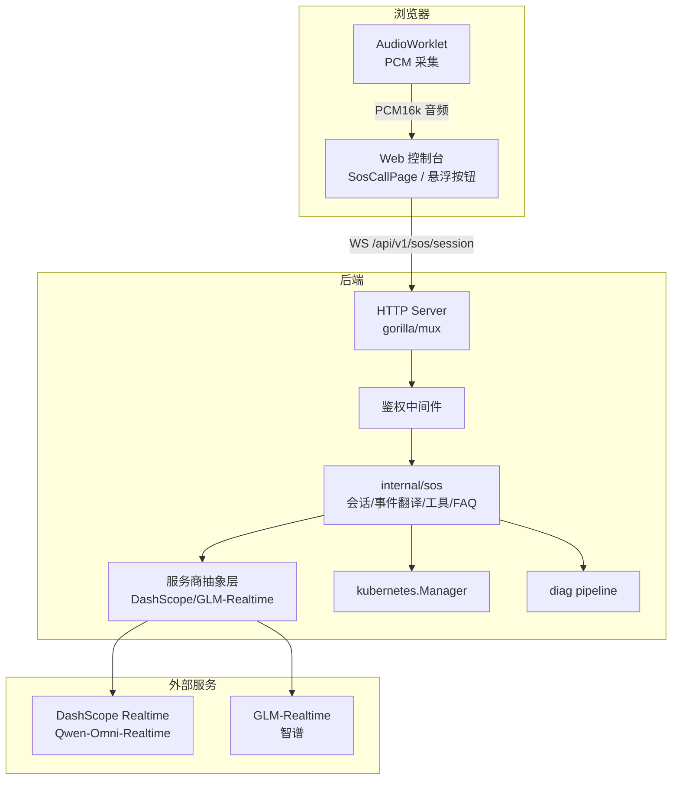
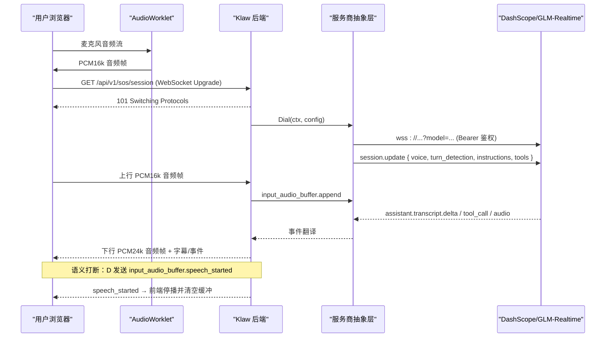
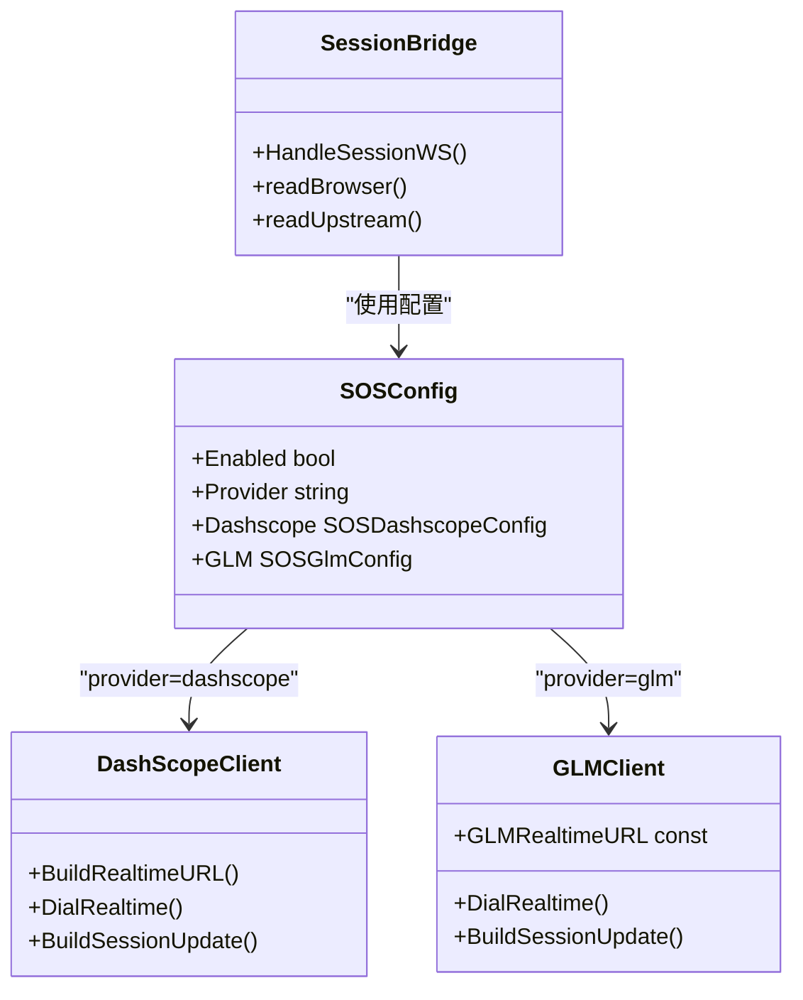
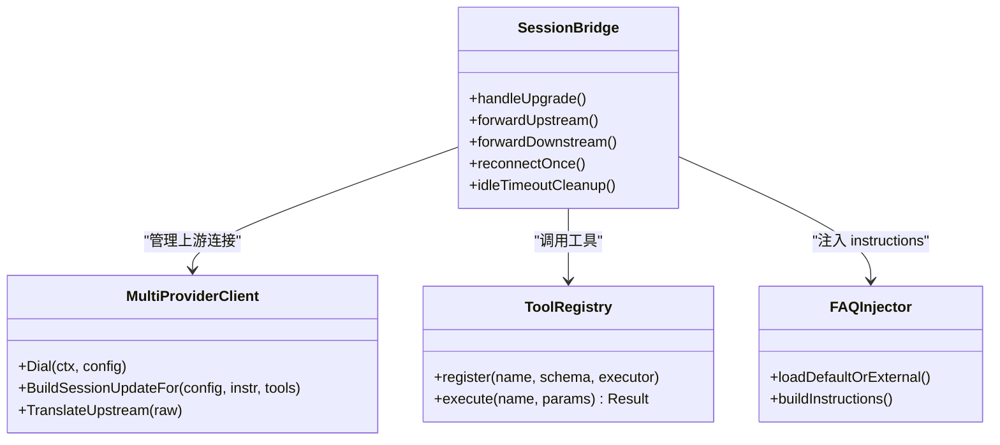
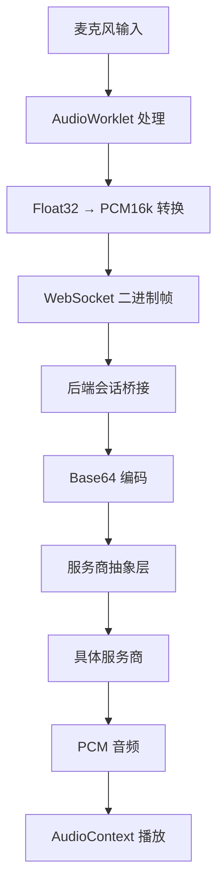
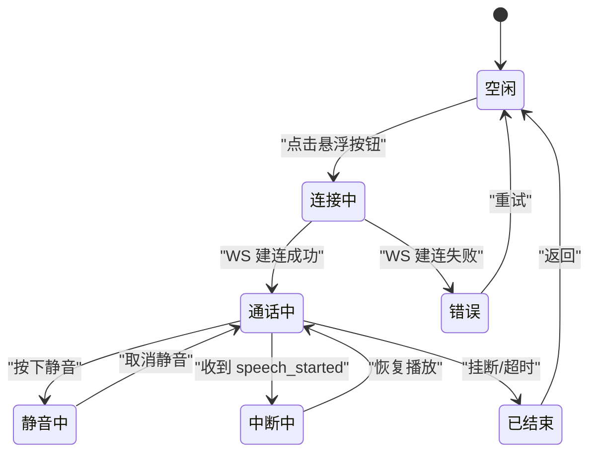
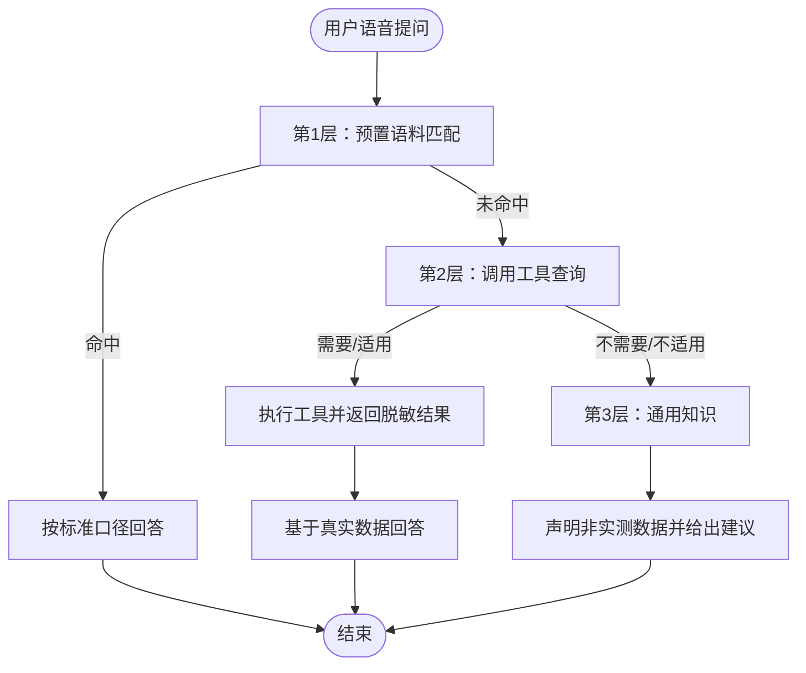
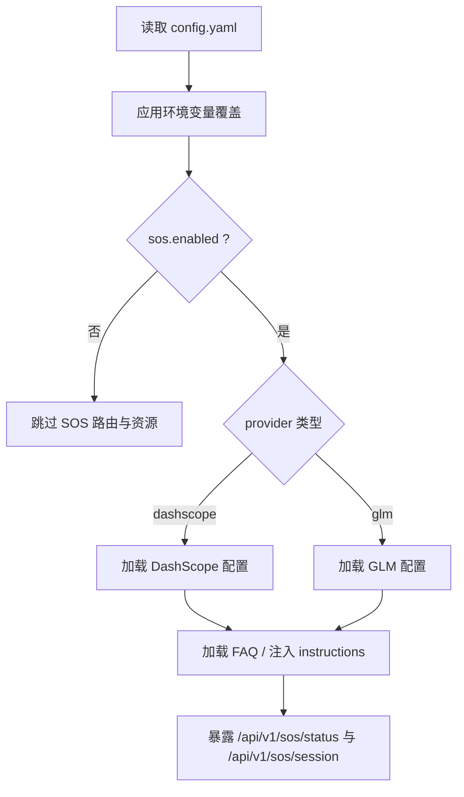
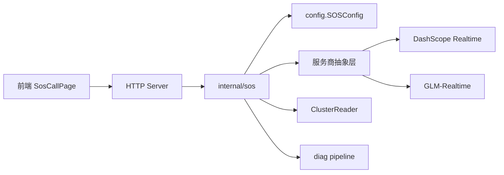

# SOS紧急语音对话模式设计

<cite>
**本文引用的文件**
- [session.go](file://internal/sos/session.go)
- [dashscope.go](file://internal/sos/dashscope.go)
- [tools.go](file://internal/sos/tools.go)
- [faq.go](file://internal/sos/faq.go)
- [config.go](file://internal/config/config.go)
- [sosProtocol.ts](file://web/src/lib/sosProtocol.ts)
- [pcm-processor.ts](file://web/src/worklets/pcm-processor.ts)
- [useSosSession.ts](file://web/src/hooks/useSosSession.ts)
- [sosApi.ts](file://web/src/lib/sosApi.ts)
- [SosCallPage.tsx](file://web/src/pages/SosCallPage.tsx)
- [SosFloatingButton.tsx](file://web/src/components/SosFloatingButton.tsx)
- [sos.go](file://internal/api/sos.go)
- [config.yaml](file://configs/config.yaml)
- [sos-faq.yaml](file://configs/sos-faq.yaml)
</cite>

## 更新摘要
**变更内容**
- 实现了服务商抽象层，支持DashScope和GLM-Realtime多提供商架构
- 增强了会话管理功能，支持通过WebSocket start消息指定目标集群进行工具调用
- 添加了工具执行超时保护机制（20秒默认超时），防止Kubernetes API调用导致的goroutine泄漏
- 改进了WebSocket协议，start消息类型现在支持可选的cluster参数用于集群选择
- 增强了前端状态管理，提供实时的工具调用反馈显示
- 完善了错误处理和资源清理机制

## 目录
1. [简介](#简介)
2. [项目结构](#项目结构)
3. [核心组件](#核心组件)
4. [架构总览](#架构总览)
5. [详细组件分析](#详细组件分析)
6. [依赖关系分析](#依赖关系分析)
7. [性能与可用性考虑](#性能与可用性考虑)
8. [故障排查指南](#故障排查指南)
9. [结论](#结论)
10. [附录](#附录)

## 简介
本设计文档面向 Klaw 的"SOS 紧急语音对话模式"，目标是在 Web 控制台提供一键进入的全屏语音通话入口，通过后端 WebSocket 代理与阿里云百炼 DashScope 或智谱 GLM-Realtime 实时全双工语音模型对接，实现低延迟、可打断的双向字幕与智能应答。回答采用三层兜底：预置语料 → 集群工具（function calling）→ 模型通用知识；所有密钥与集群访问收敛在后端，浏览器不接触外部 API Key。

该能力将作为现有 Web 控制台、诊断流水线与 ChatOps 能力的补充，聚焦事故现场的"喊一嗓子就有答案"场景。

## 项目结构
Klaw 为 monorepo，包含主应用、Operator、etcd-guardian 等子模块。SOS 模式主要涉及：
- 后端新增 internal/sos 模块（会话桥接、多提供商客户端、工具注册与执行、FAQ 注入、路由挂载）
- 前端新增 SOS 页面、悬浮按钮、会话 Hook、API 封装与路由
- 配置新增 sos 段，支持启用开关、多提供商连接参数、FAQ 文件路径与系统提示前缀
- 复用现有鉴权中间件、Kubernetes 管理器与诊断流水线

**图表来源**
- [session.go:91-110](file://internal/sos/session.go#L91-L110)
- [dashscope.go:24-70](file://internal/sos/dashscope.go#L24-L70)
- [useSosSession.ts:50-102](file://web/src/hooks/useSosSession.ts#L50-L102)
- [sos.go:11-36](file://internal/api/sos.go#L11-L36)

## 核心组件
- 会话桥接器：负责浏览器 WS 与上游 Realtime 服务的双向帧转发、事件翻译、断线重连与空闲超时清理
- 服务商抽象层：统一处理 DashScope 和 GLM-Realtime 的连接建立、鉴权与会话配置下发
- 工具注册表：定义只读/诊断类工具 schema 并进程内执行，返回脱敏 JSON 给模型
- FAQ 注入器：加载 embed 默认语料或外部覆盖文件，拼装 instructions 片段
- 路由挂载点：在 server.go 中注册 /api/v1/sos/status 与 /api/v1/sos/session（WebSocket Upgrade），复用 Bearer Token 鉴权
- 前端组件：全局悬浮按钮、全屏通话页、会话状态机（AudioWorklet 采集、播放队列、打断停播、字幕累积）、status 探测与会话封装

**章节来源**
- [session.go:37-61](file://internal/sos/session.go#L37-L61)
- [dashscope.go:24-92](file://internal/sos/dashscope.go#L24-L92)
- [tools.go:43-86](file://internal/sos/tools.go#L43-L86)
- [faq.go:28-68](file://internal/sos/faq.go#L28-L68)
- [sos.go:11-36](file://internal/api/sos.go#L11-L36)

## 架构总览
SOS 模式采用"浏览器 ↔ Klaw 后端 ↔ 服务商抽象层 ↔ 具体服务商"的多跳链路，音频使用二进制帧，控制与事件使用 JSON 文本帧。会话建立时一次性注入 instructions（系统提示+FAQ）与 tools（集群查询/诊断），模型按三层优先级组织回答。智能打断由服务端 semantic_vad 触发，后端转发 speech_started 事件，前端立即停止本地播放队列。

**图表来源**
- [session.go:127-169](file://internal/sos/session.go#L127-L169)
- [dashscope.go:37-70](file://internal/sos/dashscope.go#L37-L70)
- [useSosSession.ts:73-95](file://web/src/hooks/useSosSession.ts#L73-L95)

## 详细组件分析

### 多提供商架构实现
- **服务商抽象层**：通过 `DialRealtime` 函数统一处理不同服务商的连接建立
- **配置驱动**：根据 `config.SOSConfig.Provider` 字段自动选择 DashScope 或 GLM-Realtime
- **差异化配置**：各服务商拥有独立的配置结构体（`SOSDashscopeConfig`、`SOSGlmConfig`）
- **会话配置适配**：`BuildSessionUpdateFor` 函数根据服务商特性生成对应的 session.update 消息

**更新** 新增了完整的服务商抽象层，支持运行时切换不同的语音服务提供商。

**图表来源**
- [config.go:175-199](file://internal/config/config.go#L175-L199)
- [dashscope.go:24-92](file://internal/sos/dashscope.go#L24-L92)
- [session.go:122-143](file://internal/sos/session.go#L122-L143)

**章节来源**
- [config.go:175-199](file://internal/config/config.go#L175-L199)
- [dashscope.go:24-92](file://internal/sos/dashscope.go#L24-L92)
- [config.go:163-173](file://internal/config/config.go#L163-L173)

### WebSocket 协议与会话管理
- 文本帧（JSON）：start/mute/unmute/end；session/error；user/assistant transcript delta；tool_call；speech_started 等
- 二进制帧：上行 PCM16k 单声道小端 Int16；下行 PCM24k 音频段
- 会话生命周期：建连、事件翻译、断线重连一次、空闲超时清理（5分钟）
- 错误处理：上游读取错误自动重连一次，失败则结束会话并提示
- **新增功能**：start消息支持可选cluster参数，允许在会话开始时指定目标集群

**更新** 会话管理现在支持多集群环境下的精确工具调用，通过start消息中的cluster参数指定目标集群。

**图表来源**
- [session.go:112-187](file://internal/sos/session.go#L112-L187)
- [dashscope.go:24-92](file://internal/sos/dashscope.go#L24-L92)

**章节来源**
- [session.go:17-21](file://internal/sos/session.go#L17-L21)
- [session.go:127-187](file://internal/sos/session.go#L127-L187)
- [dashscope.go:100-139](file://internal/sos/dashscope.go#L100-L139)

### PCM 音频处理流程
- 前端采集：AudioWorklet 从麦克风获取 Float32 音频流，线性插值下采样到 16kHz
- 格式转换：Float32 [-1,1] → Int16 小端 PCM，通过 WebSocket 二进制帧发送
- 后端转发：接收 PCM 数据后编码为 base64 的 input_audio_buffer.append 事件
- 播放处理：接收 24kHz PCM 数据，转换为 Float32 并通过 AudioContext 播放

**图表来源**
- [pcm-processor.ts:8-39](file://web/src/worklets/pcm-processor.ts#L8-L39)
- [sosProtocol.ts:97-116](file://web/src/lib/sosProtocol.ts#L97-L116)
- [dashscope.go:58-64](file://internal/sos/dashscope.go#L58-L64)

**章节来源**
- [pcm-processor.ts:8-39](file://web/src/worklets/pcm-processor.ts#L8-L39)
- [sosProtocol.ts:97-116](file://web/src/lib/sosProtocol.ts#L97-L116)
- [useSosSession.ts:63-95](file://web/src/hooks/useSosSession.ts#L63-L95)

### 语义中断处理机制
- 服务端检测：DashScope 的 semantic_vad 检测到用户说话时发送 input_audio_buffer.speech_started
- 事件转发：后端 TranslateUpstream 将事件转换为 speech_started 发送给前端
- 前端响应：收到 speech_started 后立即停止当前播放队列，避免音频重叠
- 状态同步：重置 speaking 标记，确保 UI 状态与实际播放状态一致

**图表来源**
- [useSosSession.ts:76-79](file://web/src/hooks/useSosSession.ts#L76-L79)
- [sosProtocol.ts:77-79](file://web/src/lib/sosProtocol.ts#L77-L79)

**章节来源**
- [dashscope.go:110-112](file://internal/sos/dashscope.go#L110-L112)
- [useSosSession.ts:76-79](file://web/src/hooks/useSosSession.ts#L76-L79)
- [sosProtocol.ts:77-79](file://web/src/lib/sosProtocol.ts#L77-L79)

### 三层兜底回答逻辑
- 第 1 层：预置语料（FAQ）命中主题时严格按口径作答
- 第 2 层：集群工具（function calling）查询真实数据后作答
- 第 3 层：模型通用知识，未查询实时数据时需明确声明

**图表来源**
- [faq.go:48-68](file://internal/sos/faq.go#L48-L68)
- [tools.go:57-86](file://internal/sos/tools.go#L57-L86)

**章节来源**
- [faq.go:48-68](file://internal/sos/faq.go#L48-L68)
- [tools.go:57-86](file://internal/sos/tools.go#L57-L86)

### 集群工具清单（第 2 层）
- get_cluster_status：集群健康概览（节点/Pod 统计、异常计数、最近 Warning 事件摘要）
- list_pods：列出 Pod，默认聚焦异常状态
- get_pod_logs：取最近日志，截断防大包
- list_events：最近 Warning/Error 事件列表
- run_diagnosis：触发诊断流水线，同步等待上限 30s，返回问题摘要与修复建议

约束：仅只读或诊断类操作，本期不注册变更类工具，避免语音误操作。

**章节来源**
- [tools.go:57-86](file://internal/sos/tools.go#L57-L86)
- [tools.go:88-104](file://internal/sos/tools.go#L88-L104)

### 前端交互与状态机
- 悬浮按钮：全局右下角红色按钮，点击进入 /sos
- 全屏通话页：中央头像+呼吸/波形动画、连接状态、双向字幕、底部控制条（静音/挂断）
- 会话 Hook：WS 连接、AudioWorklet 采集 PCM16k、24k 播放队列调度、speech_started 停播打断、字幕累积
- 路由/导航：新增 /sos 路由与菜单项（红色标识）
- **新增功能**：实时工具调用状态显示，为用户提供"正在查询集群"的视觉反馈

**更新** 前端现在显示实时的工具调用状态，当执行集群查询时会在界面中显示相应的提示信息。

**章节来源**
- [SosFloatingButton.tsx:5-22](file://web/src/components/SosFloatingButton.tsx#L5-L22)
- [SosCallPage.tsx:16-127](file://web/src/pages/SosCallPage.tsx#L16-L127)
- [useSosSession.ts:11-124](file://web/src/hooks/useSosSession.ts#L11-L124)

### 配置与环境变量
- 新增 sos 段：enabled、provider、dashscope/glm 配置、faq_file、instructions_prefix
- 默认值原则：enabled=false 时全部路由不可用，零开销、零行为变化
- 环境变量优先：敏感项通过环境变量注入（如 KLAW_SOS_DASHSCOPE_API_KEY、KLAW_SOS_GLM_API_KEY），与现有 KLAW_API_TOKEN 注入模式一致
- **新增功能**：provider 字段支持 "dashscope"（默认）和 "glm" 两种值，大小写不敏感

**更新** 配置系统现在支持多提供商配置，包括 DashScope 和 GLM-Realtime 的完整参数设置。

**图表来源**
- [config.yaml:68-82](file://configs/config.yaml#L68-L82)
- [faq.go:28-46](file://internal/sos/faq.go#L28-L46)
- [config.go:163-173](file://internal/config/config.go#L163-L173)

**章节来源**
- [config.yaml:68-82](file://configs/config.yaml#L68-L82)
- [faq.go:28-46](file://internal/sos/faq.go#L28-L46)
- [config.go:163-173](file://internal/config/config.go#L163-L173)

### 与现有系统的集成点
- 鉴权：复用 Bearer Token 中间件，支持 ?token= 查询参数（浏览器限制）
- 集群访问：通过 ClusterReader 接口获取 Kubernetes 资源，工具执行只读/诊断
- 诊断流水线：run_diagnosis 工具调用内部 diag pipeline，返回问题摘要与建议
- 审计：仅记录会话开始/结束/工具调用元数据，不持久化音频与转写内容

**章节来源**
- [sos.go:25-49](file://internal/api/sos.go#L25-L49)
- [tools.go:14-20](file://internal/sos/tools.go#L14-L20)
- [tools.go:294-321](file://internal/sos/tools.go#L294-L321)

### 增强的集群选择功能
- **集群参数传递**：WebSocket start消息现在支持可选的cluster参数，允许在会话开始时指定目标集群
- **会话级集群绑定**：会话建立后，所有工具调用都会作用于指定的集群，如果未指定则使用默认集群
- **向后兼容**：cluster参数为可选，不影响现有功能的正常使用

**更新** 新增了集群选择功能，支持在多集群环境下精确控制工具调用的目标集群。

**章节来源**
- [session.go:251-265](file://internal/sos/session.go#L251-L265)
- [tools.go:93-117](file://internal/sos/tools.go#L93-L117)

### 工具执行超时保护机制
- **超时保护**：每个工具执行都有20秒的默认超时限制，防止Kubernetes API调用长时间挂起导致goroutine泄漏
- **异步执行**：工具调用在独立goroutine中执行，通过context.Context进行超时控制
- **优雅降级**：超时后返回错误信息，模型会口头告知用户工具执行超时
- **资源清理**：超时的goroutine会通过缓冲channel安全退出，避免资源泄漏

**更新** 添加了完善的工具执行超时保护机制，确保系统在高负载下的稳定性。

**章节来源**
- [session.go:25-26](file://internal/sos/session.go#L25-L26)
- [tools.go:93-117](file://internal/sos/tools.go#L93-L117)
- [tools.go:324-351](file://internal/sos/tools.go#L324-L351)

## 依赖关系分析
SOS 模块对现有子系统形成单向依赖，避免反向引用：
- api → sos → kubernetes.Manager / diag pipeline / config
- 前端 → 后端 WS（同源）→ 服务商抽象层 → 具体服务商

**图表来源**
- [sos.go:11-36](file://internal/api/sos.go#L11-L36)
- [tools.go:14-20](file://internal/sos/tools.go#L14-L20)
- [dashscope.go:24-70](file://internal/sos/dashscope.go#L24-L70)

**章节来源**
- [sos.go:11-36](file://internal/api/sos.go#L11-L36)
- [tools.go:14-20](file://internal/sos/tools.go#L14-L20)

## 性能与可用性考虑
- 低延迟：全双工 Realtime 语义打断，避免 ASR+LLM+TTS 串联开销
- 高可用：后端自动重连一次，失败则结束会话并提示；空闲超时释放上游连接
- 可扩展：FAQ 可外部覆盖，工具可增量注册，不影响已有关联功能
- 资源占用：音频流仅在会话期间存在，无持久化存储；工具输出截断防止大包
- **新增**：工具执行超时保护防止goroutine泄漏，提升系统稳定性
- **新增**：集群选择功能支持多集群环境下的精确控制
- **新增**：多提供商架构支持灵活切换不同的语音服务提供商

## 故障排查指南
- 未配置/无效 API Key：/sos/status 返回 ready=false，前端展示配置引导
- 服务商建连失败/断开：后端重连一次，失败下发 error 事件并结束会话
- 浏览器 WS 断开：后端关闭上游会话、释放资源
- 工具执行失败/超时：错误经 function_call_output 回传，模型口头告知；run_diagnosis 超 30s 返回超时提示
- 麦克风不可用：前端检测安全上下文与权限，展示引导，不建连
- **新增**：集群选择错误：如果指定的集群不存在，工具调用会返回相应错误信息
- **新增**：提供商配置错误：根据 provider 类型检查相应的必需配置项

**章节来源**
- [session.go:156-166](file://internal/sos/session.go#L156-L166)
- [tools.go:301-308](file://internal/sos/tools.go#L301-L308)
- [SosCallPage.tsx:47-58](file://web/src/pages/SosCallPage.tsx#L47-L58)
- [dashscope.go:44-61](file://internal/sos/dashscope.go#L44-L61)

## 结论
SOS 紧急语音对话模式以"后端代理 + 实时全双工语音 + 三层兜底 + 多提供商支持"为核心，将应急运维入口从层层页面切换到"语音即问即答"。通过严格的安全边界（密钥留在后端）、可控的工具集（只读/诊断）与可维护的语料体系（YAML + embed），在不影响现有功能的前提下，显著提升事故现场响应效率。

**更新后的增强功能**包括：
- 多提供商架构：支持 DashScope 和 GLM-Realtime 两种语音服务提供商
- 多集群环境支持：通过start消息的cluster参数精确控制工具调用目标
- 系统稳定性保障：工具执行超时保护防止goroutine泄漏
- 用户体验优化：实时工具调用状态反馈，让用户了解系统工作状态

后续可按需扩展多音色、录音回放、ChatOps 文字秒回与向量检索等能力。

## 附录
- 验收标准：悬浮按钮与菜单均可进入 /sos；完成一次全双工语音对话（可打断、有字幕、可静音、挂断释放）；三层兜底生效；测试全绿且未启用 sos 时无回归
- 非目标（本期不做）：语料在线管理、录音回放、WebRTC、跨页面会话保持、ChatOps 侧 SOS 文字秒回、语料向量检索/RAG

**章节来源**
- [SosFloatingButton.tsx:5-22](file://web/src/components/SosFloatingButton.tsx#L5-L22)
- [SosCallPage.tsx:16-127](file://web/src/pages/SosCallPage.tsx#L16-L127)
- [session.go:17-21](file://internal/sos/session.go#L17-L21)