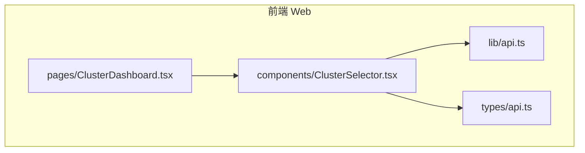
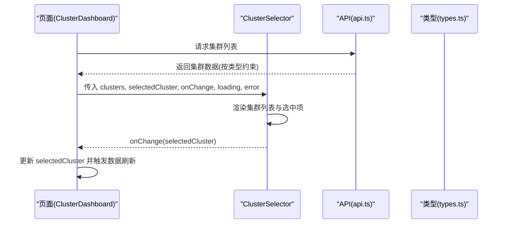
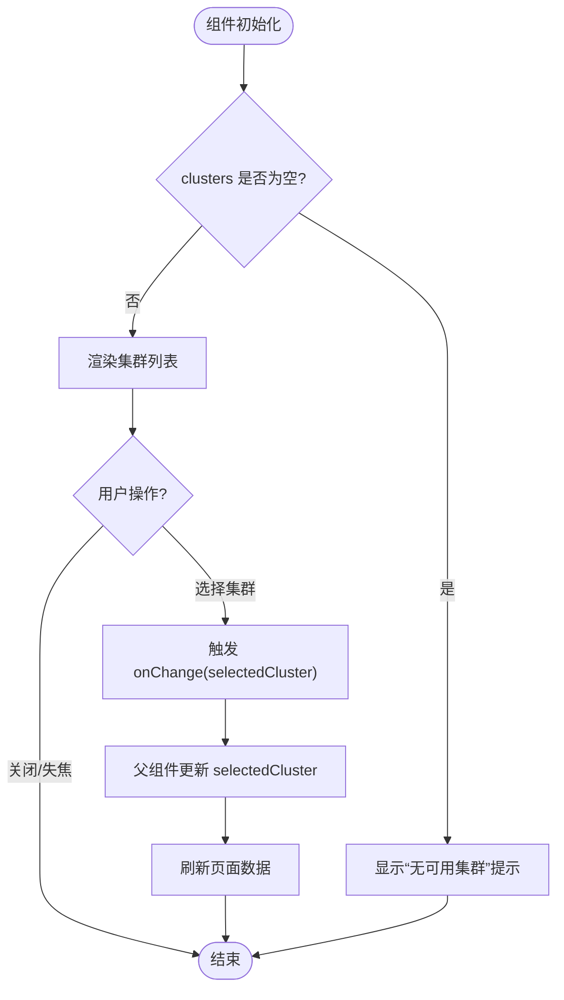
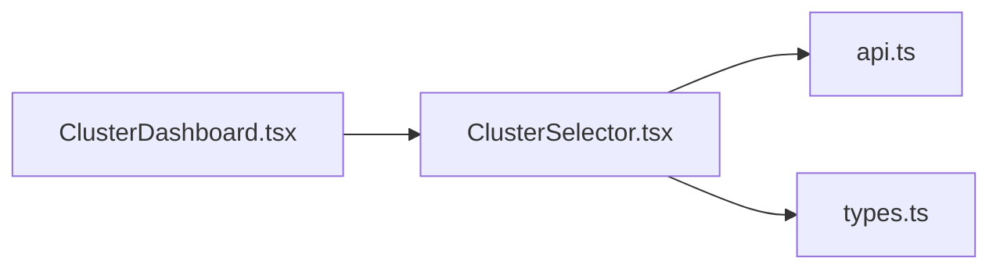

# ClusterSelector 集群选择器

<cite>
**本文档引用的文件**   
- [ClusterSelector.tsx](file://web/src/components/ClusterSelector.tsx)
- [ClusterDashboard.tsx](file://web/src/pages/ClusterDashboard.tsx)
- [api.ts](file://web/src/lib/api.ts)
- [types.ts](file://web/src/types/api.ts)
</cite>

## 目录
1. [简介](#简介)
2. [项目结构](#项目结构)
3. [核心组件](#核心组件)
4. [架构总览](#架构总览)
5. [详细组件分析](#详细组件分析)
6. [依赖分析](#依赖分析)
7. [性能考虑](#性能考虑)
8. [故障排查指南](#故障排查指南)
9. [结论](#结论)
10. [附录](#附录)

## 简介
本文件为 ClusterSelector（集群选择器）组件的完整技术文档。该组件用于在多个 Kubernetes 集群之间进行选择与切换，提供属性配置、事件回调、加载状态处理与错误处理等能力，并包含样式定制选项、国际化支持与无障碍访问特性说明。同时给出具体使用示例与最佳实践，帮助开发者在页面中集成和使用该组件。

## 项目结构
ClusterSelector 位于前端 web 模块的 components 目录，被页面级组件（如 ClusterDashboard）引用以完成集群上下文的选择与切换。相关类型定义与 API 调用封装分别位于 types 与 lib 目录。

图表来源
- [ClusterSelector.tsx](file://web/src/components/ClusterSelector.tsx)
- [ClusterDashboard.tsx](file://web/src/pages/ClusterDashboard.tsx)
- [api.ts](file://web/src/lib/api.ts)
- [types.ts](file://web/src/types/api.ts)

章节来源
- [ClusterSelector.tsx](file://web/src/components/ClusterSelector.tsx)
- [ClusterDashboard.tsx](file://web/src/pages/ClusterDashboard.tsx)
- [api.ts](file://web/src/lib/api.ts)
- [types.ts](file://web/src/types/api.ts)

## 核心组件
- 组件职责：展示可用集群列表，支持用户选择当前工作集群；在选中变化时触发回调，驱动上层页面刷新或重新拉取数据。
- 关键属性
  - clusters: 集群列表数据源（受控），由父组件通过 API 获取并传入。
  - selectedCluster: 当前选中的集群标识（受控），用于同步 UI 显示状态。
  - onChange: 选中变更回调，接收新选中的集群标识。
  - loading: 数据加载状态，控制下拉框或列表的禁用与提示文案。
  - error: 错误信息，用于展示加载失败或校验失败的提示。
  - placeholder: 占位文本，便于国际化。
  - disabled: 是否禁用选择器。
  - className / style: 样式定制入口。
- 事件回调机制
  - onChange(selectedCluster): 当用户选择新的集群时触发，父组件应更新 selectedCluster 并执行后续逻辑（如刷新数据）。
- 加载与错误处理
  - loading=true 时，组件进入加载态，禁用交互并显示加载提示。
  - error 非空时，组件展示错误提示，并提供重试入口（由父组件实现）。
- 国际化支持
  - 所有用户可见文案（占位符、按钮、提示）均通过可替换的字符串属性注入，便于接入 i18n 库。
- 无障碍访问
  - 使用语义化标签与 ARIA 属性，确保键盘可达与屏幕阅读器友好。

章节来源
- [ClusterSelector.tsx](file://web/src/components/ClusterSelector.tsx)

## 架构总览
ClusterSelector 作为受控组件，由父页面管理数据与状态，并通过 props 进行双向同步。API 层负责从后端获取集群列表，类型层定义数据结构。

图表来源
- [ClusterDashboard.tsx](file://web/src/pages/ClusterDashboard.tsx)
- [ClusterSelector.tsx](file://web/src/components/ClusterSelector.tsx)
- [api.ts](file://web/src/lib/api.ts)
- [types.ts](file://web/src/types/api.ts)

## 详细组件分析

### 组件属性与行为
- clusters: 数组类型，元素为集群对象（含 id、name、status 等字段）。为空或异常时应显示“无可用集群”提示。
- selectedCluster: 字符串或对象标识，表示当前激活的集群。未设置时可选择默认值或提示“请选择”。
- onChange: 函数签名 (selectedCluster) => void。父组件需保证幂等更新，避免重复请求。
- loading: boolean。true 时禁用交互并显示加载指示。
- error: string | null。非空时展示错误消息，并可结合重试按钮。
- placeholder: string。下拉框或输入框的占位文案。
- disabled: boolean。全局禁用选择器。
- className/style: 用于覆盖默认样式，满足主题定制需求。

章节来源
- [ClusterSelector.tsx](file://web/src/components/ClusterSelector.tsx)

### 事件与状态流转
- 初始渲染：根据 clusters 与 selectedCluster 渲染当前选中项。
- 用户选择：触发 onChange，父组件更新 selectedCluster。
- 加载态：loading=true 时禁用交互，显示加载提示。
- 错误态：error 非空时展示错误提示，允许重试。

图表来源
- [ClusterSelector.tsx](file://web/src/components/ClusterSelector.tsx)

### 样式定制选项
- 通过 className/style 注入自定义样式，支持覆盖下拉框、列表项、选中高亮等。
- 建议将主题变量（颜色、字号、间距）抽象为 CSS 变量，便于统一换肤。
- 在禁用态与加载态下保持视觉一致性，确保可识别性。

章节来源
- [ClusterSelector.tsx](file://web/src/components/ClusterSelector.tsx)

### 国际化支持
- 所有用户可见文案通过属性注入（placeholder、错误提示、加载提示等），便于接入 i18n。
- 建议在父组件集中管理语言包，并按 locale 动态传入。

章节来源
- [ClusterSelector.tsx](file://web/src/components/ClusterSelector.tsx)

### 无障碍访问特性
- 使用语义化标签（如 select/input + list）与 aria-* 属性（aria-label、aria-disabled、aria-live）提升可访问性。
- 支持键盘导航（上下键选择、回车确认）、焦点管理与屏幕阅读器播报。
- 错误提示使用 aria-live 区域，确保及时通知。

章节来源
- [ClusterSelector.tsx](file://web/src/components/ClusterSelector.tsx)

### 使用示例与最佳实践
- 基本用法
  - 在页面中引入 ClusterSelector，传入 clusters、selectedCluster、onChange。
  - 在 onChange 中更新 selectedCluster，并触发数据刷新。
- 加载与错误处理
  - 在获取 clusters 前后设置 loading 状态。
  - 捕获异常并设置 error，提供重试入口。
- 性能优化
  - 对 clusters 做 useMemo/useCallback 缓存，避免不必要的重渲染。
  - 大列表分页或虚拟滚动（如需）。
- 可访问性与国际化
  - 为所有文案提供 i18n key，并在组件属性中注入。
  - 确保键盘可达与焦点顺序合理。

章节来源
- [ClusterDashboard.tsx](file://web/src/pages/ClusterDashboard.tsx)
- [api.ts](file://web/src/lib/api.ts)
- [types.ts](file://web/src/types/api.ts)

## 依赖分析
- 组件依赖
  - ClusterSelector 依赖 api.ts 提供的集群列表接口与 types.ts 的类型定义。
  - 父页面（如 ClusterDashboard）负责数据获取与状态管理，并将数据与回调传递给 ClusterSelector。
- 外部依赖
  - 前端框架（React/Vue/Angular，视实际实现而定）的状态管理机制。
  - UI 库（可选）用于下拉框与列表渲染。

图表来源
- [ClusterSelector.tsx](file://web/src/components/ClusterSelector.tsx)
- [api.ts](file://web/src/lib/api.ts)
- [types.ts](file://web/src/types/api.ts)
- [ClusterDashboard.tsx](file://web/src/pages/ClusterDashboard.tsx)

章节来源
- [ClusterSelector.tsx](file://web/src/components/ClusterSelector.tsx)
- [api.ts](file://web/src/lib/api.ts)
- [types.ts](file://web/src/types/api.ts)
- [ClusterDashboard.tsx](file://web/src/pages/ClusterDashboard.tsx)

## 性能考虑
- 数据缓存：对 clusters 列表进行缓存，避免重复请求。
- 渲染优化：使用受控模式与最小化 state 更新，减少重渲染。
- 懒加载：仅在需要时加载集群详情或扩展信息。
- 防抖与节流：对频繁的用户输入或选择操作进行节流，降低网络压力。

[本节为通用指导，不直接分析具体文件]

## 故障排查指南
- 常见问题
  - clusters 为空：检查 API 调用与权限，确保返回有效数据。
  - selectedCluster 不生效：确认父组件是否正确更新状态并传递 props。
  - 加载卡住：检查 loading 状态切换逻辑与异常分支。
  - 错误提示不显示：确认 error 属性赋值与渲染条件。
- 调试建议
  - 打印 onChange 参数与父组件状态更新。
  - 使用浏览器开发者工具观察网络请求与响应。
  - 验证类型定义与实际数据结构的匹配度。

章节来源
- [ClusterSelector.tsx](file://web/src/components/ClusterSelector.tsx)
- [api.ts](file://web/src/lib/api.ts)
- [types.ts](file://web/src/types/api.ts)

## 结论
ClusterSelector 是一个受控的集群选择组件，具备清晰的属性接口、事件回调、加载与错误处理、样式定制、国际化与无障碍支持。通过合理的父组件状态管理与 API 封装，可在多集群场景下实现稳定、易用的集群切换体验。

[本节为总结，不直接分析具体文件]

## 附录
- 术语
  - 集群：Kubernetes 集群实例。
  - 受控组件：由父组件通过 props 管理状态的组件。
  - 无障碍：使残障用户也能使用的界面设计原则与实践。
- 参考
  - 组件源码路径：web/src/components/ClusterSelector.tsx
  - 页面集成路径：web/src/pages/ClusterDashboard.tsx
  - API 封装路径：web/src/lib/api.ts
  - 类型定义路径：web/src/types/api.ts

[本节为补充信息，不直接分析具体文件]