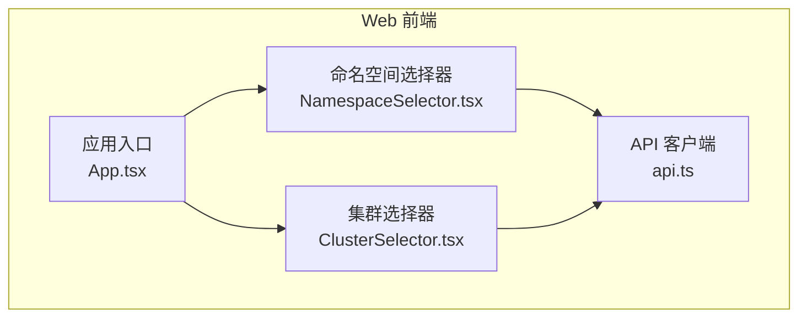
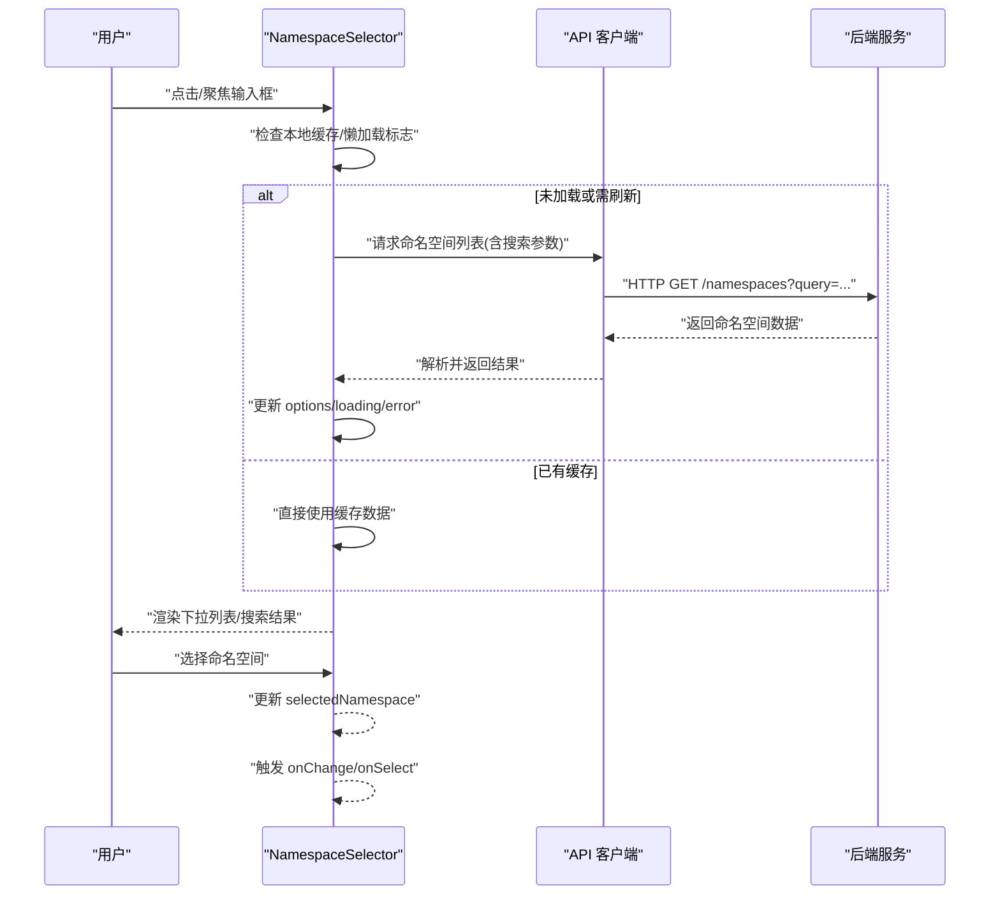
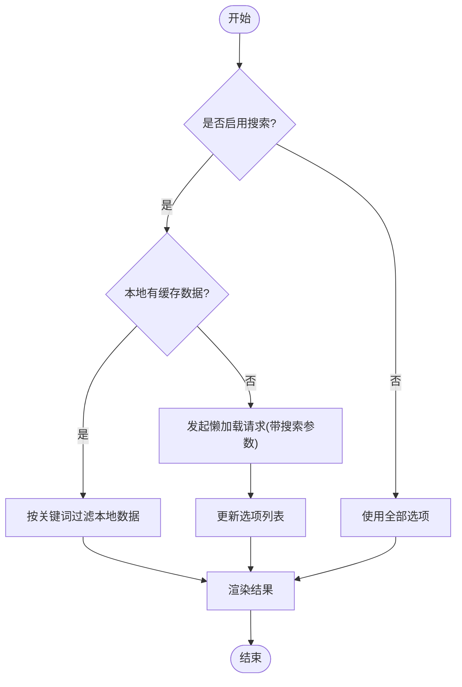
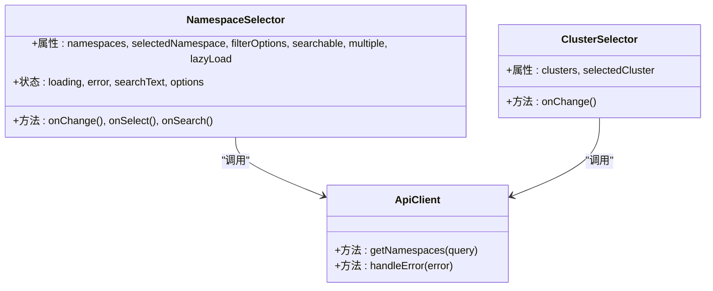
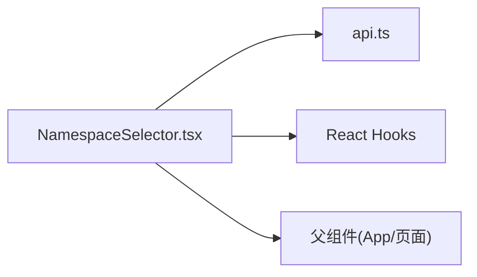

# NamespaceSelector 命名空间选择器

<cite>
**本文档引用的文件**   
- [NamespaceSelector.tsx](file://web/src/components/NamespaceSelector.tsx)
- [api.ts](file://web/src/lib/api.ts)
- [ClusterSelector.tsx](file://web/src/components/ClusterSelector.tsx)
- [App.tsx](file://web/src/App.tsx)
</cite>

## 目录
1. [简介](#简介)
2. [项目结构](#项目结构)
3. [核心组件](#核心组件)
4. [架构总览](#架构总览)
5. [详细组件分析](#详细组件分析)
6. [依赖分析](#依赖分析)
7. [性能考虑](#性能考虑)
8. [故障排查指南](#故障排查指南)
9. [结论](#结论)
10. [附录](#附录)

## 简介
NamespaceSelector 是一个用于在 Kubernetes 命名空间之间进行选择与管理的 UI 组件。它支持：
- 单选与多选模式
- 搜索过滤（可配置）
- 懒加载机制，按需获取命名空间列表
- 事件回调与状态管理，便于上层页面集成
- 与后端 API 的交互，实现数据拉取与错误处理

该组件适用于需要按命名空间筛选资源、切换上下文或批量操作多命名空间的场景。

## 项目结构
NamespaceSelector 位于前端 web 模块中，属于通用 UI 组件之一，主要职责是：
- 渲染命名空间选择界面（输入框、下拉列表、多选标签等）
- 维护本地状态（已选项、搜索关键词、加载状态等）
- 调用 API 获取命名空间列表并缓存结果
- 触发 onChange/onSelect 等事件供父组件消费

图表来源
- [App.tsx](file://web/src/App.tsx)
- [NamespaceSelector.tsx](file://web/src/components/NamespaceSelector.tsx)
- [ClusterSelector.tsx](file://web/src/components/ClusterSelector.tsx)
- [api.ts](file://web/src/lib/api.ts)

章节来源
- [NamespaceSelector.tsx](file://web/src/components/NamespaceSelector.tsx)
- [api.ts](file://web/src/lib/api.ts)

## 核心组件
NamespaceSelector 的核心能力包括：
- 属性配置
  - namespaces: 初始命名空间列表（可选），用于预填充或禁用懒加载
  - selectedNamespace: 当前选中项（单选）或选中数组（多选）
  - filterOptions: 过滤规则对象，如是否启用搜索、默认过滤字段等
  - searchable: 布尔值，控制是否显示搜索框
  - multiple: 布尔值，控制多选模式
  - lazyLoad: 布尔值，控制是否懒加载命名空间列表
  - placeholder: 占位文本
  - disabled: 禁用状态
  - onChange / onSelect: 选择变化回调
- 搜索过滤
  - 支持按名称模糊匹配
  - 可自定义过滤函数（通过 filterOptions）
- 多选支持
  - 以数组形式维护选中项
  - 提供全选/反选快捷操作（若实现）
- 懒加载机制
  - 首次聚焦或展开时触发数据请求
  - 支持分页或增量加载（若后端支持）
- 事件处理
  - onChange/onSelect 通知父组件状态更新
  - onSearch 暴露搜索关键词变化
- 状态管理
  - 本地维护 loading、error、searchText、options 等
  - 与受控/非受控模式兼容（根据 selectedNamespace 是否由外部传入）

章节来源
- [NamespaceSelector.tsx](file://web/src/components/NamespaceSelector.tsx)

## 架构总览
NamespaceSelector 与 API 层交互的典型流程如下：

图表来源
- [NamespaceSelector.tsx](file://web/src/components/NamespaceSelector.tsx)
- [api.ts](file://web/src/lib/api.ts)

## 详细组件分析

### 组件属性与行为
- namespaces: 外部传入的初始列表，若提供则优先使用；否则触发懒加载
- selectedNamespace: 
  - 单选模式：字符串或空
  - 多选模式：字符串数组
- filterOptions:
  - searchable: 是否启用搜索
  - defaultFilter: 默认过滤逻辑（如忽略大小写、前缀匹配等）
  - customFilter: 自定义过滤函数，接收选项与搜索词，返回过滤后的列表
- multiple: 开启多选后，UI 展示为多选标签或复选框列表
- lazyLoad: 控制是否在展开时发起请求
- placeholder/disabled: 基础 UI 控制
- onChange/onSelect: 选择变化回调，建议父组件同步到状态或表单

章节来源
- [NamespaceSelector.tsx](file://web/src/components/NamespaceSelector.tsx)

### 搜索与过滤算法
- 搜索关键词变化时，先对本地 options 进行过滤
- 若 searchable 为 true 且本地无数据，则触发懒加载并携带搜索参数
- 支持自定义过滤函数，允许复杂规则（如基于标签、注解等扩展字段）

图表来源
- [NamespaceSelector.tsx](file://web/src/components/NamespaceSelector.tsx)

### 多选与懒加载机制
- 多选模式下，selectedNamespace 为数组，支持新增/移除单个项
- 懒加载仅在首次展开或搜索时触发，避免不必要的网络请求
- 可在 filterOptions 中配置分页或增量加载策略（若后端支持）

章节来源
- [NamespaceSelector.tsx](file://web/src/components/NamespaceSelector.tsx)

### 事件处理与状态管理
- 内部状态：loading、error、searchText、options、selectedNamespace
- 受控模式：当 selectedNamespace 由外部传入时，组件不直接修改，而是通过 onChange 通知父组件
- 非受控模式：组件内部管理 selectedNamespace，适合简单场景

章节来源
- [NamespaceSelector.tsx](file://web/src/components/NamespaceSelector.tsx)

### 与后端 API 的交互
- 通过 api.ts 封装的请求方法获取命名空间列表
- 支持查询参数：keyword、page、pageSize 等（视后端实现）
- 错误处理：网络异常、权限不足、空结果等统一提示

章节来源
- [api.ts](file://web/src/lib/api.ts)

### 使用示例

#### 单选 + 搜索
- 设置 searchable=true，multiple=false
- 监听 onChange，将选中值写入父组件状态

章节来源
- [NamespaceSelector.tsx](file://web/src/components/NamespaceSelector.tsx)

#### 多选 + 懒加载
- 设置 multiple=true，lazyLoad=true
- 提供 filterOptions.customFilter 实现复杂过滤
- 监听 onChange，维护选中数组

章节来源
- [NamespaceSelector.tsx](file://web/src/components/NamespaceSelector.tsx)

#### 自定义过滤规则
- 在 filterOptions.defaultFilter 中定义基础规则（如忽略大小写）
- 在 filterOptions.customFilter 中实现业务相关过滤（如仅显示有特定标签的命名空间）

章节来源
- [NamespaceSelector.tsx](file://web/src/components/NamespaceSelector.tsx)

### 与其他组件的关系
- ClusterSelector 通常与 NamespaceSelector 配合使用，先选择集群，再选择命名空间
- App.tsx 作为页面入口，可能持有全局命名空间上下文或路由参数

图表来源
- [NamespaceSelector.tsx](file://web/src/components/NamespaceSelector.tsx)
- [ClusterSelector.tsx](file://web/src/components/ClusterSelector.tsx)
- [api.ts](file://web/src/lib/api.ts)

章节来源
- [ClusterSelector.tsx](file://web/src/components/ClusterSelector.tsx)
- [App.tsx](file://web/src/App.tsx)

## 依赖分析
NamespaceSelector 的依赖关系如下：
- 直接依赖
  - api.ts：封装 HTTP 请求与错误处理
  - React Hooks：useState、useEffect、useCallback 等（用于状态与副作用）
- 间接依赖
  - 父组件：提供 selectedNamespace、onChange 等受控接口
  - UI 库：下拉框、输入框、标签等基础组件（由项目样式框架决定）

图表来源
- [NamespaceSelector.tsx](file://web/src/components/NamespaceSelector.tsx)
- [api.ts](file://web/src/lib/api.ts)

章节来源
- [NamespaceSelector.tsx](file://web/src/components/NamespaceSelector.tsx)
- [api.ts](file://web/src/lib/api.ts)

## 性能考虑
- 懒加载：仅在需要时请求数据，减少初始负载
- 本地缓存：缓存已加载的命名空间列表，避免重复请求
- 防抖搜索：对搜索输入进行防抖，降低频繁请求压力
- 虚拟滚动：若命名空间数量较大，建议使用虚拟滚动优化渲染
- 错误重试：对失败请求提供重试机制，提升用户体验

[本节为通用指导，无需具体文件引用]

## 故障排查指南
常见问题与解决方案：
- 无法加载命名空间
  - 检查网络连接与后端服务状态
  - 确认权限是否正确（RBAC）
  - 查看控制台错误日志
- 搜索无效
  - 确认 searchable=true
  - 检查 filterOptions 配置是否正确
  - 验证后端是否支持搜索参数
- 多选状态不同步
  - 确保父组件正确响应 onChange 并更新 selectedNamespace
  - 检查受控/非受控模式是否混用

章节来源
- [NamespaceSelector.tsx](file://web/src/components/NamespaceSelector.tsx)
- [api.ts](file://web/src/lib/api.ts)

## 结论
NamespaceSelector 提供了灵活、高效的命名空间选择能力，支持单选/多选、搜索过滤、懒加载等特性，并通过标准事件与状态管理与上层应用集成。合理配置属性与过滤规则可满足多种业务场景需求。

[本节为总结性内容，无需具体文件引用]

## 附录
- 最佳实践
  - 始终提供 placeholder 以提升可用性
  - 在多选模式下提供“清空”或“全选”操作
  - 对敏感操作增加二次确认
  - 记录用户选择历史以便恢复上下文
- 扩展建议
  - 支持按标签/注解过滤
  - 集成权限控制，仅显示用户有权访问的命名空间
  - 添加快捷键支持（如 Ctrl+A 全选）

[本节为补充信息，无需具体文件引用]