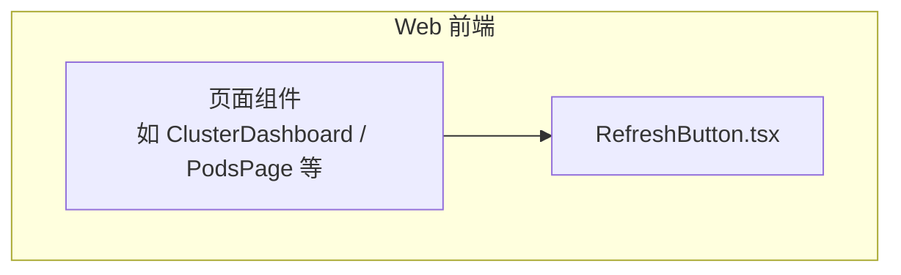
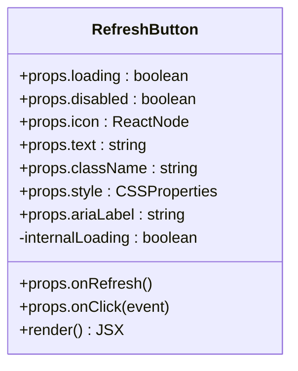
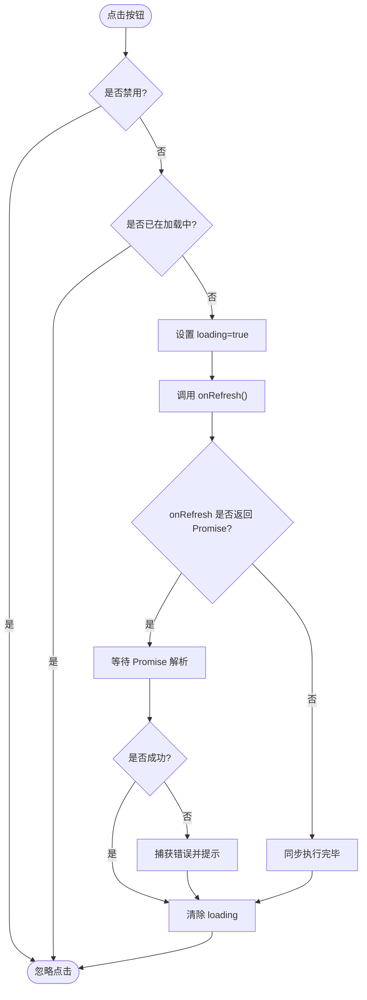
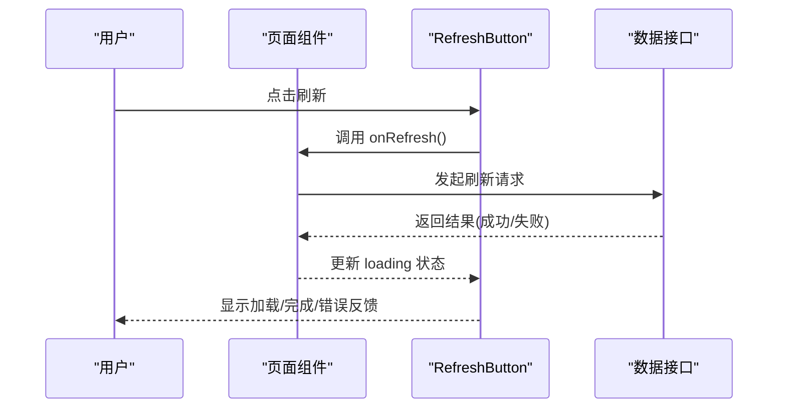
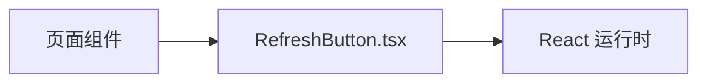

# RefreshButton 刷新按钮

<cite>
**本文引用的文件**   
- [RefreshButton.tsx](file://web/src/components/RefreshButton.tsx)
</cite>

## 目录
1. [简介](#简介)
2. [项目结构](#项目结构)
3. [核心组件](#核心组件)
4. [架构总览](#架构总览)
5. [详细组件分析](#详细组件分析)
6. [依赖分析](#依赖分析)
7. [性能考虑](#性能考虑)
8. [故障排查指南](#故障排查指南)
9. [结论](#结论)
10. [附录](#附录)

## 简介
本文件为通用刷新按钮组件 RefreshButton 的详细文档。该组件用于在数据列表、仪表盘等场景中提供“一键刷新”能力，支持加载状态、禁用态、图标与文案定制，并提供防抖机制与错误处理策略，确保交互体验稳定可靠。

## 项目结构
RefreshButton 位于前端 web 模块的 components 目录下，作为独立可复用 UI 组件被页面或容器组件引入使用。其职责单一：封装刷新按钮的交互、状态展示与基础样式。

图表来源
- [RefreshButton.tsx](file://web/src/components/RefreshButton.tsx)

章节来源
- [RefreshButton.tsx](file://web/src/components/RefreshButton.tsx)

## 核心组件
RefreshButton 是一个无副作用的纯展示型按钮组件，通过 props 暴露配置项，内部维护本地 loading 状态，并在回调执行时切换显示。典型属性包括：
- onRefresh：触发刷新的回调函数（可为同步或异步）
- loading：外部控制的加载状态
- disabled：是否禁用按钮
- icon：自定义图标（支持传入 ReactNode 或图标组件）
- text：按钮文案（默认“刷新”）
- className：外层容器样式类名
- style：内联样式对象
- ariaLabel：无障碍标签
- onClick：点击事件拦截器（可用于埋点或额外逻辑）

组件行为要点：
- 当 loading 为 true 时，按钮进入加载态，通常显示旋转图标并禁用点击
- 若未传入 loading，则组件内部根据 onRefresh 的执行生命周期自动管理 loading
- 支持通过 icon 和 text 灵活定制外观与文案
- 支持 disabled 禁用态，避免重复触发刷新

章节来源
- [RefreshButton.tsx](file://web/src/components/RefreshButton.tsx)

## 架构总览
RefreshButton 采用“受控 + 非受控”混合模式：既可通过 loading 属性受控，也可在无 loading 时由内部状态驱动。对外仅暴露最小化 API，降低耦合度。

图表来源
- [RefreshButton.tsx](file://web/src/components/RefreshButton.tsx)

## 详细组件分析

### 属性与类型定义
- onRefresh：刷新回调，推荐返回 Promise 以便统一处理异步流程
- loading：布尔值，控制加载态；若未提供，组件内部将基于 onRefresh 的执行周期管理
- disabled：布尔值，禁用按钮点击
- icon：ReactNode，用于替换默认刷新图标
- text：字符串，按钮文案
- className/style：样式扩展点
- ariaLabel：无障碍描述，提升可访问性
- onClick：可选的事件拦截器，便于埋点或前置校验

章节来源
- [RefreshButton.tsx](file://web/src/components/RefreshButton.tsx)

### 加载状态与防抖机制
- 加载态：loading 为真时，按钮呈现加载样式（如旋转图标），并阻止重复点击
- 防抖：为避免快速多次点击导致重复请求，组件应在 onRefresh 执行期间屏蔽后续点击，直到上一次操作完成
- 建议：onRefresh 应返回 Promise，组件据此判断结束时机；若为同步函数，需保证足够耗时或使用包装函数

图表来源
- [RefreshButton.tsx](file://web/src/components/RefreshButton.tsx)

### 错误处理
- 建议在 onRefresh 中集中处理异常，并通过 Toast 或全局通知反馈给用户
- 组件层可捕获未处理的 Promise rejection，给出兜底提示，避免静默失败
- 对于网络错误、权限不足、服务不可用等场景，应有明确的用户提示

章节来源
- [RefreshButton.tsx](file://web/src/components/RefreshButton.tsx)

### 样式定制与动画效果
- 通过 className 和 style 进行样式覆盖
- 加载态建议使用 CSS 动画（如旋转）配合过渡效果，提升感知度
- 图标可通过 icon 属性替换，支持 SVG、图标库组件等
- 文本可通过 text 属性定制，支持多语言

章节来源
- [RefreshButton.tsx](file://web/src/components/RefreshButton.tsx)

### 可访问性支持
- 为按钮提供 aria-label 或 aria-labelledby，确保屏幕阅读器可读
- 在 loading 状态下保持键盘可达性与焦点可见性
- 颜色对比度符合 WCAG 标准，确保弱视用户可辨识

章节来源
- [RefreshButton.tsx](file://web/src/components/RefreshButton.tsx)

### 使用示例与常见场景
- 数据刷新：在列表页点击刷新按钮，重新拉取最新数据
- 页面重载：触发整页或部分区域的重载逻辑
- 异步操作触发：如清理缓存、重建索引、触发批处理任务等

图表来源
- [RefreshButton.tsx](file://web/src/components/RefreshButton.tsx)

章节来源
- [RefreshButton.tsx](file://web/src/components/RefreshButton.tsx)

## 依赖分析
RefreshButton 为纯 UI 组件，不直接依赖业务逻辑，仅依赖 React 生态的基础能力（如 ReactNode、事件处理）。与页面的耦合通过 props 解耦，便于在不同页面复用。

图表来源
- [RefreshButton.tsx](file://web/src/components/RefreshButton.tsx)

章节来源
- [RefreshButton.tsx](file://web/src/components/RefreshButton.tsx)

## 性能考虑
- 避免在 onRefresh 中进行重计算或渲染密集操作，必要时拆分到子组件或 Web Worker
- 合理使用 loading 状态，减少不必要的重渲染
- 对频繁触发的刷新操作，可在上层做节流/防抖，避免高频请求
- 图标与样式尽量静态化，减少运行时计算

[本节为通用指导，无需引用具体文件]

## 故障排查指南
- 现象：点击后无响应
  - 检查 disabled 是否为真
  - 确认 onRefresh 是否正确返回 Promise 或未抛出异常
- 现象：重复触发刷新
  - 检查 loading 状态是否被正确管理
  - 在上层添加防抖或锁定逻辑
- 现象：错误未提示
  - 在 onRefresh 中统一捕获并提示错误
  - 检查全局错误边界或 Toast 是否正常

章节来源
- [RefreshButton.tsx](file://web/src/components/RefreshButton.tsx)

## 结论
RefreshButton 以简洁的 API 提供了通用的刷新能力，具备加载态、禁用态、图标与文案定制、防抖与错误处理等关键特性。通过合理的样式与可访问性设计，能够在多种业务场景中稳定复用，提升用户体验与开发效率。

[本节为总结性内容，无需引用具体文件]

## 附录
- 最佳实践
  - 始终让 onRefresh 返回 Promise，便于统一处理异步流程
  - 在 onRefresh 中集中处理错误与用户提示
  - 为复杂页面提供局部刷新而非全量重载
  - 结合路由参数或查询条件实现精准刷新

[本节为补充说明，无需引用具体文件]