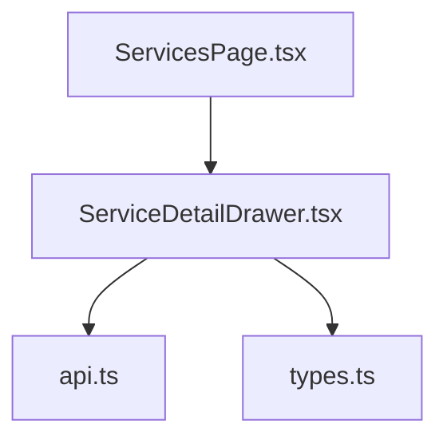
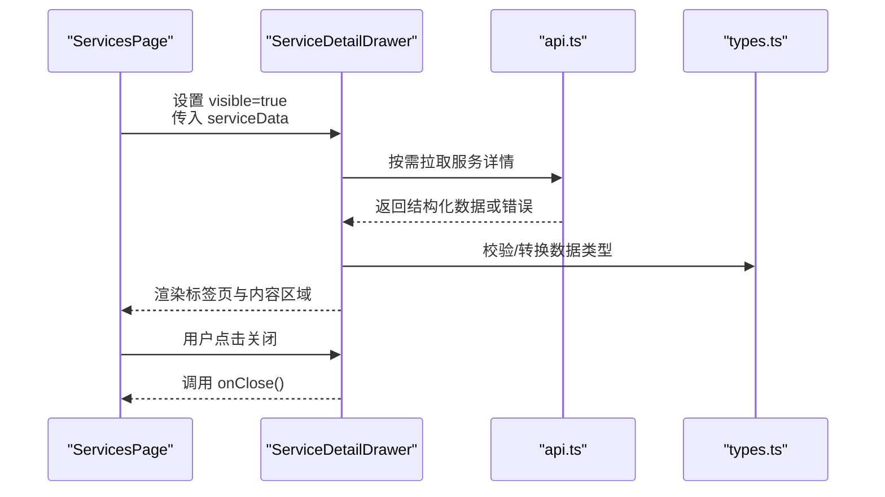
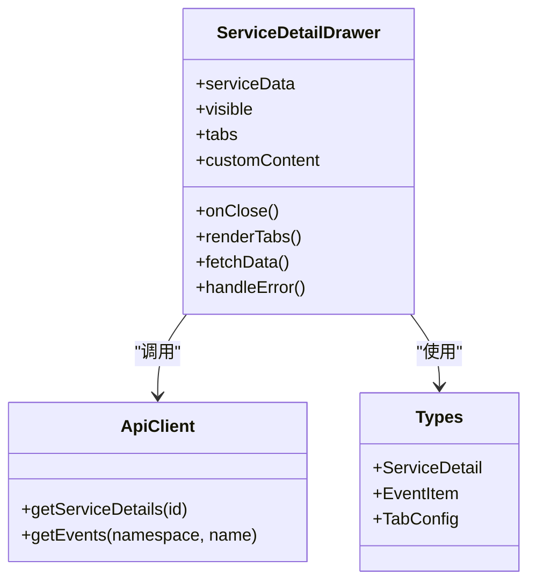
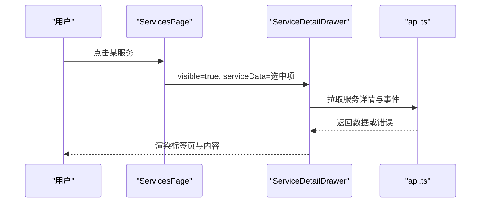
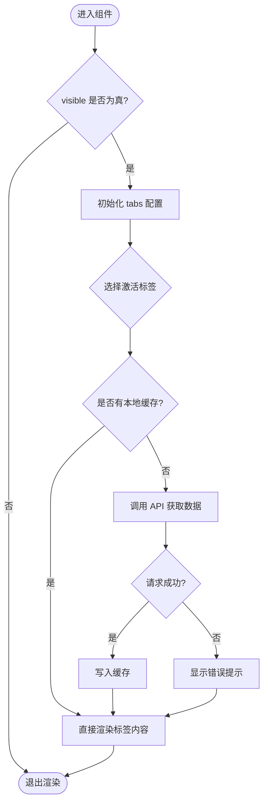
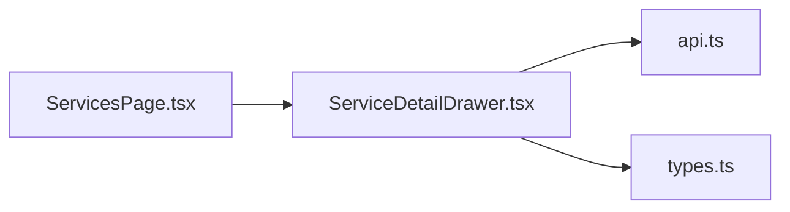

# ServiceDetailDrawer 服务详情抽屉

<cite>
**本文引用的文件**   
- [ServiceDetailDrawer.tsx](file://web/src/components/ServiceDetailDrawer.tsx)
- [ServicesPage.tsx](file://web/src/pages/ServicesPage.tsx)
- [api.ts](file://web/src/lib/api.ts)
- [types.ts](file://web/src/types/api.ts)
</cite>

## 目录
1. [简介](#简介)
2. [项目结构](#项目结构)
3. [核心组件](#核心组件)
4. [架构总览](#架构总览)
5. [详细组件分析](#详细组件分析)
6. [依赖关系分析](#依赖关系分析)
7. [性能考虑](#性能考虑)
8. [故障排查指南](#故障排查指南)
9. [结论](#结论)
10. [附录](#附录)

## 简介
ServiceDetailDrawer 是一个抽屉式侧边面板组件，用于在 Kubernetes 服务管理场景中展示选中服务的详细信息。该组件通过属性驱动渲染，支持标签页切换、自定义内容区域、错误边界与响应式布局，便于在不同页面中灵活嵌入并复用。

## 项目结构
ServiceDetailDrawer 位于前端 web 模块的 components 目录下，通常由 ServicesPage 等页面触发显示，并通过 api.ts 获取服务数据，类型定义来源于 types.ts。

图表来源
- [ServicesPage.tsx](file://web/src/pages/ServicesPage.tsx)
- [ServiceDetailDrawer.tsx](file://web/src/components/ServiceDetailDrawer.tsx)
- [api.ts](file://web/src/lib/api.ts)
- [types.ts](file://web/src/types/api.ts)

章节来源
- [ServiceDetailDrawer.tsx](file://web/src/components/ServiceDetailDrawer.tsx)
- [ServicesPage.tsx](file://web/src/pages/ServicesPage.tsx)
- [api.ts](file://web/src/lib/api.ts)
- [types.ts](file://web/src/types/api.ts)

## 核心组件
ServiceDetailDrawer 的核心职责：
- 接收 serviceData 作为当前服务的数据源
- 控制可见性 visible 与关闭回调 onClose
- 提供 tabs 配置以定义标签页内容与顺序
- 支持 customContent 插槽扩展额外信息
- 内部处理加载态、错误态与空数据态
- 适配移动端与桌面端布局

章节来源
- [ServiceDetailDrawer.tsx](file://web/src/components/ServiceDetailDrawer.tsx)

## 架构总览
下图展示了从页面触发到抽屉渲染的关键交互流程，包括数据获取、状态管理与 UI 渲染。

图表来源
- [ServicesPage.tsx](file://web/src/pages/ServicesPage.tsx)
- [ServiceDetailDrawer.tsx](file://web/src/components/ServiceDetailDrawer.tsx)
- [api.ts](file://web/src/lib/api.ts)
- [types.ts](file://web/src/types/api.ts)

## 详细组件分析

### 属性与接口设计
- serviceData: 当前服务的数据对象，包含名称、命名空间、端口、关联工作负载等字段
- visible: 控制抽屉是否显示
- onClose: 关闭抽屉的回调函数
- tabs: 标签页配置数组，每项包含标题、渲染函数或内置视图标识
- customContent: 自定义内容插槽，允许父组件注入额外信息（如操作按钮、备注）

章节来源
- [ServiceDetailDrawer.tsx](file://web/src/components/ServiceDetailDrawer.tsx)
- [types.ts](file://web/src/types/api.ts)

### 内容区域布局
- 顶部标题栏：显示服务名称与命名空间，并提供关闭按钮
- 标签页导航：根据 tabs 配置动态生成
- 主内容区：按当前激活标签渲染对应内容
- 底部操作区：预留常用操作入口（如查看 YAML、复制事件等）

章节来源
- [ServiceDetailDrawer.tsx](file://web/src/components/ServiceDetailDrawer.tsx)

### 标签页切换与数据展示格式
- 默认标签页可能包含“概览”、“端口与服务”、“关联工作负载”、“事件”等
- 每个标签页可绑定不同的数据子集或计算逻辑
- 数据格式化：时间戳、端口映射、状态枚举等统一格式化输出

章节来源
- [ServiceDetailDrawer.tsx](file://web/src/components/ServiceDetailDrawer.tsx)

### 生命周期管理与数据获取策略
- 打开时：若本地缓存缺失则发起请求获取最新数据
- 切换标签：按需懒加载对应标签所需数据
- 关闭时：清理定时器与副作用，避免内存泄漏
- 错误处理：捕获网络异常与解析错误，降级为友好提示

章节来源
- [ServiceDetailDrawer.tsx](file://web/src/components/ServiceDetailDrawer.tsx)
- [api.ts](file://web/src/lib/api.ts)

### 错误边界与健壮性
- 对不可预期的渲染错误进行捕获，防止整页崩溃
- 对空数据与部分字段缺失做防御性处理
- 提供重试机制与手动刷新入口

章节来源
- [ServiceDetailDrawer.tsx](file://web/src/components/ServiceDetailDrawer.tsx)

### 响应式适配
- 小屏设备：自动折叠次要信息，优化滚动体验
- 大屏设备：多列布局展示更多细节
- 触摸友好：增大点击区域与滑动反馈

章节来源
- [ServiceDetailDrawer.tsx](file://web/src/components/ServiceDetailDrawer.tsx)

### 使用示例与嵌入方式
- 在 ServicesPage 中监听服务列表项点击，设置 visible=true 并传入 serviceData
- 通过 tabs 定制标签页顺序与内容
- 通过 customContent 插入业务相关操作或说明

章节来源
- [ServicesPage.tsx](file://web/src/pages/ServicesPage.tsx)
- [ServiceDetailDrawer.tsx](file://web/src/components/ServiceDetailDrawer.tsx)

#### 类图（组件与类型关系）

图表来源
- [ServiceDetailDrawer.tsx](file://web/src/components/ServiceDetailDrawer.tsx)
- [api.ts](file://web/src/lib/api.ts)
- [types.ts](file://web/src/types/api.ts)

#### 序列图（打开与数据获取）

图表来源
- [ServicesPage.tsx](file://web/src/pages/ServicesPage.tsx)
- [ServiceDetailDrawer.tsx](file://web/src/components/ServiceDetailDrawer.tsx)
- [api.ts](file://web/src/lib/api.ts)

#### 流程图（标签页渲染与懒加载）

图表来源
- [ServiceDetailDrawer.tsx](file://web/src/components/ServiceDetailDrawer.tsx)
- [api.ts](file://web/src/lib/api.ts)

章节来源
- [ServiceDetailDrawer.tsx](file://web/src/components/ServiceDetailDrawer.tsx)
- [ServicesPage.tsx](file://web/src/pages/ServicesPage.tsx)
- [api.ts](file://web/src/lib/api.ts)
- [types.ts](file://web/src/types/api.ts)

## 依赖关系分析
- 组件依赖 api.ts 进行数据获取
- 依赖 types.ts 进行数据结构定义与校验
- 被 ServicesPage 等页面引用，作为可复用的详情展示单元

图表来源
- [ServicesPage.tsx](file://web/src/pages/ServicesPage.tsx)
- [ServiceDetailDrawer.tsx](file://web/src/components/ServiceDetailDrawer.tsx)
- [api.ts](file://web/src/lib/api.ts)
- [types.ts](file://web/src/types/api.ts)

章节来源
- [ServicesPage.tsx](file://web/src/pages/ServicesPage.tsx)
- [ServiceDetailDrawer.tsx](file://web/src/components/ServiceDetailDrawer.tsx)
- [api.ts](file://web/src/lib/api.ts)
- [types.ts](file://web/src/types/api.ts)

## 性能考虑
- 懒加载：仅在标签激活时拉取数据，减少初始渲染开销
- 缓存策略：对频繁访问的服务详情进行短期缓存
- 防抖与节流：对快速切换标签与重复请求进行去重
- 虚拟滚动：当事件列表较长时采用分页或虚拟列表

[本节为通用指导，不直接分析具体文件]

## 故障排查指南
- 数据为空：检查 serviceData 是否完整，确认 API 返回结构与类型定义一致
- 网络错误：查看 api.ts 的错误处理分支，必要时增加重试与超时配置
- 渲染异常：启用错误边界日志，定位具体标签页渲染失败原因
- 内存泄漏：确保关闭抽屉时清理定时器与订阅

章节来源
- [ServiceDetailDrawer.tsx](file://web/src/components/ServiceDetailDrawer.tsx)
- [api.ts](file://web/src/lib/api.ts)

## 结论
ServiceDetailDrawer 提供了清晰、可扩展的服务详情展示能力，结合标签页与自定义内容插槽，能够灵活适配不同页面的需求。通过合理的生命周期管理、错误边界与响应式适配，可在复杂的前端应用中稳定运行。

[本节为总结性内容，不直接分析具体文件]

## 附录
- 最佳实践
  - 将 tabs 配置外置，便于不同页面定制
  - 对敏感操作二次确认，避免误触
  - 保持数据与视图分离，提升可测试性
- 常见问题
  - 大列表卡顿：采用分页或虚拟滚动
  - 跨域问题：检查后端 CORS 配置
  - 类型不匹配：对齐 types.ts 与后端返回结构

[本节为补充信息，不直接分析具体文件]