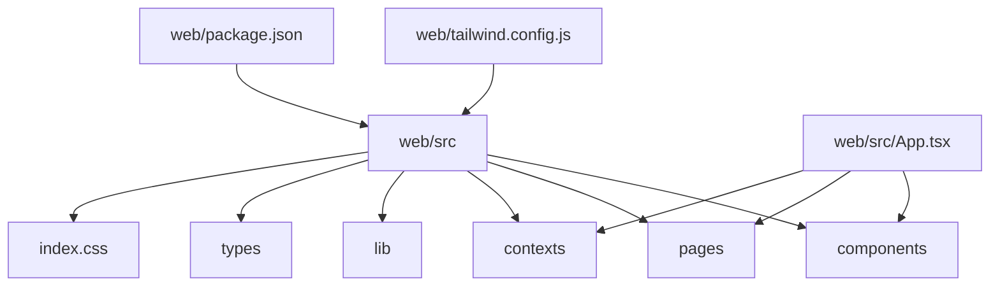
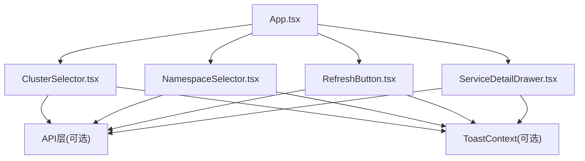
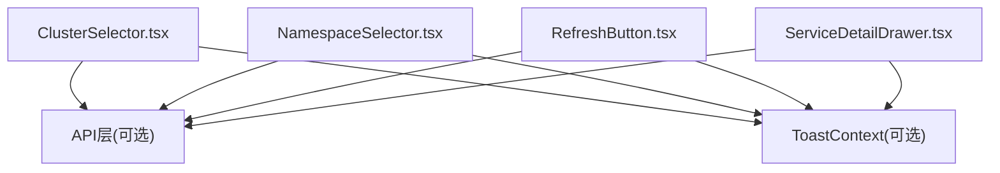

# UI组件库

<cite>
**本文引用的文件**   
- [ClusterSelector.tsx](file://web/src/components/ClusterSelector.tsx)
- [NamespaceSelector.tsx](file://web/src/components/NamespaceSelector.tsx)
- [RefreshButton.tsx](file://web/src/components/RefreshButton.tsx)
- [ServiceDetailDrawer.tsx](file://web/src/components/ServiceDetailDrawer.tsx)
- [App.tsx](file://web/src/App.tsx)
- [index.css](file://web/src/index.css)
- [tailwind.config.js](file://web/tailwind.config.js)
- [package.json](file://web/package.json)
</cite>

## 目录
1. [简介](#简介)
2. [项目结构](#项目结构)
3. [核心组件](#核心组件)
4. [架构总览](#架构总览)
5. [详细组件分析](#详细组件分析)
6. [依赖关系分析](#依赖关系分析)
7. [性能考量](#性能考量)
8. [故障排查指南](#故障排查指南)
9. [结论](#结论)
10. [附录](#附录)

## 简介
本文件为 Klaw 前端自定义UI组件库的权威文档，聚焦于可复用组件的设计原则、接口定义与使用方法。重点覆盖以下四个核心组件：
- ClusterSelector（集群选择器）
- NamespaceSelector（命名空间选择器）
- RefreshButton（刷新按钮）
- ServiceDetailDrawer（服务详情抽屉）

文档同时阐述组件组合模式、主题支持与响应式设计实现，并提供使用示例与最佳实践，帮助开发者快速集成并扩展这些组件。

## 项目结构
Klaw 前端位于 web 目录，采用 React + TypeScript 技术栈，样式基于 Tailwind CSS。组件集中存放在 src/components 下，页面与上下文在 src/pages 与 src/contexts 中，全局样式与构建配置在根目录与 src 目录下。

图表来源
- [App.tsx:1-200](file://web/src/App.tsx#L1-L200)
- [index.css:1-200](file://web/src/index.css#L1-L200)
- [tailwind.config.js:1-200](file://web/tailwind.config.js#L1-L200)
- [package.json:1-200](file://web/package.json#L1-L200)

章节来源
- [App.tsx:1-200](file://web/src/App.tsx#L1-L200)
- [package.json:1-200](file://web/package.json#L1-L200)

## 核心组件
本节概述四个核心组件的职责与设计要点：
- ClusterSelector：用于选择目标 Kubernetes 集群，支持异步加载、搜索过滤、受控与非受控两种模式、禁用状态与无障碍标签。
- NamespaceSelector：用于选择命名空间，支持按集群联动、搜索过滤、多选或单选、禁用状态与无障碍标签。
- RefreshButton：提供数据刷新能力，支持加载态、禁用态、点击回调、图标与文案定制。
- ServiceDetailDrawer：以抽屉形式展示服务详情，支持动态内容渲染、关闭回调、尺寸控制与滚动行为。

设计原则
- 单一职责：每个组件仅负责一个明确的交互或展示职责。
- 可控性优先：对外暴露受控属性与事件回调，便于上层管理状态。
- 可访问性：提供 aria-* 属性与键盘导航支持。
- 主题化：通过 Tailwind 变量与类名进行样式定制，避免内联硬编码颜色。
- 响应式：适配不同屏幕尺寸，在小屏上自动调整布局与交互方式。

章节来源
- [ClusterSelector.tsx:1-200](file://web/src/components/ClusterSelector.tsx#L1-L200)
- [NamespaceSelector.tsx:1-200](file://web/src/components/NamespaceSelector.tsx#L1-L200)
- [RefreshButton.tsx:1-200](file://web/src/components/RefreshButton.tsx#L1-L200)
- [ServiceDetailDrawer.tsx:1-200](file://web/src/components/ServiceDetailDrawer.tsx#L1-L200)

## 架构总览
下图展示了组件之间的依赖与调用关系，以及它们与页面和上下文的交互方式。

图表来源
- [App.tsx:1-200](file://web/src/App.tsx#L1-L200)
- [ClusterSelector.tsx:1-200](file://web/src/components/ClusterSelector.tsx#L1-L200)
- [NamespaceSelector.tsx:1-200](file://web/src/components/NamespaceSelector.tsx#L1-L200)
- [RefreshButton.tsx:1-200](file://web/src/components/RefreshButton.tsx#L1-L200)
- [ServiceDetailDrawer.tsx:1-200](file://web/src/components/ServiceDetailDrawer.tsx#L1-L200)

## 详细组件分析

### ClusterSelector（集群选择器）
功能特性
- 支持从后端或本地缓存加载集群列表
- 支持输入搜索过滤
- 支持受控与非受控模式
- 支持禁用状态与占位文案
- 支持无障碍标签与键盘操作

属性与事件
- value：当前选中的集群标识（受控模式）
- onChange：值变化回调，返回新选中的集群标识
- options：集群选项数组，包含 id、name、status 等字段
- placeholder：占位提示文本
- disabled：是否禁用
- searchPlaceholder：搜索框占位文本
- onSearch：搜索回调，可用于服务端过滤
- loading：是否处于加载状态
- error：错误信息，用于显示错误提示
- className：外层容器类名
- label：标签文本，用于无障碍描述

使用示例
- 受控模式：将 value 与 onChange 绑定到父组件状态，实现双向绑定。
- 非受控模式：通过 defaultValue 设置初始值，内部维护选中状态。
- 搜索过滤：结合 onSearch 实现服务端分页与过滤。

最佳实践
- 在大型集群列表中启用搜索与服务端过滤，减少首屏渲染压力。
- 为 disabled 与 loading 状态提供明确的用户反馈。
- 使用 label 与 aria-label 提升可访问性。

章节来源
- [ClusterSelector.tsx:1-200](file://web/src/components/ClusterSelector.tsx#L1-L200)

### NamespaceSelector（命名空间选择器）
功能特性
- 根据所选集群动态加载命名空间列表
- 支持输入搜索过滤
- 支持单选或多选模式
- 支持禁用状态与占位文案
- 支持无障碍标签与键盘操作

属性与事件
- clusterId：当前集群标识，用于联动加载命名空间
- value：当前选中的命名空间标识或数组（受控模式）
- onChange：值变化回调，返回新选中的命名空间标识或数组
- options：命名空间选项数组，包含 id、name、labels 等字段
- placeholder：占位提示文本
- disabled：是否禁用
- searchPlaceholder：搜索框占位文本
- onSearch：搜索回调，可用于服务端过滤
- loading：是否处于加载状态
- error：错误信息，用于显示错误提示
- multiSelect：是否启用多选
- className：外层容器类名
- label：标签文本，用于无障碍描述

使用示例
- 联动加载：当 clusterId 变化时重新请求命名空间列表。
- 多选模式：适用于需要批量操作的场景，如批量部署或清理。
- 搜索优化：对长列表启用搜索与服务端过滤。

最佳实践
- 在多选模式下提供全选/反选与已选项计数。
- 对空结果与错误状态提供友好提示。
- 使用 label 与 aria-label 提升可访问性。

章节来源
- [NamespaceSelector.tsx:1-200](file://web/src/components/NamespaceSelector.tsx#L1-L200)

### RefreshButton（刷新按钮）
功能特性
- 提供一键刷新数据的交互入口
- 支持加载态动画与禁用态
- 支持自定义图标与文案
- 支持点击回调与错误处理

属性与事件
- onClick：点击回调，触发刷新逻辑
- loading：是否处于加载状态
- disabled：是否禁用
- icon：自定义图标组件或字符串
- text：按钮文案
- tooltip：悬停提示文本
- className：外层容器类名
- ariaLabel：无障碍标签

使用示例
- 在页面顶部放置刷新按钮，点击后重新拉取数据并更新视图。
- 在表格或卡片区域放置刷新按钮，仅刷新局部数据。

最佳实践
- 在请求进行中禁用按钮，防止重复提交。
- 为失败请求提供错误提示与重试引导。
- 使用 tooltip 与 ariaLabel 提升可访问性与可用性。

章节来源
- [RefreshButton.tsx:1-200](file://web/src/components/RefreshButton.tsx#L1-L200)

### ServiceDetailDrawer（服务详情抽屉）
功能特性
- 以抽屉形式展示服务详细信息
- 支持动态内容渲染与滚动行为
- 支持关闭回调与尺寸控制
- 支持加载态与错误态

属性与事件
- open：抽屉可见性（受控模式）
- onClose：关闭回调
- title：标题文本
- content：内容组件或节点
- width：抽屉宽度
- placement：抽屉位置（左/右/上/下）
- loading：是否处于加载状态
- error：错误信息，用于显示错误提示
- className：外层容器类名
- maskClosable：是否允许点击遮罩关闭
- keyboardClose：是否允许 ESC 键关闭

使用示例
- 点击服务行打开抽屉，展示服务元数据、运行状态与相关资源。
- 在抽屉内嵌入子组件，如日志查看器或指标图表。

最佳实践
- 合理设置 width 与 placement，确保在不同屏幕下的可读性。
- 在加载与错误状态下提供明确的用户反馈。
- 使用 maskClosable 与 keyboardClose 提升交互体验。

章节来源
- [ServiceDetailDrawer.tsx:1-200](file://web/src/components/ServiceDetailDrawer.tsx#L1-L200)

## 依赖关系分析
组件之间通过 props 与事件进行通信，部分组件可能依赖 API 层与 Toast 上下文。下图展示了组件间的依赖关系。

图表来源
- [ClusterSelector.tsx:1-200](file://web/src/components/ClusterSelector.tsx#L1-L200)
- [NamespaceSelector.tsx:1-200](file://web/src/components/NamespaceSelector.tsx#L1-L200)
- [RefreshButton.tsx:1-200](file://web/src/components/RefreshButton.tsx#L1-L200)
- [ServiceDetailDrawer.tsx:1-200](file://web/src/components/ServiceDetailDrawer.tsx#L1-L200)

章节来源
- [ClusterSelector.tsx:1-200](file://web/src/components/ClusterSelector.tsx#L1-L200)
- [NamespaceSelector.tsx:1-200](file://web/src/components/NamespaceSelector.tsx#L1-L200)
- [RefreshButton.tsx:1-200](file://web/src/components/RefreshButton.tsx#L1-L200)
- [ServiceDetailDrawer.tsx:1-200](file://web/src/components/ServiceDetailDrawer.tsx#L1-L200)

## 性能考量
- 懒加载与虚拟滚动：对于大型列表（如集群与命名空间），建议启用虚拟滚动或服务端分页，减少首屏渲染压力。
- 防抖与节流：对搜索输入与频繁点击操作进行防抖或节流，降低不必要的请求与重渲染。
- 状态提升与共享：将公共状态提升到父组件或使用上下文，避免重复计算与状态同步问题。
- 样式优化：使用 Tailwind 原子类，避免过度嵌套与重复样式，提升渲染性能。

[本节为通用指导，不直接分析具体文件]

## 故障排查指南
常见问题与解决方案
- 组件无响应：检查 props 是否正确传递，确认 onChange 与 onClick 是否被正确绑定。
- 数据未更新：确认 loading 与 error 状态是否正确处理，检查 API 返回数据结构。
- 样式异常：检查 Tailwind 配置与 index.css 是否引入，确认类名冲突。
- 可访问性问题：为所有交互元素添加 aria-label 与键盘事件支持。

章节来源
- [index.css:1-200](file://web/src/index.css#L1-L200)
- [tailwind.config.js:1-200](file://web/tailwind.config.js#L1-L200)

## 结论
本组件库围绕可复用、可控性与可访问性设计，提供了集群选择、命名空间选择、刷新操作与服务详情展示的核心能力。通过遵循统一的设计原则与接口规范，开发者可以快速集成并扩展这些组件，构建一致且高效的 Kubernetes 管理界面。

[本节为总结性内容，不直接分析具体文件]

## 附录
- 主题支持：通过 Tailwind 配置文件与 CSS 变量进行主题定制，确保组件在不同主题下保持一致的视觉体验。
- 响应式设计：利用 Tailwind 的断点系统，为不同屏幕尺寸提供适配的布局与交互方式。
- 测试建议：为关键组件编写单元测试与集成测试，覆盖正常流程、边界条件与错误处理。

[本节为补充说明，不直接分析具体文件]