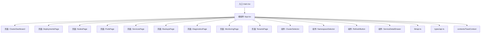
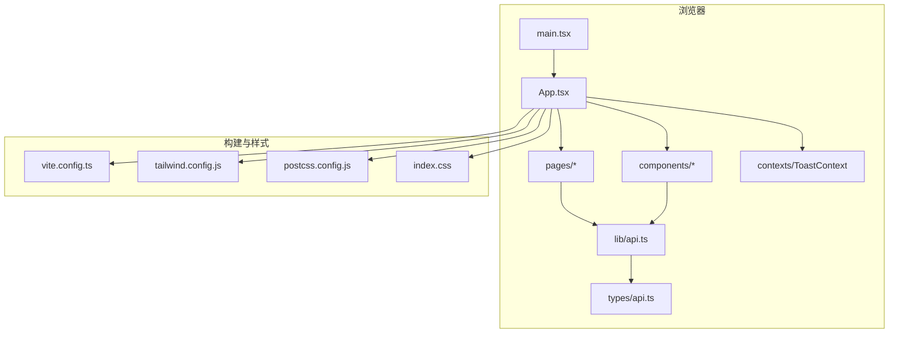
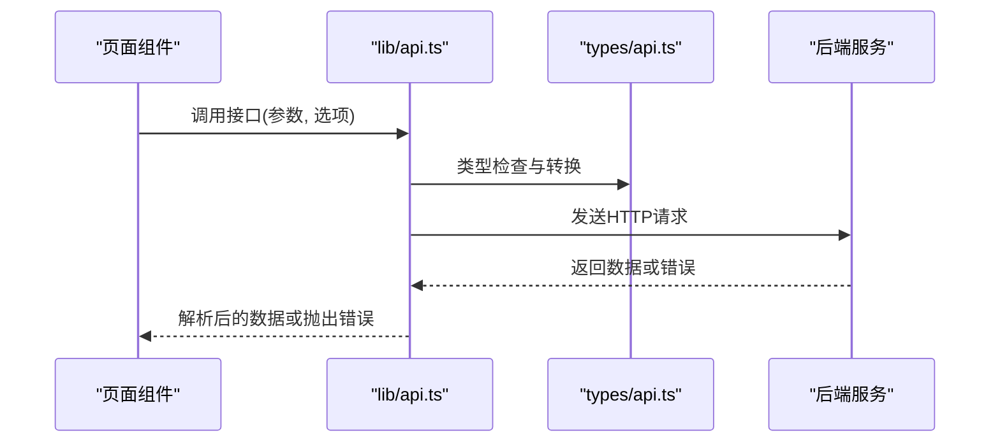
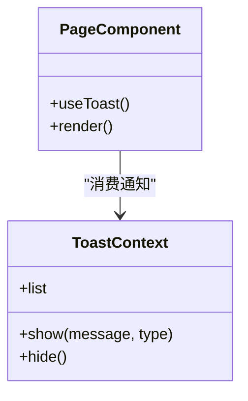
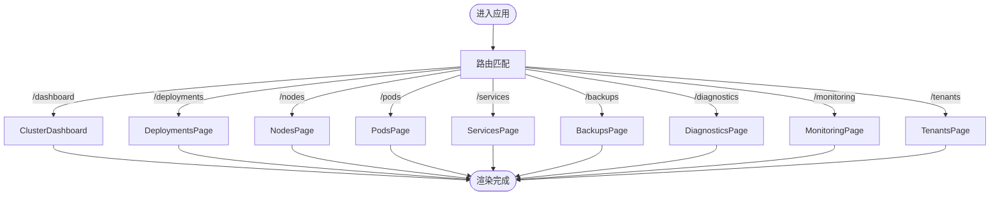
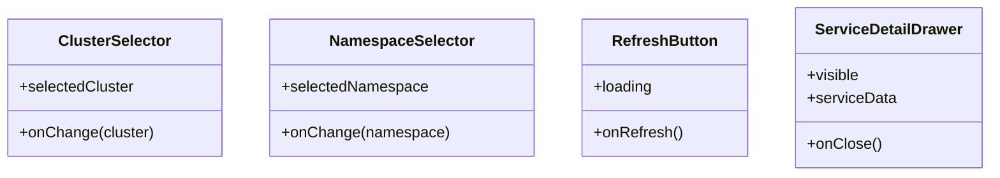
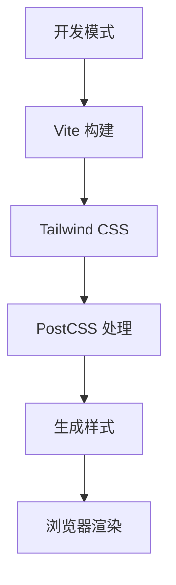
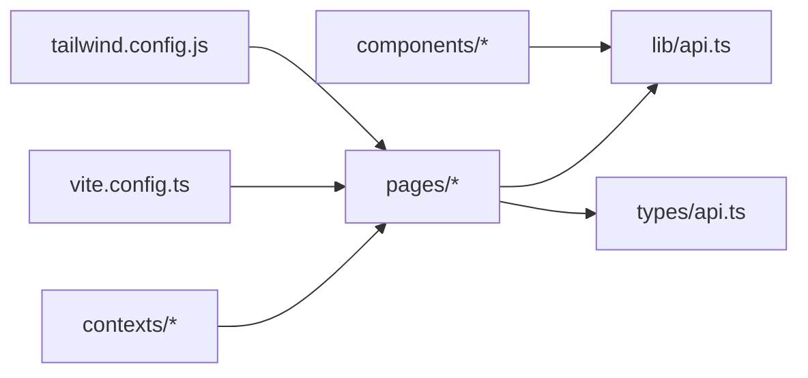

# Web前端应用

<cite>
**本文引用的文件**   
- [web/src/App.tsx](file://web/src/App.tsx)
- [web/src/main.tsx](file://web/src/main.tsx)
- [web/src/index.css](file://web/src/index.css)
- [web/vite.config.ts](file://web/vite.config.ts)
- [web/tailwind.config.js](file://web/tailwind.config.js)
- [web/postcss.config.js](file://web/postcss.config.js)
- [web/package.json](file://web/package.json)
- [web/tsconfig.json](file://web/tsconfig.json)
- [web/src/lib/api.ts](file://web/src/lib/api.ts)
- [web/src/lib/utils.ts](file://web/src/lib/utils.ts)
- [web/src/types/api.ts](file://web/src/types/api.ts)
- [web/src/pages/ClusterDashboard.tsx](file://web/src/pages/ClusterDashboard.tsx)
- [web/src/pages/DeploymentsPage.tsx](file://web/src/pages/DeploymentsPage.tsx)
- [web/src/pages/NodesPage.tsx](file://web/src/pages/NodesPage.tsx)
- [web/src/pages/PodsPage.tsx](file://web/src/pages/PodsPage.tsx)
- [web/src/pages/ServicesPage.tsx](file://web/src/pages/ServicesPage.tsx)
- [web/src/pages/BackupsPage.tsx](file://web/src/pages/BackupsPage.tsx)
- [web/src/pages/DiagnosticsPage.tsx](file://web/src/pages/DiagnosticsPage.tsx)
- [web/src/pages/MonitoringPage.tsx](file://web/src/pages/MonitoringPage.tsx)
- [web/src/pages/TenantsPage.tsx](file://web/src/pages/TenantsPage.tsx)
- [web/src/components/ClusterSelector.tsx](file://web/src/components/ClusterSelector.tsx)
- [web/src/components/NamespaceSelector.tsx](file://web/src/components/NamespaceSelector.tsx)
- [web/src/components/RefreshButton.tsx](file://web/src/components/RefreshButton.tsx)
- [web/src/components/ServiceDetailDrawer.tsx](file://web/src/components/ServiceDetailDrawer.tsx)
- [web/src/contexts/ToastContext.tsx](file://web/src/contexts/ToastContext.tsx)
- [web/src/__tests__/unit/ClusterDashboard.test.tsx](file://web/src/__tests__/unit/ClusterDashboard.test.tsx)
- [web/src/__tests__/unit/DeploymentsPage.test.tsx](file://web/src/__tests__/unit/DeploymentsPage.test.tsx)
- [web/src/__tests__/unit/NodesPage.test.tsx](file://web/src/__tests__/unit/NodesPage.test.tsx)
- [web/src/__tests__/unit/PodsPage.test.tsx](file://web/src/__tests__/unit/PodsPage.test.tsx)
- [web/src/__tests__/integration/api.test.ts](file://web/src/__tests__/integration/api.test.ts)
- [web/src/__tests__/integration/error-handling.test.tsx](file://web/src/__tests__/integration/error-handling.test.tsx)
- [web/src/__tests__/mocks/browser.ts](file://web/src/__tests__/mocks/browser.ts)
- [web/src/__tests__/mocks/data.ts](file://web/src/__tests__/mocks/data.ts)
- [web/src/__tests__/mocks/handlers.ts](file://web/src/__tests__/mocks/handlers.ts)
- [web/src/__tests__/mocks/server.ts](file://web/src/__tests__/mocks/server.ts)
- [web/src/test-utils/test-utils.tsx](file://web/src/test-utils/test-utils.tsx)
</cite>

## 目录
1. [简介](#简介)
2. [项目结构](#项目结构)
3. [核心组件](#核心组件)
4. [架构总览](#架构总览)
5. [详细组件分析](#详细组件分析)
6. [依赖关系分析](#依赖关系分析)
7. [性能考虑](#性能考虑)
8. [故障排查指南](#故障排查指南)
9. [结论](#结论)
10. [附录](#附录)

## 简介
本文件为 Klaw 的 React + TypeScript 前端应用的完整技术文档。内容覆盖应用架构、组件设计与复用策略、状态管理方案、API 客户端封装与 UI 组件库使用、页面组件说明、路由配置、样式管理与性能优化，并提供开发环境搭建、调试技巧与扩展开发指南。目标是帮助开发者快速理解并高效扩展该前端应用。

## 项目结构
前端位于 web 目录下，采用 Vite + React + TypeScript 构建，样式基于 Tailwind CSS，测试使用 Vitest + MSW（Mock Service Worker）。主要目录职责如下：
- src/main.tsx：应用入口，挂载根组件与全局上下文
- src/App.tsx：路由与页面组织
- src/pages：页面级组件（仪表盘、部署、节点、Pod、服务、备份、诊断、监控、租户等）
- src/components：可复用业务组件（集群选择器、命名空间选择器、刷新按钮、服务详情抽屉）
- src/lib：工具与 API 客户端封装
- src/types：类型定义（如 API 模型）
- src/contexts：全局上下文（如 Toast 通知）
- __tests__：单元测试与集成测试、MSW 模拟数据与服务
- test-utils：测试辅助工具

图表来源
- [web/src/main.tsx](file://web/src/main.tsx)
- [web/src/App.tsx](file://web/src/App.tsx)
- [web/src/pages/ClusterDashboard.tsx](file://web/src/pages/ClusterDashboard.tsx)
- [web/src/pages/DeploymentsPage.tsx](file://web/src/pages/DeploymentsPage.tsx)
- [web/src/pages/NodesPage.tsx](file://web/src/pages/NodesPage.tsx)
- [web/src/pages/PodsPage.tsx](file://web/src/pages/PodsPage.tsx)
- [web/src/pages/ServicesPage.tsx](file://web/src/pages/ServicesPage.tsx)
- [web/src/pages/BackupsPage.tsx](file://web/src/pages/BackupsPage.tsx)
- [web/src/pages/DiagnosticsPage.tsx](file://web/src/pages/DiagnosticsPage.tsx)
- [web/src/pages/MonitoringPage.tsx](file://web/src/pages/MonitoringPage.tsx)
- [web/src/pages/TenantsPage.tsx](file://web/src/pages/TenantsPage.tsx)
- [web/src/components/ClusterSelector.tsx](file://web/src/components/ClusterSelector.tsx)
- [web/src/components/NamespaceSelector.tsx](file://web/src/components/NamespaceSelector.tsx)
- [web/src/components/RefreshButton.tsx](file://web/src/components/RefreshButton.tsx)
- [web/src/components/ServiceDetailDrawer.tsx](file://web/src/components/ServiceDetailDrawer.tsx)
- [web/src/lib/api.ts](file://web/src/lib/api.ts)
- [web/src/types/api.ts](file://web/src/types/api.ts)
- [web/src/contexts/ToastContext.tsx](file://web/src/contexts/ToastContext.tsx)

章节来源
- [web/src/main.tsx](file://web/src/main.tsx)
- [web/src/App.tsx](file://web/src/App.tsx)
- [web/package.json](file://web/package.json)
- [web/vite.config.ts](file://web/vite.config.ts)
- [web/tailwind.config.js](file://web/tailwind.config.js)
- [web/postcss.config.js](file://web/postcss.config.js)
- [web/tsconfig.json](file://web/tsconfig.json)

## 核心组件
- 页面组件
  - ClusterDashboard：集群概览仪表盘，聚合关键指标与状态
  - DeploymentsPage：部署列表与操作
  - NodesPage：节点资源视图与管理
  - PodsPage：Pod 生命周期与日志查看
  - ServicesPage：服务发现与详情
  - BackupsPage：备份任务与结果
  - DiagnosticsPage：诊断任务与报告
  - MonitoringPage：监控面板
  - TenantsPage：租户管理
- 通用组件
  - ClusterSelector：切换当前集群上下文
  - NamespaceSelector：切换命名空间上下文
  - RefreshButton：统一刷新入口
  - ServiceDetailDrawer：侧边详情展示
- 上下文与工具
  - ToastContext：全局消息提示
  - lib/api.ts：统一的 HTTP 请求封装
  - types/api.ts：API 数据结构定义
  - lib/utils.ts：常用工具函数

章节来源
- [web/src/pages/ClusterDashboard.tsx](file://web/src/pages/ClusterDashboard.tsx)
- [web/src/pages/DeploymentsPage.tsx](file://web/src/pages/DeploymentsPage.tsx)
- [web/src/pages/NodesPage.tsx](file://web/src/pages/NodesPage.tsx)
- [web/src/pages/PodsPage.tsx](file://web/src/pages/PodsPage.tsx)
- [web/src/pages/ServicesPage.tsx](file://web/src/pages/ServicesPage.tsx)
- [web/src/pages/BackupsPage.tsx](file://web/src/pages/BackupsPage.tsx)
- [web/src/pages/DiagnosticsPage.tsx](file://web/src/pages/DiagnosticsPage.tsx)
- [web/src/pages/MonitoringPage.tsx](file://web/src/pages/MonitoringPage.tsx)
- [web/src/pages/TenantsPage.tsx](file://web/src/pages/TenantsPage.tsx)
- [web/src/components/ClusterSelector.tsx](file://web/src/components/ClusterSelector.tsx)
- [web/src/components/NamespaceSelector.tsx](file://web/src/components/NamespaceSelector.tsx)
- [web/src/components/RefreshButton.tsx](file://web/src/components/RefreshButton.tsx)
- [web/src/components/ServiceDetailDrawer.tsx](file://web/src/components/ServiceDetailDrawer.tsx)
- [web/src/contexts/ToastContext.tsx](file://web/src/contexts/ToastContext.tsx)
- [web/src/lib/api.ts](file://web/src/lib/api.ts)
- [web/src/types/api.ts](file://web/src/types/api.ts)
- [web/src/lib/utils.ts](file://web/src/lib/utils.ts)

## 架构总览
整体采用“页面组件 + 通用组件”的分层设计，通过统一的 API 客户端访问后端服务，使用 Context 提供跨组件状态（如 Toast），样式由 Tailwind CSS 驱动，构建与开发体验由 Vite 提供。

图表来源
- [web/src/main.tsx](file://web/src/main.tsx)
- [web/src/App.tsx](file://web/src/App.tsx)
- [web/src/lib/api.ts](file://web/src/lib/api.ts)
- [web/src/types/api.ts](file://web/src/types/api.ts)
- [web/vite.config.ts](file://web/vite.config.ts)
- [web/tailwind.config.js](file://web/tailwind.config.js)
- [web/postcss.config.js](file://web/postcss.config.js)
- [web/src/index.css](file://web/src/index.css)

## 详细组件分析

### API 客户端与类型系统
- api.ts：封装 HTTP 请求，统一错误处理、重试与拦截逻辑；暴露 typed 方法供页面与组件调用
- types/api.ts：集中定义 API 响应与请求体类型，确保前后端契约一致
- utils.ts：提供格式化、校验、分页、缓存等工具函数

图表来源
- [web/src/lib/api.ts](file://web/src/lib/api.ts)
- [web/src/types/api.ts](file://web/src/types/api.ts)

章节来源
- [web/src/lib/api.ts](file://web/src/lib/api.ts)
- [web/src/types/api.ts](file://web/src/types/api.ts)
- [web/src/lib/utils.ts](file://web/src/lib/utils.ts)

### 上下文与全局状态
- ToastContext：提供全局消息提示能力，支持成功、警告、错误等类型，便于在任意组件中触发通知

图表来源
- [web/src/contexts/ToastContext.tsx](file://web/src/contexts/ToastContext.tsx)

章节来源
- [web/src/contexts/ToastContext.tsx](file://web/src/contexts/ToastContext.tsx)

### 页面组件与路由
- App.tsx：定义路由与页面布局，组合各页面组件
- pages/*：每个页面聚焦单一业务域，内部再组合通用组件与 API 调用

图表来源
- [web/src/App.tsx](file://web/src/App.tsx)
- [web/src/pages/ClusterDashboard.tsx](file://web/src/pages/ClusterDashboard.tsx)
- [web/src/pages/DeploymentsPage.tsx](file://web/src/pages/DeploymentsPage.tsx)
- [web/src/pages/NodesPage.tsx](file://web/src/pages/NodesPage.tsx)
- [web/src/pages/PodsPage.tsx](file://web/src/pages/PodsPage.tsx)
- [web/src/pages/ServicesPage.tsx](file://web/src/pages/ServicesPage.tsx)
- [web/src/pages/BackupsPage.tsx](file://web/src/pages/BackupsPage.tsx)
- [web/src/pages/DiagnosticsPage.tsx](file://web/src/pages/DiagnosticsPage.tsx)
- [web/src/pages/MonitoringPage.tsx](file://web/src/pages/MonitoringPage.tsx)
- [web/src/pages/TenantsPage.tsx](file://web/src/pages/TenantsPage.tsx)

章节来源
- [web/src/App.tsx](file://web/src/App.tsx)
- [web/src/pages/ClusterDashboard.tsx](file://web/src/pages/ClusterDashboard.tsx)
- [web/src/pages/DeploymentsPage.tsx](file://web/src/pages/DeploymentsPage.tsx)
- [web/src/pages/NodesPage.tsx](file://web/src/pages/NodesPage.tsx)
- [web/src/pages/PodsPage.tsx](file://web/src/pages/PodsPage.tsx)
- [web/src/pages/ServicesPage.tsx](file://web/src/pages/ServicesPage.tsx)
- [web/src/pages/BackupsPage.tsx](file://web/src/pages/BackupsPage.tsx)
- [web/src/pages/DiagnosticsPage.tsx](file://web/src/pages/DiagnosticsPage.tsx)
- [web/src/pages/MonitoringPage.tsx](file://web/src/pages/MonitoringPage.tsx)
- [web/src/pages/TenantsPage.tsx](file://web/src/pages/TenantsPage.tsx)

### 通用组件设计
- ClusterSelector：用于选择目标集群，影响后续 API 请求上下文
- NamespaceSelector：用于选择命名空间，配合资源查询过滤
- RefreshButton：统一刷新入口，支持防抖与加载态
- ServiceDetailDrawer：侧滑面板展示服务详情，避免页面跳转

图表来源
- [web/src/components/ClusterSelector.tsx](file://web/src/components/ClusterSelector.tsx)
- [web/src/components/NamespaceSelector.tsx](file://web/src/components/NamespaceSelector.tsx)
- [web/src/components/RefreshButton.tsx](file://web/src/components/RefreshButton.tsx)
- [web/src/components/ServiceDetailDrawer.tsx](file://web/src/components/ServiceDetailDrawer.tsx)

章节来源
- [web/src/components/ClusterSelector.tsx](file://web/src/components/ClusterSelector.tsx)
- [web/src/components/NamespaceSelector.tsx](file://web/src/components/NamespaceSelector.tsx)
- [web/src/components/RefreshButton.tsx](file://web/src/components/RefreshButton.tsx)
- [web/src/components/ServiceDetailDrawer.tsx](file://web/src/components/ServiceDetailDrawer.tsx)

### 样式管理与主题
- index.css：全局样式入口
- tailwind.config.js：Tailwind 配置，自定义主题与插件
- postcss.config.js：PostCSS 处理链配置
- vite.config.ts：构建与开发服务器配置，包含代理、路径别名等

图表来源
- [web/src/index.css](file://web/src/index.css)
- [web/tailwind.config.js](file://web/tailwind.config.js)
- [web/postcss.config.js](file://web/postcss.config.js)
- [web/vite.config.ts](file://web/vite.config.ts)

章节来源
- [web/src/index.css](file://web/src/index.css)
- [web/tailwind.config.js](file://web/tailwind.config.js)
- [web/postcss.config.js](file://web/postcss.config.js)
- [web/vite.config.ts](file://web/vite.config.ts)

## 依赖关系分析
- 构建与运行时依赖
  - Vite：开发与构建
  - React + TypeScript：框架与类型
  - Tailwind CSS：原子化样式
  - Vitest + MSW：测试与 Mock
- 模块耦合
  - 页面组件依赖 lib/api.ts 与 types/api.ts
  - 通用组件被多个页面复用
  - 上下文 ToastContext 被广泛消费

图表来源
- [web/src/pages/ClusterDashboard.tsx](file://web/src/pages/ClusterDashboard.tsx)
- [web/src/lib/api.ts](file://web/src/lib/api.ts)
- [web/src/types/api.ts](file://web/src/types/api.ts)
- [web/src/components/ClusterSelector.tsx](file://web/src/components/ClusterSelector.tsx)
- [web/src/contexts/ToastContext.tsx](file://web/src/contexts/ToastContext.tsx)
- [web/vite.config.ts](file://web/vite.config.ts)
- [web/tailwind.config.js](file://web/tailwind.config.js)

章节来源
- [web/package.json](file://web/package.json)
- [web/vite.config.ts](file://web/vite.config.ts)
- [web/tailwind.config.js](file://web/tailwind.config.js)
- [web/postcss.config.js](file://web/postcss.config.js)
- [web/tsconfig.json](file://web/tsconfig.json)

## 性能考虑
- 网络请求
  - 使用去重与缓存策略减少重复请求
  - 合理设置超时与重试，避免雪崩
- 渲染优化
  - 对大数据列表进行虚拟滚动或分页
  - 使用 React.memo 与 useMemo/useCallback 减少不必要重渲染
- 构建优化
  - 按需引入与代码分割
  - 静态资源压缩与 CDN 加速
- 样式优化
  - 使用 Tailwind 的 Purge 功能移除未用样式
  - 避免过度嵌套与复杂选择器

[本节为通用指导，不直接分析具体文件]

## 故障排查指南
- 常见问题
  - 接口报错：检查 api.ts 的错误处理与后端返回码
  - 路由跳转异常：确认 App.tsx 路由配置与页面路径
  - 样式不生效：检查 Tailwind 配置与 index.css 引入
  - 测试失败：确认 MSW 服务启动与 mock 数据正确性
- 调试技巧
  - 使用浏览器开发者工具 Network 面板查看请求
  - 使用 React DevTools 检查组件状态与 props
  - 使用 Vitest 运行单测与集成测试定位问题
  - 使用 MSW 拦截请求验证前端逻辑

章节来源
- [web/src/lib/api.ts](file://web/src/lib/api.ts)
- [web/src/App.tsx](file://web/src/App.tsx)
- [web/src/index.css](file://web/src/index.css)
- [web/src/__tests__/integration/api.test.ts](file://web/src/__tests__/integration/api.test.ts)
- [web/src/__tests__/integration/error-handling.test.tsx](file://web/src/__tests__/integration/error-handling.test.tsx)
- [web/src/__tests__/mocks/server.ts](file://web/src/__tests__/mocks/server.ts)

## 结论
Klaw 前端应用采用清晰的模块化架构与统一的 API 封装，结合 Tailwind CSS 与 Vite 提供了高效的开发与构建体验。通过上下文与通用组件实现良好的复用性与一致性。建议在生产环境中关注网络与渲染优化，完善测试覆盖率，持续改进用户体验与稳定性。

[本节为总结，不直接分析具体文件]

## 附录

### 开发环境搭建
- 安装依赖
  - 在项目根目录执行包管理器安装命令
- 启动开发服务器
  - 使用 Vite 提供的脚本启动本地服务
- 构建生产版本
  - 使用构建脚本生成静态资源

章节来源
- [web/package.json](file://web/package.json)
- [web/vite.config.ts](file://web/vite.config.ts)

### 调试技巧
- 启用 Source Map
  - 在 vite.config.ts 中开启 sourcemap
- 使用 MSW 进行接口 Mock
  - 在 __tests__/mocks 下维护模拟数据与处理器
- 运行测试
  - 使用 Vitest 运行单元与集成测试

章节来源
- [web/vite.config.ts](file://web/vite.config.ts)
- [web/src/__tests__/mocks/data.ts](file://web/src/__tests__/mocks/data.ts)
- [web/src/__tests__/mocks/handlers.ts](file://web/src/__tests__/mocks/handlers.ts)
- [web/src/__tests__/unit/ClusterDashboard.test.tsx](file://web/src/__tests__/unit/ClusterDashboard.test.tsx)
- [web/src/__tests__/unit/DeploymentsPage.test.tsx](file://web/src/__tests__/unit/DeploymentsPage.test.tsx)
- [web/src/__tests__/unit/NodesPage.test.tsx](file://web/src/__tests__/unit/NodesPage.test.tsx)
- [web/src/__tests__/unit/PodsPage.test.tsx](file://web/src/__tests__/unit/PodsPage.test.tsx)
- [web/src/test-utils/test-utils.tsx](file://web/src/test-utils/test-utils.tsx)

### 扩展开发指南
- 新增页面
  - 在 pages 目录下创建新页面组件
  - 在 App.tsx 中添加路由配置
  - 如需数据，扩展 types/api.ts 与 lib/api.ts
- 新增通用组件
  - 在 components 目录下创建组件
  - 在页面中按需引入并使用
- 样式扩展
  - 在 tailwind.config.js 中扩展主题
  - 在 index.css 中补充全局样式

章节来源
- [web/src/App.tsx](file://web/src/App.tsx)
- [web/src/lib/api.ts](file://web/src/lib/api.ts)
- [web/src/types/api.ts](file://web/src/types/api.ts)
- [web/tailwind.config.js](file://web/tailwind.config.js)
- [web/src/index.css](file://web/src/index.css)