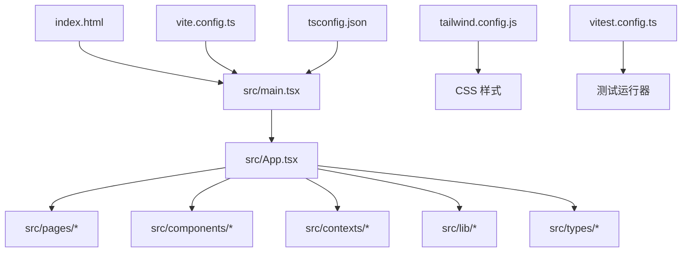
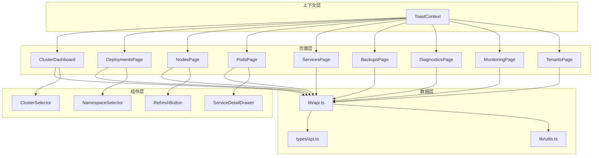
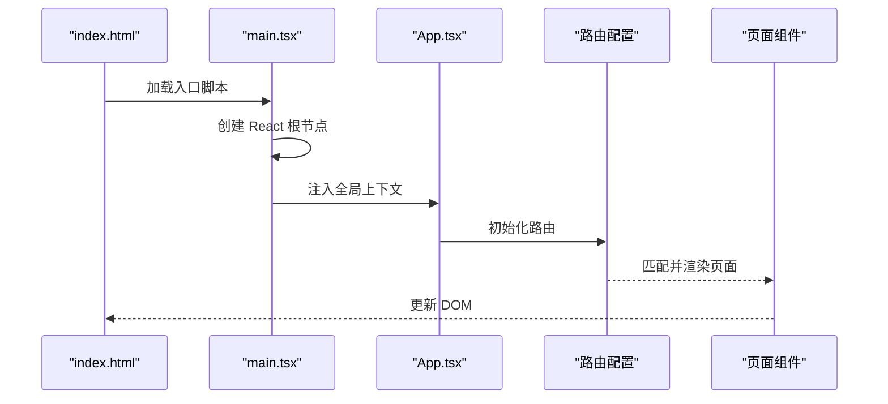
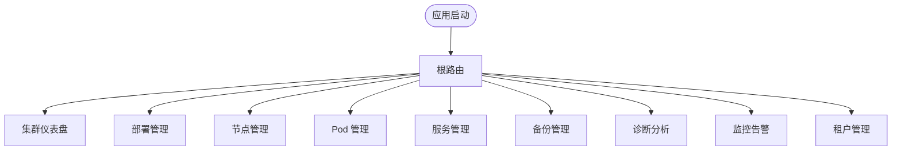
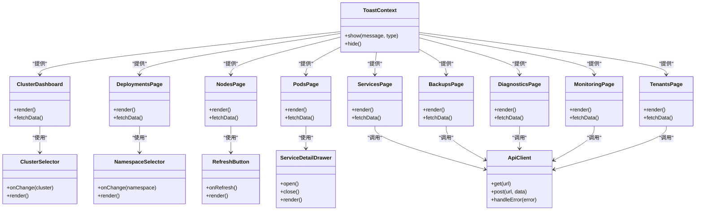
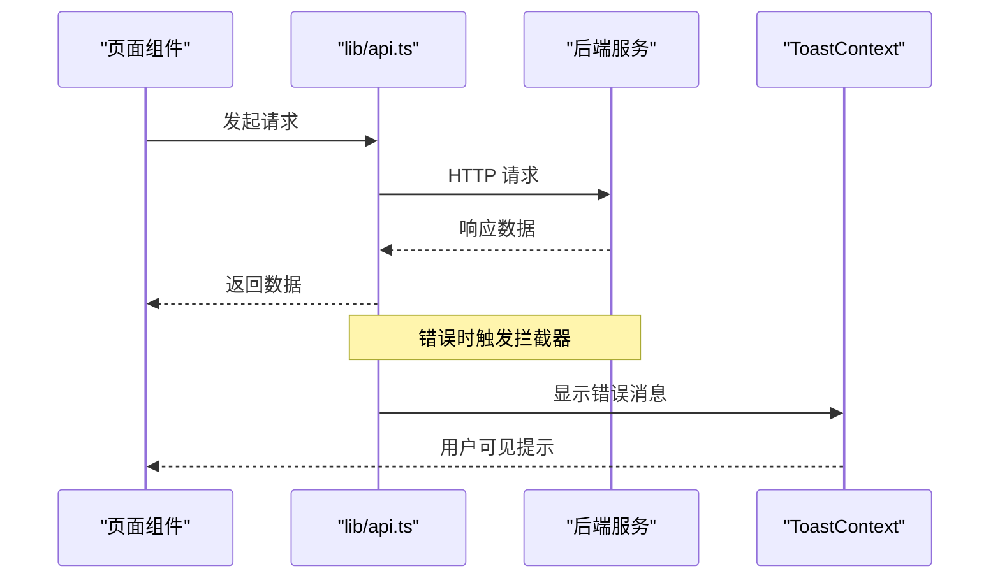
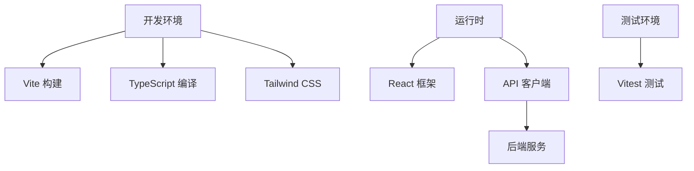

# 应用架构设计

<cite>
**本文引用的文件**   
- [web/package.json](file://web/package.json)
- [web/vite.config.ts](file://web/vite.config.ts)
- [web/tsconfig.json](file://web/tsconfig.json)
- [web/tsconfig.node.json](file://web/tsconfig.node.json)
- [web/index.html](file://web/index.html)
- [web/src/main.tsx](file://web/src/main.tsx)
- [web/src/App.tsx](file://web/src/App.tsx)
- [web/src/lib/api.ts](file://web/src/lib/api.ts)
- [web/src/pages/ClusterDashboard.tsx](file://web/src/pages/ClusterDashboard.tsx)
- [web/src/pages/DeploymentsPage.tsx](file://web/src/pages/DeploymentsPage.tsx)
- [web/src/pages/NodesPage.tsx](file://web/src/pages/NodesPage.tsx)
- [web/src/pages/PodsPage.tsx](file://web/src/pages/PodsPage.tsx)
- [web/src/pages/ServicesPage.tsx](file://web/src/pages/ServicesPage.tsx)
- [web/src/pages/BackupsPage.tsx](file://web/src/pages/BackupsPage.tsx)
- [web/src/pages/DiagnosticsPage.tsx](file://web/src/pages/DiagnosticsPage.tsx)
- [web/src/pages/MonitoringPage.tsx](file://web/src/pages/MonitoringPage.tsx)
- [web/src/pages/TenantsPage.tsx](file://web/src/pages/TenantsPage.tsx)
- [web/src/components/ClusterSelector.tsx](file://web/src/components/ClusterSelector.tsx)
- [web/src/components/NamespaceSelector.tsx](file://web/src/components/NamespaceSelector.tsx)
- [web/src/components/RefreshButton.tsx](file://web/src/components/RefreshButton.tsx)
- [web/src/components/ServiceDetailDrawer.tsx](file://web/src/components/ServiceDetailDrawer.tsx)
- [web/src/contexts/ToastContext.tsx](file://web/src/contexts/ToastContext.tsx)
- [web/src/types/api.ts](file://web/src/types/api.ts)
- [web/src/lib/utils.ts](file://web/src/lib/utils.ts)
- [web/postcss.config.js](file://web/postcss.config.js)
- [web/tailwind.config.js](file://web/tailwind.config.js)
- [web/vitest.config.ts](file://web/vitest.config.ts)
- [web/vitest.setup.ts](file://web/vitest.setup.ts)
</cite>

## 目录
1. [简介](#简介)
2. [项目结构](#项目结构)
3. [核心组件](#核心组件)
4. [架构总览](#架构总览)
5. [详细组件分析](#详细组件分析)
6. [依赖分析](#依赖分析)
7. [性能考虑](#性能考虑)
8. [故障排查指南](#故障排查指南)
9. [结论](#结论)
10. [附录](#附录)

## 简介
本文件面向 Klaw 前端应用的架构设计与实现，聚焦于 React + TypeScript 技术栈、Vite 构建配置、目录结构与模块组织、应用初始化流程、路由策略、组件层次与依赖管理，以及开发环境与 TypeScript 配置优化和性能调优建议。文档通过架构图与组件关系图帮助开发者快速理解整体设计思路，并提供可操作的排障与优化指引。

## 项目结构
Klaw 前端位于 web 目录，采用典型的 React + Vite + TypeScript 工程化结构：
- 入口与构建
  - index.html 提供页面骨架
  - vite.config.ts 定义构建、代理、插件等
  - tsconfig.json 与 tsconfig.node.json 分别约束浏览器与 Node 侧类型
  - package.json 声明依赖与脚本
- 源码组织
  - src/main.tsx 应用启动与根渲染
  - src/App.tsx 应用根组件（路由与全局上下文）
  - src/pages/* 按功能域划分的页面组件
  - src/components/* 通用 UI 组件
  - src/contexts/* 全局状态与上下文
  - src/lib/* API 客户端与工具函数
  - src/types/* 类型定义
- 样式与测试
  - tailwind.config.js、postcss.config.js 样式方案
  - vitest.config.ts、vitest.setup.ts 单元测试与集成测试配置

**图表来源** 
- [web/index.html:1-200](file://web/index.html#L1-L200)
- [web/src/main.tsx:1-200](file://web/src/main.tsx#L1-L200)
- [web/src/App.tsx:1-200](file://web/src/App.tsx#L1-L200)
- [web/vite.config.ts:1-200](file://web/vite.config.ts#L1-L200)
- [web/tsconfig.json:1-200](file://web/tsconfig.json#L1-L200)
- [web/tailwind.config.js:1-200](file://web/tailwind.config.js#L1-L200)
- [web/vitest.config.ts:1-200](file://web/vitest.config.ts#L1-L200)

**章节来源**
- [web/package.json:1-200](file://web/package.json#L1-L200)
- [web/vite.config.ts:1-200](file://web/vite.config.ts#L1-L200)
- [web/tsconfig.json:1-200](file://web/tsconfig.json#L1-L200)
- [web/tsconfig.node.json:1-200](file://web/tsconfig.node.json#L1-L200)
- [web/index.html:1-200](file://web/index.html#L1-L200)

## 核心组件
- 应用入口与根组件
  - main.tsx：创建 React 根节点、挂载到 DOM、注入全局上下文
  - App.tsx：集中路由配置、全局上下文提供者、布局与权限控制
- 页面组件（按领域划分）
  - ClusterDashboard.tsx：集群概览仪表盘
  - DeploymentsPage.tsx：部署管理
  - NodesPage.tsx：节点列表与详情
  - PodsPage.tsx：Pod 管理与监控
  - ServicesPage.tsx：服务发现与配置
  - BackupsPage.tsx：备份任务与历史
  - DiagnosticsPage.tsx：诊断与分析
  - MonitoringPage.tsx：指标与告警
  - TenantsPage.tsx：租户管理
- 通用组件
  - ClusterSelector.tsx：集群选择器
  - NamespaceSelector.tsx：命名空间选择器
  - RefreshButton.tsx：数据刷新按钮
  - ServiceDetailDrawer.tsx：服务详情抽屉
- 上下文与状态
  - ToastContext.tsx：全局消息提示上下文
- 数据与工具
  - lib/api.ts：统一 API 请求封装（拦截器、错误处理、重试）
  - lib/utils.ts：通用工具函数
  - types/api.ts：API 数据结构与类型定义

**章节来源**
- [web/src/main.tsx:1-200](file://web/src/main.tsx#L1-L200)
- [web/src/App.tsx:1-200](file://web/src/App.tsx#L1-L200)
- [web/src/pages/ClusterDashboard.tsx:1-200](file://web/src/pages/ClusterDashboard.tsx#L1-L200)
- [web/src/pages/DeploymentsPage.tsx:1-200](file://web/src/pages/DeploymentsPage.tsx#L1-L200)
- [web/src/pages/NodesPage.tsx:1-200](file://web/src/pages/NodesPage.tsx#L1-L200)
- [web/src/pages/PodsPage.tsx:1-200](file://web/src/pages/PodsPage.tsx#L1-L200)
- [web/src/pages/ServicesPage.tsx:1-200](file://web/src/pages/ServicesPage.tsx#L1-L200)
- [web/src/pages/BackupsPage.tsx:1-200](file://web/src/pages/BackupsPage.tsx#L1-L200)
- [web/src/pages/DiagnosticsPage.tsx:1-200](file://web/src/pages/DiagnosticsPage.tsx#L1-L200)
- [web/src/pages/MonitoringPage.tsx:1-200](file://web/src/pages/MonitoringPage.tsx#L1-L200)
- [web/src/pages/TenantsPage.tsx:1-200](file://web/src/pages/TenantsPage.tsx#L1-L200)
- [web/src/components/ClusterSelector.tsx:1-200](file://web/src/components/ClusterSelector.tsx#L1-L200)
- [web/src/components/NamespaceSelector.tsx:1-200](file://web/src/components/NamespaceSelector.tsx#L1-L200)
- [web/src/components/RefreshButton.tsx:1-200](file://web/src/components/RefreshButton.tsx#L1-L200)
- [web/src/components/ServiceDetailDrawer.tsx:1-200](file://web/src/components/ServiceDetailDrawer.tsx#L1-L200)
- [web/src/contexts/ToastContext.tsx:1-200](file://web/src/contexts/ToastContext.tsx#L1-L200)
- [web/src/lib/api.ts:1-200](file://web/src/lib/api.ts#L1-L200)
- [web/src/lib/utils.ts:1-200](file://web/src/lib/utils.ts#L1-L200)
- [web/src/types/api.ts:1-200](file://web/src/types/api.ts#L1-L200)

## 架构总览
Klaw 前端采用“页面-组件-上下文-数据层”的分层架构：
- 页面层：按业务域拆分，职责单一，负责数据获取与展示
- 组件层：可复用 UI 组件，关注交互与样式
- 上下文层：跨组件共享状态（如 Toast）
- 数据层：统一的 API 客户端与类型定义，屏蔽后端差异

**图表来源** 
- [web/src/App.tsx:1-200](file://web/src/App.tsx#L1-L200)
- [web/src/pages/ClusterDashboard.tsx:1-200](file://web/src/pages/ClusterDashboard.tsx#L1-L200)
- [web/src/pages/DeploymentsPage.tsx:1-200](file://web/src/pages/DeploymentsPage.tsx#L1-L200)
- [web/src/pages/NodesPage.tsx:1-200](file://web/src/pages/NodesPage.tsx#L1-L200)
- [web/src/pages/PodsPage.tsx:1-200](file://web/src/pages/PodsPage.tsx#L1-L200)
- [web/src/pages/ServicesPage.tsx:1-200](file://web/src/pages/ServicesPage.tsx#L1-L200)
- [web/src/pages/BackupsPage.tsx:1-200](file://web/src/pages/BackupsPage.tsx#L1-L200)
- [web/src/pages/DiagnosticsPage.tsx:1-200](file://web/src/pages/DiagnosticsPage.tsx#L1-L200)
- [web/src/pages/MonitoringPage.tsx:1-200](file://web/src/pages/MonitoringPage.tsx#L1-L200)
- [web/src/pages/TenantsPage.tsx:1-200](file://web/src/pages/TenantsPage.tsx#L1-L200)
- [web/src/components/ClusterSelector.tsx:1-200](file://web/src/components/ClusterSelector.tsx#L1-L200)
- [web/src/components/NamespaceSelector.tsx:1-200](file://web/src/components/NamespaceSelector.tsx#L1-L200)
- [web/src/components/RefreshButton.tsx:1-200](file://web/src/components/RefreshButton.tsx#L1-L200)
- [web/src/components/ServiceDetailDrawer.tsx:1-200](file://web/src/components/ServiceDetailDrawer.tsx#L1-L200)
- [web/src/contexts/ToastContext.tsx:1-200](file://web/src/contexts/ToastContext.tsx#L1-L200)
- [web/src/lib/api.ts:1-200](file://web/src/lib/api.ts#L1-L200)
- [web/src/types/api.ts:1-200](file://web/src/types/api.ts#L1-L200)
- [web/src/lib/utils.ts:1-200](file://web/src/lib/utils.ts#L1-L200)

## 详细组件分析

### 应用初始化流程
- index.html 加载资源并挂载根节点
- main.tsx 初始化 React 根、注入全局上下文（如 Toast）、挂载到 DOM
- App.tsx 配置路由、提供全局上下文、渲染页面容器

**图表来源** 
- [web/index.html:1-200](file://web/index.html#L1-L200)
- [web/src/main.tsx:1-200](file://web/src/main.tsx#L1-L200)
- [web/src/App.tsx:1-200](file://web/src/App.tsx#L1-L200)

**章节来源**
- [web/index.html:1-200](file://web/index.html#L1-L200)
- [web/src/main.tsx:1-200](file://web/src/main.tsx#L1-L200)
- [web/src/App.tsx:1-200](file://web/src/App.tsx#L1-L200)

### 路由配置策略
- 以页面为粒度进行路由划分，便于独立开发与维护
- 路由层级清晰：根路由 -> 功能域路由 -> 具体页面
- 支持懒加载与代码分割，提升首屏性能

**图表来源** 
- [web/src/App.tsx:1-200](file://web/src/App.tsx#L1-L200)
- [web/src/pages/ClusterDashboard.tsx:1-200](file://web/src/pages/ClusterDashboard.tsx#L1-L200)
- [web/src/pages/DeploymentsPage.tsx:1-200](file://web/src/pages/DeploymentsPage.tsx#L1-L200)
- [web/src/pages/NodesPage.tsx:1-200](file://web/src/pages/NodesPage.tsx#L1-L200)
- [web/src/pages/PodsPage.tsx:1-200](file://web/src/pages/PodsPage.tsx#L1-L200)
- [web/src/pages/ServicesPage.tsx:1-200](file://web/src/pages/ServicesPage.tsx#L1-L200)
- [web/src/pages/BackupsPage.tsx:1-200](file://web/src/pages/BackupsPage.tsx#L1-L200)
- [web/src/pages/DiagnosticsPage.tsx:1-200](file://web/src/pages/DiagnosticsPage.tsx#L1-L200)
- [web/src/pages/MonitoringPage.tsx:1-200](file://web/src/pages/MonitoringPage.tsx#L1-L200)
- [web/src/pages/TenantsPage.tsx:1-200](file://web/src/pages/TenantsPage.tsx#L1-L200)

**章节来源**
- [web/src/App.tsx:1-200](file://web/src/App.tsx#L1-L200)

### 组件层次结构与依赖关系
- 页面组件依赖通用组件与上下文
- 通用组件保持无状态或轻量状态，专注 UI 交互
- 上下文用于跨组件共享状态（如 Toast）

**图表来源** 
- [web/src/pages/ClusterDashboard.tsx:1-200](file://web/src/pages/ClusterDashboard.tsx#L1-L200)
- [web/src/pages/DeploymentsPage.tsx:1-200](file://web/src/pages/DeploymentsPage.tsx#L1-L200)
- [web/src/pages/NodesPage.tsx:1-200](file://web/src/pages/NodesPage.tsx#L1-L200)
- [web/src/pages/PodsPage.tsx:1-200](file://web/src/pages/PodsPage.tsx#L1-L200)
- [web/src/pages/ServicesPage.tsx:1-200](file://web/src/pages/ServicesPage.tsx#L1-L200)
- [web/src/pages/BackupsPage.tsx:1-200](file://web/src/pages/BackupsPage.tsx#L1-L200)
- [web/src/pages/DiagnosticsPage.tsx:1-200](file://web/src/pages/DiagnosticsPage.tsx#L1-L200)
- [web/src/pages/MonitoringPage.tsx:1-200](file://web/src/pages/MonitoringPage.tsx#L1-L200)
- [web/src/pages/TenantsPage.tsx:1-200](file://web/src/pages/TenantsPage.tsx#L1-L200)
- [web/src/components/ClusterSelector.tsx:1-200](file://web/src/components/ClusterSelector.tsx#L1-L200)
- [web/src/components/NamespaceSelector.tsx:1-200](file://web/src/components/NamespaceSelector.tsx#L1-L200)
- [web/src/components/RefreshButton.tsx:1-200](file://web/src/components/RefreshButton.tsx#L1-L200)
- [web/src/components/ServiceDetailDrawer.tsx:1-200](file://web/src/components/ServiceDetailDrawer.tsx#L1-L200)
- [web/src/contexts/ToastContext.tsx:1-200](file://web/src/contexts/ToastContext.tsx#L1-L200)
- [web/src/lib/api.ts:1-200](file://web/src/lib/api.ts#L1-L200)

**章节来源**
- [web/src/components/ClusterSelector.tsx:1-200](file://web/src/components/ClusterSelector.tsx#L1-L200)
- [web/src/components/NamespaceSelector.tsx:1-200](file://web/src/components/NamespaceSelector.tsx#L1-L200)
- [web/src/components/RefreshButton.tsx:1-200](file://web/src/components/RefreshButton.tsx#L1-L200)
- [web/src/components/ServiceDetailDrawer.tsx:1-200](file://web/src/components/ServiceDetailDrawer.tsx#L1-L200)
- [web/src/contexts/ToastContext.tsx:1-200](file://web/src/contexts/ToastContext.tsx#L1-L200)
- [web/src/lib/api.ts:1-200](file://web/src/lib/api.ts#L1-L200)

### API 数据流与错误处理
- 页面组件通过 lib/api.ts 发起请求
- 统一拦截器处理请求头、响应码、错误信息
- 错误信息通过 ToastContext 展示给用户

**图表来源** 
- [web/src/lib/api.ts:1-200](file://web/src/lib/api.ts#L1-L200)
- [web/src/contexts/ToastContext.tsx:1-200](file://web/src/contexts/ToastContext.tsx#L1-L200)

**章节来源**
- [web/src/lib/api.ts:1-200](file://web/src/lib/api.ts#L1-L200)
- [web/src/contexts/ToastContext.tsx:1-200](file://web/src/contexts/ToastContext.tsx#L1-L200)

## 依赖分析
- 构建与开发
  - Vite：快速构建与热更新
  - TypeScript：类型安全与开发体验
  - Tailwind CSS + PostCSS：原子化样式与构建优化
- 运行时依赖
  - React 生态：组件化与状态管理
  - 测试框架：Vitest 与相关工具
- 外部集成
  - 后端 API：通过 lib/api.ts 统一访问
  - Mock 服务：开发阶段模拟数据

**图表来源** 
- [web/package.json:1-200](file://web/package.json#L1-L200)
- [web/vite.config.ts:1-200](file://web/vite.config.ts#L1-L200)
- [web/tsconfig.json:1-200](file://web/tsconfig.json#L1-L200)
- [web/tailwind.config.js:1-200](file://web/tailwind.config.js#L1-L200)
- [web/vitest.config.ts:1-200](file://web/vitest.config.ts#L1-L200)

**章节来源**
- [web/package.json:1-200](file://web/package.json#L1-L200)
- [web/vite.config.ts:1-200](file://web/vite.config.ts#L1-L200)
- [web/tsconfig.json:1-200](file://web/tsconfig.json#L1-L200)
- [web/tailwind.config.js:1-200](file://web/tailwind.config.js#L1-L200)
- [web/vitest.config.ts:1-200](file://web/vitest.config.ts#L1-L200)

## 性能考虑
- 构建优化
  - 启用代码分割与懒加载，减少首屏体积
  - 使用 Vite 的预构建与缓存机制
  - 压缩资源与 Tree Shaking
- 运行时优化
  - 避免不必要的重渲染，合理使用 useMemo/useCallback
  - 分页与虚拟滚动处理大数据集
  - 请求去抖与防抖，减少重复请求
- 样式优化
  - 按需引入 Tailwind 类名，避免冗余
  - 使用 CSS 模块化或原子化样式
- 测试优化
  - 并行执行测试用例
  - Mock 外部依赖，加速测试运行

[本节为通用指导，不直接分析具体文件]

## 故障排查指南
- 常见问题
  - 构建失败：检查 TypeScript 配置与依赖版本
  - 路由不生效：确认路由配置与路径匹配
  - API 请求失败：检查网络、代理与错误拦截器
  - 样式异常：验证 Tailwind 配置与 PostCSS 插件
- 调试技巧
  - 使用浏览器开发者工具查看网络请求与组件状态
  - 在关键路径添加日志输出
  - 使用单元测试定位组件逻辑问题

**章节来源**
- [web/vite.config.ts:1-200](file://web/vite.config.ts#L1-L200)
- [web/tsconfig.json:1-200](file://web/tsconfig.json#L1-L200)
- [web/src/lib/api.ts:1-200](file://web/src/lib/api.ts#L1-L200)
- [web/tailwind.config.js:1-200](file://web/tailwind.config.js#L1-L200)

## 结论
Klaw 前端采用清晰的 React + TypeScript + Vite 架构，通过页面-组件-上下文-数据层的分层设计，实现了高内聚、低耦合的可维护性。结合 Tailwind CSS 与 Vitest 测试体系，提供了良好的开发体验与质量保障。建议在后续迭代中持续优化构建性能、扩展组件库与完善错误处理机制。

[本节为总结性内容，不直接分析具体文件]

## 附录
- 开发环境搭建
  - 安装依赖：npm install
  - 启动开发服务器：npm run dev
  - 构建生产版本：npm run build
- TypeScript 配置优化
  - 严格模式开启，提升类型安全
  - 路径别名配置，简化导入路径
  - 第三方库类型声明补充
- 性能调优清单
  - 启用代码分割与懒加载
  - 优化图片与静态资源
  - 监控与性能分析工具集成

[本节为补充信息，不直接分析具体文件]