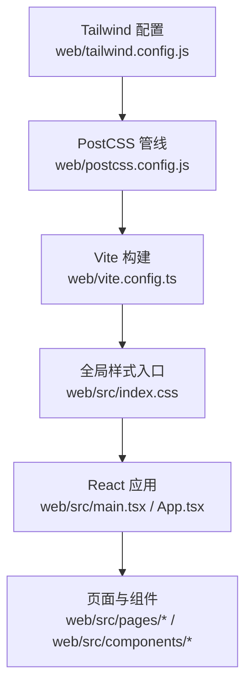
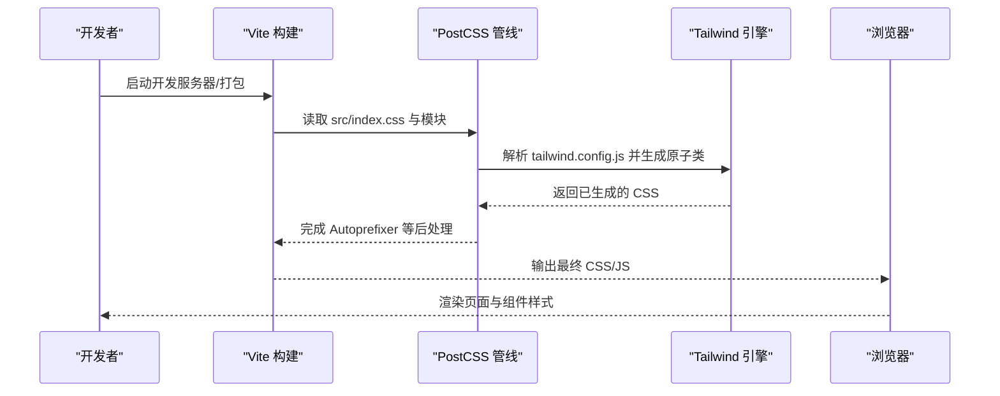
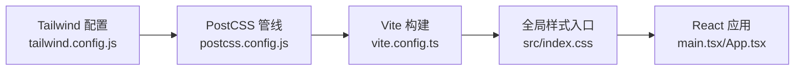

# 样式与主题

<cite>
**本文引用的文件**   
- [web/tailwind.config.js](file://web/tailwind.config.js)
- [web/postcss.config.js](file://web/postcss.config.js)
- [web/src/index.css](file://web/src/index.css)
- [web/package.json](file://web/package.json)
- [web/vite.config.ts](file://web/vite.config.ts)
</cite>

## 目录
1. [简介](#简介)
2. [项目结构](#项目结构)
3. [核心组件](#核心组件)
4. [架构总览](#架构总览)
5. [详细组件分析](#详细组件分析)
6. [依赖关系分析](#依赖关系分析)
7. [性能考虑](#性能考虑)
8. [故障排查指南](#故障排查指南)
9. [结论](#结论)
10. [附录](#附录)

## 简介
本文件面向 Klaw 前端（位于 web 目录）的样式系统与主题管理，系统性说明 Tailwind CSS 的配置与使用、CSS 模块化策略、响应式设计实现、PostCSS 处理流程、动画与跨浏览器兼容性方案，以及样式最佳实践、性能优化与调试技巧。文档以仓库中实际存在的配置文件和入口样式为依据，帮助开发者快速建立一致的视觉规范与可维护的样式工程体系。

## 项目结构
Klaw 前端的样式相关代码集中在 web 目录：
- 构建与工具链配置：tailwind.config.js、postcss.config.js、vite.config.ts、package.json
- 全局样式入口：src/index.css
- 页面与组件：src/pages、src/components（样式通过 Tailwind 原子类与少量自定义 CSS 组合实现）

图表来源
- [web/tailwind.config.js](file://web/tailwind.config.js)
- [web/postcss.config.js](file://web/postcss.config.js)
- [web/vite.config.ts](file://web/vite.config.ts)
- [web/src/index.css](file://web/src/index.css)

章节来源
- [web/tailwind.config.js](file://web/tailwind.config.js)
- [web/postcss.config.js](file://web/postcss.config.js)
- [web/vite.config.ts](file://web/vite.config.ts)
- [web/src/index.css](file://web/src/index.css)
- [web/package.json](file://web/package.json)

## 核心组件
- Tailwind CSS 配置：集中定义主题色板、字体、断点、插件扩展等，作为样式系统的“设计令牌”来源。
- PostCSS 管线：串联 Tailwind、Autoprefixer、CSS 变量/兼容处理等，确保输出稳定且跨浏览器可用。
- Vite 集成：将 Tailwind/PostCSS 纳入开发/生产构建流程，支持热更新与按需优化。
- 全局样式入口：统一导入 Tailwind 指令与必要的自定义样式，作为应用的样式根节点。

章节来源
- [web/tailwind.config.js](file://web/tailwind.config.js)
- [web/postcss.config.js](file://web/postcss.config.js)
- [web/vite.config.ts](file://web/vite.config.ts)
- [web/src/index.css](file://web/src/index.css)

## 架构总览
下图展示了从源码到最终样式的处理链路：Tailwind 配置提供设计令牌，PostCSS 对 CSS 进行转换与兼容增强，Vite 在构建时注入并优化，最终由 React 应用渲染。

图表来源
- [web/vite.config.ts](file://web/vite.config.ts)
- [web/postcss.config.js](file://web/postcss.config.js)
- [web/tailwind.config.js](file://web/tailwind.config.js)
- [web/src/index.css](file://web/src/index.css)

## 详细组件分析

### Tailwind CSS 配置与主题系统
- 设计令牌：通过主题配置集中管理颜色、间距、圆角、阴影、字体、断点等，形成统一的视觉语言。
- 扩展机制：利用插件或自定义扩展为业务组件提供稳定的样式基线。
- 响应式策略：基于断点的响应式前缀与容器查询配合，实现多端一致体验。
- 暗色模式：通过主题开关或媒体查询切换，保证明暗主题一致性。

建议实践
- 将常用语义化变量（如 primary、surface、text-primary）映射到设计令牌，避免直接使用原始色值。
- 组件级样式优先使用 Tailwind 原子类；仅在必要时补充少量自定义 CSS。
- 使用命名空间或前缀区分第三方库样式，避免冲突。

章节来源
- [web/tailwind.config.js](file://web/tailwind.config.js)

### PostCSS 处理流程与兼容性
- 插件编排：通常包含 Tailwind、Autoprefixer、CSS 变量/兼容补丁等，确保现代语法向下兼容。
- 构建阶段：开发环境侧重速度与错误提示，生产环境侧重体积与稳定性。
- 兼容性目标：根据 package.json 中的 browserslist 控制输出 CSS 的降级策略。

建议实践
- 明确 browserslist 目标，避免过度降级导致体积膨胀。
- 将需要全局生效的 CSS 特性（如 CSS 变量、@layer）放在 index.css 中统一管理。
- 谨慎引入重型插件，评估其对构建时间与产物体积的影响。

章节来源
- [web/postcss.config.js](file://web/postcss.config.js)
- [web/package.json](file://web/package.json)

### Vite 集成与构建优化
- 插件生态：Vite 原生支持与 Tailwind/PostCSS 集成，提供快速 HMR 与按需优化。
- 资源处理：CSS 自动拆分、压缩、内联关键样式，提升首屏加载性能。
- 环境变量：通过环境变量控制主题开关、调试开关等。

建议实践
- 在生产构建中启用 CSS 压缩与 Tree Shaking。
- 合理划分路由与组件，减少首屏 CSS 体积。
- 使用懒加载与代码分割，降低初始包体。

章节来源
- [web/vite.config.ts](file://web/vite.config.ts)
- [web/package.json](file://web/package.json)

### 全局样式入口与模块化策略
- 入口职责：index.css 负责导入 Tailwind 指令、全局变量与基础重置，作为样式根节点。
- 模块化策略：组件样式尽量使用原子类；复杂布局或动画可拆分为独立 CSS 模块，并通过 @import 或 Vite 模块机制组织。
- 层级管理：使用 @layer 或命名空间隔离基础层、组件层与页面层，避免样式覆盖混乱。

建议实践
- 限制全局样式范围，优先使用组件作用域。
- 将重复样式抽象为 Tailwind 扩展或 CSS 变量，保持单一事实来源。
- 对第三方库样式进行隔离与覆盖，避免污染全局。

章节来源
- [web/src/index.css](file://web/src/index.css)

### 响应式设计与断点策略
- 断点体系：基于 Tailwind 默认断点或自定义断点，统一移动端、平板、桌面端的布局规则。
- 容器查询：结合容器查询实现更细粒度的组件级响应式。
- 弹性布局：优先使用 Flex/Grid 与相对单位，提升适配能力。

建议实践
- 以移动优先为原则编写样式，逐步增强至大屏。
- 避免硬编码像素值，使用 rem/em 与设计令牌。
- 针对图片与媒体内容采用自适应尺寸与占位策略。

章节来源
- [web/tailwind.config.js](file://web/tailwind.config.js)

### CSS 动画与过渡效果
- 动画策略：优先使用 CSS 过渡与轻量动画，避免重排重绘。
- 性能优化：使用 transform/opacity 触发 GPU 加速，减少 layout/paint 开销。
- 可访问性：尊重用户偏好（如 prefers-reduced-motion），提供无动画降级。

建议实践
- 将动画封装为可复用类名或组件属性。
- 控制动画时长与缓动曲线，保证交互流畅。
- 在低性能设备上禁用复杂动画。

章节来源
- [web/src/index.css](file://web/src/index.css)

### 跨浏览器兼容性处理
- 目标平台：依据 browserslist 确定兼容范围，平衡功能与体积。
- 降级策略：对不支持的特性提供回退方案（如 CSS 变量回退为常量）。
- 测试验证：在主流浏览器与设备上进行回归测试。

建议实践
- 使用 Autoprefixer 自动添加厂商前缀。
- 对关键路径进行多端验证，记录已知问题与规避方案。
- 定期更新兼容目标与依赖版本。

章节来源
- [web/postcss.config.js](file://web/postcss.config.js)
- [web/package.json](file://web/package.json)

## 依赖关系分析
样式系统的依赖关系如下：Tailwind 配置驱动样式生成，PostCSS 负责转换与兼容，Vite 整合构建流程，最终输出到浏览器。

图表来源
- [web/tailwind.config.js](file://web/tailwind.config.js)
- [web/postcss.config.js](file://web/postcss.config.js)
- [web/vite.config.ts](file://web/vite.config.ts)
- [web/src/index.css](file://web/src/index.css)

章节来源
- [web/tailwind.config.js](file://web/tailwind.config.js)
- [web/postcss.config.js](file://web/postcss.config.js)
- [web/vite.config.ts](file://web/vite.config.ts)
- [web/src/index.css](file://web/src/index.css)

## 性能考虑
- 构建性能
  - 启用增量构建与缓存，缩短开发迭代时间。
  - 精简 Tailwind 白名单与插件，减少无用样式生成。
- 运行时性能
  - 优先使用 transform/opacity 动画，避免强制同步布局。
  - 合理使用懒加载与代码分割，降低首屏 CSS/JS 体积。
- 体积优化
  - 开启 CSS 压缩与 Tree Shaking。
  - 移除未使用的 Tailwind 类（可通过 Purge/Tailwind 扫描）。
- 可观测性
  - 使用浏览器开发者工具的性能面板定位瓶颈。
  - 监控 LCP/CLS/FID 等核心指标，持续优化。

[本节为通用指导，不直接分析具体文件]

## 故障排查指南
- 样式未生效
  - 检查 index.css 是否正确导入 Tailwind 指令。
  - 确认 Tailwind 配置中的内容路径是否覆盖组件与页面。
  - 查看 PostCSS/Vite 构建日志是否有错误或警告。
- 主题切换异常
  - 校验主题变量与作用域，避免全局覆盖。
  - 检查暗色模式媒体查询或数据属性切换逻辑。
- 响应式失效
  - 核对断点配置与设备视口设置。
  - 使用浏览器开发者工具的响应式模式验证。
- 动画卡顿
  - 检查是否触发了重排重绘，改用 GPU 友好属性。
  - 降低动画复杂度与频率。

章节来源
- [web/src/index.css](file://web/src/index.css)
- [web/tailwind.config.js](file://web/tailwind.config.js)
- [web/postcss.config.js](file://web/postcss.config.js)
- [web/vite.config.ts](file://web/vite.config.ts)

## 结论
通过 Tailwind CSS 的设计令牌、PostCSS 的兼容处理与 Vite 的高效构建，Klaw 前端建立了可扩展、可维护且高性能的样式系统。遵循本文档的最佳实践与规范，可在保证一致性的同时提升开发效率与用户体验。建议在团队内推广样式约定与审查流程，持续优化性能与可访问性。

[本节为总结性内容，不直接分析具体文件]

## 附录
- 术语表
  - 设计令牌：用于表达视觉风格的可复用变量（颜色、间距、字体等）。
  - 原子类：Tailwind 提供的最小粒度样式类，便于组合与复用。
  - 响应式：根据屏幕尺寸或容器大小动态调整样式的能力。
- 参考链接
  - Tailwind CSS 官方文档
  - PostCSS 官方文档
  - Vite 官方文档

[本节为概念性内容，不直接分析具体文件]