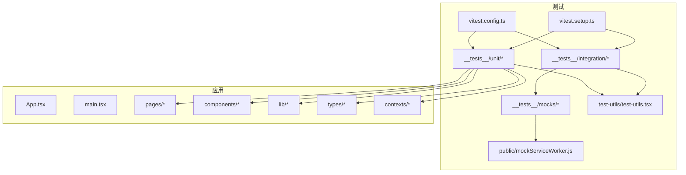
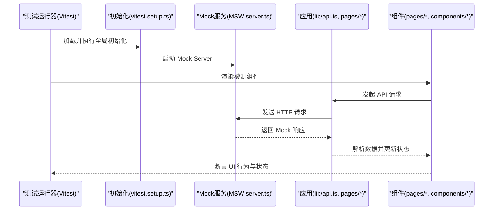
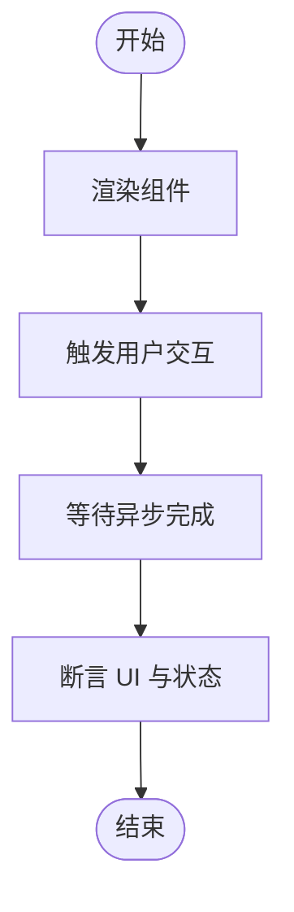
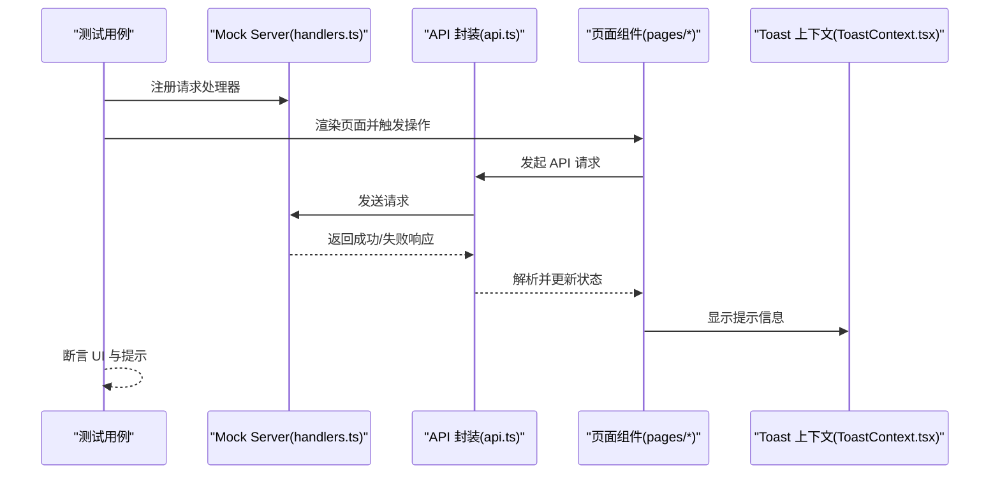
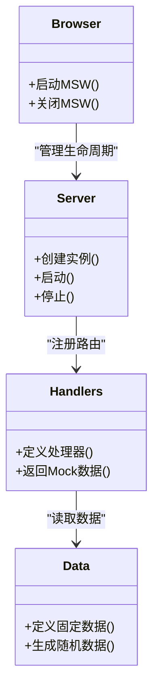
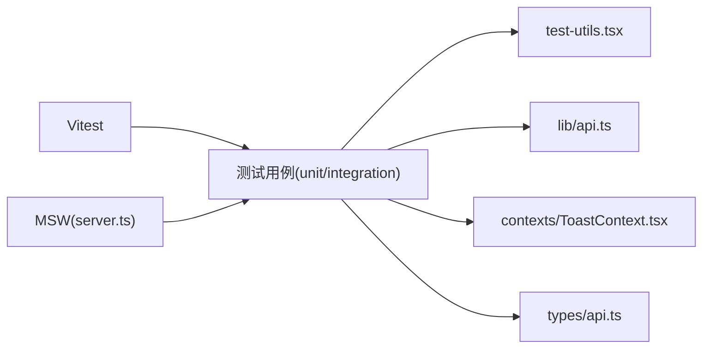

# 测试策略

<cite>
**本文档引用的文件**   
- [web/vitest.config.ts](file://web/vitest.config.ts)
- [web/vitest.setup.ts](file://web/vitest.setup.ts)
- [web/package.json](file://web/package.json)
- [web/test.sh](file://web/test.sh)
- [web/src/__tests__/unit/ClusterDashboard.test.tsx](file://web/src/__tests__/unit/ClusterDashboard.test.tsx)
- [web/src/__tests__/unit/DeploymentsPage.test.tsx](file://web/src/__tests__/unit/DeploymentsPage.test.tsx)
- [web/src/__tests__/unit/NodesPage.test.tsx](file://web/src/__tests__/unit/NodesPage.test.tsx)
- [web/src/__tests__/unit/PodsPage.test.tsx](file://web/src/__tests__/unit/PodsPage.test.tsx)
- [web/src/__tests__/integration/api.test.ts](file://web/src/__tests__/integration/api.test.ts)
- [web/src/__tests__/integration/error-handling.test.tsx](file://web/src/__tests__/integration/error-handling.test.tsx)
- [web/src/__tests__/mocks/browser.ts](file://web/src/__tests__/mocks/browser.ts)
- [web/src/__tests__/mocks/data.ts](file://web/src/__tests__/mocks/data.ts)
- [web/src/__tests__/mocks/handlers.ts](file://web/src/__tests__/mocks/handlers.ts)
- [web/src/__tests__/mocks/server.ts](file://web/src/__tests__/mocks/server.ts)
- [web/src/test-utils/test-utils.tsx](file://web/src/test-utils/test-utils.tsx)
- [web/src/lib/api.ts](file://web/src/lib/api.ts)
- [web/src/lib/utils.ts](file://web/src/lib/utils.ts)
- [web/src/pages/ClusterDashboard.tsx](file://web/src/pages/ClusterDashboard.tsx)
- [web/src/pages/DeploymentsPage.tsx](file://web/src/pages/DeploymentsPage.tsx)
- [web/src/pages/NodesPage.tsx](file://web/src/pages/NodesPage.tsx)
- [web/src/pages/PodsPage.tsx](file://web/src/pages/PodsPage.tsx)
- [web/src/components/ClusterSelector.tsx](file://web/src/components/ClusterSelector.tsx)
- [web/src/components/NamespaceSelector.tsx](file://web/src/components/NamespaceSelector.tsx)
- [web/src/components/RefreshButton.tsx](file://web/src/components/RefreshButton.tsx)
- [web/src/components/ServiceDetailDrawer.tsx](file://web/src/components/ServiceDetailDrawer.tsx)
- [web/src/contexts/ToastContext.tsx](file://web/src/contexts/ToastContext.tsx)
- [web/src/types/api.ts](file://web/src/types/api.ts)
- [web/src/App.tsx](file://web/src/App.tsx)
- [web/src/main.tsx](file://web/src/main.tsx)
- [web/index.html](file://web/index.html)
- [web/tsconfig.json](file://web/tsconfig.json)
- [web/vite.config.ts](file://web/vite.config.ts)
- [web/public/mockServiceWorker.js](file://web/public/mockServiceWorker.js)
</cite>

## 目录
1. [简介](#简介)
2. [项目结构](#项目结构)
3. [核心组件](#核心组件)
4. [架构总览](#架构总览)
5. [详细组件分析](#详细组件分析)
6. [依赖分析](#依赖分析)
7. [性能考虑](#性能考虑)
8. [故障排查指南](#故障排查指南)
9. [结论](#结论)
10. [附录](#附录)

## 简介
本文件为 Klaw 前端（位于 web 目录）的测试策略文档，覆盖单元测试、集成测试与端到端测试的实施方法。重点说明 Vitest 配置、测试工具函数使用、Mock 数据管理，以及组件测试、API 测试和异步操作测试的最佳实践。同时给出覆盖率要求、持续集成配置建议与调试技巧，帮助团队在保持代码质量的同时提升交付效率。

## 项目结构
前端测试相关代码集中在 web 目录下：
- 测试框架与运行环境：Vitest（配置文件 vitest.config.ts、初始化脚本 vitest.setup.ts）
- 测试分类：
  - 单元测试：src/__tests__/unit/*
  - 集成测试：src/__tests__/integration/*
  - Mock 服务：src/__tests__/mocks/* 与 public/mockServiceWorker.js
  - 测试工具：src/test-utils/test-utils.tsx
- 被测应用：src 下的页面、组件、上下文、类型定义与 API 封装

图表来源
- [web/vitest.config.ts](file://web/vitest.config.ts)
- [web/vitest.setup.ts](file://web/vitest.setup.ts)
- [web/src/__tests__/unit/ClusterDashboard.test.tsx](file://web/src/__tests__/unit/ClusterDashboard.test.tsx)
- [web/src/__tests__/integration/api.test.ts](file://web/src/__tests__/integration/api.test.ts)
- [web/src/__tests__/mocks/server.ts](file://web/src/__tests__/mocks/server.ts)
- [web/public/mockServiceWorker.js](file://web/public/mockServiceWorker.js)
- [web/src/test-utils/test-utils.tsx](file://web/src/test-utils/test-utils.tsx)

章节来源
- [web/vitest.config.ts](file://web/vitest.config.ts)
- [web/vitest.setup.ts](file://web/vitest.setup.ts)
- [web/package.json](file://web/package.json)
- [web/test.sh](file://web/test.sh)

## 核心组件
- 测试框架与配置
  - Vitest：通过 vitest.config.ts 指定测试环境、匹配规则、覆盖率与全局设置；通过 vitest.setup.ts 注入全局 Mock 与服务拦截器。
  - 入口脚本 test.sh：统一执行测试命令，便于本地与 CI 一致化运行。
- 测试工具
  - test-utils.tsx：封装渲染组件、等待 DOM 更新、模拟用户交互等常用能力，减少重复样板代码。
- Mock 体系
  - __tests__/mocks：集中管理 MSW 服务器、处理器与数据，确保 API 调用稳定可控。
  - public/mockServiceWorker.js：MSW 运行时 Worker，用于浏览器环境拦截网络请求。
- 被测模块
  - pages/*：页面级组件，通常包含数据获取与状态展示逻辑。
  - components/*：可复用 UI 组件，适合进行单元与交互测试。
  - lib/api.ts：API 封装层，适合进行接口契约与错误处理测试。
  - types/api.ts：类型定义，保证前后端数据结构一致性。

章节来源
- [web/vitest.config.ts](file://web/vitest.config.ts)
- [web/vitest.setup.ts](file://web/vitest.setup.ts)
- [web/test.sh](file://web/test.sh)
- [web/src/test-utils/test-utils.tsx](file://web/src/test-utils/test-utils.tsx)
- [web/src/__tests__/mocks/server.ts](file://web/src/__tests__/mocks/server.ts)
- [web/src/__tests__/mocks/handlers.ts](file://web/src/__tests__/mocks/handlers.ts)
- [web/src/__tests__/mocks/data.ts](file://web/src/__tests__/mocks/data.ts)
- [web/public/mockServiceWorker.js](file://web/public/mockServiceWorker.js)
- [web/src/lib/api.ts](file://web/src/lib/api.ts)
- [web/src/types/api.ts](file://web/src/types/api.ts)

## 架构总览
下图展示了从测试运行到被测组件/页面的关键流程，包括 Vitest 启动、MSW 拦截、API 调用与组件渲染。

图表来源
- [web/vitest.setup.ts](file://web/vitest.setup.ts)
- [web/src/__tests__/mocks/server.ts](file://web/src/__tests__/mocks/server.ts)
- [web/src/lib/api.ts](file://web/src/lib/api.ts)
- [web/src/pages/ClusterDashboard.tsx](file://web/src/pages/ClusterDashboard.tsx)
- [web/src/pages/DeploymentsPage.tsx](file://web/src/pages/DeploymentsPage.tsx)
- [web/src/pages/NodesPage.tsx](file://web/src/pages/NodesPage.tsx)
- [web/src/pages/PodsPage.tsx](file://web/src/pages/PodsPage.tsx)

## 详细组件分析

### 单元测试（组件与工具）
- 目标
  - 验证页面与组件在不同输入下的渲染结果与交互行为。
  - 确保工具函数与业务逻辑的正确性。
- 实施要点
  - 使用 test-utils.tsx 中的渲染与交互封装，简化测试编写。
  - 对需要外部依赖的模块（如 API、路由、上下文）进行隔离或 Mock。
  - 关注边界条件与异常路径，例如空数据、加载态、错误态。
- 示例覆盖
  - ClusterDashboard.test.tsx、DeploymentsPage.test.tsx、NodesPage.test.tsx、PodsPage.test.tsx

图表来源
- [web/src/test-utils/test-utils.tsx](file://web/src/test-utils/test-utils.tsx)
- [web/src/__tests__/unit/ClusterDashboard.test.tsx](file://web/src/__tests__/unit/ClusterDashboard.test.tsx)
- [web/src/__tests__/unit/DeploymentsPage.test.tsx](file://web/src/__tests__/unit/DeploymentsPage.test.tsx)
- [web/src/__tests__/unit/NodesPage.test.tsx](file://web/src/__tests__/unit/NodesPage.test.tsx)
- [web/src/__tests__/unit/PodsPage.test.tsx](file://web/src/__tests__/unit/PodsPage.test.tsx)

章节来源
- [web/src/test-utils/test-utils.tsx](file://web/src/test-utils/test-utils.tsx)
- [web/src/__tests__/unit/ClusterDashboard.test.tsx](file://web/src/__tests__/unit/ClusterDashboard.test.tsx)
- [web/src/__tests__/unit/DeploymentsPage.test.tsx](file://web/src/__tests__/unit/DeploymentsPage.test.tsx)
- [web/src/__tests__/unit/NodesPage.test.tsx](file://web/src/__tests__/unit/NodesPage.test.tsx)
- [web/src/__tests__/unit/PodsPage.test.tsx](file://web/src/__tests__/unit/PodsPage.test.tsx)

### 集成测试（API 与错误处理）
- 目标
  - 验证页面与 API 层的协作，包括请求构造、响应解析与错误处理。
  - 确保在异常场景下 UI 能正确反馈。
- 实施要点
  - 使用 MSW 拦截所有网络请求，提供稳定的 Mock 数据。
  - 覆盖成功、失败、超时、权限不足等常见分支。
  - 结合 toast 上下文验证用户提示是否正确显示。
- 示例覆盖
  - api.test.ts、error-handling.test.tsx

图表来源
- [web/src/__tests__/integration/api.test.ts](file://web/src/__tests__/integration/api.test.ts)
- [web/src/__tests__/integration/error-handling.test.tsx](file://web/src/__tests__/integration/error-handling.test.tsx)
- [web/src/__tests__/mocks/handlers.ts](file://web/src/__tests__/mocks/handlers.ts)
- [web/src/lib/api.ts](file://web/src/lib/api.ts)
- [web/src/contexts/ToastContext.tsx](file://web/src/contexts/ToastContext.tsx)

章节来源
- [web/src/__tests__/integration/api.test.ts](file://web/src/__tests__/integration/api.test.ts)
- [web/src/__tests__/integration/error-handling.test.tsx](file://web/src/__tests__/integration/error-handling.test.tsx)
- [web/src/__tests__/mocks/handlers.ts](file://web/src/__tests__/mocks/handlers.ts)
- [web/src/lib/api.ts](file://web/src/lib/api.ts)
- [web/src/contexts/ToastContext.tsx](file://web/src/contexts/ToastContext.tsx)

### 端到端测试（MSW 与浏览器环境）
- 目标
  - 在接近真实浏览器的环境中验证完整用户流程。
  - 通过 MSW 控制后端行为，确保端到端稳定性。
- 实施要点
  - 使用 vitest.setup.ts 初始化 MSW 服务，确保每个测试用例前环境干净。
  - 将公共 Mock 数据与处理器集中管理，避免分散维护成本。
  - 结合 public/mockServiceWorker.js 实现请求拦截。
- 示例覆盖
  - browser.ts、server.ts、handlers.ts、data.ts、mockServiceWorker.js

图表来源
- [web/src/__tests__/mocks/browser.ts](file://web/src/__tests__/mocks/browser.ts)
- [web/src/__tests__/mocks/server.ts](file://web/src/__tests__/mocks/server.ts)
- [web/src/__tests__/mocks/handlers.ts](file://web/src/__tests__/mocks/handlers.ts)
- [web/src/__tests__/mocks/data.ts](file://web/src/__tests__/mocks/data.ts)
- [web/public/mockServiceWorker.js](file://web/public/mockServiceWorker.js)

章节来源
- [web/src/__tests__/mocks/browser.ts](file://web/src/__tests__/mocks/browser.ts)
- [web/src/__tests__/mocks/server.ts](file://web/src/__tests__/mocks/server.ts)
- [web/src/__tests__/mocks/handlers.ts](file://web/src/__tests__/mocks/handlers.ts)
- [web/src/__tests__/mocks/data.ts](file://web/src/__tests__/mocks/data.ts)
- [web/public/mockServiceWorker.js](file://web/public/mockServiceWorker.js)

### 异步操作测试最佳实践
- 原则
  - 明确区分同步与异步断言，使用等待机制确保状态稳定后再断言。
  - 对 Promise 与定时器进行合理 Mock，避免竞态条件。
- 实践
  - 在 test-utils.tsx 中封装等待与断言辅助方法。
  - 在集成测试中通过 MSW 控制响应延迟与错误，验证 UI 的加载与错误态。

章节来源
- [web/src/test-utils/test-utils.tsx](file://web/src/test-utils/test-utils.tsx)
- [web/src/__tests__/integration/api.test.ts](file://web/src/__tests__/integration/api.test.ts)
- [web/src/__tests__/integration/error-handling.test.tsx](file://web/src/__tests__/integration/error-handling.test.tsx)

## 依赖分析
- 测试框架依赖
  - Vitest：测试运行与断言
  - MSW：网络请求拦截与 Mock
  - React Testing Library（若使用）：组件渲染与查询
- 应用依赖
  - lib/api.ts：API 封装
  - contexts/ToastContext.tsx：用户提示
  - types/api.ts：类型约束
- 测试工具依赖
  - test-utils.tsx：通用测试能力

图表来源
- [web/vitest.config.ts](file://web/vitest.config.ts)
- [web/src/__tests__/mocks/server.ts](file://web/src/__tests__/mocks/server.ts)
- [web/src/test-utils/test-utils.tsx](file://web/src/test-utils/test-utils.tsx)
- [web/src/lib/api.ts](file://web/src/lib/api.ts)
- [web/src/contexts/ToastContext.tsx](file://web/src/contexts/ToastContext.tsx)
- [web/src/types/api.ts](file://web/src/types/api.ts)

章节来源
- [web/vitest.config.ts](file://web/vitest.config.ts)
- [web/src/__tests__/mocks/server.ts](file://web/src/__tests__/mocks/server.ts)
- [web/src/test-utils/test-utils.tsx](file://web/src/test-utils/test-utils.tsx)
- [web/src/lib/api.ts](file://web/src/lib/api.ts)
- [web/src/contexts/ToastContext.tsx](file://web/src/contexts/ToastContext.tsx)
- [web/src/types/api.ts](file://web/src/types/api.ts)

## 性能考虑
- 测试执行优化
  - 合理划分测试文件，避免单文件过大导致执行缓慢。
  - 使用并行执行（Vitest 默认支持），但注意共享资源隔离。
- Mock 与数据
  - 集中管理 Mock 数据，减少重复构建与内存占用。
  - 按需加载大型数据集，避免不必要的初始化开销。
- 渲染与交互
  - 最小化重渲染，必要时使用快照对比与增量断言。
  - 避免在测试中触发真实网络请求，始终使用 MSW。

[本节为通用指导，不直接分析具体文件]

## 故障排查指南
- 常见问题
  - 测试无法识别组件或样式：检查 tsconfig.json 与 vite.config.ts 的路径映射与别名。
  - MSW 未生效：确认 vitest.setup.ts 已启动 Mock Server，且 public/mockServiceWorker.js 存在。
  - 异步断言失败：确保使用正确的等待机制，避免竞态条件。
- 调试技巧
  - 在测试中使用日志输出关键状态，定位问题根因。
  - 逐步缩小范围，先验证 API 层再验证 UI 层。
  - 利用 Vitest 的 watch 模式快速迭代。

章节来源
- [web/vitest.config.ts](file://web/vitest.config.ts)
- [web/vitest.setup.ts](file://web/vitest.setup.ts)
- [web/tsconfig.json](file://web/tsconfig.json)
- [web/vite.config.ts](file://web/vite.config.ts)
- [web/public/mockServiceWorker.js](file://web/public/mockServiceWorker.js)

## 结论
通过统一的 Vitest 配置、完善的 Mock 体系与清晰的测试分层，Klaw 前端能够在保证质量的前提下高效迭代。建议团队遵循本文档的实践，持续提升测试覆盖率与稳定性，并在 CI 中固化测试流程，确保每次提交都经过充分验证。

[本节为总结，不直接分析具体文件]

## 附录
- 覆盖率要求
  - 建议行覆盖率不低于 80%，分支覆盖率不低于 70%。
  - 关键模块（API 封装、错误处理、核心组件）应达到更高标准。
- 持续集成配置
  - 在 CI 中执行 test.sh，确保与本地一致。
  - 收集覆盖率报告并上传至平台，设置阈值门禁。
- 调试技巧补充
  - 使用 Vitest 的 --inspect 模式配合浏览器调试。
  - 针对复杂交互，录制测试步骤并回放以定位问题。

章节来源
- [web/test.sh](file://web/test.sh)
- [web/package.json](file://web/package.json)
- [web/vitest.config.ts](file://web/vitest.config.ts)