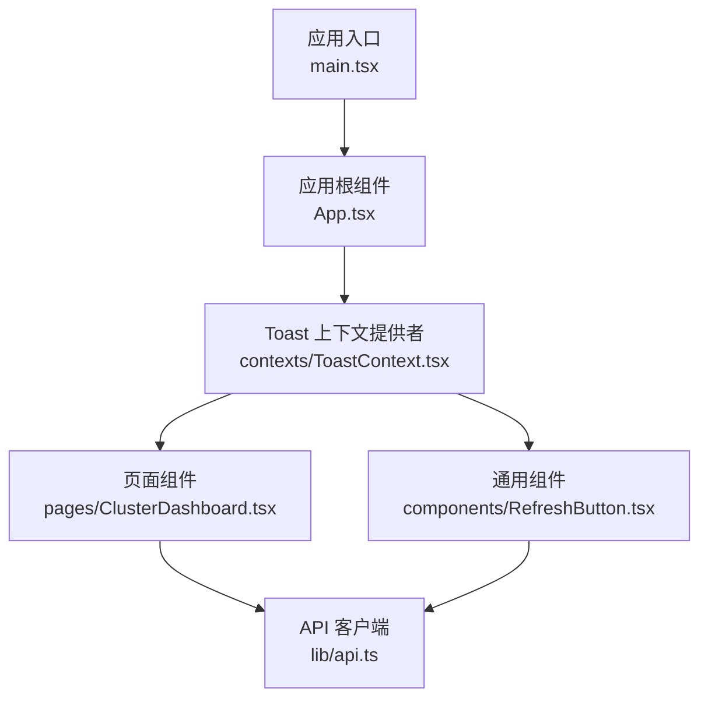
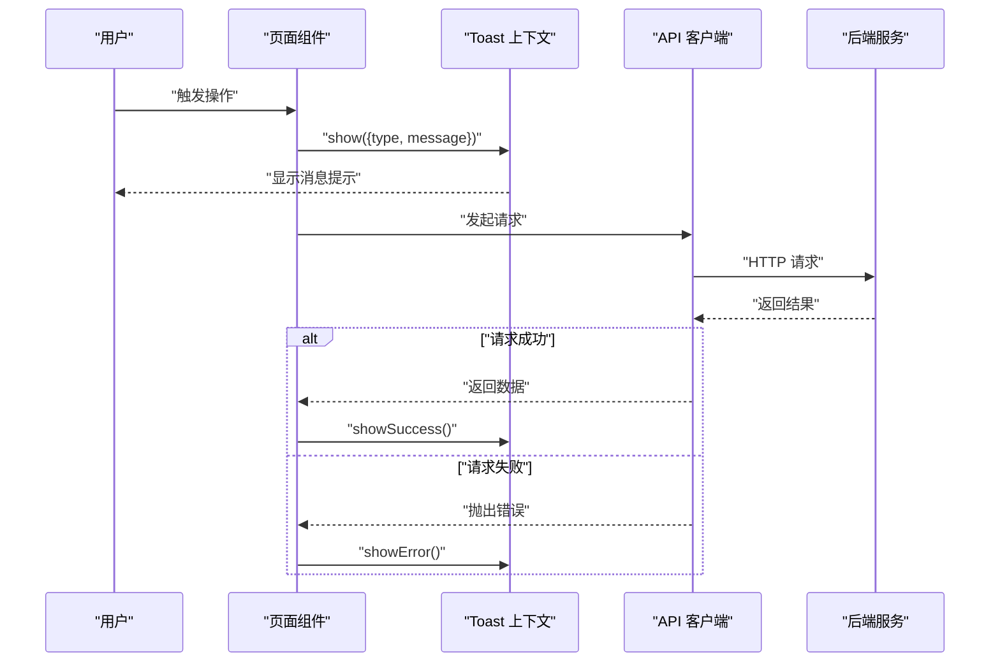
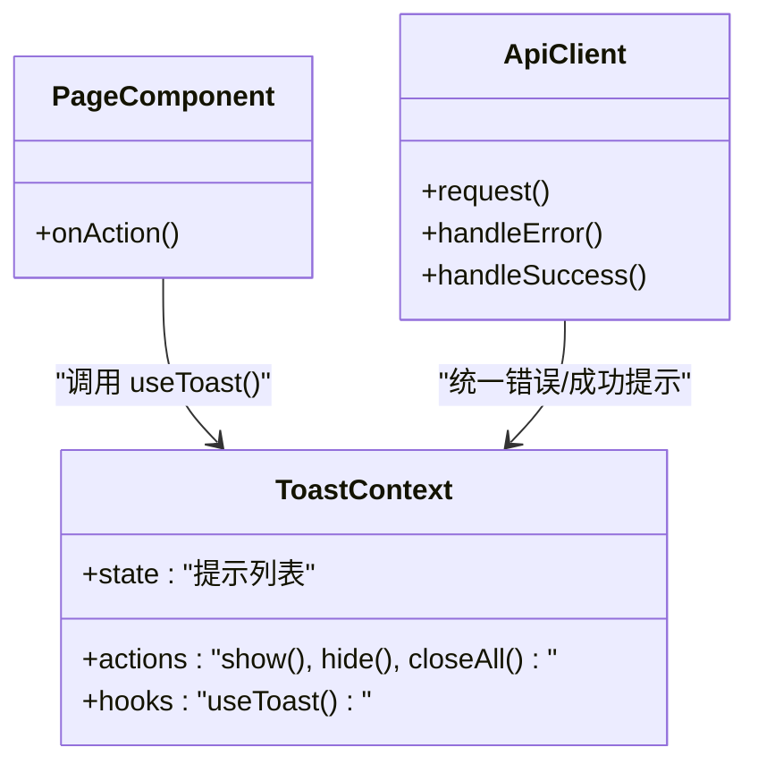
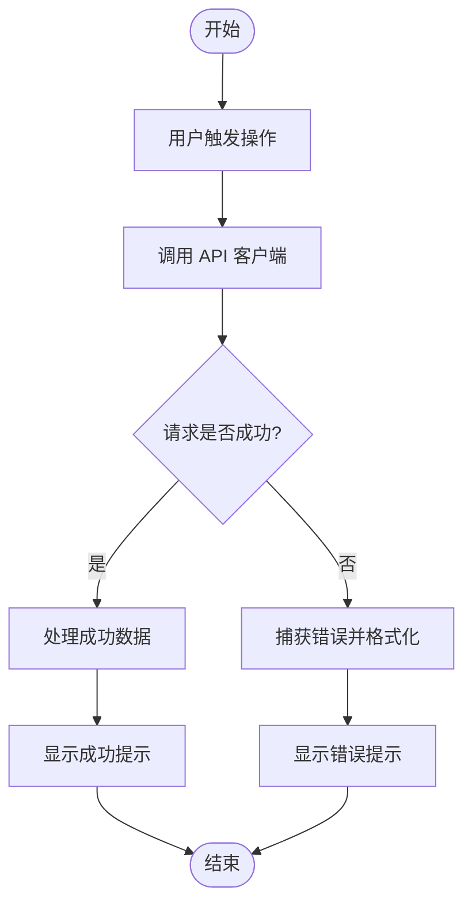
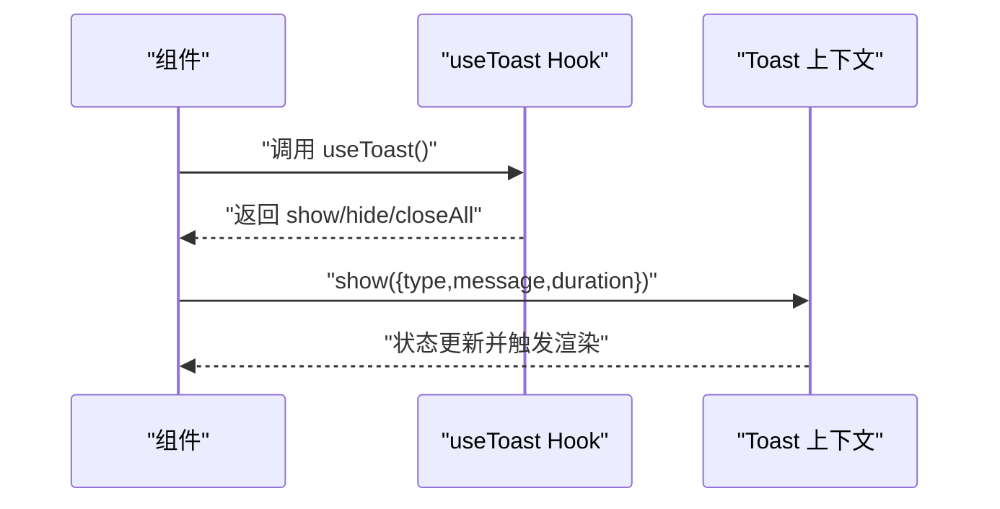
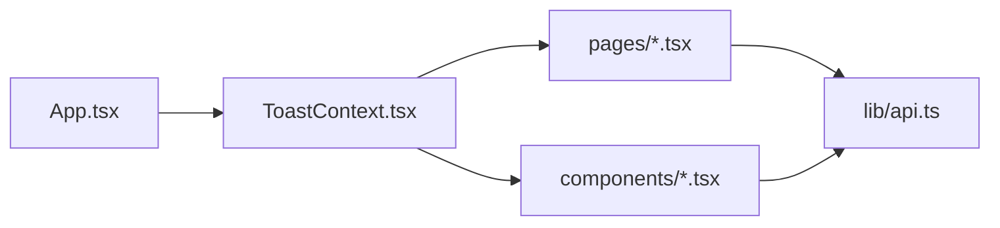

# 状态管理

<cite>
**本文引用的文件**   
- [web/src/contexts/ToastContext.tsx](file://web/src/contexts/ToastContext.tsx)
- [web/src/main.tsx](file://web/src/main.tsx)
- [web/src/App.tsx](file://web/src/App.tsx)
- [web/src/lib/api.ts](file://web/src/lib/api.ts)
- [web/src/pages/ClusterDashboard.tsx](file://web/src/pages/ClusterDashboard.tsx)
- [web/src/components/RefreshButton.tsx](file://web/src/components/RefreshButton.tsx)
</cite>

## 目录
1. [简介](#简介)
2. [项目结构](#项目结构)
3. [核心组件](#核心组件)
4. [架构总览](#架构总览)
5. [详细组件分析](#详细组件分析)
6. [依赖关系分析](#依赖关系分析)
7. [性能考虑](#性能考虑)
8. [故障排查指南](#故障排查指南)
9. [结论](#结论)
10. [附录](#附录)

## 简介
本文件面向 Klaw 前端的状态管理方案，重点围绕 React Context API 的使用模式、全局状态设计与数据流管理展开。文档将详细说明 ToastContext（消息提示上下文）的实现原理、状态更新机制与跨组件通信方式，并给出状态持久化策略、错误处理模式与性能优化技巧。同时提供最佳实践与常见问题解决方案，帮助开发者在复杂 UI 中稳定地管理用户反馈与轻量级全局状态。

## 项目结构
Klaw 前端采用基于 React + Vite 的工程组织方式，状态管理集中在 contexts 目录，通过 React Context 暴露全局能力；页面与通用组件按需消费上下文。关键路径如下：
- 应用入口与根节点包裹：main.tsx、App.tsx
- 全局上下文定义与提供者：contexts/ToastContext.tsx
- 业务页面与通用组件：pages/*、components/*
- 网络请求封装：lib/api.ts

图表来源
- [web/src/main.tsx](file://web/src/main.tsx)
- [web/src/App.tsx](file://web/src/App.tsx)
- [web/src/contexts/ToastContext.tsx](file://web/src/contexts/ToastContext.tsx)
- [web/src/pages/ClusterDashboard.tsx](file://web/src/pages/ClusterDashboard.tsx)
- [web/src/components/RefreshButton.tsx](file://web/src/components/RefreshButton.tsx)
- [web/src/lib/api.ts](file://web/src/lib/api.ts)

章节来源
- [web/src/main.tsx](file://web/src/main.tsx)
- [web/src/App.tsx](file://web/src/App.tsx)
- [web/src/contexts/ToastContext.tsx](file://web/src/contexts/ToastContext.tsx)

## 核心组件
- ToastContext：提供统一的“消息提示”能力，包括显示成功、失败、信息、警告等类型提示，支持自动关闭、队列控制与去重。
- 应用入口与根组件：负责挂载 Toast 上下文提供者，确保全应用可访问。
- 业务组件：通过 Hook 或 Consumer 订阅 Toast 上下文，触发提示并在合适时机消隐。
- API 层：集中处理请求/响应拦截，统一展示错误提示与成功反馈。

章节来源
- [web/src/contexts/ToastContext.tsx](file://web/src/contexts/ToastContext.tsx)
- [web/src/main.tsx](file://web/src/main.tsx)
- [web/src/App.tsx](file://web/src/App.tsx)
- [web/src/lib/api.ts](file://web/src/lib/api.ts)

## 架构总览
下图展示了以 Context 为核心的轻量级状态管理架构：应用启动时注入 Toast 上下文，页面与组件通过 Hook 消费；API 层作为副作用中心，统一对外部交互进行错误与成功提示。

图表来源
- [web/src/pages/ClusterDashboard.tsx](file://web/src/pages/ClusterDashboard.tsx)
- [web/src/contexts/ToastContext.tsx](file://web/src/contexts/ToastContext.tsx)
- [web/src/lib/api.ts](file://web/src/lib/api.ts)

## 详细组件分析

### ToastContext 实现原理与状态设计
- 状态模型
  - 当前提示列表：包含 id、类型、内容、持续时间、是否可关闭等字段。
  - 队列与去重：按优先级与时间戳排序，避免重复提示。
  - 生命周期：创建、显示、自动关闭、手动关闭、销毁。
- 更新机制
  - 使用 React State 驱动渲染，通过 dispatch-style 的 action 函数更新状态。
  - 定时器用于自动关闭，清理逻辑在卸载或关闭时执行。
- 组件间通信
  - 通过 createContext + useContext 暴露 show/hide/closeAll 等方法。
  - 组件无需层层透传 props，直接调用 Hook 即可触发提示。

图表来源
- [web/src/contexts/ToastContext.tsx](file://web/src/contexts/ToastContext.tsx)
- [web/src/pages/ClusterDashboard.tsx](file://web/src/pages/ClusterDashboard.tsx)
- [web/src/lib/api.ts](file://web/src/lib/api.ts)

章节来源
- [web/src/contexts/ToastContext.tsx](file://web/src/contexts/ToastContext.tsx)

### 数据流管理与错误处理模式
- 数据流
  - 用户操作 -> 页面组件 -> API 客户端 -> 后端服务 -> 响应回传 -> 页面组件 -> Toast 上下文 -> 用户界面。
- 错误处理
  - API 层捕获异常，转换为统一错误对象，交由 Toast 上下文展示。
  - 区分网络错误、业务错误与超时错误，提供不同提示类型与文案模板。
- 成功反馈
  - 对写操作成功后统一展示成功提示，提升用户体验。

图表来源
- [web/src/lib/api.ts](file://web/src/lib/api.ts)
- [web/src/contexts/ToastContext.tsx](file://web/src/contexts/ToastContext.tsx)

章节来源
- [web/src/lib/api.ts](file://web/src/lib/api.ts)
- [web/src/contexts/ToastContext.tsx](file://web/src/contexts/ToastContext.tsx)

### 组件间通信方式与使用模式
- 使用模式
  - 在页面或组件内部通过 Hook 获取 show/hide/closeAll 方法。
  - 在事件回调或副作用中调用相应方法，传入类型与消息。
- 通信原则
  - 单向数据流：组件只消费上下文，不修改其内部状态。
  - 最小化依赖：仅在需要时引入 Hook，避免不必要的重渲染。

图表来源
- [web/src/contexts/ToastContext.tsx](file://web/src/contexts/ToastContext.tsx)

章节来源
- [web/src/contexts/ToastContext.tsx](file://web/src/contexts/ToastContext.tsx)

### 状态持久化策略
- 适用场景
  - 对于非敏感、可恢复的用户偏好（如语言、主题），可使用 localStorage/sessionStorage。
  - 对于敏感或易变数据，不建议持久化到本地存储。
- 实现建议
  - 在 Provider 初始化时读取本地存储，合并默认值。
  - 变更状态后异步写入存储，避免阻塞主线程。
  - 提供迁移与降级策略，兼容旧版本数据结构。

[本节为概念性说明，不直接分析具体文件]

### 性能优化技巧
- 减少重渲染
  - 将 show/hide/closeAll 等方法 memoize，避免每次渲染产生新引用。
  - 使用 useMemo/useCallback 缓存派生数据与回调。
- 批量更新
  - 多次提示合并为一次状态更新，降低渲染频率。
- 延迟与节流
  - 高频操作（如滚动、输入）触发提示时使用防抖/节流。
- 资源释放
  - 组件卸载时清理定时器与监听器，防止内存泄漏。

[本节为概念性说明，不直接分析具体文件]

## 依赖关系分析
- 上下文依赖
  - App 根组件需包裹 Toast 提供者，确保子树可用。
  - 页面与组件仅依赖 useToast Hook，不感知内部实现。
- API 层依赖
  - 统一错误处理与提示，避免在各组件重复实现。
- 外部依赖
  - React 提供的 Context、Hooks 与调度机制。

图表来源
- [web/src/App.tsx](file://web/src/App.tsx)
- [web/src/contexts/ToastContext.tsx](file://web/src/contexts/ToastContext.tsx)
- [web/src/pages/ClusterDashboard.tsx](file://web/src/pages/ClusterDashboard.tsx)
- [web/src/components/RefreshButton.tsx](file://web/src/components/RefreshButton.tsx)
- [web/src/lib/api.ts](file://web/src/lib/api.ts)

章节来源
- [web/src/App.tsx](file://web/src/App.tsx)
- [web/src/contexts/ToastContext.tsx](file://web/src/contexts/ToastContext.tsx)
- [web/src/lib/api.ts](file://web/src/lib/api.ts)

## 性能考虑
- 渲染优化
  - 使用 React.memo 包裹纯展示组件，避免无关更新。
  - 拆分大组件，按需加载与懒加载路由。
- 状态更新
  - 合并多次状态更新，减少 setState 调用次数。
  - 使用不可变更新模式，便于比较与缓存。
- 网络优化
  - 请求去重与缓存，避免重复请求。
  - 合理设置超时与重试策略。

[本节为概念性说明，不直接分析具体文件]

## 故障排查指南
- 常见问题
  - 提示未显示：检查 Provider 是否正确包裹，Hook 是否在有效作用域内调用。
  - 提示重复：检查去重逻辑与唯一 ID 生成。
  - 内存泄漏：确认定时器与监听器在卸载时清理。
  - 错误未捕获：确认 API 层异常处理与 try/catch 覆盖范围。
- 调试建议
  - 在开发环境打印状态变化与调用栈。
  - 使用浏览器 DevTools 观察组件渲染与上下文状态。
  - 编写单元测试验证提示行为与边界条件。

章节来源
- [web/src/contexts/ToastContext.tsx](file://web/src/contexts/ToastContext.tsx)
- [web/src/lib/api.ts](file://web/src/lib/api.ts)

## 结论
Klaw 前端采用基于 React Context 的轻量级状态管理方案，聚焦于消息提示这一典型的全局状态场景。通过清晰的职责划分、统一的数据流与错误处理模式，实现了高内聚、低耦合的组件通信。结合状态持久化策略与性能优化技巧，可在保证用户体验的同时提升系统稳定性与可维护性。建议在后续迭代中持续完善测试覆盖与监控告警，进一步提升问题定位效率与系统韧性。

## 附录
- 最佳实践清单
  - 明确上下文职责边界，避免过度抽象。
  - 使用不可变数据与纯函数更新状态。
  - 对副作用进行集中管理，保持组件纯净。
  - 建立完善的错误处理与日志记录机制。
  - 定期审查性能瓶颈，实施针对性优化。

[本节为概念性说明，不直接分析具体文件]