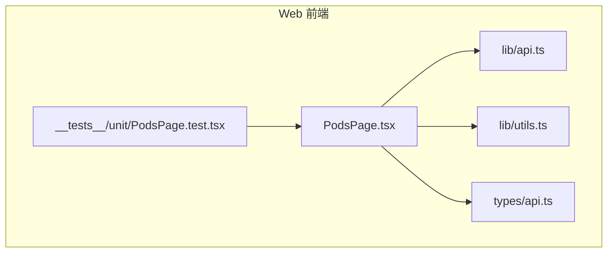
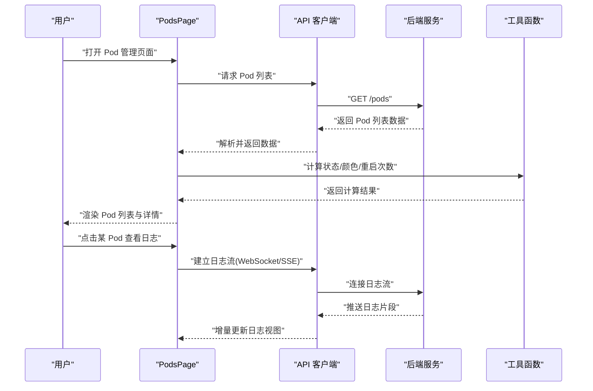
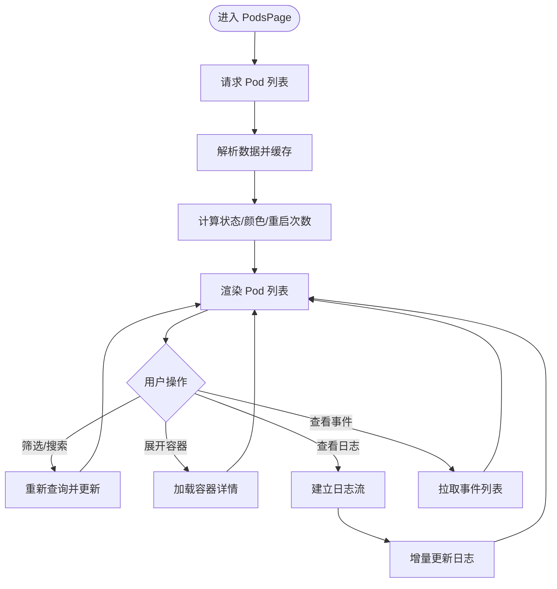
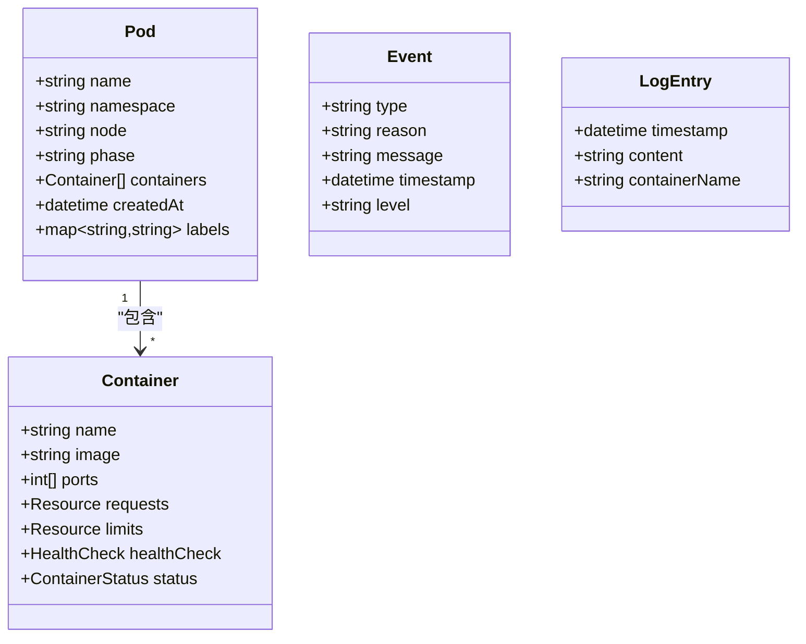
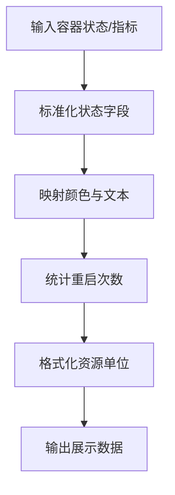
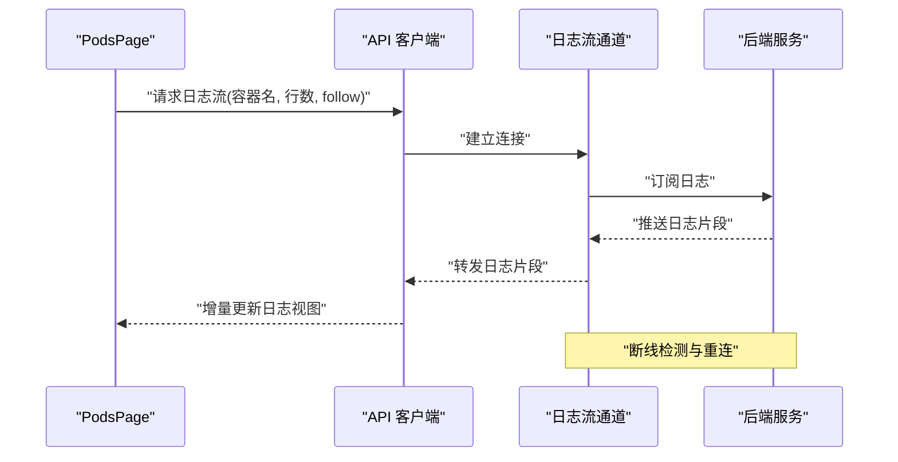
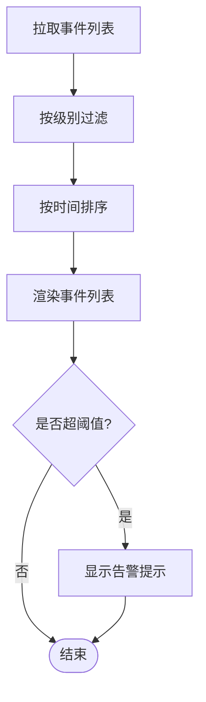
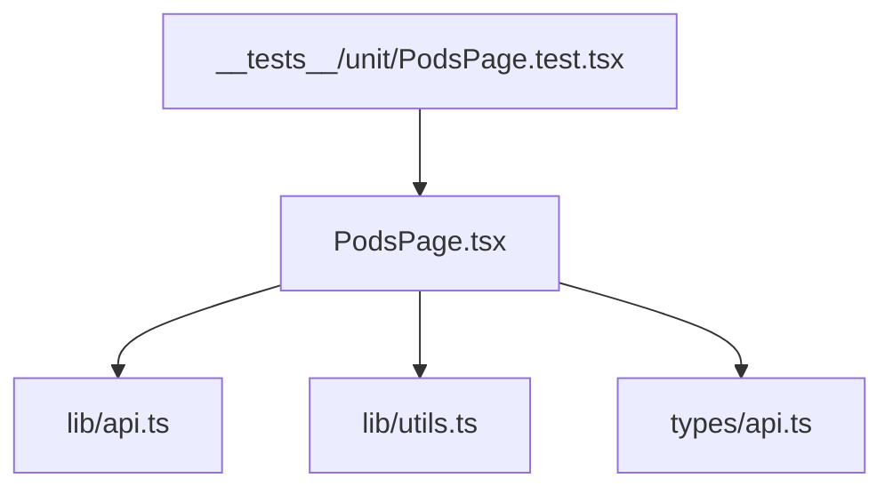

# Pod管理页面

<cite>
**本文引用的文件**   
- [PodsPage.tsx](file://web/src/pages/PodsPage.tsx)
- [api.ts](file://web/src/lib/api.ts)
- [utils.ts](file://web/src/lib/utils.ts)
- [api.ts](file://web/src/types/api.ts)
- [PodsPage.test.tsx](file://web/src/__tests__/unit/PodsPage.test.tsx)
</cite>

## 目录
1. [简介](#简介)
2. [项目结构](#项目结构)
3. [核心组件](#核心组件)
4. [架构总览](#架构总览)
5. [详细组件分析](#详细组件分析)
6. [依赖分析](#依赖分析)
7. [性能考虑](#性能考虑)
8. [故障排查指南](#故障排查指南)
9. [结论](#结论)
10. [附录](#附录)

## 简介
本文件为 PodsPage 页面组件的详细技术文档，聚焦于 Kubernetes Pod 管理的 Web 前端实现。内容涵盖：
- Pod 生命周期监控、日志查看、事件追踪与资源限制管理
- Pod 列表的复杂展示需求：状态颜色标识、重启次数统计、容器信息展示
- Pod 数据模型、状态计算、日志流式获取与实时更新机制
- 错误处理、性能优化与可观测性建议

该页面通过调用后端 API 获取集群中的 Pod 列表与详情，并在前端进行聚合、计算与渲染，提供实时刷新与流式日志能力，帮助运维人员快速定位问题与掌握运行状况。

## 项目结构
PodsPage 属于前端 web 模块，位于 pages 目录下，依赖 lib 层的 API 客户端与工具函数，以及 types 层的数据类型定义。测试用例位于 __tests__/unit 下，用于验证组件行为与边界条件。

图表来源
- [PodsPage.tsx](file://web/src/pages/PodsPage.tsx)
- [api.ts](file://web/src/lib/api.ts)
- [utils.ts](file://web/src/lib/utils.ts)
- [api.ts](file://web/src/types/api.ts)
- [PodsPage.test.tsx](file://web/src/__tests__/unit/PodsPage.test.tsx)

章节来源
- [PodsPage.tsx](file://web/src/pages/PodsPage.tsx)
- [api.ts](file://web/src/lib/api.ts)
- [utils.ts](file://web/src/lib/utils.ts)
- [api.ts](file://web/src/types/api.ts)
- [PodsPage.test.tsx](file://web/src/__tests__/unit/PodsPage.test.tsx)

## 核心组件
- PodsPage 页面组件：负责 Pod 列表的查询、过滤、排序、分页、状态展示、容器信息展开、日志查看与事件追踪入口、资源限制展示等。
- API 客户端：封装对后端的 REST/GraphQL 请求，包括 Pod 列表、Pod 详情、日志流、事件查询等接口。
- 工具函数：用于状态映射、时间格式化、重启次数统计、资源单位换算、颜色标识等。
- 数据类型：定义 Pod、Container、Event、LogEntry 等数据结构，确保前后端契约一致。

章节来源
- [PodsPage.tsx](file://web/src/pages/PodsPage.tsx)
- [api.ts](file://web/src/lib/api.ts)
- [utils.ts](file://web/src/lib/utils.ts)
- [api.ts](file://web/src/types/api.ts)

## 架构总览
PodsPage 的前端架构遵循“页面组件 + API 客户端 + 工具函数 + 类型定义”的分层模式。页面组件通过 API 客户端拉取数据，使用工具函数进行本地计算与格式化，最终渲染到 UI。日志采用流式获取（如 SSE 或 WebSocket），事件通过独立接口轮询或订阅。

图表来源
- [PodsPage.tsx](file://web/src/pages/PodsPage.tsx)
- [api.ts](file://web/src/lib/api.ts)
- [utils.ts](file://web/src/lib/utils.ts)

## 详细组件分析

### PodsPage 页面组件
- 功能职责
  - 列表展示：按命名空间、名称、状态、节点等多维度筛选与排序；支持分页与批量操作。
  - 状态与颜色：根据 Pod 阶段与容器状态映射显示不同颜色标识，便于快速识别异常。
  - 重启统计：基于容器状态历史或指标计算重启次数，并在列表中直观展示。
  - 容器信息：展开显示每个容器的镜像、端口、资源限制与使用情况、健康检查状态。
  - 日志查看：支持按容器选择日志流，提供滚动、自动刷新、关键词高亮等功能。
  - 事件追踪：展示与 Pod 相关的事件（调度、启动、失败、删除等），支持按级别过滤。
  - 资源限制：展示 CPU/Memory 的请求与限制，并提供阈值告警提示。
- 数据流
  - 初始化时拉取 Pod 列表与必要元数据。
  - 定时刷新或监听变更事件以更新列表。
  - 日志采用流式传输，避免全量拉取带来的性能问题。
- 交互流程
  - 用户筛选/搜索 -> 触发重新查询 -> 更新列表。
  - 用户展开容器详情 -> 加载容器级指标与配置。
  - 用户查看日志 -> 建立流连接 -> 增量渲染。
  - 用户查看事件 -> 拉取事件列表 -> 按级别着色与排序。

图表来源
- [PodsPage.tsx](file://web/src/pages/PodsPage.tsx)
- [api.ts](file://web/src/lib/api.ts)
- [utils.ts](file://web/src/lib/utils.ts)

章节来源
- [PodsPage.tsx](file://web/src/pages/PodsPage.tsx)
- [PodsPage.test.tsx](file://web/src/__tests__/unit/PodsPage.test.tsx)

### API 客户端与数据模型
- API 接口
  - Pod 列表：GET /pods，支持命名空间、名称、状态、节点等查询参数。
  - Pod 详情：GET /pods/{name}，返回完整元数据与容器配置。
  - 日志流：WS/SSE /pods/{name}/logs，按容器名与选项（行数、跟随）推送。
  - 事件：GET /pods/{name}/events，返回事件列表与级别。
- 数据模型
  - Pod：包含名称、命名空间、节点、阶段、容器列表、创建时间、标签等。
  - Container：镜像、端口、资源请求/限制、健康检查、状态等。
  - Event：类型、原因、消息、时间戳、级别等。
  - LogEntry：时间戳、内容、来源容器等。
- 错误处理
  - 网络异常重试与退避策略。
  - 权限不足或资源不存在时的友好提示。
  - 日志流断开后的重连机制。

图表来源
- [api.ts](file://web/src/types/api.ts)
- [api.ts](file://web/src/lib/api.ts)

章节来源
- [api.ts](file://web/src/lib/api.ts)
- [api.ts](file://web/src/types/api.ts)

### 工具函数与状态计算
- 状态映射
  - 将 Pod 阶段与容器状态映射为可视化颜色与文本描述。
  - 处理异常状态（CrashLoopBackOff、ImagePullBackOff 等）的特殊标识。
- 重启次数统计
  - 基于容器状态历史或指标字段计算重启次数。
  - 支持阈值告警与高亮显示。
- 资源单位换算
  - CPU/Memory 的单位转换与格式化（如 m、MiB、GiB）。
- 时间格式化
  - 相对时间与绝对时间的统一展示。

图表来源
- [utils.ts](file://web/src/lib/utils.ts)

章节来源
- [utils.ts](file://web/src/lib/utils.ts)

### 日志流式获取与实时更新
- 流式协议
  - 优先使用 WebSocket 或 Server-Sent Events (SSE) 建立长连接。
  - 支持按容器名、行数限制、是否跟随（follow）等参数控制。
- 增量渲染
  - 接收日志片段后追加到视图，避免全量重绘。
  - 自动滚动到底部，支持暂停与回放。
- 断线重连
  - 检测连接状态，指数退避重连。
  - 记录断线期间的日志偏移，恢复后继续推送。

图表来源
- [api.ts](file://web/src/lib/api.ts)
- [PodsPage.tsx](file://web/src/pages/PodsPage.tsx)

章节来源
- [api.ts](file://web/src/lib/api.ts)
- [PodsPage.tsx](file://web/src/pages/PodsPage.tsx)

### 事件追踪与资源限制管理
- 事件追踪
  - 拉取与 Pod 相关的事件，按级别（Normal/Warning/Error）分类展示。
  - 支持按时间范围与事件类型过滤。
- 资源限制管理
  - 展示 CPU/Memory 的请求与限制，对比实际使用量。
  - 当超过阈值时，提供告警提示与跳转至资源管理页面的入口。

图表来源
- [PodsPage.tsx](file://web/src/pages/PodsPage.tsx)
- [api.ts](file://web/src/lib/api.ts)

章节来源
- [PodsPage.tsx](file://web/src/pages/PodsPage.tsx)
- [api.ts](file://web/src/lib/api.ts)

## 依赖分析
PodsPage 依赖 API 客户端进行数据获取，依赖工具函数进行本地计算与格式化，依赖类型定义确保数据结构一致性。测试用例覆盖主要交互路径与边界条件。

图表来源
- [PodsPage.tsx](file://web/src/pages/PodsPage.tsx)
- [api.ts](file://web/src/lib/api.ts)
- [utils.ts](file://web/src/lib/utils.ts)
- [api.ts](file://web/src/types/api.ts)
- [PodsPage.test.tsx](file://web/src/__tests__/unit/PodsPage.test.tsx)

章节来源
- [PodsPage.tsx](file://web/src/pages/PodsPage.tsx)
- [api.ts](file://web/src/lib/api.ts)
- [utils.ts](file://web/src/lib/utils.ts)
- [api.ts](file://web/src/types/api.ts)
- [PodsPage.test.tsx](file://web/src/__tests__/unit/PodsPage.test.tsx)

## 性能考虑
- 列表分页与虚拟滚动：在 Pod 数量较大时启用分页与虚拟滚动，减少 DOM 压力。
- 增量更新：日志与事件采用增量渲染，避免全量重绘。
- 缓存策略：对静态元数据（如命名空间、节点列表）进行缓存，减少重复请求。
- 防抖与节流：搜索与筛选操作加入防抖，避免频繁触发查询。
- 连接池与重连：日志流连接复用与指数退避重连，提升稳定性。

[本节为通用性能指导，不直接分析具体文件]

## 故障排查指南
- 常见问题
  - 列表无法加载：检查网络连接、权限与后端服务状态。
  - 日志流中断：确认流协议支持、防火墙策略与重连逻辑。
  - 状态颜色异常：核对状态映射规则与容器状态字段。
  - 重启次数不准确：检查指标来源与计算逻辑。
- 调试建议
  - 使用浏览器开发者工具查看网络请求与 WebSocket 连接。
  - 打印关键中间数据与错误堆栈。
  - 模拟异常场景（如断网、权限不足）验证错误处理。

章节来源
- [PodsPage.tsx](file://web/src/pages/PodsPage.tsx)
- [api.ts](file://web/src/lib/api.ts)
- [utils.ts](file://web/src/lib/utils.ts)

## 结论
PodsPage 作为 Pod 管理的核心前端组件，提供了完整的生命周期监控、日志查看、事件追踪与资源限制管理能力。通过清晰的架构分层、健壮的错误处理与性能优化策略，能够有效支撑大规模集群的日常运维需求。建议在后续迭代中进一步增强可视化与自动化能力，以提升用户体验与运维效率。

[本节为总结性内容，不直接分析具体文件]

## 附录
- 术语表
  - Pod：Kubernetes 最小部署单元，包含一个或多个容器。
  - 容器状态：Running、Waiting、Terminated 等。
  - 事件：Kubernetes 对象生命周期中的变更记录。
  - 日志流：实时推送的日志数据流。
- 参考链接
  - Kubernetes 官方文档：https://kubernetes.io/docs
  - 项目 README 与部署说明：见仓库根目录

[本节为补充信息，不直接分析具体文件]