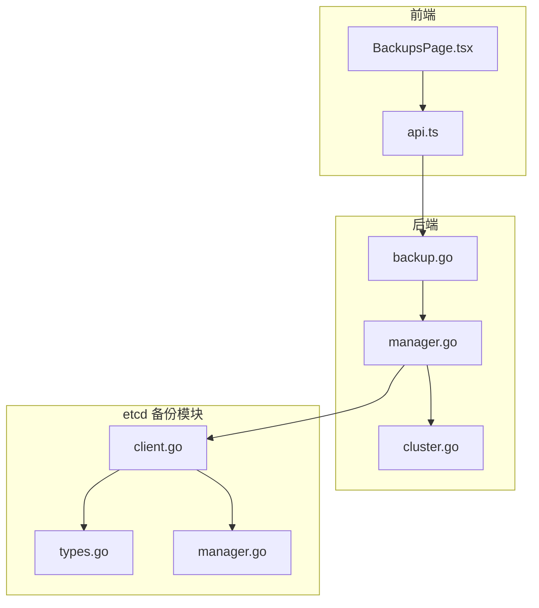
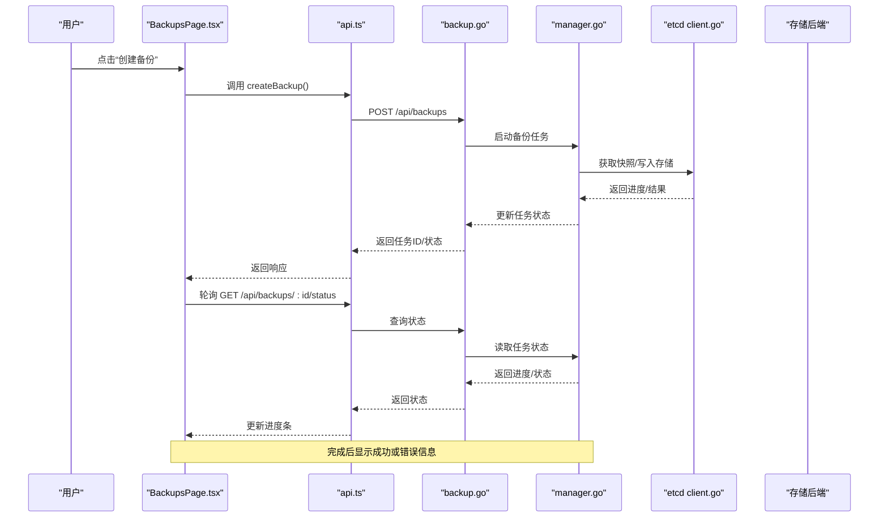
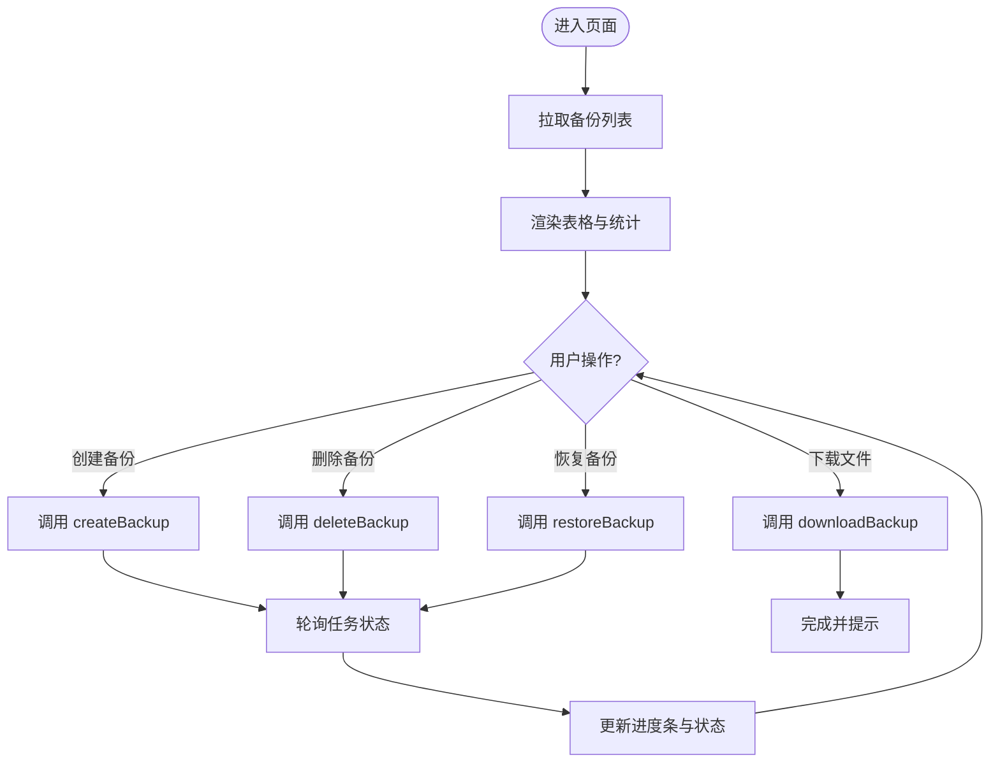
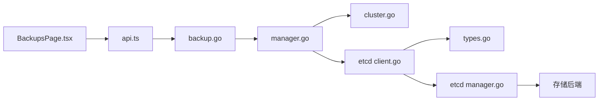

# 备份管理页面

<cite>
**本文引用的文件**   
- [BackupsPage.tsx](file://web/src/pages/BackupsPage.tsx)
- [api.ts](file://web/src/lib/api.ts)
- [backup.go](file://internal/api/backup.go)
- [manager.go](file://internal/backup/manager.go)
- [cluster.go](file://internal/backup/cluster.go)
- [types.go](file://modules/etcd-backup/types.go)
- [client.go](file://modules/etcd-backup/client.go)
- [manager.go](file://modules/etcd-backup/manager.go)
</cite>

## 目录
1. [简介](#简介)
2. [项目结构](#项目结构)
3. [核心组件](#核心组件)
4. [架构总览](#架构总览)
5. [详细组件分析](#详细组件分析)
6. [依赖关系分析](#依赖关系分析)
7. [性能考虑](#性能考虑)
8. [故障排查指南](#故障排查指南)
9. [结论](#结论)
10. [附录](#附录)

## 简介
本文件为 BackupsPage 备份管理页面的完整技术文档，面向前端与后端开发者及运维人员。内容覆盖：
- 备份策略配置、定时任务管理
- 备份执行监控（列表展示、进度条、状态）
- 恢复操作与错误处理机制
- 备份 API 调用、文件上传下载、存储后端集成与事务管理

该页面通过前端 React 组件与后端 Go API 协作，结合 etcd 备份模块与可插拔存储后端，提供完整的备份生命周期管理能力。

## 项目结构
与 BackupsPage 相关的代码分布在以下位置：
- 前端页面与 API 封装：web/src/pages/BackupsPage.tsx、web/src/lib/api.ts
- 后端备份 API：internal/api/backup.go
- 备份业务逻辑：internal/backup/manager.go、internal/backup/cluster.go
- etcd 备份客户端与类型定义：modules/etcd-backup/client.go、modules/etcd-backup/types.go、modules/etcd-backup/manager.go

**图表来源** 
- [BackupsPage.tsx](file://web/src/pages/BackupsPage.tsx)
- [api.ts](file://web/src/lib/api.ts)
- [backup.go](file://internal/api/backup.go)
- [manager.go](file://internal/backup/manager.go)
- [cluster.go](file://internal/backup/cluster.go)
- [client.go](file://modules/etcd-backup/client.go)
- [types.go](file://modules/etcd-backup/types.go)
- [manager.go](file://modules/etcd-backup/manager.go)

**章节来源**
- [BackupsPage.tsx](file://web/src/pages/BackupsPage.tsx)
- [api.ts](file://web/src/lib/api.ts)
- [backup.go](file://internal/api/backup.go)
- [manager.go](file://internal/backup/manager.go)
- [cluster.go](file://internal/backup/cluster.go)
- [client.go](file://modules/etcd-backup/client.go)
- [types.go](file://modules/etcd-backup/types.go)
- [manager.go](file://modules/etcd-backup/manager.go)

## 核心组件
- 前端页面 BackupsPage.tsx
  - 负责备份列表渲染、筛选与分页、存储空间统计展示、进度条显示、错误提示
  - 触发创建备份、删除备份、恢复备份、查看日志等操作
  - 与 api.ts 中的函数交互，发起 HTTP 请求并处理响应
- 前端 API 封装 api.ts
  - 统一封装备份相关接口：列表查询、创建、删除、恢复、进度轮询、文件下载等
  - 处理请求头、鉴权、错误码映射与重试策略
- 后端备份 API backup.go
  - 暴露 RESTful 接口：GET/POST/DELETE/恢复、进度查询、文件下载
  - 参数校验、权限控制、审计记录
- 备份管理器 internal/backup/manager.go
  - 编排备份流程：策略解析、调度、执行、状态更新、清理旧备份
  - 与 etcd 备份客户端交互，支持事务性快照与一致性保障
- etcd 备份模块 modules/etcd-backup/*
  - client.go：etcd 客户端连接、快照读写、流式传输
  - types.go：备份元数据、策略、任务状态等数据结构
  - manager.go：任务调度、并发控制、失败重试、告警通知

**章节来源**
- [BackupsPage.tsx](file://web/src/pages/BackupsPage.tsx)
- [api.ts](file://web/src/lib/api.ts)
- [backup.go](file://internal/api/backup.go)
- [manager.go](file://internal/backup/manager.go)
- [client.go](file://modules/etcd-backup/client.go)
- [types.go](file://modules/etcd-backup/types.go)
- [manager.go](file://modules/etcd-backup/manager.go)

## 架构总览
整体采用前后端分离架构，前端通过 REST API 与后端交互；后端通过 etcd 备份模块完成数据快照与持久化，支持多种存储后端（本地磁盘、对象存储等）。

**图表来源** 
- [BackupsPage.tsx](file://web/src/pages/BackupsPage.tsx)
- [api.ts](file://web/src/lib/api.ts)
- [backup.go](file://internal/api/backup.go)
- [manager.go](file://internal/backup/manager.go)
- [client.go](file://modules/etcd-backup/client.go)

## 详细组件分析

### 前端页面 BackupsPage.tsx
- 功能特性
  - 备份列表展示：包含名称、状态、大小、时间、操作按钮
  - 存储空间统计：聚合各备份大小，展示总量与趋势
  - 进度条显示：对运行中任务进行实时进度更新
  - 错误处理：捕获网络错误、服务端错误，展示友好提示
  - 操作入口：创建、删除、恢复、查看日志、下载备份文件
- 关键实现要点
  - 使用状态管理维护备份列表、当前选中项、加载状态、错误消息
  - 定时器或事件驱动轮询任务状态，避免频繁刷新
  - 文件下载通过分块或流式方式提升大文件体验
  - 与 api.ts 的约定式接口保持一致的错误码与字段命名

**图表来源** 
- [BackupsPage.tsx](file://web/src/pages/BackupsPage.tsx)
- [api.ts](file://web/src/lib/api.ts)

**章节来源**
- [BackupsPage.tsx](file://web/src/pages/BackupsPage.tsx)
- [api.ts](file://web/src/lib/api.ts)

### 前端 API 封装 api.ts
- 接口清单
  - 列表查询：GET /api/backups
  - 创建备份：POST /api/backups
  - 删除备份：DELETE /api/backups/:id
  - 恢复备份：POST /api/backups/:id/restore
  - 进度查询：GET /api/backups/:id/status
  - 文件下载：GET /api/backups/:id/download
- 实现要点
  - 统一错误处理：将 HTTP 状态码映射为业务错误类型
  - 重试机制：对网络抖动进行指数退避重试
  - 进度轮询：基于任务 ID 周期性查询状态，直至完成或失败
  - 文件流式下载：避免内存溢出，支持断点续传（可选）

**章节来源**
- [api.ts](file://web/src/lib/api.ts)

### 后端备份 API backup.go
- 路由与处理器
  - 列表：返回备份元数据与状态摘要
  - 创建：接收策略参数，生成任务并异步执行
  - 删除：校验权限后删除指定备份
  - 恢复：根据备份 ID 执行恢复流程
  - 进度：返回任务执行进度与阶段信息
  - 下载：按路径或 URL 返回备份文件流
- 安全与审计
  - 鉴权：基于角色与资源访问控制
  - 审计：记录关键操作与结果，便于追溯

**章节来源**
- [backup.go](file://internal/api/backup.go)

### 备份管理器 internal/backup/manager.go
- 职责
  - 解析备份策略（频率、保留策略、目标存储）
  - 调度与并发控制（限制同时执行的备份任务数）
  - 执行备份流程（调用 etcd 客户端、写入存储后端）
  - 状态管理与持久化（数据库或内存表）
  - 清理策略（按保留策略删除过期备份）
- 事务与一致性
  - 使用 etcd 事务保证快照一致性
  - 失败回滚与补偿机制

**章节来源**
- [manager.go](file://internal/backup/manager.go)

### etcd 备份模块 modules/etcd-backup/*
- client.go
  - 连接 etcd 集群，建立会话与会话超时管理
  - 快照读取与流式传输，支持增量与全量
  - 错误重试与熔断保护
- types.go
  - 备份元数据：ID、名称、大小、时间戳、状态
  - 策略定义：频率、保留数量、目标存储标识
  - 任务状态：Pending、Running、Success、Failed、Cancelled
- manager.go
  - 任务队列与优先级
  - 失败重试与告警通知
  - 与存储后端抽象接口对接

**章节来源**
- [client.go](file://modules/etcd-backup/client.go)
- [types.go](file://modules/etcd-backup/types.go)
- [manager.go](file://modules/etcd-backup/manager.go)

## 依赖关系分析
- 前端依赖
  - BackupsPage.tsx 依赖 api.ts 提供的接口封装
  - 依赖 UI 库（如 Ant Design/Tailwind）进行渲染与交互
- 后端依赖
  - backup.go 依赖 manager.go 的业务编排
  - manager.go 依赖 cluster.go 的集群信息与 etcd 客户端
  - etcd 备份模块依赖存储后端抽象（本地/对象存储）
- 外部依赖
  - etcd 集群：提供数据快照能力
  - 存储后端：提供备份文件的持久化

**图表来源** 
- [BackupsPage.tsx](file://web/src/pages/BackupsPage.tsx)
- [api.ts](file://web/src/lib/api.ts)
- [backup.go](file://internal/api/backup.go)
- [manager.go](file://internal/backup/manager.go)
- [cluster.go](file://internal/backup/cluster.go)
- [client.go](file://modules/etcd-backup/client.go)
- [types.go](file://modules/etcd-backup/types.go)
- [manager.go](file://modules/etcd-backup/manager.go)

**章节来源**
- [BackupsPage.tsx](file://web/src/pages/BackupsPage.tsx)
- [api.ts](file://web/src/lib/api.ts)
- [backup.go](file://internal/api/backup.go)
- [manager.go](file://internal/backup/manager.go)
- [cluster.go](file://internal/backup/cluster.go)
- [client.go](file://modules/etcd-backup/client.go)
- [types.go](file://modules/etcd-backup/types.go)
- [manager.go](file://modules/etcd-backup/manager.go)

## 性能考虑
- 前端优化
  - 列表分页与虚拟滚动，减少 DOM 节点数量
  - 进度轮询去抖与节流，降低请求频率
  - 大文件下载采用流式处理，避免内存峰值
- 后端优化
  - 任务并发控制，避免资源争用
  - 缓存热点数据（如备份列表摘要）
  - 存储后端选择与压缩策略，减少 I/O 压力
- etcd 备份优化
  - 增量快照与并行读取，缩短备份窗口
  - 失败重试与快速失败，提高稳定性

[本节为通用性能建议，不直接分析具体文件]

## 故障排查指南
- 常见问题
  - 备份创建失败：检查 etcd 连接、权限、存储后端可用性与配额
  - 进度卡住：查看任务状态、日志与 etcd 健康状态
  - 恢复失败：确认备份完整性、版本兼容性与目标环境配置
  - 下载失败：检查网络、代理与文件大小限制
- 定位方法
  - 前端：打开浏览器控制台，查看网络请求与错误堆栈
  - 后端：查看服务日志，关注错误码与异常信息
  - etcd：检查集群健康、快照文件与存储后端日志
- 恢复步骤
  - 清理失败任务，重新触发备份
  - 切换存储后端或扩容空间
  - 调整并发与超时参数，观察效果

**章节来源**
- [backup.go](file://internal/api/backup.go)
- [manager.go](file://internal/backup/manager.go)
- [client.go](file://modules/etcd-backup/client.go)

## 结论
BackupsPage 提供了完整的备份管理能力，涵盖策略配置、任务调度、执行监控与恢复操作。通过清晰的前后端分层与 etcd 备份模块的解耦设计，系统具备良好的可扩展性与稳定性。建议在部署时关注存储后端选型与容量规划，并结合监控与告警提升运维效率。

[本节为总结性内容，不直接分析具体文件]

## 附录
- 术语说明
  - 备份策略：定义备份频率、保留策略与目标存储
  - 任务状态：Pending、Running、Success、Failed、Cancelled
  - 存储后端：本地磁盘、对象存储等持久化介质
- 最佳实践
  - 定期演练恢复流程，验证备份有效性
  - 设置合理的保留策略，平衡成本与风险
  - 启用审计与告警，及时发现异常

[本节为补充信息，不直接分析具体文件]