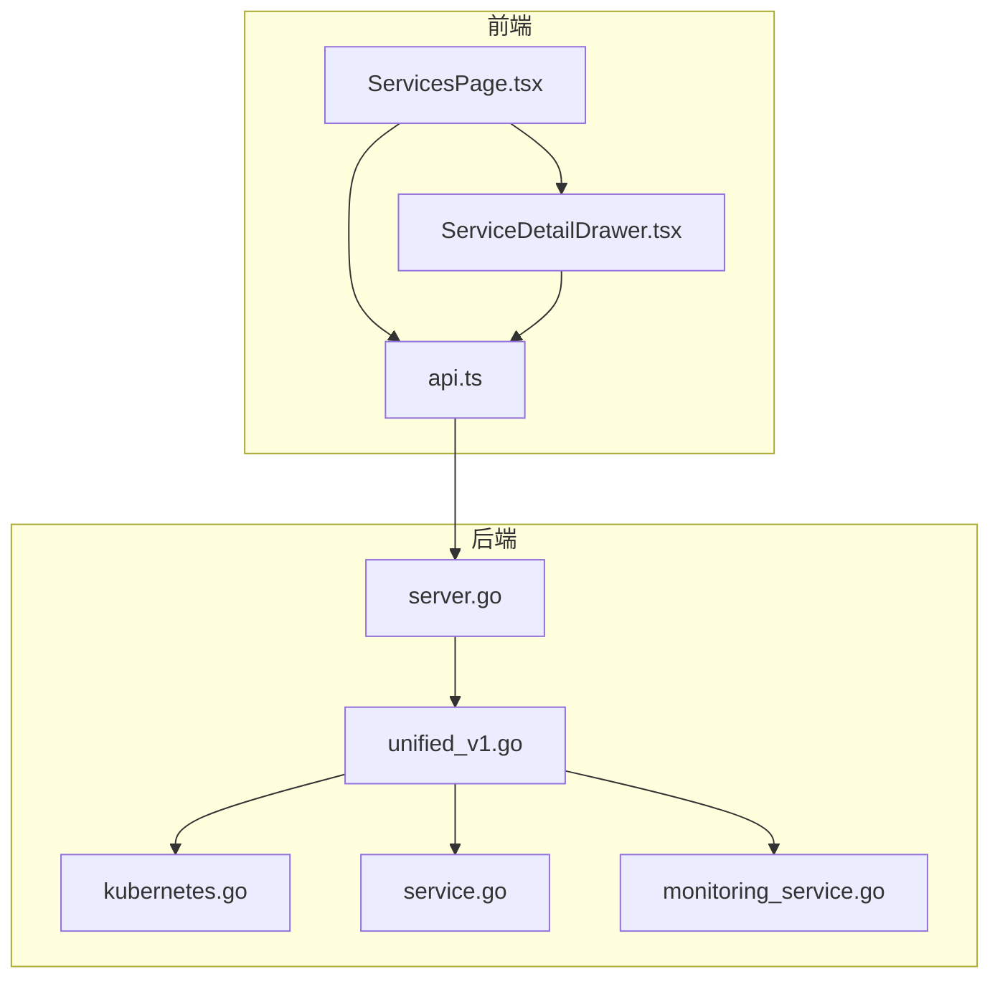
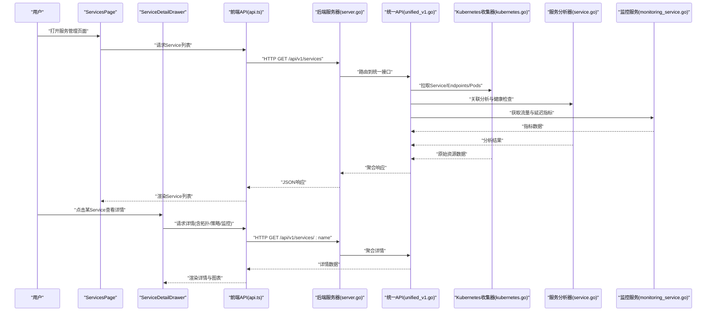
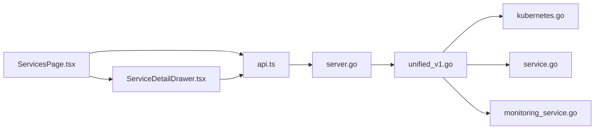

# 服务管理页面

<cite>
**本文档引用的文件**   
- [ServicesPage.tsx](file://web/src/pages/ServicesPage.tsx)
- [ServiceDetailDrawer.tsx](file://web/src/components/ServiceDetailDrawer.tsx)
- [api.ts](file://web/src/lib/api.ts)
- [api.go](file://internal/api/unified_v1.go)
- [service.go](file://internal/diag/analyzer/process/service.go)
- [kubernetes.go](file://internal/diag/collector/online/kubernetes.go)
- [monitoring_service.go](file://internal/monitoring/service.go)
- [server.go](file://internal/api/server.go)
</cite>

## 目录
1. [简介](#简介)
2. [项目结构](#项目结构)
3. [核心组件](#核心组件)
4. [架构总览](#架构总览)
5. [详细组件分析](#详细组件分析)
6. [依赖关系分析](#依赖关系分析)
7. [性能考虑](#性能考虑)
8. [故障排查指南](#故障排查指南)
9. [结论](#结论)
10. [附录](#附录)

## 简介
本文件为“服务管理页面”（ServicesPage）的完整技术文档，面向前端与后端开发者、运维人员与产品使用者。内容覆盖：
- Service 资源展示与服务类型区分
- 端口映射管理与验证
- 负载均衡配置与服务发现状态
- 服务拓扑图展示、端点健康检查、流量监控与网络策略
- 后端 Pod 关联与故障诊断示例路径

该页面通过统一 API 获取 Kubernetes Service 及相关资源信息，并在前端进行可视化展示与交互操作，同时提供健康检查、监控指标与诊断能力。

## 项目结构
服务管理相关的前端页面位于 web/src/pages，详情抽屉组件位于 web/src/components，API 调用封装在 web/src/lib/api.ts；后端统一接口定义于 internal/api，Kubernetes 数据收集与分析逻辑分布在 internal/diag 与 internal/monitoring 等模块。

图表来源
- [ServicesPage.tsx](file://web/src/pages/ServicesPage.tsx)
- [ServiceDetailDrawer.tsx](file://web/src/components/ServiceDetailDrawer.tsx)
- [api.ts](file://web/src/lib/api.ts)
- [server.go](file://internal/api/server.go)
- [api.go](file://internal/api/unified_v1.go)
- [kubernetes.go](file://internal/diag/collector/online/kubernetes.go)
- [service.go](file://internal/diag/analyzer/process/service.go)
- [monitoring_service.go](file://internal/monitoring/service.go)

章节来源
- [ServicesPage.tsx](file://web/src/pages/ServicesPage.tsx)
- [ServiceDetailDrawer.tsx](file://web/src/components/ServiceDetailDrawer.tsx)
- [api.ts](file://web/src/lib/api.ts)
- [server.go](file://internal/api/server.go)
- [api.go](file://internal/api/unified_v1.go)
- [kubernetes.go](file://internal/diag/collector/online/kubernetes.go)
- [service.go](file://internal/diag/analyzer/process/service.go)
- [monitoring_service.go](file://internal/monitoring/service.go)

## 核心组件
- ServicesPage 页面：负责 Service 列表渲染、筛选、分页、刷新、查看详情等操作。
- ServiceDetailDrawer 详情抽屉：展示单个 Service 的详细信息，包括端口映射、后端 Pod、健康检查、监控指标、拓扑图与网络策略。
- 前端 API 封装：统一请求封装、错误处理、缓存与重试策略。
- 后端统一 API：聚合 Service、Endpoints、Pod、Metrics、NetworkPolicy 等资源数据。
- Kubernetes 数据收集器：从集群读取 Service、Endpoints、Pods、Metrics 等。
- 服务分析器：对 Service 与 Endpoints 进行关联分析、健康检查与问题定位。
- 监控服务：提供流量、延迟、错误率等指标查询。

章节来源
- [ServicesPage.tsx](file://web/src/pages/ServicesPage.tsx)
- [ServiceDetailDrawer.tsx](file://web/src/components/ServiceDetailDrawer.tsx)
- [api.ts](file://web/src/lib/api.ts)
- [api.go](file://internal/api/unified_v1.go)
- [kubernetes.go](file://internal/diag/collector/online/kubernetes.go)
- [service.go](file://internal/diag/analyzer/process/service.go)
- [monitoring_service.go](file://internal/monitoring/service.go)

## 架构总览
服务管理页面的端到端流程如下：用户在前端触发操作，页面通过 API 封装调用后端统一接口，后端聚合 Kubernetes 资源与监控数据，返回结构化结果供前端渲染。

图表来源
- [ServicesPage.tsx](file://web/src/pages/ServicesPage.tsx)
- [ServiceDetailDrawer.tsx](file://web/src/components/ServiceDetailDrawer.tsx)
- [api.ts](file://web/src/lib/api.ts)
- [server.go](file://internal/api/server.go)
- [api.go](file://internal/api/unified_v1.go)
- [kubernetes.go](file://internal/diag/collector/online/kubernetes.go)
- [service.go](file://internal/diag/analyzer/process/service.go)
- [monitoring_service.go](file://internal/monitoring/service.go)

## 详细组件分析

### ServicesPage 页面组件
- 功能要点
  - 展示 Service 列表，支持按命名空间、类型、名称筛选与分页。
  - 显示服务类型（ClusterIP、NodePort、LoadBalancer、ExternalName）及关键状态。
  - 提供刷新、导出、跳转详情等功能。
  - 集成健康检查状态与基础监控摘要。
- 数据流
  - 通过前端 API 获取 Service 列表与统计信息。
  - 将后端返回的结构化数据映射到 UI 模型并渲染。
- 交互流程
  - 点击某 Service 打开 ServiceDetailDrawer 展示详情。
  - 支持批量操作（如查看关联 Pod、快速复制 YAML）。

章节来源
- [ServicesPage.tsx](file://web/src/pages/ServicesPage.tsx)
- [api.ts](file://web/src/lib/api.ts)

### ServiceDetailDrawer 详情抽屉
- 功能要点
  - 展示 Service 基本信息、端口映射表、后端 Pod 列表、服务发现状态。
  - 展示服务拓扑图（上游/下游依赖）、健康检查结果、监控指标（QPS、延迟、错误率）。
  - 展示网络策略（NetworkPolicy）与访问控制规则。
- 数据流
  - 根据 Service 名称与命名空间请求详情接口。
  - 聚合 Endpoints、Pods、Metrics、NetworkPolicy 数据并渲染。
- 交互流程
  - 切换标签页查看不同维度信息（概览、拓扑、监控、策略）。
  - 支持刷新、导出报告、跳转到相关资源详情页。

章节来源
- [ServiceDetailDrawer.tsx](file://web/src/components/ServiceDetailDrawer.tsx)
- [api.ts](file://web/src/lib/api.ts)

### 前端 API 封装
- 功能要点
  - 统一 HTTP 客户端封装，包含请求拦截、错误处理、重试与超时控制。
  - 提供 Service 列表、详情、监控指标、拓扑、策略等接口方法。
- 错误处理
  - 捕获网络异常、权限不足、资源不存在等错误并提示用户。
  - 支持降级与缓存策略，提升用户体验。

章节来源
- [api.ts](file://web/src/lib/api.ts)

### 后端统一 API
- 功能要点
  - 聚合 Service、Endpoints、Pods、Metrics、NetworkPolicy 等资源数据。
  - 提供分页、筛选、排序与字段选择能力。
  - 暴露健康检查、拓扑图数据与监控指标查询接口。
- 路由与鉴权
  - 基于 server.go 的路由注册与中间件鉴权。
  - 支持多租户隔离与命名空间过滤。

章节来源
- [api.go](file://internal/api/unified_v1.go)
- [server.go](file://internal/api/server.go)

### Kubernetes 数据收集器
- 功能要点
  - 从 Kubernetes API Server 拉取 Service、Endpoints、Pods、ConfigMap、Secret 等资源。
  - 支持增量同步与缓存机制，降低 API 压力。
  - 提供事件监听与实时数据更新。

章节来源
- [kubernetes.go](file://internal/diag/collector/online/kubernetes.go)

### 服务分析器
- 功能要点
  - 将 Service 与 Endpoints 进行关联，识别后端 Pod 与端口映射。
  - 执行健康检查（TCP/HTTP），评估服务可用性。
  - 生成问题诊断与建议（如端口冲突、无后端、DNS 解析失败）。

章节来源
- [service.go](file://internal/diag/analyzer/process/service.go)

### 监控服务
- 功能要点
  - 提供 QPS、延迟、错误率、连接数等指标查询。
  - 支持时间范围选择与聚合计算。
  - 与 Prometheus/Grafana 集成，提供可视化图表。

章节来源
- [monitoring_service.go](file://internal/monitoring/service.go)

## 依赖关系分析
前端与后端的依赖关系清晰，模块化程度高，便于扩展与维护。

图表来源
- [ServicesPage.tsx](file://web/src/pages/ServicesPage.tsx)
- [ServiceDetailDrawer.tsx](file://web/src/components/ServiceDetailDrawer.tsx)
- [api.ts](file://web/src/lib/api.ts)
- [server.go](file://internal/api/server.go)
- [api.go](file://internal/api/unified_v1.go)
- [kubernetes.go](file://internal/diag/collector/online/kubernetes.go)
- [service.go](file://internal/diag/analyzer/process/service.go)
- [monitoring_service.go](file://internal/monitoring/service.go)

章节来源
- [ServicesPage.tsx](file://web/src/pages/ServicesPage.tsx)
- [ServiceDetailDrawer.tsx](file://web/src/components/ServiceDetailDrawer.tsx)
- [api.ts](file://web/src/lib/api.ts)
- [server.go](file://internal/api/server.go)
- [api.go](file://internal/api/unified_v1.go)
- [kubernetes.go](file://internal/diag/collector/online/kubernetes.go)
- [service.go](file://internal/diag/analyzer/process/service.go)
- [monitoring_service.go](file://internal/monitoring/service.go)

## 性能考虑
- 前端
  - 使用虚拟滚动与分页减少 DOM 节点数量。
  - 合理设置缓存与防抖，避免频繁请求。
  - 图表渲染采用懒加载与按需更新。
- 后端
  - 使用缓存层（内存/Redis）存储热点数据。
  - 异步处理耗时任务（如拓扑计算、健康检查）。
  - 限制查询字段与分页大小，避免大对象传输。
- 网络
  - 启用 gzip/brotli 压缩。
  - 使用 WebSocket/SSE 实现实时数据推送。

[本节为通用指导，不直接分析具体文件]

## 故障排查指南
- 常见问题
  - Service 无后端：检查 Endpoints 是否就绪，确认 Selector 匹配。
  - 端口冲突：检查 NodePort/LoadBalancer 端口占用情况。
  - DNS 解析失败：确认 CoreDNS 运行状态与 Service 名称正确性。
  - 健康检查失败：检查目标端口与协议，验证应用健康端点。
- 诊断步骤
  - 查看 Service 详情中的健康检查状态与错误信息。
  - 检查后端 Pod 日志与事件，定位应用层问题。
  - 使用网络策略工具验证访问控制规则。
  - 通过监控指标观察流量与延迟变化趋势。

章节来源
- [service.go](file://internal/diag/analyzer/process/service.go)
- [kubernetes.go](file://internal/diag/collector/online/kubernetes.go)
- [monitoring_service.go](file://internal/monitoring/service.go)

## 结论
服务管理页面提供了完整的 Service 生命周期管理能力，涵盖资源展示、端口映射、负载均衡、服务发现、健康检查、监控与网络策略。通过前后端分离与模块化设计，系统具备良好的可扩展性与可维护性。建议在生产环境中结合监控告警与自动化修复工具，进一步提升稳定性与效率。

[本节为总结性内容，不直接分析具体文件]

## 附录
- 代码示例路径（用于参考实现细节）
  - Service 列表与详情接口调用：[api.ts](file://web/src/lib/api.ts)
  - 统一 API 聚合逻辑：[api.go](file://internal/api/unified_v1.go)
  - Kubernetes 资源收集：[kubernetes.go](file://internal/diag/collector/online/kubernetes.go)
  - 服务关联与健康检查：[service.go](file://internal/diag/analyzer/process/service.go)
  - 监控指标查询：[monitoring_service.go](file://internal/monitoring/service.go)
  - 路由与鉴权：[server.go](file://internal/api/server.go)

[本节为附录，不直接分析具体文件]