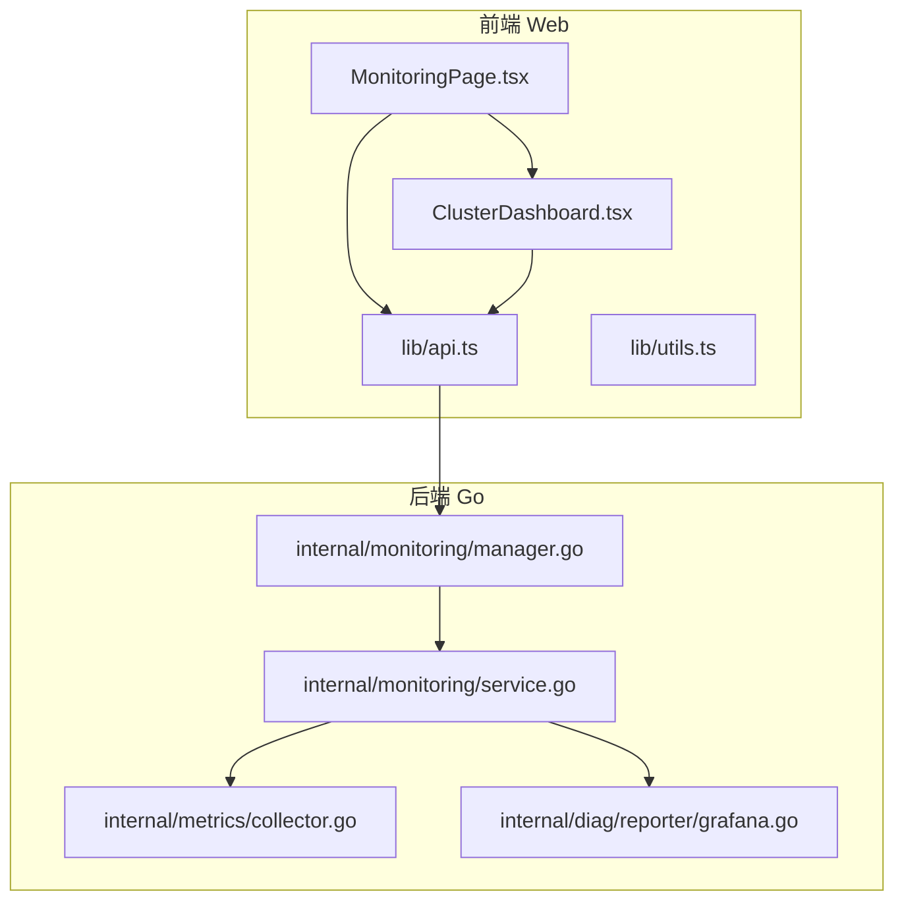
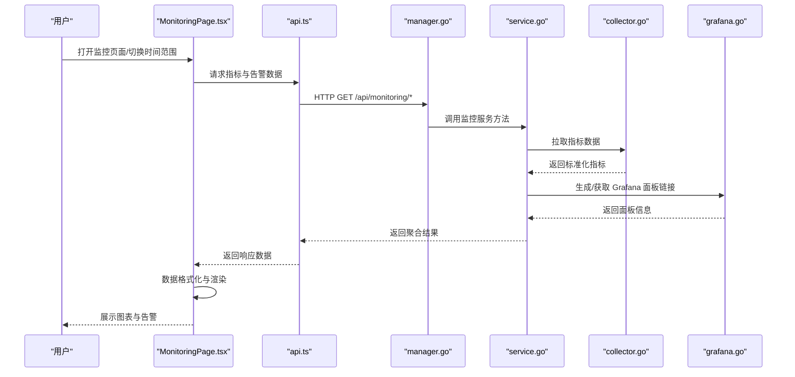
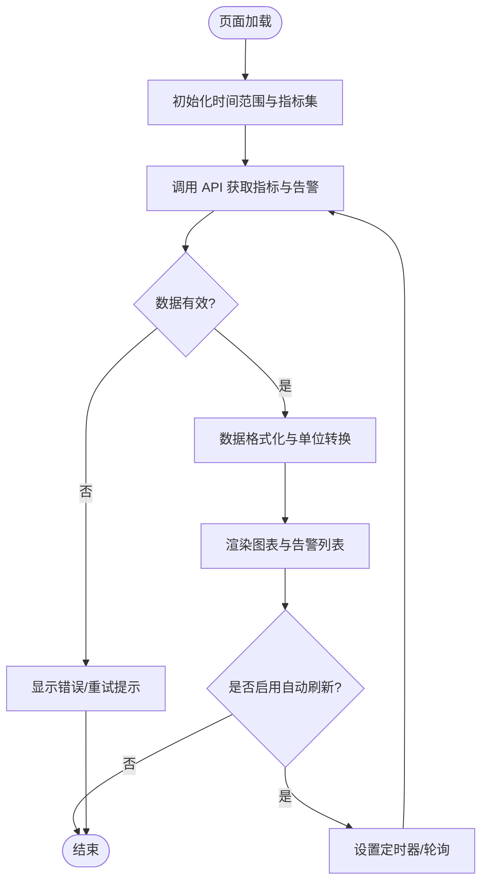
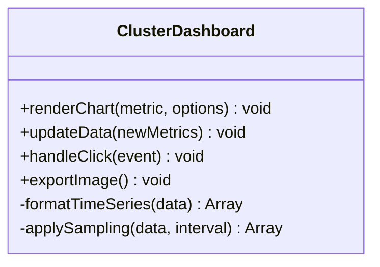
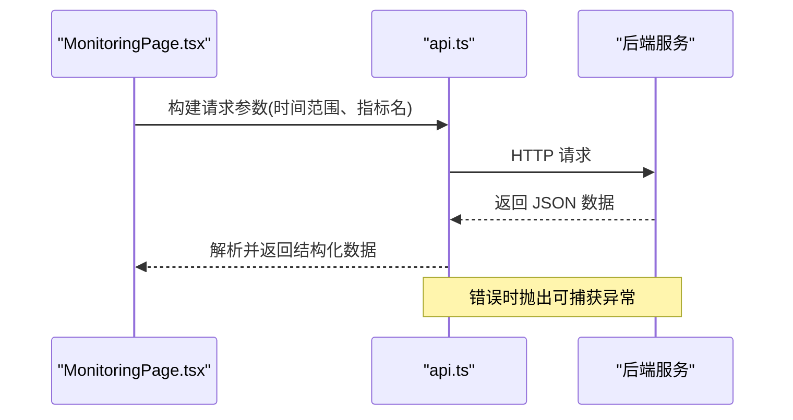
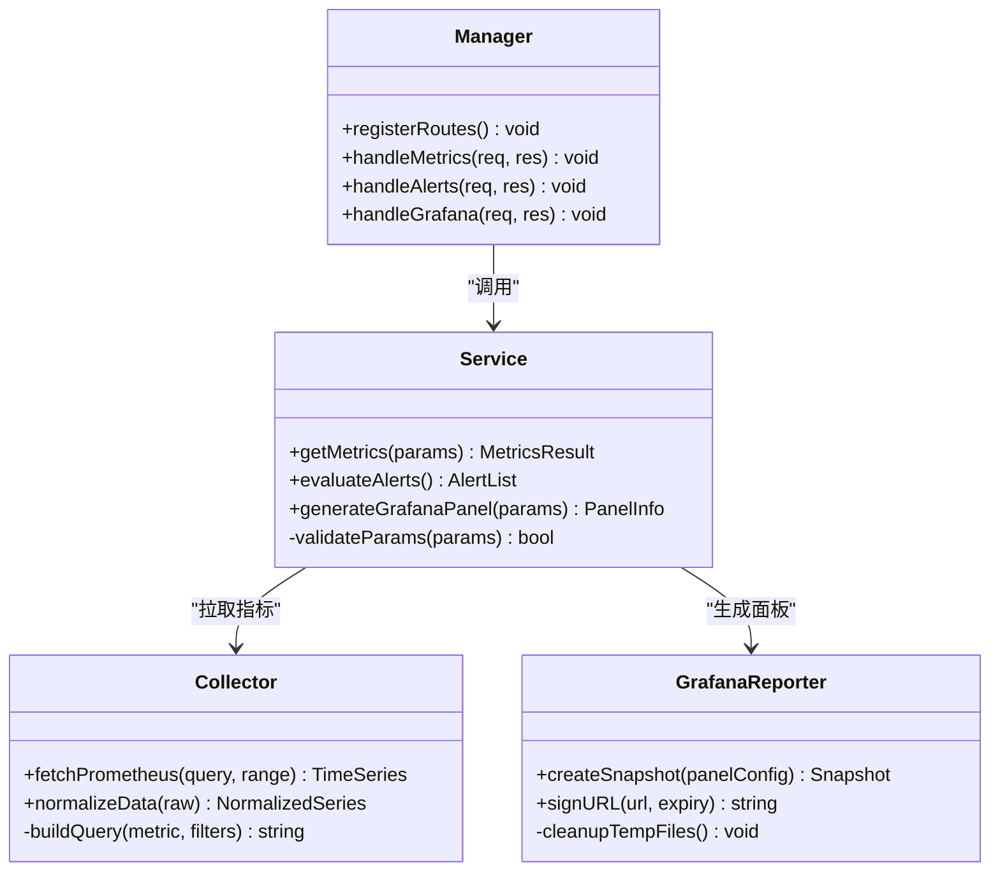
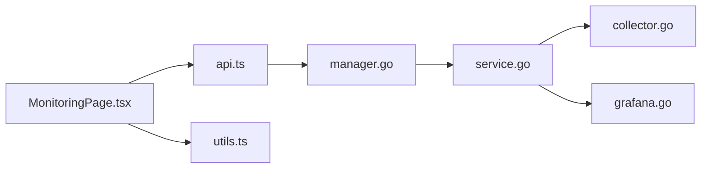

# 监控页面

<cite>
**本文引用的文件**   
- [MonitoringPage.tsx](file://web/src/pages/MonitoringPage.tsx)
- [ClusterDashboard.tsx](file://web/src/pages/ClusterDashboard.tsx)
- [api.ts](file://web/src/lib/api.ts)
- [utils.ts](file://web/src/lib/utils.ts)
- [manager.go](file://internal/monitoring/manager.go)
- [service.go](file://internal/monitoring/service.go)
- [collector.go](file://internal/metrics/collector.go)
- [grafana.go](file://internal/diag/reporter/grafana.go)
</cite>

## 目录
1. [简介](#简介)
2. [项目结构](#项目结构)
3. [核心组件](#核心组件)
4. [架构总览](#架构总览)
5. [详细组件分析](#详细组件分析)
6. [依赖关系分析](#依赖关系分析)
7. [性能考虑](#性能考虑)
8. [故障排查指南](#故障排查指南)
9. [结论](#结论)
10. [附录](#附录)

## 简介
本文件为 MonitoringPage 页面组件的详细技术文档，聚焦于监控页面的功能实现与集成方式，包括：
- 指标数据展示与图表可视化
- 告警规则与性能趋势分析
- Prometheus 数据集成、Grafana 面板嵌入
- 自定义指标采集与实时监控刷新机制
- 图表组件配置、数据格式化、时间范围选择与性能优化实践

该页面通过前端 React 组件聚合后端监控服务与指标采集能力，提供统一的集群监控视图。

## 项目结构
MonitoringPage 位于前端 web 模块的 pages 目录下，负责渲染监控仪表盘；后端在 internal/monitoring 与 internal/metrics 中提供监控服务与指标采集能力；Grafana 报告生成位于 internal/diag/reporter 中。

**图示来源** 
- [MonitoringPage.tsx](file://web/src/pages/MonitoringPage.tsx)
- [ClusterDashboard.tsx](file://web/src/pages/ClusterDashboard.tsx)
- [api.ts](file://web/src/lib/api.ts)
- [utils.ts](file://web/src/lib/utils.ts)
- [manager.go](file://internal/monitoring/manager.go)
- [service.go](file://internal/monitoring/service.go)
- [collector.go](file://internal/metrics/collector.go)
- [grafana.go](file://internal/diag/reporter/grafana.go)

**章节来源**
- [MonitoringPage.tsx](file://web/src/pages/MonitoringPage.tsx)
- [ClusterDashboard.tsx](file://web/src/pages/ClusterDashboard.tsx)
- [api.ts](file://web/src/lib/api.ts)
- [utils.ts](file://web/src/lib/utils.ts)
- [manager.go](file://internal/monitoring/manager.go)
- [service.go](file://internal/monitoring/service.go)
- [collector.go](file://internal/metrics/collector.go)
- [grafana.go](file://internal/diag/reporter/grafana.go)

## 核心组件
- MonitoringPage（前端）
  - 职责：聚合监控视图、管理时间范围、触发数据刷新、渲染图表与告警列表。
  - 关键交互：调用 api.ts 获取指标与告警数据，使用 utils.ts 进行数据格式化与时间处理。
- ClusterDashboard（前端）
  - 职责：具体图表与面板的渲染逻辑，封装指标查询参数与展示样式。
- API 层（前端）
  - 职责：统一请求封装、错误处理、重试策略、缓存控制。
- 监控管理器（后端 manager.go）
  - 职责：协调监控服务、暴露 REST 接口、路由到 service 层。
- 监控服务（后端 service.go）
  - 职责：业务编排，组合指标采集、告警规则评估、Grafana 面板导出等。
- 指标采集器（后端 collector.go）
  - 职责：对接 Prometheus 或内部指标源，拉取并标准化指标数据。
- Grafana 报告（后端 grafana.go）
  - 职责：生成 Grafana 面板快照或链接，便于嵌入与分享。

**章节来源**
- [MonitoringPage.tsx](file://web/src/pages/MonitoringPage.tsx)
- [ClusterDashboard.tsx](file://web/src/pages/ClusterDashboard.tsx)
- [api.ts](file://web/src/lib/api.ts)
- [utils.ts](file://web/src/lib/utils.ts)
- [manager.go](file://internal/monitoring/manager.go)
- [service.go](file://internal/monitoring/service.go)
- [collector.go](file://internal/metrics/collector.go)
- [grafana.go](file://internal/diag/reporter/grafana.go)

## 架构总览
MonitoringPage 通过前端 API 层向后端监控服务发起请求，后端由 manager 调度 service，service 再调用 collector 从 Prometheus 或其他指标源拉取数据，必要时通过 grafana 报告模块生成面板快照或链接。前端对数据进行格式化与可视化，支持时间范围切换与实时刷新。

**图示来源** 
- [MonitoringPage.tsx](file://web/src/pages/MonitoringPage.tsx)
- [api.ts](file://web/src/lib/api.ts)
- [manager.go](file://internal/monitoring/manager.go)
- [service.go](file://internal/monitoring/service.go)
- [collector.go](file://internal/metrics/collector.go)
- [grafana.go](file://internal/diag/reporter/grafana.go)

## 详细组件分析

### MonitoringPage 组件分析
- 功能要点
  - 时间范围选择：支持最近 1h/6h/24h/自定义区间，影响查询参数。
  - 指标聚合：按集群/命名空间维度聚合 CPU、内存、网络 I/O、磁盘使用率等。
  - 告警展示：列出当前活跃告警，支持级别分类与状态过滤。
  - 实时刷新：基于定时器或轮询策略自动刷新数据，避免频繁请求。
  - 错误处理：网络异常、超时、无数据时的降级显示。
- 数据流
  - 组件初始化时加载默认时间范围与指标集。
  - 用户切换时间范围或手动刷新时，调用 api.ts 获取最新数据。
  - 数据返回后，使用 utils.ts 进行单位换算、时间戳格式化、空值填充。
  - 将数据传递给图表组件渲染。

**图示来源** 
- [MonitoringPage.tsx](file://web/src/pages/MonitoringPage.tsx)
- [api.ts](file://web/src/lib/api.ts)
- [utils.ts](file://web/src/lib/utils.ts)

**章节来源**
- [MonitoringPage.tsx](file://web/src/pages/MonitoringPage.tsx)
- [api.ts](file://web/src/lib/api.ts)
- [utils.ts](file://web/src/lib/utils.ts)

### ClusterDashboard 组件分析
- 功能要点
  - 图表类型：折线图、面积图、柱状图、热力图等，用于不同指标展示。
  - 配置项：Y 轴单位、阈值线、颜色主题、动画效果、缩放与平移。
  - 数据适配：将后端返回的时序数据转换为图表库所需格式。
  - 交互：点击事件钻取详情、右键菜单导出图片、双击重置缩放。
- 性能优化
  - 按需加载：懒加载图表实例，减少首屏开销。
  - 数据采样：大数据量时进行降采样，保证流畅度。
  - 防抖节流：窗口大小变化与滚动事件去抖。

**图示来源** 
- [ClusterDashboard.tsx](file://web/src/pages/ClusterDashboard.tsx)

**章节来源**
- [ClusterDashboard.tsx](file://web/src/pages/ClusterDashboard.tsx)

### API 层分析
- 功能要点
  - 统一请求封装：GET/POST 方法、Headers、认证信息。
  - 错误处理：HTTP 状态码映射、网络异常捕获、重试策略。
  - 缓存控制：根据时间范围与指标类型设置缓存策略。
  - 超时与取消：AbortController 取消未完成的请求。
- 集成点
  - 监控数据接口：/api/monitoring/metrics
  - 告警规则接口：/api/monitoring/alerts
  - Grafana 面板接口：/api/monitoring/grafana

**图示来源** 
- [api.ts](file://web/src/lib/api.ts)

**章节来源**
- [api.ts](file://web/src/lib/api.ts)

### 后端监控服务分析
- manager.go
  - 职责：注册路由、鉴权、参数校验、调用 service 层。
  - 关键点：路径前缀、中间件链、上下文传递。
- service.go
  - 职责：编排指标采集、告警评估、面板生成。
  - 关键点：并发拉取、错误聚合、结果合并。
- collector.go
  - 职责：对接 Prometheus 查询 API，标准化返回数据。
  - 关键点：查询语句构建、分页与限流、数据清洗。
- grafana.go
  - 职责：生成面板快照、URL 签名、权限控制。
  - 关键点：模板渲染、资源清理、访问令牌管理。

**图示来源** 
- [manager.go](file://internal/monitoring/manager.go)
- [service.go](file://internal/monitoring/service.go)
- [collector.go](file://internal/metrics/collector.go)
- [grafana.go](file://internal/diag/reporter/grafana.go)

**章节来源**
- [manager.go](file://internal/monitoring/manager.go)
- [service.go](file://internal/monitoring/service.go)
- [collector.go](file://internal/metrics/collector.go)
- [grafana.go](file://internal/diag/reporter/grafana.go)

## 依赖关系分析
- 前端依赖
  - MonitoringPage 依赖 api.ts 与 utils.ts。
  - ClusterDashboard 依赖图表库与数据格式化工具。
- 后端依赖
  - manager.go 依赖 service.go。
  - service.go 依赖 collector.go 与 grafana.go。
- 外部依赖
  - Prometheus API。
  - Grafana 面板服务。

**图示来源** 
- [MonitoringPage.tsx](file://web/src/pages/MonitoringPage.tsx)
- [api.ts](file://web/src/lib/api.ts)
- [utils.ts](file://web/src/lib/utils.ts)
- [manager.go](file://internal/monitoring/manager.go)
- [service.go](file://internal/monitoring/service.go)
- [collector.go](file://internal/metrics/collector.go)
- [grafana.go](file://internal/diag/reporter/grafana.go)

**章节来源**
- [MonitoringPage.tsx](file://web/src/pages/MonitoringPage.tsx)
- [api.ts](file://web/src/lib/api.ts)
- [utils.ts](file://web/src/lib/utils.ts)
- [manager.go](file://internal/monitoring/manager.go)
- [service.go](file://internal/monitoring/service.go)
- [collector.go](file://internal/metrics/collector.go)
- [grafana.go](file://internal/diag/reporter/grafana.go)

## 性能考虑
- 前端
  - 使用虚拟滚动与懒加载减少 DOM 节点数量。
  - 对大数据集进行采样与聚合，避免渲染卡顿。
  - 合理设置轮询间隔，避免频繁请求导致服务器压力。
- 后端
  - 并发拉取多个指标源，使用 goroutine 池限制并发数。
  - 对 Prometheus 查询添加超时与重试，防止雪崩。
  - 缓存热点指标数据，缩短响应时间。
- 存储与传输
  - 压缩响应体，减少带宽占用。
  - 使用增量更新而非全量刷新，降低数据传输量。

[本节为通用指导，不直接分析具体文件]

## 故障排查指南
- 常见问题
  - 指标数据为空：检查 Prometheus 连接与查询语句是否正确。
  - 图表不更新：确认轮询定时器是否被清除，API 是否返回 200。
  - 告警不触发：验证告警规则表达式与阈值配置。
  - Grafana 面板无法加载：检查面板 URL 签名有效期与权限。
- 调试步骤
  - 查看浏览器 Network 面板，确认请求与响应。
  - 在后端日志中搜索错误堆栈与警告信息。
  - 使用 Prometheus UI 验证查询语句与数据可用性。
  - 临时禁用自动刷新，定位是否为轮询问题。

**章节来源**
- [api.ts](file://web/src/lib/api.ts)
- [manager.go](file://internal/monitoring/manager.go)
- [service.go](file://internal/monitoring/service.go)
- [collector.go](file://internal/metrics/collector.go)
- [grafana.go](file://internal/diag/reporter/grafana.go)

## 结论
MonitoringPage 通过前后端协作实现了完整的监控能力，涵盖指标展示、告警管理与 Grafana 面板集成。通过合理的架构设计与性能优化，提供了稳定、高效的监控体验。建议在生产环境中结合缓存、限流与监控告警进一步提升系统可靠性。

[本节为总结性内容，不直接分析具体文件]

## 附录
- 图表组件配置示例路径
  - [ClusterDashboard.tsx](file://web/src/pages/ClusterDashboard.tsx)
- 数据格式化与时间处理示例路径
  - [utils.ts](file://web/src/lib/utils.ts)
- API 请求封装与错误处理示例路径
  - [api.ts](file://web/src/lib/api.ts)
- 指标采集与 Prometheus 集成示例路径
  - [collector.go](file://internal/metrics/collector.go)
- Grafana 面板生成与嵌入示例路径
  - [grafana.go](file://internal/diag/reporter/grafana.go)

**章节来源**
- [ClusterDashboard.tsx](file://web/src/pages/ClusterDashboard.tsx)
- [utils.ts](file://web/src/lib/utils.ts)
- [api.ts](file://web/src/lib/api.ts)
- [collector.go](file://internal/metrics/collector.go)
- [grafana.go](file://internal/diag/reporter/grafana.go)