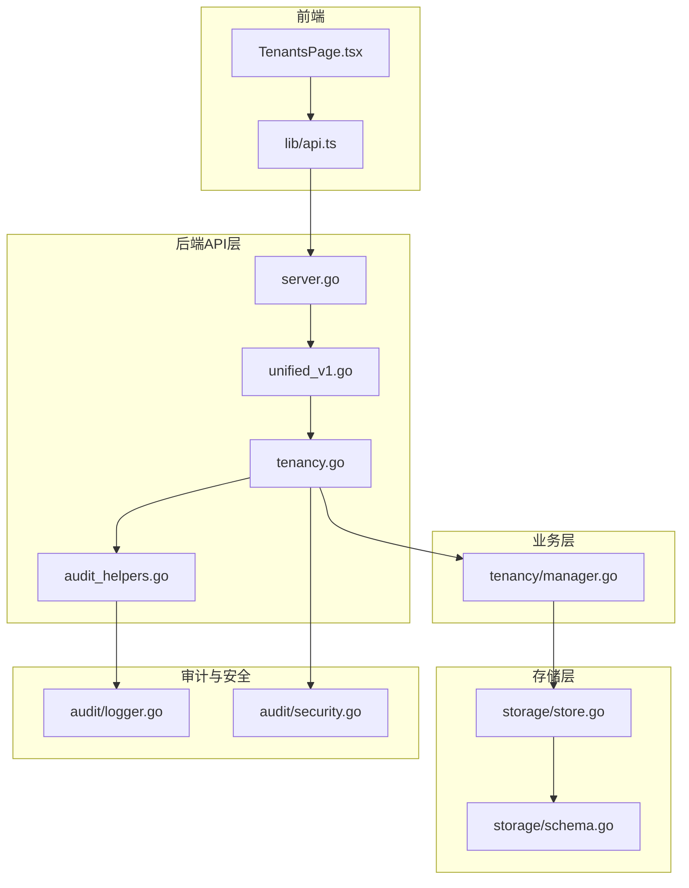
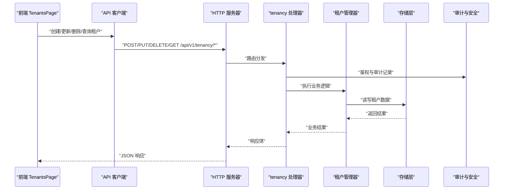
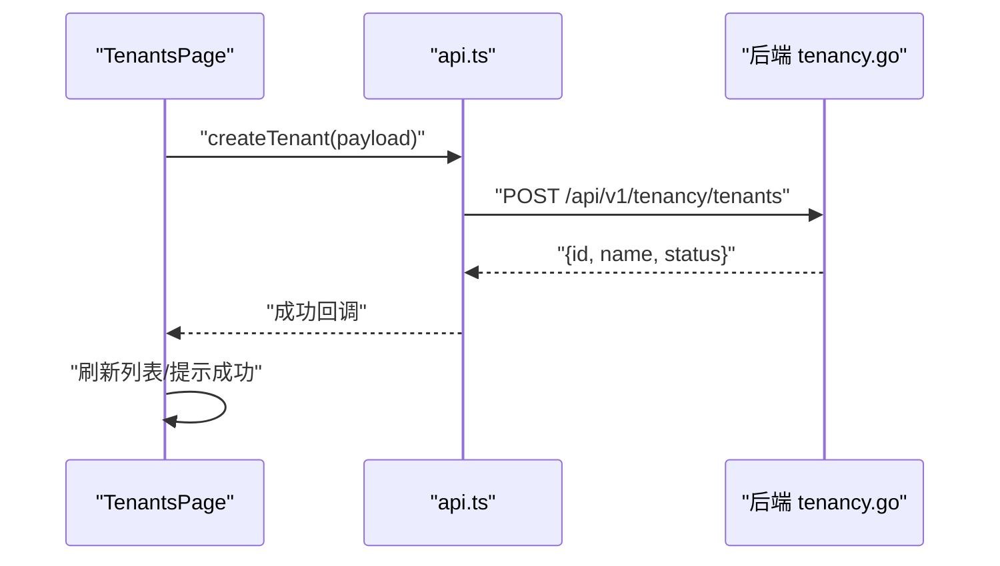
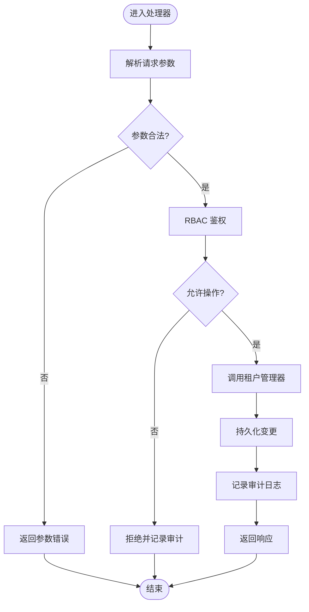
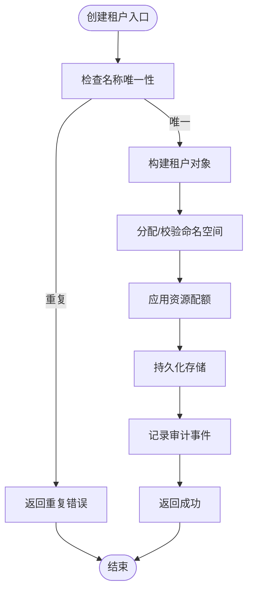
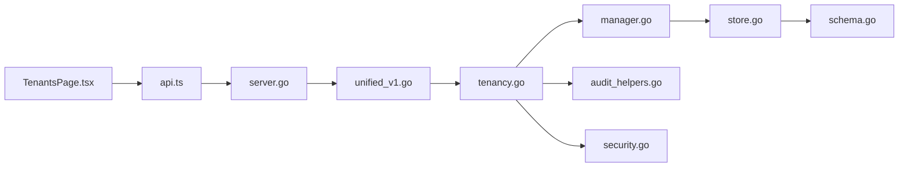

# 租户管理页面

<cite>
**本文引用的文件**   
- [TenantsPage.tsx](file://web/src/pages/TenantsPage.tsx)
- [api.ts](file://web/src/lib/api.ts)
- [tenancy.go](file://internal/api/tenancy.go)
- [manager.go](file://internal/tenancy/manager.go)
- [server.go](file://internal/api/server.go)
- [unified_v1.go](file://internal/api/unified_v1.go)
- [audit_helpers.go](file://internal/api/audit_helpers.go)
- [logger.go](file://internal/audit/logger.go)
- [security.go](file://internal/audit/security.go)
- [schema.go](file://internal/storage/schema.go)
- [store.go](file://internal/storage/store.go)
</cite>

## 目录
1. [简介](#简介)
2. [项目结构](#项目结构)
3. [核心组件](#核心组件)
4. [架构总览](#架构总览)
5. [详细组件分析](#详细组件分析)
6. [依赖关系分析](#依赖关系分析)
7. [性能考虑](#性能考虑)
8. [故障排查指南](#故障排查指南)
9. [结论](#结论)
10. [附录](#附录)

## 简介
本文件为 TenantsPage 租户管理页面的完整技术文档，覆盖多租户隔离、权限控制（RBAC）、资源配额与命名空间管理、租户 CRUD、访问审计等关键能力。文档面向前端开发者、后端工程师与运维人员，既提供高层架构说明，也给出代码级实现要点与可视化图示，帮助读者快速理解并扩展该功能。

## 项目结构
TenantsPage 位于前端页面层，通过 API 客户端调用后端 REST 接口；后端由统一的 v1 API 路由到 tenancy 处理器，再委托给租户管理器进行业务处理，数据持久化至存储层。审计与安全模块贯穿请求链路，保障可追溯性与安全策略执行。

**图表来源** 
- [TenantsPage.tsx](file://web/src/pages/TenantsPage.tsx)
- [api.ts](file://web/src/lib/api.ts)
- [server.go](file://internal/api/server.go)
- [unified_v1.go](file://internal/api/unified_v1.go)
- [tenancy.go](file://internal/api/tenancy.go)
- [manager.go](file://internal/tenancy/manager.go)
- [schema.go](file://internal/storage/schema.go)
- [store.go](file://internal/storage/store.go)
- [audit_helpers.go](file://internal/api/audit_helpers.go)
- [logger.go](file://internal/audit/logger.go)
- [security.go](file://internal/audit/security.go)

**章节来源**
- [TenantsPage.tsx](file://web/src/pages/TenantsPage.tsx)
- [api.ts](file://web/src/lib/api.ts)
- [server.go](file://internal/api/server.go)
- [unified_v1.go](file://internal/api/unified_v1.go)
- [tenancy.go](file://internal/api/tenancy.go)
- [manager.go](file://internal/tenancy/manager.go)
- [schema.go](file://internal/storage/schema.go)
- [store.go](file://internal/storage/store.go)
- [audit_helpers.go](file://internal/api/audit_helpers.go)
- [logger.go](file://internal/audit/logger.go)
- [security.go](file://internal/audit/security.go)

## 核心组件
- 前端页面：TenantsPage 负责渲染租户列表、创建/编辑表单、删除确认、分页与搜索、错误提示与加载状态。
- API 客户端：封装对 /api/v1/tenancy/* 的 HTTP 调用，统一序列化与错误处理。
- 后端处理器：tenancy.go 暴露 REST 端点，完成鉴权、参数校验、审计记录与业务编排。
- 租户管理器：manager.go 实现租户生命周期、RBAC 配置、资源配额与命名空间管理的核心逻辑。
- 存储层：schema.go 定义数据模型与约束，store.go 提供增删改查与事务支持。
- 审计与安全：audit_helpers.go 统一审计写入，logger.go 输出结构化日志，security.go 提供鉴权与策略检查。

**章节来源**
- [TenantsPage.tsx](file://web/src/pages/TenantsPage.tsx)
- [api.ts](file://web/src/lib/api.ts)
- [tenancy.go](file://internal/api/tenancy.go)
- [manager.go](file://internal/tenancy/manager.go)
- [schema.go](file://internal/storage/schema.go)
- [store.go](file://internal/storage/store.go)
- [audit_helpers.go](file://internal/api/audit_helpers.go)
- [logger.go](file://internal/audit/logger.go)
- [security.go](file://internal/audit/security.go)

## 架构总览
下图展示从前端发起租户操作到后端落库与审计的全链路流程，包括 RBAC 校验、资源隔离与命名空间绑定。

**图表来源** 
- [TenantsPage.tsx](file://web/src/pages/TenantsPage.tsx)
- [api.ts](file://web/src/lib/api.ts)
- [server.go](file://internal/api/server.go)
- [unified_v1.go](file://internal/api/unified_v1.go)
- [tenancy.go](file://internal/api/tenancy.go)
- [manager.go](file://internal/tenancy/manager.go)
- [store.go](file://internal/storage/store.go)
- [audit_helpers.go](file://internal/api/audit_helpers.go)
- [security.go](file://internal/audit/security.go)

## 详细组件分析

### 前端 TenantsPage 组件
- 功能要点
  - 列表展示：分页、排序、搜索过滤、状态标签。
  - 表单交互：新建/编辑租户，包含名称、描述、配额、命名空间、RBAC 角色等字段。
  - 操作按钮：保存、删除（二次确认）、刷新、导出。
  - 错误与提示：网络异常、校验失败、权限不足等 Toast 提示。
  - 权限控制：根据用户角色动态显示/隐藏操作入口。
- 数据流
  - 使用 api.ts 中的方法调用后端 /api/v1/tenancy/* 接口。
  - 成功回调更新本地状态并重载列表；失败回调捕获错误码并提示。
- 典型交互序列

**图表来源** 
- [TenantsPage.tsx](file://web/src/pages/TenantsPage.tsx)
- [api.ts](file://web/src/lib/api.ts)
- [tenancy.go](file://internal/api/tenancy.go)

**章节来源**
- [TenantsPage.tsx](file://web/src/pages/TenantsPage.tsx)
- [api.ts](file://web/src/lib/api.ts)

### 后端 tenancy 处理器
- 职责
  - 路由注册与请求解析。
  - 入参校验（名称唯一性、配额范围、命名空间合法性）。
  - RBAC 鉴权（基于角色的访问控制）。
  - 审计记录（操作人、时间、对象、动作、结果）。
  - 调用 manager 执行业务逻辑并返回标准响应。
- 关键端点（示例）
  - GET /api/v1/tenancy/tenants：分页查询租户列表。
  - POST /api/v1/tenancy/tenants：创建租户。
  - PUT /api/v1/tenancy/tenants/:id：更新租户。
  - DELETE /api/v1/tenancy/tenants/:id：删除租户。
  - GET /api/v1/tenancy/tenants/:id：获取租户详情。
- 鉴权与审计流程

**图表来源** 
- [tenancy.go](file://internal/api/tenancy.go)
- [audit_helpers.go](file://internal/api/audit_helpers.go)
- [security.go](file://internal/audit/security.go)

**章节来源**
- [tenancy.go](file://internal/api/tenancy.go)
- [audit_helpers.go](file://internal/api/audit_helpers.go)
- [security.go](file://internal/audit/security.go)

### 租户管理器（Manager）
- 职责
  - 租户生命周期管理（CRUD）。
  - 资源配额管理（CPU、内存、存储、并发连接等）。
  - 命名空间管理与隔离策略（按租户映射命名空间，限制跨租户访问）。
  - RBAC 配置（角色、权限集、作用域）。
  - 审计事件生成与上报。
- 数据结构与复杂度
  - 租户实体：包含标识、元数据、配额、命名空间、角色映射等。
  - 配额计算：O(1) 读取与更新，批量统计 O(n)。
  - 命名空间映射：哈希表查找 O(1)，冲突检测 O(log n) 或 O(1) 取决于索引。
- 典型算法流程（创建租户）

**图表来源** 
- [manager.go](file://internal/tenancy/manager.go)
- [schema.go](file://internal/storage/schema.go)
- [store.go](file://internal/storage/store.go)

**章节来源**
- [manager.go](file://internal/tenancy/manager.go)
- [schema.go](file://internal/storage/schema.go)
- [store.go](file://internal/storage/store.go)

### 存储层（Schema 与 Store）
- schema.go
  - 定义租户、配额、命名空间、RBAC 角色等数据模型与约束。
  - 提供类型转换与默认值填充。
- store.go
  - 提供增删改查、分页、条件过滤、事务与锁机制。
  - 保证一致性（如配额更新原子性）与幂等性（如重试场景）。

**章节来源**
- [schema.go](file://internal/storage/schema.go)
- [store.go](file://internal/storage/store.go)

### 审计与安全
- audit_helpers.go
  - 统一审计写入，包含操作主体、目标对象、动作、结果、上下文（租户、命名空间、IP、UA）。
- logger.go
  - 结构化日志输出，支持分级、采样与异步写入。
- security.go
  - RBAC 鉴权、权限校验、作用域限制（租户级隔离）。

**章节来源**
- [audit_helpers.go](file://internal/api/audit_helpers.go)
- [logger.go](file://internal/audit/logger.go)
- [security.go](file://internal/audit/security.go)

## 依赖关系分析
- 前端依赖后端 API 契约（路径、方法、请求/响应结构）。
- 后端处理器依赖管理器与审计/安全模块。
- 管理器依赖存储层与外部系统（如 Kubernetes 命名空间、配额控制器）。
- 存储层依赖数据库或键值存储，确保一致性与可用性。

**图表来源** 
- [TenantsPage.tsx](file://web/src/pages/TenantsPage.tsx)
- [api.ts](file://web/src/lib/api.ts)
- [server.go](file://internal/api/server.go)
- [unified_v1.go](file://internal/api/unified_v1.go)
- [tenancy.go](file://internal/api/tenancy.go)
- [manager.go](file://internal/tenancy/manager.go)
- [store.go](file://internal/storage/store.go)
- [schema.go](file://internal/storage/schema.go)
- [audit_helpers.go](file://internal/api/audit_helpers.go)
- [security.go](file://internal/audit/security.go)

**章节来源**
- [server.go](file://internal/api/server.go)
- [unified_v1.go](file://internal/api/unified_v1.go)
- [tenancy.go](file://internal/api/tenancy.go)
- [manager.go](file://internal/tenancy/manager.go)
- [store.go](file://internal/storage/store.go)
- [schema.go](file://internal/storage/schema.go)
- [audit_helpers.go](file://internal/api/audit_helpers.go)
- [security.go](file://internal/audit/security.go)

## 性能考虑
- 前端
  - 列表分页与虚拟滚动减少 DOM 压力。
  - 防抖搜索与增量更新避免频繁重渲染。
  - 错误重试与超时控制提升用户体验。
- 后端
  - 缓存热点数据（租户配额、命名空间映射）降低存储压力。
  - 批量操作与事务合并减少 IO 次数。
  - 审计日志异步写入与采样，避免阻塞主流程。
- 存储
  - 合理索引设计（名称、命名空间、角色）加速查询。
  - 分区与分片策略支撑大规模租户规模。

[本节为通用指导，不直接分析具体文件]

## 故障排查指南
- 常见问题
  - 参数校验失败：检查名称唯一性、配额范围、命名空间格式。
  - 权限不足：确认用户角色与租户作用域匹配。
  - 存储异常：检查数据库连接、事务锁、磁盘空间。
  - 审计缺失：确认审计开关与写入权限。
- 定位步骤
  - 查看前端控制台与网络面板，确认请求/响应。
  - 检查后端日志与审计记录，定位错误码与堆栈。
  - 验证 RBAC 配置与命名空间映射是否正确。
  - 复现最小用例，逐步缩小问题范围。

**章节来源**
- [audit_helpers.go](file://internal/api/audit_helpers.go)
- [logger.go](file://internal/audit/logger.go)
- [security.go](file://internal/audit/security.go)

## 结论
TenantsPage 以清晰的前后端分层实现了租户管理的核心能力：多租户隔离、RBAC 权限控制、资源配额与命名空间管理、以及完整的访问审计。通过模块化设计与标准化 API 契约，系统具备良好的可扩展性与可维护性。建议在生产环境启用审计与监控，持续优化性能与安全性。

[本节为总结，不直接分析具体文件]

## 附录
- 术语
  - 租户：独立的多租户单元，拥有独立的资源与权限边界。
  - 命名空间：逻辑隔离的资源集合，通常与租户一一对应。
  - RBAC：基于角色的访问控制，限定用户对资源的操作权限。
  - 配额：对 CPU、内存、存储等资源的使用上限。
- 最佳实践
  - 严格校验输入，防止注入与越权。
  - 使用事务保证数据一致性。
  - 审计全量关键操作，便于追溯与合规。
  - 定期审查 RBAC 策略，遵循最小权限原则。

[本节为概念性内容，不直接分析具体文件]