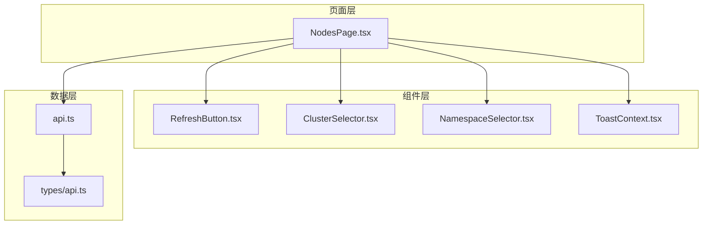
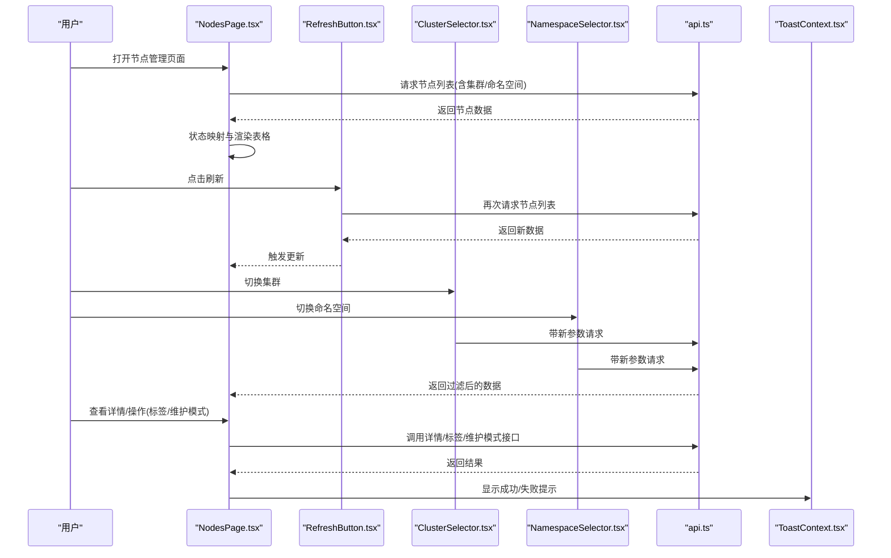
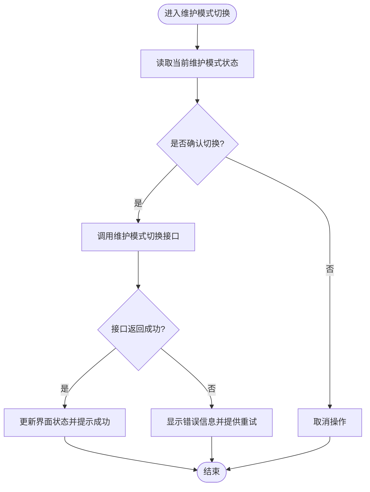
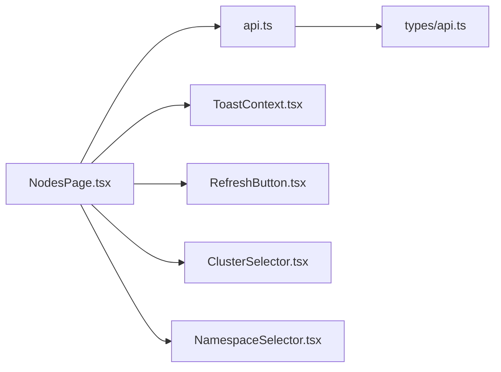

# 节点管理页面

<cite>
**本文引用的文件**   
- [NodesPage.tsx](file://web/src/pages/NodesPage.tsx)
- [api.ts](file://web/src/lib/api.ts)
- [api.ts](file://web/src/types/api.ts)
- [ToastContext.tsx](file://web/src/contexts/ToastContext.tsx)
- [RefreshButton.tsx](file://web/src/components/RefreshButton.tsx)
- [ClusterSelector.tsx](file://web/src/components/ClusterSelector.tsx)
- [NamespaceSelector.tsx](file://web/src/components/NamespaceSelector.tsx)
- [NodesPage.test.tsx](file://web/src/__tests__/unit/NodesPage.test.tsx)
</cite>

## 目录
1. [简介](#简介)
2. [项目结构](#项目结构)
3. [核心组件](#核心组件)
4. [架构总览](#架构总览)
5. [详细组件分析](#详细组件分析)
6. [依赖关系分析](#依赖关系分析)
7. [性能考虑](#性能考虑)
8. [故障排查指南](#故障排查指南)
9. [结论](#结论)
10. [附录](#附录)

## 简介
本文件为 NodesPage 节点管理页面的技术文档，面向前端与全栈开发者。内容涵盖：
- 节点列表的可视化展示与筛选
- 节点状态监控与实时刷新
- 资源使用情况（CPU、内存等）展示
- 节点标签管理与维护模式切换
- 节点详情查看与操作按钮交互
- 数据获取、状态映射、错误处理与用户反馈的实现要点

## 项目结构
NodesPage 位于 web 前端工程，采用 React + TypeScript 实现，配合 API 封装与 Toast 通知组件完成数据加载与用户反馈。关键文件组织如下：
- 页面组件：web/src/pages/NodesPage.tsx
- API 封装与类型定义：web/src/lib/api.ts、web/src/types/api.ts
- 通用 UI 组件：RefreshButton、ClusterSelector、NamespaceSelector
- 用户反馈：ToastContext
- 单元测试：web/src/__tests__/unit/NodesPage.test.tsx

图表来源
- [NodesPage.tsx](file://web/src/pages/NodesPage.tsx)
- [api.ts](file://web/src/lib/api.ts)
- [api.ts](file://web/src/types/api.ts)
- [RefreshButton.tsx](file://web/src/components/RefreshButton.tsx)
- [ClusterSelector.tsx](file://web/src/components/ClusterSelector.tsx)
- [NamespaceSelector.tsx](file://web/src/components/NamespaceSelector.tsx)
- [ToastContext.tsx](file://web/src/contexts/ToastContext.tsx)

章节来源
- [NodesPage.tsx](file://web/src/pages/NodesPage.tsx)
- [api.ts](file://web/src/lib/api.ts)
- [api.ts](file://web/src/types/api.ts)
- [RefreshButton.tsx](file://web/src/components/RefreshButton.tsx)
- [ClusterSelector.tsx](file://web/src/components/ClusterSelector.tsx)
- [NamespaceSelector.tsx](file://web/src/components/NamespaceSelector.tsx)
- [ToastContext.tsx](file://web/src/contexts/ToastContext.tsx)

## 核心组件
- NodesPage：节点管理主页面，负责聚合数据、渲染表格、提供筛选与操作入口。
- RefreshButton：触发重新拉取节点数据的按钮组件。
- ClusterSelector / NamespaceSelector：用于选择集群与命名空间，影响数据查询范围。
- ToastContext：全局消息提示上下文，用于成功/失败反馈。
- api.ts：统一封装后端接口调用，包含节点列表、详情、标签、维护模式等操作。
- types/api.ts：前后端数据结构与枚举定义，如节点状态、资源指标等。

章节来源
- [NodesPage.tsx](file://web/src/pages/NodesPage.tsx)
- [api.ts](file://web/src/lib/api.ts)
- [api.ts](file://web/src/types/api.ts)
- [RefreshButton.tsx](file://web/src/components/RefreshButton.tsx)
- [ClusterSelector.tsx](file://web/src/components/ClusterSelector.tsx)
- [NamespaceSelector.tsx](file://web/src/components/NamespaceSelector.tsx)
- [ToastContext.tsx](file://web/src/contexts/ToastContext.tsx)

## 架构总览
NodesPage 的数据流遵循“视图 -> 组件 -> API -> 类型”的分层模式：
- 视图层：NodesPage 渲染节点表格、详情抽屉/弹窗、操作按钮。
- 交互层：RefreshButton、ClusterSelector、NamespaceSelector 控制数据刷新与筛选条件。
- 数据层：api.ts 调用后端接口，返回标准化数据结构；types/api.ts 定义字段与枚举。
- 反馈层：ToastContext 在成功或失败时弹出提示。

图表来源
- [NodesPage.tsx](file://web/src/pages/NodesPage.tsx)
- [api.ts](file://web/src/lib/api.ts)
- [RefreshButton.tsx](file://web/src/components/RefreshButton.tsx)
- [ClusterSelector.tsx](file://web/src/components/ClusterSelector.tsx)
- [NamespaceSelector.tsx](file://web/src/components/NamespaceSelector.tsx)
- [ToastContext.tsx](file://web/src/contexts/ToastContext.tsx)

## 详细组件分析

### 节点列表与可视化展示
- 列表字段：节点名称、状态、角色、标签、资源使用率（CPU/内存）、可调度性、维护模式标记等。
- 可视化策略：
  - 状态列：通过状态映射将后端枚举转换为可读文本与颜色标识。
  - 资源使用：以进度条或百分比形式展示 CPU/内存占用。
  - 标签：以标签云或键值对形式展示，支持快速筛选。
  - 维护模式：以开关或徽章形式展示，便于识别。
- 排序与筛选：支持按状态、资源使用率、标签关键字进行排序与过滤。

章节来源
- [NodesPage.tsx](file://web/src/pages/NodesPage.tsx)
- [api.ts](file://web/src/types/api.ts)

### 实时状态更新
- 自动刷新：页面加载后定时轮询节点列表，间隔可配置。
- 手动刷新：通过 RefreshButton 立即触发一次拉取。
- 增量更新：当集群/命名空间变化时，仅重新请求相关数据并局部更新。
- 防抖与节流：避免频繁请求导致性能问题。

章节来源
- [NodesPage.tsx](file://web/src/pages/NodesPage.tsx)
- [RefreshButton.tsx](file://web/src/components/RefreshButton.tsx)

### 节点详情查看
- 详情面板：点击行或“详情”按钮展开侧边抽屉/弹窗。
- 详情内容：基础信息、事件历史、资源指标趋势、标签列表、维护模式状态等。
- 交互：支持从详情中直接执行标签编辑与维护模式切换。

章节来源
- [NodesPage.tsx](file://web/src/pages/NodesPage.tsx)
- [api.ts](file://web/src/lib/api.ts)

### 节点标签管理
- 标签展示：只读模式下展示所有标签键值对。
- 标签编辑：支持新增、修改、删除标签，提交前进行校验（键/值格式、重复键）。
- 批量操作：支持批量添加/移除标签。
- 反馈：成功时显示成功提示，失败时显示错误原因。

章节来源
- [NodesPage.tsx](file://web/src/pages/NodesPage.tsx)
- [api.ts](file://web/src/lib/api.ts)
- [ToastContext.tsx](file://web/src/contexts/ToastContext.tsx)

### 维护模式切换
- 状态读取：从节点详情或列表中标记维护模式。
- 切换逻辑：根据当前状态调用对应接口启用/禁用维护模式。
- 安全确认：切换前弹出确认对话框，防止误操作。
- 结果反馈：成功后刷新列表并提示，失败时给出错误信息与重试建议。

章节来源
- [NodesPage.tsx](file://web/src/pages/NodesPage.tsx)
- [api.ts](file://web/src/lib/api.ts)
- [ToastContext.tsx](file://web/src/contexts/ToastContext.tsx)

### 数据获取与状态映射
- 数据获取：统一通过 api.ts 发起 HTTP 请求，携带集群/命名空间等查询参数。
- 状态映射：将后端状态码/枚举映射为前端可读文本与样式类。
- 错误处理：网络异常、业务错误分别处理，并在 Toast 中提示。
- 缓存策略：可选本地缓存减少重复请求，结合时间戳控制失效。

章节来源
- [api.ts](file://web/src/lib/api.ts)
- [api.ts](file://web/src/types/api.ts)
- [ToastContext.tsx](file://web/src/contexts/ToastContext.tsx)

### 用户反馈与错误处理
- 成功反馈：操作完成后显示成功消息，必要时自动刷新。
- 失败反馈：捕获错误并显示具体原因，提供重试或联系支持的指引。
- 空状态：无数据时展示友好提示与引导操作。
- 加载状态：请求期间显示骨架屏或加载指示器。

章节来源
- [ToastContext.tsx](file://web/src/contexts/ToastContext.tsx)
- [NodesPage.tsx](file://web/src/pages/NodesPage.tsx)

### 代码级流程图（维护模式切换）

图表来源
- [NodesPage.tsx](file://web/src/pages/NodesPage.tsx)
- [api.ts](file://web/src/lib/api.ts)
- [ToastContext.tsx](file://web/src/contexts/ToastContext.tsx)

## 依赖关系分析
- 组件耦合：
  - NodesPage 依赖 api.ts 进行数据获取，依赖 ToastContext 进行反馈。
  - RefreshButton、ClusterSelector、NamespaceSelector 作为独立 UI 组件被 NodesPage 引用。
- 外部依赖：
  - 后端 API 接口契约由 types/api.ts 定义，确保前后端一致性。
- 潜在循环依赖：
  - 组件间通过 props/context 传递，避免直接相互引用造成循环。

图表来源
- [NodesPage.tsx](file://web/src/pages/NodesPage.tsx)
- [api.ts](file://web/src/lib/api.ts)
- [api.ts](file://web/src/types/api.ts)
- [RefreshButton.tsx](file://web/src/components/RefreshButton.tsx)
- [ClusterSelector.tsx](file://web/src/components/ClusterSelector.tsx)
- [NamespaceSelector.tsx](file://web/src/components/NamespaceSelector.tsx)
- [ToastContext.tsx](file://web/src/contexts/ToastContext.tsx)

章节来源
- [NodesPage.tsx](file://web/src/pages/NodesPage.tsx)
- [api.ts](file://web/src/lib/api.ts)
- [api.ts](file://web/src/types/api.ts)
- [RefreshButton.tsx](file://web/src/components/RefreshButton.tsx)
- [ClusterSelector.tsx](file://web/src/components/ClusterSelector.tsx)
- [NamespaceSelector.tsx](file://web/src/components/NamespaceSelector.tsx)
- [ToastContext.tsx](file://web/src/contexts/ToastContext.tsx)

## 性能考虑
- 请求优化：
  - 使用防抖/节流减少高频刷新带来的压力。
  - 合理设置轮询间隔，避免过短导致带宽浪费。
- 渲染优化：
  - 列表虚拟化（长列表场景）提升滚动性能。
  - 局部更新而非全量重渲染，减少 DOM 操作。
- 缓存策略：
  - 短期缓存热点数据，结合 ETag/Last-Modified 控制一致性。
- 错误恢复：
  - 网络抖动时自动重试，失败时降级为只读展示。

[本节为通用指导，不直接分析具体文件]

## 故障排查指南
- 常见问题：
  - 列表不更新：检查轮询定时器与刷新按钮绑定是否正确。
  - 状态映射异常：核对 types/api.ts 中的枚举与映射逻辑。
  - 标签编辑失败：确认键值格式校验与后端约束一致。
  - 维护模式切换无效：检查权限与确认流程是否完整。
- 调试建议：
  - 使用浏览器开发者工具观察网络请求与响应。
  - 在 ToastContext 中增加日志输出定位错误来源。
  - 通过单元测试覆盖关键路径，确保稳定性。

章节来源
- [NodesPage.test.tsx](file://web/src/__tests__/unit/NodesPage.test.tsx)
- [ToastContext.tsx](file://web/src/contexts/ToastContext.tsx)
- [api.ts](file://web/src/lib/api.ts)
- [api.ts](file://web/src/types/api.ts)

## 结论
NodesPage 通过清晰的分层架构与模块化设计，实现了节点管理的核心功能：可视化列表、实时监控、标签管理、维护模式切换与详情查看。借助统一的 API 封装与类型定义，保证了前后端契约的一致性；通过 Toast 反馈与完善的错误处理，提升了用户体验与可维护性。建议在后续迭代中引入列表虚拟化与更细粒度的缓存策略，以进一步提升性能与稳定性。

[本节为总结性内容，不直接分析具体文件]

## 附录
- 术语说明：
  - 节点：Kubernetes 集群中的工作节点，承载 Pod 运行。
  - 维护模式：节点进入不可调度状态，常用于运维操作。
  - 标签：键值对形式的元数据，用于分类与筛选。
- 参考文件：
  - 页面组件：[NodesPage.tsx](file://web/src/pages/NodesPage.tsx)
  - API 封装：[api.ts](file://web/src/lib/api.ts)
  - 类型定义：[api.ts](file://web/src/types/api.ts)
  - 用户反馈：[ToastContext.tsx](file://web/src/contexts/ToastContext.tsx)
  - 测试用例：[NodesPage.test.tsx](file://web/src/__tests__/unit/NodesPage.test.tsx)