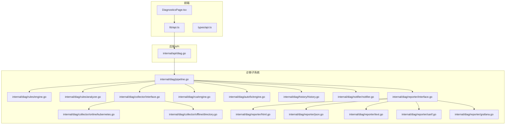
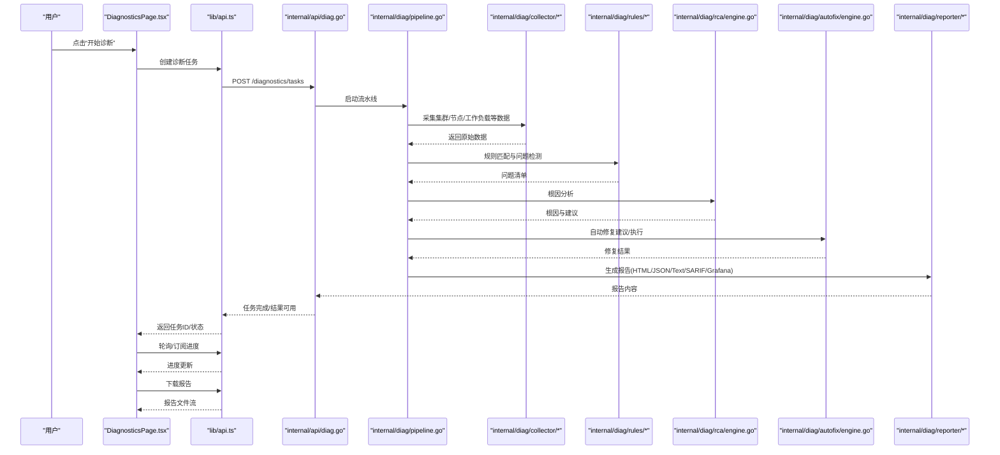
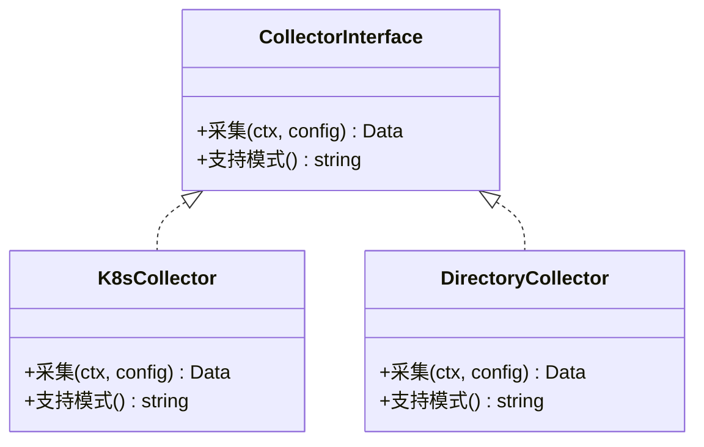
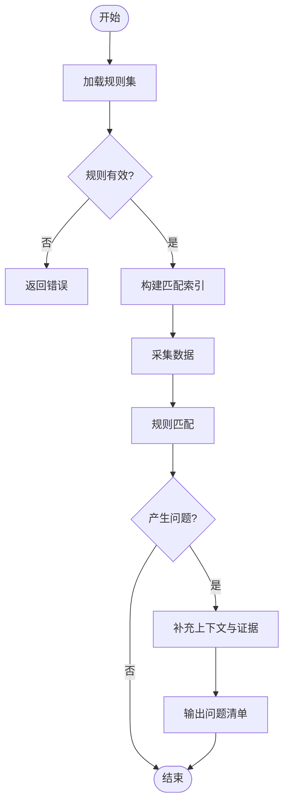
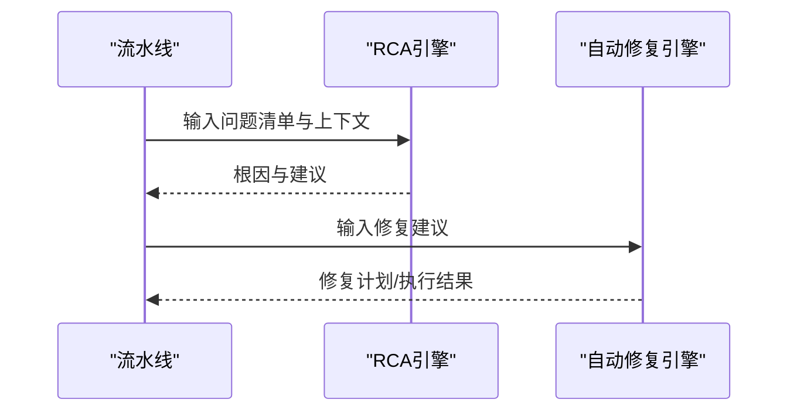
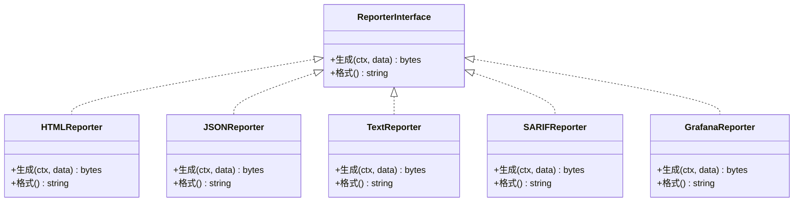
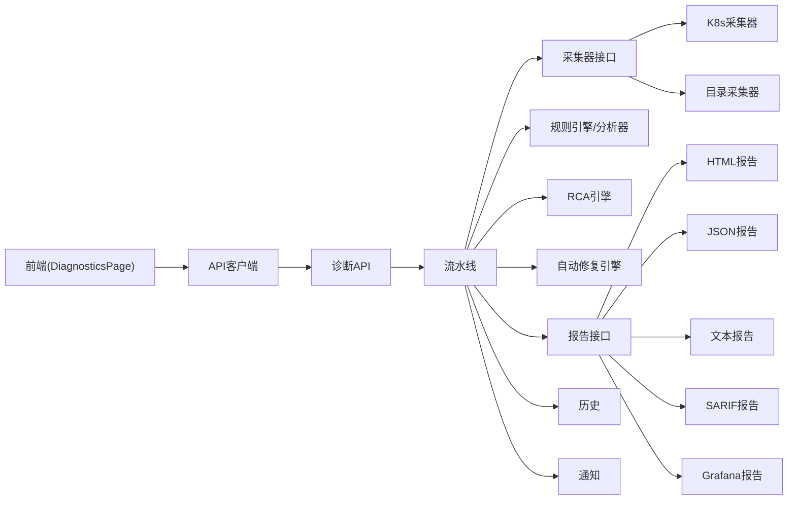

# 诊断页面

<cite>
**本文引用的文件**   
- [DiagnosticsPage.tsx](file://web/src/pages/DiagnosticsPage.tsx)
- [api.ts](file://web/src/lib/api.ts)
- [api.ts（类型定义）](file://web/src/types/api.ts)
- [diag.go](file://internal/api/diag.go)
- [pipeline.go](file://internal/diag/pipeline.go)
- [types.go](file://internal/diag/rules/types.go)
- [engine.go](file://internal/diag/rules/engine.go)
- [interface.go](file://internal/diag/collector/interface.go)
- [kubernetes.go（在线采集器）](file://internal/diag/collector/online/kubernetes.go)
- [directory.go（离线采集器）](file://internal/diag/collector/offline/directory.go)
- [analyzer.go（规则分析器）](file://internal/diag/rules/analyzer.go)
- [reporter_interface.go](file://internal/diag/reporter/interface.go)
- [html.go（HTML报告）](file://internal/diag/reporter/html.go)
- [json.go（JSON报告）](file://internal/diag/reporter/json.go)
- [text.go（文本报告）](file://internal/diag/reporter/text.go)
- [sarif.go（SARIF报告）](file://internal/diag/reporter/sarif.go)
- [grafana.go（Grafana报告）](file://internal/diag/reporter/grafana.go)
- [rca_engine.go](file://internal/diag/rca/engine.go)
- [autofix_engine.go](file://internal/diag/autofix/engine.go)
- [history.go](file://internal/diag/history/history.go)
- [notifier.go](file://internal/diag/notifier/notifier.go)
</cite>

## 目录
1. [简介](#简介)
2. [项目结构](#项目结构)
3. [核心组件](#核心组件)
4. [架构总览](#架构总览)
5. [详细组件分析](#详细组件分析)
6. [依赖关系分析](#依赖关系分析)
7. [性能考虑](#性能考虑)
8. [故障排查指南](#故障排查指南)
9. [结论](#结论)
10. [附录](#附录)

## 简介
本文件为 DiagnosticsPage 页面组件的详细技术文档，聚焦于诊断页面的核心功能与实现细节：集群健康检查、问题检测、根因分析与修复建议展示；诊断任务管理、进度跟踪、结果可视化与报告导出；以及诊断规则配置、分析引擎调用、结果数据处理和交互式报告的实现要点。读者可据此理解前端交互、后端 API、诊断流水线、采集器、分析器、RCA/自动修复、报告生成与通知等模块的协作方式。

## 项目结构
DiagnosticsPage 位于前端 web 层，通过 API 层与后端诊断子系统交互。后端以 pipeline 为核心编排采集、分析、RCA、自动修复与报告输出，并通过多种采集器从 Kubernetes 或离线数据源获取信息。

**图表来源** 
- [DiagnosticsPage.tsx](file://web/src/pages/DiagnosticsPage.tsx)
- [api.ts](file://web/src/lib/api.ts)
- [api.ts（类型定义）](file://web/src/types/api.ts)
- [diag.go](file://internal/api/diag.go)
- [pipeline.go](file://internal/diag/pipeline.go)
- [engine.go](file://internal/diag/rules/engine.go)
- [analyzer.go](file://internal/diag/rules/analyzer.go)
- [interface.go](file://internal/diag/collector/interface.go)
- [kubernetes.go（在线采集器）](file://internal/diag/collector/online/kubernetes.go)
- [directory.go（离线采集器）](file://internal/diag/collector/offline/directory.go)
- [rca_engine.go](file://internal/diag/rca/engine.go)
- [autofix_engine.go](file://internal/diag/autofix/engine.go)
- [history.go](file://internal/diag/history/history.go)
- [notifier.go](file://internal/diag/notifier/notifier.go)
- [reporter_interface.go](file://internal/diag/reporter/interface.go)
- [html.go（HTML报告）](file://internal/diag/reporter/html.go)
- [json.go（JSON报告）](file://internal/diag/reporter/json.go)
- [text.go（文本报告）](file://internal/diag/reporter/text.go)
- [sarif.go（SARIF报告）](file://internal/diag/reporter/sarif.go)
- [grafana.go（Grafana报告）](file://internal/diag/reporter/grafana.go)

**章节来源**
- [DiagnosticsPage.tsx](file://web/src/pages/DiagnosticsPage.tsx)
- [api.ts](file://web/src/lib/api.ts)
- [api.ts（类型定义）](file://web/src/types/api.ts)
- [diag.go](file://internal/api/diag.go)
- [pipeline.go](file://internal/diag/pipeline.go)

## 核心组件
- 前端页面 DiagnosticsPage：负责用户交互、发起诊断任务、轮询/订阅进度、渲染问题列表与详情、触发报告导出。
- API 客户端与类型：封装诊断相关接口调用，提供统一的请求/响应结构与错误处理。
- 诊断 API：暴露任务创建、状态查询、结果获取、报告导出等 HTTP 端点。
- 诊断流水线：编排采集、分析、RCA、自动修复、历史与通知、报告生成等阶段。
- 采集器：支持在线（Kubernetes）与离线（目录快照）两种模式。
- 规则与分析器：基于规则引擎执行问题检测，产出结构化问题清单。
- RCA 与自动修复：对问题进行根因推断并给出修复建议或自动化修复动作。
- 报告系统：支持 HTML、JSON、文本、SARIF、Grafana 等多种格式。
- 历史与通知：记录诊断历史，支持告警通知。

**章节来源**
- [DiagnosticsPage.tsx](file://web/src/pages/DiagnosticsPage.tsx)
- [api.ts](file://web/src/lib/api.ts)
- [api.ts（类型定义）](file://web/src/types/api.ts)
- [diag.go](file://internal/api/diag.go)
- [pipeline.go](file://internal/diag/pipeline.go)
- [interface.go](file://internal/diag/collector/interface.go)
- [engine.go](file://internal/diag/rules/engine.go)
- [analyzer.go](file://internal/diag/rules/analyzer.go)
- [rca_engine.go](file://internal/diag/rca/engine.go)
- [autofix_engine.go](file://internal/diag/autofix/engine.go)
- [reporter_interface.go](file://internal/diag/reporter/interface.go)

## 架构总览
下图展示了从前端发起诊断到后端流水线执行、数据采集、分析、RCA/修复、报告生成的端到端流程。

**图表来源** 
- [DiagnosticsPage.tsx](file://web/src/pages/DiagnosticsPage.tsx)
- [api.ts](file://web/src/lib/api.ts)
- [diag.go](file://internal/api/diag.go)
- [pipeline.go](file://internal/diag/pipeline.go)
- [interface.go](file://internal/diag/collector/interface.go)
- [kubernetes.go（在线采集器）](file://internal/diag/collector/online/kubernetes.go)
- [directory.go（离线采集器）](file://internal/diag/collector/offline/directory.go)
- [engine.go](file://internal/diag/rules/engine.go)
- [analyzer.go](file://internal/diag/rules/analyzer.go)
- [rca_engine.go](file://internal/diag/rca/engine.go)
- [autofix_engine.go](file://internal/diag/autofix/engine.go)
- [reporter_interface.go](file://internal/diag/reporter/interface.go)
- [html.go（HTML报告）](file://internal/diag/reporter/html.go)
- [json.go（JSON报告）](file://internal/diag/reporter/json.go)
- [text.go（文本报告）](file://internal/diag/reporter/text.go)
- [sarif.go（SARIF报告）](file://internal/diag/reporter/sarif.go)
- [grafana.go（Grafana报告）](file://internal/diag/reporter/grafana.go)

## 详细组件分析

### 前端页面 DiagnosticsPage
- 职责
  - 展示诊断入口与参数选择（如目标集群、命名空间、采集范围）。
  - 发起诊断任务、轮询/订阅任务进度、渲染问题列表与详情。
  - 触发报告导出（HTML/JSON/文本/SARIF/Grafana），支持交互筛选与排序。
- 关键交互
  - 创建任务：调用 API 创建任务并保存任务 ID。
  - 进度跟踪：定时拉取或事件订阅，更新 UI 状态（进行中/完成/失败）。
  - 结果展示：将问题按严重级别、类别分组，支持展开详情与跳转。
  - 报告导出：根据用户选择生成并下载对应格式的报告。
- 错误处理
  - 网络异常重试与降级提示。
  - 任务超时与取消机制。
  - 权限不足时的友好提示。

**章节来源**
- [DiagnosticsPage.tsx](file://web/src/pages/DiagnosticsPage.tsx)
- [api.ts](file://web/src/lib/api.ts)
- [api.ts（类型定义）](file://web/src/types/api.ts)

### 诊断 API 层
- 职责
  - 暴露任务生命周期接口：创建、查询状态、获取结果、导出报告。
  - 鉴权与审计：校验用户权限，记录操作日志。
  - 错误码与消息统一：标准化错误响应。
- 典型端点
  - 创建诊断任务
  - 查询任务状态与进度
  - 获取诊断结果（问题清单、根因、修复建议）
  - 导出报告（多格式）
- 集成点
  - 与诊断流水线对接，异步执行任务。
  - 与存储/历史模块对接，持久化任务与结果。
  - 与通知模块对接，推送关键事件。

**章节来源**
- [diag.go](file://internal/api/diag.go)

### 诊断流水线 pipeline
- 职责
  - 编排各阶段：采集→分析→RCA→自动修复→历史→通知→报告。
  - 控制并发与超时，保证任务可控与可恢复。
  - 聚合中间结果，驱动下游阶段输入。
- 关键流程
  - 初始化上下文与配置加载。
  - 并行采集多源数据。
  - 规则引擎批量分析问题。
  - 根因分析收敛问题。
  - 生成修复建议或执行修复。
  - 写入历史与发送通知。
  - 生成并缓存报告。

**章节来源**
- [pipeline.go](file://internal/diag/pipeline.go)

### 采集器 collector
- 接口设计
  - 统一采集接口，支持在线与离线两种模式。
  - 可扩展新采集器，只需实现接口。
- 在线采集器（Kubernetes）
  - 采集集群、节点、命名空间、工作负载、存储、网络、GPU 等资源状态。
  - 使用 Kubernetes API 进行实时查询。
- 离线采集器（目录）
  - 从本地目录读取预收集的 YAML/JSON 快照进行分析。
  - 适用于无集群访问环境或离线审计场景。

**图表来源** 
- [interface.go](file://internal/diag/collector/interface.go)
- [kubernetes.go（在线采集器）](file://internal/diag/collector/online/kubernetes.go)
- [directory.go（离线采集器）](file://internal/diag/collector/offline/directory.go)

**章节来源**
- [interface.go](file://internal/diag/collector/interface.go)
- [kubernetes.go（在线采集器）](file://internal/diag/collector/online/kubernetes.go)
- [directory.go（离线采集器）](file://internal/diag/collector/offline/directory.go)

### 规则与分析器 rules & analyzer
- 规则配置
  - 规则类型与严重级别定义。
  - 规则加载与校验。
- 规则引擎
  - 解析规则集，构建匹配索引。
  - 对采集数据进行批量匹配，产出问题清单。
- 分析器
  - 针对特定领域（如网络、存储、工作负载）进行深入分析。
  - 与规则引擎协同，补充上下文与证据。

**图表来源** 
- [types.go](file://internal/diag/rules/types.go)
- [engine.go](file://internal/diag/rules/engine.go)
- [analyzer.go](file://internal/diag/rules/analyzer.go)

**章节来源**
- [types.go](file://internal/diag/rules/types.go)
- [engine.go](file://internal/diag/rules/engine.go)
- [analyzer.go](file://internal/diag/rules/analyzer.go)

### 根因分析 RCA 与自动修复 autofix
- RCA 引擎
  - 基于问题清单与上下文，推断可能的根因。
  - 输出根因概率与建议措施。
- 自动修复引擎
  - 将修复建议转化为可执行动作。
  - 支持预览与确认执行，避免误操作。

**图表来源** 
- [rca_engine.go](file://internal/diag/rca/engine.go)
- [autofix_engine.go](file://internal/diag/autofix/engine.go)

**章节来源**
- [rca_engine.go](file://internal/diag/rca/engine.go)
- [autofix_engine.go](file://internal/diag/autofix/engine.go)

### 报告系统 reporter
- 接口设计
  - 统一报告接口，支持多格式输出。
- 支持的格式
  - HTML：交互式报告，适合浏览器查看。
  - JSON：结构化数据，便于二次处理。
  - 文本：简洁可读，适合日志与邮件。
  - SARIF：静态分析标准格式，便于工具链集成。
  - Grafana：用于仪表盘集成与可视化。

**图表来源** 
- [reporter_interface.go](file://internal/diag/reporter/interface.go)
- [html.go（HTML报告）](file://internal/diag/reporter/html.go)
- [json.go（JSON报告）](file://internal/diag/reporter/json.go)
- [text.go（文本报告）](file://internal/diag/reporter/text.go)
- [sarif.go（SARIF报告）](file://internal/diag/reporter/sarif.go)
- [grafana.go（Grafana报告）](file://internal/diag/reporter/grafana.go)

**章节来源**
- [reporter_interface.go](file://internal/diag/reporter/interface.go)
- [html.go（HTML报告）](file://internal/diag/reporter/html.go)
- [json.go（JSON报告）](file://internal/diag/reporter/json.go)
- [text.go（文本报告）](file://internal/diag/reporter/text.go)
- [sarif.go（SARIF报告）](file://internal/diag/reporter/sarif.go)
- [grafana.go（Grafana报告）](file://internal/diag/reporter/grafana.go)

### 历史与通知 history & notifier
- 历史
  - 记录每次诊断任务的元数据、结果摘要与报告位置。
  - 支持按时间、集群、状态检索。
- 通知
  - 在任务完成或出现严重问题时发送通知。
  - 支持多渠道（如企业微信、钉钉、飞书等）。

**章节来源**
- [history.go](file://internal/diag/history/history.go)
- [notifier.go](file://internal/diag/notifier/notifier.go)

## 依赖关系分析
- 前端依赖
  - DiagnosticsPage 依赖 API 客户端与类型定义，确保请求与响应的契约一致。
- 后端依赖
  - API 层依赖流水线，流水线依赖采集器、规则引擎、RCA、自动修复、报告系统与历史/通知。
- 耦合与内聚
  - 采集器与分析器通过统一接口解耦，便于扩展。
  - 报告系统通过接口抽象，支持多格式输出。
- 外部依赖
  - Kubernetes API（在线采集）。
  - 文件系统（离线采集）。
  - 通知渠道（可选）。

**图表来源** 
- [DiagnosticsPage.tsx](file://web/src/pages/DiagnosticsPage.tsx)
- [api.ts](file://web/src/lib/api.ts)
- [diag.go](file://internal/api/diag.go)
- [pipeline.go](file://internal/diag/pipeline.go)
- [interface.go](file://internal/diag/collector/interface.go)
- [kubernetes.go（在线采集器）](file://internal/diag/collector/online/kubernetes.go)
- [directory.go（离线采集器）](file://internal/diag/collector/offline/directory.go)
- [engine.go](file://internal/diag/rules/engine.go)
- [analyzer.go](file://internal/diag/rules/analyzer.go)
- [rca_engine.go](file://internal/diag/rca/engine.go)
- [autofix_engine.go](file://internal/diag/autofix/engine.go)
- [reporter_interface.go](file://internal/diag/reporter/interface.go)
- [html.go（HTML报告）](file://internal/diag/reporter/html.go)
- [json.go（JSON报告）](file://internal/diag/reporter/json.go)
- [text.go（文本报告）](file://internal/diag/reporter/text.go)
- [sarif.go（SARIF报告）](file://internal/diag/reporter/sarif.go)
- [grafana.go（Grafana报告）](file://internal/diag/reporter/grafana.go)
- [history.go](file://internal/diag/history/history.go)
- [notifier.go](file://internal/diag/notifier/notifier.go)

**章节来源**
- [pipeline.go](file://internal/diag/pipeline.go)
- [interface.go](file://internal/diag/collector/interface.go)
- [engine.go](file://internal/diag/rules/engine.go)
- [reporter_interface.go](file://internal/diag/reporter/interface.go)

## 性能考虑
- 采集阶段
  - 并行采集不同资源，减少总体耗时。
  - 限制并发度，避免对集群造成压力。
- 分析阶段
  - 规则匹配采用索引优化，提升匹配效率。
  - 对大规模数据分片处理，降低内存峰值。
- 报告生成
  - 按需生成报告格式，避免不必要的计算。
  - 大报告采用流式输出，减少内存占用。
- 前端体验
  - 增量更新进度，避免全量刷新。
  - 支持分页与懒加载，提升交互流畅性。

[本节为通用指导，不直接分析具体文件]

## 故障排查指南
- 常见问题
  - 任务创建失败：检查权限、集群连接、参数合法性。
  - 进度卡住：检查采集器是否阻塞、网络超时、资源配额限制。
  - 结果缺失：确认规则是否覆盖、采集数据是否完整。
  - 报告导出失败：检查磁盘空间、权限、模板渲染错误。
- 定位方法
  - 查看任务历史与日志，定位失败阶段。
  - 启用调试模式，收集更详细的上下文。
  - 使用离线采集器验证规则与分析逻辑。

**章节来源**
- [diag.go](file://internal/api/diag.go)
- [pipeline.go](file://internal/diag/pipeline.go)
- [history.go](file://internal/diag/history/history.go)

## 结论
DiagnosticsPage 通过前后端协作与模块化设计，实现了完整的诊断闭环：从数据采集、问题检测、根因分析到修复建议与报告导出。其清晰的接口设计与可扩展的插件化架构，使得新增采集器、规则与分析能力变得简单。建议在后续迭代中继续完善规则库、增强 RCA 准确性，并优化大规模集群下的性能表现。

[本节为总结，不直接分析具体文件]

## 附录
- 术语表
  - 诊断任务：一次完整的诊断流程实例。
  - 采集器：负责从目标环境收集数据的组件。
  - 规则引擎：基于规则匹配问题的分析组件。
  - RCA：根因分析，定位问题根本原因。
  - 自动修复：将修复建议转化为可执行动作。
  - 报告：诊断结果的多种格式输出。

[本节为概念说明，不直接分析具体文件]