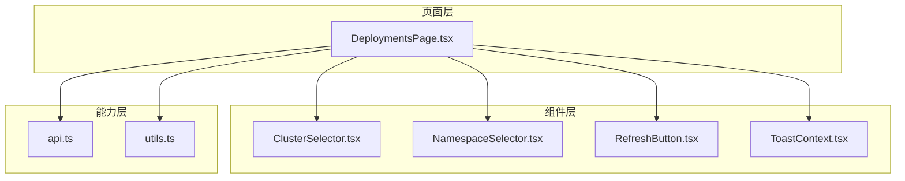
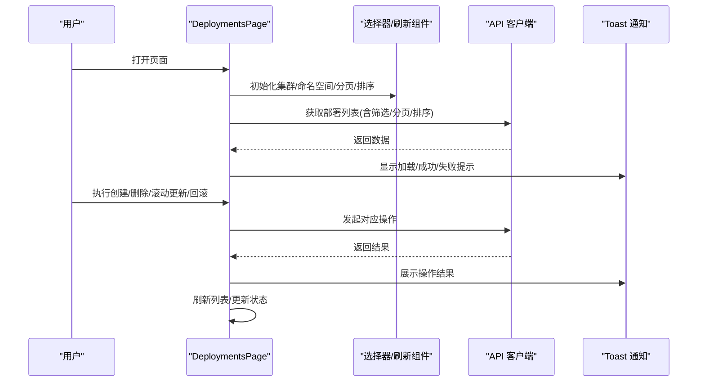
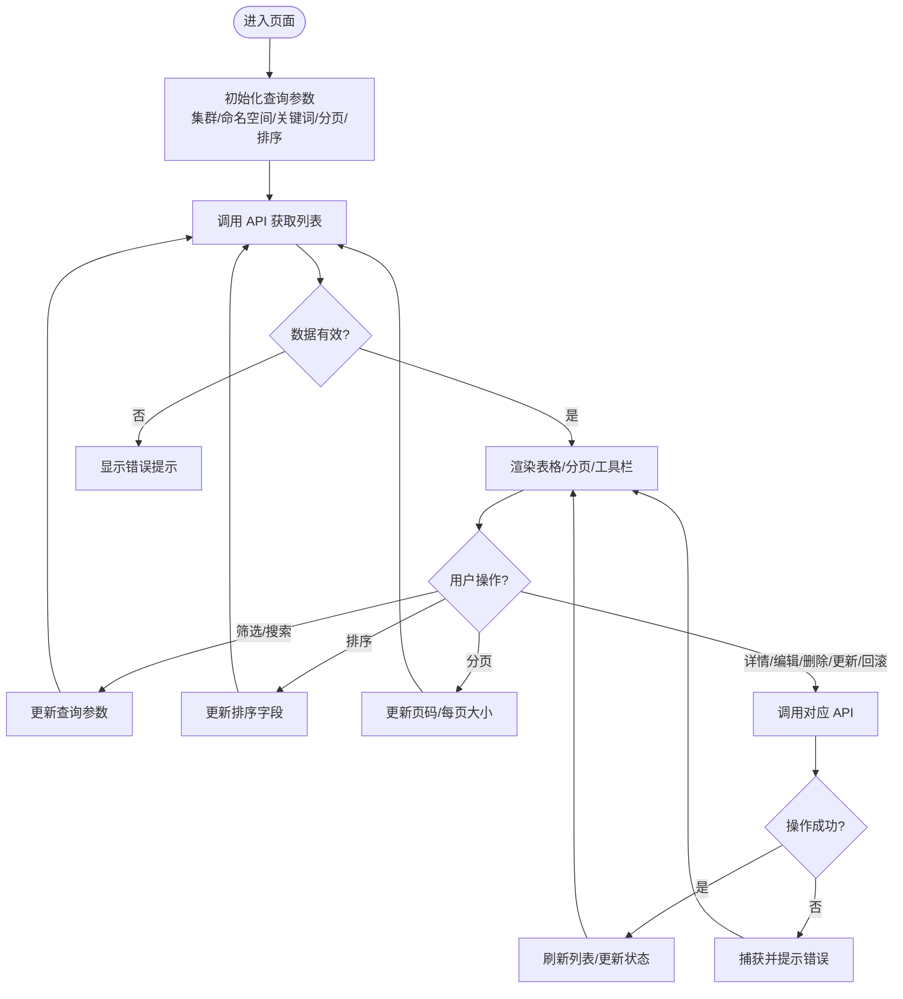
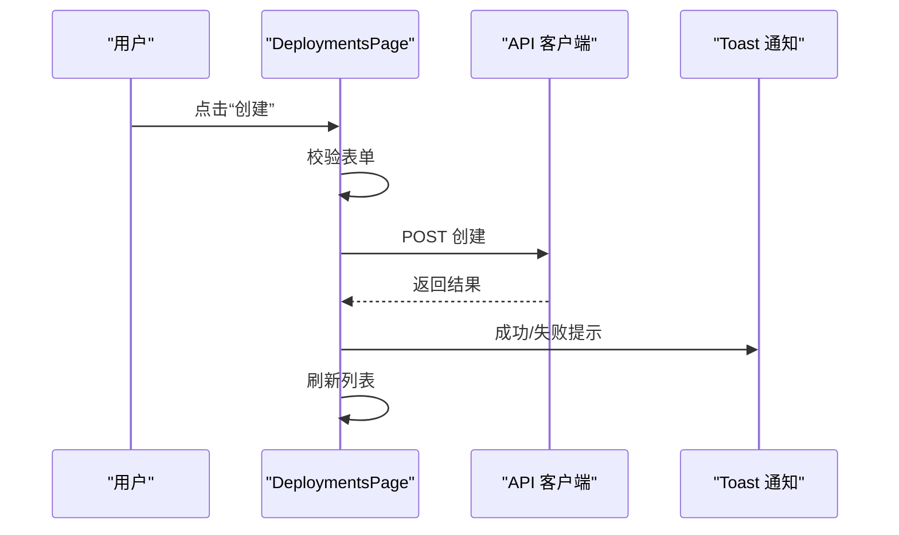
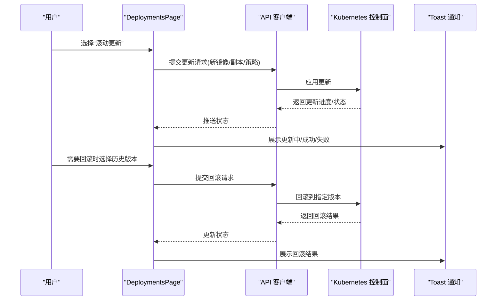
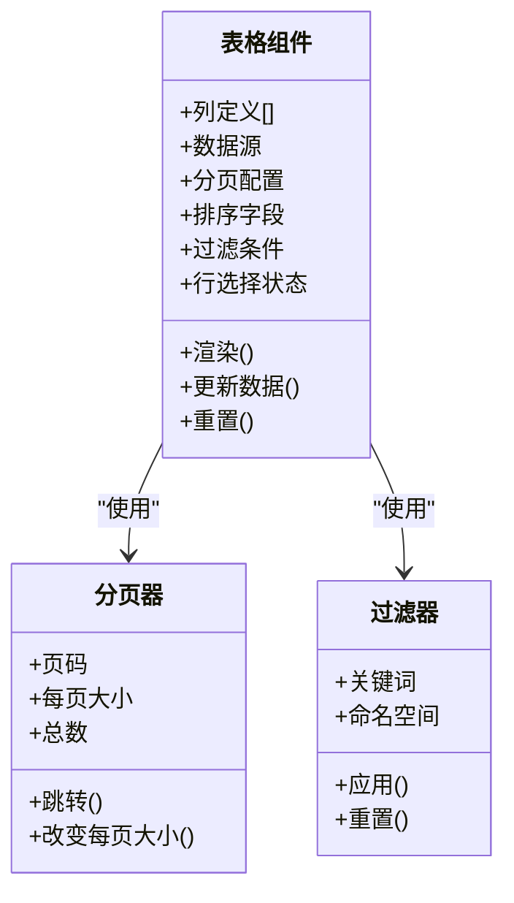
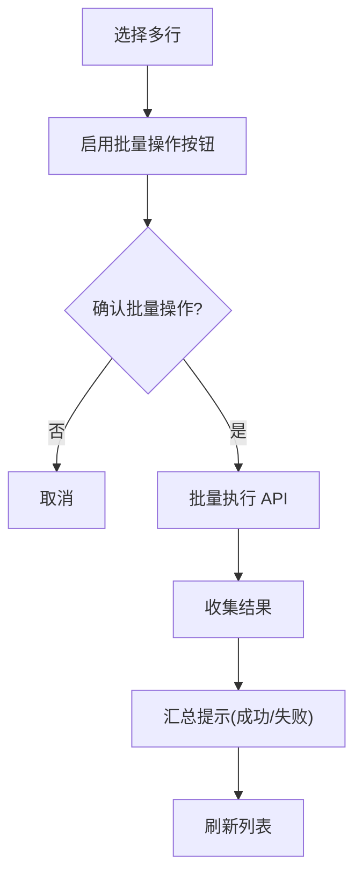
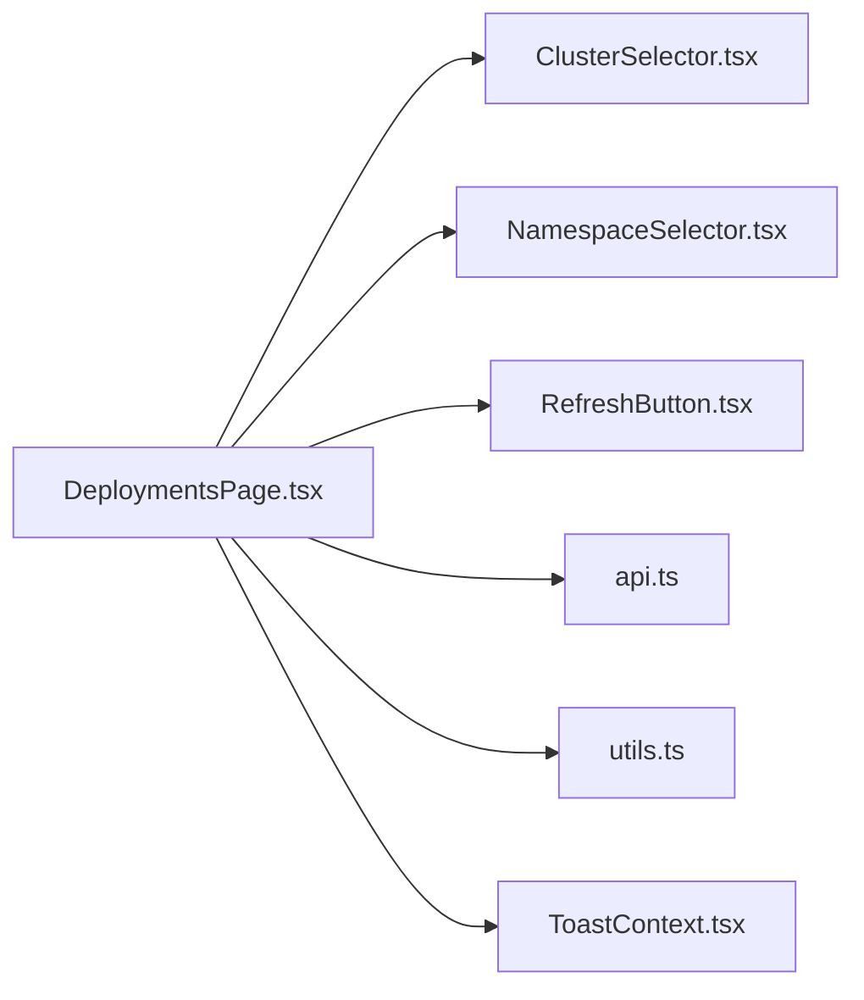

# 部署管理页面

<cite>
**本文引用的文件**   
- [DeploymentsPage.tsx](file://web/src/pages/DeploymentsPage.tsx)
- [api.ts](file://web/src/lib/api.ts)
- [utils.ts](file://web/src/lib/utils.ts)
- [ClusterSelector.tsx](file://web/src/components/ClusterSelector.tsx)
- [NamespaceSelector.tsx](file://web/src/components/NamespaceSelector.tsx)
- [RefreshButton.tsx](file://web/src/components/RefreshButton.tsx)
- [ToastContext.tsx](file://web/src/contexts/ToastContext.tsx)
- [api.test.ts](file://web/src/__tests__/integration/api.test.ts)
- [error-handling.test.tsx](file://web/src/__tests__/integration/error-handling.test.tsx)
- [DeploymentsPage.test.tsx](file://web/src/__tests__/unit/DeploymentsPage.test.tsx)
</cite>

## 目录
1. [简介](#简介)
2. [项目结构](#项目结构)
3. [核心组件](#核心组件)
4. [架构总览](#架构总览)
5. [详细组件分析](#详细组件分析)
6. [依赖关系分析](#依赖关系分析)
7. [性能考虑](#性能考虑)
8. [故障排查指南](#故障排查指南)
9. [结论](#结论)
10. [附录](#附录)

## 简介
本文件面向 DeploymentsPage 页面组件，系统化说明其在 Kubernetes 部署管理中的功能与实现要点。内容涵盖 Deployment 资源的增删改查、版本管理与滚动更新/回滚、列表展示、筛选搜索、批量操作等 UI 设计与交互逻辑；并提供数据表格组件使用、分页处理、排序过滤与状态同步的实践建议与参考路径。

## 项目结构
前端位于 web/src 目录，页面级路由与业务逻辑集中在 pages 目录，通用能力通过 components、lib、contexts 等模块提供。DeploymentsPage 作为“部署管理”入口，聚合了集群与命名空间选择、刷新、API 调用、错误提示、以及核心的部署资源列表与操作面板。

图表来源
- [DeploymentsPage.tsx](file://web/src/pages/DeploymentsPage.tsx)
- [ClusterSelector.tsx](file://web/src/components/ClusterSelector.tsx)
- [NamespaceSelector.tsx](file://web/src/components/NamespaceSelector.tsx)
- [RefreshButton.tsx](file://web/src/components/RefreshButton.tsx)
- [ToastContext.tsx](file://web/src/contexts/ToastContext.tsx)
- [api.ts](file://web/src/lib/api.ts)
- [utils.ts](file://web/src/lib/utils.ts)

章节来源
- [DeploymentsPage.tsx](file://web/src/pages/DeploymentsPage.tsx)
- [api.ts](file://web/src/lib/api.ts)
- [utils.ts](file://web/src/lib/utils.ts)

## 核心组件
- 页面容器：负责组合选择器、刷新按钮、主表格与操作区，维护查询参数（集群、命名空间、关键词、分页、排序）与数据状态。
- 选择器组件：
  - ClusterSelector：切换目标集群上下文，影响后续 API 请求的集群维度。
  - NamespaceSelector：限定命名空间范围，缩小查询结果集。
- 刷新按钮：触发重新拉取列表或执行特定操作后的刷新。
- 通知上下文：统一展示成功、失败、警告等消息。
- API 客户端：封装对后端的 HTTP 调用，包括列表查询、创建、删除、滚动更新、回滚等。
- 工具函数：用于格式化时间、状态映射、分页参数构建、排序字段映射等。

章节来源
- [DeploymentsPage.tsx](file://web/src/pages/DeploymentsPage.tsx)
- [ClusterSelector.tsx](file://web/src/components/ClusterSelector.tsx)
- [NamespaceSelector.tsx](file://web/src/components/NamespaceSelector.tsx)
- [RefreshButton.tsx](file://web/src/components/RefreshButton.tsx)
- [ToastContext.tsx](file://web/src/contexts/ToastContext.tsx)
- [api.ts](file://web/src/lib/api.ts)
- [utils.ts](file://web/src/lib/utils.ts)

## 架构总览
DeploymentsPage 采用“页面容器 + 子组件 + 服务层”的分层模式。页面负责状态编排与用户交互，子组件专注单一职责，服务层统一网络与错误处理。数据流遵循单向数据流：用户操作触发状态变更，状态驱动 UI 渲染，必要时调用 API 并更新本地状态。

图表来源
- [DeploymentsPage.tsx](file://web/src/pages/DeploymentsPage.tsx)
- [api.ts](file://web/src/lib/api.ts)
- [ToastContext.tsx](file://web/src/contexts/ToastContext.tsx)

## 详细组件分析

### 列表展示与交互
- 列表字段：名称、命名空间、副本数、就绪状态、镜像、更新时间、操作列等。
- 排序与过滤：支持按名称、状态、更新时间等字段排序；支持关键词模糊搜索与命名空间筛选。
- 分页：页码、每页条数、总条数，支持跳转与快速翻页。
- 行内操作：查看详情、编辑、删除、滚动更新、回滚等。
- 批量操作：多选行后批量删除、批量滚动更新等。

图表来源
- [DeploymentsPage.tsx](file://web/src/pages/DeploymentsPage.tsx)
- [api.ts](file://web/src/lib/api.ts)
- [utils.ts](file://web/src/lib/utils.ts)

章节来源
- [DeploymentsPage.tsx](file://web/src/pages/DeploymentsPage.tsx)
- [api.ts](file://web/src/lib/api.ts)
- [utils.ts](file://web/src/lib/utils.ts)

### CRUD 操作
- 创建：表单收集必要字段（名称、镜像、副本数、策略等），提交后调用创建接口，成功后刷新列表并提示。
- 读取：列表查询支持多条件筛选与分页；详情页可展示完整元数据与事件。
- 更新：编辑表单回填当前值，提交后触发更新接口，成功后刷新。
- 删除：单行删除与批量删除，二次确认后调用删除接口，成功后刷新。

图表来源
- [DeploymentsPage.tsx](file://web/src/pages/DeploymentsPage.tsx)
- [api.ts](file://web/src/lib/api.ts)
- [ToastContext.tsx](file://web/src/contexts/ToastContext.tsx)

章节来源
- [DeploymentsPage.tsx](file://web/src/pages/DeploymentsPage.tsx)
- [api.ts](file://web/src/lib/api.ts)

### 版本管理与滚动更新/回滚
- 版本管理：基于 Deployment 的 Revision/History 概念，展示历史版本快照与差异信息。
- 滚动更新：选择新版本或修改配置后触发滚动更新，逐步替换 Pod，保证可用性。
- 回滚：选择历史版本进行回滚，系统自动重建 Deployment 至指定版本。

图表来源
- [DeploymentsPage.tsx](file://web/src/pages/DeploymentsPage.tsx)
- [api.ts](file://web/src/lib/api.ts)
- [ToastContext.tsx](file://web/src/contexts/ToastContext.tsx)

章节来源
- [DeploymentsPage.tsx](file://web/src/pages/DeploymentsPage.tsx)
- [api.ts](file://web/src/lib/api.ts)

### 数据表格、分页、排序与过滤
- 表格组件：支持固定列、行选择、操作列、状态标签、时间格式化等。
- 分页：服务端分页，页码与每页大小变化时重新拉取数据。
- 排序：点击列头切换升序/降序/取消排序，后端按字段排序。
- 过滤：关键词搜索与命名空间筛选，实时或回车触发查询。

图表来源
- [DeploymentsPage.tsx](file://web/src/pages/DeploymentsPage.tsx)
- [utils.ts](file://web/src/lib/utils.ts)

章节来源
- [DeploymentsPage.tsx](file://web/src/pages/DeploymentsPage.tsx)
- [utils.ts](file://web/src/lib/utils.ts)

### 批量操作
- 多选行后启用批量删除、批量滚动更新等操作。
- 批量前二次确认，避免误操作。
- 批量执行时逐个或并发调用 API，汇总结果并提示。

图表来源
- [DeploymentsPage.tsx](file://web/src/pages/DeploymentsPage.tsx)
- [api.ts](file://web/src/lib/api.ts)
- [ToastContext.tsx](file://web/src/contexts/ToastContext.tsx)

章节来源
- [DeploymentsPage.tsx](file://web/src/pages/DeploymentsPage.tsx)
- [api.ts](file://web/src/lib/api.ts)

## 依赖关系分析
- 页面依赖选择器组件以限定查询范围。
- 页面依赖 API 客户端进行数据读写。
- 页面依赖工具函数进行数据格式化与参数构建。
- Toast 上下文用于统一消息展示。

图表来源
- [DeploymentsPage.tsx](file://web/src/pages/DeploymentsPage.tsx)
- [ClusterSelector.tsx](file://web/src/components/ClusterSelector.tsx)
- [NamespaceSelector.tsx](file://web/src/components/NamespaceSelector.tsx)
- [RefreshButton.tsx](file://web/src/components/RefreshButton.tsx)
- [api.ts](file://web/src/lib/api.ts)
- [utils.ts](file://web/src/lib/utils.ts)
- [ToastContext.tsx](file://web/src/contexts/ToastContext.tsx)

章节来源
- [DeploymentsPage.tsx](file://web/src/pages/DeploymentsPage.tsx)
- [api.ts](file://web/src/lib/api.ts)
- [utils.ts](file://web/src/lib/utils.ts)

## 性能考虑
- 服务端分页与过滤：减少前端渲染压力，提升大数据量下的流畅度。
- 防抖搜索：关键词输入防抖，降低频繁请求。
- 增量更新：在滚动更新/回滚过程中使用轮询或长连接获取状态，避免全量刷新。
- 缓存策略：对不常变动的元数据（如命名空间列表）做短期缓存。
- 懒加载：详情抽屉按需加载，避免首屏过重。

[本节为通用指导，无需引用具体文件]

## 故障排查指南
- 网络异常：检查 API 客户端的错误处理与重试策略，查看 Toast 提示是否准确。
- 权限问题：确认所选集群与命名空间的访问权限，检查鉴权令牌。
- 数据不一致：对比后端返回与前端状态，确保刷新时机正确。
- 滚动更新失败：查看事件与日志，确认镜像可达、资源配额充足、健康检查通过。
- 回滚失败：确认目标版本存在且可用，检查依赖变更兼容性。

章节来源
- [api.test.ts](file://web/src/__tests__/integration/api.test.ts)
- [error-handling.test.tsx](file://web/src/__tests__/integration/error-handling.test.tsx)
- [DeploymentsPage.test.tsx](file://web/src/__tests__/unit/DeploymentsPage.test.tsx)

## 结论
DeploymentsPage 通过清晰的分层与组件化设计，实现了 Deployment 资源的完整管理能力，包括 CRUD、版本管理、滚动更新与回滚，以及高效的列表展示、筛选搜索与批量操作。结合服务端分页、防抖与缓存等优化手段，可在大规模环境下保持良好体验。建议在后续迭代中进一步完善错误边界、操作审计与可视化监控。

[本节为总结性内容，无需引用具体文件]

## 附录
- 关键交互流程参考：
  - 列表查询与刷新：[DeploymentsPage.tsx](file://web/src/pages/DeploymentsPage.tsx)、[api.ts](file://web/src/lib/api.ts)
  - 创建/更新/删除：[DeploymentsPage.tsx](file://web/src/pages/DeploymentsPage.tsx)、[api.ts](file://web/src/lib/api.ts)
  - 滚动更新/回滚：[DeploymentsPage.tsx](file://web/src/pages/DeploymentsPage.tsx)、[api.ts](file://web/src/lib/api.ts)
  - 分页/排序/过滤：[DeploymentsPage.tsx](file://web/src/pages/DeploymentsPage.tsx)、[utils.ts](file://web/src/lib/utils.ts)
  - 通知与错误处理：[ToastContext.tsx](file://web/src/contexts/ToastContext.tsx)、[error-handling.test.tsx](file://web/src/__tests__/integration/error-handling.test.tsx)

[本节为索引性内容，无需引用具体文件]