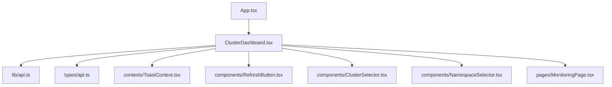
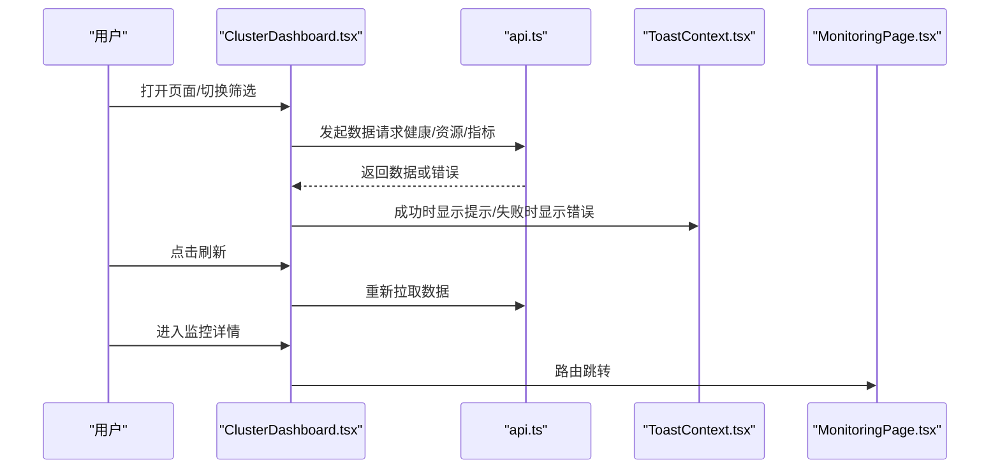
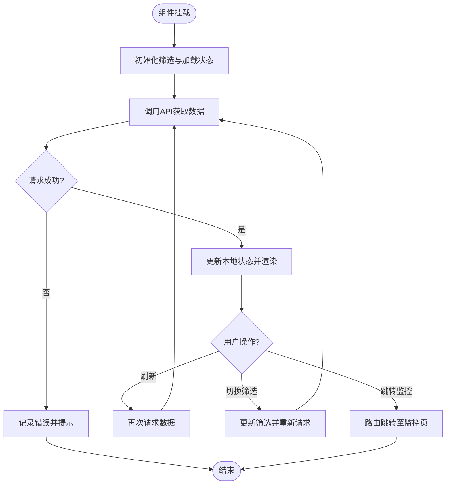
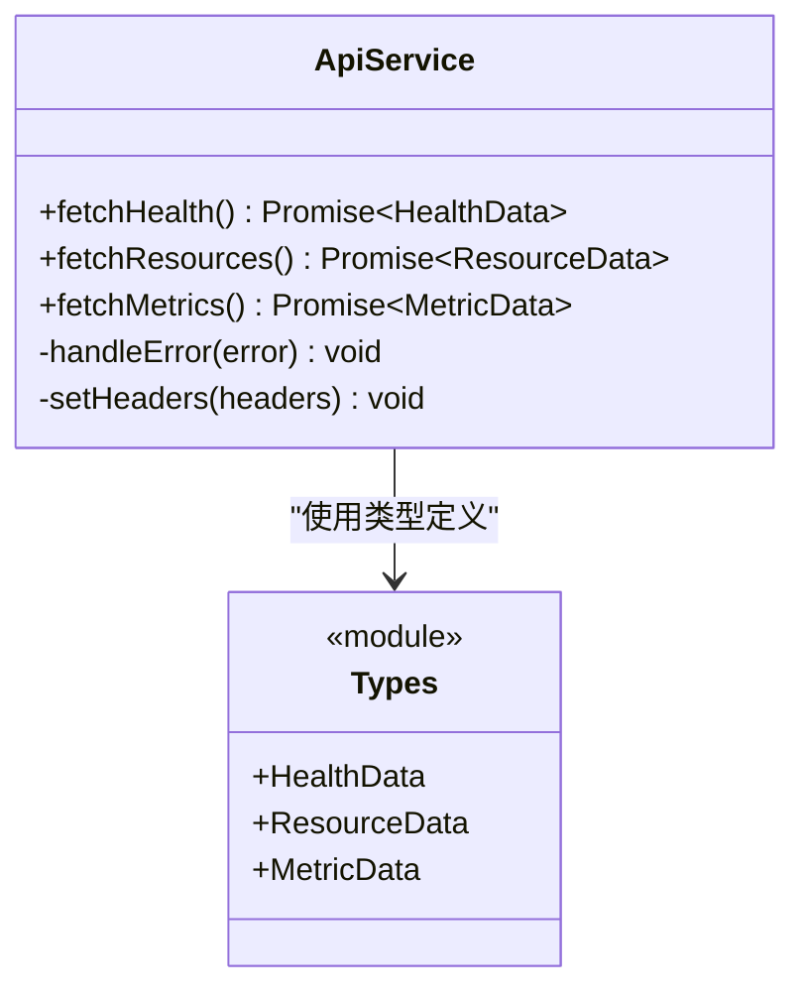
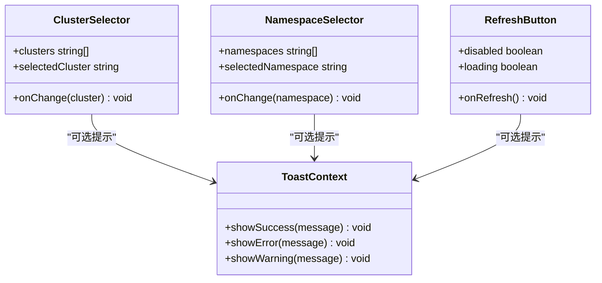
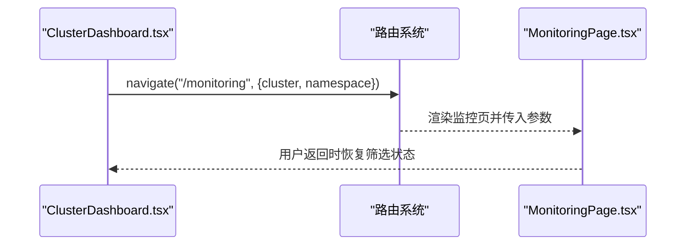
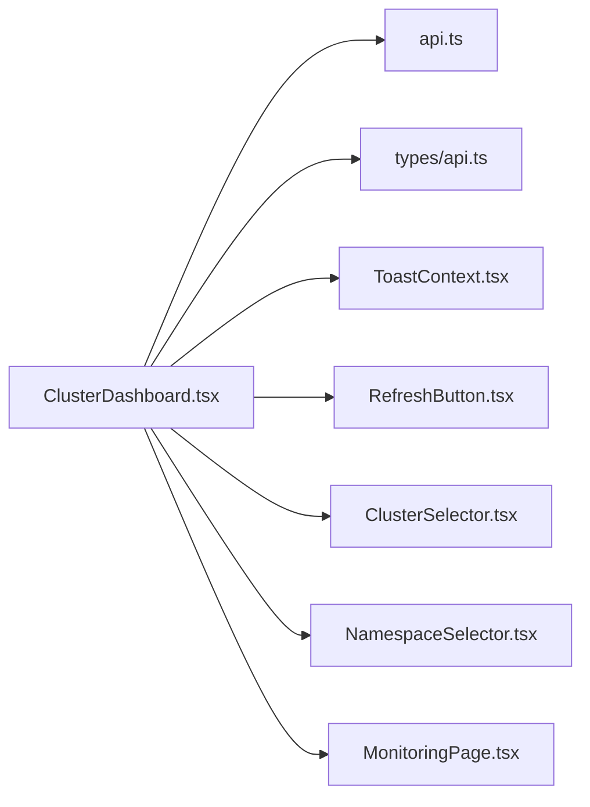

# 集群仪表盘

<cite>
**本文引用的文件**   
- [ClusterDashboard.tsx](file://web/src/pages/ClusterDashboard.tsx)
- [api.ts](file://web/src/lib/api.ts)
- [api.ts（类型定义）](file://web/src/types/api.ts)
- [ToastContext.tsx](file://web/src/contexts/ToastContext.tsx)
- [RefreshButton.tsx](file://web/src/components/RefreshButton.tsx)
- [ClusterSelector.tsx](file://web/src/components/ClusterSelector.tsx)
- [NamespaceSelector.tsx](file://web/src/components/NamespaceSelector.tsx)
- [App.tsx](file://web/src/App.tsx)
- [MonitoringPage.tsx](file://web/src/pages/MonitoringPage.tsx)
</cite>

## 目录
1. [简介](#简介)
2. [项目结构](#项目结构)
3. [核心组件](#核心组件)
4. [架构总览](#架构总览)
5. [详细组件分析](#详细组件分析)
6. [依赖关系分析](#依赖关系分析)
7. [性能考虑](#性能考虑)
8. [故障排查指南](#故障排查指南)
9. [结论](#结论)
10. [附录](#附录)

## 简介
本文件为 ClusterDashboard（集群仪表盘）页面组件的完整技术文档。内容涵盖：
- UI 布局设计与模块划分
- 集群健康状态监控、资源使用概览与关键指标展示
- 数据获取机制、实时更新策略与错误处理
- 组件属性配置、与其他组件的集成方式及状态管理实现
- 常见问题定位与优化建议

该页面作为 Klaw Web 前端的核心入口之一，聚合多类诊断与监控能力，提供统一的可视化视图与交互入口。

## 项目结构
ClusterDashboard 位于 web/src/pages 目录下，属于 React + TypeScript 的前端应用。其职责是：
- 聚合并渲染集群健康、资源使用、关键指标等卡片或图表
- 通过 API 层拉取后端数据，并在本地进行状态管理与更新
- 与选择器组件（集群、命名空间）、刷新按钮、提示上下文等协作

**图示来源** 
- [App.tsx](file://web/src/App.tsx)
- [ClusterDashboard.tsx](file://web/src/pages/ClusterDashboard.tsx)
- [api.ts](file://web/src/lib/api.ts)
- [api.ts（类型定义）](file://web/src/types/api.ts)
- [ToastContext.tsx](file://web/src/contexts/ToastContext.tsx)
- [RefreshButton.tsx](file://web/src/components/RefreshButton.tsx)
- [ClusterSelector.tsx](file://web/src/components/ClusterSelector.tsx)
- [NamespaceSelector.tsx](file://web/src/components/NamespaceSelector.tsx)
- [MonitoringPage.tsx](file://web/src/pages/MonitoringPage.tsx)

**章节来源**
- [ClusterDashboard.tsx](file://web/src/pages/ClusterDashboard.tsx)
- [App.tsx](file://web/src/App.tsx)

## 核心组件
- ClusterDashboard（页面级容器）
  - 负责整体布局、数据加载、错误与提示、刷新与轮询控制、筛选条件（集群/命名空间）联动
- API 层（lib/api.ts）
  - 封装 HTTP 请求、错误统一处理、重试与超时策略
- 类型定义（types/api.ts）
  - 定义接口返回数据结构，确保前后端契约一致
- 上下文与工具组件
  - ToastContext：全局消息提示
  - RefreshButton：触发手动刷新
  - ClusterSelector / NamespaceSelector：筛选维度切换
  - MonitoringPage：从仪表盘跳转到更详细的监控页

**章节来源**
- [ClusterDashboard.tsx](file://web/src/pages/ClusterDashboard.tsx)
- [api.ts](file://web/src/lib/api.ts)
- [api.ts（类型定义）](file://web/src/types/api.ts)
- [ToastContext.tsx](file://web/src/contexts/ToastContext.tsx)
- [RefreshButton.tsx](file://web/src/components/RefreshButton.tsx)
- [ClusterSelector.tsx](file://web/src/components/ClusterSelector.tsx)
- [NamespaceSelector.tsx](file://web/src/components/NamespaceSelector.tsx)

## 架构总览
ClusterDashboard 采用“页面容器 + 数据服务 + 上下文”的分层模式：
- 页面容器：组织 UI 布局与用户交互
- 数据服务：集中管理 API 调用与错误处理
- 上下文：跨组件共享提示与全局状态
- 子组件：专注单一职责（选择器、刷新、跳转）

**图示来源** 
- [ClusterDashboard.tsx](file://web/src/pages/ClusterDashboard.tsx)
- [api.ts](file://web/src/lib/api.ts)
- [ToastContext.tsx](file://web/src/contexts/ToastContext.tsx)
- [MonitoringPage.tsx](file://web/src/pages/MonitoringPage.tsx)

## 详细组件分析

### ClusterDashboard 页面组件
- 职责
  - 维护筛选状态（集群、命名空间）
  - 管理数据加载状态（加载中、成功、错误）
  - 渲染健康状态、资源使用、关键指标等区块
  - 处理刷新、轮询、错误提示与跳转
- 数据流
  - 初始化或筛选变化时触发数据获取
  - 成功后更新本地状态并渲染
  - 失败时捕获错误并通过 Toast 提示
- 交互逻辑
  - 手动刷新：调用刷新函数重新拉取数据
  - 自动轮询：可配置间隔定时刷新
  - 跳转监控：导航到 MonitoringPage 查看详细信息

**图示来源** 
- [ClusterDashboard.tsx](file://web/src/pages/ClusterDashboard.tsx)
- [api.ts](file://web/src/lib/api.ts)
- [ToastContext.tsx](file://web/src/contexts/ToastContext.tsx)

**章节来源**
- [ClusterDashboard.tsx](file://web/src/pages/ClusterDashboard.tsx)

### API 层（lib/api.ts）
- 职责
  - 封装所有与后端的 HTTP 请求
  - 统一错误处理（网络异常、业务错误码）
  - 支持请求头设置、超时与重试策略
- 设计要点
  - 将响应类型映射到 types/api.ts 中的接口定义
  - 在失败路径中抛出结构化错误，便于上层捕获与提示
  - 暴露清晰的函数签名，供页面组件直接调用

**图示来源** 
- [api.ts](file://web/src/lib/api.ts)
- [api.ts（类型定义）](file://web/src/types/api.ts)

**章节来源**
- [api.ts](file://web/src/lib/api.ts)
- [api.ts（类型定义）](file://web/src/types/api.ts)

### 上下文与工具组件
- ToastContext（提示上下文）
  - 提供全局消息提示能力（成功、错误、警告）
  - 被页面组件在数据加载成功/失败时调用
- RefreshButton（刷新按钮）
  - 触发父组件的数据刷新回调
  - 支持禁用态与加载态反馈
- ClusterSelector / NamespaceSelector（选择器）
  - 提供集群与命名空间的筛选能力
  - 变更时触发父组件重新拉取数据

**图示来源** 
- [ToastContext.tsx](file://web/src/contexts/ToastContext.tsx)
- [RefreshButton.tsx](file://web/src/components/RefreshButton.tsx)
- [ClusterSelector.tsx](file://web/src/components/ClusterSelector.tsx)
- [NamespaceSelector.tsx](file://web/src/components/NamespaceSelector.tsx)

**章节来源**
- [ToastContext.tsx](file://web/src/contexts/ToastContext.tsx)
- [RefreshButton.tsx](file://web/src/components/RefreshButton.tsx)
- [ClusterSelector.tsx](file://web/src/components/ClusterSelector.tsx)
- [NamespaceSelector.tsx](file://web/src/components/NamespaceSelector.tsx)

### 与监控页面的集成
- 从 ClusterDashboard 跳转到 MonitoringPage 查看详细监控信息
- 传递必要的筛选参数（如集群、命名空间）以保持一致性

**图示来源** 
- [ClusterDashboard.tsx](file://web/src/pages/ClusterDashboard.tsx)
- [MonitoringPage.tsx](file://web/src/pages/MonitoringPage.tsx)

**章节来源**
- [MonitoringPage.tsx](file://web/src/pages/MonitoringPage.tsx)

## 依赖关系分析
- 页面组件依赖 API 层进行数据获取
- 页面组件依赖上下文组件进行提示
- 页面组件依赖选择器组件进行筛选
- 页面组件依赖路由与监控页面进行跳转

**图示来源** 
- [ClusterDashboard.tsx](file://web/src/pages/ClusterDashboard.tsx)
- [api.ts](file://web/src/lib/api.ts)
- [api.ts（类型定义）](file://web/src/types/api.ts)
- [ToastContext.tsx](file://web/src/contexts/ToastContext.tsx)
- [RefreshButton.tsx](file://web/src/components/RefreshButton.tsx)
- [ClusterSelector.tsx](file://web/src/components/ClusterSelector.tsx)
- [NamespaceSelector.tsx](file://web/src/components/NamespaceSelector.tsx)
- [MonitoringPage.tsx](file://web/src/pages/MonitoringPage.tsx)

**章节来源**
- [ClusterDashboard.tsx](file://web/src/pages/ClusterDashboard.tsx)

## 性能考虑
- 数据缓存与去重
  - 对相同筛选条件的请求进行缓存，避免重复拉取
  - 合理设置过期时间，平衡实时性与性能
- 请求合并与节流
  - 频繁筛选变更时使用防抖/节流减少请求次数
  - 批量请求合并以减少网络开销
- 渲染优化
  - 使用 memoization 避免不必要的重渲染
  - 大列表虚拟化渲染提升性能
- 错误重试与降级
  - 对瞬时错误进行有限次重试
  - 失败时提供降级视图与友好提示

[本节为通用指导，不直接分析具体文件]

## 故障排查指南
- 常见错误场景
  - 网络异常：检查网络连接与代理设置
  - 权限不足：确认当前用户具备所需权限
  - 数据为空：检查后端服务状态与筛选条件
- 调试步骤
  - 查看浏览器开发者工具的 Network 面板，确认请求与响应
  - 检查 Toast 提示是否出现，定位错误来源
  - 验证类型定义与实际返回结构是否一致
- 日志与追踪
  - 在 API 层增加请求/响应日志
  - 在页面组件中打印关键状态变化

**章节来源**
- [api.ts](file://web/src/lib/api.ts)
- [ToastContext.tsx](file://web/src/contexts/ToastContext.tsx)

## 结论
ClusterDashboard 作为集群监控的统一入口，通过清晰的分层与模块化设计，实现了健康状态、资源使用与关键指标的集中展示。结合 API 层的健壮性与上下文组件的提示能力，提供了良好的用户体验与可维护性。后续可在性能优化与错误处理方面持续改进，以提升稳定性与响应速度。

[本节为总结性内容，不直接分析具体文件]

## 附录
- 组件属性配置建议
  - 筛选维度：集群、命名空间
  - 刷新策略：手动刷新、自动轮询（可配置间隔）
  - 错误处理：统一提示、重试策略、降级视图
- 数据获取机制
  - 使用 API 层统一封装请求
  - 类型定义保证前后端一致性
- 实时更新策略
  - 基于定时器或 WebSocket（如有）实现
  - 增量更新与全量更新策略
- 错误处理最佳实践
  - 区分网络错误与业务错误
  - 提供用户友好的提示信息与操作指引

[本节为补充说明，不直接分析具体文件]