# 页面组件

<cite>
**本文引用的文件**   
- [web/src/pages/ClusterDashboard.tsx](file://web/src/pages/ClusterDashboard.tsx)
- [web/src/pages/DeploymentsPage.tsx](file://web/src/pages/DeploymentsPage.tsx)
- [web/src/pages/NodesPage.tsx](file://web/src/pages/NodesPage.tsx)
- [web/src/pages/PodsPage.tsx](file://web/src/pages/PodsPage.tsx)
- [web/src/pages/ServicesPage.tsx](file://web/src/pages/ServicesPage.tsx)
- [web/src/pages/DiagnosticsPage.tsx](file://web/src/pages/DiagnosticsPage.tsx)
- [web/src/pages/MonitoringPage.tsx](file://web/src/pages/MonitoringPage.tsx)
- [web/src/pages/BackupsPage.tsx](file://web/src/pages/BackupsPage.tsx)
- [web/src/pages/TenantsPage.tsx](file://web/src/pages/TenantsPage.tsx)
- [web/src/components/ClusterSelector.tsx](file://web/src/components/ClusterSelector.tsx)
- [web/src/components/NamespaceSelector.tsx](file://web/src/components/NamespaceSelector.tsx)
- [web/src/components/RefreshButton.tsx](file://web/src/components/RefreshButton.tsx)
- [web/src/components/ServiceDetailDrawer.tsx](file://web/src/components/ServiceDetail抽屉.tsx)
- [web/src/lib/api.ts](file://web/src/lib/api.ts)
- [web/src/types/api.ts](file://web/src/types/api.ts)
</cite>

## 目录
1. [简介](#简介)
2. [项目结构](#项目结构)
3. [核心组件](#核心组件)
4. [架构总览](#架构总览)
5. [详细组件分析](#详细组件分析)
6. [依赖关系分析](#依赖关系分析)
7. [性能考虑](#性能考虑)
8. [故障排查指南](#故障排查指南)
9. [结论](#结论)
10. [附录](#附录)

## 简介
本文件面向 Klaw 前端的所有页面组件，系统性梳理每个页面的功能职责、UI 布局设计、数据展示方式与用户交互逻辑。覆盖的核心页面包括：集群仪表盘（ClusterDashboard）、部署管理（DeploymentsPage）、节点管理（NodesPage）、Pod 管理（PodsPage）、服务管理（ServicesPage）、诊断页面（DiagnosticsPage）、监控页面（MonitoringPage）、备份管理（BackupsPage）以及租户管理（TenantsPage）。文档同时给出关键组件属性、事件处理与状态管理的实践要点，帮助读者快速理解并扩展各页面能力。

## 项目结构
Klaw 前端采用基于 React + TypeScript 的单页应用结构，页面按功能模块划分在 web/src/pages 目录下，通用 UI 组件位于 web/src/components，API 客户端与类型定义分别位于 web/src/lib 与 web/src/types。整体组织遵循“页面即特性”的模块化思路，便于独立开发与测试。

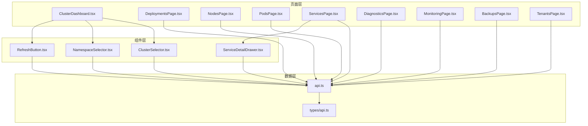

图表来源
- [web/src/pages/ClusterDashboard.tsx](file://web/src/pages/ClusterDashboard.tsx)
- [web/src/pages/DeploymentsPage.tsx](file://web/src/pages/DeploymentsPage.tsx)
- [web/src/pages/NodesPage.tsx](file://web/src/pages/NodesPage.tsx)
- [web/src/pages/PodsPage.tsx](file://web/src/pages/PodsPage.tsx)
- [web/src/pages/ServicesPage.tsx](file://web/src/pages/ServicesPage.tsx)
- [web/src/pages/DiagnosticsPage.tsx](file://web/src/pages/DiagnosticsPage.tsx)
- [web/src/pages/MonitoringPage.tsx](file://web/src/pages/MonitoringPage.tsx)
- [web/src/pages/BackupsPage.tsx](file://web/src/pages/BackupsPage.tsx)
- [web/src/pages/TenantsPage.tsx](file://web/src/pages/TenantsPage.tsx)
- [web/src/components/ClusterSelector.tsx](file://web/src/components/ClusterSelector.tsx)
- [web/src/components/NamespaceSelector.tsx](file://web/src/components/NamespaceSelector.tsx)
- [web/src/components/RefreshButton.tsx](file://web/src/components/RefreshButton.tsx)
- [web/src/components/ServiceDetailDrawer.tsx](file://web/src/components/ServiceDetail抽屉.tsx)
- [web/src/lib/api.ts](file://web/src/lib/api.ts)
- [web/src/types/api.ts](file://web/src/types/api.ts)

章节来源
- [web/src/pages/ClusterDashboard.tsx](file://web/src/pages/ClusterDashboard.tsx)
- [web/src/pages/DeploymentsPage.tsx](file://web/src/pages/DeploymentsPage.tsx)
- [web/src/pages/NodesPage.tsx](file://web/src/pages/NodesPage.tsx)
- [web/src/pages/PodsPage.tsx](file://web/src/pages/PodsPage.tsx)
- [web/src/pages/ServicesPage.tsx](file://web/src/pages/ServicesPage.tsx)
- [web/src/pages/DiagnosticsPage.tsx](file://web/src/pages/DiagnosticsPage.tsx)
- [web/src/pages/MonitoringPage.tsx](file://web/src/pages/MonitoringPage.tsx)
- [web/src/pages/BackupsPage.tsx](file://web/src/pages/BackupsPage.tsx)
- [web/src/pages/TenantsPage.tsx](file://web/src/pages/TenantsPage.tsx)
- [web/src/components/ClusterSelector.tsx](file://web/src/components/ClusterSelector.tsx)
- [web/src/components/NamespaceSelector.tsx](file://web/src/components/NamespaceSelector.tsx)
- [web/src/components/RefreshButton.tsx](file://web/src/components/RefreshButton.tsx)
- [web/src/components/ServiceDetailDrawer.tsx](file://web/src/components/ServiceDetail抽屉.tsx)
- [web/src/lib/api.ts](file://web/src/lib/api.ts)
- [web/src/types/api.ts](file://web/src/types/api.ts)

## 核心组件
本节聚焦支撑各页面的通用组件，说明其职责、属性与交互行为。

- ClusterSelector（集群选择器）
  - 职责：提供集群切换能力，影响后续所有页面数据的查询上下文。
  - 典型属性：当前选中集群标识、可选集群列表、变更回调。
  - 交互：下拉选择后触发回调，页面根据新集群重新拉取数据。
  - 状态管理：通常由父页面或全局上下文维护选中值；本地可缓存最近选择。

- NamespaceSelector（命名空间选择器）
  - 职责：提供命名空间筛选，用于限定资源范围。
  - 典型属性：当前命名空间、可用命名空间列表、变更回调。
  - 交互：选择变化后刷新相关列表视图。

- RefreshButton（刷新按钮）
  - 职责：手动触发数据刷新，支持加载态与错误提示。
  - 典型属性：是否加载中、刷新回调、禁用条件。
  - 交互：点击后调用刷新函数，显示加载指示，完成后恢复。

- ServiceDetailDrawer（服务详情抽屉）
  - 职责：以侧边抽屉形式展示服务的详细信息与关联对象。
  - 典型属性：可见性控制、服务标识、关闭回调。
  - 交互：打开时拉取详情，支持滚动查看与返回操作。

章节来源
- [web/src/components/ClusterSelector.tsx](file://web/src/components/ClusterSelector.tsx)
- [web/src/components/NamespaceSelector.tsx](file://web/src/components/NamespaceSelector.tsx)
- [web/src/components/RefreshButton.tsx](file://web/src/components/RefreshButton.tsx)
- [web/src/components/ServiceDetailDrawer.tsx](file://web/src/components/ServiceDetail抽屉.tsx)

## 架构总览
页面层通过统一的 API 客户端访问后端接口，使用类型定义确保数据结构一致性。通用选择器与工具组件在各页面中复用，保证一致的交互体验。

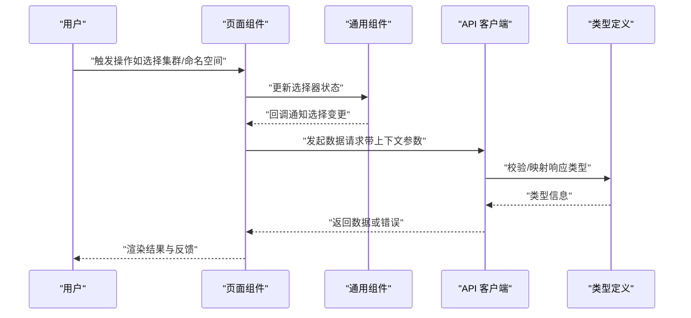

图表来源
- [web/src/lib/api.ts](file://web/src/lib/api.ts)
- [web/src/types/api.ts](file://web/src/types/api.ts)
- [web/src/components/ClusterSelector.tsx](file://web/src/components/ClusterSelector.tsx)
- [web/src/components/NamespaceSelector.tsx](file://web/src/components/NamespaceSelector.tsx)
- [web/src/components/RefreshButton.tsx](file://web/src/components/RefreshButton.tsx)

## 详细组件分析

### ClusterDashboard（集群仪表盘）
- 功能职责：展示集群整体健康度、关键指标概览与告警摘要，支持快速跳转到其他管理页面。
- UI 布局：顶部为集群与命名空间选择器；中部为指标卡片与趋势图；底部为告警列表与快捷入口。
- 数据展示：聚合类指标通过汇总接口获取，图表组件负责渲染时间序列与阈值线。
- 交互逻辑：选择器变更触发全量刷新；告警条目可点击查看详情；支持一键刷新与自动轮询开关。
- 状态管理：维护当前集群/命名空间、指标数据、告警列表、刷新状态与错误信息。

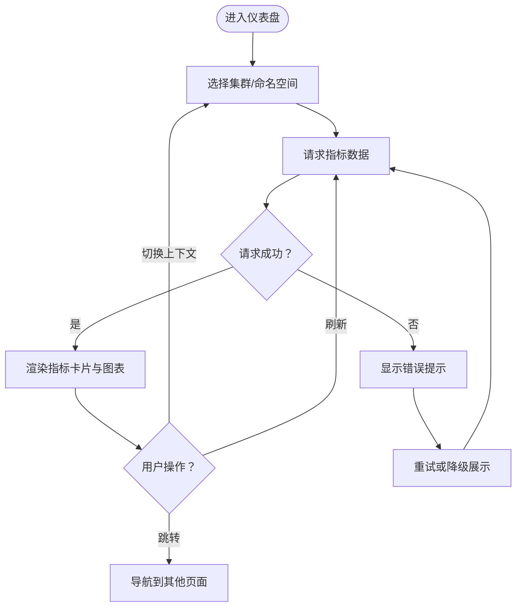

章节来源
- [web/src/pages/ClusterDashboard.tsx](file://web/src/pages/ClusterDashboard.tsx)
- [web/src/components/ClusterSelector.tsx](file://web/src/components/ClusterSelector.tsx)
- [web/src/components/NamespaceSelector.tsx](file://web/src/components/NamespaceSelector.tsx)
- [web/src/lib/api.ts](file://web/src/lib/api.ts)

### DeploymentsPage（部署管理）
- 功能职责：列出与筛选部署对象，支持查看副本数、镜像版本与运行状态。
- UI 布局：表格为主，包含搜索框、过滤条件、分页控件与批量操作栏。
- 数据展示：从部署列表接口获取数据，表格行内展示关键字段，悬停显示更多元数据。
- 交互逻辑：支持排序、过滤、分页与批量操作（如滚动升级、回滚）；点击行进入详情页。
- 状态管理：维护列表数据、筛选条件、分页状态、选中项与操作反馈。

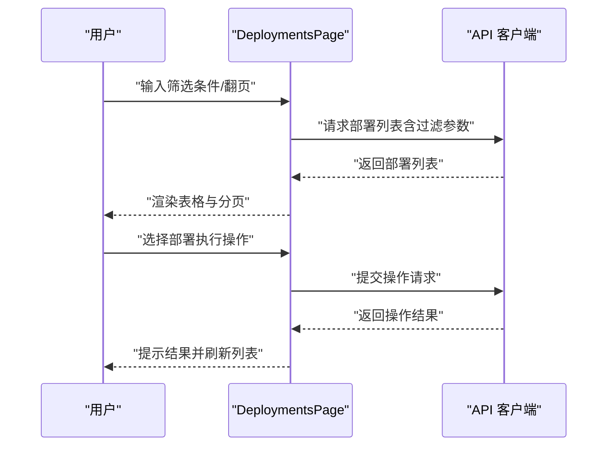

章节来源
- [web/src/pages/DeploymentsPage.tsx](file://web/src/pages/DeploymentsPage.tsx)
- [web/src/lib/api.ts](file://web/src/lib/api.ts)

### NodesPage（节点管理）
- 功能职责：展示节点清单与健康状态，支持查看 CPU/内存/磁盘等指标与事件。
- UI 布局：节点卡片或表格视图，顶部有筛选与搜索，底部展示节点事件流。
- 数据展示：节点基础信息与指标数据分块展示，异常节点高亮提示。
- 交互逻辑：点击节点查看详情的抽屉或子页面；支持标记不可调度、排障与重启操作。
- 状态管理：维护节点列表、选中节点、指标数据、事件流与操作状态。

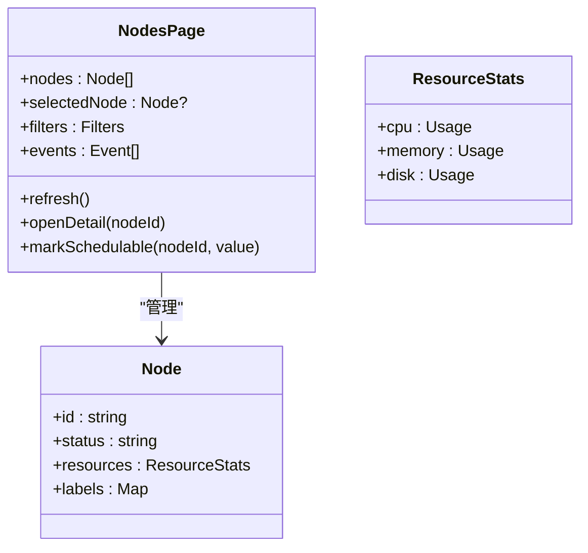

图表来源
- [web/src/pages/NodesPage.tsx](file://web/src/pages/NodesPage.tsx)
- [web/src/lib/api.ts](file://web/src/lib/api.ts)

章节来源
- [web/src/pages/NodesPage.tsx](file://web/src/pages/NodesPage.tsx)
- [web/src/lib/api.ts](file://web/src/lib/api.ts)

### PodsPage（Pod 管理）
- 功能职责：列出 Pod 实例，展示运行状态、重启次数、日志摘要与资源占用。
- UI 布局：表格+筛选面板，支持按命名空间、标签、状态过滤；行内操作包括查看日志、删除与扩容。
- 数据展示：状态色标区分 Running/Pending/Error 等；日志预览支持关键词高亮。
- 交互逻辑：点击行展开日志面板；支持批量删除与强制终止；错误 Pod 提供诊断入口。
- 状态管理：维护 Pod 列表、筛选条件、日志内容、选中项与操作反馈。

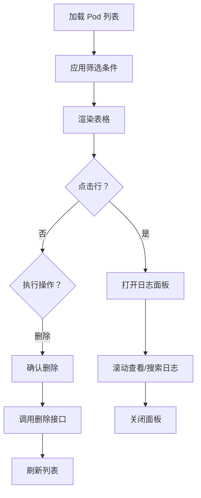

章节来源
- [web/src/pages/PodsPage.tsx](file://web/src/pages/PodsPage.tsx)
- [web/src/lib/api.ts](file://web/src/lib/api.ts)

### ServicesPage（服务管理）
- 功能职责：管理服务对象及其端点、端口映射与流量策略，支持查看关联工作负载。
- UI 布局：服务列表与详情抽屉组合；列表展示名称、类型、端口与状态；抽屉内展示端点与关联对象。
- 数据展示：服务基础信息、端点健康、关联 Deployment/StatefulSet 等。
- 交互逻辑：打开详情抽屉查看完整信息；支持编辑端口映射与发布策略；提供诊断与回滚入口。
- 状态管理：维护服务列表、选中服务、详情数据、编辑表单与操作结果。

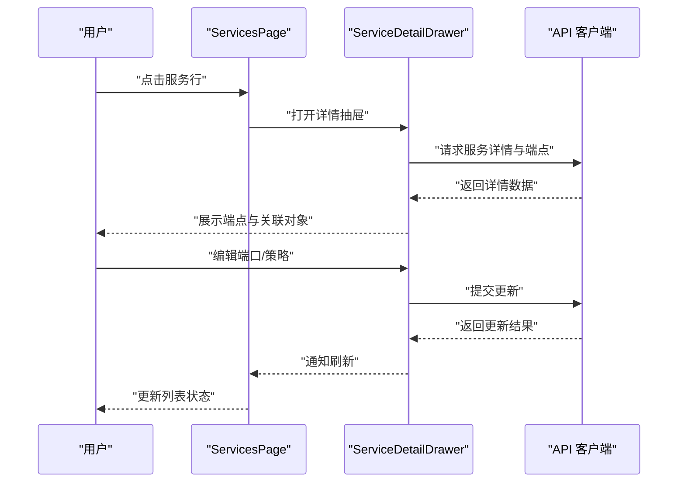

图表来源
- [web/src/pages/ServicesPage.tsx](file://web/src/pages/ServicesPage.tsx)
- [web/src/components/ServiceDetailDrawer.tsx](file://web/src/components/ServiceDetail抽屉.tsx)
- [web/src/lib/api.ts](file://web/src/lib/api.ts)

章节来源
- [web/src/pages/ServicesPage.tsx](file://web/src/pages/ServicesPage.tsx)
- [web/src/components/ServiceDetailDrawer.tsx](file://web/src/components/ServiceDetail抽屉.tsx)
- [web/src/lib/api.ts](file://web/src/lib/api.ts)

### DiagnosticsPage（诊断页面）
- 功能职责：收集与分析集群/节点诊断数据，生成问题报告与修复建议。
- UI 布局：诊断任务配置区、采集进度条、分析报告展示区与导出入口。
- 数据展示：规则命中情况、严重级别分布、根因分析与修复步骤。
- 交互逻辑：创建诊断任务、选择分析维度、查看报告与导出 PDF/JSON；支持定时任务与历史回溯。
- 状态管理：维护任务列表、当前任务状态、报告内容与导出格式。

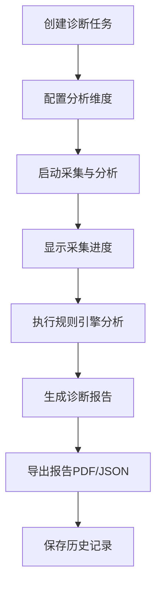

章节来源
- [web/src/pages/DiagnosticsPage.tsx](file://web/src/pages/DiagnosticsPage.tsx)
- [web/src/lib/api.ts](file://web/src/lib/api.ts)

### MonitoringPage（监控页面）
- 功能职责：展示集群与资源的实时监控指标，支持自定义看板与告警阈值设置。
- UI 布局：看板网格、时间范围选择器、指标选择器与告警面板。
- 数据展示：时序曲线、热力图与统计卡片；支持多指标叠加对比。
- 交互逻辑：拖拽调整看板布局；点击指标查看明细；设置阈值触发告警通知。
- 状态管理：维护看板配置、指标集合、时间窗口、阈值与告警状态。

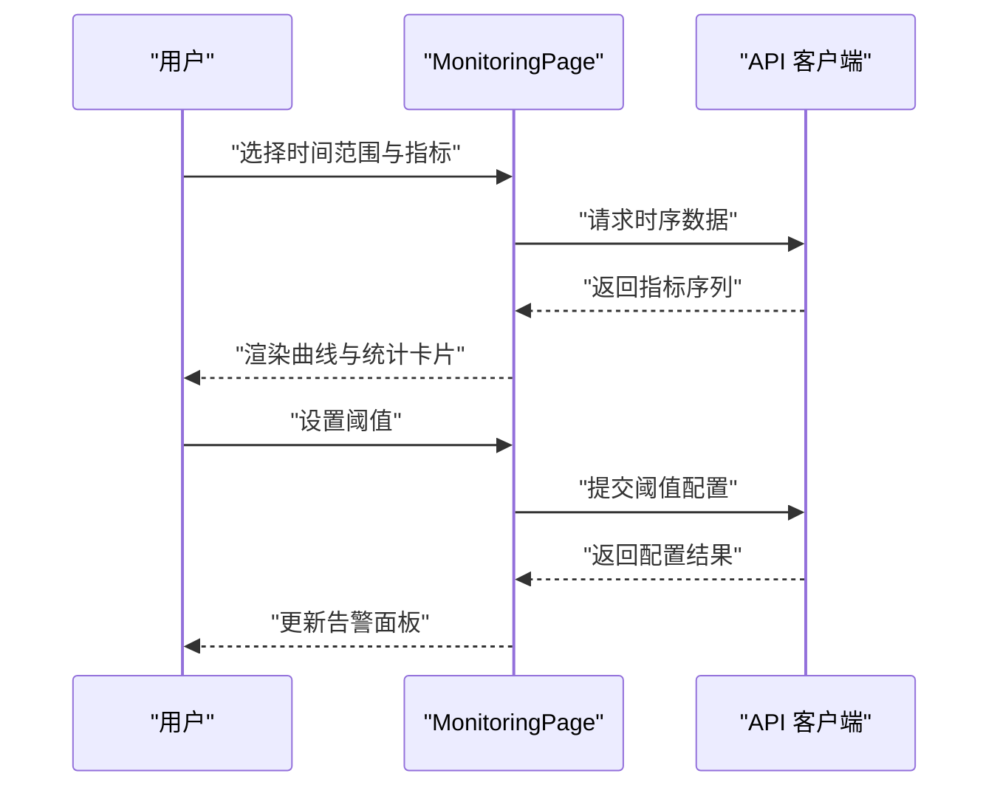

章节来源
- [web/src/pages/MonitoringPage.tsx](file://web/src/pages/MonitoringPage.tsx)
- [web/src/lib/api.ts](file://web/src/lib/api.ts)

### BackupsPage（备份管理）
- 功能职责：管理集群与命名空间的备份任务，支持创建、恢复与清理备份。
- UI 布局：备份任务列表、任务详情面板、恢复向导与清理确认对话框。
- 数据展示：备份大小、完成时间、状态与校验结果；恢复进度与回滚选项。
- 交互逻辑：创建备份任务、选择保留策略；执行恢复前进行预检查；支持批量清理过期备份。
- 状态管理：维护任务列表、当前任务、恢复流程状态与错误提示。

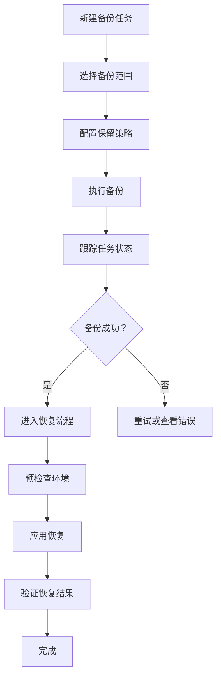

章节来源
- [web/src/pages/BackupsPage.tsx](file://web/src/pages/BackupsPage.tsx)
- [web/src/lib/api.ts](file://web/src/lib/api.ts)

### TenantsPage（租户管理）
- 功能职责：管理租户与命名空间映射、配额与权限策略，支持资源隔离与审计。
- UI 布局：租户列表、配额设置面板、RBAC 策略编辑器与审计日志查看器。
- 数据展示：租户基本信息、配额使用情况、策略生效状态与审计事件。
- 交互逻辑：创建/编辑租户、分配命名空间与配额；编辑 RBAC 策略并下发；查看审计日志与导出。
- 状态管理：维护租户列表、配额数据、策略配置、审计记录与操作反馈。

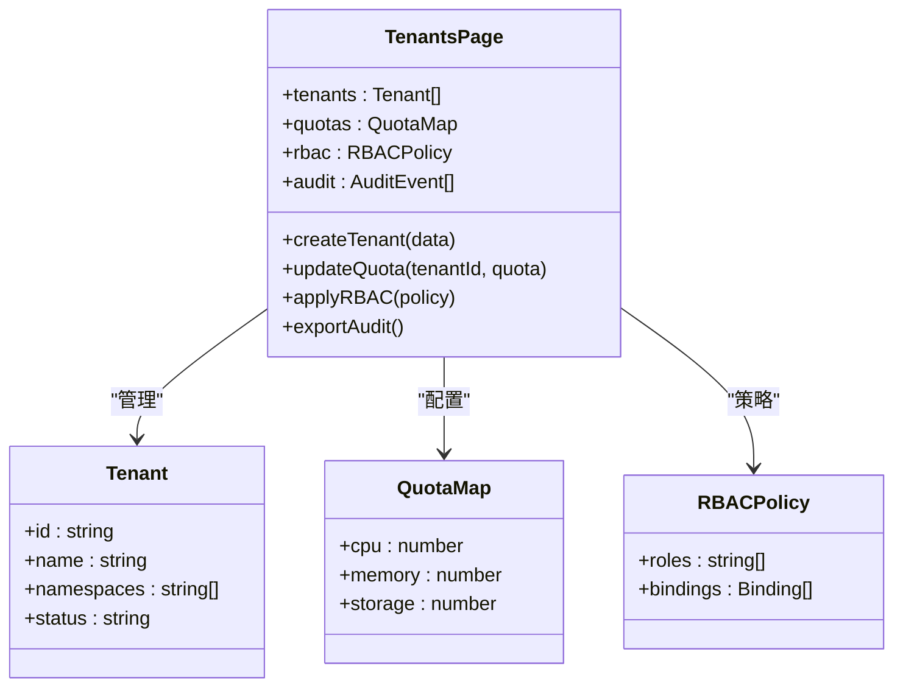

图表来源
- [web/src/pages/TenantsPage.tsx](file://web/src/pages/TenantsPage.tsx)
- [web/src/lib/api.ts](file://web/src/lib/api.ts)

章节来源
- [web/src/pages/TenantsPage.tsx](file://web/src/pages/TenantsPage.tsx)
- [web/src/lib/api.ts](file://web/src/lib/api.ts)

## 依赖关系分析
页面组件依赖通用组件与 API 客户端，类型定义贯穿数据层，形成清晰的分层与解耦。

图表来源
- [web/src/pages/ClusterDashboard.tsx](file://web/src/pages/ClusterDashboard.tsx)
- [web/src/pages/DeploymentsPage.tsx](file://web/src/pages/DeploymentsPage.tsx)
- [web/src/pages/NodesPage.tsx](file://web/src/pages/NodesPage.tsx)
- [web/src/pages/PodsPage.tsx](file://web/src/pages/PodsPage.tsx)
- [web/src/pages/ServicesPage.tsx](file://web/src/pages/ServicesPage.tsx)
- [web/src/pages/DiagnosticsPage.tsx](file://web/src/pages/DiagnosticsPage.tsx)
- [web/src/pages/MonitoringPage.tsx](file://web/src/pages/MonitoringPage.tsx)
- [web/src/pages/BackupsPage.tsx](file://web/src/pages/BackupsPage.tsx)
- [web/src/pages/TenantsPage.tsx](file://web/src/pages/TenantsPage.tsx)
- [web/src/components/ClusterSelector.tsx](file://web/src/components/ClusterSelector.tsx)
- [web/src/components/NamespaceSelector.tsx](file://web/src/components/NamespaceSelector.tsx)
- [web/src/components/RefreshButton.tsx](file://web/src/components/RefreshButton.tsx)
- [web/src/components/ServiceDetailDrawer.tsx](file://web/src/components/ServiceDetail抽屉.tsx)
- [web/src/lib/api.ts](file://web/src/lib/api.ts)
- [web/src/types/api.ts](file://web/src/types/api.ts)

章节来源
- [web/src/lib/api.ts](file://web/src/lib/api.ts)
- [web/src/types/api.ts](file://web/src/types/api.ts)

## 性能考虑
- 数据加载优化：对频繁刷新的页面（如监控、节点、Pod）采用增量更新与防抖策略，减少不必要的重渲染。
- 列表虚拟化：大数据量列表建议使用虚拟滚动，避免 DOM 节点过多导致卡顿。
- 缓存策略：对静态或低频变化的数据（如集群/命名空间列表）进行本地缓存，缩短首屏加载时间。
- 错误降级：网络异常时提供降级展示与重试机制，提升用户体验。
- 并发控制：限制并行请求数量，避免后端过载与前端阻塞。

[本节为通用指导，不直接分析具体文件]

## 故障排查指南
- 常见问题定位：
  - 数据未加载：检查 API 客户端的请求参数与鉴权头是否正确；查看网络面板的错误码。
  - 界面不更新：确认状态更新是否触发了必要的依赖变量；检查组件的 key 与列表渲染逻辑。
  - 操作失败：核对后端接口返回的错误信息；确认前置校验（如权限、配额）是否通过。
- 调试技巧：
  - 使用浏览器开发者工具的网络与性能面板定位瓶颈。
  - 在关键路径添加日志输出，追踪状态流转与副作用。
  - 利用单元测试与集成测试复现问题场景。

章节来源
- [web/src/lib/api.ts](file://web/src/lib/api.ts)
- [web/src/types/api.ts](file://web/src/types/api.ts)

## 结论
通过对 Klaw 前端各页面组件的系统化梳理，明确了每个页面的职责边界、UI 布局模式、数据展示方式与交互流程。通用组件与 API 客户端的解耦设计提升了代码复用性与可维护性。建议在后续迭代中持续完善错误处理、性能优化与可观测性，以提升整体用户体验与系统稳定性。

[本节为总结性内容，不直接分析具体文件]

## 附录
- 组件属性与事件参考：
  - ClusterSelector：属性包括当前集群、可选列表与变更回调；事件为 onClusterChange。
  - NamespaceSelector：属性包括当前命名空间、可选列表与变更回调；事件为 onNamespaceChange。
  - RefreshButton：属性包括加载状态、禁用条件与刷新回调；事件为 onClick。
  - ServiceDetailDrawer：属性包括可见性、服务标识与关闭回调；事件为 onClose。
- 状态管理最佳实践：
  - 将页面级状态与业务数据分离，避免过度耦合。
  - 使用受控组件统一处理用户输入与表单状态。
  - 对异步操作引入明确的加载与错误状态，提升可预测性。

[本节为补充信息，不直接分析具体文件]